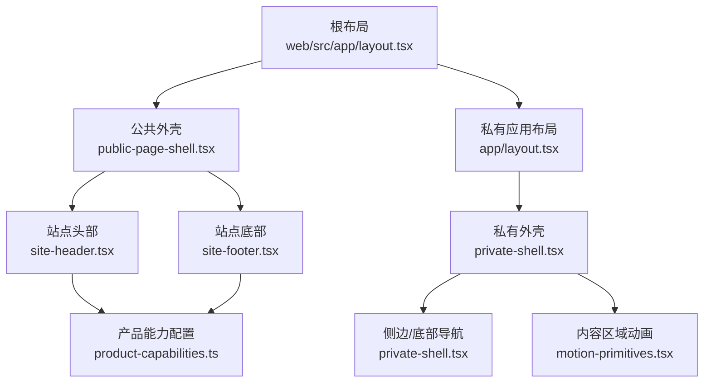
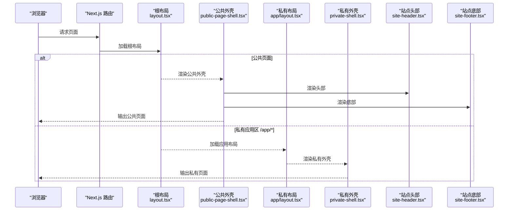
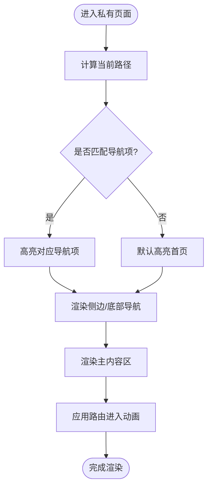
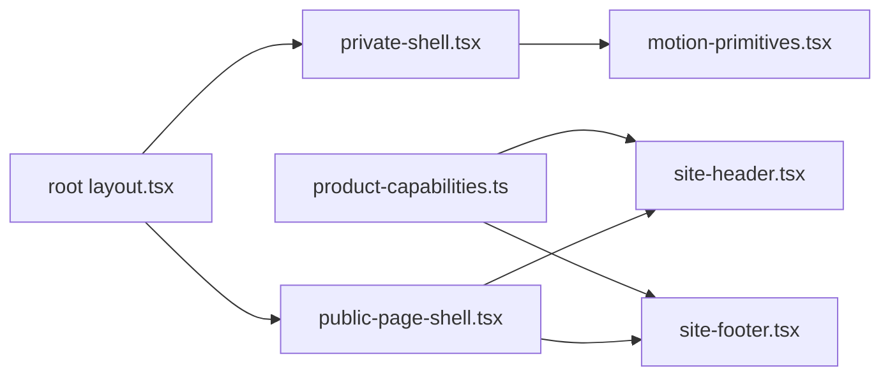

# 布局组件

<cite>
**本文引用的文件**
- [web/src/app/layout.tsx](file://web/src/app/layout.tsx)
- [web/src/app/manifest.ts](file://web/src/app/manifest.ts)
- [web/src/app/robots.ts](file://web/src/app/robots.ts)
- [web/src/app/app/layout.tsx](file://web/src/app/app/layout.tsx)
- [web/src/components/private-shell.tsx](file://web/src/components/private-shell.tsx)
- [web/src/components/public-page-shell.tsx](file://web/src/components/public-page-shell.tsx)
- [web/src/components/site-header.tsx](file://web/src/components/site-header.tsx)
- [web/src/components/site-footer.tsx](file://web/src/components/site-footer.tsx)
- [web/src/components/container.tsx](file://web/src/components/container.tsx)
- [web/src/components/motion-primitives.tsx](file://web/src/components/motion-primitives.tsx)
- [web/src/lib/product-capabilities.ts](file://web/src/lib/product-capabilities.ts)
- [web/src/components/private-shell.module.css](file://web/src/components/private-shell.module.css)
- [web/src/components/public-page-shell.module.css](file://web/src/components/public-page-shell.module.css)
- [web/src/components/site-chrome.module.css](file://web/src/components/site-chrome.module.css)
</cite>

## 目录
1. [简介](#简介)
2. [项目结构](#项目结构)
3. [核心组件](#核心组件)
4. [架构总览](#架构总览)
5. [详细组件分析](#详细组件分析)
6. [依赖关系分析](#依赖关系分析)
7. [性能与可访问性](#性能与可访问性)
8. [故障排查指南](#故障排查指南)
9. [结论](#结论)
10. [附录：主题定制与样式覆盖](#附录：主题定制与样式覆盖)

## 简介
本文件聚焦于 Next.js 应用中的页面布局与外壳组件，系统性解析公共站点外壳、私有应用外壳、站点头部与底部等布局组件的设计与实现。文档涵盖响应式布局策略、移动端适配、路由级布局切换、权限控制（通过路由元数据）、SEO 与元数据管理、主题定制与样式覆盖方法，以及与 Next.js 路由系统的集成方式。目标是帮助读者快速理解并扩展项目的布局体系。

## 项目结构
本项目采用 Next.js App Router 的目录式路由组织。根布局负责全局 HTML、字体与基础元信息；公共页面使用公共外壳包裹头部与底部；私有应用区通过子路由布局挂载私有外壳，提供侧边导航与移动端底部导航。

图表来源
- [web/src/app/layout.tsx:1-33](file://web/src/app/layout.tsx#L1-L33)
- [web/src/components/public-page-shell.tsx:1-17](file://web/src/components/public-page-shell.tsx#L1-L17)
- [web/src/app/app/layout.tsx:1-19](file://web/src/app/app/layout.tsx#L1-L19)
- [web/src/components/private-shell.tsx:1-88](file://web/src/components/private-shell.tsx#L1-L88)
- [web/src/components/site-header.tsx:1-72](file://web/src/components/site-header.tsx#L1-L72)
- [web/src/components/site-footer.tsx:1-65](file://web/src/components/site-footer.tsx#L1-L65)
- [web/src/lib/product-capabilities.ts:1-140](file://web/src/lib/product-capabilities.ts#L1-L140)
- [web/src/components/motion-primitives.tsx:1-218](file://web/src/components/motion-primitives.tsx#L1-L218)

章节来源
- [web/src/app/layout.tsx:1-33](file://web/src/app/layout.tsx#L1-L33)
- [web/src/app/app/layout.tsx:1-19](file://web/src/app/app/layout.tsx#L1-L19)

## 核心组件
- 根布局：定义语言、全局样式、站点标题模板、描述、视口与 PWA 相关元数据。
- 公共外壳：组合站点头部与底部，承载公共页面内容。
- 私有外壳：包含品牌标识、返回公共首页入口、左侧归档标签与导航、主内容区以及移动端底部导航。
- 站点头部：展示主导航与辅助导航，基于产品能力配置渲染当前激活项。
- 站点底部：展示品牌介绍、核心应用链接、方法与说明、法律链接等。
- 容器：统一内容宽度与间距。
- 动效原语：提供路由进入动画与减少动效兼容。

章节来源
- [web/src/app/layout.tsx:1-33](file://web/src/app/layout.tsx#L1-L33)
- [web/src/components/public-page-shell.tsx:1-17](file://web/src/components/public-page-shell.tsx#L1-L17)
- [web/src/components/private-shell.tsx:1-88](file://web/src/components/private-shell.tsx#L1-L88)
- [web/src/components/site-header.tsx:1-72](file://web/src/components/site-header.tsx#L1-L72)
- [web/src/components/site-footer.tsx:1-65](file://web/src/components/site-footer.tsx#L1-L65)
- [web/src/components/container.tsx:1-10](file://web/src/components/container.tsx#L1-L10)
- [web/src/components/motion-primitives.tsx:1-218](file://web/src/components/motion-primitives.tsx#L1-L218)

## 架构总览
下图展示了从根布局到具体页面的渲染路径，以及不同路由下的布局切换逻辑。

图表来源
- [web/src/app/layout.tsx:1-33](file://web/src/app/layout.tsx#L1-L33)
- [web/src/components/public-page-shell.tsx:1-17](file://web/src/components/public-page-shell.tsx#L1-L17)
- [web/src/app/app/layout.tsx:1-19](file://web/src/app/app/layout.tsx#L1-L19)
- [web/src/components/private-shell.tsx:1-88](file://web/src/components/private-shell.tsx#L1-L88)
- [web/src/components/site-header.tsx:1-72](file://web/src/components/site-header.tsx#L1-L72)
- [web/src/components/site-footer.tsx:1-65](file://web/src/components/site-footer.tsx#L1-L65)

## 详细组件分析

### 根布局与 SEO/元数据
- 语言与全局样式：设置中文语言与全局 CSS。
- 站点元信息：定义默认标题、标题模板、描述与应用名称。
- 视口与主题色：设置设备宽度、缩放、颜色方案与主题色，便于移动端与系统 UI 一致。
- PWA 清单：独立文件定义应用名、启动页、显示模式与主题色。
- robots 规则：允许爬取公开页面，禁止索引私有区域与 API。

章节来源
- [web/src/app/layout.tsx:1-33](file://web/src/app/layout.tsx#L1-L33)
- [web/src/app/manifest.ts:1-16](file://web/src/app/manifest.ts#L1-L16)
- [web/src/app/robots.ts:1-14](file://web/src/app/robots.ts#L1-L14)

### 公共页面外壳
- 职责：将页面内容置于深色背景容器中，并在顶部与底部分别插入站点头部与底部。
- 优点：公共页面统一视觉基调，便于后续扩展更多公共区块。

章节来源
- [web/src/components/public-page-shell.tsx:1-17](file://web/src/components/public-page-shell.tsx#L1-L17)
- [web/src/components/public-page-shell.module.css:1-6](file://web/src/components/public-page-shell.module.css#L1-L6)

### 站点头部
- 导航数据来源：来自产品能力配置，确保导航与业务能力同步。
- 激活态判断：根据当前路径前缀匹配高亮当前项。
- 辅助导航：方法与边界、价格与交付、账户等快捷入口。
- 响应式：小屏下网格重排，隐藏次要链接，保留关键操作。

章节来源
- [web/src/components/site-header.tsx:1-72](file://web/src/components/site-header.tsx#L1-L72)
- [web/src/lib/product-capabilities.ts:1-140](file://web/src/lib/product-capabilities.ts#L1-L140)
- [web/src/components/site-chrome.module.css:1-461](file://web/src/components/site-chrome.module.css#L1-L461)

### 站点底部
- 品牌与声明：品牌符号、文案与平台承诺。
- 核心应用与方法说明：从产品能力配置生成链接。
- 法律链接：使用条款、隐私政策与支持中心。
- 响应式：多列布局在大屏展开，小屏堆叠。

章节来源
- [web/src/components/site-footer.tsx:1-65](file://web/src/components/site-footer.tsx#L1-L65)
- [web/src/lib/product-capabilities.ts:1-140](file://web/src/lib/product-capabilities.ts#L1-L140)
- [web/src/components/site-chrome.module.css:1-461](file://web/src/components/site-chrome.module.css#L1-L461)

### 私有应用外壳
- 结构：顶部品牌与返回公共首页、左侧“私人档案区”与导航、主内容区、移动端底部导航。
- 导航：固定列表，支持当前路径高亮与子路径匹配。
- 可访问性：提供“跳到主要内容”的跳过链接，为屏幕阅读器优化。
- 动效：内容区使用路由进入动画，提升切换体验。
- 响应式：大屏显示侧边栏，小屏隐藏侧边栏并启用底部导航。

图表来源
- [web/src/components/private-shell.tsx:1-88](file://web/src/components/private-shell.tsx#L1-L88)
- [web/src/components/motion-primitives.tsx:193-218](file://web/src/components/motion-primitives.tsx#L193-L218)

章节来源
- [web/src/components/private-shell.tsx:1-88](file://web/src/components/private-shell.tsx#L1-L88)
- [web/src/components/private-shell.module.css:1-331](file://web/src/components/private-shell.module.css#L1-L331)
- [web/src/components/motion-primitives.tsx:1-218](file://web/src/components/motion-primitives.tsx#L1-L218)

### 容器与通用样式
- 容器：统一最大宽度与内边距，保证内容可读性。
- 样式模块：各布局组件通过 CSS Modules 隔离样式，避免全局污染。

章节来源
- [web/src/components/container.tsx:1-10](file://web/src/components/container.tsx#L1-L10)
- [web/src/components/ui.module.css](file://web/src/components/ui.module.css)

## 依赖关系分析
- 产品能力配置驱动公共导航与底部链接，确保 UI 与业务能力一致。
- 私有外壳依赖 Next 导航钩子获取当前路径，用于导航高亮与内容动画 key。
- 动效原语被私有外壳引用，提供路由切换时的入场动画。
- 根布局引入全局字体与样式，影响所有子布局。

图表来源
- [web/src/lib/product-capabilities.ts:1-140](file://web/src/lib/product-capabilities.ts#L1-L140)
- [web/src/components/site-header.tsx:1-72](file://web/src/components/site-header.tsx#L1-L72)
- [web/src/components/site-footer.tsx:1-65](file://web/src/components/site-footer.tsx#L1-L65)
- [web/src/components/private-shell.tsx:1-88](file://web/src/components/private-shell.tsx#L1-L88)
- [web/src/components/motion-primitives.tsx:1-218](file://web/src/components/motion-primitives.tsx#L1-L218)
- [web/src/app/layout.tsx:1-33](file://web/src/app/layout.tsx#L1-L33)
- [web/src/components/public-page-shell.tsx:1-17](file://web/src/components/public-page-shell.tsx#L1-L17)

章节来源
- [web/src/lib/product-capabilities.ts:1-140](file://web/src/lib/product-capabilities.ts#L1-L140)
- [web/src/components/private-shell.tsx:1-88](file://web/src/components/private-shell.tsx#L1-L88)
- [web/src/components/site-header.tsx:1-72](file://web/src/components/site-header.tsx#L1-L72)
- [web/src/components/site-footer.tsx:1-65](file://web/src/components/site-footer.tsx#L1-L65)

## 性能与可访问性
- 性能
  - 使用 CSS Modules 隔离样式，减少冲突与冗余。
  - 响应式布局通过媒体查询与弹性/网格布局自适应，避免复杂 JS 计算。
  - 动效仅在非减少动效环境下启用，并提供降级方案。
  - 私有应用区强制动态渲染与禁用缓存，确保用户数据实时性。
- 可访问性
  - 提供“跳到主要内容”的跳过链接，改善键盘与读屏体验。
  - 导航与链接使用语义化标签与 aria-label。
  - 当前页面状态通过 aria-current 标注，增强可识别性。
  - 尊重系统减少动效偏好，关闭不必要的过渡与滤镜。

章节来源
- [web/src/app/app/layout.tsx:1-19](file://web/src/app/app/layout.tsx#L1-L19)
- [web/src/components/private-shell.tsx:1-88](file://web/src/components/private-shell.tsx#L1-L88)
- [web/src/components/site-header.tsx:1-72](file://web/src/components/site-header.tsx#L1-L72)
- [web/src/components/motion-primitives.tsx:1-218](file://web/src/components/motion-primitives.tsx#L1-L218)

## 故障排查指南
- 导航高亮异常
  - 检查当前路径是否与导航项前缀匹配，确认 isCurrentDestination 或 activePrefixes 逻辑。
  - 确认 usePathname 返回值与预期一致。
- 移动端底部导航不显示
  - 检查媒体查询断点与 .mobileNav 样式是否生效。
  - 确认安全区域 inset 未遮挡底部内容。
- 头部/底部样式错乱
  - 检查 CSS Modules 类名是否正确引入，避免全局样式覆盖。
  - 确认容器宽度与内边距未被父级覆盖。
- SEO 未生效
  - 检查根布局的 metadata 与 viewport 配置。
  - 确认 robots 规则与 manifest 配置正确。
- 私有区域被搜索引擎索引
  - 检查 app/layout.tsx 中 robots 元数据与根 robots.ts 规则。

章节来源
- [web/src/components/private-shell.tsx:1-88](file://web/src/components/private-shell.tsx#L1-L88)
- [web/src/components/site-chrome.module.css:1-461](file://web/src/components/site-chrome.module.css#L1-L461)
- [web/src/app/layout.tsx:1-33](file://web/src/app/layout.tsx#L1-L33)
- [web/src/app/robots.ts:1-14](file://web/src/app/robots.ts#L1-L14)
- [web/src/app/app/layout.tsx:1-19](file://web/src/app/app/layout.tsx#L1-L19)

## 结论
该布局体系以 Next.js App Router 为基础，通过根布局、公共外壳与私有外壳的组合，实现了清晰的页面结构与可扩展的导航机制。产品能力配置驱动公共导航与底部链接，确保 UI 与业务一致性。响应式策略兼顾桌面与移动体验，动效与可访问性得到充分考虑。通过路由级布局切换与元数据管理，既保证了用户体验，也满足了 SEO 与 PWA 需求。

## 附录：主题定制与样式覆盖
- 主题变量
  - 使用 CSS 自定义属性（如 --ink-950、--ivory-50、--gold-400）集中管理色彩与阴影，便于全局替换。
  - 在根样式或设计系统中定义这些变量，即可统一调整全站主题。
- 样式覆盖建议
  - 优先通过 CSS Modules 的类名叠加进行局部覆盖，避免破坏其他组件样式。
  - 对容器宽度与间距，可通过传入 className 给 Container 组件进行微调。
  - 针对头部与底部，可在 site-chrome.module.css 中调整媒体查询断点与网格布局。
- 动效与减少动效
  - 动效由 motion-primitives 统一管理，遵循 prefers-reduced-motion 策略。
  - 如需调整动画时长或缓动，修改 motionDurations 与 easeOutExpo。
- 与 Next.js 路由系统集成
  - 根布局负责全局元数据与字体；子布局通过嵌套布局切换外壳。
  - 私有应用区通过 app/layout.tsx 注入 PrivateShell，实现路由级布局切换。
  - 导航高亮与激活态由 usePathname 与产品能力配置共同决定。

章节来源
- [web/src/components/private-shell.module.css:1-331](file://web/src/components/private-shell.module.css#L1-L331)
- [web/src/components/site-chrome.module.css:1-461](file://web/src/components/site-chrome.module.css#L1-L461)
- [web/src/components/motion-primitives.tsx:1-218](file://web/src/components/motion-primitives.tsx#L1-L218)
- [web/src/app/app/layout.tsx:1-19](file://web/src/app/app/layout.tsx#L1-L19)
- [web/src/components/container.tsx:1-10](file://web/src/components/container.tsx#L1-L10)