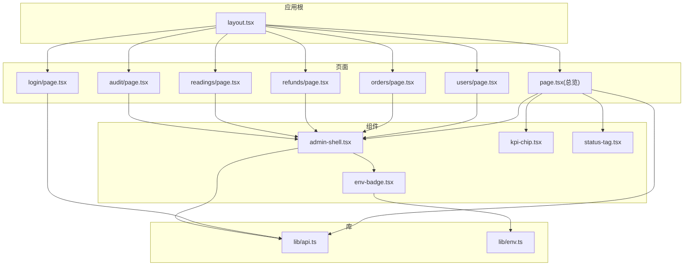
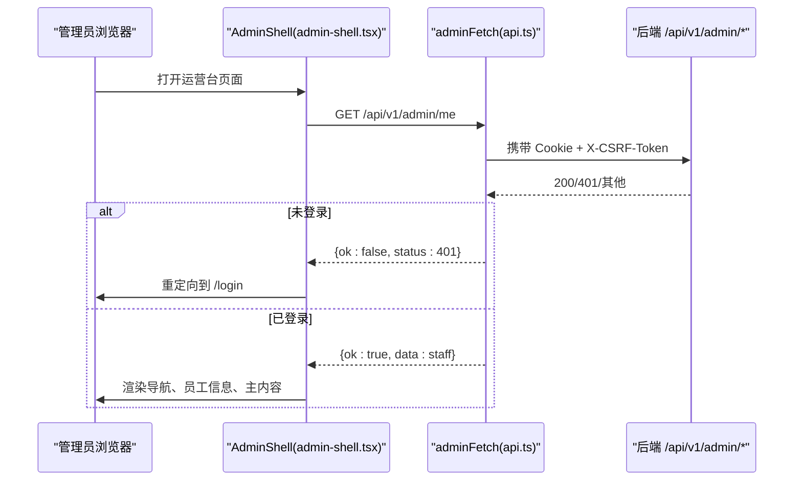
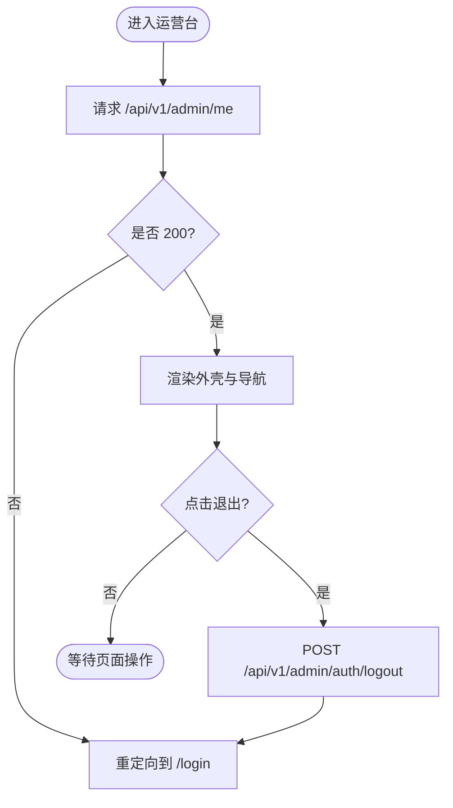
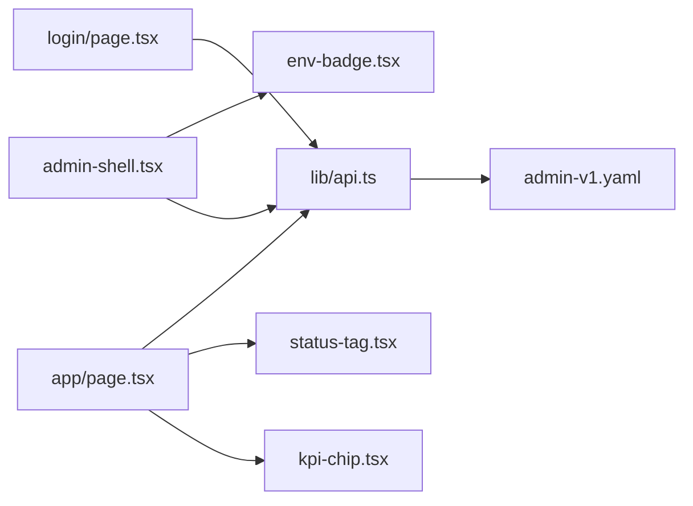

# 管理后台组件

<cite>
**本文引用的文件**
- [admin-shell.tsx](file://admin/src/components/admin-shell.tsx)
- [kpi-chip.tsx](file://admin/src/components/kpi-chip.tsx)
- [status-tag.tsx](file://admin/src/components/status-tag.tsx)
- [env-badge.tsx](file://admin/src/components/env-badge.tsx)
- [api.ts](file://admin/src/lib/api.ts)
- [env.ts](file://admin/src/lib/env.ts)
- [admin-shell.module.css](file://admin/src/components/admin-shell.module.css)
- [ui.module.css](file://admin/src/components/ui.module.css)
- [layout.tsx](file://admin/src/app/layout.tsx)
- [page.tsx](file://admin/src/app/page.tsx)
- [login/page.tsx](file://admin/src/app/login/page.tsx)
- [users/page.tsx](file://admin/src/app/users/page.tsx)
- [orders/page.tsx](file://admin/src/app/orders/page.tsx)
- [refunds/page.tsx](file://admin/src/app/refunds/page.tsx)
- [readings/page.tsx](file://admin/src/app/readings/page.tsx)
- [audit/page.tsx](file://admin/src/app/audit/page.tsx)
- [admin-v1.yaml](file://contracts/openapi/admin-v1.yaml)
</cite>

## 目录
1. [简介](#简介)
2. [项目结构](#项目结构)
3. [核心组件](#核心组件)
4. [架构总览](#架构总览)
5. [详细组件分析](#详细组件分析)
6. [依赖关系分析](#依赖关系分析)
7. [性能与可访问性](#性能与可访问性)
8. [故障排查指南](#故障排查指南)
9. [结论](#结论)
10. [附录：API 集成与扩展](#附录api-集成与扩展)

## 简介
本文件面向“FateRadar 运营台”的管理后台前端，系统性解析管理外壳、KPI 指标卡片、状态标签、环境标识等专用组件，说明管理员操作界面的设计模式与用户体验优化策略，解释数据展示组件的可配置性与扩展方式，并给出权限控制与审计日志的 UI 实现要点、样式定制与主题支持方法，以及与管理系统 API 的集成规范。

## 项目结构
管理后台基于 Next.js App Router 组织页面与组件，采用“壳 + 页面 + 通用 UI 组件 + 统一 API 客户端”的分层结构：
- 应用根布局负责元信息、字体与全局样式注入。
- 页面按功能域划分（总览、用户、订单、退款、解读任务、审计）。
- 通用组件提供一致的视觉与交互基线（外壳、KPI、状态标签、环境标识）。
- 统一 API 客户端封装认证、CSRF、错误归一化与类型定义。

图表来源
- [layout.tsx:1-38](file://admin/src/app/layout.tsx#L1-L38)
- [page.tsx:1-83](file://admin/src/app/page.tsx#L1-L83)
- [admin-shell.tsx:1-116](file://admin/src/components/admin-shell.tsx#L1-L116)
- [kpi-chip.tsx:1-20](file://admin/src/components/kpi-chip.tsx#L1-L20)
- [status-tag.tsx:1-21](file://admin/src/components/status-tag.tsx#L1-L21)
- [env-badge.tsx:1-17](file://admin/src/components/env-badge.tsx#L1-L17)
- [api.ts:1-80](file://admin/src/lib/api.ts#L1-L80)
- [env.ts:1-10](file://admin/src/lib/env.ts#L1-L10)

章节来源
- [layout.tsx:1-38](file://admin/src/app/layout.tsx#L1-L38)
- [page.tsx:1-83](file://admin/src/app/page.tsx#L1-L83)

## 核心组件
- 管理外壳 AdminShell：提供顶部品牌区、环境标识、当前员工信息与退出；左侧导航；页面标题与职责描述；加载错误提示；无障碍跳转链接。
- KPI 指标卡片 KpiChip：以网格形式展示关键指标，支持占位标记。
- 状态标签 StatusTag：统一的语义化状态标签（待处理、成功、错误、中性）。
- 环境标识 EnvBadge：根据部署环境渲染不同样式与文案，生产环境高亮警示。
- 统一 API 客户端 adminFetch：自动附加 CSRF、同源凭据、无缓存；统一错误体解析；返回结构化结果。
- 环境变量读取 getDeployEnv：从构建期环境变量安全地解析部署环境。

章节来源
- [admin-shell.tsx:1-116](file://admin/src/components/admin-shell.tsx#L1-L116)
- [kpi-chip.tsx:1-20](file://admin/src/components/kpi-chip.tsx#L1-L20)
- [status-tag.tsx:1-21](file://admin/src/components/status-tag.tsx#L1-L21)
- [env-badge.tsx:1-17](file://admin/src/components/env-badge.tsx#L1-L17)
- [api.ts:1-80](file://admin/src/lib/api.ts#L1-L80)
- [env.ts:1-10](file://admin/src/lib/env.ts#L1-L10)

## 架构总览
管理后台遵循“壳-页-组件-库”分层：
- 壳（AdminShell）负责会话校验、导航与页面框架。
- 页面（如总览）负责数据获取与展示编排。
- 组件（KpiChip、StatusTag、EnvBadge）负责可复用展示逻辑。
- 库（api.ts、env.ts）负责跨页面能力（认证、CSRF、环境）。

图表来源
- [admin-shell.tsx:36-59](file://admin/src/components/admin-shell.tsx#L36-L59)
- [api.ts:43-79](file://admin/src/lib/api.ts#L43-L79)
- [admin-v1.yaml:55-68](file://contracts/openapi/admin-v1.yaml#L55-L68)

## 详细组件分析

### 管理外壳 AdminShell
- 职责
  - 启动时调用 /api/v1/admin/me 校验会话，失败则跳转到登录页。
  - 渲染品牌区、环境标识、员工信息与退出按钮。
  - 渲染固定导航项，并根据当前路径高亮。
  - 渲染页面标题、职责描述与加载错误提示。
- 交互流程
  - 首次挂载发起会话检查；登出调用 /api/v1/admin/auth/logout 并跳转登录。
- 可访问性
  - 提供“跳到主内容”的跳过链接，提升键盘导航体验。
- 样式与主题
  - 使用 CSS 变量与响应式网格布局，适配桌面端侧边导航。

图表来源
- [admin-shell.tsx:36-59](file://admin/src/components/admin-shell.tsx#L36-L59)
- [admin-v1.yaml:41-54](file://contracts/openapi/admin-v1.yaml#L41-L54)

章节来源
- [admin-shell.tsx:1-116](file://admin/src/components/admin-shell.tsx#L1-L116)
- [admin-shell.module.css:17-162](file://admin/src/components/admin-shell.module.css#L17-L162)

### KPI 指标卡片 KpiChip
- 职责
  - 以网格卡片展示指标值与标签，支持 isStub 标记占位数据。
- 可配置性
  - label/value 由上层数据驱动；isStub 用于显示“待接入”提示。
- 样式
  - 通过 ui.module.css 中的 .kpiGrid/.kpi 实现自适应网格与卡片样式。

章节来源
- [kpi-chip.tsx:1-20](file://admin/src/components/kpi-chip.tsx#L1-L20)
- [ui.module.css:102-139](file://admin/src/components/ui.module.css#L102-L139)
- [page.tsx:50-58](file://admin/src/app/page.tsx#L50-L58)

### 状态标签 StatusTag
- 职责
  - 将业务状态映射为统一标签样式（pending/success/error/neutral）。
- 扩展点
  - 新增状态可在 Tone 类型与映射表中扩展。
- 样式
  - 通过 .tagPending/.tagSuccess/.tagError/.tagNeutral 区分语义。

章节来源
- [status-tag.tsx:1-21](file://admin/src/components/status-tag.tsx#L1-L21)
- [ui.module.css:141-169](file://admin/src/components/ui.module.css#L141-L169)

### 环境标识 EnvBadge
- 职责
  - 读取部署环境并渲染对应文案；生产环境使用强调样式。
- 数据来源
  - 通过 getDeployEnv() 读取 NEXT_PUBLIC_MINGLI_ENV。
- 样式
  - 生产环境额外添加 .envProd 类名进行视觉强调。

章节来源
- [env-badge.tsx:1-17](file://admin/src/components/env-badge.tsx#L1-L17)
- [env.ts:1-10](file://admin/src/lib/env.ts#L1-L10)
- [ui.module.css:171-190](file://admin/src/components/ui.module.css#L171-L190)

### 登录页 login
- 职责
  - 提交邮箱与密码至 /api/v1/admin/auth/login，成功后跳转首页。
- 错误处理
  - 统一使用 adminFetch 的错误体 title 展示。
- 安全
  - 使用同源凭据与 CSRF 头保护写操作。

章节来源
- [login/page.tsx:1-82](file://admin/src/app/login/page.tsx#L1-L82)
- [api.ts:43-79](file://admin/src/lib/api.ts#L43-L79)
- [admin-v1.yaml:15-40](file://contracts/openapi/admin-v1.yaml#L15-L40)

### 总览页 page（运营台首页）
- 职责
  - 拉取 /api/v1/admin/overview，渲染 KPI 网格与工作队列。
- 占位策略
  - 当 is_stub 为真时，UI 明确标注“待接入”，避免误导。
- 交互
  - 首次加载即拉取数据；失败或 401 时显示友好提示。

章节来源
- [page.tsx:1-83](file://admin/src/app/page.tsx#L1-L83)
- [admin-v1.yaml:69-82](file://contracts/openapi/admin-v1.yaml#L69-L82)

### 其他管理页面（用户、订单、退款、解读任务、审计）
- 现状
  - 均使用 AdminShell 包裹，预留占位内容，标注后续对接阶段。
- 扩展建议
  - 在 Phase B/C 中接入相应列表、筛选、分页与写操作。

章节来源
- [users/page.tsx:1-13](file://admin/src/app/users/page.tsx#L1-L13)
- [orders/page.tsx:1-13](file://admin/src/app/orders/page.tsx#L1-L13)
- [refunds/page.tsx:1-13](file://admin/src/app/refunds/page.tsx#L1-L13)
- [readings/page.tsx:1-13](file://admin/src/app/readings/page.tsx#L1-L13)
- [audit/page.tsx:1-13](file://admin/src/app/audit/page.tsx#L1-L13)

## 依赖关系分析
- 组件耦合
  - AdminShell 依赖 api.ts（会话与会话注销）、env-badge.tsx（环境标识）。
  - 总览页依赖 kpi-chip.tsx、status-tag.tsx、api.ts。
  - 登录页依赖 api.ts。
- 外部契约
  - 所有接口遵循 contracts/openapi/admin-v1.yaml 定义的请求/响应结构与错误格式。

图表来源
- [admin-shell.tsx:1-116](file://admin/src/components/admin-shell.tsx#L1-L116)
- [page.tsx:1-83](file://admin/src/app/page.tsx#L1-L83)
- [login/page.tsx:1-82](file://admin/src/app/login/page.tsx#L1-L82)
- [api.ts:1-80](file://admin/src/lib/api.ts#L1-L80)
- [admin-v1.yaml:1-231](file://contracts/openapi/admin-v1.yaml#L1-L231)

章节来源
- [api.ts:1-80](file://admin/src/lib/api.ts#L1-L80)
- [admin-v1.yaml:1-231](file://contracts/openapi/admin-v1.yaml#L1-L231)

## 性能与可访问性
- 性能
  - 使用 no-store 缓存策略避免过期数据。
  - 登录与概览均为轻量请求，首屏渲染快速。
  - 骨架/占位数据减少白屏时间，提升感知速度。
- 可访问性
  - 提供“跳到主内容”的跳过链接。
  - 导航使用 aria-current 指示当前页。
  - 错误提示使用 role="alert" 及时通知屏幕阅读器。
- 主题与样式
  - 大量使用 CSS 变量（颜色、圆角、阴影、动效时长），便于主题切换与品牌定制。
  - 响应式布局在桌面端启用侧边栏，移动端自动折叠。

章节来源
- [api.ts:55-60](file://admin/src/lib/api.ts#L55-L60)
- [admin-shell.tsx:63-110](file://admin/src/components/admin-shell.tsx#L63-L110)
- [ui.module.css:1-231](file://admin/src/components/ui.module.css#L1-L231)
- [admin-shell.module.css:17-162](file://admin/src/components/admin-shell.module.css#L17-L162)

## 故障排查指南
- 无法进入运营台
  - 现象：进入后跳转到登录页。
  - 原因：/api/v1/admin/me 返回 401。
  - 处理：确认 Cookie 存在且有效；检查后端会话与 CSRF 配置。
- 总览数据不可用
  - 现象：显示“需要登录”或“暂不可用”。
  - 原因：鉴权失败或后端返回非 200。
  - 处理：查看 adminFetch 返回的 status/title；核对后端路由与权限。
- 写操作被拒绝
  - 现象：退出或其他写操作返回 403。
  - 原因：缺少或错误的 X-CSRF-Token。
  - 处理：确保 adminFetch 自动附加 CSRF 头；检查 cookie 名称与同源设置。
- 环境标识不正确
  - 现象：环境文案与预期不符。
  - 原因：NEXT_PUBLIC_MINGLI_ENV 未正确设置或被忽略。
  - 处理：检查构建期环境变量；确认取值范围 local/test/staging/production。

章节来源
- [admin-shell.tsx:36-59](file://admin/src/components/admin-shell.tsx#L36-L59)
- [page.tsx:30-45](file://admin/src/app/page.tsx#L30-L45)
- [api.ts:43-79](file://admin/src/lib/api.ts#L43-L79)
- [env.ts:1-10](file://admin/src/lib/env.ts#L1-L10)

## 结论
管理后台以清晰的壳-页-组件-库分层实现了可扩展、可维护的运营界面。AdminShell 统一了鉴权、导航与布局；KpiChip/StatusTag/EnvBadge 提供了可复用的展示原语；统一 API 客户端屏蔽了认证与 CSRF 细节。当前处于 Phase A 占位阶段，后续可按 OpenAPI 契约逐步接入真实数据与写操作，并通过 CSS 变量完成主题定制。

## 附录：API 集成与扩展
- 认证与会话
  - 登录：POST /api/v1/admin/auth/login，成功后设置 HttpOnly 会话 Cookie。
  - 注销：POST /api/v1/admin/auth/logout，需携带 X-CSRF-Token。
  - 当前用户：GET /api/v1/admin/me，用于壳内校验与展示。
- 运营总览
  - GET /api/v1/admin/overview，返回 KPI 与工作队列；is_stub 表示占位。
- 前端集成要点
  - 使用 adminFetch 发起请求，自动附带同源凭据与 CSRF。
  - 对 401 做重定向到登录；对其他错误使用 title 展示。
  - 通过 env.ts 读取部署环境，用于 UI 提示与行为差异。
- 扩展建议
  - 新增管理页面时复用 AdminShell，保持导航与鉴权一致。
  - 新增状态或指标时，优先扩展 StatusTag/KpiChip 的 props 与样式类。
  - 通过 OpenAPI 契约约束前后端数据结构，降低集成成本。

章节来源
- [admin-v1.yaml:15-82](file://contracts/openapi/admin-v1.yaml#L15-L82)
- [api.ts:1-80](file://admin/src/lib/api.ts#L1-L80)
- [env.ts:1-10](file://admin/src/lib/env.ts#L1-L10)
- [page.tsx:30-83](file://admin/src/app/page.tsx#L30-L83)