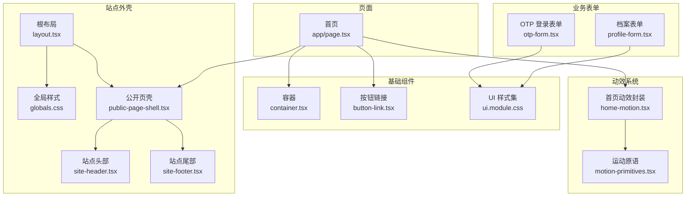
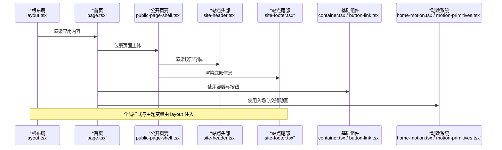
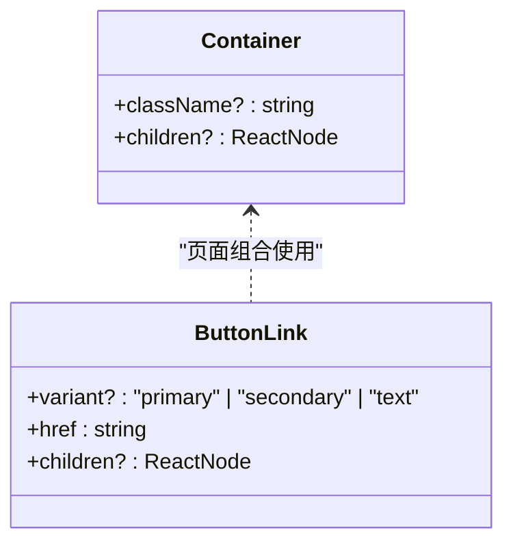
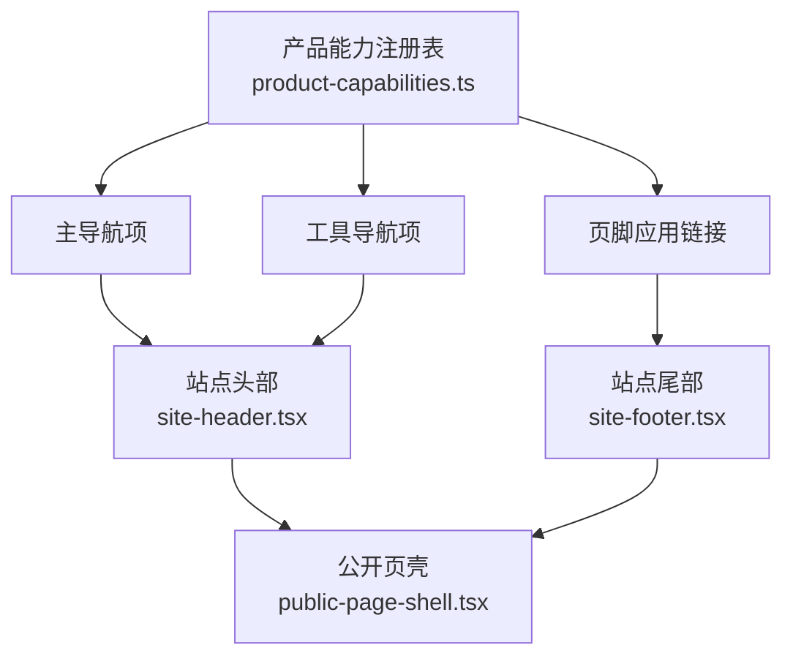
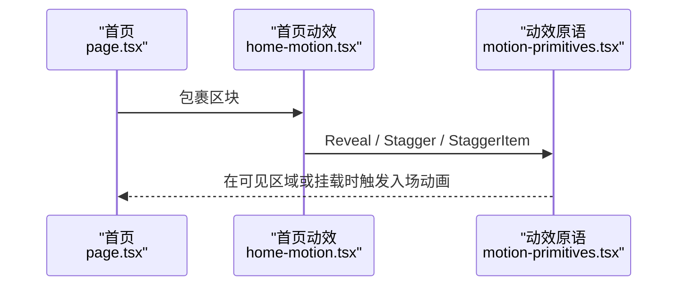
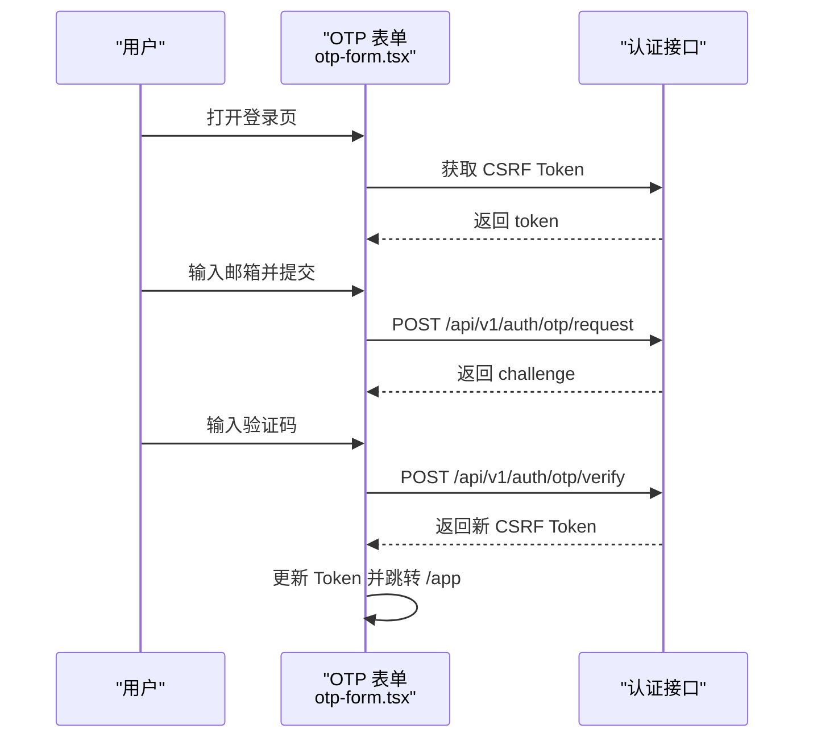
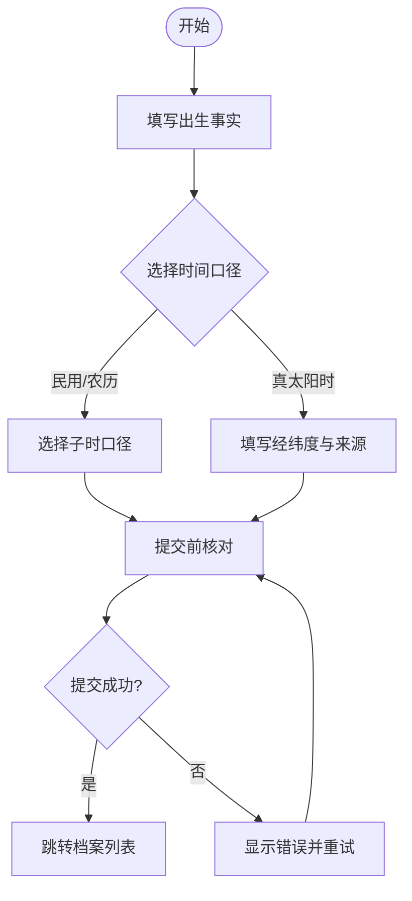
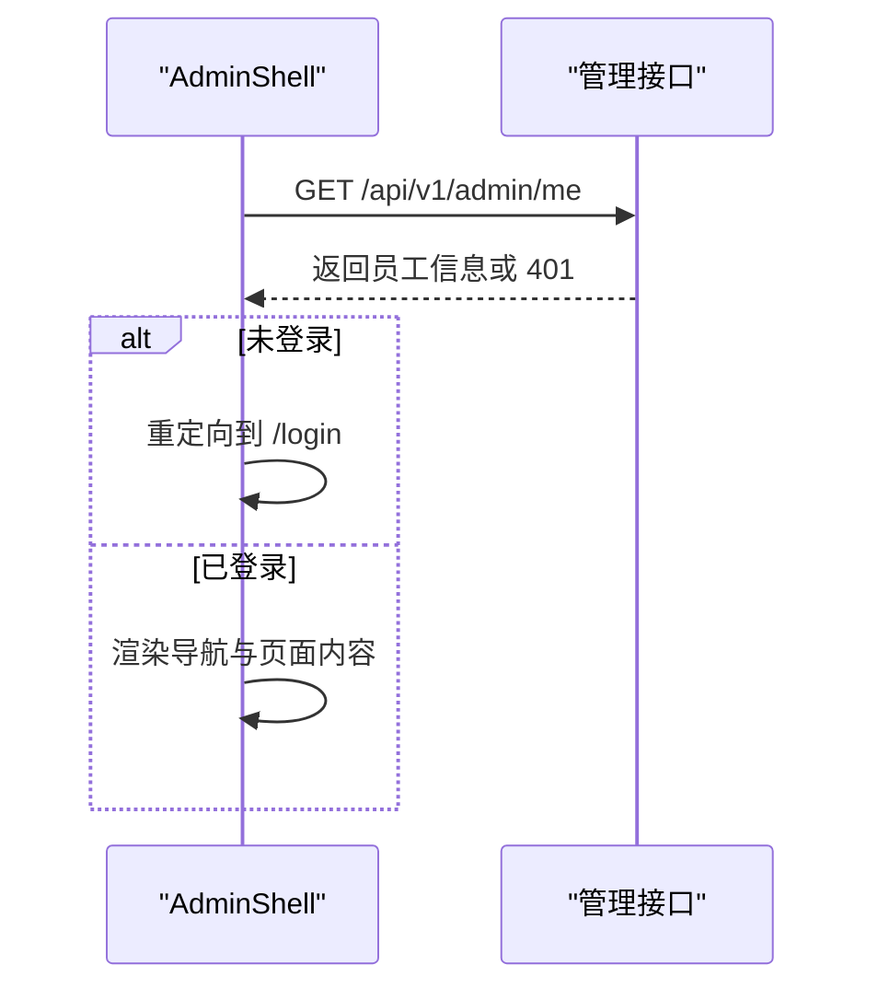
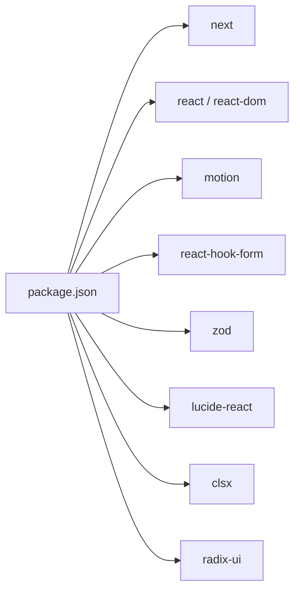

# 组件体系

<cite>
**本文引用的文件**
- [web/src/app/layout.tsx](file://web/src/app/layout.tsx)
- [web/src/app/page.tsx](file://web/src/app/page.tsx)
- [web/src/app/globals.css](file://web/src/app/globals.css)
- [web/src/components/ui.module.css](file://web/src/components/ui.module.css)
- [web/src/components/container.tsx](file://web/src/components/container.tsx)
- [web/src/components/button-link.tsx](file://web/src/components/button-link.tsx)
- [web/src/components/public-page-shell.tsx](file://web/src/components/public-page-shell.tsx)
- [web/src/components/site-header.tsx](file://web/src/components/site-header.tsx)
- [web/src/components/site-footer.tsx](file://web/src/components/site-footer.tsx)
- [web/src/components/home-motion.tsx](file://web/src/components/home-motion.tsx)
- [web/src/components/motion-primitives.tsx](file://web/src/components/motion-primitives.tsx)
- [web/src/components/otp-form.tsx](file://web/src/components/otp-form.tsx)
- [web/src/components/profile-form.tsx](file://web/src/components/profile-form.tsx)
- [web/src/lib/product-capabilities.ts](file://web/src/lib/product-capabilities.ts)
- [web/package.json](file://web/package.json)
- [admin/src/components/admin-shell.tsx](file://admin/src/components/admin-shell.tsx)
</cite>

## 目录
1. [引言](#引言)
2. [项目结构](#项目结构)
3. [核心组件](#核心组件)
4. [架构总览](#架构总览)
5. [详细组件分析](#详细组件分析)
6. [依赖关系分析](#依赖关系分析)
7. [性能考量](#性能考量)
8. [故障排查指南](#故障排查指南)
9. [结论](#结论)
10. [附录](#附录)

## 引言
本文件面向前端工程中的 React 组件体系，围绕基础组件、业务组件与页面组件的分层组织进行系统化说明。重点涵盖：
- 分层设计原则与职责边界
- 可访问性与交互体验（含 Radix UI 的引入与使用现状）
- 组件通信与状态共享机制
- 样式策略（CSS Modules、全局主题变量、动效系统）
- 可复用性设计与接口规范
- 测试策略与文档化建议
- 开发规范与最佳实践

## 项目结构
仓库采用 Next.js App Router 组织页面，公共组件集中在 web/src/components，业务领域组件按功能域拆分；管理后台位于 admin 子工程，复用部分通用模式但独立运行。

图表来源
- [web/src/app/layout.tsx:1-33](file://web/src/app/layout.tsx#L1-L33)
- [web/src/app/globals.css:1-177](file://web/src/app/globals.css#L1-L177)
- [web/src/components/public-page-shell.tsx:1-17](file://web/src/components/public-page-shell.tsx#L1-L17)
- [web/src/components/site-header.tsx:1-72](file://web/src/components/site-header.tsx#L1-L72)
- [web/src/components/site-footer.tsx:1-65](file://web/src/components/site-footer.tsx#L1-L65)
- [web/src/components/container.tsx:1-10](file://web/src/components/container.tsx#L1-L10)
- [web/src/components/button-link.tsx:1-28](file://web/src/components/button-link.tsx#L1-L28)
- [web/src/components/ui.module.css:1-92](file://web/src/components/ui.module.css#L1-L92)
- [web/src/components/home-motion.tsx:1-84](file://web/src/components/home-motion.tsx#L1-L84)
- [web/src/components/motion-primitives.tsx:1-218](file://web/src/components/motion-primitives.tsx#L1-L218)
- [web/src/components/otp-form.tsx:1-364](file://web/src/components/otp-form.tsx#L1-L364)
- [web/src/components/profile-form.tsx:1-570](file://web/src/components/profile-form.tsx#L1-L570)

章节来源
- [web/src/app/layout.tsx:1-33](file://web/src/app/layout.tsx#L1-L33)
- [web/src/app/page.tsx:1-279](file://web/src/app/page.tsx#L1-L279)
- [web/src/app/globals.css:1-177](file://web/src/app/globals.css#L1-L177)

## 核心组件
- 根布局与元信息：定义语言、标题模板、视口与主题色，统一站点级字体与全局样式入口。
- 公开页壳：组合站点头尾，为所有公开页面提供一致的 chrome。
- 容器与按钮：基础原子组件，通过 CSS Modules 与主题变量实现一致间距、圆角、阴影与交互反馈。
- 导航与产品能力注册：以单一数据源驱动主导航、工具导航与页脚，确保 UI 与产品能力同步。
- 动效系统：基于 motion/react 的 Reveal/Stagger/RouteEnter 等原语，配合“减少动态”检测，保障可访问性。
- 表单组件：OTP 登录与档案创建表单，采用 react-hook-form + zod 校验，集中处理错误、加载态与无障碍提示。

章节来源
- [web/src/app/layout.tsx:1-33](file://web/src/app/layout.tsx#L1-L33)
- [web/src/components/public-page-shell.tsx:1-17](file://web/src/components/public-page-shell.tsx#L1-L17)
- [web/src/components/container.tsx:1-10](file://web/src/components/container.tsx#L1-L10)
- [web/src/components/button-link.tsx:1-28](file://web/src/components/button-link.tsx#L1-L28)
- [web/src/lib/product-capabilities.ts:1-140](file://web/src/lib/product-capabilities.ts#L1-L140)
- [web/src/components/home-motion.tsx:1-84](file://web/src/components/home-motion.tsx#L1-L84)
- [web/src/components/motion-primitives.tsx:1-218](file://web/src/components/motion-primitives.tsx#L1-L218)
- [web/src/components/otp-form.tsx:1-364](file://web/src/components/otp-form.tsx#L1-L364)
- [web/src/components/profile-form.tsx:1-570](file://web/src/components/profile-form.tsx#L1-L570)

## 架构总览
下图展示从根布局到页面、再到基础组件与业务组件的调用关系，以及样式与动效系统的注入点。

图表来源
- [web/src/app/layout.tsx:1-33](file://web/src/app/layout.tsx#L1-L33)
- [web/src/app/page.tsx:1-279](file://web/src/app/page.tsx#L1-L279)
- [web/src/components/public-page-shell.tsx:1-17](file://web/src/components/public-page-shell.tsx#L1-L17)
- [web/src/components/site-header.tsx:1-72](file://web/src/components/site-header.tsx#L1-L72)
- [web/src/components/site-footer.tsx:1-65](file://web/src/components/site-footer.tsx#L1-L65)
- [web/src/components/container.tsx:1-10](file://web/src/components/container.tsx#L1-L10)
- [web/src/components/button-link.tsx:1-28](file://web/src/components/button-link.tsx#L1-L28)
- [web/src/components/home-motion.tsx:1-84](file://web/src/components/home-motion.tsx#L1-L84)
- [web/src/components/motion-primitives.tsx:1-218](file://web/src/components/motion-primitives.tsx#L1-L218)

## 详细组件分析

### 基础组件：容器与按钮
- 容器组件负责居中与最大宽度控制，结合响应式断点与 CSS 变量，保证在不同屏幕下的可读性。
- 按钮链接组件将路由跳转与视觉样式解耦，支持多种变体（主按钮、次按钮、文本按钮），并内置图标与过渡效果。
- 样式策略：通过 CSS Modules 隔离类名，使用全局主题变量（颜色、圆角、阴影、动效时长）保持一致性。

图表来源
- [web/src/components/container.tsx:1-10](file://web/src/components/container.tsx#L1-L10)
- [web/src/components/button-link.tsx:1-28](file://web/src/components/button-link.tsx#L1-L28)
- [web/src/components/ui.module.css:1-92](file://web/src/components/ui.module.css#L1-L92)

章节来源
- [web/src/components/container.tsx:1-10](file://web/src/components/container.tsx#L1-L10)
- [web/src/components/button-link.tsx:1-28](file://web/src/components/button-link.tsx#L1-L28)
- [web/src/components/ui.module.css:1-92](file://web/src/components/ui.module.css#L1-L92)

### 站点外壳与导航
- 公开页壳组合站点头尾，为页面提供一致的 chrome，便于统一注入 SEO、主题与可访问性元素。
- 站点头部根据产品能力注册表生成主导航与工具导航，自动高亮当前路径前缀，避免硬编码。
- 站点尾部聚合应用入口、方法与法律链接，保持对外一致性。

图表来源
- [web/src/lib/product-capabilities.ts:1-140](file://web/src/lib/product-capabilities.ts#L1-L140)
- [web/src/components/site-header.tsx:1-72](file://web/src/components/site-header.tsx#L1-L72)
- [web/src/components/site-footer.tsx:1-65](file://web/src/components/site-footer.tsx#L1-L65)
- [web/src/components/public-page-shell.tsx:1-17](file://web/src/components/public-page-shell.tsx#L1-L17)

章节来源
- [web/src/components/public-page-shell.tsx:1-17](file://web/src/components/public-page-shell.tsx#L1-L17)
- [web/src/components/site-header.tsx:1-72](file://web/src/components/site-header.tsx#L1-L72)
- [web/src/components/site-footer.tsx:1-65](file://web/src/components/site-footer.tsx#L1-L65)
- [web/src/lib/product-capabilities.ts:1-140](file://web/src/lib/product-capabilities.ts#L1-L140)

### 动效系统：入场与交错
- 原语组件提供 Reveal（滚动或挂载时淡入）、Stagger（列表交错）、RouteEnter（路由切换）等能力。
- 自动检测“减少动态”偏好与测试环境，禁用不必要的动画，提升可访问性与测试稳定性。
- 首页动效封装将原语组合为语义化标签（section/article/ol/li），兼顾结构与表现。

图表来源
- [web/src/components/home-motion.tsx:1-84](file://web/src/components/home-motion.tsx#L1-L84)
- [web/src/components/motion-primitives.tsx:1-218](file://web/src/components/motion-primitives.tsx#L1-L218)
- [web/src/app/page.tsx:1-279](file://web/src/app/page.tsx#L1-L279)

章节来源
- [web/src/components/home-motion.tsx:1-84](file://web/src/components/home-motion.tsx#L1-L84)
- [web/src/components/motion-primitives.tsx:1-218](file://web/src/components/motion-primitives.tsx#L1-L218)

### 业务表单：OTP 登录流程
- 表单阶段机：引导用户完成“获取验证码 → 输入验证码 → 建立会话 → 跳转应用”的完整流程。
- 安全与会话：先拉取 CSRF Token，再请求验证码与验证；成功后采用服务端返回的新 Token 并跳转。
- 错误与可访问性：字段级错误提示、全局错误区、aria-live/status/alert 等增强读屏体验。

图表来源
- [web/src/components/otp-form.tsx:1-364](file://web/src/components/otp-form.tsx#L1-L364)

章节来源
- [web/src/components/otp-form.tsx:1-364](file://web/src/components/otp-form.tsx#L1-L364)

### 业务表单：档案创建流程
- 多步骤表单：事实采集（时间、地点、性别）、计算口径（时间口径、子时口径、经纬度）、提交前核对。
- 校验策略：Zod 模型约束字段范围与格式，结合 react-hook-form 的 register/useWatch 联动显示预览与条件字段。
- 提交逻辑：创建草稿后确认，成功后跳转到档案列表并携带查询参数。

图表来源
- [web/src/components/profile-form.tsx:1-570](file://web/src/components/profile-form.tsx#L1-L570)

章节来源
- [web/src/components/profile-form.tsx:1-570](file://web/src/components/profile-form.tsx#L1-L570)

### 管理后台外壳
- 管理外壳负责导航、身份校验与登出；未登录时重定向至登录页，并在顶部显示环境与当前员工信息。
- 与公开站点的样式与组件风格保持一致，便于维护统一的设计语言。

图表来源
- [admin/src/components/admin-shell.tsx:1-116](file://admin/src/components/admin-shell.tsx#L1-L116)

章节来源
- [admin/src/components/admin-shell.tsx:1-116](file://admin/src/components/admin-shell.tsx#L1-L116)

## 依赖关系分析
- 运行时依赖：Next.js、React、motion、react-hook-form、zod、lucide-react、clsx、radix-ui（已声明）。
- 样式依赖：CSS Modules 与全局 CSS 变量；无 Tailwind CSS 依赖。
- 可访问性：通过语义化标签、aria-*、role、focus-visible、减少动态检测等实现；Radix UI 已引入但未在当前代码中直接使用。

图表来源
- [web/package.json:1-46](file://web/package.json#L1-L46)

章节来源
- [web/package.json:1-46](file://web/package.json#L1-L46)

## 性能考量
- 首屏与骨架：根布局仅引入必要字体与全局样式；页面按需组合组件，避免无关开销。
- 动画性能：Reveal/Stagger 仅在可见区域触发，且尊重“减少动态”设置；测试环境自动关闭动画。
- 表单性能：使用 react-hook-form 最小化重渲染；zod 校验在提交与字段变更时执行，避免昂贵计算。
- 资源优化：图标使用 lucide-react 矢量图标；CSS 变量集中管理，减少重复样式。

[本节为通用指导，不直接分析具体文件]

## 故障排查指南
- 登录失败或会话异常：检查 CSRF Token 获取与传递是否正确；确认验证码接口返回与错误消息映射。
- 表单校验不生效：确认 zod schema 与 react-hook-form 的 resolver 绑定；检查字段 id/for 与 aria-describedby 关联。
- 动画不触发或卡顿：检查 IntersectionObserver 可用性；在测试环境中确认动画被禁用。
- 导航高亮异常：核对 activePrefixes 配置与当前 pathname 匹配逻辑。

章节来源
- [web/src/components/otp-form.tsx:1-364](file://web/src/components/otp-form.tsx#L1-L364)
- [web/src/components/profile-form.tsx:1-570](file://web/src/components/profile-form.tsx#L1-L570)
- [web/src/components/motion-primitives.tsx:1-218](file://web/src/components/motion-primitives.tsx#L1-L218)
- [web/src/lib/product-capabilities.ts:1-140](file://web/src/lib/product-capabilities.ts#L1-L140)

## 结论
该组件体系以“基础组件—业务组件—页面组件”的分层组织为核心，借助 CSS Modules 与全局主题变量构建一致的视觉语言；通过单一数据源驱动导航与页脚，降低 UI 漂移风险；表单采用 react-hook-form + zod 实现强类型与良好可访问性；动效系统兼顾体验与可访问性。整体架构清晰、可扩展性强，适合持续迭代与团队协作。

[本节为总结性内容，不直接分析具体文件]

## 附录

### 样式策略与主题系统
- 全局主题变量：颜色、圆角、阴影、间距、动效时长等集中在根样式中，便于统一调整。
- CSS Modules：组件级样式隔离，避免全局污染；通过 clsx 组合类名实现变体与覆盖。
- 可访问性增强：focus-visible、减少动态、语义化标签与 aria 属性贯穿各组件。

章节来源
- [web/src/app/globals.css:1-177](file://web/src/app/globals.css#L1-L177)
- [web/src/components/ui.module.css:1-92](file://web/src/components/ui.module.css#L1-L92)

### 组件通信与状态共享
- 页面到组件：通过 props 传递数据与回调，保持单向数据流。
- 组件间通信：复杂场景可使用上下文或轻量状态库；当前项目以局部状态为主，必要时可引入集中状态管理。
- 表单状态：react-hook-form 管理本地表单状态，与后端 API 通过异步调用协调。

章节来源
- [web/src/components/profile-form.tsx:1-570](file://web/src/components/profile-form.tsx#L1-L570)
- [web/src/components/otp-form.tsx:1-364](file://web/src/components/otp-form.tsx#L1-L364)

### 可访问性与 Radix UI
- 当前实现：通过原生 HTML 语义、ARIA 属性与键盘交互满足基本可访问性需求。
- Radix UI：已在依赖中声明，可在未来替换或增强复杂控件（如对话框、下拉菜单、单选组）的可访问性与行为一致性。

章节来源
- [web/package.json:1-46](file://web/package.json#L1-L46)

### 测试策略与文档生成
- 单元测试：建议使用 vitest + @testing-library/react 对关键组件（表单、导航、动效）进行行为测试。
- 契约测试：对 API 响应与前端消费进行对齐，确保前后端契约稳定。
- 文档生成：可为组件编写 JSDoc 或使用 Storybook 展示用例；在 README 中补充使用示例与注意事项。

[本节为通用指导，不直接分析具体文件]

### 开发规范与最佳实践
- 命名与组织：组件按功能域拆分，基础组件与业务组件分离；页面组件只负责编排与数据组装。
- 样式约定：优先使用 CSS Modules 与主题变量；避免内联样式与全局类名滥用。
- 表单规范：统一使用 react-hook-form + zod；字段错误与帮助文案遵循无障碍最佳实践。
- 动效规范：仅在必要时启用动画；始终尊重“减少动态”偏好；在测试环境禁用动画。
- 可访问性：确保语义化标签、焦点顺序、键盘可达与读屏友好。

[本节为通用指导，不直接分析具体文件]