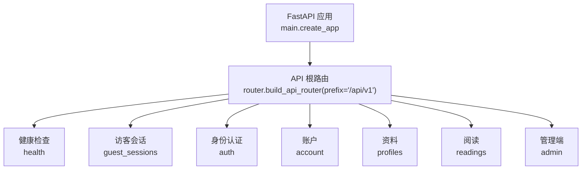
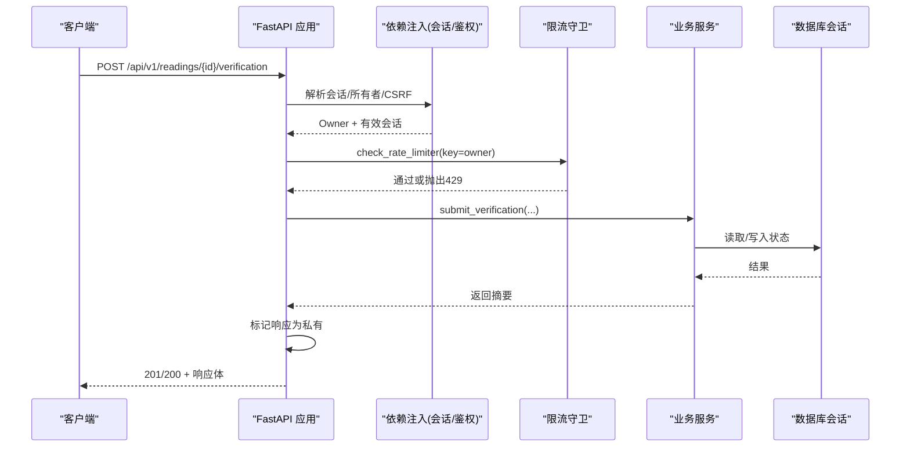
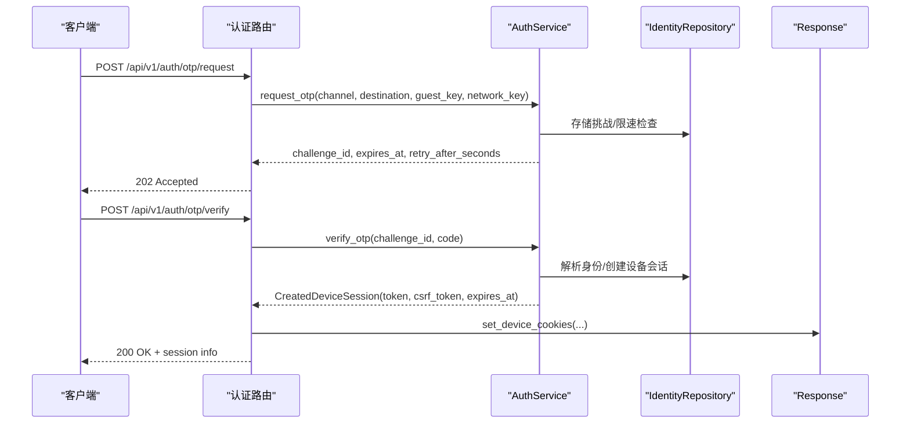
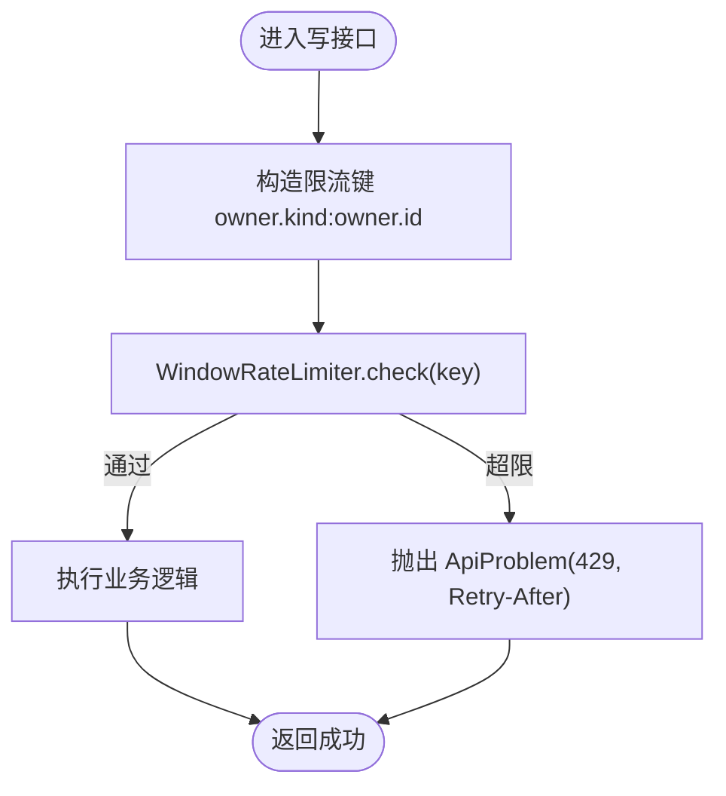
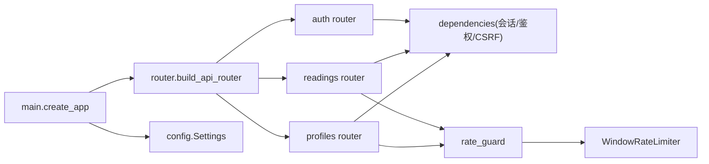

# API 层设计

<cite>
**本文引用的文件**
- [backend/app/main.py](file://backend/app/main.py)
- [backend/app/api/router.py](file://backend/app/api/router.py)
- [backend/app/api/auth.py](file://backend/app/api/auth.py)
- [backend/app/api/dependencies.py](file://backend/app/api/dependencies.py)
- [backend/app/api/errors.py](file://backend/app/api/errors.py)
- [backend/app/api/problems.py](file://backend/app/api/problems.py)
- [backend/app/api/rate_guard.py](file://backend/app/api/rate_guard.py)
- [backend/app/api/readings.py](file://backend/app/api/readings.py)
- [backend/app/api/profiles.py](file://backend/app/api/profiles.py)
- [backend/app/config.py](file://backend/app/config.py)
- [backend/app/readings/rate_limit.py](file://backend/app/readings/rate_limit.py)
- [backend/app/identity/service.py](file://backend/app/identity/service.py)
- [backend/app/identity/schemas.py](file://backend/app/identity/schemas.py)
</cite>

## 目录
1. [简介](#简介)
2. [项目结构](#项目结构)
3. [核心组件](#核心组件)
4. [架构总览](#架构总览)
5. [详细组件分析](#详细组件分析)
6. [依赖关系分析](#依赖关系分析)
7. [性能与限流](#性能与限流)
8. [故障排查指南](#故障排查指南)
9. [结论](#结论)
10. [附录：API 设计与最佳实践](#附录api-设计与最佳实践)

## 简介
本文件系统性梳理后端 API 层设计，覆盖路由组织、版本化路径、请求处理流程（参数校验、权限检查、业务调用、响应序列化）、认证授权（会话与 CSRF）、数据验证策略、速率限制、统一错误处理，以及性能优化建议。目标是帮助读者快速理解并安全扩展该 API 层。

## 项目结构
API 采用 FastAPI 模块化路由组织，所有对外接口统一挂载在 /api/v1 下，按功能域拆分为独立 Router：身份认证、账户、访客会话、资料、阅读（读盘）与管理端。应用启动时集中装配配置、中间件、异常处理器与路由。

图表来源
- [backend/app/main.py:50-56](file://backend/app/main.py#L50-L56)
- [backend/app/api/router.py:12-21](file://backend/app/api/router.py#L12-L21)

章节来源
- [backend/app/main.py:50-56](file://backend/app/main.py#L50-L56)
- [backend/app/api/router.py:12-21](file://backend/app/api/router.py#L12-L21)

## 核心组件
- 路由装配器：统一前缀 /api/v1，集中 include 各子模块路由。
- 依赖注入：数据库会话、所有者识别（用户或访客）、CSRF 校验、私有响应标记。
- 认证服务：OTP 挑战生成、验证码校验、设备会话创建与 Cookie 设置。
- 限流器：基于滑动窗口的进程内限流，按“拥有者”维度隔离。
- 错误处理：统一的 Problem JSON 格式，HTTP 状态码规范，调试信息控制。
- 配置与安全：Pydantic Settings，生产环境强制安全约束，密钥与超时等边界校验。

章节来源
- [backend/app/api/router.py:12-21](file://backend/app/api/router.py#L12-L21)
- [backend/app/api/dependencies.py:19-137](file://backend/app/api/dependencies.py#L19-L137)
- [backend/app/api/auth.py:30-161](file://backend/app/api/auth.py#L30-L161)
- [backend/app/readings/rate_limit.py:9-61](file://backend/app/readings/rate_limit.py#L9-L61)
- [backend/app/api/problems.py:5-27](file://backend/app/api/problems.py#L5-L27)
- [backend/app/config.py:62-335](file://backend/app/config.py#L62-L335)

## 架构总览
下图展示一次典型写操作的端到端流程：请求进入 -> 依赖注入与会话 -> 鉴权与 CSRF -> 限流 -> 业务服务 -> 提交事务 -> 响应序列化与隐私标记。

图表来源
- [backend/app/api/readings.py:333-361](file://backend/app/api/readings.py#L333-L361)
- [backend/app/api/dependencies.py:94-130](file://backend/app/api/dependencies.py#L94-L130)
- [backend/app/api/rate_guard.py:5-19](file://backend/app/api/rate_guard.py#L5-L19)

## 详细组件分析

### 路由组织与版本化
- 统一前缀：/api/v1，便于未来演进到 v2 而不破坏现有客户端。
- 模块化路由：按领域拆分 router，便于测试与维护。
- 健康检查：独立 health 路由，用于就绪探针。

章节来源
- [backend/app/api/router.py:12-21](file://backend/app/api/router.py#L12-L21)
- [backend/app/api/router.py:7-9](file://backend/app/api/router.py#L7-L9)

### 请求处理流程
- 参数验证：使用 Pydantic 模型进行强类型校验，禁止额外字段，确保输入清洗。
- 权限检查：通过依赖注入区分“用户”和“访客”，并对写操作强制 CSRF 双提交校验。
- 业务调用：将 Owner 与请求体传入对应 Service，Service 负责领域逻辑与一致性。
- 响应序列化：使用 response_model 输出稳定契约；对敏感响应标记私有缓存策略。

章节来源
- [backend/app/api/dependencies.py:94-130](file://backend/app/api/dependencies.py#L94-L130)
- [backend/app/api/readings.py:87-399](file://backend/app/api/readings.py#L87-L399)
- [backend/app/api/profiles.py:43-111](file://backend/app/api/profiles.py#L43-L111)
- [backend/app/identity/schemas.py:8-62](file://backend/app/identity/schemas.py#L8-L62)

### 认证与授权
- 会话模型：支持访客会话与设备会话（登录态），均通过 Cookie 传递令牌。
- CSRF 保护：写操作要求 x-csrf-token 与 Cookie 中的 CSRF Token 一致，防止跨站请求伪造。
- OTP 流程：发送验证码 -> 校验验证码 -> 创建设备会话 -> 设置 Cookie。
- 角色访问控制：当前以“拥有者”（Owner）为中心，区分 user/guest 并绑定其资源访问范围。

图表来源
- [backend/app/api/auth.py:44-161](file://backend/app/api/auth.py#L44-L161)
- [backend/app/identity/service.py:100-192](file://backend/app/identity/service.py#L100-L192)

章节来源
- [backend/app/api/auth.py:30-161](file://backend/app/api/auth.py#L30-L161)
- [backend/app/api/dependencies.py:29-130](file://backend/app/api/dependencies.py#L29-L130)
- [backend/app/identity/service.py:100-192](file://backend/app/identity/service.py#L100-L192)

### 数据验证策略
- Pydantic 模型：所有入参/出参使用 BaseModel，启用 extra="forbid" 拒绝未知字段。
- 输入清洗：字段级约束（长度、正则、枚举），如验证码六位数字、渠道枚举。
- 自定义校验：例如 IANA 时区名称校验工具函数，保证时间相关字段合法。
- 错误消息定制：通过统一问题文档格式返回可读标题与可选详情。

章节来源
- [backend/app/identity/schemas.py:8-62](file://backend/app/identity/schemas.py#L8-L62)
- [backend/app/api/validators.py:4-9](file://backend/app/api/validators.py#L4-L9)
- [backend/app/api/errors.py:1-17](file://backend/app/api/errors.py#L1-L17)
- [backend/app/api/problems.py:5-27](file://backend/app/api/problems.py#L5-L27)

### 速率限制实现
- 算法：滑动窗口计数器，记录每个 key 在 window_seconds 内的请求次数，超过 limit 即拒绝。
- 粒度：按“拥有者”维度（user/guest + id）隔离，避免单用户影响他人。
- 集成点：写操作入口统一调用 check_rate_limiter，失败返回 429 并附带 Retry-After。
- 多实例注意：当前为进程内限流，水平扩展时需考虑共享存储方案。

图表来源
- [backend/app/readings/rate_limit.py:9-61](file://backend/app/readings/rate_limit.py#L9-L61)
- [backend/app/api/rate_guard.py:5-19](file://backend/app/api/rate_guard.py#L5-L19)
- [backend/app/api/readings.py:49-55](file://backend/app/api/readings.py#L49-L55)

章节来源
- [backend/app/readings/rate_limit.py:9-61](file://backend/app/readings/rate_limit.py#L9-L61)
- [backend/app/api/rate_guard.py:5-19](file://backend/app/api/rate_guard.py#L5-L19)

### 错误处理统一方案
- 统一异常：ApiProblem 携带 status、title、problem_type、detail、headers。
- 全局处理器：注册 ApiProblem 与 RequestValidationError 的处理器，输出 application/problem+json。
- 状态码规范：400 无效请求、401 未认证、403 未授权/CSRF 失败、404 不存在、409 冲突、429 限流、503 服务不可用。
- 调试信息：OpenAPI 文档中移除 422 响应，减少暴露校验细节；request_id 可追踪请求。

章节来源
- [backend/app/api/errors.py:1-17](file://backend/app/api/errors.py#L1-L17)
- [backend/app/api/problems.py:5-27](file://backend/app/api/problems.py#L5-L27)
- [backend/app/main.py:115-151](file://backend/app/main.py#L115-L151)

## 依赖关系分析
- 主应用 main.create_app 装配 Settings、Database、各类 RateLimiter、OTP 适配器、异常处理器，并包含 API 路由。
- 路由模块依赖 dependencies 提供的会话与鉴权能力，依赖 rate_guard 做限流，依赖各自 service 完成业务。
- 配置 config.Settings 提供运行时开关与安全约束，生产环境强制启用安全 Cookie、禁用不安全适配器等。

图表来源
- [backend/app/main.py:30-156](file://backend/app/main.py#L30-L156)
- [backend/app/api/router.py:12-21](file://backend/app/api/router.py#L12-L21)
- [backend/app/api/rate_guard.py:5-19](file://backend/app/api/rate_guard.py#L5-L19)
- [backend/app/readings/rate_limit.py:9-61](file://backend/app/readings/rate_limit.py#L9-L61)

章节来源
- [backend/app/main.py:30-156](file://backend/app/main.py#L30-L156)
- [backend/app/api/router.py:12-21](file://backend/app/api/router.py#L12-L21)

## 性能与限流
- 连接与会话：异步数据库会话上下文自动回滚，避免泄漏。
- 限流策略：按拥有者维度的滑动窗口限流，抑制突发流量与滥用。
- 响应缓存：敏感响应强制私有缓存头，避免代理/浏览器缓存泄露。
- 配置边界：生产环境严格校验超时、大小、密钥等，防止资源耗尽。
- 可扩展性：当前限流为进程内，如需多实例需迁移至 Redis 等共享存储。

章节来源
- [backend/app/api/dependencies.py:19-27](file://backend/app/api/dependencies.py#L19-L27)
- [backend/app/readings/rate_limit.py:9-61](file://backend/app/readings/rate_limit.py#L9-L61)
- [backend/app/api/dependencies.py:133-137](file://backend/app/api/dependencies.py#L133-L137)
- [backend/app/config.py:188-329](file://backend/app/config.py#L188-L329)

## 故障排查指南
- 401 未认证：检查 Cookie 是否携带会话令牌，依赖 require_owner 是否正确解析。
- 403 CSRF 失败：确认请求头 x-csrf-token 与 Cookie 中的 CSRF Token 一致且哈希匹配。
- 429 限流：关注 Retry-After 头部，调整客户端重试间隔；必要时放宽限流阈值。
- 404 资源不存在：核对 ID 是否存在于当前拥有者上下文中。
- 503 服务不可用：检查 OTP 投递或运行时代依赖是否可用。
- 日志与追踪：利用 request_id 关联请求链路，结合日志级别定位问题。

章节来源
- [backend/app/api/dependencies.py:39-130](file://backend/app/api/dependencies.py#L39-L130)
- [backend/app/api/rate_guard.py:5-19](file://backend/app/api/rate_guard.py#L5-L19)
- [backend/app/api/auth.py:69-123](file://backend/app/api/auth.py#L69-L123)
- [backend/app/main.py:115-151](file://backend/app/main.py#L115-L151)

## 结论
该 API 层以模块化路由、严格的参数校验、健壮的认证与 CSRF 保护、细粒度的限流与统一错误处理为核心，形成高内聚、易扩展的后端接口体系。配合生产环境的安全配置与响应隐私标记，能够在保障安全的前提下提供稳定的服务能力。后续可按需引入分布式限流、更细粒度的 RBAC 与审计增强。

## 附录：API 设计与最佳实践
- 路由与版本
  - 统一前缀 /api/v1，新增版本时通过新前缀并行演进，避免破坏兼容。
  - 按领域拆分路由，保持单一职责与可测试性。
- 请求处理
  - 使用 Pydantic 模型进行强校验，禁止额外字段，减少脏数据流入。
  - 写操作强制 CSRF 双提交，读操作按需鉴权。
  - 对敏感响应设置私有缓存头，避免缓存泄露。
- 认证与授权
  - 会话令牌与 CSRF Token 分离存储与校验，降低劫持风险。
  - 以“拥有者”为中心的资源访问控制，天然支持用户与访客隔离。
- 限流与弹性
  - 滑动窗口限流按拥有者维度隔离，结合 Retry-After 指导客户端退避。
  - 多实例部署时考虑共享限流存储。
- 错误处理
  - 统一 Problem JSON 格式，明确状态码语义，隐藏内部细节。
  - OpenAPI 文档屏蔽 422 响应，减少暴露校验细节。
- 性能优化
  - 异步 IO、最小化事务范围、及时提交会话。
  - 合理设置超时与大小上限，防止资源被滥用。
  - 谨慎缓存，仅对非敏感数据启用缓存策略。