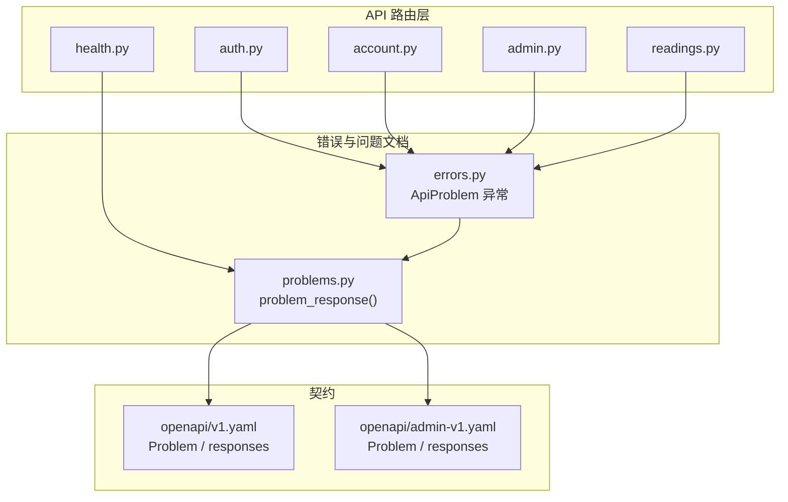
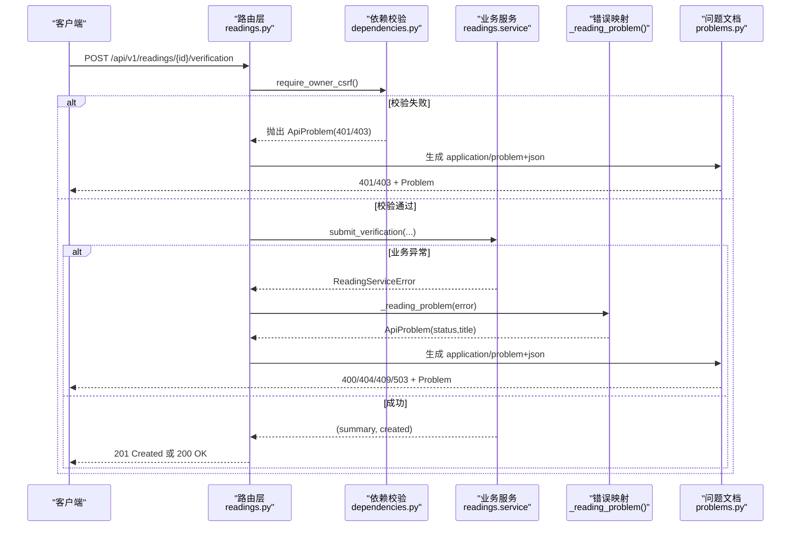
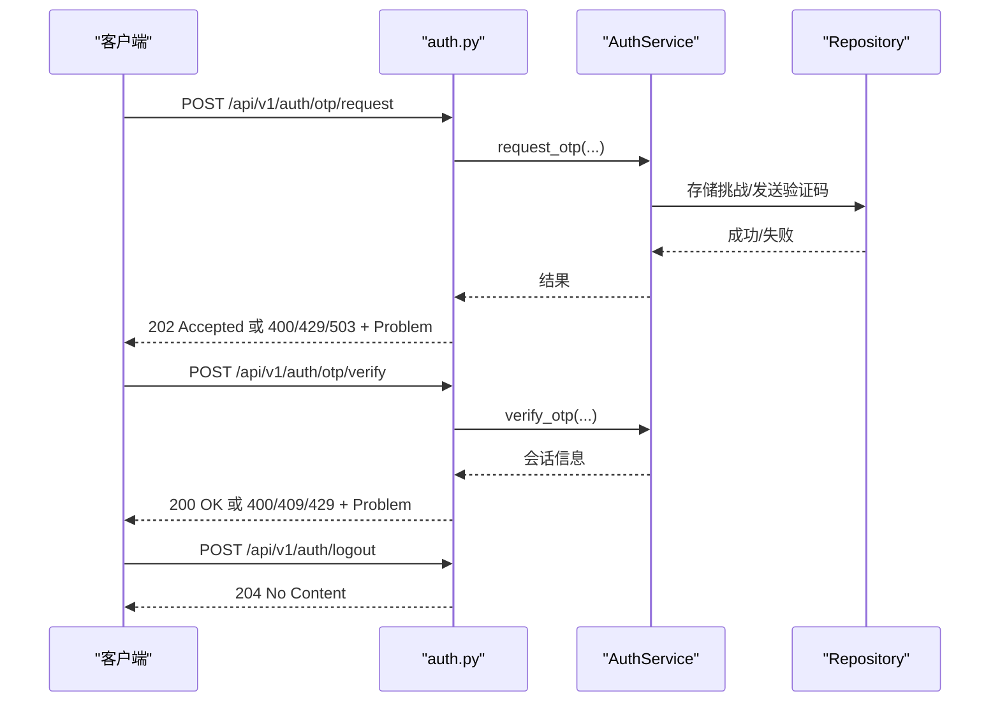
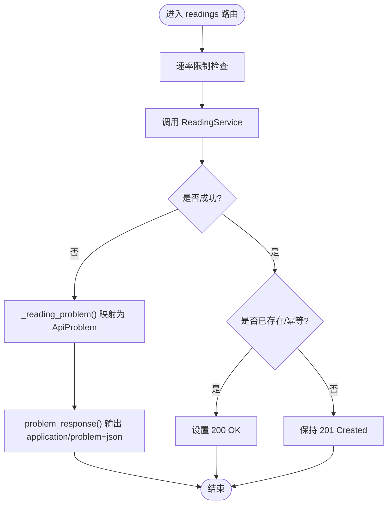
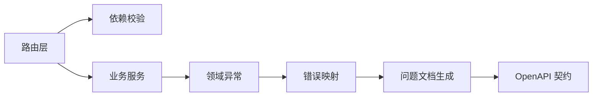

# HTTP 状态码规范

<cite>
**本文引用的文件**
- [backend/app/api/errors.py](file://backend/app/api/errors.py)
- [backend/app/api/problems.py](file://backend/app/api/problems.py)
- [backend/app/api/dependencies.py](file://backend/app/api/dependencies.py)
- [backend/app/api/auth.py](file://backend/app/api/auth.py)
- [backend/app/api/account.py](file://backend/app/api/account.py)
- [backend/app/api/admin.py](file://backend/app/api/admin.py)
- [backend/app/api/readings.py](file://backend/app/api/readings.py)
- [backend/app/api/health.py](file://backend/app/api/health.py)
- [contracts/openapi/v1.yaml](file://contracts/openapi/v1.yaml)
- [contracts/openapi/admin-v1.yaml](file://contracts/openapi/admin-v1.yaml)
</cite>

## 目录
1. [简介](#简介)
2. [项目结构](#项目结构)
3. [核心组件](#核心组件)
4. [架构总览](#架构总览)
5. [详细组件分析](#详细组件分析)
6. [依赖关系分析](#依赖关系分析)
7. [性能与可观测性](#性能与可观测性)
8. [故障排查指南](#故障排查指南)
9. [结论](#结论)
10. [附录：API 调用示例与最佳实践](#附录api-调用示例与最佳实践)

## 简介
本规范定义本项目中对外暴露的 HTTP 状态码使用原则、分类与业务场景映射，覆盖成功响应（2xx）、客户端错误（4xx）、服务器错误（5xx）以及重定向（3xx）。文档同时说明状态码与“问题文档”（RFC 7807 application/problem+json）的对应关系，给出选择状态码的最佳实践、常见陷阱，并提供面向 API 使用者的具体调用示例。

## 项目结构
后端采用 FastAPI 模块化路由组织，统一通过异常与响应工具将业务错误转换为标准化的问题文档响应；健康检查端点独立维护服务就绪状态；OpenAPI 契约集中定义了通用错误响应模型与语义。

**图表来源**
- [backend/app/api/auth.py:44-161](file://backend/app/api/auth.py#L44-L161)
- [backend/app/api/account.py:13-29](file://backend/app/api/account.py#L13-L29)
- [backend/app/api/admin.py:68-200](file://backend/app/api/admin.py#L68-L200)
- [backend/app/api/readings.py:67-399](file://backend/app/api/readings.py#L67-L399)
- [backend/app/api/health.py:11-37](file://backend/app/api/health.py#L11-L37)
- [backend/app/api/errors.py:1-17](file://backend/app/api/errors.py#L1-L17)
- [backend/app/api/problems.py:5-27](file://backend/app/api/problems.py#L5-L27)
- [contracts/openapi/v1.yaml:1204-1267](file://contracts/openapi/v1.yaml#L1204-L1267)
- [contracts/openapi/admin-v1.yaml:197-230](file://contracts/openapi/admin-v1.yaml#L197-L230)

**章节来源**
- [backend/app/api/router.py:1-22](file://backend/app/api/router.py#L1-L22)
- [contracts/openapi/v1.yaml:1204-1267](file://contracts/openapi/v1.yaml#L1204-L1267)

## 核心组件
- ApiProblem 异常：用于在路由或依赖中抛出携带状态码、标题、类型、详情与可选头部的结构化错误。
- problem_response：将请求上下文（含 request_id）与问题文档字段组合为 application/problem+json 响应。
- 依赖校验器：统一处理会话、CSRF 校验，失败时抛出 ApiProblem，确保认证/授权错误一致化。
- 健康检查：/health/live 与 /health/ready 分别表达存活与就绪，未就绪时返回 503 并附带问题文档。

**章节来源**
- [backend/app/api/errors.py:1-17](file://backend/app/api/errors.py#L1-L17)
- [backend/app/api/problems.py:5-27](file://backend/app/api/problems.py#L5-L27)
- [backend/app/api/dependencies.py:39-137](file://backend/app/api/dependencies.py#L39-L137)
- [backend/app/api/health.py:11-37](file://backend/app/api/health.py#L11-L37)

## 架构总览
下图展示一次典型写操作的端到端流程：客户端发起请求，路由层进行鉴权与限流，调用服务层执行业务逻辑，遇到业务异常则映射为 ApiProblem，最终由问题文档生成器输出标准化错误响应。

**图表来源**
- [backend/app/api/readings.py:281-361](file://backend/app/api/readings.py#L281-L361)
- [backend/app/api/dependencies.py:94-130](file://backend/app/api/dependencies.py#L94-L130)
- [backend/app/api/readings.py:67-84](file://backend/app/api/readings.py#L67-L84)
- [backend/app/api/problems.py:5-27](file://backend/app/api/problems.py#L5-L27)

## 详细组件分析

### 认证与会话依赖（401/403）
- 缺失或无效设备会话：返回 401 Unauthorized，提示需要认证。
- 缺失或无效访客会话：返回 401 Unauthorized。
- CSRF 校验失败：返回 403 Forbidden，提示 CSRF 验证失败。
- 账号非活跃：返回 401 Unauthorized。

这些行为集中在依赖函数中，保证所有路由对认证/授权错误的一致性。

**章节来源**
- [backend/app/api/dependencies.py:39-130](file://backend/app/api/dependencies.py#L39-L130)
- [backend/app/api/account.py:13-29](file://backend/app/api/account.py#L13-L29)

### 身份认证流程（202/204/400/409/429/503）
- 发送验证码：异步接受，返回 202 Accepted。
- 验证验证码：成功后设置会话 Cookie，返回 200 OK。
- 登出：清除会话 Cookie，返回 204 No Content。
- 参数非法或过期：返回 400 Bad Request。
- 访客已被认领：返回 409 Conflict。
- 频率限制：返回 429 Too Many Requests。
- OTP 投递不可用：返回 503 Service Unavailable。

**图表来源**
- [backend/app/api/auth.py:44-161](file://backend/app/api/auth.py#L44-L161)

**章节来源**
- [backend/app/api/auth.py:44-161](file://backend/app/api/auth.py#L44-L161)

### 管理后台认证（401/403/204）
- 管理员登录失败：返回 401 Unauthorized。
- 管理员 CSRF 校验失败：返回 403 Forbidden。
- 管理员登出：返回 204 No Content。

**章节来源**
- [backend/app/api/admin.py:68-200](file://backend/app/api/admin.py#L68-L200)

### 读取与创作资源（201/200/400/404/409/503）
- 创建型接口默认返回 201 Created；幂等重复提交可能返回 200 OK（已存在）。
- 输入不合法：返回 400 Bad Request。
- 资源不存在或无所有权：返回 404 Not Found。
- 状态不允许当前操作：返回 409 Conflict。
- 运行时发布不可用：返回 503 Service Unavailable。

**图表来源**
- [backend/app/api/readings.py:57-84](file://backend/app/api/readings.py#L57-L84)
- [backend/app/api/readings.py:87-399](file://backend/app/api/readings.py#L87-L399)
- [backend/app/api/problems.py:5-27](file://backend/app/api/problems.py#L5-L27)

**章节来源**
- [backend/app/api/readings.py:67-399](file://backend/app/api/readings.py#L67-L399)

### 健康检查（200/503）
- /health/live：始终返回 200 OK，表示进程存活。
- /health/ready：若依赖探测失败，返回 503 Service Unavailable，并附带问题文档。

**章节来源**
- [backend/app/api/health.py:11-37](file://backend/app/api/health.py#L11-L37)

## 依赖关系分析
- 路由层依赖依赖注入完成会话与 CSRF 校验，失败直接抛出 ApiProblem。
- 业务服务抛出领域异常，路由层将其映射为统一的 ApiProblem。
- 问题文档生成器负责构造 application/problem+json 响应，包含 type、title、status、request_id、detail。
- OpenAPI 契约定义了 Problem 结构与常用错误响应名称，便于前后端对齐。

**图表来源**
- [backend/app/api/dependencies.py:39-130](file://backend/app/api/dependencies.py#L39-L130)
- [backend/app/api/readings.py:67-84](file://backend/app/api/readings.py#L67-L84)
- [backend/app/api/problems.py:5-27](file://backend/app/api/problems.py#L5-L27)
- [contracts/openapi/v1.yaml:1204-1267](file://contracts/openapi/v1.yaml#L1204-L1267)

**章节来源**
- [backend/app/api/errors.py:1-17](file://backend/app/api/errors.py#L1-L17)
- [backend/app/api/problems.py:5-27](file://backend/app/api/problems.py#L5-L27)
- [contracts/openapi/v1.yaml:1204-1267](file://contracts/openapi/v1.yaml#L1204-L1267)
- [contracts/openapi/admin-v1.yaml:197-230](file://contracts/openapi/admin-v1.yaml#L197-L230)

## 性能与可观测性
- 速率限制：读/写路径均有限速保护，超限返回 429，避免雪崩。
- 幂等键：创建类接口支持 Idempotency-Key 头部，重复提交返回 200 而非 201，降低重试成本。
- 私有缓存控制：敏感响应设置 private/no-store，避免中间节点缓存泄露。
- 请求追踪：问题文档包含 request_id，便于链路追踪与排障。

**章节来源**
- [backend/app/api/readings.py:49-64](file://backend/app/api/readings.py#L49-L64)
- [backend/app/api/dependencies.py:133-137](file://backend/app/api/dependencies.py#L133-L137)
- [backend/app/api/problems.py:14-27](file://backend/app/api/problems.py#L14-L27)

## 故障排查指南
- 401 Unauthorized：检查 Cookie 是否存在且有效，确认会话未过期或被撤销。
- 403 Forbidden：检查 CSRF 双提交 Token 是否匹配，确认来源与策略配置。
- 400 Bad Request：核对请求体字段类型与取值范围，关注 InvalidDestination/InvalidOtp 等提示。
- 404 Not Found：确认资源 ID 正确且属于当前所有者。
- 409 Conflict：检查资源状态机是否允许当前操作，或是否存在幂等冲突。
- 429 Too Many Requests：等待 Retry-After 后重试，或降低请求频率。
- 503 Service Unavailable：外部依赖不可用，稍后重试或联系运维。

**章节来源**
- [backend/app/api/dependencies.py:39-130](file://backend/app/api/dependencies.py#L39-L130)
- [backend/app/api/auth.py:69-123](file://backend/app/api/auth.py#L69-L123)
- [backend/app/api/readings.py:67-84](file://backend/app/api/readings.py#L67-L84)
- [backend/app/api/health.py:24-33](file://backend/app/api/health.py#L24-L33)

## 结论
本项目以 ApiProblem 与 application/problem+json 为核心，将 HTTP 状态码与结构化错误信息解耦，既符合 Web 标准，又便于前端统一处理。通过依赖注入统一认证/授权、速率限制与私有缓存控制，保证了错误语义的一致性与可观测性。遵循本规范可有效减少歧义、提升联调效率与系统稳定性。

## 附录：API 调用示例与最佳实践

### 状态码分类与使用场景
- 2xx 成功响应
  - 200 OK：查询成功、验证成功、更新成功（当幂等导致未新建资源时使用）。
  - 201 Created：创建新资源成功（如开始预览、创建今日/周运势、六爻起卦、补充输入、提交验证、后续跟进）。
  - 202 Accepted：异步任务已接受（如发送验证码）。
  - 204 No Content：删除/登出成功，无响应体。
- 3xx 重定向响应
  - 本项目未使用重定向作为主要交互方式。
- 4xx 客户端错误
  - 400 Bad Request：参数非法、过期或不满足约束。
  - 401 Unauthorized：缺少或无效会话/令牌。
  - 403 Forbidden：CSRF 校验失败或缺少权限。
  - 404 Not Found：资源不存在或无所有权。
  - 409 Conflict：状态不允许当前操作或幂等冲突。
  - 429 Too Many Requests：触发频率限制。
- 5xx 服务器错误
  - 503 Service Unavailable：依赖不可用（如 OTP 投递、运行时发布）。

**章节来源**
- [backend/app/api/auth.py:44-161](file://backend/app/api/auth.py#L44-L161)
- [backend/app/api/readings.py:87-399](file://backend/app/api/readings.py#L87-L399)
- [backend/app/api/admin.py:103-163](file://backend/app/api/admin.py#L103-L163)
- [backend/app/api/health.py:11-37](file://backend/app/api/health.py#L11-L37)

### 状态码与问题文档的对应关系
- 所有 4xx/5xx 错误均以 application/problem+json 返回，包含 type、title、status、request_id，可选 detail。
- OpenAPI 契约定义了 BadRequest、Unauthorized、Forbidden、NotFound、Conflict、TooManyRequests、ServiceUnavailable 等响应模板。

**章节来源**
- [backend/app/api/problems.py:5-27](file://backend/app/api/problems.py#L5-L27)
- [contracts/openapi/v1.yaml:1204-1267](file://contracts/openapi/v1.yaml#L1204-L1267)
- [contracts/openapi/admin-v1.yaml:197-230](file://contracts/openapi/admin-v1.yaml#L197-L230)

### 状态码选择最佳实践
- 优先使用语义最精确的状态码：例如创建成功用 201，异步接受用 202，幂等重复用 200。
- 认证失败一律 401，授权失败一律 403，不要混用。
- 业务状态机不允许的操作使用 409，而不是 400。
- 外部依赖不可用使用 503，并在问题文档中提供可诊断的 type 与 title。
- 对写操作启用 Idempotency-Key，避免客户端重试造成副作用。
- 对敏感响应强制私有缓存控制，防止中间节点缓存泄露。

**章节来源**
- [backend/app/api/readings.py:57-84](file://backend/app/api/readings.py#L57-L84)
- [backend/app/api/dependencies.py:133-137](file://backend/app/api/dependencies.py#L133-L137)

### 常见陷阱
- 将 401 用于权限不足：应使用 403。
- 将 400 用于资源不存在：应使用 404。
- 忽略 429 的 Retry-After：客户端需尊重退避策略。
- 在 201 与 200 之间选择不当：幂等重复应返回 200。
- 未在问题文档中包含 request_id：不利于追踪定位。

**章节来源**
- [backend/app/api/dependencies.py:39-130](file://backend/app/api/dependencies.py#L39-L130)
- [backend/app/api/problems.py:14-27](file://backend/app/api/problems.py#L14-L27)

### API 调用示例（描述性）
- 获取账户信息
  - 方法：GET /api/v1/account
  - 成功：200 OK，返回账户信息。
  - 失败：401 Unauthorized（未登录或会话失效）。
- 发送验证码
  - 方法：POST /api/v1/auth/otp/request
  - 成功：202 Accepted（异步处理）。
  - 失败：400/429/503 及对应问题文档。
- 验证验证码
  - 方法：POST /api/v1/auth/otp/verify
  - 成功：200 OK，设置会话 Cookie。
  - 失败：400/409/429 及对应问题文档。
- 登出
  - 方法：POST /api/v1/auth/logout
  - 成功：204 No Content。
- 开始阅读（创建）
  - 方法：POST /api/v1/readings/{type}
  - 成功：201 Created；幂等重复：200 OK。
  - 失败：400/404/409/503 及对应问题文档。
- 提交验证
  - 方法：POST /api/v1/readings/{id}/verification
  - 成功：201 Created；幂等重复：200 OK。
  - 失败：400/404/409/503 及对应问题文档。
- 健康检查
  - 方法：GET /health/live → 200 OK；GET /health/ready → 200/503。

**章节来源**
- [backend/app/api/account.py:13-29](file://backend/app/api/account.py#L13-L29)
- [backend/app/api/auth.py:44-161](file://backend/app/api/auth.py#L44-L161)
- [backend/app/api/readings.py:87-399](file://backend/app/api/readings.py#L87-L399)
- [backend/app/api/health.py:11-37](file://backend/app/api/health.py#L11-L37)