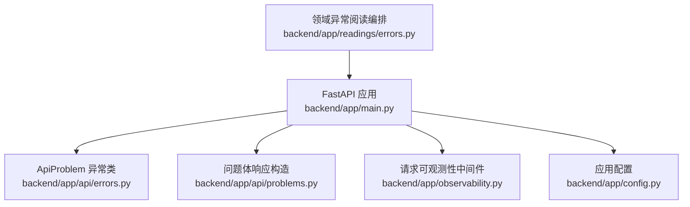
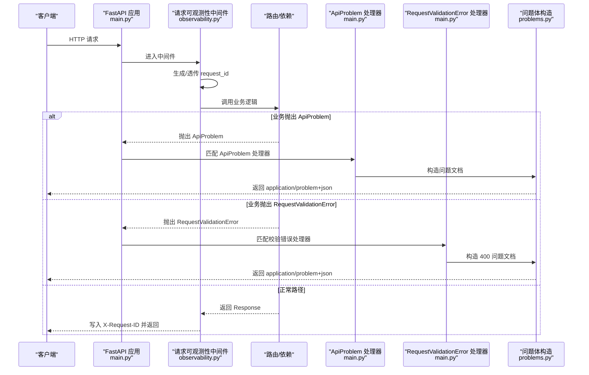
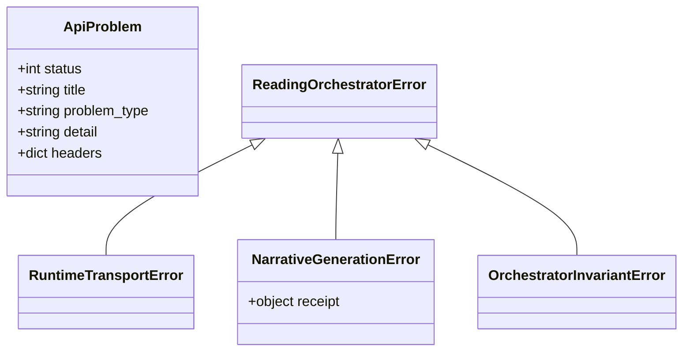
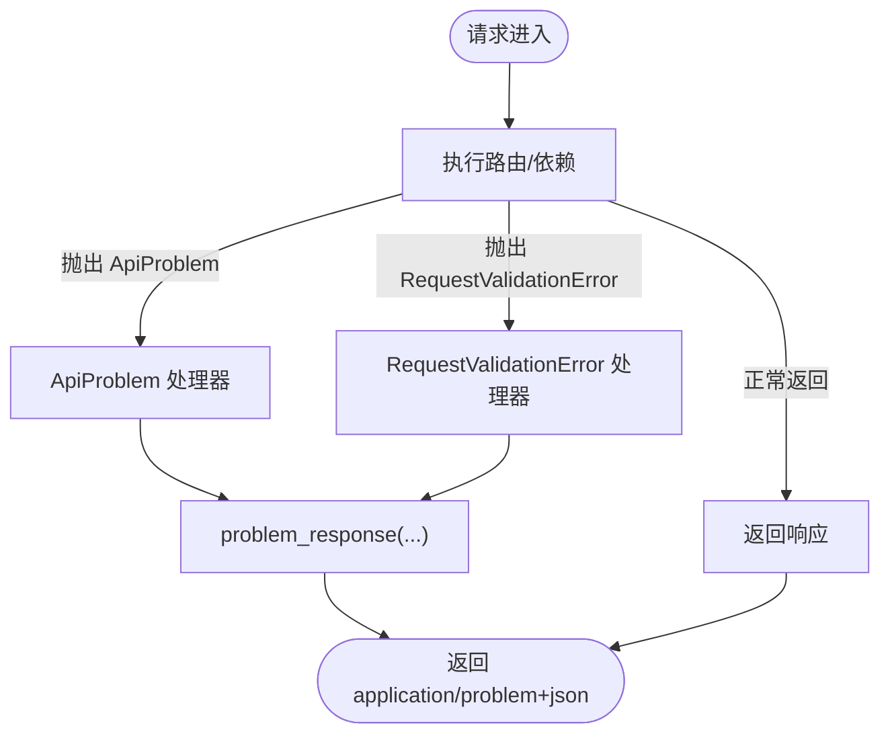
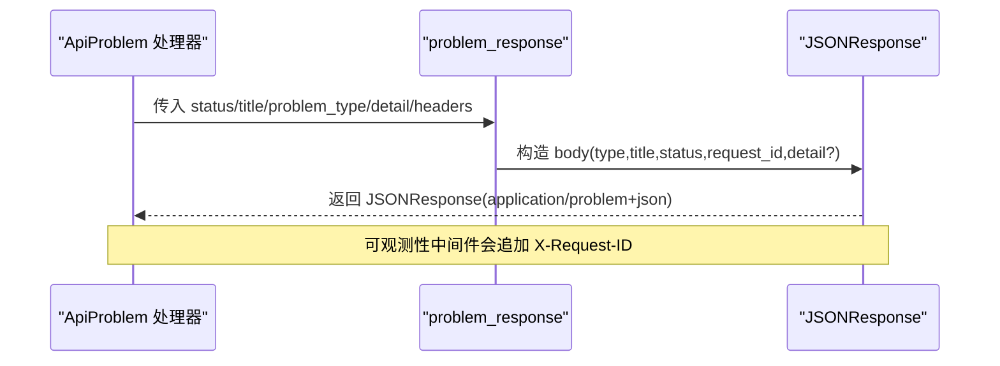
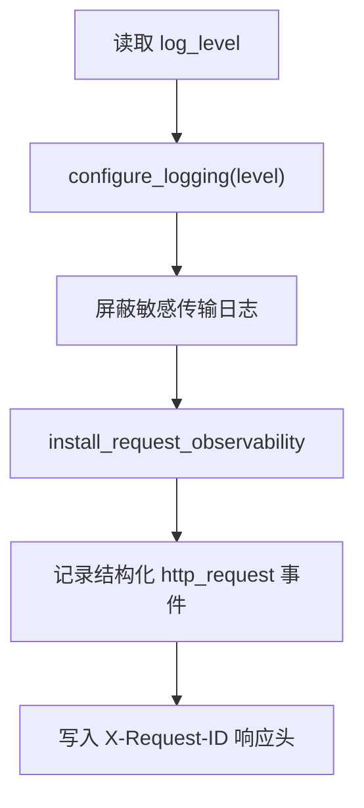
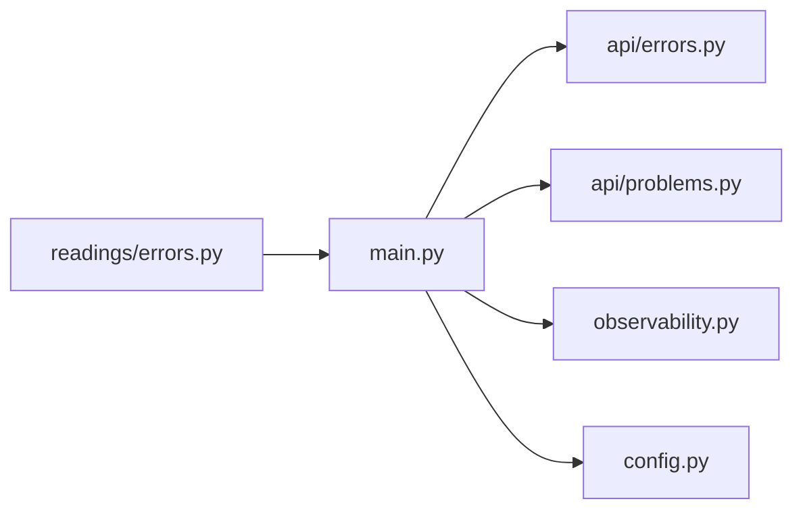

# 异常处理中间件

<cite>
**本文引用的文件**
- [backend/app/main.py](file://backend/app/main.py)
- [backend/app/api/errors.py](file://backend/app/api/errors.py)
- [backend/app/api/problems.py](file://backend/app/api/problems.py)
- [backend/app/observability.py](file://backend/app/observability.py)
- [backend/app/config.py](file://backend/app/config.py)
- [backend/app/readings/errors.py](file://backend/app/readings/errors.py)
</cite>

## 目录
1. [简介](#简介)
2. [项目结构](#项目结构)
3. [核心组件](#核心组件)
4. [架构总览](#架构总览)
5. [详细组件分析](#详细组件分析)
6. [依赖关系分析](#依赖关系分析)
7. [性能考虑](#性能考虑)
8. [故障排查指南](#故障排查指南)
9. [结论](#结论)
10. [附录](#附录)

## 简介
本文件聚焦后端 FastAPI 应用的异常处理与中间件机制，系统性说明：
- 全局异常捕获的注册与配置方式
- 自定义异常类 ApiProblem 及其业务派生类的继承体系
- 异常到 HTTP 响应的转换过程（状态码映射、问题文档生成、响应头设置）
- 错误日志记录策略（日志级别、敏感信息过滤、结构化日志格式）
- 调试模式下的差异（堆栈跟踪、详细错误信息、开发工具集成）
- 中间件的性能考量与错误监控集成方案

## 项目结构
异常处理相关代码主要分布在以下模块：
- 应用入口与异常处理器注册：backend/app/main.py
- 统一问题体生成器：backend/app/api/problems.py
- 自定义异常基类：backend/app/api/errors.py
- 请求级可观测性与中间件：backend/app/observability.py
- 运行时配置（含日志级别与环境约束）：backend/app/config.py
- 领域层异常（阅读编排等）：backend/app/readings/errors.py

图表来源
- [backend/app/main.py:115-136](file://backend/app/main.py#L115-L136)
- [backend/app/api/errors.py:1-17](file://backend/app/api/errors.py#L1-L17)
- [backend/app/api/problems.py:5-27](file://backend/app/api/problems.py#L5-L27)
- [backend/app/observability.py:27-51](file://backend/app/observability.py#L27-L51)
- [backend/app/config.py:146-147](file://backend/app/config.py#L146-L147)
- [backend/app/readings/errors.py:4-30](file://backend/app/readings/errors.py#L4-L30)

章节来源
- [backend/app/main.py:30-156](file://backend/app/main.py#L30-L156)
- [backend/app/api/errors.py:1-17](file://backend/app/api/errors.py#L1-L17)
- [backend/app/api/problems.py:1-28](file://backend/app/api/problems.py#L1-L28)
- [backend/app/observability.py:1-52](file://backend/app/observability.py#L1-L52)
- [backend/app/config.py:62-147](file://backend/app/config.py#L62-L147)
- [backend/app/readings/errors.py:1-30](file://backend/app/readings/errors.py#L1-L30)

## 核心组件
- 自定义异常基类 ApiProblem：用于在业务层抛出统一的“问题”语义，携带状态码、标题、类型、详情和可选响应头。
- 问题体响应构造器 problem_response：将异常或验证错误转换为 RFC 7807 风格的问题文档 JSON，并附带 request_id。
- FastAPI 异常处理器：
  - ApiProblem 处理器：将业务异常转为标准问题文档响应。
  - RequestValidationError 处理器：将 Pydantic 校验失败转为 400 问题文档。
- 请求可观测性中间件：为每个请求注入 request_id，记录结构化访问日志，并在响应头中回显 request_id。
- 配置项 log_level：控制日志级别，影响异常与请求日志的输出粒度。

章节来源
- [backend/app/api/errors.py:1-17](file://backend/app/api/errors.py#L1-L17)
- [backend/app/api/problems.py:5-27](file://backend/app/api/problems.py#L5-L27)
- [backend/app/main.py:115-136](file://backend/app/main.py#L115-L136)
- [backend/app/observability.py:27-51](file://backend/app/observability.py#L27-L51)
- [backend/app/config.py:146-147](file://backend/app/config.py#L146-L147)

## 架构总览
下图展示了从请求进入、异常抛出、异常处理器拦截、到最终返回问题文档的完整链路，以及请求可观测性中间件的介入点。

图表来源
- [backend/app/main.py:115-136](file://backend/app/main.py#L115-L136)
- [backend/app/api/problems.py:5-27](file://backend/app/api/problems.py#L5-L27)
- [backend/app/observability.py:27-51](file://backend/app/observability.py#L27-L51)

## 详细组件分析

### 自定义异常类与继承体系
- ApiProblem：作为所有 API 业务异常的基类，包含 status、title、problem_type、detail、headers 等字段，便于统一转换为问题文档。
- 领域异常（阅读编排）：ReadingOrchestratorError 及其子类（如 NarrativeGenerationError、RuntimeTransportError、OrchestratorInvariantError），用于表达运行期与不变式违反等场景。这些异常通常由上层服务转换为 ApiProblem 或由通用异常处理器兜底。

图表来源
- [backend/app/api/errors.py:1-17](file://backend/app/api/errors.py#L1-L17)
- [backend/app/readings/errors.py:4-30](file://backend/app/readings/errors.py#L4-L30)

章节来源
- [backend/app/api/errors.py:1-17](file://backend/app/api/errors.py#L1-L17)
- [backend/app/readings/errors.py:4-30](file://backend/app/readings/errors.py#L4-L30)

### 全局异常捕获与处理器注册
- ApiProblem 处理器：捕获 ApiProblem，调用 problem_response 生成问题文档，状态码来自异常实例。
- RequestValidationError 处理器：捕获 Pydantic 校验错误，固定返回 400 及特定问题类型。
- 两者均在应用创建时通过 @application.exception_handler 注册，确保全局生效。

图表来源
- [backend/app/main.py:115-136](file://backend/app/main.py#L115-L136)
- [backend/app/api/problems.py:5-27](file://backend/app/api/problems.py#L5-L27)

章节来源
- [backend/app/main.py:115-136](file://backend/app/main.py#L115-L136)

### 异常到 HTTP 响应的转换
- 状态码映射：直接取自 ApiProblem.status；校验错误固定为 400。
- 问题文档生成：使用 problem_response 构建 type/title/status/detail/request_id 等字段，媒体类型为 application/problem+json。
- 响应头设置：
  - 可观测性中间件会在响应头写入 X-Request-ID。
  - ApiProblem 支持 headers 参数，允许附加额外响应头（例如重试提示等）。

图表来源
- [backend/app/api/problems.py:5-27](file://backend/app/api/problems.py#L5-L27)
- [backend/app/observability.py:27-51](file://backend/app/observability.py#L27-L51)

章节来源
- [backend/app/api/problems.py:5-27](file://backend/app/api/problems.py#L5-L27)
- [backend/app/observability.py:27-51](file://backend/app/observability.py#L27-L51)

### 错误日志记录策略
- 日志级别：由 Settings.log_level 控制，默认 INFO，可通过环境变量 MINGLI_LOG_LEVEL 调整。
- 敏感信息过滤：对 httpx/httpcore/h2/hpack 等传输层日志强制降级为 WARNING，避免泄露敏感报文。
- 结构化日志：可观测性中间件以 JSON 形式输出 http_request 事件，包含 method/path/status/duration_ms/request_id 等关键字段，便于聚合与分析。
- 请求追踪：X-Request-ID 贯穿请求生命周期，便于跨服务关联日志。

图表来源
- [backend/app/config.py:146-147](file://backend/app/config.py#L146-L147)
- [backend/app/observability.py:14-17](file://backend/app/observability.py#L14-L17)
- [backend/app/observability.py:27-51](file://backend/app/observability.py#L27-L51)

章节来源
- [backend/app/config.py:146-147](file://backend/app/config.py#L146-L147)
- [backend/app/observability.py:14-17](file://backend/app/observability.py#L14-L17)
- [backend/app/observability.py:27-51](file://backend/app/observability.py#L27-L51)

### 调试模式下的异常处理差异
- 当前实现未内置基于环境标志的“调试模式”开关（如 DEBUG 变量）。日志级别由 log_level 控制，可在本地/测试环境设置为更详细的级别以获得更多信息。
- 对于未捕获的异常，FastAPI 默认会返回 500 并附带堆栈信息（取决于框架默认行为）。本项目已为 ApiProblem 与 RequestValidationError 提供明确的问题文档；其他异常建议在上层统一转换为 ApiProblem，以便对外一致化。
- 开发工具集成：利用 X-Request-ID 与结构化日志，结合日志采集系统（如 ELK/Loki）进行链路追踪与排障。

章节来源
- [backend/app/config.py:146-147](file://backend/app/config.py#L146-L147)
- [backend/app/main.py:138-139](file://backend/app/main.py#L138-L139)
- [backend/app/observability.py:27-51](file://backend/app/observability.py#L27-L51)

### 中间件的性能考虑
- 中间件开销：仅计算耗时、生成/传递 request_id、写入响应头与一次 JSON 序列化日志，开销极低。
- 日志 I/O：在高吞吐场景下，建议将日志输出至异步日志收集器或外部系统，避免阻塞主循环。
- 可观测性指标：可将 duration_ms、status 等指标暴露给监控系统（如 Prometheus），用于延迟与错误率告警。

[本节为通用性能指导，不直接分析具体文件]

## 依赖关系分析
- main.py 依赖：
  - ApiProblem：定义业务异常语义
  - problem_response：统一问题文档构造
  - configure_logging/install_request_observability：日志与可观测性
  - Settings：读取 log_level 与环境配置
- observability.py 依赖：
  - FastAPI Request/Response：注入 request_id 与响应头
  - logging：结构化日志输出
- readings/errors.py：领域异常，通常由服务层转换为 ApiProblem 或在更高层被捕获

图表来源
- [backend/app/main.py:115-139](file://backend/app/main.py#L115-L139)
- [backend/app/api/errors.py:1-17](file://backend/app/api/errors.py#L1-L17)
- [backend/app/api/problems.py:5-27](file://backend/app/api/problems.py#L5-L27)
- [backend/app/observability.py:27-51](file://backend/app/observability.py#L27-L51)
- [backend/app/config.py:146-147](file://backend/app/config.py#L146-L147)
- [backend/app/readings/errors.py:4-30](file://backend/app/readings/errors.py#L4-L30)

章节来源
- [backend/app/main.py:115-139](file://backend/app/main.py#L115-L139)
- [backend/app/api/errors.py:1-17](file://backend/app/api/errors.py#L1-L17)
- [backend/app/api/problems.py:5-27](file://backend/app/api/problems.py#L5-L27)
- [backend/app/observability.py:27-51](file://backend/app/observability.py#L27-L51)
- [backend/app/config.py:146-147](file://backend/app/config.py#L146-L147)
- [backend/app/readings/errors.py:4-30](file://backend/app/readings/errors.py#L4-L30)

## 性能考虑
- 最小化中间件逻辑：仅做必要的时间统计与 request_id 管理，避免在中间件中执行重 IO。
- 日志级别调优：生产环境保持 INFO 或更高，减少不必要的日志量；仅在定位问题时临时提升级别。
- 结构化日志：便于高效检索与聚合，降低解析成本。
- 错误监控集成：
  - 将 X-Request-ID 与结构化日志接入日志平台，建立错误告警规则（如 4xx/5xx 比例突增）。
  - 将 duration_ms 暴露为指标，设置延迟阈值告警。
  - 对关键异常（如 OTP 投递失败、速率限制触发）增加计数指标。

[本节为通用性能指导，不直接分析具体文件]

## 故障排查指南
- 无法获取 request_id：检查是否启用了可观测性中间件，确认请求头 x-request-id 是否符合规范；若缺失则自动生成 UUID。
- 问题文档缺少 detail：确认抛出 ApiProblem 时是否提供了 detail；校验错误默认不包含 detail。
- 日志过于冗长：调整 log_level 至 WARNING 或 ERROR；确认敏感传输日志已被降级。
- 未捕获异常导致 500：建议在业务层统一转换为 ApiProblem，以获得一致的错误响应与日志。
- 调试困难：在本地/测试环境提高 log_level，并结合 X-Request-ID 在日志系统中追踪请求全链路。

章节来源
- [backend/app/observability.py:20-24](file://backend/app/observability.py#L20-L24)
- [backend/app/observability.py:27-51](file://backend/app/observability.py#L27-L51)
- [backend/app/config.py:146-147](file://backend/app/config.py#L146-L147)

## 结论
本项目通过 ApiProblem 与统一的 problem_response，实现了标准化的 API 错误模型；借助 FastAPI 的异常处理器注册机制，将业务异常与校验错误转化为一致的 HTTP 响应。可观测性中间件为每次请求注入 request_id 并记录结构化日志，为排障与监控提供基础。通过合理配置日志级别与集成错误监控，可在保证性能的同时获得良好的可观测性与可维护性。

[本节为总结性内容，不直接分析具体文件]

## 附录
- 关键配置项
  - MINGLI_LOG_LEVEL：控制日志级别（默认 INFO）
  - X-Request-ID：请求追踪标识，自动回写到响应头
- 常见问题类型
  - 业务异常：type 由 ApiProblem.problem_type 指定
  - 校验错误：固定为 urn:fateradar:problem:invalid-request

[本节为补充信息，不直接分析具体文件]