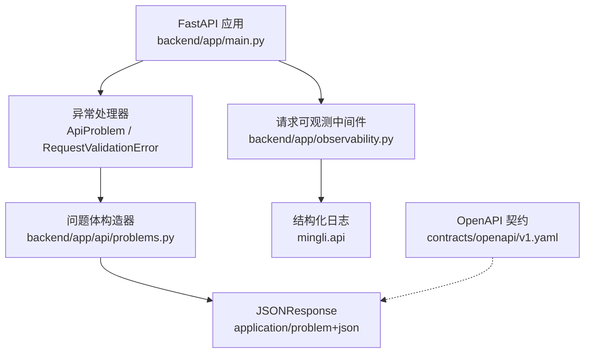
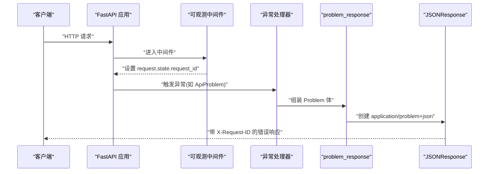
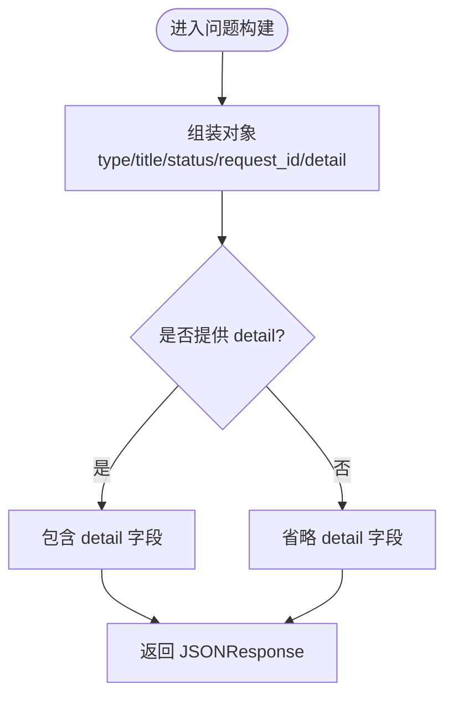
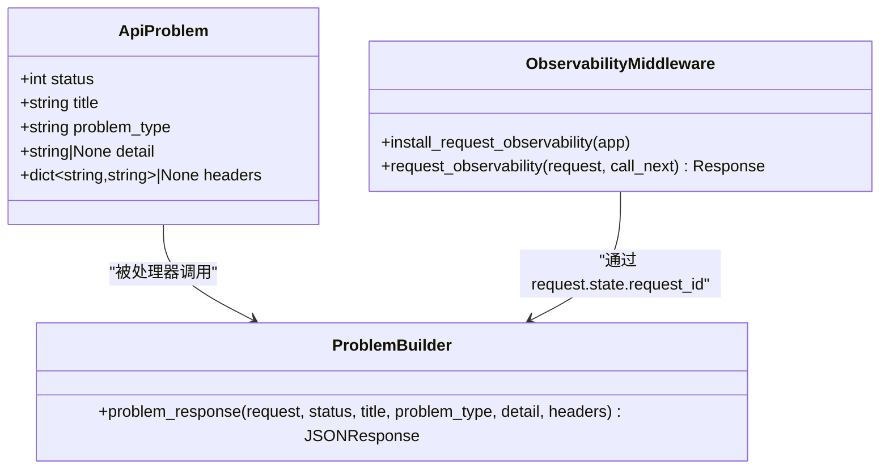
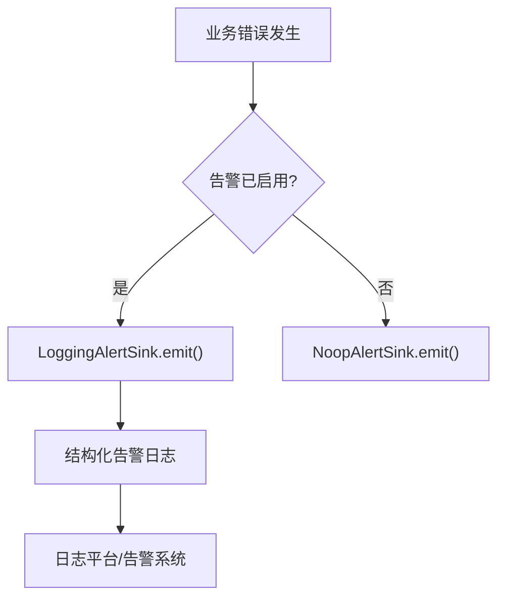
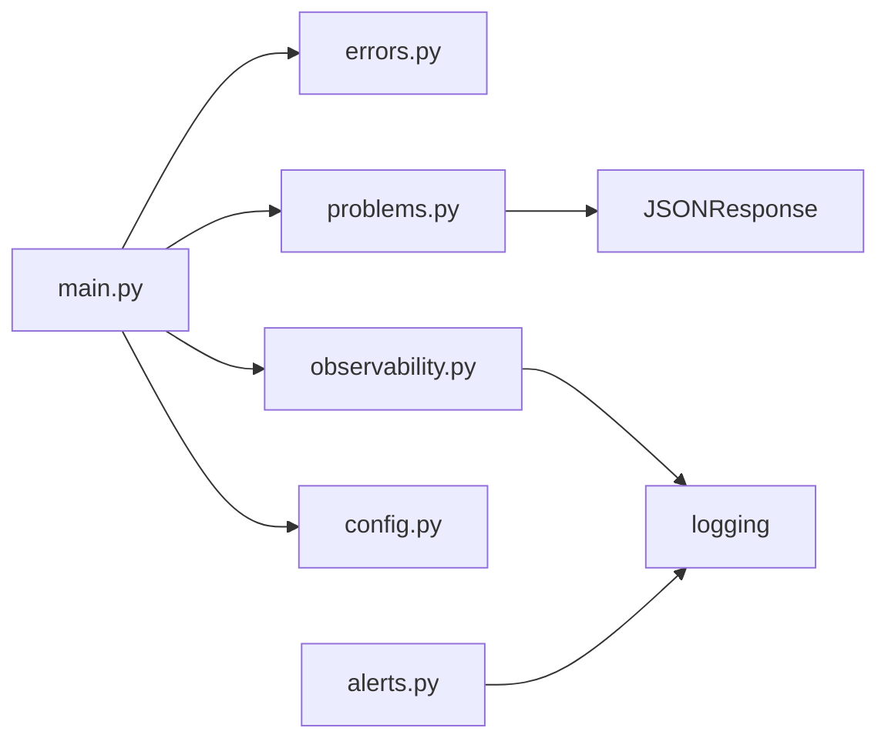

# 统一错误处理

<cite>
**本文引用的文件**
- [backend/app/main.py](file://backend/app/main.py)
- [backend/app/api/errors.py](file://backend/app/api/errors.py)
- [backend/app/api/problems.py](file://backend/app/api/problems.py)
- [backend/app/observability.py](file://backend/app/observability.py)
- [backend/app/config.py](file://backend/app/config.py)
- [backend/app/readings/alerts.py](file://backend/app/readings/alerts.py)
- [contracts/openapi/v1.yaml](file://contracts/openapi/v1.yaml)
</cite>

## 目录
1. [简介](#简介)
2. [项目结构](#项目结构)
3. [核心组件](#核心组件)
4. [架构总览](#架构总览)
5. [详细组件分析](#详细组件分析)
6. [依赖关系分析](#依赖关系分析)
7. [性能考虑](#性能考虑)
8. [故障排查指南](#故障排查指南)
9. [结论](#结论)
10. [附录](#附录)

## 简介
本文件系统化阐述后端统一错误处理方案，覆盖 RFC 7807 Problem Details 的合规实现、HTTP 状态码规范、异常中间件与全局捕获、日志与可观测性、调试模式与安全控制，以及错误监控与告警集成。目标是让前后端对错误语义达成一致，便于客户端稳定消费、运维快速定位问题。

## 项目结构
错误处理相关代码集中在后端 FastAPI 应用：
- 应用启动与异常处理器注册：backend/app/main.py
- 统一问题体构造器（RFC 7807）：backend/app/api/problems.py
- 领域异常基类（供业务抛出）：backend/app/api/errors.py
- 请求级可观测性与请求 ID：backend/app/observability.py
- 配置与环境安全校验：backend/app/config.py
- 告警事件与输出：backend/app/readings/alerts.py
- OpenAPI 契约定义错误响应与 Problem 模型：contracts/openapi/v1.yaml

**图表来源**
- [backend/app/main.py:115-136](file://backend/app/main.py#L115-L136)
- [backend/app/api/problems.py:5-27](file://backend/app/api/problems.py#L5-L27)
- [backend/app/observability.py:27-51](file://backend/app/observability.py#L27-L51)
- [contracts/openapi/v1.yaml:1204-1268](file://contracts/openapi/v1.yaml#L1204-L1268)

**章节来源**
- [backend/app/main.py:30-156](file://backend/app/main.py#L30-L156)
- [backend/app/api/problems.py:1-28](file://backend/app/api/problems.py#L1-L28)
- [backend/app/observability.py:1-51](file://backend/app/observability.py#L1-L51)
- [contracts/openapi/v1.yaml:1204-1268](file://contracts/openapi/v1.yaml#L1204-L1268)

## 核心组件
- ApiProblem：领域抛出的标准化异常，携带 HTTP 状态码、标题、类型 URI、可选详情与额外响应头。
- problem_response：将 ApiProblem 或验证错误转换为 RFC 7807 兼容的 application/problem+json 响应体，并注入 request_id。
- 全局异常处理器：在应用启动时注册，统一捕获 ApiProblem 与 Pydantic 请求验证错误，输出一致的错误格式。
- 请求可观测中间件：为每个请求生成/透传 X-Request-ID，记录结构化访问日志，并在响应头回写该 ID。
- OpenAPI 契约：以 Problem 模型和通用响应（BadRequest/Unauthorized/Forbidden/NotFound/Conflict/TooManyRequests/ServiceUnavailable）约束错误返回结构。

**章节来源**
- [backend/app/api/errors.py:1-17](file://backend/app/api/errors.py#L1-L17)
- [backend/app/api/problems.py:5-27](file://backend/app/api/problems.py#L5-L27)
- [backend/app/main.py:115-136](file://backend/app/main.py#L115-L136)
- [backend/app/observability.py:20-51](file://backend/app/observability.py#L20-L51)
- [contracts/openapi/v1.yaml:1204-1268](file://contracts/openapi/v1.yaml#L1204-L1268)

## 架构总览
下图展示一次典型请求的错误路径：请求进入后可观测中间件注入 request_id；若业务抛出 ApiProblem 或参数校验失败，FastAPI 调用对应处理器，最终通过 problem_response 输出 RFC 7807 响应。

**图表来源**
- [backend/app/observability.py:27-51](file://backend/app/observability.py#L27-L51)
- [backend/app/main.py:115-136](file://backend/app/main.py#L115-L136)
- [backend/app/api/problems.py:5-27](file://backend/app/api/problems.py#L5-L27)

## 详细组件分析

### RFC 7807 Problem Details 实现
- 字段约定
  - type：URI 引用，用于标识问题类型（例如业务域错误或系统错误）。
  - title：人类可读的简短标题。
  - status：HTTP 状态码。
  - detail：可选的详细信息。
  - request_id：贯穿请求的可追踪标识，来自 request.state.request_id。
- 媒体类型：application/problem+json。
- OpenAPI 契约：Problem 模型要求 type/title/status/request_id 必填，detail 可选。

**图表来源**
- [backend/app/api/problems.py:5-27](file://backend/app/api/problems.py#L5-L27)
- [contracts/openapi/v1.yaml:1204-1219](file://contracts/openapi/v1.yaml#L1204-L1219)

**章节来源**
- [backend/app/api/problems.py:5-27](file://backend/app/api/problems.py#L5-L27)
- [contracts/openapi/v1.yaml:1204-1219](file://contracts/openapi/v1.yaml#L1204-L1219)

### HTTP 状态码规范
- 成功响应
  - 2xx 表示成功，通常不附带 Problem 体。
- 客户端错误
  - 400：无效请求（由 Pydantic 校验失败统一映射）。
  - 401：未认证（需要设备会话）。
  - 403：禁止（CSRF/来源校验失败）。
  - 404：资源不存在或无所有权。
  - 409：冲突（状态不允许转换）。
  - 429：频率限制达到（可能附带 Retry-After 响应头）。
- 服务器错误
  - 5xx：内部错误（示例：依赖不可用使用 503）。
- 重定向响应
  - 3xx 在本项目中主要用于外部重定向场景；当前 API 错误路径主要使用 4xx/5xx。

上述错误均遵循 Problem 模型，并通过 OpenAPI responses 进行契约化声明。

**章节来源**
- [contracts/openapi/v1.yaml:1220-1268](file://contracts/openapi/v1.yaml#L1220-L1268)
- [backend/app/main.py:126-136](file://backend/app/main.py#L126-L136)

### 异常处理中间件与全局捕获
- 自定义异常：ApiProblem 作为业务侧抛出的标准异常，携带 status/title/problem_type/detail/headers。
- 全局处理器：
  - ApiProblem：直接映射到 problem_response，透传 headers。
  - RequestValidationError：统一映射为 400 Invalid request，类型为 urn:fateradar:problem:invalid-request。
- 中间件：
  - 请求可观测中间件负责注入 request_id，记录结构化日志，并在响应头写入 X-Request-ID。

**图表来源**
- [backend/app/api/errors.py:1-17](file://backend/app/api/errors.py#L1-L17)
- [backend/app/api/problems.py:5-27](file://backend/app/api/problems.py#L5-L27)
- [backend/app/observability.py:27-51](file://backend/app/observability.py#L27-L51)
- [backend/app/main.py:115-136](file://backend/app/main.py#L115-L136)

**章节来源**
- [backend/app/api/errors.py:1-17](file://backend/app/api/errors.py#L1-L17)
- [backend/app/main.py:115-136](file://backend/app/main.py#L115-L136)
- [backend/app/observability.py:27-51](file://backend/app/observability.py#L27-L51)

### 错误消息国际化与用户上下文感知
- 现状：当前错误消息以英文为主，未实现多语言动态解析。
- 建议扩展：
  - 在 ApiProblem 中增加 locale 字段，结合请求中的 Accept-Language 或 Cookie 决定语言。
  - 维护键值化的消息字典，按 domain:code 维度查找，支持占位符替换。
  - 对用户上下文感知：从会话/设备会话中提取用户信息，仅用于本地化选择与审计，避免泄露敏感数据。
- 注意：国际化不应影响 Problem 的 type/title/status 稳定性，title/detail 可作为用户可见文案进行本地化。

[本节为概念性建议，不直接分析具体文件]

### 调试模式下的错误信息控制
- 环境变量与配置
  - log_level：控制日志级别（默认 INFO），可通过 MINGLI_LOG_LEVEL 设置。
  - environment：区分 local/test/staging/production，生产环境强制多项安全策略。
- 安全策略（生产环境）
  - 必须启用安全 Cookie。
  - 禁止使用 fake OTP/Model/Runtime 适配器。
  - 强制注入身份哈希密钥与内容加密密钥，禁止使用本地默认值。
  - 固定运行时路径与发布工件摘要，防止篡改。
- 调试输出控制
  - 生产环境应关闭详细堆栈跟踪与敏感信息输出。
  - 通过日志级别与告警通道控制调试细节可见范围。
  - 所有错误响应保持最小必要信息，敏感信息不入日志。

**章节来源**
- [backend/app/config.py:62-149](file://backend/app/config.py#L62-L149)
- [backend/app/config.py:188-329](file://backend/app/config.py#L188-L329)
- [backend/app/observability.py:14-17](file://backend/app/observability.py#L14-L17)

### 错误监控与告警集成
- 结构化日志
  - 请求级日志包含 event/method/path/status/duration_ms/request_id，便于聚合检索。
- 告警事件
  - AlertEvent 提供 kind/at/job_id/reading_version_id/details 等字段，支持序列化输出。
  - LoggingAlertSink 将告警写入结构化日志；NoopAlertSink 用于禁用；RecordingAlertSink 用于测试。
  - build_alert_sink 根据 enabled 开关选择实现。
- 集成建议
  - 将告警日志接入集中式日志平台与告警规则引擎。
  - 基于 status>=500、429 高频、特定 problem_type 阈值触发告警。
  - 在生产环境开启 alert_sink_enabled，确保关键错误可被捕获。

**图表来源**
- [backend/app/readings/alerts.py:20-81](file://backend/app/readings/alerts.py#L20-L81)
- [backend/app/observability.py:37-51](file://backend/app/observability.py#L37-L51)

**章节来源**
- [backend/app/readings/alerts.py:20-81](file://backend/app/readings/alerts.py#L20-L81)
- [backend/app/observability.py:37-51](file://backend/app/observability.py#L37-L51)

## 依赖关系分析
- main.py 依赖：
  - ApiProblem：作为业务异常入口。
  - problem_response：统一问题体构造。
  - observability：安装请求可观测中间件。
  - config：读取日志级别与应用配置。
- problems.py 依赖：
  - FastAPI Request/JSONResponse：构造响应。
- observability.py 依赖：
  - FastAPI Request/Response：中间件拦截。
- alerts.py 依赖：
  - logging：结构化告警输出。

**图表来源**
- [backend/app/main.py:17-27](file://backend/app/main.py#L17-L27)
- [backend/app/api/problems.py:1-3](file://backend/app/api/problems.py#L1-L3)
- [backend/app/observability.py:1-11](file://backend/app/observability.py#L1-L11)
- [backend/app/readings/alerts.py:1-11](file://backend/app/readings/alerts.py#L1-L11)

**章节来源**
- [backend/app/main.py:17-27](file://backend/app/main.py#L17-L27)
- [backend/app/api/problems.py:1-3](file://backend/app/api/problems.py#L1-L3)
- [backend/app/observability.py:1-11](file://backend/app/observability.py#L1-L11)
- [backend/app/readings/alerts.py:1-11](file://backend/app/readings/alerts.py#L1-L11)

## 性能考虑
- 错误响应体尽量精简，避免在 detail 中输出大对象。
- 使用结构化日志减少 I/O 开销，避免打印敏感或冗余信息。
- 对高频错误（如 429）建议在网关层做限流与缓存，减轻后端压力。
- 告警输出采用轻量级 sink，生产环境按需启用，避免过度落盘。

[本节提供通用指导，不直接分析具体文件]

## 故障排查指南
- 定位请求
  - 通过响应头 X-Request-ID 与日志中的 request_id 关联一次请求的全链路日志。
- 常见问题
  - 400 Invalid request：检查请求体是否符合 Pydantic 校验规则。
  - 401/403：检查设备会话与 CSRF 是否正确传递。
  - 429 Too Many Requests：检查速率限制策略与重试间隔（Retry-After）。
  - 503 Service Unavailable：检查依赖服务可用性。
- 调试步骤
  - 提升日志级别至 DEBUG 仅在非生产环境使用。
  - 核对 environment 与各项安全配置，确保生产环境满足强制约束。
  - 查看告警日志，确认是否触达告警通道。

**章节来源**
- [backend/app/observability.py:20-51](file://backend/app/observability.py#L20-L51)
- [backend/app/config.py:188-329](file://backend/app/config.py#L188-L329)
- [backend/app/readings/alerts.py:48-75](file://backend/app/readings/alerts.py#L48-L75)

## 结论
本项目实现了基于 RFC 7807 的统一错误处理，通过 ApiProblem 与 problem_response 将业务异常与验证错误收敛为标准 Problem 体，配合 OpenAPI 契约保证前后端一致性。请求可观测中间件提供稳定的追踪标识与结构化日志，告警子系统支持关键错误的监控与上报。生产环境通过严格的配置校验保障安全性与可控性。后续可在国际化、更细粒度的错误分类与前端错误提示方面持续完善。

[本节总结性内容，不直接分析具体文件]

## 附录
- 术语
  - Problem Details：RFC 7807 定义的 HTTP 错误响应格式。
  - X-Request-ID：跨服务追踪的请求标识。
  - AlertSink：告警输出抽象，支持多种实现。
- 参考
  - OpenAPI Problem 模型与通用错误响应定义。

[本节为补充说明，不直接分析具体文件]