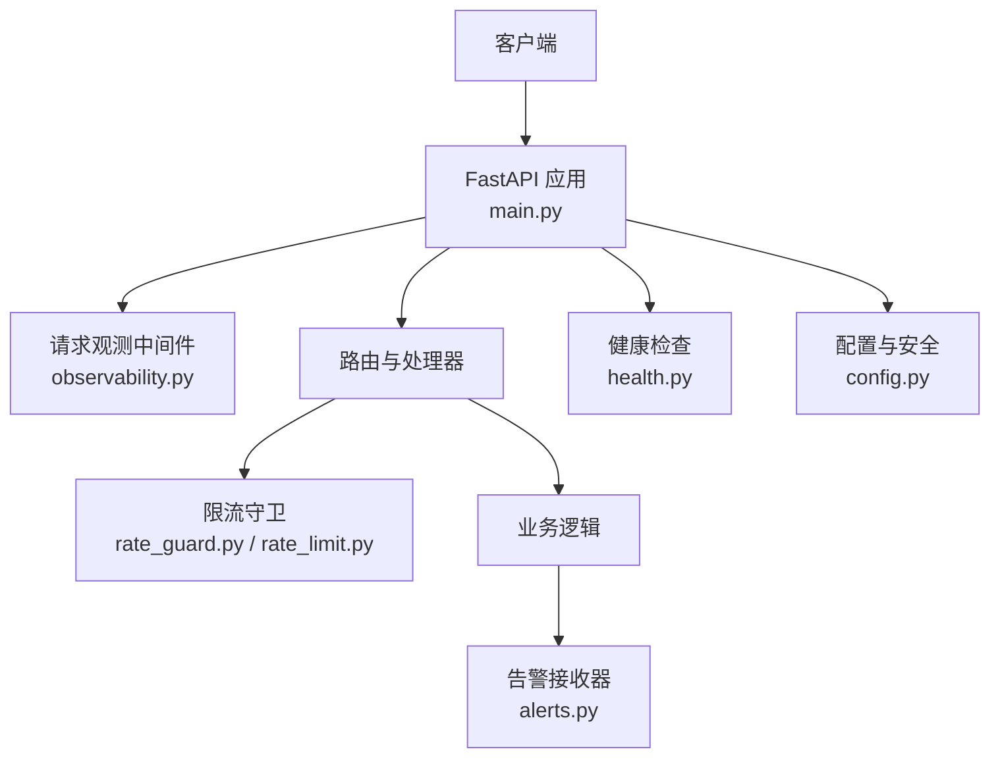
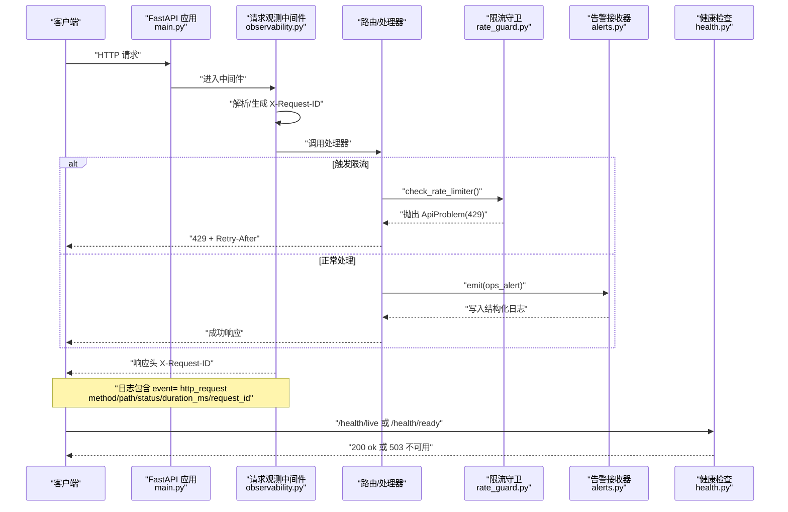
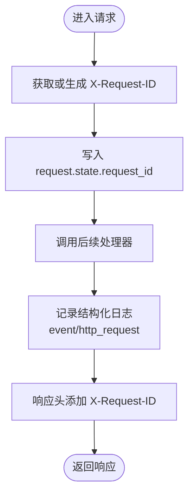
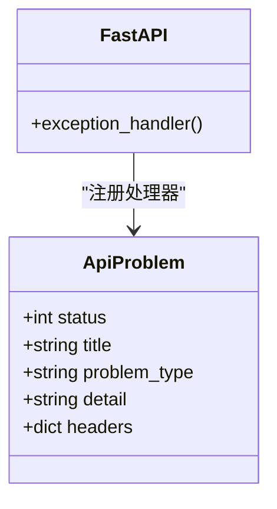
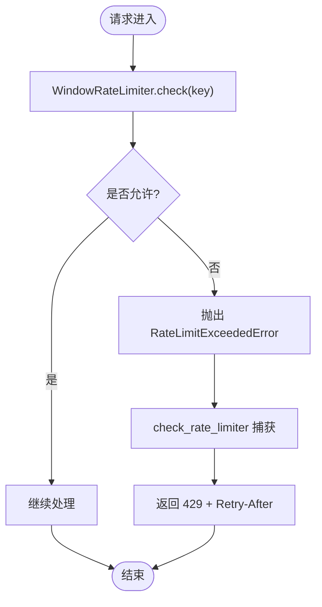
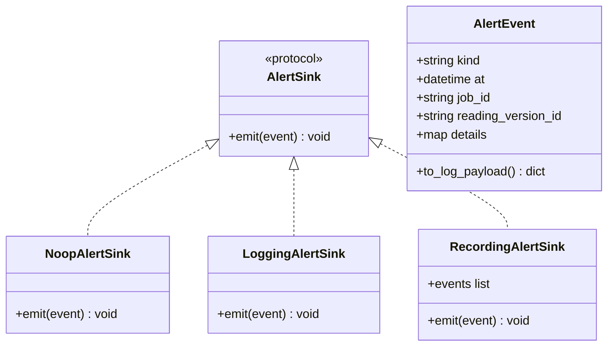
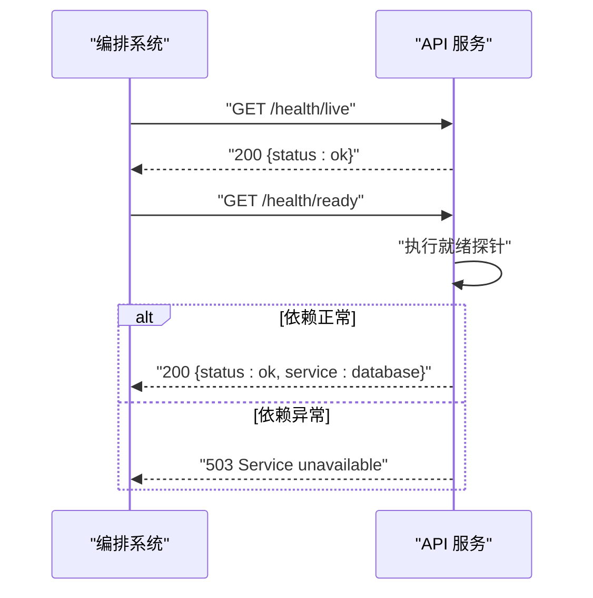
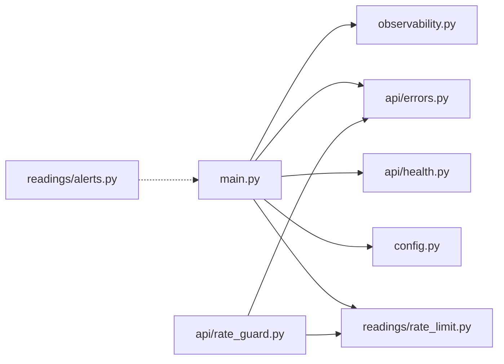

# 错误监控与告警

<cite>
**本文引用的文件**
- [backend/app/observability.py](file://backend/app/observability.py)
- [backend/app/main.py](file://backend/app/main.py)
- [backend/app/api/errors.py](file://backend/app/api/errors.py)
- [backend/app/api/rate_guard.py](file://backend/app/api/rate_guard.py)
- [backend/app/readings/alerts.py](file://backend/app/readings/alerts.py)
- [backend/app/readings/rate_limit.py](file://backend/app/readings/rate_limit.py)
- [backend/app/config.py](file://backend/app/config.py)
- [backend/app/api/health.py](file://backend/app/api/health.py)
- [infra/fateradar-test.env.example](file://infra/fateradar-test.env.example)
</cite>

## 目录
1. [简介](#简介)
2. [项目结构](#项目结构)
3. [核心组件](#核心组件)
4. [架构总览](#架构总览)
5. [详细组件分析](#详细组件分析)
6. [依赖关系分析](#依赖关系分析)
7. [性能考量](#性能考量)
8. [故障排查指南](#故障排查指南)
9. [结论](#结论)
10. [附录](#附录)

## 简介
本文件面向生产环境的错误监控与告警体系，围绕“错误收集—聚合—分析—告警—诊断”的闭环进行说明。系统基于结构化日志、请求级追踪、统一错误模型和可插拔告警接收器构建，提供：
- 统一的 HTTP 请求观测指标（方法、路径、状态码、耗时）
- 全局请求 ID 贯穿链路，便于跨服务关联
- 业务告警事件的结构化输出（操作告警、作业/读取版本上下文）
- 限流与异常的统一问题响应模型
- 健康检查探针用于就绪性判断
- 配置开关控制告警输出与运行安全约束

## 项目结构
后端采用模块化组织，错误与可观测性相关的关键位置如下：
- 应用启动与中间件装配：[backend/app/main.py](file://backend/app/main.py)
- 请求观测与日志级别控制：[backend/app/observability.py](file://backend/app/observability.py)
- 统一 API 错误模型与处理器：[backend/app/api/errors.py](file://backend/app/api/errors.py)、[backend/app/main.py](file://backend/app/main.py)
- 限流与限流异常：[backend/app/readings/rate_limit.py](file://backend/app/readings/rate_limit.py)、[backend/app/api/rate_guard.py](file://backend/app/api/rate_guard.py)
- 告警事件与接收器：[backend/app/readings/alerts.py](file://backend/app/readings/alerts.py)
- 运行时配置与安全校验：[backend/app/config.py](file://backend/app/config.py)
- 健康检查路由：[backend/app/api/health.py](file://backend/app/api/health.py)
- 测试环境示例配置：[infra/fateradar-test.env.example](file://infra/fateradar-test.env.example)

图表来源
- [backend/app/main.py:30-152](file://backend/app/main.py#L30-L152)
- [backend/app/observability.py:27-51](file://backend/app/observability.py#L27-L51)
- [backend/app/api/rate_guard.py:5-19](file://backend/app/api/rate_guard.py#L5-L19)
- [backend/app/readings/rate_limit.py:9-60](file://backend/app/readings/rate_limit.py#L9-L60)
- [backend/app/readings/alerts.py:16-81](file://backend/app/readings/alerts.py#L16-L81)
- [backend/app/api/health.py:11-36](file://backend/app/api/health.py#L11-L36)
- [backend/app/config.py:62-335](file://backend/app/config.py#L62-L335)

章节来源
- [backend/app/main.py:30-152](file://backend/app/main.py#L30-L152)
- [backend/app/observability.py:14-51](file://backend/app/observability.py#L14-L51)
- [backend/app/api/errors.py:1-17](file://backend/app/api/errors.py#L1-L17)
- [backend/app/api/rate_guard.py:1-20](file://backend/app/api/rate_guard.py#L1-L20)
- [backend/app/readings/rate_limit.py:1-60](file://backend/app/readings/rate_limit.py#L1-L60)
- [backend/app/readings/alerts.py:1-82](file://backend/app/readings/alerts.py#L1-L82)
- [backend/app/api/health.py:1-37](file://backend/app/api/health.py#L1-L37)
- [backend/app/config.py:62-335](file://backend/app/config.py#L62-L335)
- [infra/fateradar-test.env.example:1-45](file://infra/fateradar-test.env.example#L1-L45)

## 核心组件
- 请求观测与追踪
  - 通过中间件为每个 HTTP 请求生成或透传请求 ID，并在响应头中回写，便于前端与下游服务关联。
  - 记录结构化日志：事件类型、请求 ID、HTTP 方法、路径、状态码、耗时毫秒。
  - 对敏感传输层日志进行降噪，避免泄露密钥等敏感信息。
- 统一错误模型
  - 定义通用异常类型，包含状态码、标题、问题类型、详情与额外响应头。
  - 在应用启动时注册异常处理器，将业务异常转换为标准问题响应。
- 限流与重试提示
  - 滑动窗口限流器按键计数，超限抛出专用异常并附带重试时间。
  - 守卫函数将限流异常转换为 429 响应，并设置 Retry-After 头。
- 告警事件与接收器
  - 告警事件携带种类、时间戳、可选作业/读取版本 ID 与细节字段。
  - 支持多种接收器：空实现、日志输出（本地/预发）、测试内存记录。
  - 通过配置开关启用/禁用告警输出。
- 健康检查
  - 提供存活探针与就绪探针；就绪探针调用依赖检测，失败返回 503 并附带问题类型。
- 配置与安全
  - 集中管理环境变量，包含日志级别、告警开关、速率限制、模型与运行时参数等。
  - 生产环境强制安全策略（如 Cookie Secure、禁止假适配器、固定路径与白名单）。

章节来源
- [backend/app/observability.py:14-51](file://backend/app/observability.py#L14-L51)
- [backend/app/api/errors.py:1-17](file://backend/app/api/errors.py#L1-L17)
- [backend/app/main.py:115-139](file://backend/app/main.py#L115-L139)
- [backend/app/readings/rate_limit.py:9-60](file://backend/app/readings/rate_limit.py#L9-L60)
- [backend/app/api/rate_guard.py:5-19](file://backend/app/api/rate_guard.py#L5-L19)
- [backend/app/readings/alerts.py:16-81](file://backend/app/readings/alerts.py#L16-L81)
- [backend/app/api/health.py:11-36](file://backend/app/api/health.py#L11-L36)
- [backend/app/config.py:62-335](file://backend/app/config.py#L62-L335)

## 架构总览
下图展示从请求进入、观测、处理、告警到响应的完整流程，以及健康检查与配置的参与点。

图表来源
- [backend/app/main.py:30-152](file://backend/app/main.py#L30-L152)
- [backend/app/observability.py:27-51](file://backend/app/observability.py#L27-L51)
- [backend/app/api/rate_guard.py:5-19](file://backend/app/api/rate_guard.py#L5-L19)
- [backend/app/readings/alerts.py:20-75](file://backend/app/readings/alerts.py#L20-L75)
- [backend/app/api/health.py:11-36](file://backend/app/api/health.py#L11-L36)

## 详细组件分析

### 请求观测与分布式追踪
- 请求 ID 策略
  - 优先使用客户端传入的 x-request-id，若格式不合法则生成 UUID。
  - 将请求 ID 写入响应头 X-Request-ID，便于前端与网关关联。
- 指标采集
  - 每次请求记录结构化日志：event、request_id、method、path、status、duration_ms。
  - 日志级别由配置项控制，传输层敏感日志被抑制，避免泄露密钥。
- 适用场景
  - 全链路追踪：通过 request_id 串联网关、API、外部调用与后台任务。
  - 性能分析：基于 duration_ms 统计 P50/P95/P99 延迟。
  - 错误定位：结合 status 与 path 快速识别热点错误接口。

图表来源
- [backend/app/observability.py:20-51](file://backend/app/observability.py#L20-L51)

章节来源
- [backend/app/observability.py:14-51](file://backend/app/observability.py#L14-L51)

### 统一错误模型与异常处理
- 错误模型
  - 定义 ApiProblem 异常，包含状态码、标题、问题类型、详情与额外响应头。
- 异常处理器
  - 在应用启动时注册 ApiProblem 与 RequestValidationError 处理器，统一转换为问题响应。
- 优势
  - 对外暴露一致的错误语义，便于前端与第三方集成。
  - 支持附加头部（如 Retry-After），提升用户体验。

图表来源
- [backend/app/api/errors.py:1-17](file://backend/app/api/errors.py#L1-L17)
- [backend/app/main.py:115-139](file://backend/app/main.py#L115-L139)

章节来源
- [backend/app/api/errors.py:1-17](file://backend/app/api/errors.py#L1-L17)
- [backend/app/main.py:115-139](file://backend/app/main.py#L115-L139)

### 限流与重试提示
- 滑动窗口限流
  - 以键为单位维护最近窗口内的请求时间戳，超过阈值抛出 RateLimitExceededError 并计算重试秒数。
- 守卫函数
  - 将限流异常转换为 429 响应，并设置 Retry-After 头。
- 典型用法
  - 针对用户写操作、登录、验证码发送等关键路径进行保护。

图表来源
- [backend/app/readings/rate_limit.py:9-60](file://backend/app/readings/rate_limit.py#L9-L60)
- [backend/app/api/rate_guard.py:5-19](file://backend/app/api/rate_guard.py#L5-L19)

章节来源
- [backend/app/readings/rate_limit.py:1-60](file://backend/app/readings/rate_limit.py#L1-L60)
- [backend/app/api/rate_guard.py:1-20](file://backend/app/api/rate_guard.py#L1-L20)

### 告警事件与接收器
- 事件模型
  - AlertEvent 包含种类、时间、可选作业/读取版本 ID 与细节映射。
  - 提供 to_log_payload 生成结构化日志负载，不包含敏感值。
- 接收器
  - NoopAlertSink：禁用时无副作用。
  - LoggingAlertSink：本地/预发环境输出结构化警告日志。
  - RecordingAlertSink：测试环境记录事件以便断言。
- 启用方式
  - 通过配置项 alert_sink_enabled 控制是否启用告警输出。

图表来源
- [backend/app/readings/alerts.py:16-81](file://backend/app/readings/alerts.py#L16-L81)

章节来源
- [backend/app/readings/alerts.py:1-82](file://backend/app/readings/alerts.py#L1-L82)

### 健康检查与就绪性
- 存活探针
  - /health/live 返回服务可用状态。
- 就绪探针
  - /health/ready 调用依赖检测，失败返回 503 并附带问题类型。
- 用途
  - 容器编排与健康探测，确保流量仅路由到真正可用的实例。

图表来源
- [backend/app/api/health.py:11-36](file://backend/app/api/health.py#L11-L36)

章节来源
- [backend/app/api/health.py:1-37](file://backend/app/api/health.py#L1-L37)

### 配置与安全约束
- 关键配置项
  - 日志级别：log_level
  - 告警开关：alert_sink_enabled
  - 速率限制：各类写入与登录的窗口与限额
  - 模型与运行时：超时、大小限制、白名单与固定路径
- 生产安全
  - 强制 Cookie Secure、禁止假适配器、固定运行时路径与白名单。
  - 真实流量需启用告警接收器，否则拒绝启动。

章节来源
- [backend/app/config.py:62-335](file://backend/app/config.py#L62-L335)
- [infra/fateradar-test.env.example:1-45](file://infra/fateradar-test.env.example#L1-L45)

## 依赖关系分析
- 模块耦合
  - main.py 依赖 observability、api.errors、api.health、config、readings.rate_limit 等。
  - rate_guard.py 依赖 readings.rate_limit 与 api.errors。
  - alerts.py 独立于业务模块，通过 Protocol 抽象接收器，便于替换。
- 外部依赖
  - FastAPI 中间件与异常处理机制。
  - 结构化日志库（Python logging）。
  - 配置加载（pydantic-settings）。
- 潜在循环
  - 当前模块间无直接循环导入，职责清晰。

图表来源
- [backend/app/main.py:30-152](file://backend/app/main.py#L30-L152)
- [backend/app/api/rate_guard.py:1-20](file://backend/app/api/rate_guard.py#L1-L20)
- [backend/app/readings/alerts.py:1-82](file://backend/app/readings/alerts.py#L1-L82)

章节来源
- [backend/app/main.py:30-152](file://backend/app/main.py#L30-L152)
- [backend/app/api/rate_guard.py:1-20](file://backend/app/api/rate_guard.py#L1-L20)
- [backend/app/readings/alerts.py:1-82](file://backend/app/readings/alerts.py#L1-L82)

## 性能考量
- 低开销观测
  - 中间件仅记录必要字段，JSON 序列化紧凑，避免影响主路径。
  - 传输层敏感日志降级至 WARNING，减少噪音。
- 限流保护
  - 滑动窗口在进程内维护，适合单机或小规模集群；如需跨节点一致性，应引入分布式计数器。
- 告警输出
  - 默认输出到结构化日志，建议接入日志聚合平台进行实时分析与告警。
- 健康检查
  - 就绪探针应避免昂贵检查，必要时异步化或缓存结果。

## 故障排查指南
- 无法定位请求
  - 检查请求头是否包含 x-request-id，响应头是否回写 X-Request-ID。
  - 在日志中搜索 event=http_request 并过滤 request_id。
- 频繁 429 限流
  - 查看对应接口的限流配置与 key 维度（如用户 ID、IP）。
  - 根据 Retry-After 调整客户端重试策略。
- 告警未生效
  - 确认 alert_sink_enabled 已开启。
  - 检查日志级别与告警接收器实现（本地/预发/测试）。
- 健康检查失败
  - 访问 /health/ready 查看 503 的问题类型，定位依赖问题（数据库、外部服务等）。
- 生产安全报错
  - 根据配置校验错误信息修复（如 Cookie Secure、假适配器、路径白名单等）。

章节来源
- [backend/app/observability.py:20-51](file://backend/app/observability.py#L20-L51)
- [backend/app/api/rate_guard.py:5-19](file://backend/app/api/rate_guard.py#L5-L19)
- [backend/app/readings/alerts.py:72-75](file://backend/app/readings/alerts.py#L72-L75)
- [backend/app/api/health.py:24-34](file://backend/app/api/health.py#L24-L34)
- [backend/app/config.py:188-329](file://backend/app/config.py#L188-L329)

## 结论
该错误监控与告警体系以结构化日志与请求追踪为基础，结合统一错误模型与可插拔告警接收器，实现了低成本、高扩展性的观测能力。通过健康检查与配置安全约束，保障了服务的稳定性与合规性。建议在生产环境中：
- 启用告警接收器并接入日志聚合平台
- 基于请求指标建立 SLO/SLI 与告警规则
- 定期审查限流策略与健康检查逻辑
- 遵循隐私与合规要求，避免在日志中记录敏感数据

## 附录
- 监控指标定义与采集
  - HTTP 请求指标：event、request_id、method、path、status、duration_ms
  - 告警指标：event=ops_alert、kind、at、job_id、reading_version_id、details
  - 健康指标：/health/live 与 /health/ready 的状态码与响应体
- 告警规则与管理
  - 阈值：基于错误率（如 5xx 比例）、延迟分位（P95/P99）、限流触发频率
  - 通知渠道：日志聚合平台告警、邮件、IM 等（由外部系统实现）
  - 告警分级：依据业务影响面与错误严重性划分等级
- 错误追踪与诊断
  - 分布式追踪：通过 request_id 串联各阶段日志与调用
  - 日志关联：在业务日志中携带 request_id 与上下文
  - 根因分析：结合状态码、路径、耗时与告警事件定位问题
- 生产最佳实践
  - 数据保留：合理设置日志与指标保留周期，平衡成本与可追溯性
  - 隐私保护：不在日志中记录敏感信息，传输层日志降噪
  - 合规要求：遵循最小权限与审计原则，确保配置与密钥安全注入
- 配置示例（节选）
  - 日志级别：MINGLI_LOG_LEVEL=INFO
  - 告警开关：MINGLI_ALERT_SINK_ENABLED=true
  - 其他：数据库 URL、可信代理网段、Cookie Secure、OTP 适配器等

章节来源
- [backend/app/observability.py:14-51](file://backend/app/observability.py#L14-L51)
- [backend/app/readings/alerts.py:20-75](file://backend/app/readings/alerts.py#L20-L75)
- [backend/app/api/health.py:11-36](file://backend/app/api/health.py#L11-L36)
- [infra/fateradar-test.env.example:13-45](file://infra/fateradar-test.env.example#L13-L45)