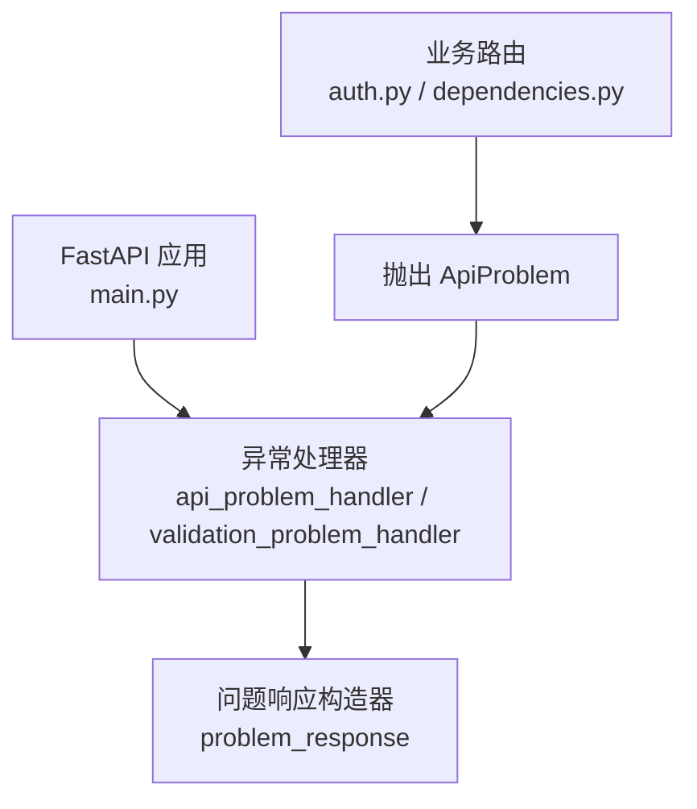
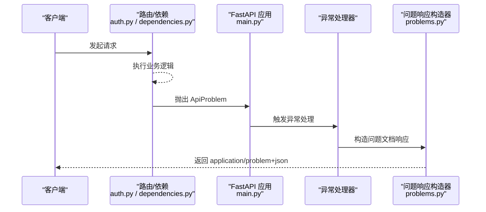
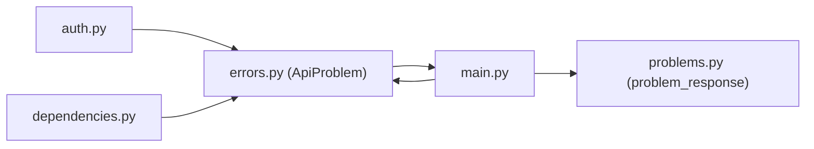
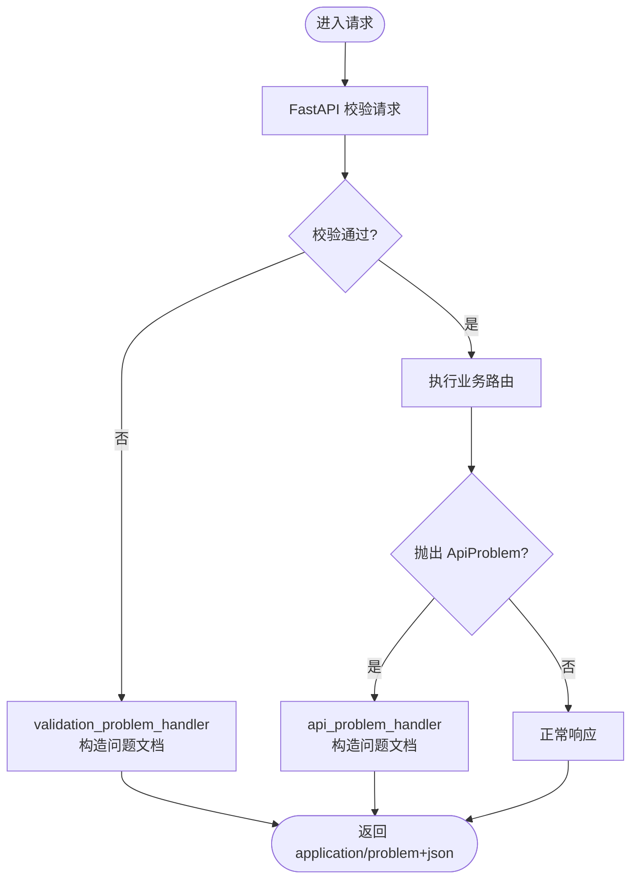

# 问题文档标准实现

<cite>
**本文引用的文件**
- [backend/app/api/errors.py](file://backend/app/api/errors.py)
- [backend/app/api/problems.py](file://backend/app/api/problems.py)
- [backend/app/main.py](file://backend/app/main.py)
- [backend/app/api/auth.py](file://backend/app/api/auth.py)
- [backend/app/api/dependencies.py](file://backend/app/api/dependencies.py)
- [backend/app/readings/errors.py](file://backend/app/readings/errors.py)
</cite>

## 目录
1. [简介](#简介)
2. [项目结构](#项目结构)
3. [核心组件](#核心组件)
4. [架构总览](#架构总览)
5. [详细组件分析](#详细组件分析)
6. [依赖关系分析](#依赖关系分析)
7. [性能考虑](#性能考虑)
8. [故障排查指南](#故障排查指南)
9. [结论](#结论)
10. [附录](#附录)

## 简介
本文件系统化阐述本项目对 RFC 7807“HTTP API 的问题文档”标准的实现方式，重点围绕 ApiProblem 异常类、统一问题响应构造器以及全局异常处理器如何协作，将各类错误以标准化 JSON 格式返回给客户端。文档同时说明必需字段（type、title、status）与可选字段（detail、instance、extensions）的语义与使用规范，解释 problem_type 字段的语义化设计与扩展机制，并给出错误分类体系（客户端错误、服务器错误、业务逻辑错误）及处理策略。文末提供具体代码示例路径，展示如何抛出和捕获不同类型的错误，以及在 API 响应中正确格式化问题文档。

## 项目结构
后端采用 FastAPI 构建，问题文档相关能力集中在以下位置：
- 异常定义：ApiProblem 位于 api/errors.py
- 问题响应构造：problem_response 位于 api/problems.py
- 全局异常处理：在 main.py 中注册 ApiProblem 与请求校验异常的处理器
- 业务调用点：auth、dependencies 等模块通过抛出 ApiProblem 表达错误
- 领域错误：readings/errors.py 定义了阅读编排领域的运行时错误，可在上层转换为问题文档

图表来源
- [backend/app/main.py:115-136](file://backend/app/main.py#L115-L136)
- [backend/app/api/problems.py:5-27](file://backend/app/api/problems.py#L5-L27)
- [backend/app/api/auth.py:69-123](file://backend/app/api/auth.py#L69-L123)
- [backend/app/api/dependencies.py:39-130](file://backend/app/api/dependencies.py#L39-L130)

章节来源
- [backend/app/main.py:115-136](file://backend/app/main.py#L115-L136)
- [backend/app/api/problems.py:5-27](file://backend/app/api/problems.py#L5-L27)
- [backend/app/api/auth.py:69-123](file://backend/app/api/auth.py#L69-L123)
- [backend/app/api/dependencies.py:39-130](file://backend/app/api/dependencies.py#L39-L130)

## 核心组件
- ApiProblem 异常类：承载 HTTP 状态码、标题、类型、详情、附加头等信息，作为业务层向框架层传递结构化错误的载体。
- problem_response 构造器：根据请求上下文生成符合 RFC 7807 的 application/problem+json 响应体，自动注入 request_id。
- 全局异常处理器：将 ApiProblem 映射为标准问题文档；同时将 FastAPI 的请求校验异常统一为问题文档。

章节来源
- [backend/app/api/errors.py:1-17](file://backend/app/api/errors.py#L1-L17)
- [backend/app/api/problems.py:5-27](file://backend/app/api/problems.py#L5-L27)
- [backend/app/main.py:115-136](file://backend/app/main.py#L115-L136)

## 架构总览
下图展示了从业务层抛出异常到客户端收到标准化问题文档的完整流程。

图表来源
- [backend/app/api/auth.py:69-123](file://backend/app/api/auth.py#L69-L123)
- [backend/app/api/dependencies.py:39-130](file://backend/app/api/dependencies.py#L39-L130)
- [backend/app/main.py:115-136](file://backend/app/main.py#L115-L136)
- [backend/app/api/problems.py:5-27](file://backend/app/api/problems.py#L5-L27)

## 详细组件分析

### ApiProblem 异常类
- 设计要点
  - 携带 status、title、problem_type、detail、headers 等属性，便于下游统一渲染。
  - 继承自 Exception，可被 FastAPI 异常处理器捕获。
- 使用场景
  - 认证/授权失败、CSRF 校验失败、业务规则不满足、外部依赖不可用等。
- 扩展建议
  - 可通过子类或工厂函数封装常见错误模式，减少重复参数传递。

章节来源
- [backend/app/api/errors.py:1-17](file://backend/app/api/errors.py#L1-L17)

### 问题响应构造器 problem_response
- 职责
  - 组装 RFC 7807 兼容的 JSON 对象，包含 type、title、status、request_id，可选 detail。
  - 设置媒体类型为 application/problem+json。
- 关键字段
  - type：问题类型标识符，建议使用 URI 形式，体现语义化命名空间。
  - title：人类可读的错误摘要。
  - status：HTTP 状态码。
  - request_id：来自请求上下文的追踪 ID，便于日志关联。
  - detail：可选，更详细的错误描述。
  - instance：当前实现未直接输出，可按需扩展。
  - extensions：当前实现未直接输出，可按需扩展。
- 注意事项
  - 保持响应体简洁稳定，避免泄露敏感信息。

章节来源
- [backend/app/api/problems.py:5-27](file://backend/app/api/problems.py#L5-L27)

### 全局异常处理器
- ApiProblem 处理器
  - 将 ApiProblem 的属性映射为问题文档字段，并透传 headers。
- 请求校验异常处理器
  - 将 FastAPI 的 RequestValidationError 统一转换为问题文档，固定类型为 urn:fateradar:problem:invalid-request。
- OpenAPI 行为
  - 移除默认 422 响应，使 OpenAPI 文档与问题文档风格一致。

章节来源
- [backend/app/main.py:115-151](file://backend/app/main.py#L115-L151)

### 业务层错误抛出示例
- 认证与授权
  - 缺失会话或 CSRF 校验失败时，抛出 401/403 的 ApiProblem。
- 身份验证流程
  - OTP 请求/校验过程中，针对不同错误（无效目标、速率限制、投递不可用、无效验证码、冲突等）抛出不同状态码的 ApiProblem。
- 依赖注入校验
  - require_guest_csrf、require_device_session 等依赖在失败时抛出对应状态的 ApiProblem。

章节来源
- [backend/app/api/auth.py:69-123](file://backend/app/api/auth.py#L69-L123)
- [backend/app/api/dependencies.py:39-130](file://backend/app/api/dependencies.py#L39-L130)

### 领域错误与问题文档的衔接
- readings/errors.py 定义了阅读编排相关的运行时错误，用于内部边界与状态机约束。
- 建议在面向 API 的边界处将这些领域错误转换为 ApiProblem，以便统一输出问题文档。

章节来源
- [backend/app/readings/errors.py:1-30](file://backend/app/readings/errors.py#L1-L30)

## 依赖关系分析
- 耦合与内聚
  - 业务路由与依赖仅负责抛出 ApiProblem，不关心序列化细节，提升内聚性。
  - 问题响应构造器独立于业务，专注 RFC 7807 格式，降低耦合。
- 外部依赖
  - FastAPI 异常处理机制、Request 上下文（用于 request_id）。
- 潜在循环依赖
  - 当前实现无循环导入；如需扩展，请保持“业务→异常→响应构造”单向依赖。

图表来源
- [backend/app/api/auth.py:69-123](file://backend/app/api/auth.py#L69-L123)
- [backend/app/api/dependencies.py:39-130](file://backend/app/api/dependencies.py#L39-L130)
- [backend/app/main.py:115-136](file://backend/app/main.py#L115-L136)
- [backend/app/api/problems.py:5-27](file://backend/app/api/problems.py#L5-L27)

章节来源
- [backend/app/api/auth.py:69-123](file://backend/app/api/auth.py#L69-L123)
- [backend/app/api/dependencies.py:39-130](file://backend/app/api/dependencies.py#L39-L130)
- [backend/app/main.py:115-136](file://backend/app/main.py#L115-L136)
- [backend/app/api/problems.py:5-27](file://backend/app/api/problems.py#L5-L27)

## 性能考虑
- 异常路径开销
  - 抛出与捕获异常是轻量操作；确保仅在真正错误时使用异常控制流。
- 响应体大小
  - 问题文档应保持精简，避免在 detail 中附带大对象或敏感数据。
- 日志与追踪
  - 利用 request_id 关联请求链路，便于定位问题；注意日志脱敏。
- 可扩展性
  - 若需增加 instance、extensions 等字段，应在 problem_response 中集中扩展，保证一致性。

## 故障排查指南
- 常见问题
  - 未设置 problem_type：默认使用 about:blank，建议为每种错误域定义明确类型。
  - 缺少 request_id：确认请求上下文已注入 request_id。
  - 媒体类型不正确：确认响应媒体类型为 application/problem+json。
- 定位步骤
  - 检查业务路由是否正确抛出 ApiProblem。
  - 检查全局异常处理器是否生效。
  - 核对 problem_response 生成的响应体字段是否符合预期。
- 参考路径
  - 认证/授权错误抛出点：[backend/app/api/auth.py:69-123](file://backend/app/api/auth.py#L69-L123)、[backend/app/api/dependencies.py:39-130](file://backend/app/api/dependencies.py#L39-L130)
  - 全局异常处理：[backend/app/main.py:115-136](file://backend/app/main.py#L115-L136)
  - 问题响应构造：[backend/app/api/problems.py:5-27](file://backend/app/api/problems.py#L5-L27)

章节来源
- [backend/app/api/auth.py:69-123](file://backend/app/api/auth.py#L69-L123)
- [backend/app/api/dependencies.py:39-130](file://backend/app/api/dependencies.py#L39-L130)
- [backend/app/main.py:115-136](file://backend/app/main.py#L115-L136)
- [backend/app/api/problems.py:5-27](file://backend/app/api/problems.py#L5-L27)

## 结论
本项目通过 ApiProblem 异常类与统一的 problem_response 构造器，结合 FastAPI 的全局异常处理器，实现了稳定、一致且可追踪的 RFC 7807 问题文档输出。通过语义化的 problem_type 与清晰的错误分类体系，客户端可以可靠地识别错误类别并采取相应处理策略。建议在后续演进中逐步完善 instance 与 extensions 字段，并建立领域错误到问题文档的统一转换层，以提升一致性与可维护性。

## 附录

### 问题文档字段规范与语义
- 必需字段
  - type：问题类型标识符，建议使用 URI 形式，体现语义化命名空间。例如：urn:fateradar:problem:invalid-request、urn:fateradar:problem:dependency-unavailable。
  - title：人类可读的错误摘要。
  - status：HTTP 状态码。
- 可选字段
  - detail：更详细的错误描述，适合面向开发者或调试。
  - instance：指向本次问题的实例标识，可用于关联日志或工单。
  - extensions：自定义扩展字段，用于携带额外上下文（如错误码、相关资源 ID 等），但应避免泄露敏感信息。
- 当前实现
  - 已输出：type、title、status、request_id、detail（可选）。
  - 未输出：instance、extensions（可按需扩展）。

章节来源
- [backend/app/api/problems.py:5-27](file://backend/app/api/problems.py#L5-L27)
- [backend/app/main.py:126-136](file://backend/app/main.py#L126-L136)

### 错误分类体系与处理策略
- 客户端错误（4xx）
  - 典型场景：请求参数无效、认证失败、权限不足、速率限制。
  - 策略：返回明确的 type 与 title，必要时提供 detail 指导修正。
- 服务器错误（5xx）
  - 典型场景：外部依赖不可用、内部处理异常。
  - 策略：对外保持友好提示，对内记录详细日志与追踪信息。
- 业务逻辑错误
  - 典型场景：状态机不变量被破坏、业务流程不满足前置条件。
  - 策略：通过领域错误向上抛出，并在 API 边界转换为 ApiProblem，确保统一输出。

章节来源
- [backend/app/readings/errors.py:1-30](file://backend/app/readings/errors.py#L1-L30)
- [backend/app/api/auth.py:69-123](file://backend/app/api/auth.py#L69-L123)
- [backend/app/api/dependencies.py:39-130](file://backend/app/api/dependencies.py#L39-L130)

### 代码示例路径（抛出与捕获）
- 抛出认证/授权错误
  - [backend/app/api/dependencies.py:39-130](file://backend/app/api/dependencies.py#L39-L130)
- 抛出身份验证流程错误
  - [backend/app/api/auth.py:69-123](file://backend/app/api/auth.py#L69-L123)
- 全局捕获并转换为问题文档
  - [backend/app/main.py:115-136](file://backend/app/main.py#L115-L136)
- 构造问题文档响应
  - [backend/app/api/problems.py:5-27](file://backend/app/api/problems.py#L5-L27)

### 流程图：请求校验异常到问题文档

图表来源
- [backend/app/main.py:126-136](file://backend/app/main.py#L126-L136)
- [backend/app/main.py:115-124](file://backend/app/main.py#L115-L124)
- [backend/app/api/problems.py:5-27](file://backend/app/api/problems.py#L5-L27)