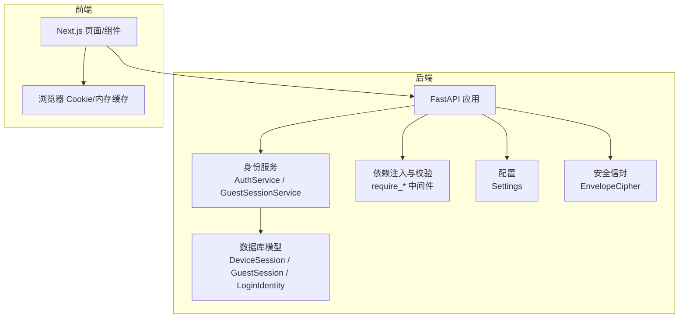
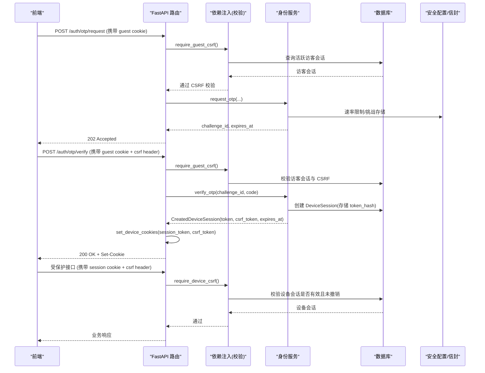
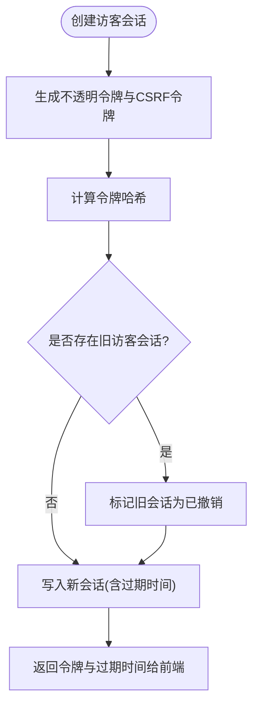
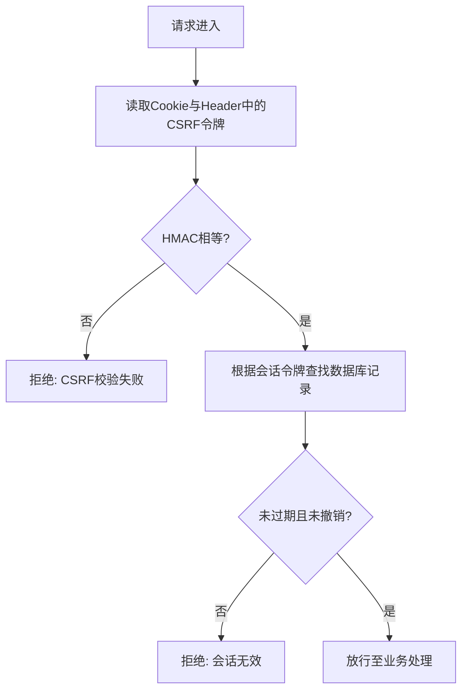
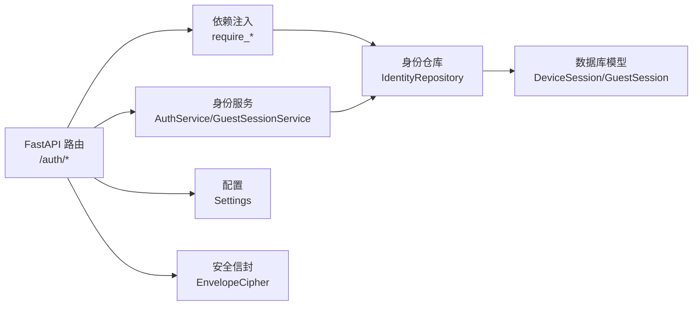

# JWT 令牌系统

<cite>
**本文引用的文件**
- [backend/app/identity/service.py](file://backend/app/identity/service.py)
- [backend/app/api/auth.py](file://backend/app/api/auth.py)
- [backend/app/identity/models.py](file://backend/app/identity/models.py)
- [backend/app/identity/repository.py](file://backend/app/identity/repository.py)
- [backend/app/identity/security.py](file://backend/app/identity/security.py)
- [backend/app/identity/cookies.py](file://backend/app/identity/cookies.py)
- [backend/app/admin/cookies.py](file://backend/app/admin/cookies.py)
- [backend/app/api/dependencies.py](file://backend/app/api/dependencies.py)
- [backend/app/config.py](file://backend/app/config.py)
- [backend/app/security/envelope.py](file://backend/app/security/envelope.py)
- [contracts/schemas/auth-session.schema.json](file://contracts/schemas/auth-session.schema.json)
- [tests/contract/test_openapi_contract.py](file://tests/contract/test_openapi_contract.py)
- [backend/tests/test_guest_sessions.py](file://backend/tests/test_guest_sessions.py)
- [web/src/test/api-session.test.ts](file://web/src/test/api-session.test.ts)
</cite>

## 目录
1. [简介](#简介)
2. [项目结构](#项目结构)
3. [核心组件](#核心组件)
4. [架构总览](#架构总览)
5. [详细组件分析](#详细组件分析)
6. [依赖关系分析](#依赖关系分析)
7. [性能考虑](#性能考虑)
8. [故障排查指南](#故障排查指南)
9. [结论](#结论)
10. [附录](#附录)

## 简介
本仓库并未使用传统意义上的“JWT”（JSON Web Token）作为会话凭证，而是采用“不透明令牌 + 服务端会话存储 + CSRF 双提交校验”的认证与会话模型。该设计将敏感信息留在服务端，客户端仅持有随机、不可解析的令牌与 CSRF 令牌，通过 Cookie 传输并配合严格的 SameSite、Secure、HttpOnly 等安全属性，实现高安全性的访问控制与防跨站请求伪造能力。

本文件围绕以下目标展开：
- 解释令牌的生成、签名（哈希）、验证与刷新机制
- 说明访问令牌与会话的关系、作用域限制与撤销策略
- 阐述过期时间控制、传输加密与安全策略
- 描述前后端传递方式（Cookie、CSRF 头、响应体字段）
- 给出令牌验证中间件（依赖注入）的实现要点
- 提供威胁防护建议与调试、优化实践

## 项目结构
后端以 FastAPI 为框架，身份与会话相关代码集中在 identity 模块，API 路由在 api 模块，配置在 config 模块，安全信封在 security 模块。前端 Next.js 应用通过测试用例体现对 CSRF 与 Guest Session 的交互行为。

图表来源
- [backend/app/main.py:50-77](file://backend/app/main.py#L50-L77)
- [backend/app/identity/service.py:35-192](file://backend/app/identity/service.py#L35-L192)
- [backend/app/api/dependencies.py:19-137](file://backend/app/api/dependencies.py#L19-L137)
- [backend/app/identity/models.py:31-132](file://backend/app/identity/models.py#L31-L132)
- [backend/app/config.py:62-335](file://backend/app/config.py#L62-L335)
- [backend/app/security/envelope.py:75-121](file://backend/app/security/envelope.py#L75-L121)

章节来源
- [backend/app/main.py:50-77](file://backend/app/main.py#L50-L77)
- [backend/app/identity/service.py:35-192](file://backend/app/identity/service.py#L35-L192)
- [backend/app/api/dependencies.py:19-137](file://backend/app/api/dependencies.py#L19-L137)
- [backend/app/identity/models.py:31-132](file://backend/app/identity/models.py#L31-L132)
- [backend/app/config.py:62-335](file://backend/app/config.py#L62-L335)
- [backend/app/security/envelope.py:75-121](file://backend/app/security/envelope.py#L75-L121)

## 核心组件
- 不透明令牌生成与哈希
  - 使用密码学安全的随机字符串作为令牌，服务端仅持久化其哈希值，避免泄露原始令牌。
- 会话模型
  - 访客会话（GuestSession）：短期、匿名、可被认领为用户会话。
  - 设备会话（DeviceSession）：用户登录后长期有效，支持撤销与过期。
- 登录流程
  - 基于 OTP（一次性验证码）的身份验证，成功后创建设备会话并下发 Cookie。
- CSRF 保护
  - 双提交模式：Cookie 中的 CSRF 令牌与请求头中的相同令牌进行 HMAC 比较。
- 安全配置
  - 生产环境强制 Secure Cookie、禁用不安全适配器、强制内容加密密钥注入等。
- 数据封装
  - 敏感载荷使用 AES-GCM 加密封装，附带指纹校验，防止篡改。

章节来源
- [backend/app/identity/security.py:1-10](file://backend/app/identity/security.py#L1-L10)
- [backend/app/identity/models.py:68-110](file://backend/app/identity/models.py#L68-L110)
- [backend/app/identity/service.py:100-192](file://backend/app/identity/service.py#L100-L192)
- [backend/app/api/dependencies.py:29-130](file://backend/app/api/dependencies.py#L29-L130)
- [backend/app/config.py:188-329](file://backend/app/config.py#L188-L329)
- [backend/app/security/envelope.py:75-121](file://backend/app/security/envelope.py#L75-L121)

## 架构总览
下图展示了从前端发起请求到后端鉴权、会话校验、资源访问的完整链路。

图表来源
- [backend/app/api/auth.py:44-161](file://backend/app/api/auth.py#L44-L161)
- [backend/app/api/dependencies.py:39-130](file://backend/app/api/dependencies.py#L39-L130)
- [backend/app/identity/service.py:100-192](file://backend/app/identity/service.py#L100-L192)
- [backend/app/identity/repository.py:20-99](file://backend/app/identity/repository.py#L20-L99)
- [backend/app/identity/cookies.py:12-101](file://backend/app/identity/cookies.py#L12-L101)

## 详细组件分析

### 令牌生成与存储
- 令牌生成
  - 访客与会话令牌均使用密码学安全的随机字符串生成，确保不可预测性。
- 令牌存储
  - 服务端仅存储令牌的哈希值，数据库表包含 token_hash 与 csrf_token_hash。
  - 访客与会话均记录 expires_at，用于过期检查；设备与会话还记录 last_seen_at、revoked_at。
- 令牌轮换与撤销
  - 新访客会话创建时，会撤销旧访客会话（设置 revoked_at），实现轮换。
  - 登出时将设备会话标记为已撤销，并清除 Cookie。

图表来源
- [backend/app/identity/service.py:39-58](file://backend/app/identity/service.py#L39-L58)
- [backend/app/identity/repository.py:20-31](file://backend/app/identity/repository.py#L20-L31)
- [backend/app/identity/models.py:91-110](file://backend/app/identity/models.py#L91-L110)

章节来源
- [backend/app/identity/security.py:5-10](file://backend/app/identity/security.py#L5-L10)
- [backend/app/identity/models.py:68-110](file://backend/app/identity/models.py#L68-L110)
- [backend/app/identity/service.py:39-58](file://backend/app/identity/service.py#L39-L58)
- [backend/app/identity/repository.py:20-31](file://backend/app/identity/repository.py#L20-L31)

### 访问令牌与会话的区别及使用场景
- 访客令牌（Guest Session）
  - 短期会话，适合未登录用户的临时操作，具备 CSRF 保护与速率限制。
  - 可被认领为用户会话，认领后原访客会话仍可继续工作（多会话并存）。
- 设备会话（Device Session）
  - 用户登录后创建的长期会话，支持撤销与过期，用于访问受保护资源。
  - 通过 Cookie 下发，服务端校验会话有效性、是否撤销与是否过期。

章节来源
- [backend/app/identity/models.py:68-110](file://backend/app/identity/models.py#L68-L110)
- [backend/app/api/auth.py:91-161](file://backend/app/api/auth.py#L91-L161)
- [backend/tests/test_email_user_journey.py:275-306](file://backend/tests/test_email_user_journey.py#L275-L306)

### 令牌验证中间件（依赖注入）
- CSRF 双提交校验
  - Cookie 中存放 CSRF 令牌，请求头携带相同令牌，服务端使用 HMAC 常量时间比较，防止时序攻击。
  - 访客与会话分别提供 require_guest_csrf 与 require_device_csrf。
- 会话存在性与有效性
  - 根据 Cookie 中的会话令牌，查找数据库中对应 token_hash，并检查是否过期、是否撤销。
- 统一所有者抽象
  - require_owner 自动识别当前是访客还是用户，并返回统一的 Owner 对象，便于后续权限判断。

图表来源
- [backend/app/api/dependencies.py:29-130](file://backend/app/api/dependencies.py#L29-L130)
- [backend/app/identity/repository.py:33-99](file://backend/app/identity/repository.py#L33-L99)

章节来源
- [backend/app/api/dependencies.py:29-130](file://backend/app/api/dependencies.py#L29-L130)
- [backend/app/identity/repository.py:33-99](file://backend/app/identity/repository.py#L33-L99)

### 令牌结构与响应契约
- 会话响应包含 user_id、session_id、expires_at、csrf_token 等字段，遵循 JSON Schema 约束。
- OpenAPI 契约明确声明 deviceSession 安全方案为 Cookie 类型，名称为 mingli_session。

章节来源
- [contracts/schemas/auth-session.schema.json:1-14](file://contracts/schemas/auth-session.schema.json#L1-L14)
- [tests/contract/test_openapi_contract.py:28-35](file://tests/contract/test_openapi_contract.py#L28-L35)

### 令牌在前后端的传递方式
- Cookie 存储
  - 会话令牌与 CSRF 令牌通过 Set-Cookie 下发，设置 HttpOnly、Secure、SameSite=lax，以及 Max-Age/Expires。
  - 访客与会话的 Cookie 键名不同，便于区分。
- 请求头携带
  - 修改类请求需在请求头中携带 x-csrf-token，与 Cookie 中的 CSRF 令牌一致。
- 本地存储选项
  - 前端测试显示会缓存 CSRF 令牌以避免重复创建访客会话，但真实令牌始终通过 Cookie 传输。

章节来源
- [backend/app/identity/cookies.py:12-101](file://backend/app/identity/cookies.py#L12-L101)
- [backend/app/admin/cookies.py:15-65](file://backend/app/admin/cookies.py#L15-L65)
- [web/src/test/api-session.test.ts:50-138](file://web/src/test/api-session.test.ts#L50-L138)

### 令牌安全策略
- 过期时间控制
  - 访客会话默认 24 小时；设备会话天数由配置决定；所有会话均检查 expires_at。
- 作用域限制
  - 通过依赖注入限定接口所需的会话类型（访客或设备），并结合 CSRF 校验限制写操作。
- 传输加密
  - 生产环境强制 Secure Cookie；敏感载荷使用 AES-GCM 加密封装，附带指纹校验。
- 速率限制与冷却
  - OTP 请求与验证具备多层速率限制（按访客、网络、目的地维度），防止暴力破解与滥用。

章节来源
- [backend/app/config.py:122-141](file://backend/app/config.py#L122-L141)
- [backend/app/config.py:188-329](file://backend/app/config.py#L188-L329)
- [backend/app/security/envelope.py:75-121](file://backend/app/security/envelope.py#L75-L121)
- [backend/app/identity/otp.py:64-180](file://backend/app/identity/otp.py#L64-L180)

### 令牌刷新机制
- 访客会话轮换
  - 创建新访客会话时会撤销旧访客会话，实现轮换，避免旧令牌继续使用。
- 设备会话刷新
  - 当前实现未提供显式“刷新”接口；可通过重新登录获取新的设备会话，或通过后台任务更新 last_seen_at 延长活跃状态（如需）。
- 撤销机制
  - 登出时将设备会话标记为已撤销；新访客会话创建时撤销旧访客会话。

章节来源
- [backend/app/identity/service.py:39-58](file://backend/app/identity/service.py#L39-L58)
- [backend/app/api/auth.py:141-161](file://backend/app/api/auth.py#L141-L161)
- [backend/tests/test_guest_sessions.py:58-75](file://backend/tests/test_guest_sessions.py#L58-L75)

### 令牌安全威胁防护
- 重放攻击
  - 通过 CSRF 双提交与 HMAC 常量时间比较，降低重放风险；会话过期与撤销进一步限制重用。
- 注入攻击
  - 输入校验与速率限制结合，减少注入面；OTP 目的地归一化与哈希化降低探测风险。
- 侧信道攻击
  - 使用常量时间比较函数比较令牌哈希，避免时序差异泄露信息。
- 其他防护
  - 生产环境强制 Secure Cookie、禁用不安全适配器、强制内容加密密钥注入，提升整体安全性。

章节来源
- [backend/app/api/dependencies.py:29-130](file://backend/app/api/dependencies.py#L29-L130)
- [backend/app/identity/otp.py:64-180](file://backend/app/identity/otp.py#L64-L180)
- [backend/app/config.py:188-329](file://backend/app/config.py#L188-L329)

### 调试工具与性能优化建议
- 调试建议
  - 使用 OpenAPI 文档与测试用例验证会话生命周期与 CSRF 行为。
  - 关注日志与审计事件，追踪会话创建、验证与撤销过程。
- 性能优化
  - 合理设置会话过期时间与速率限制窗口，平衡用户体验与资源占用。
  - 使用索引（如 expires_at、user_id）加速会话查询。
  - 避免在前端频繁创建访客会话，利用 Cookie 与内存缓存减少请求。

章节来源
- [backend/app/identity/models.py:68-110](file://backend/app/identity/models.py#L68-L110)
- [backend/tests/test_guest_sessions.py:14-55](file://backend/tests/test_guest_sessions.py#L14-L55)
- [web/src/test/api-session.test.ts:50-138](file://web/src/test/api-session.test.ts#L50-L138)

## 依赖关系分析

图表来源
- [backend/app/api/auth.py:30-41](file://backend/app/api/auth.py#L30-L41)
- [backend/app/api/dependencies.py:19-137](file://backend/app/api/dependencies.py#L19-L137)
- [backend/app/identity/repository.py:16-114](file://backend/app/identity/repository.py#L16-L114)
- [backend/app/identity/models.py:31-132](file://backend/app/identity/models.py#L31-L132)
- [backend/app/config.py:62-335](file://backend/app/config.py#L62-L335)
- [backend/app/security/envelope.py:75-121](file://backend/app/security/envelope.py#L75-L121)

章节来源
- [backend/app/api/auth.py:30-41](file://backend/app/api/auth.py#L30-L41)
- [backend/app/api/dependencies.py:19-137](file://backend/app/api/dependencies.py#L19-L137)
- [backend/app/identity/repository.py:16-114](file://backend/app/identity/repository.py#L16-L114)
- [backend/app/identity/models.py:31-132](file://backend/app/identity/models.py#L31-L132)
- [backend/app/config.py:62-335](file://backend/app/config.py#L62-L335)
- [backend/app/security/envelope.py:75-121](file://backend/app/security/envelope.py#L75-L121)

## 性能考虑
- 会话查询应充分利用索引（expires_at、user_id），避免全表扫描。
- 速率限制窗口与上限需根据实际流量调优，避免误伤正常用户。
- 前端应避免重复创建访客会话，利用 Cookie 与内存缓存减少请求。
- 生产环境启用 Secure Cookie 与最小化 Cookie 体积，降低带宽开销。

[本节为通用指导，无需特定文件引用]

## 故障排查指南
- 常见错误
  - CSRF 校验失败：检查 Cookie 与请求头中的 CSRF 令牌是否一致，并确保使用 HMAC 常量时间比较。
  - 会话无效：检查会话是否过期或被撤销，确认数据库记录状态。
  - 速率限制：检查 OTP 请求频率是否超过限制，调整窗口与上限。
- 定位方法
  - 查看审计事件与日志，追踪会话创建、验证与撤销过程。
  - 使用 OpenAPI 文档与测试用例复现问题，逐步缩小范围。

章节来源
- [backend/app/api/dependencies.py:39-130](file://backend/app/api/dependencies.py#L39-L130)
- [backend/app/identity/repository.py:33-99](file://backend/app/identity/repository.py#L33-L99)
- [backend/app/identity/otp.py:64-180](file://backend/app/identity/otp.py#L64-L180)

## 结论
本项目采用“不透明令牌 + 服务端会话存储 + CSRF 双提交校验”的认证与会话模型，替代了传统的 JWT 方案。该设计将敏感信息保留在服务端，通过严格的 Cookie 安全属性、速率限制与过期控制，实现了高安全性的访问控制。对于需要长时效与会话管理的场景，建议使用设备会话；对于临时匿名操作，可使用访客会话并在必要时认领为用户会话。生产环境需严格遵循配置安全策略，确保令牌与敏感数据的机密性与完整性。

[本节为总结，无需特定文件引用]

## 附录
- 术语说明
  - 不透明令牌：不可解析、仅用于标识的随机字符串。
  - CSRF 双提交：Cookie 与请求头同时携带相同令牌，服务端进行比对。
  - 会话撤销：将会话标记为已撤销，使其失效。
- 参考路径
  - 会话生命周期：[backend/app/identity/service.py:39-192](file://backend/app/identity/service.py#L39-L192)
  - 依赖注入与校验：[backend/app/api/dependencies.py:19-137](file://backend/app/api/dependencies.py#L19-L137)
  - 安全配置：[backend/app/config.py:188-329](file://backend/app/config.py#L188-L329)
  - 数据封装：[backend/app/security/envelope.py:75-121](file://backend/app/security/envelope.py#L75-L121)

[本节为补充信息，无需特定文件引用]