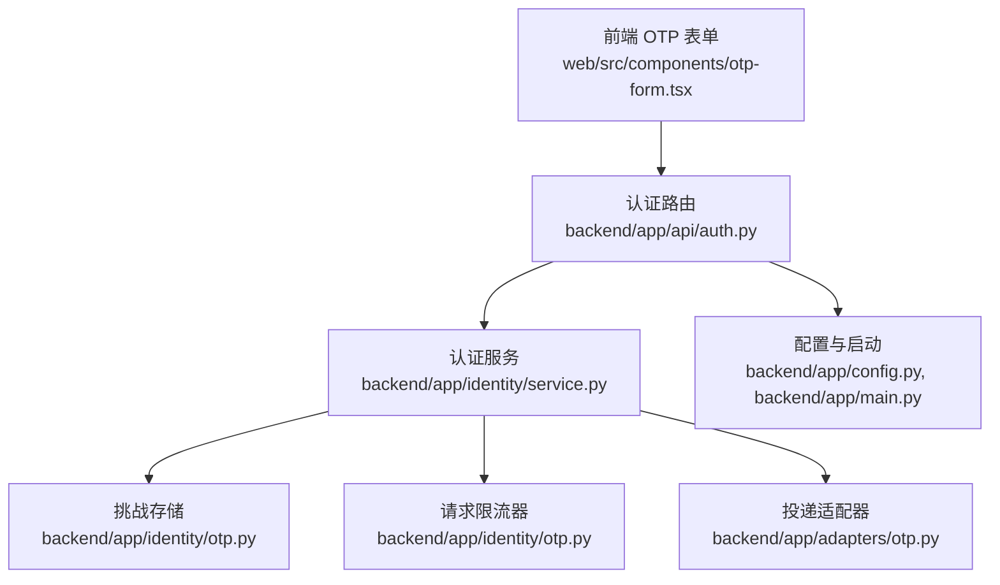
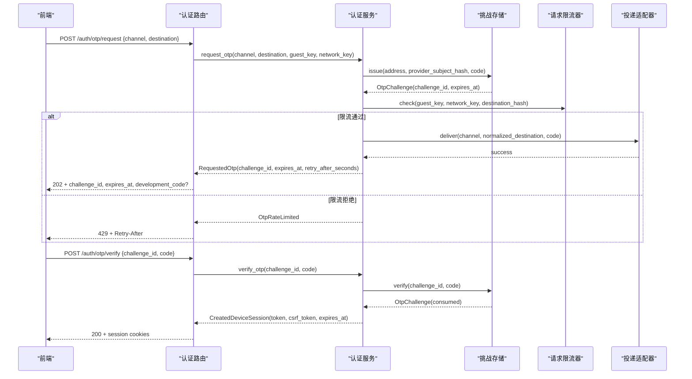
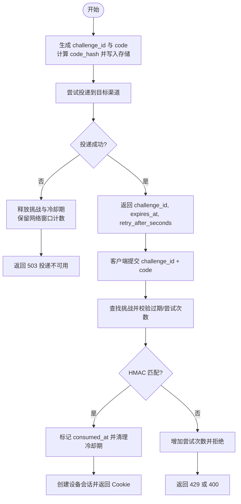
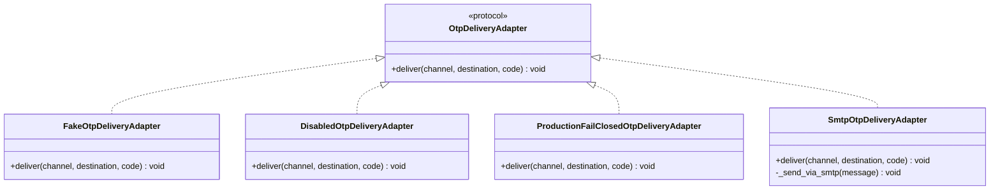
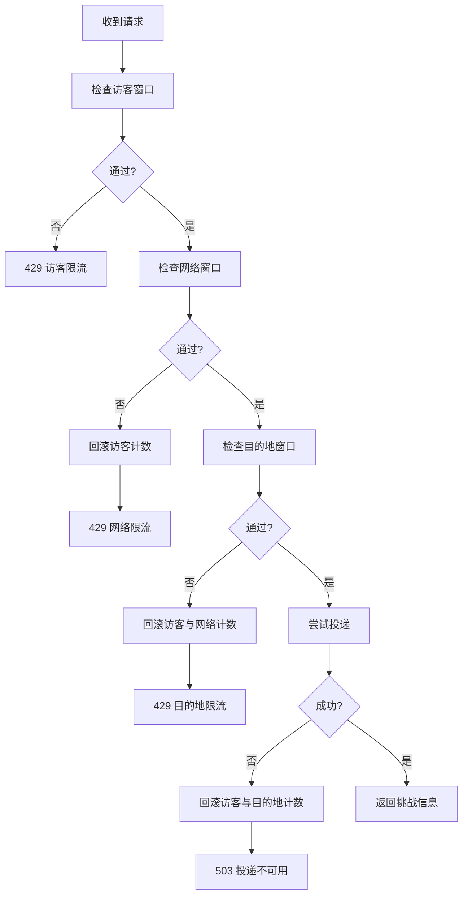
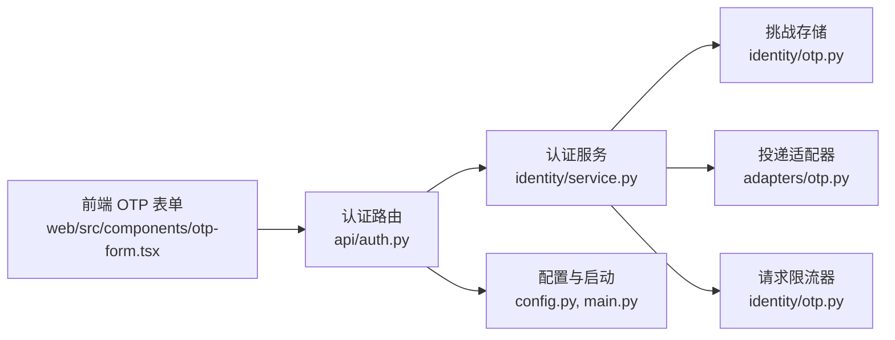

# OTP 认证流程

<cite>
**本文引用的文件**
- [backend/app/identity/otp.py](file://backend/app/identity/otp.py)
- [backend/app/adapters/otp.py](file://backend/app/adapters/otp.py)
- [backend/app/identity/service.py](file://backend/app/identity/service.py)
- [backend/app/api/auth.py](file://backend/app/api/auth.py)
- [backend/app/config.py](file://backend/app/config.py)
- [backend/app/main.py](file://backend/app/main.py)
- [backend/app/identity/schemas.py](file://backend/app/identity/schemas.py)
- [web/src/components/otp-form.tsx](file://web/src/components/otp-form.tsx)
- [backend/tests/test_auth.py](file://backend/tests/test_auth.py)
- [backend/tests/test_smtp_otp_adapter.py](file://backend/tests/test_smtp_otp_adapter.py)
</cite>

## 目录
1. [简介](#简介)
2. [项目结构](#项目结构)
3. [核心组件](#核心组件)
4. [架构总览](#架构总览)
5. [详细组件分析](#详细组件分析)
6. [依赖关系分析](#依赖关系分析)
7. [性能与扩展性](#性能与扩展性)
8. [故障排查指南](#故障排查指南)
9. [结论](#结论)
10. [附录：API 调用示例与错误处理最佳实践](#附录api-调用示例与错误处理最佳实践)

## 简介
本文件系统性梳理并文档化后端 OTP（一次性验证码）认证流程，覆盖手机号与邮箱两种渠道的验证码生成、发送、验证与防重放策略；详细说明 OTP 挑战-响应协议中的 challenge_id 管理、过期时间控制与重试限制；阐述 OTP 适配器模式如何支持多种短信/邮件服务提供商的无缝切换；解释速率限制与防暴力破解措施，包括请求频率控制、IP 维度限制与异常检测；并提供开发环境模拟 OTP 功能与生产环境安全配置建议，以及完整的 API 调用示例和错误处理最佳实践。

## 项目结构
OTP 相关代码主要分布在以下模块：
- 身份层：定义 OTP 挑战、存储、限流、地址归一化与安全哈希
- 适配层：抽象 OTP 投递通道，提供 Fake、Disabled、ProductionFailClosed、SMTP 等实现
- 服务层：编排 OTP 请求与验证流程，协调存储、投递与用户会话创建
- API 层：暴露 /auth/otp/request 与 /auth/otp/verify 接口，统一错误与限流响应
- 配置与启动：集中加载环境变量，注入 OTP 相关组件，执行生产安全检查
- 前端：Next.js 表单组件驱动 OTP 交互流程

**图表来源**
- [backend/app/api/auth.py:44-138](file://backend/app/api/auth.py#L44-L138)
- [backend/app/identity/service.py:78-191](file://backend/app/identity/service.py#L78-L191)
- [backend/app/identity/otp.py:64-304](file://backend/app/identity/otp.py#L64-L304)
- [backend/app/adapters/otp.py:20-129](file://backend/app/adapters/otp.py#L20-L129)
- [backend/app/config.py:62-148](file://backend/app/config.py#L62-L148)
- [backend/app/main.py:50-113](file://backend/app/main.py#L50-L113)

**章节来源**
- [backend/app/api/auth.py:44-138](file://backend/app/api/auth.py#L44-L138)
- [backend/app/identity/service.py:78-191](file://backend/app/identity/service.py#L78-L191)
- [backend/app/identity/otp.py:64-304](file://backend/app/identity/otp.py#L64-L304)
- [backend/app/adapters/otp.py:20-129](file://backend/app/adapters/otp.py#L20-L129)
- [backend/app/config.py:62-148](file://backend/app/config.py#L62-L148)
- [backend/app/main.py:50-113](file://backend/app/main.py#L50-L113)

## 核心组件
- 地址归一化与掩码：对手机号与邮箱进行标准化与脱敏显示，防止明文落库
- 挑战存储：维护 challenge_id、code_hash、过期时间、尝试次数与冷却期
- 请求限流器：三层窗口限流（访客、网络/IP、目的地），失败可回滚
- 投递适配器：统一 deliver(channel, destination, code)，支持 Fake/SMTP/禁用/生产关闭
- 认证服务：编排 request_otp 与 verify_otp，创建设备会话并记录审计事件
- API 路由：封装请求校验、错误映射、CSRF 保护与响应体
- 配置与启动：环境变量注入、生产安全校验、OTP 组件装配

**章节来源**
- [backend/app/identity/otp.py:183-218](file://backend/app/identity/otp.py#L183-L218)
- [backend/app/identity/otp.py:221-304](file://backend/app/identity/otp.py#L221-L304)
- [backend/app/adapters/otp.py:20-129](file://backend/app/adapters/otp.py#L20-L129)
- [backend/app/identity/service.py:78-191](file://backend/app/identity/service.py#L78-L191)
- [backend/app/api/auth.py:44-138](file://backend/app/api/auth.py#L44-L138)
- [backend/app/config.py:62-148](file://backend/app/config.py#L62-L148)
- [backend/app/main.py:50-113](file://backend/app/main.py#L50-L113)

## 架构总览
OTP 认证采用“挑战-响应”协议：
- 客户端先请求验证码，服务端生成 challenge_id 与验证码，通过适配器发送到目标渠道
- 客户端在有效期内提交 challenge_id 与验证码进行验证
- 验证通过后建立设备会话，设置 Cookie，并绑定或复用用户身份

**图表来源**
- [backend/app/api/auth.py:44-138](file://backend/app/api/auth.py#L44-L138)
- [backend/app/identity/service.py:100-191](file://backend/app/identity/service.py#L100-L191)
- [backend/app/identity/otp.py:221-304](file://backend/app/identity/otp.py#L221-L304)
- [backend/app/adapters/otp.py:20-129](file://backend/app/adapters/otp.py#L20-L129)

## 详细组件分析

### OTP 挑战-响应协议与状态机
- 挑战生成：基于地址归一化后的 channel+normalized 计算 provider_subject_hash，结合随机六位验证码生成 code_hash，存入挑战存储并设定 TTL 与冷却期
- 挑战验证：根据 challenge_id 查找挑战，校验是否已消费或过期，检查尝试次数上限，使用 HMAC 比对 code_hash，成功后标记 consumed_at 并清理冷却期
- 防重放：code_hash 由 secret + challenge_id + code 计算，challenge_id 唯一且不可预测；consumed_at 确保一次有效；冷却期防止同一目的地短时间内重复发放

**图表来源**
- [backend/app/identity/otp.py:221-304](file://backend/app/identity/otp.py#L221-L304)
- [backend/app/identity/service.py:100-191](file://backend/app/identity/service.py#L100-L191)
- [backend/app/api/auth.py:44-138](file://backend/app/api/auth.py#L44-L138)

**章节来源**
- [backend/app/identity/otp.py:221-304](file://backend/app/identity/otp.py#L221-L304)
- [backend/app/identity/service.py:100-191](file://backend/app/identity/service.py#L100-L191)
- [backend/app/api/auth.py:44-138](file://backend/app/api/auth.py#L44-L138)

### 地址归一化与安全哈希
- 手机号：仅保留数字，去除国家码前缀，校验中国大陆手机号格式，输出规范化号码与掩码
- 邮箱：使用标准校验器归一化并小写，输出掩码本地部分与域名
- 身份哈希：使用 HMAC-SHA256 将 channel+normalized 与密钥组合，用于跨会话/跨设备的稳定标识

**章节来源**
- [backend/app/identity/otp.py:183-218](file://backend/app/identity/otp.py#L183-L218)

### OTP 适配器模式
- 协议：OtpDeliveryAdapter.deliver(channel, destination, code)
- 实现：
  - FakeOtpDeliveryAdapter：记录投递内容，不实际发送，适合开发与测试
  - DisabledOtpDeliveryAdapter：直接抛出投递不可用，用于禁用场景
  - ProductionFailClosedOtpDeliveryAdapter：生产环境默认拒绝所有投递，直到具备持久化挑战存储
  - SmtpOtpDeliveryAdapter：通过 smtplib 发送电子邮件，强制 TLS（STARTTLS 或 SSL），不泄露敏感信息

**图表来源**
- [backend/app/adapters/otp.py:20-129](file://backend/app/adapters/otp.py#L20-L129)

**章节来源**
- [backend/app/adapters/otp.py:20-129](file://backend/app/adapters/otp.py#L20-L129)

### 请求限流与防暴力破解
- 三层窗口限流：
  - 访客维度：按 guest_key 限制单位时间内请求次数
  - 网络维度：按 IP（考虑可信代理）限制单位时间内请求次数
  - 目的地维度：按 provider_subject_hash 限制单位时间内请求次数
- 原子回滚：若后续层拒绝或投递失败，回滚已消耗的访客与目的地计数，但保留网络计数以抵御供应商宕机时的滥用
- 验证重试限制：挑战存储中 max_attempts 限制同一挑战的尝试次数，超限返回 429

**图表来源**
- [backend/app/identity/otp.py:64-181](file://backend/app/identity/otp.py#L64-L181)
- [backend/app/identity/service.py:100-151](file://backend/app/identity/service.py#L100-L151)

**章节来源**
- [backend/app/identity/otp.py:64-181](file://backend/app/identity/otp.py#L64-L181)
- [backend/app/identity/service.py:100-151](file://backend/app/identity/service.py#L100-L151)

### 认证服务与会话创建
- request_otp：归一化地址、生成挑战、限流检查、投递验证码，失败时回滚
- verify_otp：验证挑战、解析或创建用户身份、创建设备会话、记录审计事件、返回会话令牌与 CSRF Token
- 前端交互：Next.js 表单组件负责获取 CSRF、发送验证码、输入验证码并处理错误提示

**章节来源**
- [backend/app/identity/service.py:100-191](file://backend/app/identity/service.py#L100-L191)
- [web/src/components/otp-form.tsx:131-207](file://web/src/components/otp-form.tsx#L131-L207)

## 依赖关系分析
- API 路由依赖认证服务，服务依赖挑战存储、投递适配器与可选的请求限流器
- 配置模块提供 OTP 相关参数与环境变量注入，启动模块装配 OTP 组件并执行生产安全校验
- 前端依赖后端 API，遵循统一的错误模型与 CSRF 机制

**图表来源**
- [backend/app/api/auth.py:44-138](file://backend/app/api/auth.py#L44-L138)
- [backend/app/identity/service.py:78-191](file://backend/app/identity/service.py#L78-L191)
- [backend/app/identity/otp.py:64-304](file://backend/app/identity/otp.py#L64-L304)
- [backend/app/adapters/otp.py:20-129](file://backend/app/adapters/otp.py#L20-L129)
- [backend/app/config.py:62-148](file://backend/app/config.py#L62-L148)
- [backend/app/main.py:50-113](file://backend/app/main.py#L50-L113)
- [web/src/components/otp-form.tsx:131-207](file://web/src/components/otp-form.tsx#L131-L207)

**章节来源**
- [backend/app/api/auth.py:44-138](file://backend/app/api/auth.py#L44-L138)
- [backend/app/identity/service.py:78-191](file://backend/app/identity/service.py#L78-L191)
- [backend/app/identity/otp.py:64-304](file://backend/app/identity/otp.py#L64-L304)
- [backend/app/adapters/otp.py:20-129](file://backend/app/adapters/otp.py#L20-L129)
- [backend/app/config.py:62-148](file://backend/app/config.py#L62-L148)
- [backend/app/main.py:50-113](file://backend/app/main.py#L50-L113)
- [web/src/components/otp-form.tsx:131-207](file://web/src/components/otp-form.tsx#L131-L207)

## 性能与扩展性
- 挑战存储与限流器当前为内存实现，适用于单机与测试；生产环境应替换为 Redis 等分布式存储以支持水平扩展与高可用
- 投递适配器可通过工厂模式注入不同供应商，便于横向扩展短信/邮件服务商
- 限流器采用窗口计数与原子回滚，避免资源泄漏与误伤正常流量
- 验证码生成使用密码学安全的随机数，保证不可预测性

[本节为通用指导，无需特定文件引用]

## 故障排查指南
- 投递不可用：检查 SMTP 配置（host/port/security/username/password/sender），确认服务器支持 STARTTLS 或 SSL；生产环境需具备持久化挑战存储
- 限流触发：检查访客、网络、目的地窗口配置；关注 X-Forwarded-For 与可信代理 CIDR 设置
- 验证码无效或过期：确认挑战未过期、未被消费、尝试次数未超限；核对前端提交的 challenge_id 与 code
- 生产安全校验失败：检查 cookie_secure、identity_hash_key、content_encryption_key_b64、model/provider 白名单等

**章节来源**
- [backend/app/adapters/otp.py:57-129](file://backend/app/adapters/otp.py#L57-L129)
- [backend/app/config.py:188-212](file://backend/app/config.py#L188-L212)
- [backend/tests/test_auth.py:329-367](file://backend/tests/test_auth.py#L329-L367)

## 结论
该 OTP 系统通过清晰的挑战-响应协议、严格的地址归一化与安全哈希、多层级请求限流与健壮的错误回滚机制，实现了手机号与邮箱渠道的安全认证。适配器模式使多供应商切换成为可能，配置与启动阶段的生产安全校验保障了部署安全性。建议在生产环境中替换内存存储为分布式存储，并完善监控与告警以提升稳定性与可观测性。

[本节为总结性内容，无需特定文件引用]

## 附录：API 调用示例与错误处理最佳实践

### 请求验证码
- 端点：POST /api/v1/auth/otp/request
- 请求体：{ "channel": "email"|"phone", "destination": "邮箱或手机号" }
- 响应：202 Accepted，包含 challenge_id、expires_at、retry_after_seconds；开发/测试环境下可能包含 development_code
- 错误：
  - 400 Invalid destination：目的地格式无效
  - 429 Please wait before requesting another code：限流
  - 503 OTP delivery unavailable：投递不可用

**章节来源**
- [backend/app/api/auth.py:44-88](file://backend/app/api/auth.py#L44-L88)
- [backend/app/identity/schemas.py:16-29](file://backend/app/identity/schemas.py#L16-L29)
- [web/src/components/otp-form.tsx:131-166](file://web/src/components/otp-form.tsx#L131-L166)

### 验证验证码
- 端点：POST /api/v1/auth/otp/verify
- 请求体：{ "challenge_id": "UUID", "code": "六位数字" }
- 响应：200 OK，包含 user_id、session_id、expires_at、csrf_token；同时设置设备会话 Cookie
- 错误：
  - 400 Invalid or expired code：验证码无效或过期
  - 429 Too many verification attempts：尝试次数超限

**章节来源**
- [backend/app/api/auth.py:91-138](file://backend/app/api/auth.py#L91-L138)
- [backend/app/identity/schemas.py:32-45](file://backend/app/identity/schemas.py#L32-L45)
- [web/src/components/otp-form.tsx:180-207](file://web/src/components/otp-form.tsx#L180-L207)

### 错误处理最佳实践
- 前端统一捕获 JSON 错误体中的 title，展示友好提示；非 JSON 错误使用默认消息
- 对于 429，读取 Retry-After 或 retry_after_seconds 进行倒计时提示
- 对于 503，提示服务暂时不可用并允许重试；避免立即刷新页面造成用户体验下降
- 严格校验输入：邮箱格式、六位数字验证码；前端使用 Zod 校验，后端使用 Pydantic 校验

**章节来源**
- [web/src/components/otp-form.tsx:54-73](file://web/src/components/otp-form.tsx#L54-L73)
- [backend/app/api/auth.py:69-110](file://backend/app/api/auth.py#L69-L110)
- [backend/tests/test_auth.py:161-177](file://backend/tests/test_auth.py#L161-L177)

### 生产环境安全配置要点
- 禁止使用 fake 适配器；必须配置真实投递或禁用
- 启用 secure cookies；注入 identity_hash_key 与 content_encryption_key_b64
- 生产环境暂不支持 SMTP OTP 投递，需等待持久化挑战存储就绪
- 固定运行时路径与发布工件摘要，防止篡改

**章节来源**
- [backend/app/config.py:188-212](file://backend/app/config.py#L188-L212)
- [backend/tests/test_config.py:86-99](file://backend/tests/test_config.py#L86-L99)
- [backend/tests/test_auth.py:329-367](file://backend/tests/test_auth.py#L329-L367)