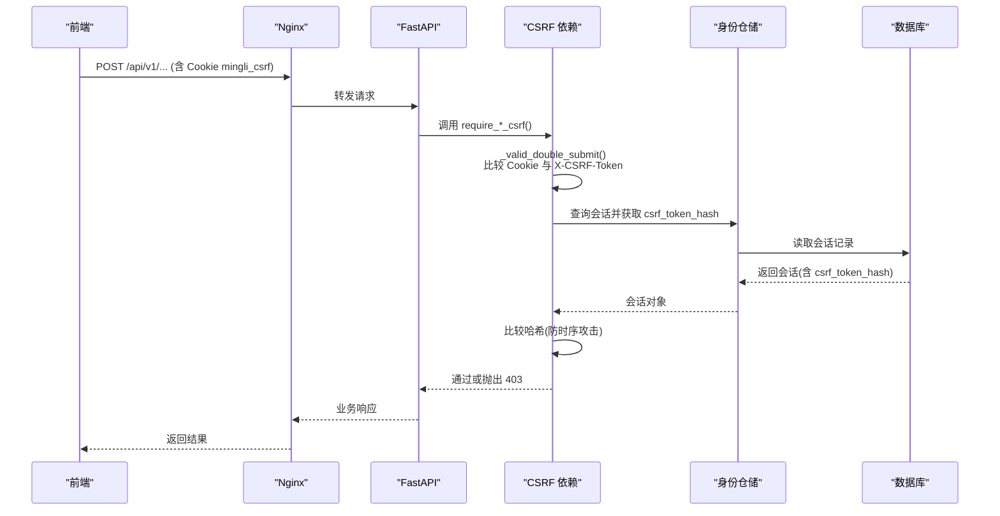
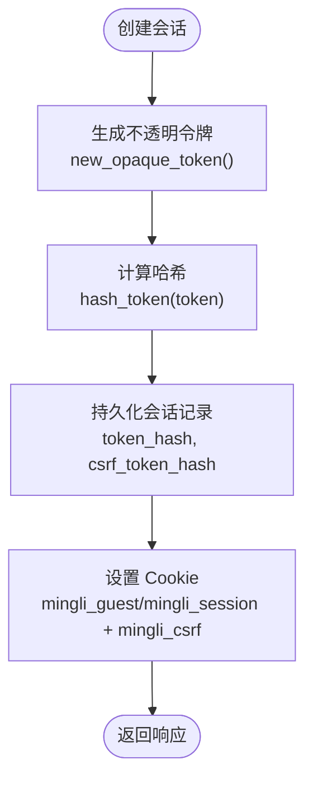
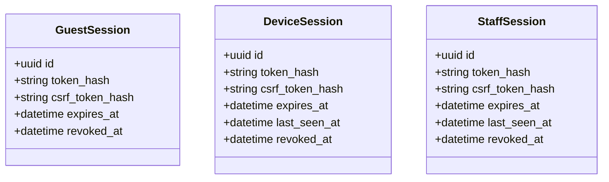
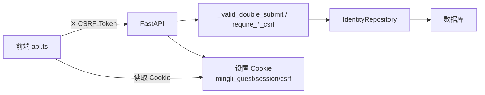

# CSRF 保护机制

<cite>
**本文引用的文件**
- [backend/app/api/dependencies.py](file://backend/app/api/dependencies.py)
- [backend/app/identity/cookies.py](file://backend/app/identity/cookies.py)
- [backend/app/identity/security.py](file://backend/app/identity/security.py)
- [backend/app/api/guest_sessions.py](file://backend/app/api/guest_sessions.py)
- [backend/app/admin/service.py](file://backend/app/admin/service.py)
- [backend/app/admin/cookies.py](file://backend/app/admin/cookies.py)
- [backend/app/api/admin.py](file://backend/app/api/admin.py)
- [backend/app/identity/models.py](file://backend/app/identity/models.py)
- [web/src/lib/api.ts](file://web/src/lib/api.ts)
- [admin/src/lib/api.ts](file://admin/src/lib/api.ts)
- [infra/nginx/app.conf](file://infra/nginx/app.conf)
- [backend/tests/test_csrf.py](file://backend/tests/test_csrf.py)
- [backend/tests/test_guest_sessions.py](file://backend/tests/test_guest_sessions.py)
</cite>

## 目录
1. [简介](#简介)
2. [项目结构](#项目结构)
3. [核心组件](#核心组件)
4. [架构总览](#架构总览)
5. [详细组件分析](#详细组件分析)
6. [依赖关系分析](#依赖关系分析)
7. [性能考量](#性能考量)
8. [故障排查指南](#故障排查指南)
9. [结论](#结论)
10. [附录](#附录)

## 简介
本文件系统性阐述本项目中的跨站请求伪造（CSRF）保护机制，覆盖令牌生成、存储策略、验证流程、双重提交 Cookie 与同源请求头模式的选择与应用场景，以及与会话的关联、轮换与失效处理。同时说明来源验证、Referer 检查与自定义头部验证等防护原理，给出不同 HTTP 方法的保护策略（尤其是 GET），并提供前端集成指南、常见误报解决方案，以及攻击检测与审计日志记录方案。

## 项目结构
后端采用 FastAPI，通过依赖注入在路由层统一校验 CSRF；前端使用浏览器 fetch，自动携带 Cookie 并在写操作时附加自定义请求头 X-CSRF-Token。Nginx 作为边缘网关设置安全响应头并限制缓存策略。

```mermaid
graph TB
Client["浏览器/客户端"] --> Nginx["Nginx 网关"]
Nginx --> API["FastAPI 应用"]
API --> Deps["CSRF 校验依赖<br/>_valid_double_submit / require_*_csrf"]
API --> Repo["身份仓储<br/>IdentityRepository"]
Repo --> DB["数据库<br/>会话表/审计表"]
Client <-- Cookies["Cookie: mingli_guest / mingli_session / mingli_csrf"]
```

图表来源
- [backend/app/api/dependencies.py:29-54](file://backend/app/api/dependencies.py#L29-L54)
- [backend/app/api/guest_sessions.py:16-52](file://backend/app/api/guest_sessions.py#L16-L52)
- [backend/app/identity/cookies.py:35-89](file://backend/app/identity/cookies.py#L35-L89)
- [infra/nginx/app.conf:1-44](file://infra/nginx/app.conf#L1-L44)

章节来源
- [backend/app/api/dependencies.py:1-136](file://backend/app/api/dependencies.py#L1-L136)
- [backend/app/identity/cookies.py:1-102](file://backend/app/identity/cookies.py#L1-L102)
- [backend/app/api/guest_sessions.py:1-52](file://backend/app/api/guest_sessions.py#L1-L52)
- [infra/nginx/app.conf:1-44](file://infra/nginx/app.conf#L1-L44)

## 核心组件
- 令牌生成与安全哈希
  - 使用不可预测的随机令牌生成器生成不透明令牌，并对令牌进行 SHA-256 哈希后持久化，避免明文落库。
- 双重提交 Cookie 模式
  - 服务端将 CSRF 令牌写入名为 mingli_csrf 的 Cookie（非 HttpOnly），同时在请求头中要求携带同名值 X-CSRF-Token；服务端比较两者是否一致，再与数据库中会话的 csrf_token_hash 比对。
- 会话绑定与存储
  - 访客会话（GuestSession）、设备会话（DeviceSession）与管理员会话（StaffSession）均保存 csrf_token_hash，用于后续校验。
- 前端集成
  - 写操作自动读取 Cookie 中的 mingli_csrf，并以 X-CSRF-Token 发送；若 403 且提示“CSRF validation failed”，则清理本地缓存并重试一次。
- 网关安全头
  - Nginx 设置 Referrer-Policy 为 strict-origin-when-cross-origin，并禁止缓存敏感响应，降低信息泄露风险。

章节来源
- [backend/app/identity/security.py:1-11](file://backend/app/identity/security.py#L1-L11)
- [backend/app/api/dependencies.py:29-54](file://backend/app/api/dependencies.py#L29-L54)
- [backend/app/identity/models.py:75-107](file://backend/app/identity/models.py#L75-L107)
- [web/src/lib/api.ts:239-385](file://web/src/lib/api.ts#L239-L385)
- [infra/nginx/app.conf:1-44](file://infra/nginx/app.conf#L1-L44)

## 架构总览
下图展示从前端发起写请求到后端完成 CSRF 校验的完整调用链：



图表来源
- [backend/app/api/dependencies.py:29-54](file://backend/app/api/dependencies.py#L29-L54)
- [backend/app/api/guest_sessions.py:16-52](file://backend/app/api/guest_sessions.py#L16-L52)
- [backend/app/identity/models.py:91-107](file://backend/app/identity/models.py#L91-L107)

## 详细组件分析

### 令牌生成与存储策略
- 生成算法
  - 使用不可预测的随机源生成不透明令牌，长度足够且具备高熵，防止猜测。
- 存储策略
  - 仅存储令牌的 SHA-256 哈希，避免明文泄露；会话创建时生成新的 CSRF 令牌并持久化其哈希。
- 会话模型
  - GuestSession、DeviceSession、StaffSession 均包含 csrf_token_hash 字段，支持按会话维度隔离与校验。



图表来源
- [backend/app/identity/security.py:5-10](file://backend/app/identity/security.py#L5-L10)
- [backend/app/identity/models.py:75-107](file://backend/app/identity/models.py#L75-L107)
- [backend/app/identity/cookies.py:35-89](file://backend/app/identity/cookies.py#L35-L89)

章节来源
- [backend/app/identity/security.py:1-11](file://backend/app/identity/security.py#L1-L11)
- [backend/app/identity/models.py:75-107](file://backend/app/identity/models.py#L75-L107)
- [backend/app/identity/cookies.py:35-89](file://backend/app/identity/cookies.py#L35-L89)

### 双重提交 Cookie 模式的实现
- 前端行为
  - 写请求自动读取 Cookie mingli_csrf，并以 X-CSRF-Token 头发送；若收到 403 且错误标题为“CSRF validation failed”，则清理本地缓存并重试一次。
- 后端校验
  - 依赖函数 _valid_double_submit 提取 Cookie 与请求头中的令牌，使用恒定时间比较确保相等；随后与数据库中该会话的 csrf_token_hash 再次比对。
- 适用场景
  - 适用于浏览器环境下的表单/JSON 写操作，兼顾安全性与易用性。

```mermaid
sequenceDiagram
participant FE as "前端"
participant API as "FastAPI"
participant DEP as "CSRF 依赖"
participant DB as "数据库"
FE->>API : POST /... (Cookie : mingli_csrf; Header : X-CSRF-Token)
API->>DEP : require_*_csrf()
DEP->>DEP : _valid_double_submit()<br/>Cookie == Header?
alt 不相等或缺失
DEP-->>API : 403 CSRF validation failed
API-->>FE : 403
FE->>FE : 清理缓存并重试
else 相等
DEP->>DB : 查询会话的 csrf_token_hash
DB-->>DEP : 返回哈希
DEP->>DEP : 比较哈希(恒定时间)
DEP-->>API : 通过
API-->>FE : 2xx
end
```

图表来源
- [web/src/lib/api.ts:292-330](file://web/src/lib/api.ts#L292-L330)
- [web/src/lib/api.ts:332-385](file://web/src/lib/api.ts#L332-L385)
- [backend/app/api/dependencies.py:29-54](file://backend/app/api/dependencies.py#L29-L54)

章节来源
- [web/src/lib/api.ts:239-385](file://web/src/lib/api.ts#L239-L385)
- [backend/app/api/dependencies.py:29-54](file://backend/app/api/dependencies.py#L29-L54)

### 同源请求头模式的选择与应用
- 选择依据
  - 本项目采用“双重提交 Cookie”模式：Cookie 提供同源上下文，请求头提供可被篡改的额外校验；二者结合可有效抵御 CSRF。
- 何时考虑纯同源请求头
  - 当无法控制 Cookie 属性或存在严格 CSP 限制时，可考虑仅依赖同源策略与自定义头部；但需配合严格的 Referer/SameSite/CSP 策略与服务器端来源校验。
- 本项目实践
  - 所有写操作均附带 X-CSRF-Token；读操作通常不需要 CSRF 校验，但可通过 SameSite 与 Referrer-Policy 进一步加固。

章节来源
- [backend/app/api/dependencies.py:29-54](file://backend/app/api/dependencies.py#L29-L54)
- [infra/nginx/app.conf:1-44](file://infra/nginx/app.conf#L1-L44)

### 与会话的关联、轮换与失效
- 关联机制
  - 每个会话（访客、设备、管理员）均绑定一个 csrf_token_hash；校验时需同时满足“Cookie=Header”和“Header 哈希=会话存储哈希”。
- 定期轮换
  - 每次创建新会话会生成新的 CSRF 令牌并替换旧令牌哈希；新会话创建会使旧会话标记为已撤销（revoked_at），从而失效。
- 失效处理
  - 会话过期或被撤销后，即使 Cookie 仍存在，服务端也会因找不到有效会话或哈希不匹配而拒绝请求。



图表来源
- [backend/app/identity/models.py:75-107](file://backend/app/identity/models.py#L75-L107)
- [backend/app/admin/service.py:49-89](file://backend/app/admin/service.py#L49-L89)

章节来源
- [backend/app/identity/models.py:75-107](file://backend/app/identity/models.py#L75-L107)
- [backend/app/admin/service.py:49-89](file://backend/app/admin/service.py#L49-L89)
- [backend/tests/test_guest_sessions.py:40-75](file://backend/tests/test_guest_sessions.py#L40-L75)

### 防护原理：来源验证、Referer 检查与自定义头部验证
- 来源验证
  - 通过 SameSite=lax 与 Secure 标志限制跨站携带 Cookie，减少跨站请求携带敏感 Cookie 的风险。
- Referer 检查
  - Nginx 设置 Referrer-Policy 为 strict-origin-when-cross-origin，限制跨站 Referer 泄露，辅助来源判断。
- 自定义头部验证
  - 强制要求写请求携带 X-CSRF-Token，并与 Cookie 值一致；后端以恒定时间比较避免时序攻击。

章节来源
- [backend/app/identity/cookies.py:12-32](file://backend/app/identity/cookies.py#L12-L32)
- [infra/nginx/app.conf:1-44](file://infra/nginx/app.conf#L1-L44)
- [backend/app/api/dependencies.py:29-36](file://backend/app/api/dependencies.py#L29-L36)

### 不同 HTTP 方法的保护策略（含 GET 的安全考虑）
- 写方法（POST/PUT/PATCH/DELETE）
  - 必须启用 CSRF 校验；本项目通过依赖注入统一拦截，未通过则返回 403。
- 读方法（GET/HEAD/OPTIONS）
  - 一般不强制 CSRF 校验；但建议配合 SameSite、Referrer-Policy 与 Cache-Control 限制缓存与跨站访问。
- GET 的特殊考虑
  - 避免在 GET 中执行状态变更；如需幂等查询，仍应限制缓存与跨域传播，防止被恶意页面利用。

章节来源
- [backend/app/api/dependencies.py:113-130](file://backend/app/api/dependencies.py#L113-L130)
- [infra/nginx/app.conf:16-32](file://infra/nginx/app.conf#L16-L32)

### 前端集成指南
- 自动携带 CSRF
  - 写请求自动读取 Cookie mingli_csrf 并设置为 X-CSRF-Token；读请求无需携带。
- 失败重试
  - 若收到 403 且错误标题为“CSRF validation failed”，清理本地缓存并重试一次，以应对令牌过期或轮换。
- 会话切换
  - 登录成功后可“采纳”设备会话返回的 CSRF 令牌，避免重复创建访客会话。

章节来源
- [web/src/lib/api.ts:292-385](file://web/src/lib/api.ts#L292-L385)
- [web/src/test/api-session.test.ts:50-138](file://web/src/test/api-session.test.ts#L50-L138)

### 管理员后台的 CSRF 保护
- 独立 Cookie 命名空间
  - 管理员后台使用独立的 Cookie 名称（mingli_admin_session、mingli_admin_csrf），避免与 C 端混淆。
- 校验逻辑
  - 管理接口同样要求 Cookie 与 X-CSRF-Token 一致，并与会话存储的哈希比对。

章节来源
- [backend/app/admin/cookies.py:11-65](file://backend/app/admin/cookies.py#L11-L65)
- [backend/app/api/admin.py:87-100](file://backend/app/api/admin.py#L87-L100)

## 依赖关系分析


图表来源
- [web/src/lib/api.ts:292-385](file://web/src/lib/api.ts#L292-L385)
- [backend/app/api/dependencies.py:29-54](file://backend/app/api/dependencies.py#L29-L54)
- [backend/app/identity/cookies.py:35-89](file://backend/app/identity/cookies.py#L35-L89)

章节来源
- [web/src/lib/api.ts:292-385](file://web/src/lib/api.ts#L292-L385)
- [backend/app/api/dependencies.py:29-54](file://backend/app/api/dependencies.py#L29-L54)
- [backend/app/identity/cookies.py:35-89](file://backend/app/identity/cookies.py#L35-L89)

## 性能考量
- 恒定时间比较
  - 使用 hmac.compare_digest 进行令牌比较，避免时序侧信道攻击。
- 最小化数据库访问
  - 仅在需要时查询会话并比对哈希；合理索引 expires_at 提升查询效率。
- 前端缓存优化
  - 本地缓存当前 CSRF 令牌，避免重复创建访客会话；仅在 403 或登出时清理缓存。

章节来源
- [backend/app/api/dependencies.py:29-36](file://backend/app/api/dependencies.py#L29-L36)
- [backend/app/identity/models.py:91-107](file://backend/app/identity/models.py#L91-L107)
- [web/src/lib/api.ts:332-385](file://web/src/lib/api.ts#L332-L385)

## 故障排查指南
- 常见误报与解决
  - 403 “CSRF validation failed”：检查是否携带 X-CSRF-Token 且与 Cookie 一致；确认会话未过期或被撤销；必要时清理缓存并重试。
  - 首次请求失败：前端会在 403 时清理缓存并重试一次，确保使用最新令牌。
- 测试用例参考
  - 无访客会话或令牌不匹配将被拒绝；登出后旧令牌失效。

章节来源
- [backend/tests/test_csrf.py:4-55](file://backend/tests/test_csrf.py#L4-L55)
- [web/src/lib/api.ts:317-330](file://web/src/lib/api.ts#L317-L330)

## 结论
本项目采用“双重提交 Cookie + 会话绑定哈希”的 CSRF 防护方案，结合 Nginx 安全头与前端自动携带令牌机制，形成纵深防御。通过会话级令牌哈希存储、定期轮换与失效处理，有效抵御跨站请求伪造攻击。对 GET 等读操作采取保守策略，避免状态变更；对写操作强制校验，确保安全。

## 附录

### 攻击检测与审计日志记录方案
- 检测点
  - 在 CSRF 校验失败处记录告警事件，包括请求来源、IP、会话标识（脱敏）、时间戳与失败原因。
- 审计事件
  - 使用现有审计事件模型记录关键安全事件（如登录、登出、管理操作），可扩展至 CSRF 失败事件。
- 建议
  - 对高频 403 进行聚合告警；结合 WAF/Nginx 日志进行交叉分析；定期审查异常模式。

章节来源
- [backend/app/identity/models.py:113-132](file://backend/app/identity/models.py#L113-L132)
- [backend/app/admin/service.py:74-82](file://backend/app/admin/service.py#L74-L82)