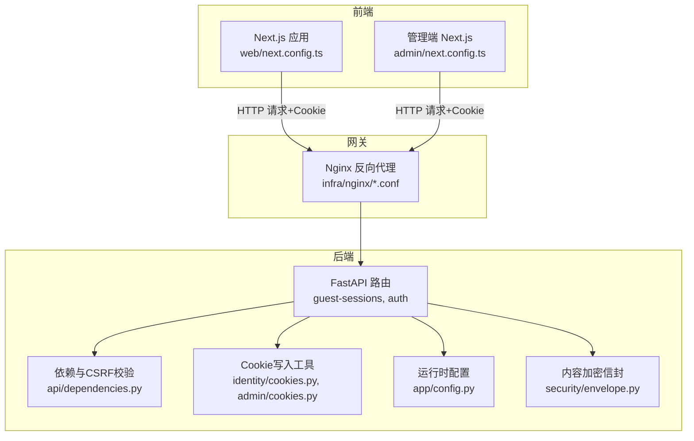
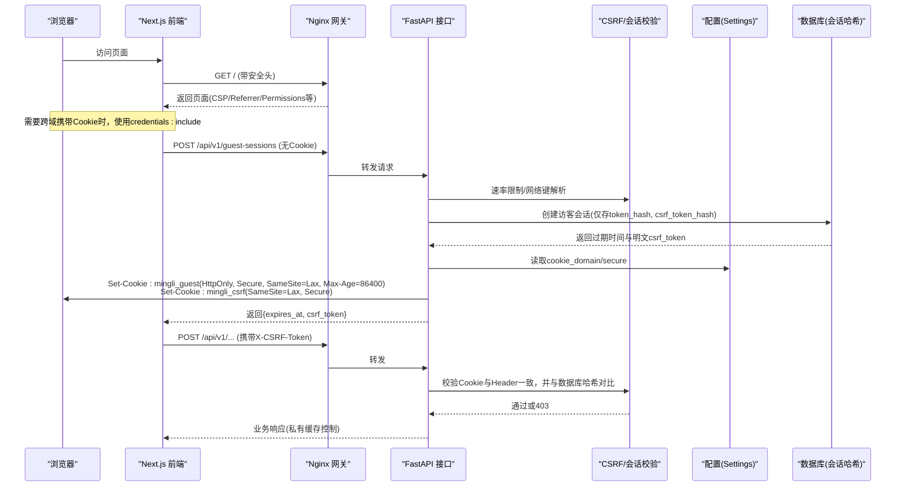
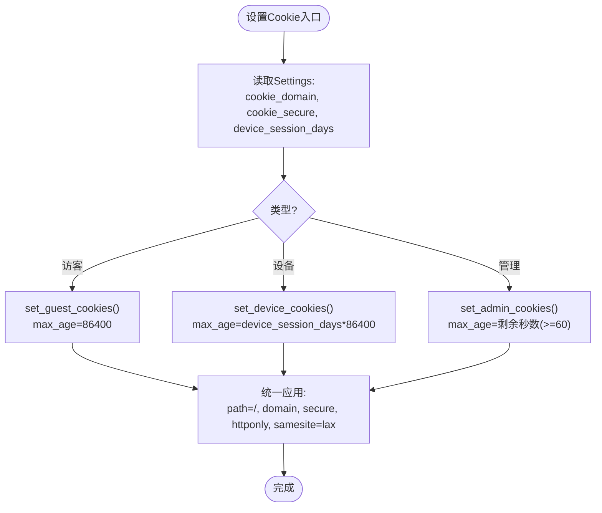
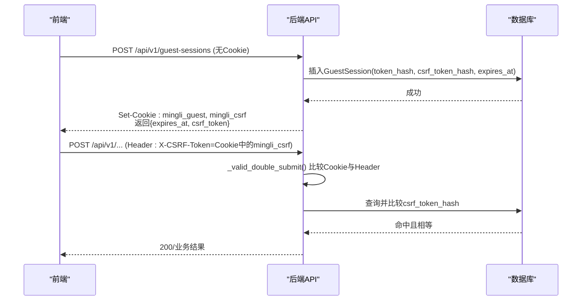
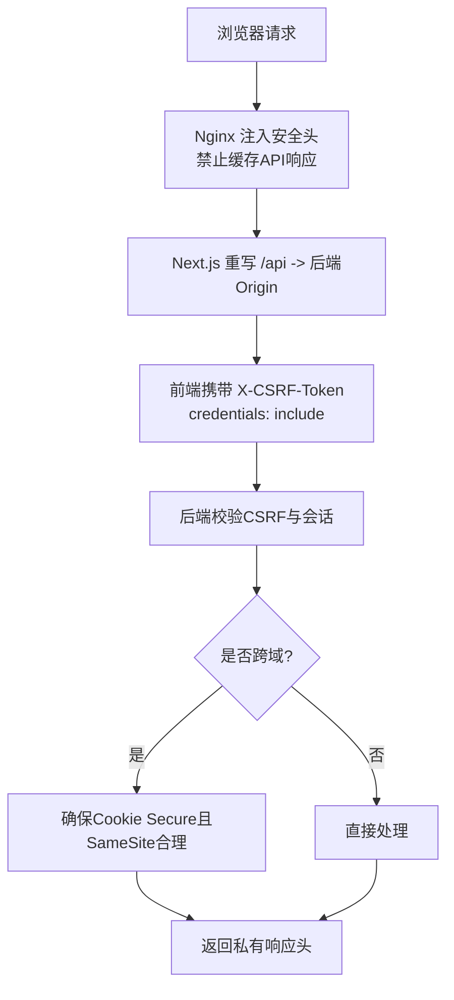
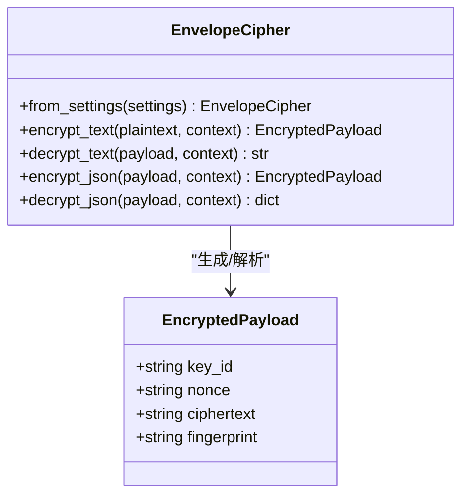
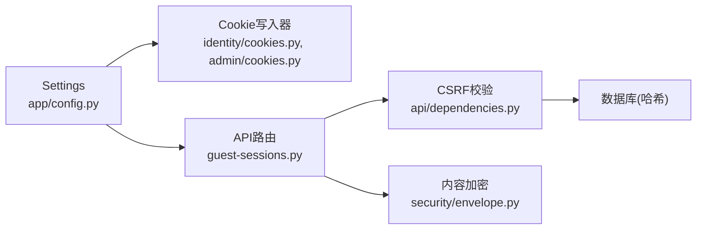

# Cookie 安全配置

<cite>
**本文引用的文件**
- [backend/app/identity/cookies.py](file://backend/app/identity/cookies.py)
- [backend/app/admin/cookies.py](file://backend/app/admin/cookies.py)
- [backend/app/api/guest_sessions.py](file://backend/app/api/guest_sessions.py)
- [backend/app/api/dependencies.py](file://backend/app/api/dependencies.py)
- [backend/app/config.py](file://backend/app/config.py)
- [backend/app/security/envelope.py](file://backend/app/security/envelope.py)
- [backend/tests/test_guest_sessions.py](file://backend/tests/test_guest_sessions.py)
- [backend/tests/test_sensitive_payloads.py](file://backend/tests/test_sensitive_payloads.py)
- [web/src/lib/api.ts](file://web/src/lib/api.ts)
- [web/next.config.ts](file://web/next.config.ts)
- [admin/next.config.ts](file://admin/next.config.ts)
- [infra/nginx/app.conf](file://infra/nginx/app.conf)
- [infra/nginx/fateradar-test-loopback.conf](file://infra/nginx/fateradar-test-loopback.conf)
</cite>

## 目录
1. [简介](#简介)
2. [项目结构](#项目结构)
3. [核心组件](#核心组件)
4. [架构总览](#架构总览)
5. [详细组件分析](#详细组件分析)
6. [依赖关系分析](#依赖关系分析)
7. [性能与安全性考量](#性能与安全性考量)
8. [故障排查指南](#故障排查指南)
9. [结论](#结论)
10. [附录](#附录)

## 简介
本文件系统性梳理并说明本项目中设备会话 Cookie、访客会话 Cookie 以及管理端 Cookie 的安全属性配置，跨域请求处理策略（CORS、预检、凭证传递），Cookie 令牌加密与签名机制（令牌哈希存储、防篡改验证、密钥轮换约束），不同环境下的配置差异与最佳实践，浏览器兼容性考虑与安全漏洞防护，以及调试与排障方法。目标是帮助开发者在保障安全的前提下正确实现与维护 Cookie 相关能力。

## 项目结构
后端通过统一的设置对象集中管理 Cookie 安全开关与域名等参数；身份与会话模块负责生成、写入和清理 Cookie；API 层负责校验 CSRF 与鉴权；前端 Next.js 应用负责携带 CSRF 头并在必要时发起访客会话创建；Nginx 作为反向代理统一注入安全响应头并禁止缓存敏感数据。

**图示来源**
- [web/next.config.ts:27-65](file://web/next.config.ts#L27-L65)
- [admin/next.config.ts:1-64](file://admin/next.config.ts#L1-L64)
- [infra/nginx/app.conf:1-44](file://infra/nginx/app.conf#L1-L44)
- [backend/app/api/guest_sessions.py:1-53](file://backend/app/api/guest_sessions.py#L1-L53)
- [backend/app/api/dependencies.py:1-136](file://backend/app/api/dependencies.py#L1-L136)
- [backend/app/identity/cookies.py:1-102](file://backend/app/identity/cookies.py#L1-L102)
- [backend/app/admin/cookies.py:1-81](file://backend/app/admin/cookies.py#L1-L81)
- [backend/app/config.py:62-141](file://backend/app/config.py#L62-L141)
- [backend/app/security/envelope.py:1-122](file://backend/app/security/envelope.py#L1-L122)

**章节来源**
- [web/next.config.ts:27-65](file://web/next.config.ts#L27-L65)
- [admin/next.config.ts:1-64](file://admin/next.config.ts#L1-L64)
- [infra/nginx/app.conf:1-44](file://infra/nginx/app.conf#L1-L44)
- [backend/app/api/guest_sessions.py:1-53](file://backend/app/api/guest_sessions.py#L1-L53)
- [backend/app/api/dependencies.py:1-136](file://backend/app/api/dependencies.py#L1-L136)
- [backend/app/identity/cookies.py:1-102](file://backend/app/identity/cookies.py#L1-L102)
- [backend/app/admin/cookies.py:1-81](file://backend/app/admin/cookies.py#L1-L81)
- [backend/app/config.py:62-141](file://backend/app/config.py#L62-L141)
- [backend/app/security/envelope.py:1-122](file://backend/app/security/envelope.py#L1-L122)

## 核心组件
- 会话 Cookie 写入器：为访客和设备分别设置会话与 CSRF Cookie，统一使用 Path、Domain、Secure、HttpOnly、SameSite 等安全属性。
- CSRF 双重提交校验：前端将 CSRF Token 放入请求头，后端从 Cookie 与 Header 双取并比对，再与数据库中的哈希值进行常量时间比较。
- 配置与安全策略：生产环境强制启用 Secure Cookie，限制本地密钥与不安全的 OTP 适配器，要求内容加密密钥长度与来源合规。
- 内容加密与指纹：对敏感载荷使用 AES-GCM 加密并附加 HMAC 指纹，解密时校验上下文与指纹，防止篡改与误用。
- 前端 CSRF 与凭据：Next.js 通过重写将 /api 转发到后端，统一设置安全响应头；客户端在 POST 请求中携带 X-CSRF-Token，并使用 credentials: include 以允许跨源携带 Cookie。

**章节来源**
- [backend/app/identity/cookies.py:12-32](file://backend/app/identity/cookies.py#L12-L32)
- [backend/app/api/dependencies.py:29-54](file://backend/app/api/dependencies.py#L29-L54)
- [backend/app/config.py:188-239](file://backend/app/config.py#L188-L239)
- [backend/app/security/envelope.py:32-96](file://backend/app/security/envelope.py#L32-L96)
- [web/src/lib/api.ts:292-329](file://web/src/lib/api.ts#L292-L329)
- [web/next.config.ts:31-60](file://web/next.config.ts#L31-L60)

## 架构总览
下图展示了访客会话创建、CSRF 校验与 Cookie 设置的端到端流程。

**图示来源**
- [backend/app/api/guest_sessions.py:16-53](file://backend/app/api/guest_sessions.py#L16-L53)
- [backend/app/identity/cookies.py:35-60](file://backend/app/identity/cookies.py#L35-L60)
- [backend/app/api/dependencies.py:29-54](file://backend/app/api/dependencies.py#L29-L54)
- [web/src/lib/api.ts:292-329](file://web/src/lib/api.ts#L292-L329)
- [web/next.config.ts:31-60](file://web/next.config.ts#L31-L60)

## 详细组件分析

### 设备与会话 Cookie 安全属性
- 访客会话 Cookie
  - 名称：mingli_guest（会话）、mingli_csrf（CSRF）
  - HttpOnly：会话 Cookie 启用，CSRF Cookie 不启用（需前端读取）
  - Secure：由 Settings.cookie_secure 控制，生产环境强制为真
  - SameSite：lax
  - Path：/
  - Domain：由 Settings.cookie_domain 控制
  - Max-Age：86400（24小时）
- 设备会话 Cookie
  - 名称：mingli_session（会话）、mingli_csrf（CSRF）
  - HttpOnly：会话 Cookie 启用，CSRF Cookie 不启用
  - Secure：同访客会话
  - SameSite：lax
  - Path：/
  - Domain：同访客会话
  - Max-Age：由 device_session_days 决定
- 管理端 Cookie
  - 名称：mingli_admin_session、mingli_admin_csrf
  - 安全属性与上述一致，路径/，SameSite=lax，Secure受控，HttpOnly对会话启用

**图示来源**
- [backend/app/identity/cookies.py:12-32](file://backend/app/identity/cookies.py#L12-L32)
- [backend/app/identity/cookies.py:35-89](file://backend/app/identity/cookies.py#L35-L89)
- [backend/app/admin/cookies.py:15-65](file://backend/app/admin/cookies.py#L15-L65)
- [backend/app/config.py:72-77](file://backend/app/config.py#L72-L77)
- [backend/app/config.py:140-141](file://backend/app/config.py#L140-L141)

**章节来源**
- [backend/app/identity/cookies.py:12-89](file://backend/app/identity/cookies.py#L12-L89)
- [backend/app/admin/cookies.py:15-65](file://backend/app/admin/cookies.py#L15-L65)
- [backend/tests/test_guest_sessions.py:14-38](file://backend/tests/test_guest_sessions.py#L14-L38)

### CSRF 双重提交与校验流程
- 前端行为
  - 首次无 Cookie 时调用 /api/v1/guest-sessions 创建访客会话，服务端返回 expires_at 与 csrf_token，同时设置 mingli_guest 与 mingli_csrf Cookie
  - 后续写操作在请求头中携带 X-CSRF-Token，值为当前 Cookie 中的 mingli_csrf
  - 若收到 403“CSRF validation failed”，前端清除本地 CSRF 缓存并重试一次
- 后端行为
  - 从 Cookie 与 Header 同时取值，若任一缺失或不一致则拒绝
  - 将 Cookie 中的 CSRF Token 哈希化后与数据库中保存的哈希进行常量时间比较，防止时序攻击
  - 设备与会话路径均复用同一校验逻辑

**图示来源**
- [web/src/lib/api.ts:292-329](file://web/src/lib/api.ts#L292-L329)
- [backend/app/api/guest_sessions.py:16-53](file://backend/app/api/guest_sessions.py#L16-L53)
- [backend/app/api/dependencies.py:29-54](file://backend/app/api/dependencies.py#L29-L54)

**章节来源**
- [web/src/lib/api.ts:292-329](file://web/src/lib/api.ts#L292-L329)
- [backend/app/api/dependencies.py:29-54](file://backend/app/api/dependencies.py#L29-L54)
- [backend/tests/test_guest_sessions.py:14-38](file://backend/tests/test_guest_sessions.py#L14-L38)

### 跨域请求处理策略（CORS、预检、凭证传递）
- 反向代理层
  - Nginx 为所有响应注入安全头：X-Content-Type-Options、X-Frame-Options、Referrer-Policy、Permissions-Policy
  - API 路径强制 Cache-Control: private, no-store, max-age=0，避免中间层缓存敏感数据
  - 测试环境配置明确声明仅允许回环代理改写 X-Forwarded-For，防止伪造
- 前端层
  - Next.js 通过 rewrites 将 /api/* 转发至后端 origin
  - 全局响应头包含 CSP、Referrer-Policy、Permissions-Policy、X-Content-Type-Options、X-Frame-Options、COOP
  - 私有页面与 API 响应标记为私有且不缓存
- 凭证传递
  - 前端在创建访客会话与写请求时使用 credentials: include，确保跨域时携带 Cookie
  - 后端根据 Settings.cookie_secure 决定是否仅在 HTTPS 下发送 Cookie

**图示来源**
- [infra/nginx/app.conf:1-44](file://infra/nginx/app.conf#L1-L44)
- [infra/nginx/fateradar-test-loopback.conf:26-57](file://infra/nginx/fateradar-test-loopback.conf#L26-L57)
- [web/next.config.ts:27-65](file://web/next.config.ts#L27-L65)
- [web/src/lib/api.ts:292-329](file://web/src/lib/api.ts#L292-L329)
- [backend/app/config.py:72-77](file://backend/app/config.py#L72-L77)

**章节来源**
- [infra/nginx/app.conf:1-44](file://infra/nginx/app.conf#L1-L44)
- [infra/nginx/fateradar-test-loopback.conf:26-57](file://infra/nginx/fateradar-test-loopback.conf#L26-L57)
- [web/next.config.ts:27-65](file://web/next.config.ts#L27-L65)
- [web/src/lib/api.ts:292-329](file://web/src/lib/api.ts#L292-L329)
- [backend/app/config.py:72-77](file://backend/app/config.py#L72-L77)

### Cookie 令牌加密与签名机制
- 令牌哈希存储
  - 访客与会话的 token 与 csrf_token 均以哈希形式持久化，避免明文落库
  - 校验时使用 hmac.compare_digest 进行常量时间比较，抵御时序侧信道
- 内容加密与指纹
  - 敏感载荷使用 AES-GCM 加密，附带随机 nonce 与基于上下文的 HMAC 指纹
  - 解密时严格校验 key_id、上下文与指纹，任何篡改或不匹配即失败
- 密钥轮换策略
  - 内容加密密钥必须为有效的 base64 编码且长度为 32 字节
  - 生产环境禁止使用本地默认密钥或标识为 local-only 的 key_id
  - 内容加密密钥不得与身份哈希密钥重复，降低密钥重用风险

**图示来源**
- [backend/app/security/envelope.py:24-122](file://backend/app/security/envelope.py#L24-L122)
- [backend/app/config.py:217-239](file://backend/app/config.py#L217-L239)
- [backend/tests/test_sensitive_payloads.py:9-53](file://backend/tests/test_sensitive_payloads.py#L9-L53)

**章节来源**
- [backend/app/security/envelope.py:32-96](file://backend/app/security/envelope.py#L32-L96)
- [backend/app/config.py:217-239](file://backend/app/config.py#L217-L239)
- [backend/tests/test_sensitive_payloads.py:9-53](file://backend/tests/test_sensitive_payloads.py#L9-L53)

### 不同环境的 Cookie 配置差异与最佳实践
- 开发/测试
  - MINGLI_COOKIE_SECURE=false，允许 HTTP 下设置 Cookie
  - 可使用 fake OTP、fake Runtime、fake Model 适配器
  - 建议仅允许回环代理改写 X-Forwarded-For
- 预发/生产
  - MINGLI_COOKIE_SECURE=true 强制启用 Secure Cookie
  - 禁止使用本地默认 identity_hash_key 与 content_encryption_key
  - 禁止使用 fake OTP/Runtime/Model 适配器
  - 内容加密密钥必须显式注入且符合长度与格式要求
  - 建议结合 CDN/网关统一注入安全响应头并禁用缓存

**章节来源**
- [backend/app/config.py:188-239](file://backend/app/config.py#L188-L239)
- [infra/fateradar-test.env.example:13-45](file://infra/fateradar-test.env.example#L13-L45)
- [backend/tests/test_config.py:12-20](file://backend/tests/test_config.py#L12-L20)

### 浏览器兼容性与安全漏洞防护
- 兼容性
  - SameSite=lax 在现代浏览器中广泛支持，适合默认策略
  - Secure 标志在 HTTPS 环境下生效，开发环境可关闭以便本地调试
  - 跨域携带 Cookie 需前端使用 credentials: include，并确保后端允许
- 漏洞防护
  - 使用 HttpOnly 保护会话 Cookie，减少 XSS 窃取风险
  - 使用 CSP、Referrer-Policy、Permissions-Policy、X-Frame-Options 等头部加固
  - 禁止缓存敏感响应，防止中间节点泄露
  - 使用常量时间比较与哈希存储，降低侧信道与明文泄露风险

**章节来源**
- [backend/app/identity/cookies.py:12-32](file://backend/app/identity/cookies.py#L12-L32)
- [infra/nginx/app.conf:1-44](file://infra/nginx/app.conf#L1-L44)
- [web/next.config.ts:39-60](file://web/next.config.ts#L39-L60)
- [backend/app/api/dependencies.py:29-54](file://backend/app/api/dependencies.py#L29-L54)

## 依赖关系分析
- 配置依赖
  - Cookie 写入器依赖 Settings.cookie_domain、cookie_secure、device_session_days
  - 生产安全校验依赖 environment、otp_adapter、content_encryption_key_b64、identity_hash_key
- 模块耦合
  - guest-sessions 路由依赖 cookies 写入器与 rate guard
  - CSRF 校验依赖 identity.security.hash_token 与数据库中的哈希
  - 内容加密依赖 settings.content_encryption_key_b64 与 key_id

**图示来源**
- [backend/app/config.py:62-141](file://backend/app/config.py#L62-L141)
- [backend/app/identity/cookies.py:12-32](file://backend/app/identity/cookies.py#L12-L32)
- [backend/app/admin/cookies.py:15-35](file://backend/app/admin/cookies.py#L15-L35)
- [backend/app/api/guest_sessions.py:16-53](file://backend/app/api/guest_sessions.py#L16-L53)
- [backend/app/api/dependencies.py:29-54](file://backend/app/api/dependencies.py#L29-L54)
- [backend/app/security/envelope.py:32-96](file://backend/app/security/envelope.py#L32-L96)

**章节来源**
- [backend/app/config.py:62-141](file://backend/app/config.py#L62-L141)
- [backend/app/identity/cookies.py:12-32](file://backend/app/identity/cookies.py#L12-L32)
- [backend/app/admin/cookies.py:15-35](file://backend/app/admin/cookies.py#L15-L35)
- [backend/app/api/guest_sessions.py:16-53](file://backend/app/api/guest_sessions.py#L16-L53)
- [backend/app/api/dependencies.py:29-54](file://backend/app/api/dependencies.py#L29-L54)
- [backend/app/security/envelope.py:32-96](file://backend/app/security/envelope.py#L32-L96)

## 性能与安全性考量
- 性能
  - CSRF 校验采用常量时间比较，避免时序攻击的同时保持高效
  - 访客会话创建有速率限制，防止滥用
  - 响应头与缓存策略最小化中间层缓存开销，保证实时性
- 安全性
  - 生产环境强制 Secure Cookie、禁用不安全适配器与本地密钥
  - 内容加密使用 AES-GCM 与 HMAC 指纹，确保机密性与完整性
  - 全链路注入安全响应头，限制资源加载与权限使用

[本节提供通用指导，无需特定文件引用]

## 故障排查指南
- 常见问题
  - 403 CSRF 校验失败：检查前端是否正确设置 X-CSRF-Token，且与 Cookie 中的 mingli_csrf 一致；确认后端已设置 Cookie 且未跨域丢失
  - Cookie 未生效：确认浏览器是否允许跨域携带 Cookie（credentials: include），并检查 Secure/SameSite 是否与站点协议与域名匹配
  - 生产环境启动失败：检查 MINGLI_COOKIE_SECURE、content_encryption_key_b64、identity_hash_key 是否符合要求
- 调试步骤
  - 查看响应头中的 Set-Cookie，确认 HttpOnly、Secure、SameSite、Max-Age、Path、Domain
  - 检查 Nginx 与 Next.js 的安全头是否被覆盖或遗漏
  - 使用浏览器开发者工具观察请求头中的 X-CSRF-Token 与 Cookie 是否一致
  - 在后端日志中定位 CSRF 校验失败的具体原因（缺失、不一致、哈希不匹配）

**章节来源**
- [web/src/lib/api.ts:292-329](file://web/src/lib/api.ts#L292-L329)
- [backend/app/api/dependencies.py:29-54](file://backend/app/api/dependencies.py#L29-L54)
- [infra/nginx/app.conf:1-44](file://infra/nginx/app.conf#L1-L44)
- [web/next.config.ts:39-60](file://web/next.config.ts#L39-L60)
- [backend/tests/test_config.py:12-20](file://backend/tests/test_config.py#L12-L20)

## 结论
本项目通过统一的配置与严格的校验机制，实现了设备与会话 Cookie 的安全属性控制、CSRF 双重提交防护、跨域请求的安全处理以及敏感内容的加密与指纹校验。生产环境通过强制 Secure Cookie、禁用不安全适配器与本地密钥，进一步提升了整体安全性。建议在开发与生产环境中遵循本文的配置与实践，并结合监控与日志进行持续优化与排障。

[本节总结性内容，无需特定文件引用]

## 附录
- 关键环境变量
  - MINGLI_COOKIE_SECURE：控制 Cookie 的 Secure 标志
  - MINGLI_COOKIE_DOMAIN：控制 Cookie 的 Domain
  - MINGLI_DEVICE_SESSION_DAYS：设备会话有效期（天）
  - MINGLI_IDENTITY_HASH_KEY：身份哈希密钥（生产环境必须注入）
  - MINGLI_CONTENT_ENCRYPTION_KEY_B64：内容加密密钥（base64 编码的 32 字节）
  - MINGLI_CONTENT_ENCRYPTION_KEY_ID：内容加密密钥标识
- 参考实现路径
  - Cookie 写入：backend/app/identity/cookies.py、backend/app/admin/cookies.py
  - CSRF 校验：backend/app/api/dependencies.py
  - 访客会话创建：backend/app/api/guest_sessions.py
  - 内容加密：backend/app/security/envelope.py
  - 前端 CSRF 与凭据：web/src/lib/api.ts
  - 安全头与缓存：web/next.config.ts、admin/next.config.ts、infra/nginx/*.conf

**章节来源**
- [backend/app/identity/cookies.py:12-32](file://backend/app/identity/cookies.py#L12-L32)
- [backend/app/admin/cookies.py:15-35](file://backend/app/admin/cookies.py#L15-L35)
- [backend/app/api/dependencies.py:29-54](file://backend/app/api/dependencies.py#L29-L54)
- [backend/app/api/guest_sessions.py:16-53](file://backend/app/api/guest_sessions.py#L16-L53)
- [backend/app/security/envelope.py:32-96](file://backend/app/security/envelope.py#L32-L96)
- [web/src/lib/api.ts:292-329](file://web/src/lib/api.ts#L292-L329)
- [web/next.config.ts:39-60](file://web/next.config.ts#L39-L60)
- [admin/next.config.ts:39-60](file://admin/next.config.ts#L39-L60)
- [infra/nginx/app.conf:1-44](file://infra/nginx/app.conf#L1-L44)