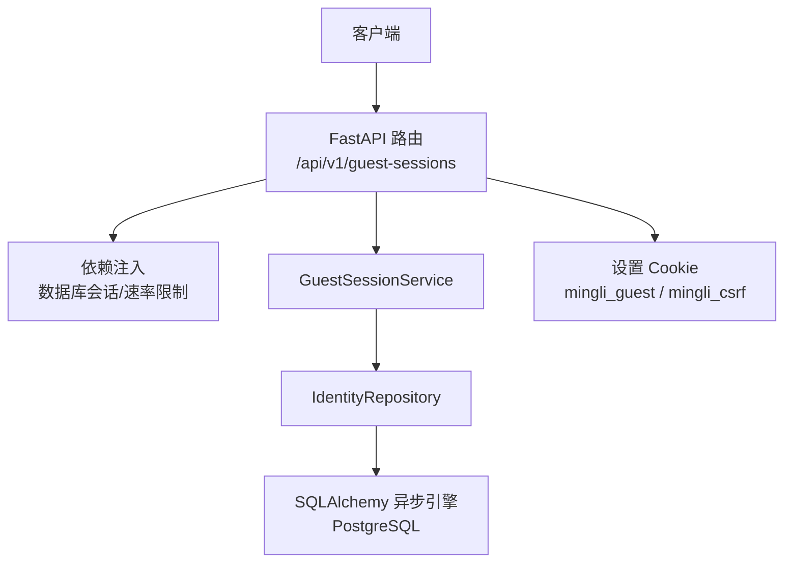
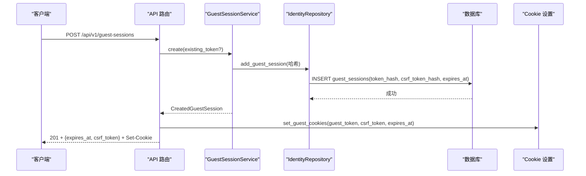
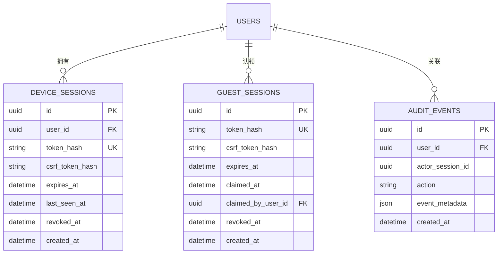
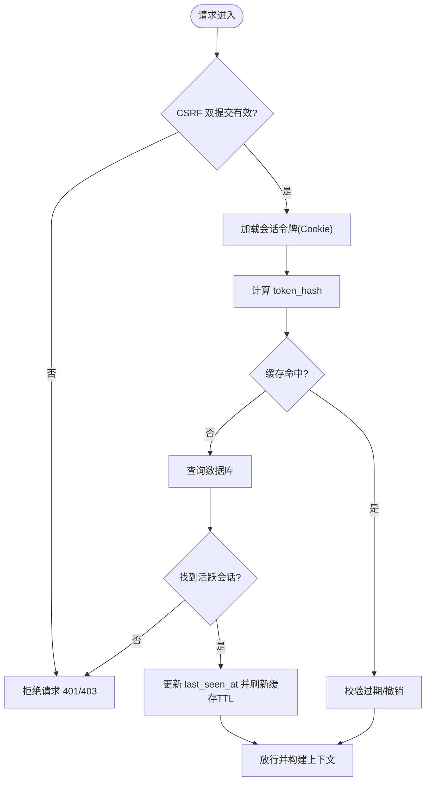
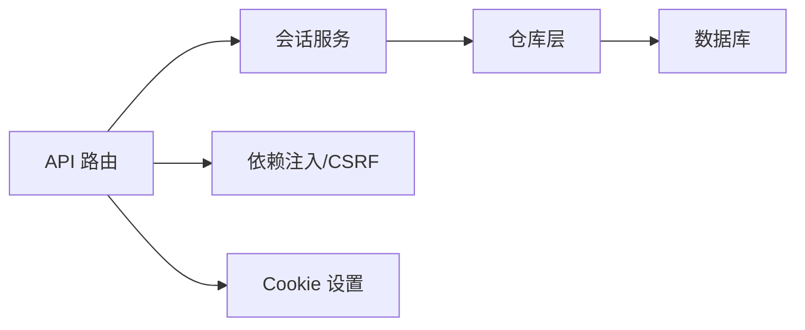

# 会话持久化方案

<cite>
**本文引用的文件**
- [backend/app/identity/models.py](file://backend/app/identity/models.py)
- [backend/app/identity/repository.py](file://backend/app/identity/repository.py)
- [backend/app/identity/service.py](file://backend/app/identity/service.py)
- [backend/app/api/guest_sessions.py](file://backend/app/api/guest_sessions.py)
- [backend/app/api/dependencies.py](file://backend/app/api/dependencies.py)
- [backend/app/identity/cookies.py](file://backend/app/identity/cookies.py)
- [backend/app/config.py](file://backend/app/config.py)
- [backend/app/database.py](file://backend/app/database.py)
- [backend/alembic/versions/0001_identity_foundation.py](file://backend/alembic/versions/0001_identity_foundation.py)
- [backend/tests/test_guest_sessions.py](file://backend/tests/test_guest_sessions.py)
- [contracts/schemas/auth-session.schema.json](file://contracts/schemas/auth-session.schema.json)
</cite>

## 目录
1. [简介](#简介)
2. [项目结构](#项目结构)
3. [核心组件](#核心组件)
4. [架构总览](#架构总览)
5. [详细组件分析](#详细组件分析)
6. [依赖关系分析](#依赖关系分析)
7. [性能考虑](#性能考虑)
8. [故障排查指南](#故障排查指南)
9. [结论](#结论)
10. [附录](#附录)

## 简介
本方案围绕“会话持久化”展开，覆盖数据库存储设计、索引与查询优化、缓存策略（含 Redis 扩展点）、分布式会话共享、备份恢复、隐私保护、监控容量规划以及高可用与故障转移。当前代码库实现了基于数据库的会话持久化：访客会话与会话令牌均以哈希形式落库，Cookie 作为无状态载体；同时提供可扩展的 OTP 流程与审计事件记录。文档将结合源码给出可操作的落地建议与演进路线。

## 项目结构
后端以 FastAPI 应用为核心，身份与会话相关能力集中在 identity 模块，并通过 API 层暴露接口；数据访问通过 SQLAlchemy 异步引擎与迁移脚本管理。关键路径如下：
- 模型与表结构：models.py、迁移脚本 0001_identity_foundation.py
- 会话服务与仓库：service.py、repository.py
- 会话创建与校验：guest_sessions.py、dependencies.py
- Cookie 安全设置：cookies.py
- 配置项：config.py（会话时长、Cookie 安全等）
- 数据库连接：database.py
- 契约与测试：auth-session.schema.json、test_guest_sessions.py

图表来源
- [backend/app/api/guest_sessions.py:16-53](file://backend/app/api/guest_sessions.py#L16-L53)
- [backend/app/identity/service.py:35-58](file://backend/app/identity/service.py#L35-L58)
- [backend/app/identity/repository.py:20-46](file://backend/app/identity/repository.py#L20-L46)
- [backend/app/database.py:12-33](file://backend/app/database.py#L12-L33)
- [backend/app/identity/cookies.py:35-60](file://backend/app/identity/cookies.py#L35-L60)

章节来源
- [backend/app/api/guest_sessions.py:16-53](file://backend/app/api/guest_sessions.py#L16-L53)
- [backend/app/identity/models.py:68-110](file://backend/app/identity/models.py#L68-L110)
- [backend/app/identity/repository.py:16-114](file://backend/app/identity/repository.py#L16-L114)
- [backend/app/identity/service.py:35-192](file://backend/app/identity/service.py#L35-L192)
- [backend/app/identity/cookies.py:1-101](file://backend/app/identity/cookies.py#L1-L101)
- [backend/app/config.py:62-141](file://backend/app/config.py#L62-L141)
- [backend/app/database.py:12-33](file://backend/app/database.py#L12-L33)
- [backend/alembic/versions/0001_identity_foundation.py:19-123](file://backend/alembic/versions/0001_identity_foundation.py#L19-L123)

## 核心组件
- 会话模型与表
  - 设备会话 device_sessions：用于已登录用户，包含 token_hash、csrf_token_hash、过期时间、最后访问时间、撤销时间等。
  - 访客会话 guest_sessions：用于未登录用户，包含 token_hash、csrf_token_hash、过期时间、认领时间与归属用户等。
  - 审计事件 audit_events：记录身份验证等行为，便于追踪。
- 会话服务
  - GuestSessionService：创建访客会话，生成并持久化 token 与 CSRF 的哈希值，设置过期时间。
  - AuthService：处理 OTP 流程，成功后创建设备会话并写入审计事件。
- 数据访问
  - IdentityRepository：封装对会话表的增删改查，包括获取活跃会话、撤销会话等。
- 接口与安全
  - 路由 guest_sessions.py：创建访客会话，设置 Cookie，返回响应体。
  - 依赖 dependencies.py：从 Cookie 解析会话标识，校验双提交 CSRF，统一 Owner 抽象。
  - Cookie cookies.py：设置 HttpOnly、Secure、SameSite 等安全属性。
- 配置与数据库
  - config.py：会话天数、Cookie 安全开关、速率限制等。
  - database.py：异步引擎与会话工厂。

章节来源
- [backend/app/identity/models.py:68-132](file://backend/app/identity/models.py#L68-L132)
- [backend/app/identity/service.py:35-192](file://backend/app/identity/service.py#L35-L192)
- [backend/app/identity/repository.py:16-114](file://backend/app/identity/repository.py#L16-L114)
- [backend/app/api/guest_sessions.py:16-53](file://backend/app/api/guest_sessions.py#L16-L53)
- [backend/app/api/dependencies.py:19-110](file://backend/app/api/dependencies.py#L19-L110)
- [backend/app/identity/cookies.py:1-101](file://backend/app/identity/cookies.py#L1-L101)
- [backend/app/config.py:62-141](file://backend/app/config.py#L62-L141)
- [backend/app/database.py:12-33](file://backend/app/database.py#L12-L33)

## 架构总览
系统采用“无状态 Cookie + 有状态数据库”的会话模式：
- 客户端持有不透明令牌（Cookie），服务端仅保存其哈希值。
- 请求携带会话 Cookie 时，服务端计算哈希并查询数据库，校验有效性后建立上下文。
- 访客与会话均支持 CSRF 双提交防护。
- 审计事件记录关键操作，便于追溯。

图表来源
- [backend/app/api/guest_sessions.py:16-53](file://backend/app/api/guest_sessions.py#L16-L53)
- [backend/app/identity/service.py:35-58](file://backend/app/identity/service.py#L35-L58)
- [backend/app/identity/repository.py:20-46](file://backend/app/identity/repository.py#L20-L46)
- [backend/app/identity/cookies.py:35-60](file://backend/app/identity/cookies.py#L35-L60)

## 详细组件分析

### 数据库存储设计与索引优化
- 表结构与字段
  - device_sessions：主键 id、user_id、token_hash、csrf_token_hash、expires_at、last_seen_at、revoked_at、created_at。
  - guest_sessions：主键 id、token_hash、csrf_token_hash、expires_at、claimed_at、claimed_by_user_id、revoked_at、created_at。
  - audit_events：主键 id、user_id、actor_session_id、action、event_metadata、created_at。
- 索引与约束
  - uq_device_sessions_token_hash、uq_guest_sessions_token_hash：保证令牌唯一性。
  - ix_device_sessions_user_id：按用户快速检索活跃会话。
  - ix_guest_sessions_expires_at：按过期时间清理或统计。
  - ix_audit_events_user_id：按用户审计查询。
- 查询性能调优
  - 会话校验走 token_hash 精确匹配，配合唯一索引，O(1) 查找。
  - 过期清理可通过 expires_at 索引批量扫描。
  - 审计事件可按 user_id 与 created_at 组合查询（如需）。

图表来源
- [backend/app/identity/models.py:68-132](file://backend/app/identity/models.py#L68-L132)
- [backend/alembic/versions/0001_identity_foundation.py:19-123](file://backend/alembic/versions/0001_identity_foundation.py#L19-L123)

章节来源
- [backend/app/identity/models.py:68-132](file://backend/app/identity/models.py#L68-L132)
- [backend/alembic/versions/0001_identity_foundation.py:19-123](file://backend/alembic/versions/0001_identity_foundation.py#L19-L123)

### 会话缓存策略（Redis 扩展点）
- 现状
  - 当前实现未使用 Redis 缓存会话，所有会话校验直接命中数据库。
  - OTP 挑战与限流在本地内存中实现，注释指出生产环境应替换为 Redis 后端。
- 建议方案
  - 缓存键设计
    - 访客会话：sess:guest:{token_hash} -> {csrf_token_hash, expires_at}
    - 设备会话：sess:device:{token_hash} -> {user_id, csrf_token_hash, expires_at, last_seen_at}
  - 过期策略
    - 使用 TTL = expires_at - now，避免主动清理。
    - 写扩散：每次访问更新 last_seen_at 并刷新 TTL（滑动过期）。
  - 一致性
    - 读优先：先查缓存，未命中再查库并回填。
    - 写回：创建/撤销会话时同步更新缓存。
  - 降级
    - Redis 不可用时回退到数据库直读，确保可用性。

章节来源
- [backend/app/identity/otp.py:65-65](file://backend/app/identity/otp.py#L65-L65)
- [backend/app/identity/otp.py:222-222](file://backend/app/identity/otp.py#L222-L222)

### 分布式会话支持
- 多实例共享
  - 由于令牌以哈希形式存于共享数据库，多实例天然可共享会话状态。
  - 若引入 Redis 缓存，需确保多实例共用同一 Redis 集群。
- 一致性保障
  - 会话撤销采用软删除（revoked_at），并发下通过唯一索引与事务保证幂等。
  - 访客会话创建时，若存在旧令牌则先撤销旧会话，再创建新会话。
- 防重放与 CSRF
  - 双提交机制：Cookie 中的 CSRF 与请求头 x-csrf-token 必须一致。
  - 设备与会话校验均在依赖注入中完成，统一拦截未认证请求。

图表来源
- [backend/app/api/dependencies.py:29-84](file://backend/app/api/dependencies.py#L29-L84)
- [backend/app/identity/repository.py:87-99](file://backend/app/identity/repository.py#L87-L99)
- [backend/app/identity/service.py:39-58](file://backend/app/identity/service.py#L39-L58)

章节来源
- [backend/app/api/dependencies.py:29-110](file://backend/app/api/dependencies.py#L29-L110)
- [backend/app/identity/repository.py:87-99](file://backend/app/identity/repository.py#L87-L99)
- [backend/app/identity/service.py:39-58](file://backend/app/identity/service.py#L39-L58)

### 会话数据备份与恢复
- 增量备份
  - 利用数据库 WAL/逻辑复制进行增量备份，减少停机窗口。
  - 针对审计事件表，可按 created_at 滚动归档。
- 灾难恢复
  - 全量快照 + 增量回放，恢复至指定时间点。
  - 恢复后校验会话表完整性（唯一索引、外键）。
- 数据迁移
  - 通过 Alembic 版本化管理表结构变更，确保前后兼容。
  - 迁移前执行预检（如列存在性、索引存在性）。

章节来源
- [backend/alembic/versions/0001_identity_foundation.py:19-123](file://backend/alembic/versions/0001_identity_foundation.py#L19-L123)

### 隐私保护措施
- 敏感信息脱敏
  - 令牌与 CSRF 仅存储哈希值，原始值不落库。
  - 登录身份使用 provider_subject_hash 与 masked_destination 存储。
- 访问控制
  - 未携带有效会话 Cookie 的请求被拒绝。
  - 设备与会话校验在依赖注入中统一执行。
- 审计追踪
  - 关键动作（如 OTP 验证）记录审计事件，包含用户与会话标识。

章节来源
- [backend/app/identity/models.py:41-132](file://backend/app/identity/models.py#L41-L132)
- [backend/app/identity/service.py:153-192](file://backend/app/identity/service.py#L153-L192)
- [backend/app/api/dependencies.py:72-110](file://backend/app/api/dependencies.py#L72-L110)

### 会话存储的性能监控与容量规划
- 指标建议
  - 会话创建 QPS、校验延迟 P95/P99、缓存命中率、数据库连接池使用率。
  - 会话表行数增长速率、过期清理任务耗时。
- 容量规划
  - 根据日活与会话时长估算 guest_sessions/device_sessions 峰值行数。
  - 为 expires_at 与 user_id 索引预留空间，定期维护。
- 监控告警
  - 会话校验失败率突增、数据库慢查询、Redis 连接异常。

[本节为通用指导，无需具体文件引用]

### 故障转移与高可用配置
- 数据库高可用
  - 使用主从/集群模式，配置连接超时与重试。
  - 启用 pool_pre_ping 检测连接健康。
- 缓存高可用
  - Redis 集群+哨兵，客户端支持自动故障切换。
  - 缓存不可用降级为数据库直读。
- 应用高可用
  - 多副本部署，无状态服务横向扩展。
  - 健康检查与优雅重启。

章节来源
- [backend/app/database.py:12-33](file://backend/app/database.py#L12-L33)

## 依赖关系分析
- 组件耦合
  - API 层依赖服务层，服务层依赖仓库层，仓库层依赖数据库。
  - Cookie 设置与校验贯穿 API 与依赖注入。
- 外部依赖
  - PostgreSQL（会话与审计数据）
  - 可选 Redis（缓存与 OTP 限流，待接入）

图表来源
- [backend/app/api/guest_sessions.py:16-53](file://backend/app/api/guest_sessions.py#L16-L53)
- [backend/app/identity/service.py:35-192](file://backend/app/identity/service.py#L35-L192)
- [backend/app/identity/repository.py:16-114](file://backend/app/identity/repository.py#L16-L114)
- [backend/app/api/dependencies.py:19-110](file://backend/app/api/dependencies.py#L19-L110)
- [backend/app/identity/cookies.py:1-101](file://backend/app/identity/cookies.py#L1-L101)

章节来源
- [backend/app/api/guest_sessions.py:16-53](file://backend/app/api/guest_sessions.py#L16-L53)
- [backend/app/identity/service.py:35-192](file://backend/app/identity/service.py#L35-L192)
- [backend/app/identity/repository.py:16-114](file://backend/app/identity/repository.py#L16-L114)
- [backend/app/api/dependencies.py:19-110](file://backend/app/api/dependencies.py#L19-L110)
- [backend/app/identity/cookies.py:1-101](file://backend/app/identity/cookies.py#L1-L101)

## 性能考虑
- 数据库层面
  - 充分利用唯一索引与过期时间索引，避免全表扫描。
  - 合理设置连接池大小与超时，避免连接耗尽。
- 缓存层面（建议）
  - 热点会话缓存，降低数据库压力。
  - 滑动过期策略提升用户体验。
- 接口层面
  - 速率限制防止滥用（访客会话创建、OTP 发送）。
  - 最小化响应体，仅返回必要字段。

[本节为通用指导，无需具体文件引用]

## 故障排查指南
- 常见问题
  - 会话无效：检查 Cookie 是否设置正确、是否过期、是否被撤销。
  - CSRF 失败：确认请求头与 Cookie 中的 CSRF 值一致。
  - 数据库连接失败：检查连接字符串、网络连通性与权限。
- 定位方法
  - 查看审计事件，定位最近一次成功/失败操作。
  - 检查会话表是否存在对应 token_hash 且未撤销。
  - 核对配置项（会话天数、Cookie 安全等）。

章节来源
- [backend/app/identity/repository.py:20-46](file://backend/app/identity/repository.py#L20-L46)
- [backend/app/api/dependencies.py:29-84](file://backend/app/api/dependencies.py#L29-L84)
- [backend/app/config.py:62-141](file://backend/app/config.py#L62-L141)

## 结论
当前实现以数据库为中心提供了安全的会话持久化能力，具备清晰的表结构、索引与审计追踪。为进一步提升性能与可扩展性，建议引入 Redis 缓存层与分布式限流，完善监控与容量规划，并制定完善的备份恢复与高可用策略。

[本节为总结，无需具体文件引用]

## 附录
- 接口契约
  - 认证会话响应体字段：user_id、session_id、expires_at、csrf_token。
- 测试要点
  - 访客会话 Cookie 安全属性（HttpOnly、Secure、SameSite、Max-Age）。
  - 仅持久化令牌哈希，不存储明文。
  - 重复创建访客会话会撤销旧会话。

章节来源
- [contracts/schemas/auth-session.schema.json:1-14](file://contracts/schemas/auth-session.schema.json#L1-L14)
- [backend/tests/test_guest_sessions.py:14-75](file://backend/tests/test_guest_sessions.py#L14-L75)