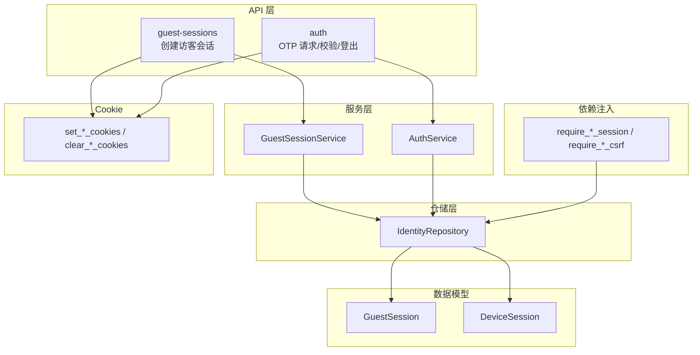
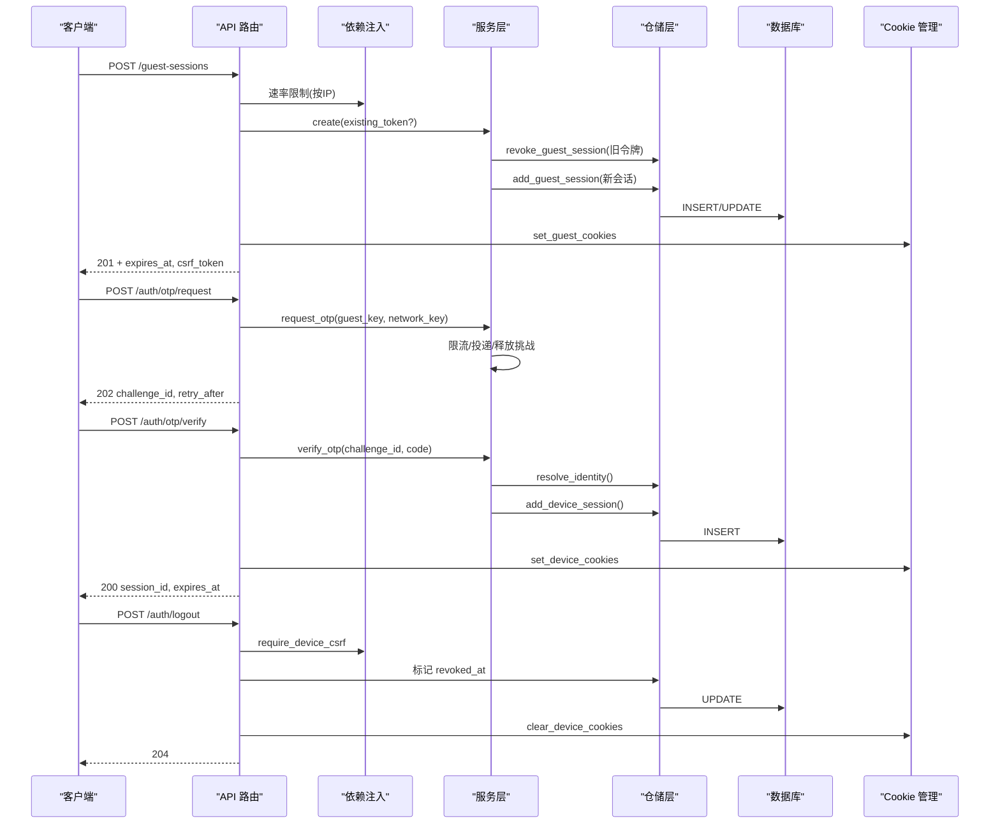
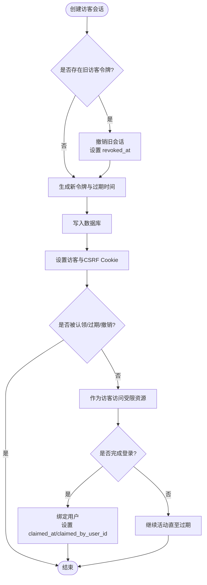
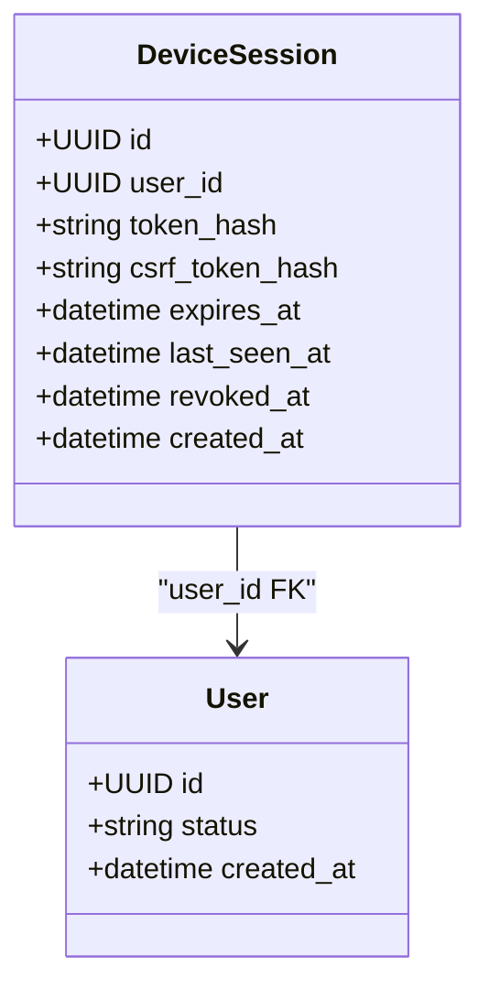
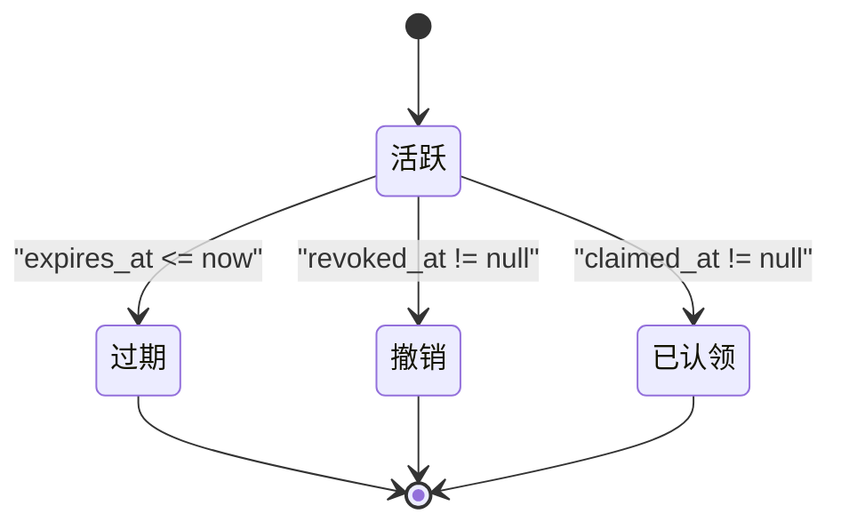
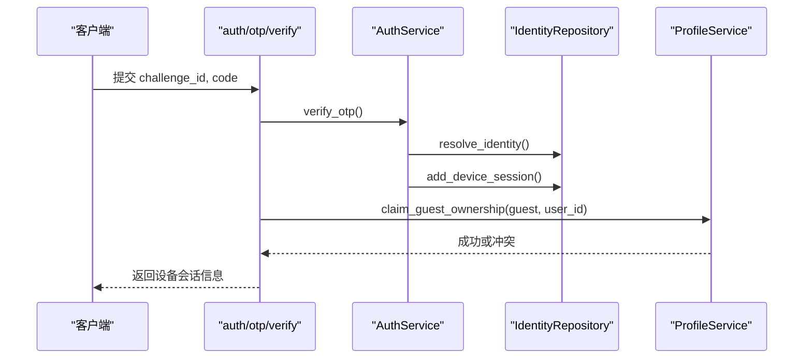
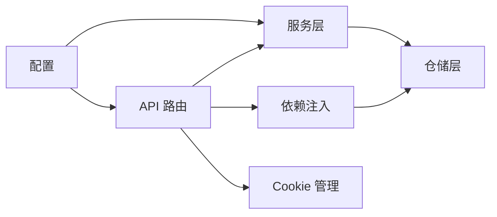

# 会话生命周期管理

<cite>
**本文引用的文件**
- [backend/app/identity/models.py](file://backend/app/identity/models.py)
- [backend/app/identity/repository.py](file://backend/app/identity/repository.py)
- [backend/app/identity/service.py](file://backend/app/identity/service.py)
- [backend/app/api/guest_sessions.py](file://backend/app/api/guest_sessions.py)
- [backend/app/api/auth.py](file://backend/app/api/auth.py)
- [backend/app/api/dependencies.py](file://backend/app/api/dependencies.py)
- [backend/app/identity/cookies.py](file://backend/app/identity/cookies.py)
- [backend/app/config.py](file://backend/app/config.py)
- [backend/app/observability.py](file://backend/app/observability.py)
- [backend/tests/test_guest_sessions.py](file://backend/tests/test_guest_sessions.py)
</cite>

## 目录
1. [简介](#简介)
2. [项目结构](#项目结构)
3. [核心组件](#核心组件)
4. [架构总览](#架构总览)
5. [详细组件分析](#详细组件分析)
6. [依赖关系分析](#依赖关系分析)
7. [性能与监控](#性能与监控)
8. [故障排查指南](#故障排查指南)
9. [结论](#结论)

## 简介
本文件围绕设备会话（DeviceSession）与访客会话（GuestSession）的完整生命周期展开，覆盖创建、验证、刷新、续期与销毁；阐述状态转换机制（活跃、过期、撤销）、超时处理策略（最后访问时间、自动清理、批量过期）、未认证到已认证的升级流程、并发控制与锁机制、冲突解决策略，以及可观测性与性能优化建议。

## 项目结构
与会话相关的代码主要分布在以下模块：
- 数据模型：设备会话与访客会话的持久化结构与约束
- 仓储层：会话的查询、创建、撤销与身份解析
- 服务层：访客会话创建、OTP 登录与设备会话签发
- API 层：访客会话创建、OTP 请求/校验、登出等接口
- 依赖注入：会话校验、CSRF 校验、所有者识别
- Cookie 管理：会话与 CSRF 令牌的安全设置与清理
- 配置：会话时长、速率限制、安全开关等
- 可观测性：请求级日志与指标采集

图表来源
- [backend/app/api/guest_sessions.py:16-52](file://backend/app/api/guest_sessions.py#L16-L52)
- [backend/app/api/auth.py:44-160](file://backend/app/api/auth.py#L44-L160)
- [backend/app/api/dependencies.py:39-130](file://backend/app/api/dependencies.py#L39-L130)
- [backend/app/identity/service.py:35-191](file://backend/app/identity/service.py#L35-L191)
- [backend/app/identity/repository.py:16-114](file://backend/app/identity/repository.py#L16-L114)
- [backend/app/identity/models.py:68-110](file://backend/app/identity/models.py#L68-L110)
- [backend/app/identity/cookies.py:12-102](file://backend/app/identity/cookies.py#L12-L102)

章节来源
- [backend/app/api/guest_sessions.py:16-52](file://backend/app/api/guest_sessions.py#L16-L52)
- [backend/app/api/auth.py:44-160](file://backend/app/api/auth.py#L44-L160)
- [backend/app/api/dependencies.py:39-130](file://backend/app/api/dependencies.py#L39-L130)
- [backend/app/identity/service.py:35-191](file://backend/app/identity/service.py#L35-L191)
- [backend/app/identity/repository.py:16-114](file://backend/app/identity/repository.py#L16-L114)
- [backend/app/identity/models.py:68-110](file://backend/app/identity/models.py#L68-L110)
- [backend/app/identity/cookies.py:12-102](file://backend/app/identity/cookies.py#L12-L102)

## 核心组件
- 数据模型
  - GuestSession：访客会话，包含 token_hash、csrf_token_hash、expires_at、claimed_at、claimed_by_user_id、revoked_at 等字段，用于标识未认证访问并支持后续认领绑定用户。
  - DeviceSession：设备会话，包含 user_id、token_hash、csrf_token_hash、expires_at、last_seen_at、revoked_at 等字段，表示已认证用户的设备级会话。
- 仓储层 IdentityRepository
  - 提供 get_active_guest_session/get_active_device_session 的“活跃”判定（未撤销、未过期、未认领）。
  - 提供 revoke_guest_session、add_guest_session、add_device_session、resolve_identity 等方法。
- 服务层
  - GuestSessionService.create：创建访客会话，若存在旧访客令牌则先撤销旧会话，再写入新会话并返回令牌与过期时间。
  - AuthService.verify_otp：校验 OTP 后解析或创建用户与登录身份，签发设备会话并记录审计事件。
- API 层
  - POST /api/v1/guest-sessions：创建访客会话，设置访客 Cookie 与 CSRF Cookie。
  - POST /api/v1/auth/otp/request：请求验证码，受速率限制保护。
  - POST /api/v1/auth/otp/verify：校验验证码，完成访客会话升级为设备会话，并设置设备 Cookie。
  - POST /api/v1/auth/logout：撤销设备会话并清理设备 Cookie。
- 依赖注入
  - require_guest_csrf/require_guest_session：校验访客会话及 CSRF。
  - require_device_csrf/require_device_session：校验设备会话及 CSRF。
  - require_owner：统一识别当前资源所有者为用户或访客。
- Cookie 管理
  - set_guest_cookies/set_device_cookies/clear_device_cookies：安全地设置/删除会话与 CSRF Cookie。
- 配置
  - device_session_days：设备会话天数。
  - guest_session_create_rate_limit/window：访客会话创建速率限制。
  - cookie_secure/domain/samesite：Cookie 安全属性。

章节来源
- [backend/app/identity/models.py:68-110](file://backend/app/identity/models.py#L68-L110)
- [backend/app/identity/repository.py:20-114](file://backend/app/identity/repository.py#L20-L114)
- [backend/app/identity/service.py:20-191](file://backend/app/identity/service.py#L20-L191)
- [backend/app/api/guest_sessions.py:16-52](file://backend/app/api/guest_sessions.py#L16-L52)
- [backend/app/api/auth.py:44-160](file://backend/app/api/auth.py#L44-L160)
- [backend/app/api/dependencies.py:39-130](file://backend/app/api/dependencies.py#L39-L130)
- [backend/app/identity/cookies.py:12-102](file://backend/app/identity/cookies.py#L12-L102)
- [backend/app/config.py:122-141](file://backend/app/config.py#L122-L141)

## 架构总览
下图展示了从访客会话创建到登录升级为设备会话，再到登出的端到端流程，包括速率限制、CSRF 校验、数据库操作与 Cookie 设置。

图表来源
- [backend/app/api/guest_sessions.py:16-52](file://backend/app/api/guest_sessions.py#L16-L52)
- [backend/app/api/auth.py:44-160](file://backend/app/api/auth.py#L44-L160)
- [backend/app/api/dependencies.py:39-130](file://backend/app/api/dependencies.py#L39-L130)
- [backend/app/identity/service.py:35-191](file://backend/app/identity/service.py#L35-L191)
- [backend/app/identity/repository.py:20-114](file://backend/app/identity/repository.py#L20-L114)
- [backend/app/identity/cookies.py:12-102](file://backend/app/identity/cookies.py#L12-L102)

## 详细组件分析

### 访客会话（GuestSession）生命周期
- 创建
  - 入口：POST /api/v1/guest-sessions
  - 行为：根据现有访客令牌（如有）撤销旧会话，生成新的 token/csrf 令牌与过期时间，写入数据库，设置访客 Cookie 与 CSRF Cookie。
  - 速率限制：基于客户端 IP（考虑可信代理）进行窗口限制，超限返回 429。
- 验证与使用
  - 通过 require_guest_csrf/require_guest_session 校验访客令牌与 CSRF，确保会话未撤销、未认领且未过期。
- 升级（认领）
  - 在 OTP 校验成功后，将访客会话绑定到已认证用户，设置 claimed_at 与 claimed_by_user_id，防止重复认领。
- 过期与撤销
  - 过期：expires_at 之前为活跃；之后查询不再命中。
  - 撤销：revoked_at 非空即失效；新访客会话创建时会撤销旧会话。
- 状态机
  - 活跃：未撤销、未认领、未过期。
  - 过期：expires_at <= now。
  - 撤销：revoked_at != null。
  - 已认领：claimed_at != null 且关联用户。

图表来源
- [backend/app/api/guest_sessions.py:16-52](file://backend/app/api/guest_sessions.py#L16-L52)
- [backend/app/identity/repository.py:20-46](file://backend/app/identity/repository.py#L20-L46)
- [backend/app/identity/models.py:91-110](file://backend/app/identity/models.py#L91-L110)

章节来源
- [backend/app/api/guest_sessions.py:16-52](file://backend/app/api/guest_sessions.py#L16-L52)
- [backend/app/identity/repository.py:20-46](file://backend/app/identity/repository.py#L20-L46)
- [backend/app/identity/models.py:91-110](file://backend/app/identity/models.py#L91-L110)
- [backend/tests/test_guest_sessions.py:14-74](file://backend/tests/test_guest_sessions.py#L14-L74)

### 设备会话（DeviceSession）生命周期
- 创建（登录）
  - 入口：POST /api/v1/auth/otp/verify
  - 行为：校验 OTP，解析或创建用户与登录身份，签发设备会话（含 token/csrf、过期时间、last_seen_at），记录审计事件，设置设备 Cookie。
- 验证与使用
  - 通过 require_device_csrf/require_device_session 校验设备令牌与 CSRF，确保未撤销且未过期。
- 续期与最后访问时间
  - last_seen_at 在创建时写入；如需实现“滑动续期”，可在每次访问时更新该字段（当前仓库未强制每次更新，但模型已预留字段）。
- 撤销与销毁
  - 登出：POST /api/v1/auth/logout，设置 revoked_at，清理设备 Cookie。
- 状态机
  - 活跃：未撤销、未过期。
  - 过期：expires_at <= now。
  - 撤销：revoked_at != null。

图表来源
- [backend/app/identity/models.py:68-88](file://backend/app/identity/models.py#L68-L88)

章节来源
- [backend/app/api/auth.py:91-160](file://backend/app/api/auth.py#L91-L160)
- [backend/app/identity/repository.py:84-99](file://backend/app/identity/repository.py#L84-L99)
- [backend/app/identity/models.py:68-88](file://backend/app/identity/models.py#L68-L88)

### 会话状态转换机制
- 活跃 -> 过期：当 expires_at <= now 时，查询不再命中，视为过期。
- 活跃 -> 撤销：设置 revoked_at 为非空值（如登出、重新创建访客会话时撤销旧会话）。
- 活跃 -> 已认领：访客会话被用户认领后，claimed_at 与 claimed_by_user_id 被设置，后续不再作为访客会话使用。
- 过期/撤销：不可逆，需重新创建会话。

图表来源
- [backend/app/identity/repository.py:33-46](file://backend/app/identity/repository.py#L33-L46)
- [backend/app/identity/repository.py:87-99](file://backend/app/identity/repository.py#L87-L99)
- [backend/app/identity/models.py:91-110](file://backend/app/identity/models.py#L91-L110)

章节来源
- [backend/app/identity/repository.py:33-46](file://backend/app/identity/repository.py#L33-L46)
- [backend/app/identity/repository.py:87-99](file://backend/app/identity/repository.py#L87-L99)
- [backend/app/identity/models.py:91-110](file://backend/app/identity/models.py#L91-L110)

### 会话超时处理策略
- 最后访问时间更新
  - 设备会话创建时写入 last_seen_at；如需滑动续期，可在鉴权路径中更新该字段（当前仓库未强制每次更新）。
- 自动清理机制
  - 仓库层查询仅返回未撤销、未过期、未认领的会话；过期/撤销的会话不会参与业务逻辑。
- 批量过期处理
  - 可通过定时任务扫描 expires_at 过期的记录进行归档或清理（仓库已提供索引 ix_guest_sessions_expires_at 便于高效查询）。

章节来源
- [backend/app/identity/models.py:91-110](file://backend/app/identity/models.py#L91-L110)
- [backend/app/identity/repository.py:33-46](file://backend/app/identity/repository.py#L33-L46)
- [backend/app/identity/repository.py:87-99](file://backend/app/identity/repository.py#L87-L99)

### 会话与用户身份的绑定关系（未认证到已认证升级）
- 访客会话创建后，用户通过 OTP 登录完成校验。
- 校验成功后：
  - 解析或创建用户与登录身份。
  - 签发设备会话并设置设备 Cookie。
  - 将访客会话认领至该用户（claimed_at、claimed_by_user_id），防止重复认领。
- 错误处理：
  - 若访客会话已被认领，返回冲突错误。

图表来源
- [backend/app/api/auth.py:91-138](file://backend/app/api/auth.py#L91-L138)
- [backend/app/identity/service.py:153-191](file://backend/app/identity/service.py#L153-L191)
- [backend/app/identity/repository.py:48-82](file://backend/app/identity/repository.py#L48-L82)

章节来源
- [backend/app/api/auth.py:91-138](file://backend/app/api/auth.py#L91-L138)
- [backend/app/identity/service.py:153-191](file://backend/app/identity/service.py#L153-L191)
- [backend/app/identity/repository.py:48-82](file://backend/app/identity/repository.py#L48-L82)

### 并发控制、锁机制与冲突解决
- CSRF 双提交防护
  - 要求 Cookie 中的 CSRF 与请求头 x-csrf-token 一致，并通过 HMAC 比较，防止跨站请求伪造。
- 速率限制
  - 访客会话创建：按客户端 IP（考虑可信代理）进行窗口限制，超限返回 429。
  - OTP 请求/校验：内置多重限流（访客维度、网络维度、目的地维度），失败时回滚占用资源。
- 冲突解决
  - 访客会话认领：已认领的访客会话再次认领会抛出冲突异常。
  - 设备会话撤销：同一会话多次登出幂等（重复设置 revoked_at）。
- 事务与一致性
  - 会话创建/撤销/认领在同一数据库事务中提交，保证一致性。

章节来源
- [backend/app/api/dependencies.py:29-130](file://backend/app/api/dependencies.py#L29-L130)
- [backend/app/api/guest_sessions.py:28-38](file://backend/app/api/guest_sessions.py#L28-L38)
- [backend/app/identity/service.py:100-151](file://backend/app/identity/service.py#L100-L151)
- [backend/tests/test_guest_sessions.py:58-74](file://backend/tests/test_guest_sessions.py#L58-L74)

## 依赖关系分析
- API 路由依赖依赖注入进行会话与 CSRF 校验。
- 依赖注入依赖仓储层进行活跃会话查询。
- 服务层依赖仓储层进行会话创建、撤销与身份解析。
- Cookie 管理负责会话令牌的传输与安全属性设置。
- 配置项影响会话时长、速率限制与安全策略。

图表来源
- [backend/app/api/guest_sessions.py:16-52](file://backend/app/api/guest_sessions.py#L16-L52)
- [backend/app/api/auth.py:44-160](file://backend/app/api/auth.py#L44-L160)
- [backend/app/api/dependencies.py:39-130](file://backend/app/api/dependencies.py#L39-L130)
- [backend/app/identity/service.py:35-191](file://backend/app/identity/service.py#L35-L191)
- [backend/app/identity/repository.py:16-114](file://backend/app/identity/repository.py#L16-L114)
- [backend/app/identity/cookies.py:12-102](file://backend/app/identity/cookies.py#L12-L102)
- [backend/app/config.py:122-141](file://backend/app/config.py#L122-L141)

章节来源
- [backend/app/api/guest_sessions.py:16-52](file://backend/app/api/guest_sessions.py#L16-L52)
- [backend/app/api/auth.py:44-160](file://backend/app/api/auth.py#L44-L160)
- [backend/app/api/dependencies.py:39-130](file://backend/app/api/dependencies.py#L39-L130)
- [backend/app/identity/service.py:35-191](file://backend/app/identity/service.py#L35-L191)
- [backend/app/identity/repository.py:16-114](file://backend/app/identity/repository.py#L16-L114)
- [backend/app/identity/cookies.py:12-102](file://backend/app/identity/cookies.py#L12-L102)
- [backend/app/config.py:122-141](file://backend/app/config.py#L122-L141)

## 性能与监控
- 可观测性
  - 请求级日志：每个 HTTP 请求输出 event、request_id、method、path、status、duration_ms，便于追踪与会话相关请求的性能与错误。
- 指标建议
  - 会话创建成功率/失败率（区分 429 等）。
  - 会话校验失败原因分布（无令牌、CSRF 失败、过期、撤销）。
  - 登录升级成功率、OTP 投递失败率。
  - 登出次数与设备会话撤销数。
- 性能优化建议
  - 利用 expires_at 索引进行过期会话清理。
  - 对高频鉴权路径增加缓存（如本地内存缓存活跃会话哈希映射，注意一致性）。
  - 合理设置速率限制窗口与阈值，避免误伤正常流量。
  - 启用连接池与数据库查询优化，减少鉴权路径延迟。

章节来源
- [backend/app/observability.py:27-51](file://backend/app/observability.py#L27-L51)
- [backend/app/identity/models.py:91-110](file://backend/app/identity/models.py#L91-L110)
- [backend/app/config.py:133-141](file://backend/app/config.py#L133-L141)

## 故障排查指南
- 常见错误
  - CSRF 校验失败：检查 Cookie 与请求头是否一致，确认域名与 SameSite 设置。
  - 访客会话创建受限：检查 IP 是否在可信代理范围内，确认速率限制配置。
  - 登录失败：检查 OTP 是否有效、是否达到尝试上限、投递是否可用。
  - 登出无效：确认设备会话未被重复撤销，Cookie 是否被正确清理。
- 定位方法
  - 通过 X-Request-ID 追踪请求链路。
  - 查看鉴权失败的具体原因（401/403/429/503）。
  - 检查数据库会话记录的状态（expires_at、revoked_at、claimed_at）。

章节来源
- [backend/app/api/dependencies.py:29-130](file://backend/app/api/dependencies.py#L29-L130)
- [backend/app/api/auth.py:44-160](file://backend/app/api/auth.py#L44-L160)
- [backend/app/observability.py:27-51](file://backend/app/observability.py#L27-L51)

## 结论
本系统通过清晰的模型设计、严格的依赖注入校验、完善的服务层逻辑与安全的 Cookie 管理，实现了访客会话与设备会话的完整生命周期管理。状态转换明确、超时与撤销策略可靠、并发与冲突处理稳健。结合可观测性与性能优化建议，可有效支撑高可用的身份与会话服务。