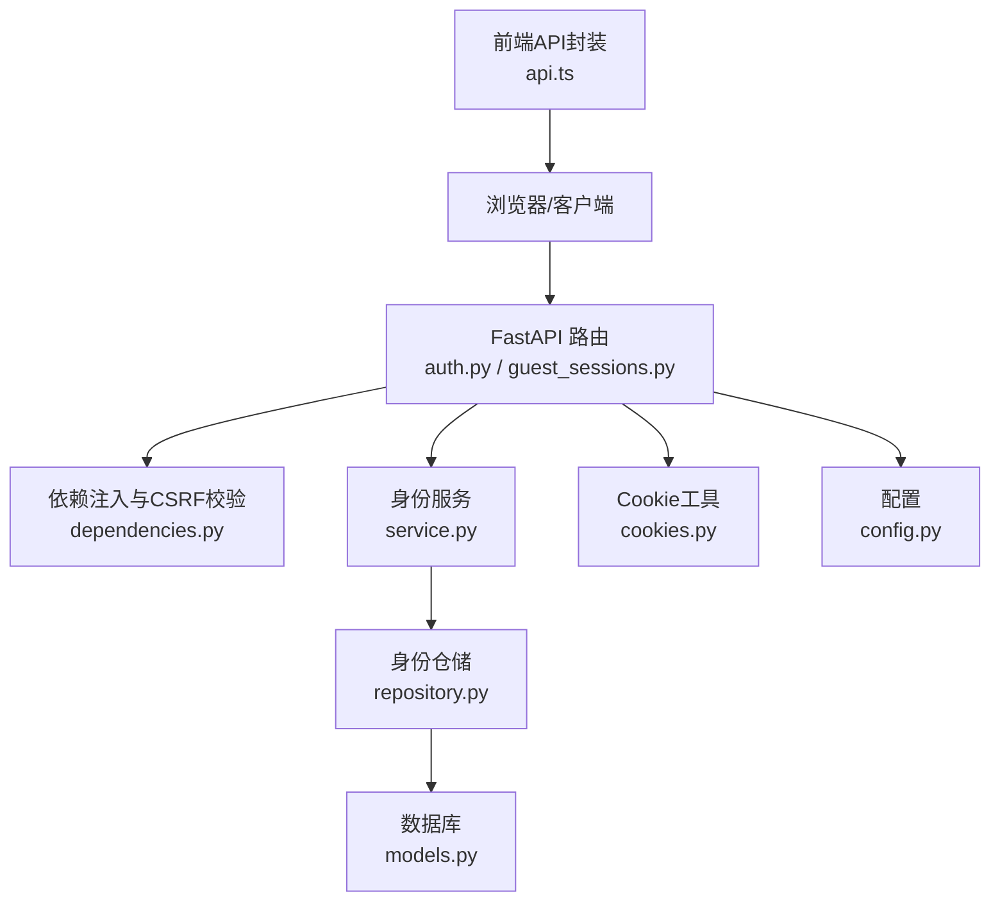
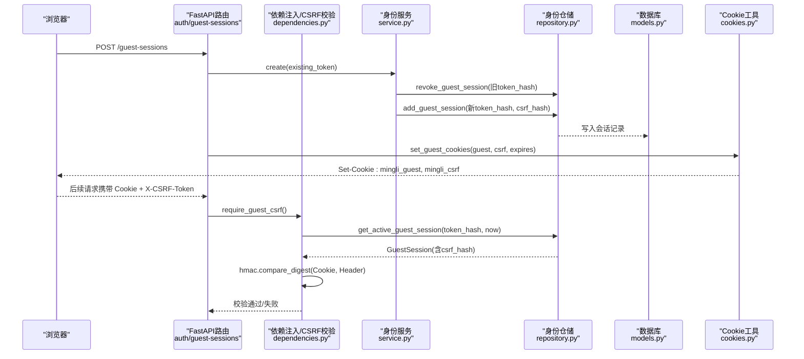
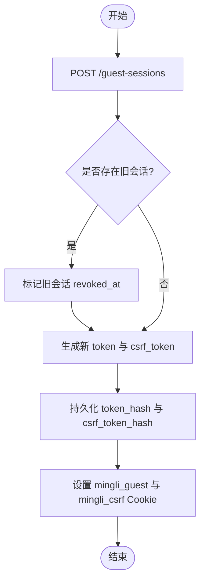
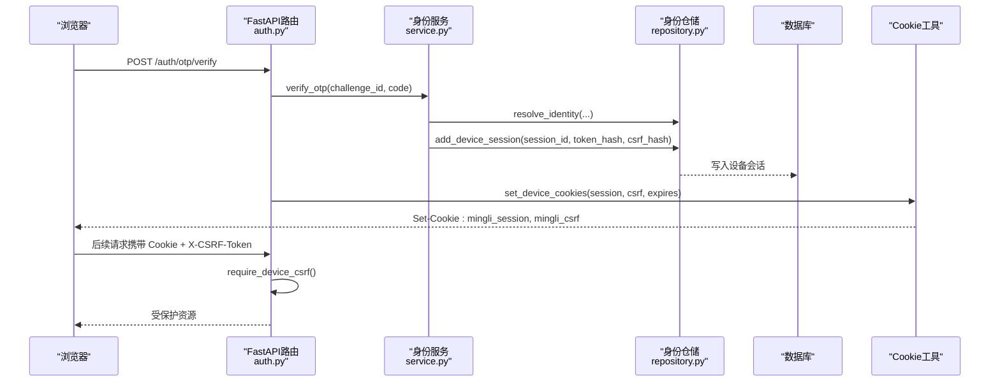
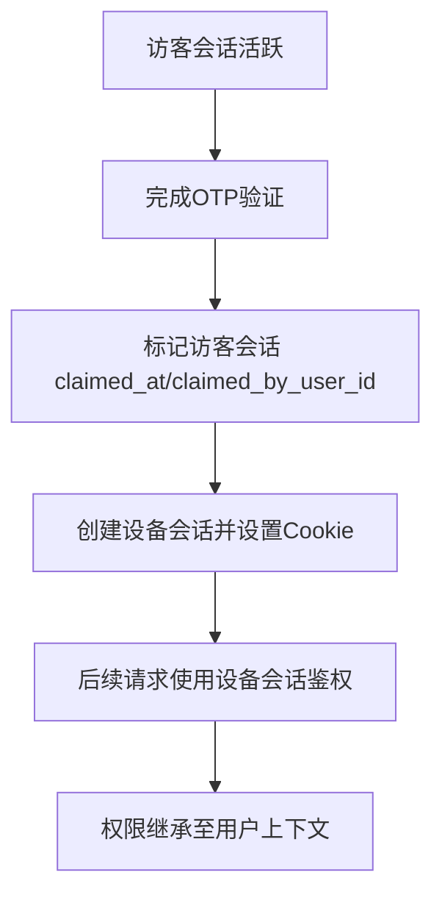
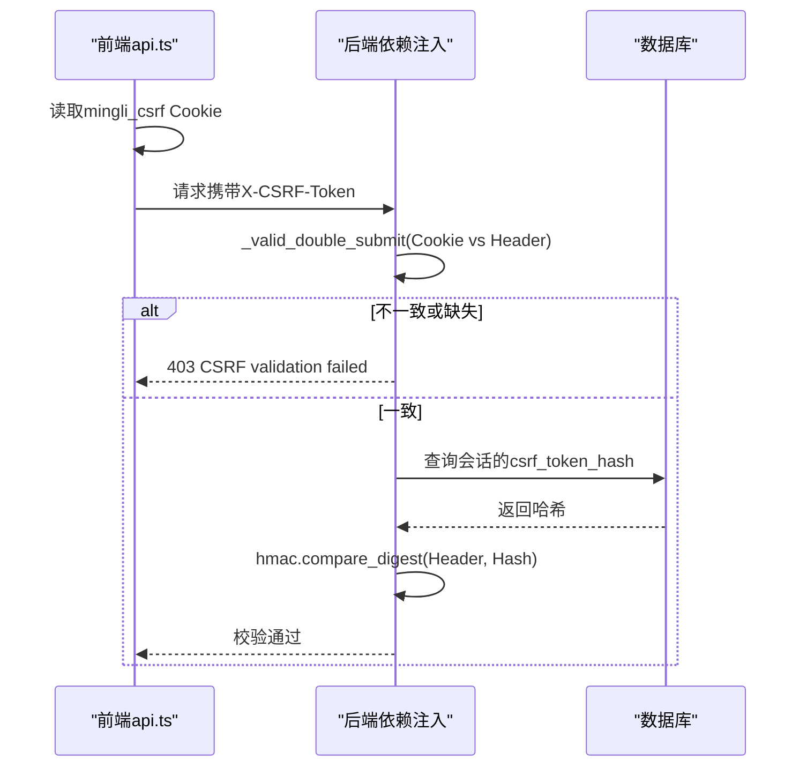
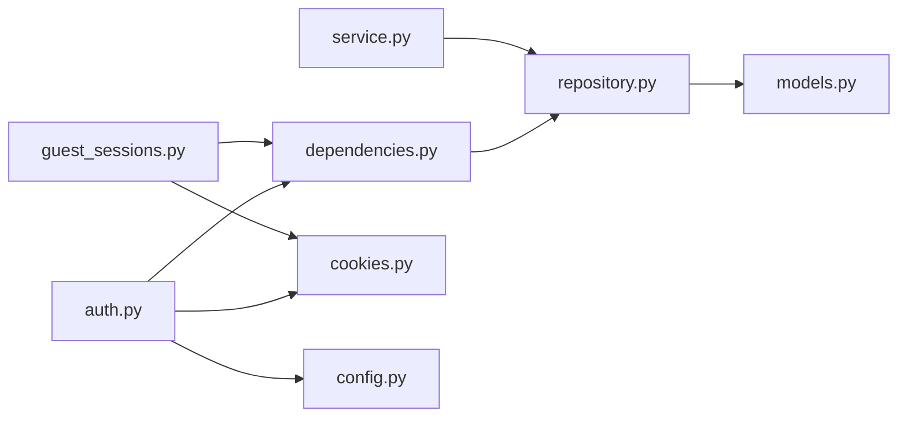

# 会话管理机制

<cite>
**本文引用的文件**
- [backend/app/api/auth.py](file://backend/app/api/auth.py)
- [backend/app/api/guest_sessions.py](file://backend/app/api/guest_sessions.py)
- [backend/app/api/dependencies.py](file://backend/app/api/dependencies.py)
- [backend/app/identity/cookies.py](file://backend/app/identity/cookies.py)
- [backend/app/admin/cookies.py](file://backend/app/admin/cookies.py)
- [backend/app/identity/service.py](file://backend/app/identity/service.py)
- [backend/app/identity/repository.py](file://backend/app/identity/repository.py)
- [backend/app/identity/models.py](file://backend/app/identity/models.py)
- [backend/app/config.py](file://backend/app/config.py)
- [backend/tests/test_guest_sessions.py](file://backend/tests/test_guest_sessions.py)
- [backend/tests/test_csrf.py](file://backend/tests/test_csrf.py)
- [web/src/lib/api.ts](file://web/src/lib/api.ts)
</cite>

## 目录
1. [简介](#简介)
2. [项目结构](#项目结构)
3. [核心组件](#核心组件)
4. [架构总览](#架构总览)
5. [详细组件分析](#详细组件分析)
6. [依赖关系分析](#依赖关系分析)
7. [性能考量](#性能考量)
8. [故障排查指南](#故障排查指南)
9. [结论](#结论)
10. [附录](#附录)

## 简介
本文件系统性阐述本项目的会话管理机制，覆盖设备会话与访客会话的生命周期（创建、验证、刷新、销毁）、Cookie 安全配置（HttpOnly、Secure、SameSite、跨域策略）、访客到用户的转换（数据迁移与权限继承）、CSRF 保护机制（令牌生成、验证、存储策略）、会话持久化方案（数据库存储、缓存优化、分布式支持）以及监控审计与安全事件追踪。同时提供最佳实践与故障排查建议，帮助开发者在生产环境中稳定运行并保障安全。

## 项目结构
后端采用 FastAPI 路由 + 领域服务 + 仓储的模式组织会话相关能力：
- API 层：auth.py、guest_sessions.py 暴露会话与认证接口；dependencies.py 提供 CSRF 校验与会话依赖注入。
- 身份领域：service.py 实现会话创建、OTP 流程与设备会话创建；repository.py 负责会话的持久化查询与写入；models.py 定义会话与审计模型；security.py 提供令牌生成与哈希；cookies.py 统一 Cookie 设置与清理。
- 配置：config.py 集中管理 Cookie 安全开关、会话时长、限流等关键参数。
- 前端：web/src/lib/api.ts 负责 CSRF 令牌获取、携带与失效重试。

图表来源
- [backend/app/api/auth.py:1-161](file://backend/app/api/auth.py#L1-L161)
- [backend/app/api/guest_sessions.py:1-53](file://backend/app/api/guest_sessions.py#L1-L53)
- [backend/app/api/dependencies.py:1-136](file://backend/app/api/dependencies.py#L1-L136)
- [backend/app/identity/service.py:1-192](file://backend/app/identity/service.py#L1-L192)
- [backend/app/identity/repository.py:1-114](file://backend/app/identity/repository.py#L1-L114)
- [backend/app/identity/models.py:1-132](file://backend/app/identity/models.py#L1-L132)
- [backend/app/identity/cookies.py:1-102](file://backend/app/identity/cookies.py#L1-L102)
- [backend/app/config.py:62-146](file://backend/app/config.py#L62-L146)
- [web/src/lib/api.ts:292-343](file://web/src/lib/api.ts#L292-L343)

章节来源
- [backend/app/api/auth.py:1-161](file://backend/app/api/auth.py#L1-L161)
- [backend/app/api/guest_sessions.py:1-53](file://backend/app/api/guest_sessions.py#L1-L53)
- [backend/app/api/dependencies.py:1-136](file://backend/app/api/dependencies.py#L1-L136)
- [backend/app/identity/service.py:1-192](file://backend/app/identity/service.py#L1-L192)
- [backend/app/identity/repository.py:1-114](file://backend/app/identity/repository.py#L1-L114)
- [backend/app/identity/models.py:1-132](file://backend/app/identity/models.py#L1-L132)
- [backend/app/identity/cookies.py:1-102](file://backend/app/identity/cookies.py#L1-L102)
- [backend/app/config.py:62-146](file://backend/app/config.py#L62-L146)
- [web/src/lib/api.ts:292-343](file://web/src/lib/api.ts#L292-L343)

## 核心组件
- 访客会话（Guest Session）
  - 通过 POST /api/v1/guest-sessions 创建，返回 expires_at 与 csrf_token，并在响应头中设置 mingli_guest（HttpOnly、Secure、SameSite=lax、Max-Age=86400）与 mingli_csrf（非 HttpOnly）。
  - 服务端仅持久化 token_hash 与 csrf_token_hash，不存明文。
  - 新访客会话会撤销旧会话（revoked_at），保证同一时刻只有一个活跃访客会话。
- 设备会话（Device Session）
  - 用户完成 OTP 验证后创建，返回 session_id、expires_at、csrf_token，并设置 mingli_session（HttpOnly、Secure、SameSite=lax）与 mingli_csrf。
  - 登出时标记 revoked_at 并清除 Cookie。
- CSRF 保护
  - 双提交模式：请求头 x-csrf-token 必须与 Cookie mingli_csrf 一致，使用常量时间比较防止时序攻击。
  - 敏感操作需同时具备有效会话与匹配的 CSRF 令牌。
- Cookie 安全
  - 生产环境强制 Secure；所有 Cookie 默认 SameSite=lax；路径为根路径；Domain 由配置控制。
  - 会话 Cookie 启用 HttpOnly，CSRF Cookie 不启用以便前端读取。
- 审计与监控
  - 登录成功、登出等关键动作记录审计事件，包含用户 ID、会话 ID、动作类型与元数据。

章节来源
- [backend/app/api/guest_sessions.py:16-52](file://backend/app/api/guest_sessions.py#L16-L52)
- [backend/app/api/auth.py:91-160](file://backend/app/api/auth.py#L91-L160)
- [backend/app/api/dependencies.py:29-136](file://backend/app/api/dependencies.py#L29-L136)
- [backend/app/identity/cookies.py:12-102](file://backend/app/identity/cookies.py#L12-L102)
- [backend/app/identity/models.py:68-132](file://backend/app/identity/models.py#L68-L132)
- [backend/tests/test_guest_sessions.py:14-75](file://backend/tests/test_guest_sessions.py#L14-L75)
- [backend/tests/test_csrf.py:1-55](file://backend/tests/test_csrf.py#L1-L55)

## 架构总览
下图展示从浏览器发起请求到后端处理、校验、持久化的完整链路，包括访客与会话生命周期及 CSRF 校验点。

图表来源
- [backend/app/api/guest_sessions.py:16-52](file://backend/app/api/guest_sessions.py#L16-L52)
- [backend/app/api/dependencies.py:29-54](file://backend/app/api/dependencies.py#L29-L54)
- [backend/app/identity/service.py:39-58](file://backend/app/identity/service.py#L39-L58)
- [backend/app/identity/repository.py:20-46](file://backend/app/identity/repository.py#L20-L46)
- [backend/app/identity/models.py:91-110](file://backend/app/identity/models.py#L91-L110)
- [backend/app/identity/cookies.py:35-60](file://backend/app/identity/cookies.py#L35-L60)

## 详细组件分析

### 访客会话生命周期
- 创建
  - 调用 POST /api/v1/guest-sessions，若存在现有 mingli_guest，则先撤销旧会话，再创建新的 token 与 csrf_token，有效期约 24 小时。
  - 响应体包含 expires_at 与 csrf_token；Set-Cookie 设置 mingli_guest（HttpOnly、Secure、SameSite=lax、Max-Age=86400）与 mingli_csrf。
- 验证
  - 需要携带 mingli_guest Cookie 与 x-csrf-token 请求头，且两者相等；服务端比对 Cookie 中的 CSRF 与数据库中该会话的 csrf_token_hash。
- 刷新
  - 再次创建访客会话将撤销上一个会话，实现“滚动式”刷新。
- 销毁
  - 新会话创建即撤销旧会话；或当过期、被认领（claimed）时不再视为活跃。

图表来源
- [backend/app/api/guest_sessions.py:16-52](file://backend/app/api/guest_sessions.py#L16-L52)
- [backend/app/identity/service.py:39-58](file://backend/app/identity/service.py#L39-L58)
- [backend/app/identity/repository.py:20-31](file://backend/app/identity/repository.py#L20-L31)
- [backend/app/identity/cookies.py:35-60](file://backend/app/identity/cookies.py#L35-L60)

章节来源
- [backend/app/api/guest_sessions.py:16-52](file://backend/app/api/guest_sessions.py#L16-L52)
- [backend/app/identity/service.py:39-58](file://backend/app/identity/service.py#L39-L58)
- [backend/app/identity/repository.py:20-46](file://backend/app/identity/repository.py#L20-L46)
- [backend/tests/test_guest_sessions.py:14-75](file://backend/tests/test_guest_sessions.py#L14-L75)

### 设备会话生命周期
- 创建
  - 用户完成 OTP 验证后，服务端创建 DeviceSession，设置 mingli_session（HttpOnly、Secure、SameSite=lax）与 mingli_csrf，有效期由 device_session_days 决定。
- 验证
  - 依赖 require_device_csrf，要求会话有效且 CSRF 匹配。
- 刷新
  - 可通过重新登录或刷新流程更新 last_seen_at 与过期时间（当前实现以创建时的过期为准，刷新逻辑可按需扩展）。
- 销毁
  - 登出接口标记 revoked_at 并清除 Cookie。

图表来源
- [backend/app/api/auth.py:91-138](file://backend/app/api/auth.py#L91-L138)
- [backend/app/identity/service.py:153-191](file://backend/app/identity/service.py#L153-L191)
- [backend/app/identity/repository.py:84-99](file://backend/app/identity/repository.py#L84-L99)
- [backend/app/identity/cookies.py:63-89](file://backend/app/identity/cookies.py#L63-L89)

章节来源
- [backend/app/api/auth.py:91-160](file://backend/app/api/auth.py#L91-L160)
- [backend/app/identity/service.py:153-191](file://backend/app/identity/service.py#L153-L191)
- [backend/app/identity/repository.py:84-99](file://backend/app/identity/repository.py#L84-L99)
- [backend/app/identity/cookies.py:63-89](file://backend/app/identity/cookies.py#L63-L89)

### 访客到用户会话的转换（数据迁移与权限继承）
- 转换过程
  - 用户在访客会话下完成 OTP 验证，服务端创建设备会话并将访客会话标记为已认领（claimed_at、claimed_by_user_id），实现所有权转移。
- 数据迁移
  - 访客会话的 token_hash 与 csrf_token_hash 保留在历史表中用于审计与防重放；实际访问权限切换至设备会话。
- 权限继承
  - 设备会话绑定用户 ID，后续请求基于设备会话进行鉴权；访客会话不再具有写权限。

图表来源
- [backend/app/api/auth.py:112-138](file://backend/app/api/auth.py#L112-L138)
- [backend/app/identity/repository.py:48-82](file://backend/app/identity/repository.py#L48-L82)
- [backend/app/identity/models.py:91-110](file://backend/app/identity/models.py#L91-L110)

章节来源
- [backend/app/api/auth.py:112-138](file://backend/app/api/auth.py#L112-L138)
- [backend/app/identity/repository.py:48-82](file://backend/app/identity/repository.py#L48-L82)
- [backend/app/identity/models.py:91-110](file://backend/app/identity/models.py#L91-L110)

### CSRF 保护机制
- 令牌生成
  - 每次创建会话（访客或设备）都会生成独立的 csrf_token，并通过 Cookie 下发。
- 存储策略
  - 服务端仅保存 csrf_token_hash；请求时需同时提供 Cookie 与请求头 x-csrf-token，并使用常量时间比较。
- 验证流程
  - 依赖函数 _valid_double_submit 校验双提交一致性；require_guest_csrf 与 require_device_csrf 分别用于访客与会话场景。
- 前端协作
  - 前端 api.ts 自动获取 CSRF 令牌并添加到请求头；遇到 403 时清空本地缓存并重试一次。

图表来源
- [backend/app/api/dependencies.py:29-54](file://backend/app/api/dependencies.py#L29-L54)
- [backend/app/api/dependencies.py:113-130](file://backend/app/api/dependencies.py#L113-L130)
- [web/src/lib/api.ts:292-343](file://web/src/lib/api.ts#L292-L343)
- [backend/tests/test_csrf.py:1-55](file://backend/tests/test_csrf.py#L1-L55)

章节来源
- [backend/app/api/dependencies.py:29-130](file://backend/app/api/dependencies.py#L29-L130)
- [web/src/lib/api.ts:292-343](file://web/src/lib/api.ts#L292-L343)
- [backend/tests/test_csrf.py:1-55](file://backend/tests/test_csrf.py#L1-L55)

### Cookie 安全配置与跨域策略
- 属性
  - HttpOnly：会话 Cookie（mingli_guest、mingli_session）启用，防止脚本读取。
  - Secure：生产环境强制启用；开发环境可关闭但需明确风险。
  - SameSite：统一设置为 lax，限制跨站请求携带 Cookie。
  - Max-Age/Expires：访客会话 24 小时；设备会话按 device_session_days 配置。
  - Domain/Path：由配置 cookie_domain 控制，路径为根路径。
- 跨域处理
  - 通过 SameSite=lax 与 Secure 配合，确保跨站请求不会意外携带敏感 Cookie；如需严格跨域，可在网关层配置 CORS 并避免发送凭据。

章节来源
- [backend/app/identity/cookies.py:12-102](file://backend/app/identity/cookies.py#L12-L102)
- [backend/app/config.py:72-77](file://backend/app/config.py#L72-L77)
- [backend/tests/test_guest_sessions.py:29-37](file://backend/tests/test_guest_sessions.py#L29-L37)

### 会话持久化方案
- 数据库存储
  - 会话表 guest_sessions、device_sessions 仅存储 token_hash 与 csrf_token_hash，避免明文泄露。
  - 索引与唯一约束保障查询效率与唯一性。
- 缓存优化
  - 当前实现未引入外部缓存；如需提升性能，可在仓储层增加 Redis 缓存热点会话哈希映射，注意与数据库一致性。
- 分布式支持
  - 通过共享数据库与统一配置（cookie_domain、Secure）即可在多实例部署；CSRF 令牌与会话哈希均落库，天然支持水平扩展。

章节来源
- [backend/app/identity/models.py:68-132](file://backend/app/identity/models.py#L68-L132)
- [backend/app/identity/repository.py:20-46](file://backend/app/identity/repository.py#L20-L46)
- [backend/app/identity/repository.py:84-99](file://backend/app/identity/repository.py#L84-L99)

### 会话监控、审计日志与安全事件追踪
- 审计事件
  - 登录成功、登出等关键动作记录审计事件，包含 user_id、actor_session_id、action、event_metadata。
- 监控建议
  - 对会话创建、验证失败、CSRF 失败等指标进行埋点；结合日志系统聚合分析异常趋势。
- 安全事件
  - 频繁 CSRF 失败可能指示攻击或前端集成问题；会话异常撤销需关注是否被恶意刷新。

章节来源
- [backend/app/identity/models.py:113-132](file://backend/app/identity/models.py#L113-L132)
- [backend/app/api/auth.py:141-160](file://backend/app/api/auth.py#L141-L160)

## 依赖关系分析
- 组件耦合
  - API 路由依赖依赖注入模块进行 CSRF 与会话校验；服务层依赖仓储进行数据访问；Cookie 工具独立于业务逻辑，便于复用。
- 外部依赖
  - 数据库（PostgreSQL）用于持久化会话与审计；可选 OTP 适配器用于验证码投递。
- 循环依赖
  - 代码结构清晰，未发现循环导入；服务与仓储解耦良好。

图表来源
- [backend/app/api/auth.py:1-161](file://backend/app/api/auth.py#L1-L161)
- [backend/app/api/guest_sessions.py:1-53](file://backend/app/api/guest_sessions.py#L1-L53)
- [backend/app/api/dependencies.py:1-136](file://backend/app/api/dependencies.py#L1-L136)
- [backend/app/identity/service.py:1-192](file://backend/app/identity/service.py#L1-L192)
- [backend/app/identity/repository.py:1-114](file://backend/app/identity/repository.py#L1-L114)
- [backend/app/identity/models.py:1-132](file://backend/app/identity/models.py#L1-L132)
- [backend/app/identity/cookies.py:1-102](file://backend/app/identity/cookies.py#L1-L102)
- [backend/app/config.py:62-146](file://backend/app/config.py#L62-L146)

章节来源
- [backend/app/api/auth.py:1-161](file://backend/app/api/auth.py#L1-L161)
- [backend/app/api/guest_sessions.py:1-53](file://backend/app/api/guest_sessions.py#L1-L53)
- [backend/app/api/dependencies.py:1-136](file://backend/app/api/dependencies.py#L1-L136)
- [backend/app/identity/service.py:1-192](file://backend/app/identity/service.py#L1-L192)
- [backend/app/identity/repository.py:1-114](file://backend/app/identity/repository.py#L1-L114)
- [backend/app/identity/models.py:1-132](file://backend/app/identity/models.py#L1-L132)
- [backend/app/identity/cookies.py:1-102](file://backend/app/identity/cookies.py#L1-L102)
- [backend/app/config.py:62-146](file://backend/app/config.py#L62-L146)

## 性能考量
- 数据库查询
  - 会话查询基于 token_hash 与 expires_at 索引，避免全表扫描；建议定期清理过期与会话历史。
- 令牌生成
  - 使用 secrets.token_urlsafe 生成不可预测令牌，开销低且安全。
- 限流保护
  - 访客会话创建与 OTP 请求均有限流器，防止滥用与暴力破解。
- 缓存建议
  - 可引入 Redis 缓存热点会话哈希映射，减少数据库压力；注意缓存失效与一致性策略。

[本节为通用指导，无需特定文件引用]

## 故障排查指南
- 常见问题
  - 403 CSRF 校验失败：检查前端是否正确携带 X-CSRF-Token 且与 Cookie 一致；确认会话未过期或被撤销。
  - 访客会话无效：确认 mingli_guest 与 mingli_csrf 已正确设置；检查是否重复创建导致旧会话被撤销。
  - 设备会话无效：确认登录后 mingli_session 与 mingli_csrf 已设置；检查设备会话是否过期或被撤销。
- 定位步骤
  - 查看后端日志中的 CSRF 失败与会话查询结果；核对数据库中的 token_hash 与 csrf_token_hash。
  - 检查前端 api.ts 的 CSRF 获取与重试逻辑；确认 Cookie 未被第三方策略拦截。
- 修复建议
  - 调整 SameSite 与 Secure 配置以适应跨域场景；确保生产环境启用 Secure。
  - 对频繁失败的 IP 或用户进行限流与告警。

章节来源
- [backend/tests/test_csrf.py:1-55](file://backend/tests/test_csrf.py#L1-L55)
- [backend/tests/test_guest_sessions.py:14-75](file://backend/tests/test_guest_sessions.py#L14-L75)
- [web/src/lib/api.ts:292-343](file://web/src/lib/api.ts#L292-L343)

## 结论
本项目实现了健壮的会话管理机制：访客与会话分离、CSRF 双提交校验、安全的 Cookie 配置、完整的生命周期管理与审计追踪。通过数据库持久化与合理索引，具备良好的可扩展性与稳定性。建议在多实例部署中保持配置一致，并结合监控与限流策略保障生产安全。

[本节为总结，无需特定文件引用]

## 附录
- 关键配置项
  - cookie_secure：生产环境必须启用。
  - cookie_domain：跨子域共享 Cookie 时设置。
  - device_session_days：设备会话有效期。
  - otp_*：OTP 相关限流与冷却时间。
- 最佳实践
  - 始终使用 HTTPS 并启用 Secure Cookie。
  - 严格校验 CSRF，避免将敏感 Cookie 暴露给脚本。
  - 定期清理过期与会话历史，降低数据库压力。
  - 对异常行为进行监控与告警，及时响应潜在攻击。

[本节为补充信息，无需特定文件引用]