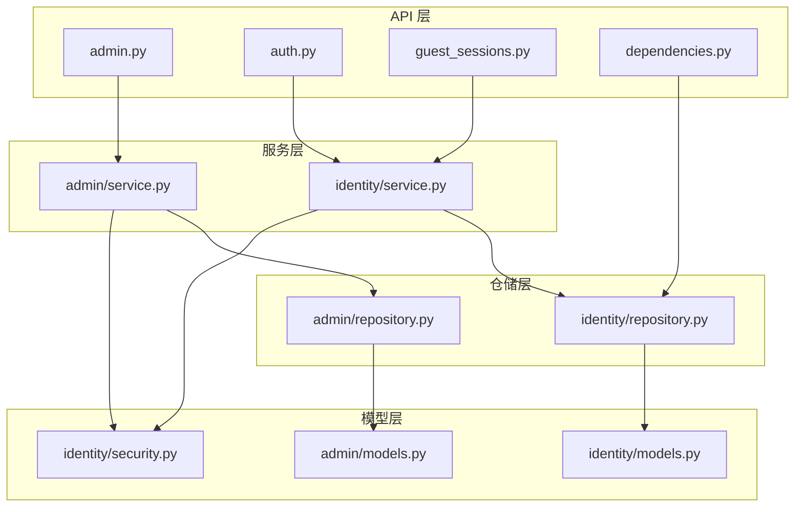
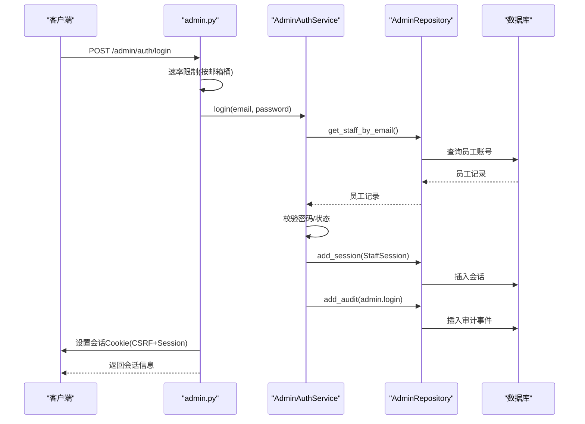
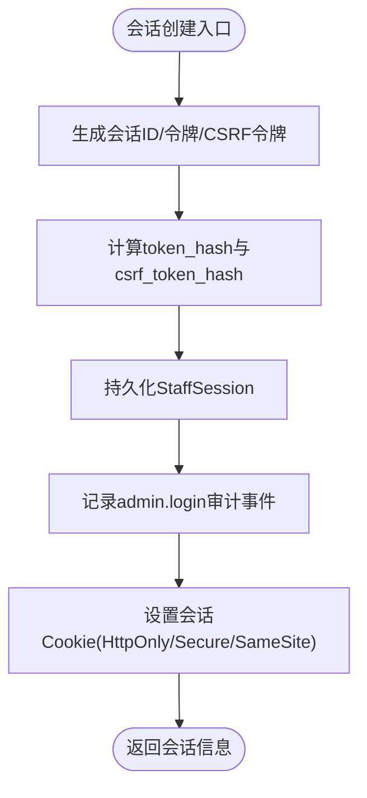
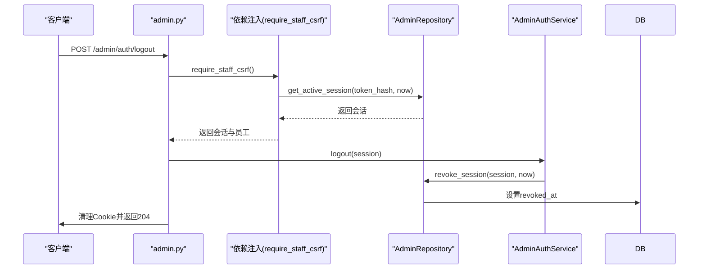
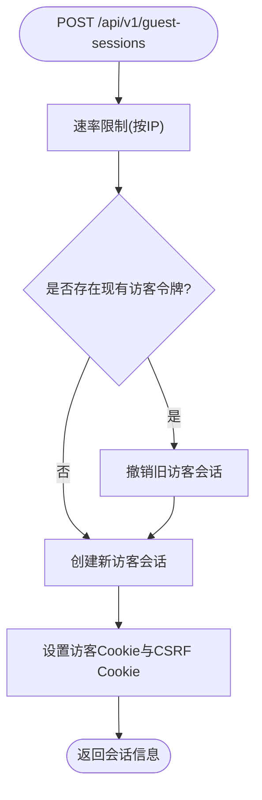
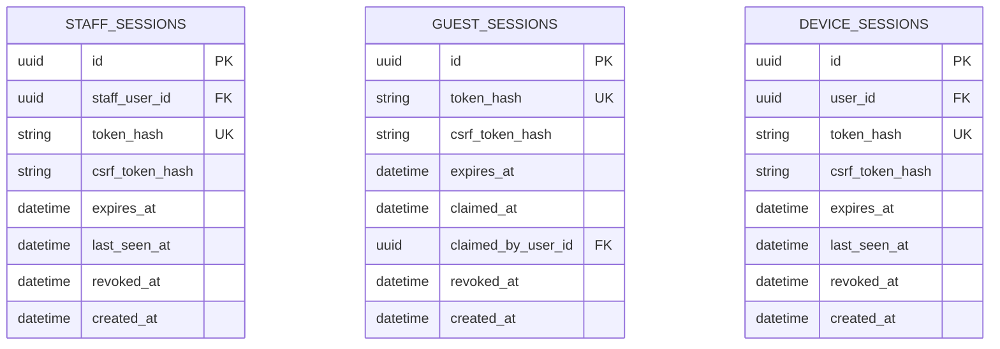
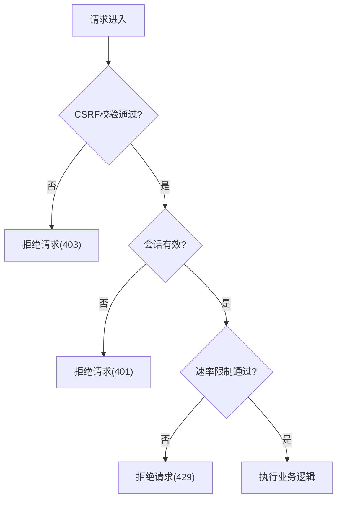
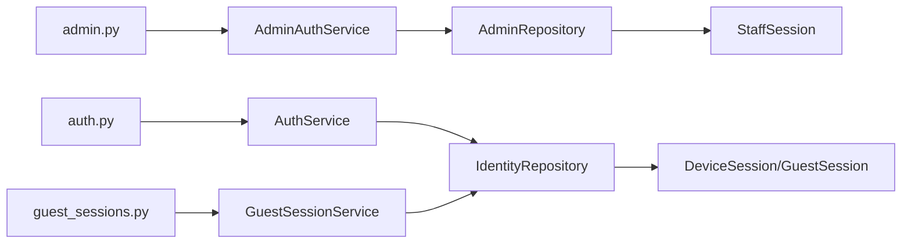

# 会话管理机制

<cite>
**本文引用的文件**
- [backend/app/admin/models.py](file://backend/app/admin/models.py)
- [backend/app/admin/service.py](file://backend/app/admin/service.py)
- [backend/app/admin/repository.py](file://backend/app/admin/repository.py)
- [backend/app/identity/models.py](file://backend/app/identity/models.py)
- [backend/app/identity/service.py](file://backend/app/identity/service.py)
- [backend/app/identity/repository.py](file://backend/app/identity/repository.py)
- [backend/app/identity/security.py](file://backend/app/identity/security.py)
- [backend/app/api/admin.py](file://backend/app/api/admin.py)
- [backend/app/api/auth.py](file://backend/app/api/auth.py)
- [backend/app/api/guest_sessions.py](file://backend/app/api/guest_sessions.py)
- [backend/app/api/dependencies.py](file://backend/app/api/dependencies.py)
- [backend/tests/test_guest_sessions.py](file://backend/tests/test_guest_sessions.py)
- [backend/tests/test_admin_auth.py](file://backend/tests/test_admin_auth.py)
</cite>

## 目录
1. [简介](#简介)
2. [项目结构](#项目结构)
3. [核心组件](#核心组件)
4. [架构总览](#架构总览)
5. [详细组件分析](#详细组件分析)
6. [依赖关系分析](#依赖关系分析)
7. [性能考虑](#性能考虑)
8. [故障排查指南](#故障排查指南)
9. [结论](#结论)
10. [附录](#附录)

## 简介
本文件围绕“会话管理机制”进行系统化说明，重点覆盖：
- StaffSession 数据模型与会话生命周期、令牌与 CSRF 安全属性
- 管理员会话的创建、验证与销毁流程（含 Cookie 处理）
- 访客与会话并发控制、最大会话数限制策略
- 会话持久化策略与数据库索引优化
- 会话安全加固：令牌加密、传输安全、防重放攻击
- 会话监控与管理工具的使用建议

## 项目结构
后端采用模块化分层：API 层负责路由与请求校验；服务层封装业务逻辑；仓储层负责数据访问；模型层定义数据表结构与约束。会话相关能力分布在 admin、identity 两个域中，并通过统一的依赖注入与速率限制机制保障安全性与稳定性。

图表来源
- [backend/app/api/admin.py:1-200](file://backend/app/api/admin.py#L1-L200)
- [backend/app/api/auth.py:112-160](file://backend/app/api/auth.py#L112-L160)
- [backend/app/api/guest_sessions.py:1-52](file://backend/app/api/guest_sessions.py#L1-L52)
- [backend/app/api/dependencies.py:1-69](file://backend/app/api/dependencies.py#L1-L69)
- [backend/app/admin/service.py:1-148](file://backend/app/admin/service.py#L1-L148)
- [backend/app/identity/service.py:1-192](file://backend/app/identity/service.py#L1-L192)
- [backend/app/admin/repository.py:1-57](file://backend/app/admin/repository.py#L1-L57)
- [backend/app/identity/repository.py:1-114](file://backend/app/identity/repository.py#L1-L114)
- [backend/app/admin/models.py:1-81](file://backend/app/admin/models.py#L1-L81)
- [backend/app/identity/models.py:1-132](file://backend/app/identity/models.py#L1-L132)
- [backend/app/identity/security.py:1-11](file://backend/app/identity/security.py#L1-L11)

章节来源
- [backend/app/api/admin.py:1-200](file://backend/app/api/admin.py#L1-L200)
- [backend/app/api/auth.py:112-160](file://backend/app/api/auth.py#L112-L160)
- [backend/app/api/guest_sessions.py:1-52](file://backend/app/api/guest_sessions.py#L1-L52)
- [backend/app/api/dependencies.py:1-69](file://backend/app/api/dependencies.py#L1-L69)
- [backend/app/admin/service.py:1-148](file://backend/app/admin/service.py#L1-L148)
- [backend/app/identity/service.py:1-192](file://backend/app/identity/service.py#L1-L192)
- [backend/app/admin/repository.py:1-57](file://backend/app/admin/repository.py#L1-L57)
- [backend/app/identity/repository.py:1-114](file://backend/app/identity/repository.py#L1-L114)
- [backend/app/admin/models.py:1-81](file://backend/app/admin/models.py#L1-L81)
- [backend/app/identity/models.py:1-132](file://backend/app/identity/models.py#L1-L132)
- [backend/app/identity/security.py:1-11](file://backend/app/identity/security.py#L1-L11)

## 核心组件
- StaffSession：管理员会话实体，包含会话 ID、关联员工账号、令牌哈希、CSRF 哈希、过期时间、最后访问时间、撤销时间与创建时间等字段，并具备唯一性与索引约束。
- GuestSession：访客会话实体，用于匿名或临时身份，支持被认领为正式用户，具备过期与撤销状态。
- DeviceSession：设备会话实体，代表已认证用户的设备级会话，具备过期与撤销状态。
- AdminAuthService：管理员登录、登出与会话管理的服务实现。
- GuestSessionService：访客会话创建与会话回收服务。
- IdentityRepository/AdminRepository：会话查询、新增、撤销等数据访问封装。
- 安全工具：令牌生成与哈希函数，确保不存储明文令牌。

章节来源
- [backend/app/admin/models.py:17-57](file://backend/app/admin/models.py#L17-L57)
- [backend/app/identity/models.py:68-110](file://backend/app/identity/models.py#L68-L110)
- [backend/app/admin/service.py:33-101](file://backend/app/admin/service.py#L33-L101)
- [backend/app/identity/service.py:28-58](file://backend/app/identity/service.py#L28-L58)
- [backend/app/identity/repository.py:16-114](file://backend/app/identity/repository.py#L16-L114)
- [backend/app/admin/repository.py:14-57](file://backend/app/admin/repository.py#L14-L57)
- [backend/app/identity/security.py:1-11](file://backend/app/identity/security.py#L1-L11)

## 架构总览
管理员与会话相关的调用链如下：
- 管理员登录：API 接收凭据 -> 速率限制 -> 服务层校验与创建会话 -> 写入审计事件 -> 设置 Cookie -> 返回会话信息
- 受保护接口：依赖注入解析会话 -> 校验 CSRF -> 执行业务逻辑
- 管理员登出：依赖注入解析会话 -> 撤销会话 -> 清理 Cookie

图表来源
- [backend/app/api/admin.py:103-145](file://backend/app/api/admin.py#L103-L145)
- [backend/app/admin/service.py:49-89](file://backend/app/admin/service.py#L49-L89)
- [backend/app/admin/repository.py:22-40](file://backend/app/admin/repository.py#L22-L40)

章节来源
- [backend/app/api/admin.py:103-145](file://backend/app/api/admin.py#L103-L145)
- [backend/app/admin/service.py:49-89](file://backend/app/admin/service.py#L49-L89)
- [backend/app/admin/repository.py:22-40](file://backend/app/admin/repository.py#L22-L40)

## 详细组件分析

### StaffSession 数据模型与会话生命周期
- 字段与约束
  - 主键与会话 ID：UUID
  - 关联员工账号：外键到 staff_users
  - token_hash、csrf_token_hash：仅存储哈希，避免明文泄露
  - expires_at：会话过期时间
  - last_seen_at：最后访问时间，用于活跃检测
  - revoked_at：撤销时间，标记会话失效
  - created_at：创建时间
- 生命周期
  - 创建：管理员登录成功后，服务层生成新令牌与 CSRF 令牌，计算哈希后持久化，并记录审计事件
  - 使用：每次受保护请求通过依赖注入加载会话，更新 last_seen_at
  - 过期：expires_at 之前的有效窗口内可继续使用
  - 撤销：登出或强制下线时设置 revoked_at，立即失效
- 并发与最大会话数
  - 当前实现未对同一员工的并发会话数量做上限限制
  - 如需限制，可在服务层维护每员工的活跃会话计数并在创建前检查阈值

图表来源
- [backend/app/admin/service.py:59-89](file://backend/app/admin/service.py#L59-L89)
- [backend/app/admin/models.py:36-57](file://backend/app/admin/models.py#L36-L57)
- [backend/app/identity/security.py:5-10](file://backend/app/identity/security.py#L5-L10)

章节来源
- [backend/app/admin/models.py:36-57](file://backend/app/admin/models.py#L36-L57)
- [backend/app/admin/service.py:59-89](file://backend/app/admin/service.py#L59-L89)
- [backend/app/identity/security.py:5-10](file://backend/app/identity/security.py#L5-L10)

### 管理员会话的创建、验证与销毁流程（含 Cookie 与 CSRF）
- 创建流程
  - 登录接口进行速率限制（按邮箱桶），防止暴力破解
  - 服务层校验凭据与状态，创建 StaffSession，记录审计事件
  - 设置会话 Cookie（session cookie 与 CSRF cookie），响应头标记为私有
- 验证流程
  - require_staff_session：从 Cookie 读取会话令牌，查询数据库确认未撤销且未过期，加载员工信息并更新 last_seen_at
  - require_staff_csrf：双提交模式校验，要求请求头携带 x-csrf-token 与 Cookie 中的 CSRF 值一致，并与数据库中存储的 csrf_token_hash 比对
- 销毁流程
  - 登出接口：撤销会话（设置 revoked_at），清理 Cookie，记录审计事件

图表来源
- [backend/app/api/admin.py:87-100](file://backend/app/api/admin.py#L87-L100)
- [backend/app/api/admin.py:148-163](file://backend/app/api/admin.py#L148-L163)
- [backend/app/admin/service.py:91-101](file://backend/app/admin/service.py#L91-L101)
- [backend/app/admin/repository.py:42-57](file://backend/app/admin/repository.py#L42-L57)

章节来源
- [backend/app/api/admin.py:68-100](file://backend/app/api/admin.py#L68-L100)
- [backend/app/api/admin.py:148-163](file://backend/app/api/admin.py#L148-L163)
- [backend/app/admin/service.py:91-101](file://backend/app/admin/service.py#L91-L101)
- [backend/app/admin/repository.py:42-57](file://backend/app/admin/repository.py#L42-L57)

### 访客与会话并发控制、最大会话数限制
- 访客会话创建
  - 接口进行速率限制（按网络 IP 桶），防止滥用
  - 若存在现有访客令牌，先撤销旧会话再创建新会话，保证单设备单会话
- 并发与最大会话数
  - 当前实现针对每个设备在创建新访客会话时会撤销上一个会话，从而保持“最新会话唯一”
  - 对于管理员会话，未显式限制同一员工的并发会话数量；可通过在服务层增加计数与阈值检查来实现
- CSRF 保护
  - 访客与会话均使用双提交模式：Cookie 中的 CSRF 令牌与请求头 x-csrf-token 必须一致，并与数据库存储的 csrf_token_hash 比较

图表来源
- [backend/app/api/guest_sessions.py:16-52](file://backend/app/api/guest_sessions.py#L16-L52)
- [backend/app/identity/service.py:39-58](file://backend/app/identity/service.py#L39-L58)
- [backend/app/api/dependencies.py:29-54](file://backend/app/api/dependencies.py#L29-L54)

章节来源
- [backend/app/api/guest_sessions.py:16-52](file://backend/app/api/guest_sessions.py#L16-L52)
- [backend/app/identity/service.py:39-58](file://backend/app/identity/service.py#L39-L58)
- [backend/app/api/dependencies.py:29-54](file://backend/app/api/dependencies.py#L29-L54)
- [backend/tests/test_guest_sessions.py:106-175](file://backend/tests/test_guest_sessions.py#L106-L175)

### 会话持久化策略与数据库索引优化
- 持久化策略
  - 所有会话表仅存储令牌哈希而非明文令牌，降低泄露风险
  - 使用 expires_at 与 revoked_at 控制有效性，last_seen_at 用于活跃度追踪
- 索引设计
  - 会话表针对 token_hash 建立唯一约束，避免重复
  - 针对常用查询列建立索引：如 guest_sessions.expires_at、device_sessions.user_id、staff_sessions.staff_user_id、audit_events.user_id 等
- 迁移与约束
  - 通过 Alembic 迁移确保表结构与约束一致性，例如 owner 字段的 XOR 约束等

图表来源
- [backend/app/admin/models.py:36-57](file://backend/app/admin/models.py#L36-L57)
- [backend/app/identity/models.py:68-110](file://backend/app/identity/models.py#L68-L110)

章节来源
- [backend/app/admin/models.py:36-57](file://backend/app/admin/models.py#L36-L57)
- [backend/app/identity/models.py:68-110](file://backend/app/identity/models.py#L68-L110)
- [backend/app/identity/repository.py:33-46](file://backend/app/identity/repository.py#L33-L46)
- [backend/app/admin/repository.py:42-53](file://backend/app/admin/repository.py#L42-L53)

### 会话安全加固措施
- 令牌加密与存储
  - 使用随机令牌生成器生成不可预测的令牌
  - 仅存储令牌的哈希值，避免明文泄露
- 传输安全
  - Cookie 配置启用 HttpOnly、Secure、SameSite=lax，减少跨站脚本与跨站请求风险
  - 响应头标记为私有，防止缓存泄露敏感信息
- 防重放攻击
  - 双提交 CSRF：Cookie 中的 CSRF 令牌与请求头 x-csrf-token 必须一致，并与数据库存储的 csrf_token_hash 比较
  - 速率限制：登录与会话创建接口按邮箱/IP 进行速率限制，防止暴力与滥用
- 会话撤销与审计
  - 登出或异常时设置 revoked_at，立即失效
  - 关键操作记录审计事件，便于追溯

图表来源
- [backend/app/api/dependencies.py:29-54](file://backend/app/api/dependencies.py#L29-L54)
- [backend/app/api/admin.py:68-100](file://backend/app/api/admin.py#L68-L100)
- [backend/tests/test_admin_auth.py:95-102](file://backend/tests/test_admin_auth.py#L95-L102)

章节来源
- [backend/app/identity/security.py:5-10](file://backend/app/identity/security.py#L5-L10)
- [backend/tests/test_guest_sessions.py:14-38](file://backend/tests/test_guest_sessions.py#L14-L38)
- [backend/app/api/dependencies.py:29-54](file://backend/app/api/dependencies.py#L29-L54)
- [backend/app/api/admin.py:68-100](file://backend/app/api/admin.py#L68-L100)
- [backend/tests/test_admin_auth.py:95-102](file://backend/tests/test_admin_auth.py#L95-L102)

### 会话监控与管理工具使用方法
- 管理员会话监控
  - 通过 /admin/me 获取当前会话信息与角色，结合审计事件表统计登录与登出行为
  - 使用 /admin/overview 查看系统概览（当前为桩实现）
- 访客与会话监控
  - 通过审计事件与会话表的查询，统计访客会话创建、认领与撤销情况
  - 利用速率限制日志与响应码（如 429）评估滥用情况
- 管理建议
  - 定期清理过期与撤销的会话记录，减少数据膨胀
  - 基于 last_seen_at 与 expires_at 实现自动清理任务
  - 结合外部监控系统收集关键指标（登录失败率、会话创建速率、CSRF 失败率）

章节来源
- [backend/app/api/admin.py:166-200](file://backend/app/api/admin.py#L166-L200)
- [backend/app/identity/models.py:113-132](file://backend/app/identity/models.py#L113-L132)
- [backend/tests/test_guest_sessions.py:106-175](file://backend/tests/test_guest_sessions.py#L106-L175)

## 依赖关系分析
- 组件耦合
  - API 层依赖服务层进行业务处理，服务层依赖仓储层进行数据访问
  - 安全工具被服务层与依赖注入模块复用，确保一致的令牌生成与哈希策略
- 直接依赖
  - admin.py -> AdminAuthService -> AdminRepository -> StaffSession
  - auth.py -> AuthService -> IdentityRepository -> DeviceSession
  - guest_sessions.py -> GuestSessionService -> IdentityRepository -> GuestSession
- 间接依赖
  - 速率限制器在 API 层注入，影响登录与会话创建的吞吐
  - 审计事件贯穿各会话操作，便于追踪

图表来源
- [backend/app/api/admin.py:1-200](file://backend/app/api/admin.py#L1-L200)
- [backend/app/api/auth.py:112-160](file://backend/app/api/auth.py#L112-L160)
- [backend/app/api/guest_sessions.py:1-52](file://backend/app/api/guest_sessions.py#L1-L52)
- [backend/app/admin/service.py:1-148](file://backend/app/admin/service.py#L1-L148)
- [backend/app/identity/service.py:1-192](file://backend/app/identity/service.py#L1-L192)
- [backend/app/admin/repository.py:1-57](file://backend/app/admin/repository.py#L1-L57)
- [backend/app/identity/repository.py:1-114](file://backend/app/identity/repository.py#L1-L114)
- [backend/app/admin/models.py:1-81](file://backend/app/admin/models.py#L1-L81)
- [backend/app/identity/models.py:1-132](file://backend/app/identity/models.py#L1-L132)

章节来源
- [backend/app/api/admin.py:1-200](file://backend/app/api/admin.py#L1-L200)
- [backend/app/api/auth.py:112-160](file://backend/app/api/auth.py#L112-L160)
- [backend/app/api/guest_sessions.py:1-52](file://backend/app/api/guest_sessions.py#L1-L52)
- [backend/app/admin/service.py:1-148](file://backend/app/admin/service.py#L1-L148)
- [backend/app/identity/service.py:1-192](file://backend/app/identity/service.py#L1-L192)
- [backend/app/admin/repository.py:1-57](file://backend/app/admin/repository.py#L1-L57)
- [backend/app/identity/repository.py:1-114](file://backend/app/identity/repository.py#L1-L114)
- [backend/app/admin/models.py:1-81](file://backend/app/admin/models.py#L1-L81)
- [backend/app/identity/models.py:1-132](file://backend/app/identity/models.py#L1-L132)

## 性能考虑
- 会话查询优化
  - 使用 token_hash 的唯一约束与索引加速会话查找
  - 针对 expires_at 与 user_id 建立索引，提升过期清理与按用户查询效率
- 速率限制
  - 登录与会话创建接口按邮箱/IP 进行速率限制，避免资源耗尽
- 审计事件
  - 审计事件表按 user_id 与 created_at 建立索引，便于高效检索与分析
- 内存与连接池
  - 合理配置数据库连接池与会话工厂，避免高并发下的连接争用

[本节提供通用指导，无需特定文件引用]

## 故障排查指南
- 常见错误
  - CSRF 校验失败：检查请求头是否携带 x-csrf-token，且与 Cookie 中的 CSRF 值一致
  - 会话无效：检查会话是否过期或被撤销，确认 last_seen_at 与 expires_at
  - 速率限制触发：检查登录与会话创建频率，调整限速参数或等待窗口恢复
- 调试步骤
  - 查看审计事件与会话表，定位具体操作与状态变化
  - 检查 Cookie 配置是否正确（HttpOnly、Secure、SameSite）
  - 使用测试用例验证会话创建、认领与撤销流程

章节来源
- [backend/tests/test_admin_auth.py:95-102](file://backend/tests/test_admin_auth.py#L95-L102)
- [backend/tests/test_guest_sessions.py:14-38](file://backend/tests/test_guest_sessions.py#L14-L38)
- [backend/tests/test_guest_sessions.py:106-175](file://backend/tests/test_guest_sessions.py#L106-L175)

## 结论
该会话管理机制通过严格的令牌哈希存储、双提交 CSRF、速率限制与审计事件，实现了管理员与会话的安全性与可追溯性。StaffSession 作为核心模型，配合完善的生命周期管理与持久化策略，确保了会话的有效性与可控性。未来可在此基础上引入并发会话上限、更细粒度的权限控制与更丰富的监控指标，以进一步提升系统的安全性与可运维性。

[本节为总结性内容，无需特定文件引用]

## 附录
- 术语
  - StaffSession：管理员会话实体
  - GuestSession：访客会话实体
  - DeviceSession：设备会话实体
  - CSRF：跨站请求伪造防护
  - 速率限制：限制单位时间内请求次数
- 参考实现路径
  - 管理员会话：[backend/app/api/admin.py](file://backend/app/api/admin.py)
  - 访客会话：[backend/app/api/guest_sessions.py](file://backend/app/api/guest_sessions.py)
  - 用户会话：[backend/app/api/auth.py](file://backend/app/api/auth.py)
  - 安全工具：[backend/app/identity/security.py](file://backend/app/identity/security.py)

[本节为补充信息，无需特定文件引用]