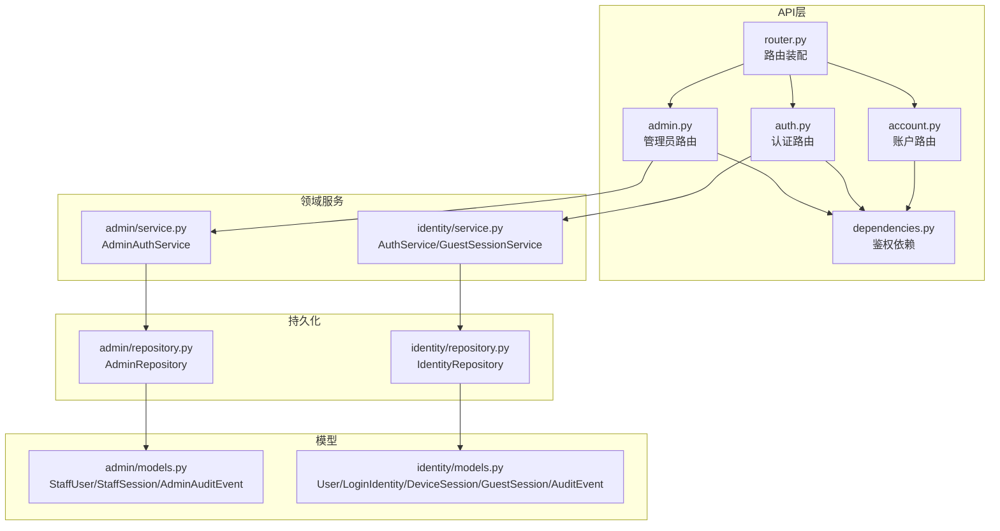
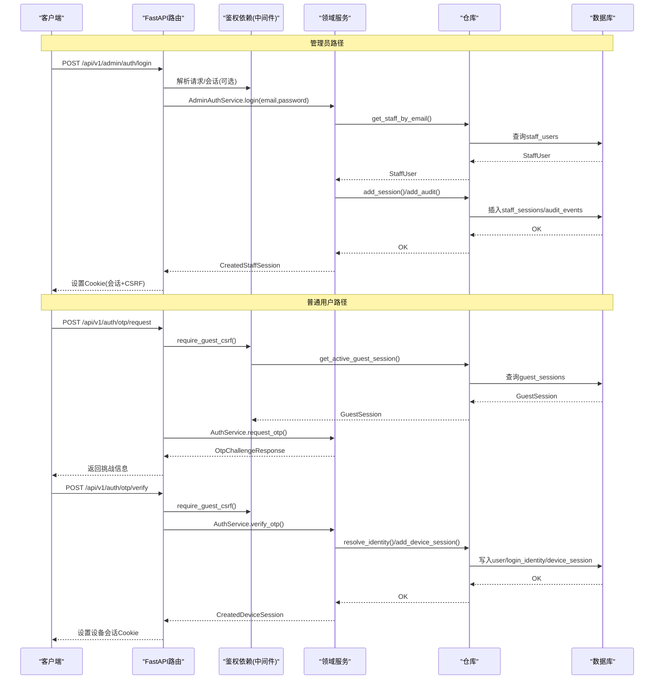
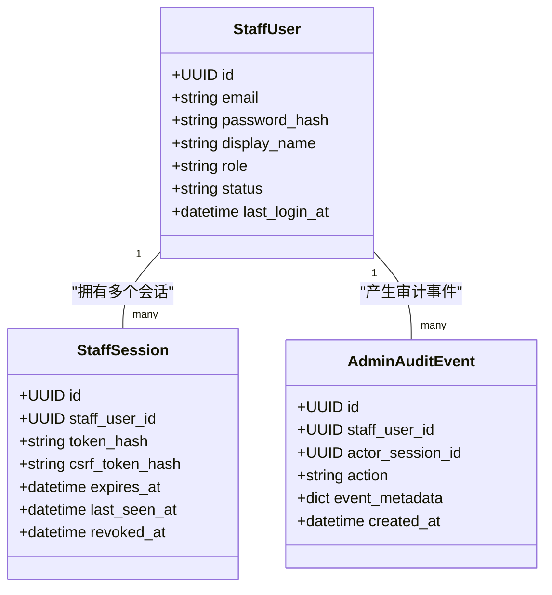
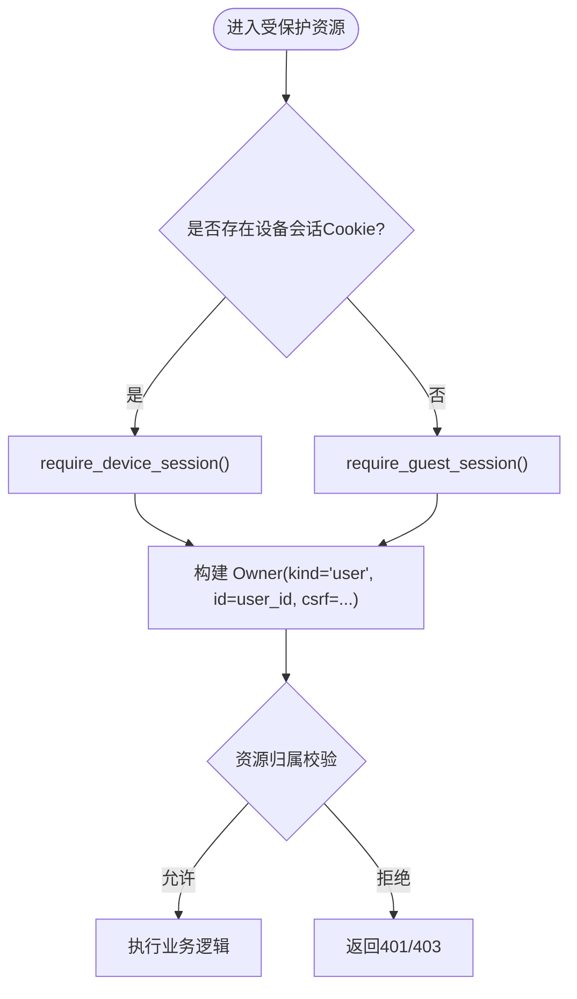
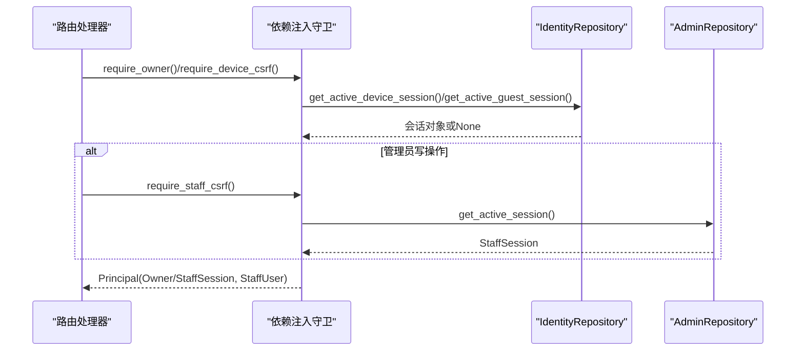
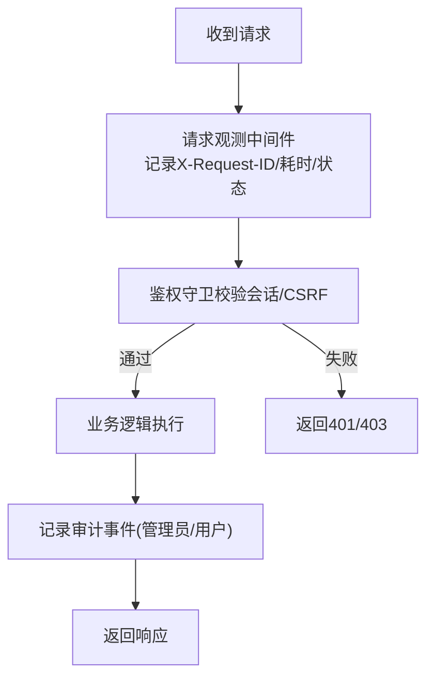
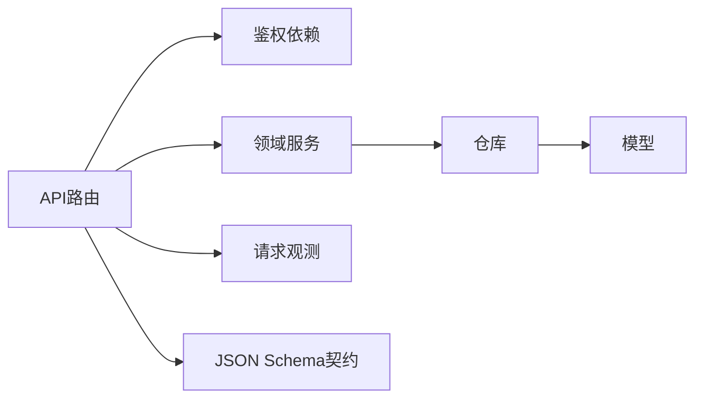

# 基于角色的访问控制

<cite>
**本文引用的文件**
- [backend/app/admin/models.py](file://backend/app/admin/models.py)
- [backend/app/admin/repository.py](file://backend/app/admin/repository.py)
- [backend/app/admin/service.py](file://backend/app/admin/service.py)
- [backend/app/api/admin.py](file://backend/app/api/admin.py)
- [backend/app/identity/models.py](file://backend/app/identity/models.py)
- [backend/app/identity/service.py](file://backend/app/identity/service.py)
- [backend/app/identity/repository.py](file://backend/app/identity/repository.py)
- [backend/app/api/dependencies.py](file://backend/app/api/dependencies.py)
- [backend/app/api/auth.py](file://backend/app/api/auth.py)
- [backend/app/api/account.py](file://backend/app/api/account.py)
- [backend/app/api/router.py](file://backend/app/api/router.py)
- [backend/app/observability.py](file://backend/app/observability.py)
- [contracts/schemas/auth-session.schema.json](file://contracts/schemas/auth-session.schema.json)
- [tests/test_admin_auth.py](file://tests/test_admin_auth.py)
</cite>

## 目录
1. [简介](#简介)
2. [项目结构](#项目结构)
3. [核心组件](#核心组件)
4. [架构总览](#架构总览)
5. [详细组件分析](#详细组件分析)
6. [依赖关系分析](#依赖关系分析)
7. [性能与可扩展性](#性能与可扩展性)
8. [故障排查指南](#故障排查指南)
9. [结论](#结论)
10. [附录：最佳实践与安全建议](#附录最佳实践与安全建议)

## 简介
本文件系统性地梳理并文档化当前代码库中的基于角色的访问控制（RBAC）与身份会话体系，覆盖管理员权限模型、用户角色体系、权限检查中间件机制、资源级权限控制、审计日志、以及测试与调试要点。重点说明：
- 管理员角色与权限：以 StaffUser.role 为核心标识，结合会话校验与 CSRF 保护实现管理面访问控制。
- 用户角色体系：区分普通用户、访客与会话持有者；通过设备会话与访客会话进行资源隔离。
- 权限检查中间件：使用 FastAPI 的依赖注入模式实现可组合的鉴权守卫（装饰器式用法）。
- 资源级权限控制：以数据所有者（Owner）概念进行资源归属判定，并结合审计事件记录关键操作。
- 权限继承与组合：当前采用“显式会话 + 角色字段”的组合策略，未实现复杂层级继承，便于演进扩展。
- 实时生效与缓存：会话撤销即时生效；鉴权过程无全局缓存，依赖数据库查询保证一致性。

## 项目结构
后端采用模块化组织，权限相关代码主要分布在 admin、identity、api 三个子模块中：
- admin：管理员身份与会话、审计事件、服务与仓库。
- identity：用户、登录身份、设备会话、访客会话、通用安全工具与服务。
- api：路由装配、依赖注入型鉴权守卫、业务接口。

图表来源
- [backend/app/api/router.py:12-21](file://backend/app/api/router.py#L12-L21)
- [backend/app/api/admin.py:33-100](file://backend/app/api/admin.py#L33-L100)
- [backend/app/api/auth.py:30-41](file://backend/app/api/auth.py#L30-L41)
- [backend/app/api/account.py:13-28](file://backend/app/api/account.py#L13-L28)
- [backend/app/api/dependencies.py:19-110](file://backend/app/api/dependencies.py#L19-L110)
- [backend/app/admin/service.py:33-129](file://backend/app/admin/service.py#L33-L129)
- [backend/app/identity/service.py:35-192](file://backend/app/identity/service.py#L35-L192)
- [backend/app/admin/repository.py:14-57](file://backend/app/admin/repository.py#L14-L57)
- [backend/app/identity/repository.py:84-113](file://backend/app/identity/repository.py#L84-L113)
- [backend/app/admin/models.py:17-81](file://backend/app/admin/models.py#L17-L81)
- [backend/app/identity/models.py:31-132](file://backend/app/identity/models.py#L31-L132)

章节来源
- [backend/app/api/router.py:12-21](file://backend/app/api/router.py#L12-L21)

## 核心组件
- 管理员权限模型
  - StaffUser：包含 role 字段用于标识管理员角色（如 superadmin），status 控制账号状态。
  - StaffSession：存储会话令牌哈希、CSRF 哈希、过期时间等，支持撤销与会话续期。
  - AdminAuditEvent：记录管理员关键操作（登录、登出、引导创建等）。
- 用户与会话模型
  - DeviceSession：已认证用户的设备会话，绑定 user_id，具备 CSRF 保护。
  - GuestSession：访客会话，支持认领为正式用户，具备独立生命周期。
  - AuditEvent：通用审计事件，记录用户侧关键行为。
- 鉴权依赖（中间件式守卫）
  - require_device_session / require_guest_session / require_owner：从请求中提取会话并校验有效性。
  - require_device_csrf / require_guest_csrf：双提交 CSRF 校验，防止跨站请求伪造。
  - require_staff_session / require_staff_csrf：管理员会话与 CSRF 双重校验。
- 服务层
  - AdminAuthService：管理员登录、登出、引导创建超级管理员，写入审计事件。
  - AuthService / GuestSessionService：OTP 流程、设备会话创建、访客会话创建与管理。
- 仓库层
  - AdminRepository：管理员与会话的增删查改。
  - IdentityRepository：用户、会话、审计事件的持久化访问。

章节来源
- [backend/app/admin/models.py:17-81](file://backend/app/admin/models.py#L17-L81)
- [backend/app/identity/models.py:31-132](file://backend/app/identity/models.py#L31-L132)
- [backend/app/api/dependencies.py:19-110](file://backend/app/api/dependencies.py#L19-L110)
- [backend/app/admin/service.py:33-129](file://backend/app/admin/service.py#L33-L129)
- [backend/app/identity/service.py:35-192](file://backend/app/identity/service.py#L35-L192)
- [backend/app/admin/repository.py:14-57](file://backend/app/admin/repository.py#L14-L57)
- [backend/app/identity/repository.py:84-113](file://backend/app/identity/repository.py#L84-L113)

## 架构总览
下图展示了从 HTTP 请求到权限校验、服务处理、持久化的完整链路，涵盖管理员与普通用户两条路径。

图表来源
- [backend/app/api/admin.py:33-100](file://backend/app/api/admin.py#L33-L100)
- [backend/app/admin/service.py:49-129](file://backend/app/admin/service.py#L49-L129)
- [backend/app/identity/service.py:100-192](file://backend/app/identity/service.py#L100-L192)
- [backend/app/api/dependencies.py:39-110](file://backend/app/api/dependencies.py#L39-L110)
- [backend/app/identity/repository.py:84-113](file://backend/app/identity/repository.py#L84-L113)

## 详细组件分析

### 管理员权限模型与会话
- 角色定义
  - StaffUser.role 作为管理员角色标识，示例中引导创建超级管理员时设置为 superadmin。
  - status 控制账号是否可用，非 active 将拒绝登录。
- 会话机制
  - StaffSession 保存 token_hash 与 csrf_token_hash，支持过期与撤销。
  - 登录成功后写入审计事件，记录 action="admin.login" 及角色信息。
- 权限检查
  - require_staff_session：从 Cookie 读取管理员会话令牌，校验有效性并返回 principal。
  - require_staff_csrf：对写操作进行双提交 CSRF 校验，确保请求来自同源。
- 登出与撤销
  - 登出时将会话标记撤销，并记录审计事件。

图表来源
- [backend/app/admin/models.py:17-81](file://backend/app/admin/models.py#L17-L81)

章节来源
- [backend/app/admin/models.py:17-81](file://backend/app/admin/models.py#L17-L81)
- [backend/app/admin/service.py:49-129](file://backend/app/admin/service.py#L49-L129)
- [backend/app/api/admin.py:68-100](file://backend/app/api/admin.py#L68-L100)
- [backend/app/api/admin.py:148-199](file://backend/app/api/admin.py#L148-L199)

### 用户角色体系与会话
- 普通用户与会话
  - DeviceSession：绑定 user_id，提供设备级会话能力，支持 CSRF 保护。
  - 通过 require_device_session 获取已认证用户上下文。
- 访客与会话
  - GuestSession：短期访客会话，支持认领为正式用户。
  - require_guest_session / require_guest_csrf：保障访客读写操作的合法性。
- 统一所有者抽象
  - Owner：统一表示“用户或访客”，包含 kind、id、csrf_token_hash，便于资源级权限判断。

图表来源
- [backend/app/api/dependencies.py:57-110](file://backend/app/api/dependencies.py#L57-L110)
- [backend/app/identity/models.py:68-110](file://backend/app/identity/models.py#L68-L110)

章节来源
- [backend/app/identity/models.py:68-110](file://backend/app/identity/models.py#L68-L110)
- [backend/app/api/dependencies.py:57-110](file://backend/app/api/dependencies.py#L57-L110)

### 权限检查中间件（依赖注入与动态评估）
- 依赖注入模式
  - 所有鉴权逻辑封装为 FastAPI 依赖函数，可在路由中以 Depends(...) 形式组合使用，形成“装饰器式”的守卫链。
- 动态评估
  - 根据请求中的 Cookie 与 Header 动态选择用户或访客路径，统一产出 Owner。
  - 管理员路径额外要求 CSRF 双提交，确保写操作安全。
- 会话校验
  - 通过仓库层查询有效会话，检查过期与撤销状态，保证权限实时生效。

图表来源
- [backend/app/api/dependencies.py:19-110](file://backend/app/api/dependencies.py#L19-L110)
- [backend/app/api/admin.py:68-100](file://backend/app/api/admin.py#L68-L100)

章节来源
- [backend/app/api/dependencies.py:19-110](file://backend/app/api/dependencies.py#L19-L110)
- [backend/app/api/admin.py:68-100](file://backend/app/api/admin.py#L68-L100)

### 资源级权限控制（数据隔离、审计与日志）
- 数据隔离
  - 通过 Owner.id 与资源所属 user_id 进行匹配，确保用户仅能访问自身数据。
  - 访客会话在认领前仅能访问受限资源，认领后迁移至正式用户上下文。
- 操作审计
  - 管理员登录/登出、引导创建等关键动作写入 AdminAuditEvent。
  - 用户侧 OTP 验证、设备会话撤销等写入 AuditEvent。
- 访问日志
  - 全局请求观测中间件记录方法、路径、状态码、耗时与请求 ID，便于追踪与排障。

图表来源
- [backend/app/observability.py:27-51](file://backend/app/observability.py#L27-L51)
- [backend/app/admin/service.py:75-101](file://backend/app/admin/service.py#L75-L101)
- [backend/app/identity/service.py:176-183](file://backend/app/identity/service.py#L176-L183)

章节来源
- [backend/app/observability.py:27-51](file://backend/app/observability.py#L27-L51)
- [backend/app/admin/service.py:75-101](file://backend/app/admin/service.py#L75-L101)
- [backend/app/identity/service.py:176-183](file://backend/app/identity/service.py#L176-L183)

### 权限继承与组合规则
- 当前策略
  - 管理员角色通过 StaffUser.role 显式声明，未实现层级继承；可通过后续扩展引入角色层次与权限集合。
  - 用户权限由“会话类型 + 资源归属”组合决定：设备会话代表已认证用户，访客会话代表受限临时主体。
- 聚合策略
  - 资源访问需同时满足：会话有效、CSRF 正确（写操作）、资源归属匹配。
  - 管理员写操作需额外通过 CSRF 校验，避免越权修改。

章节来源
- [backend/app/admin/models.py:17-34](file://backend/app/admin/models.py#L17-L34)
- [backend/app/identity/models.py:68-110](file://backend/app/identity/models.py#L68-L110)
- [backend/app/api/dependencies.py:57-110](file://backend/app/api/dependencies.py#L57-L110)

### 权限变更实时生效与缓存更新策略
- 实时生效
  - 会话撤销（revoked_at）立即生效，后续请求将无法通过会话校验。
  - 管理员状态非 active 将直接拒绝登录。
- 缓存策略
  - 鉴权过程无应用级缓存，每次请求均查询数据库确认会话有效性，保证强一致。
  - 若未来引入缓存，应确保撤销事件能触发失效广播，避免权限延迟。

章节来源
- [backend/app/admin/repository.py:42-57](file://backend/app/admin/repository.py#L42-L57)
- [backend/app/identity/repository.py:84-113](file://backend/app/identity/repository.py#L84-L113)

## 依赖关系分析
- 模块耦合
  - API 层通过依赖注入解耦鉴权逻辑，便于复用与测试。
  - 服务层依赖仓库抽象，屏蔽持久化细节。
  - 模型层集中定义实体与约束，保持领域清晰。
- 外部依赖
  - 使用 FastAPI 的 Request/Depends 实现中间件式守卫。
  - 使用 SQLAlchemy 异步会话进行数据库访问。
  - 使用 JSON Schema 对认证会话响应进行契约约束。

图表来源
- [backend/app/api/router.py:12-21](file://backend/app/api/router.py#L12-L21)
- [backend/app/api/dependencies.py:19-110](file://backend/app/api/dependencies.py#L19-L110)
- [backend/app/observability.py:27-51](file://backend/app/observability.py#L27-L51)
- [contracts/schemas/auth-session.schema.json:1-14](file://contracts/schemas/auth-session.schema.json#L1-L14)

章节来源
- [backend/app/api/router.py:12-21](file://backend/app/api/router.py#L12-L21)
- [backend/app/api/dependencies.py:19-110](file://backend/app/api/dependencies.py#L19-L110)
- [backend/app/observability.py:27-51](file://backend/app/observability.py#L27-L51)
- [contracts/schemas/auth-session.schema.json:1-14](file://contracts/schemas/auth-session.schema.json#L1-L14)

## 性能与可扩展性
- 性能特征
  - 鉴权路径涉及数据库查询，建议在热点路径引入只读副本或本地缓存（需考虑一致性）。
  - CSRF 校验使用常量时间比较，避免时序攻击。
- 可扩展点
  - 角色体系可扩展为多角色与权限集合，支持继承与组合。
  - 资源级权限可引入细粒度策略引擎（如基于属性的访问控制 ABAC）。
  - 审计日志可接入外部日志系统，支持检索与告警。

[本节为通用指导，不直接分析具体文件]

## 故障排查指南
- 常见问题
  - 401 未认证：检查 Cookie 是否存在且未过期，会话是否被撤销。
  - 403 CSRF 失败：确认双提交 Token 是否正确传递与匹配。
  - 管理员无法登录：检查邮箱与密码、账号状态是否为 active。
- 定位技巧
  - 使用 X-Request-ID 关联请求日志，快速定位问题链路。
  - 查看审计事件表，确认关键操作是否记录成功。
  - 通过 OpenAPI 文档与契约校验接口行为是否符合预期。

章节来源
- [backend/app/api/dependencies.py:39-110](file://backend/app/api/dependencies.py#L39-L110)
- [backend/app/api/admin.py:68-100](file://backend/app/api/admin.py#L68-L100)
- [backend/app/observability.py:27-51](file://backend/app/observability.py#L27-L51)

## 结论
本项目实现了稳健的 RBAC 与身份会话体系：管理员通过角色与会话控制管理面访问，用户通过设备/访客会话进行资源隔离，并通过审计与日志保障可追溯性。当前设计简洁清晰，易于扩展更复杂的角色层次与资源策略。建议在后续演进中引入更细粒度的权限模型与缓存优化，同时强化安全边界与监控告警。

[本节为总结，不直接分析具体文件]

## 附录：最佳实践与安全建议
- 最佳实践
  - 所有写操作强制 CSRF 双提交校验。
  - 会话令牌与 CSRF Token 均以哈希形式存储，避免明文泄露。
  - 敏感配置（如引导账号）通过环境变量注入，不在代码中硬编码。
  - 使用统一的错误模型与状态码，便于前端处理。
- 常见漏洞防护
  - 防止会话固定：新会话生成随机令牌，旧会话可撤销。
  - 防止重放攻击：CSRF 与一次性挑战（OTP）结合。
  - 防止越权访问：资源级校验必须基于 Owner.id 与资源归属。
  - 防止暴力破解：对登录与 OTP 请求实施速率限制。
- 测试与调试
  - 使用集成测试覆盖管理员登录、登出与会话撤销流程。
  - 断言响应中包含必要字段（如 session_id、expires_at、csrf_token）。
  - 利用 OpenAPI 契约测试确保接口稳定性。

章节来源
- [backend/tests/test_admin_auth.py:40-66](file://tests/test_admin_auth.py#L40-L66)
- [contracts/schemas/auth-session.schema.json:1-14](file://contracts/schemas/auth-session.schema.json#L1-L14)