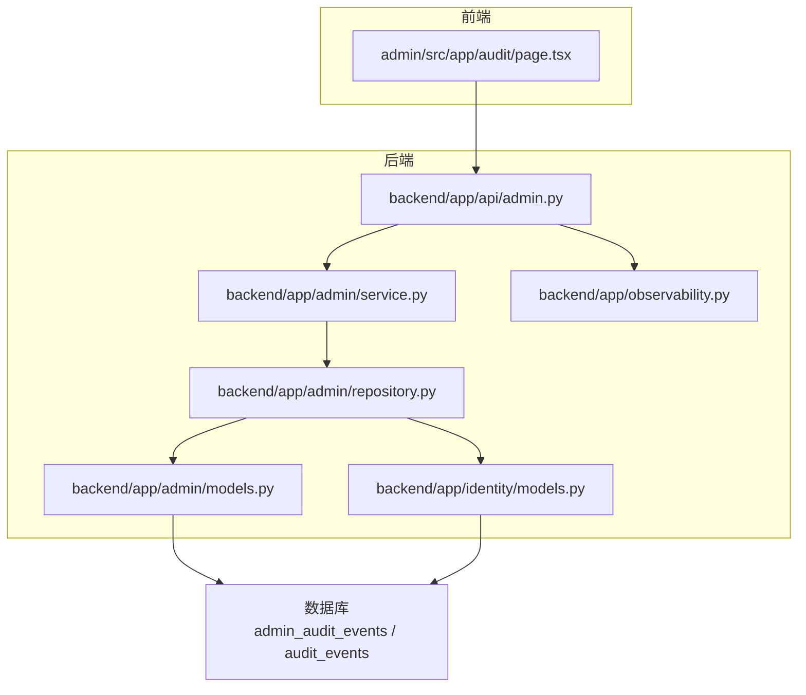
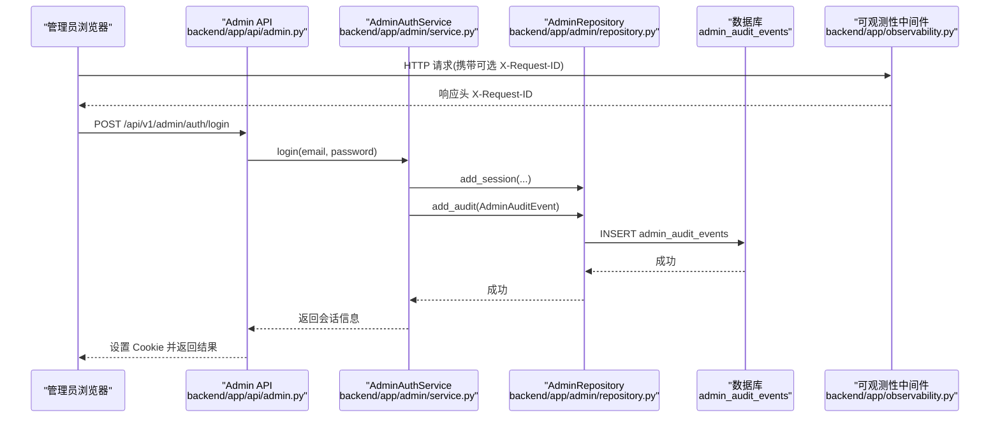
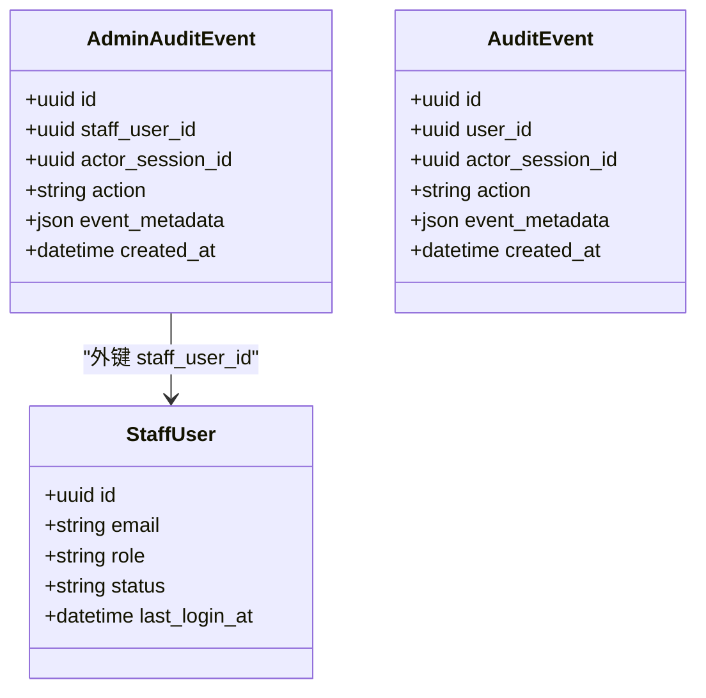
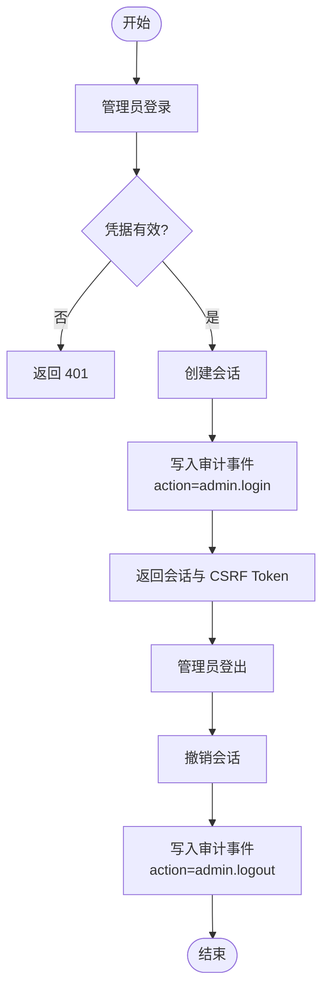
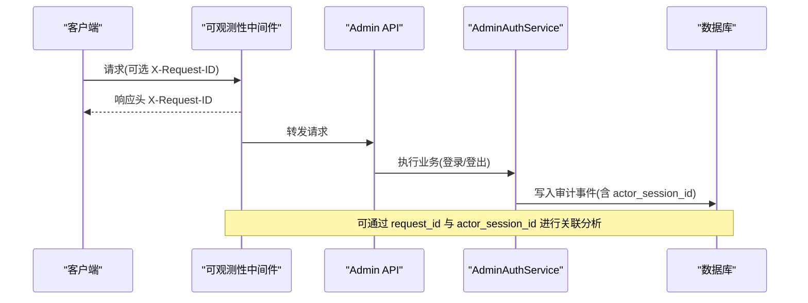
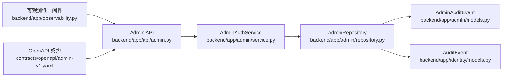

# 审计追踪系统

<cite>
**本文引用的文件**
- [backend/app/admin/models.py](file://backend/app/admin/models.py)
- [backend/app/identity/models.py](file://backend/app/identity/models.py)
- [backend/app/admin/service.py](file://backend/app/admin/service.py)
- [backend/app/admin/repository.py](file://backend/app/admin/repository.py)
- [backend/app/api/admin.py](file://backend/app/api/admin.py)
- [backend/app/observability.py](file://backend/app/observability.py)
- [backend/alembic/versions/0001_identity_foundation.py](file://backend/alembic/versions/0001_identity_foundation.py)
- [backend/alembic/versions/0008_admin_staff_foundation.py](file://backend/alembic/versions/0008_admin_staff_foundation.py)
- [contracts/openapi/admin-v1.yaml](file://contracts/openapi/admin-v1.yaml)
- [admin/src/app/audit/page.tsx](file://admin/src/app/audit/page.tsx)
</cite>

## 目录
1. [简介](#简介)
2. [项目结构](#项目结构)
3. [核心组件](#核心组件)
4. [架构总览](#架构总览)
5. [详细组件分析](#详细组件分析)
6. [依赖关系分析](#依赖关系分析)
7. [性能考虑](#性能考虑)
8. [故障排查指南](#故障排查指南)
9. [结论](#结论)
10. [附录](#附录)

## 简介
本文件面向“审计追踪系统”，聚焦后台管理侧的审计能力。当前仓库已实现：
- 管理员会话与鉴权（登录、登出、CSRF）
- 管理员审计事件模型与持久化
- 请求级可观测性中间件（统一 request_id、HTTP 日志）
- 前端审计页面占位（后续接入审计查询 API）

尚未实现的部分包括：审计事件的通用捕获拦截器、按时间范围的用户行为分析、异常检测、报表生成与可视化等，这些在文档中作为扩展建议给出。

## 项目结构
审计相关代码主要分布在后端 admin 模块、身份模块、API 路由以及可观测性中间件中；前端提供审计页面占位。

**图表来源**
- [backend/app/api/admin.py:103-163](file://backend/app/api/admin.py#L103-L163)
- [backend/app/admin/service.py:49-101](file://backend/app/admin/service.py#L49-L101)
- [backend/app/admin/repository.py:14-40](file://backend/app/admin/repository.py#L14-L40)
- [backend/app/admin/models.py:59-80](file://backend/app/admin/models.py#L59-L80)
- [backend/app/identity/models.py:113-131](file://backend/app/identity/models.py#L113-L131)
- [backend/app/observability.py:27-51](file://backend/app/observability.py#L27-L51)
- [admin/src/app/audit/page.tsx:4-10](file://admin/src/app/audit/page.tsx#L4-L10)

**章节来源**
- [backend/app/api/admin.py:103-163](file://backend/app/api/admin.py#L103-L163)
- [backend/app/admin/service.py:49-101](file://backend/app/admin/service.py#L49-L101)
- [backend/app/admin/repository.py:14-40](file://backend/app/admin/repository.py#L14-L40)
- [backend/app/admin/models.py:59-80](file://backend/app/admin/models.py#L59-L80)
- [backend/app/identity/models.py:113-131](file://backend/app/identity/models.py#L113-L131)
- [backend/app/observability.py:27-51](file://backend/app/observability.py#L27-L51)
- [admin/src/app/audit/page.tsx:4-10](file://admin/src/app/audit/page.tsx#L4-L10)

## 核心组件
- 管理员审计事件模型 AdminAuditEvent：记录管理员操作，包含操作者、会话、动作、元数据和时间戳。
- 用户审计事件模型 AuditEvent：记录普通用户操作，结构与管理员审计类似。
- 管理员认证服务：登录/登出时写入审计事件。
- 管理员 API：登录、登出、获取当前管理员信息、概览（占位）。
- 请求可观测性中间件：为每次 HTTP 请求注入并回传 request_id，输出结构化日志。
- 数据库迁移：创建审计表及索引。

**章节来源**
- [backend/app/admin/models.py:59-80](file://backend/app/admin/models.py#L59-L80)
- [backend/app/identity/models.py:113-131](file://backend/app/identity/models.py#L113-L131)
- [backend/app/admin/service.py:49-101](file://backend/app/admin/service.py#L49-L101)
- [backend/app/api/admin.py:103-163](file://backend/app/api/admin.py#L103-L163)
- [backend/app/observability.py:27-51](file://backend/app/observability.py#L27-L51)
- [backend/alembic/versions/0001_identity_foundation.py:105-123](file://backend/alembic/versions/0001_identity_foundation.py#L105-L123)
- [backend/alembic/versions/0008_admin_staff_foundation.py:71-103](file://backend/alembic/versions/0008_admin_staff_foundation.py#L71-L103)

## 架构总览
下图展示了管理员登录流程中的审计事件写入路径，以及请求级可观测性如何为审计提供上下文关联。

**图表来源**
- [backend/app/api/admin.py:103-145](file://backend/app/api/admin.py#L103-L145)
- [backend/app/admin/service.py:49-82](file://backend/app/admin/service.py#L49-L82)
- [backend/app/admin/repository.py:36-40](file://backend/app/admin/repository.py#L36-L40)
- [backend/app/observability.py:27-51](file://backend/app/observability.py#L27-L51)
- [backend/alembic/versions/0008_admin_staff_foundation.py:71-103](file://backend/alembic/versions/0008_admin_staff_foundation.py#L71-L103)

## 详细组件分析

### 数据模型：AdminAuditEvent 与 AuditEvent
- AdminAuditEvent（管理员审计事件）
  - 主键 id：UUID
  - staff_user_id：关联管理员账号，允许为空（外键 SET NULL）
  - actor_session_id：触发操作的会话标识
  - action：动作字符串（如 admin.login、admin.logout）
  - event_metadata：JSON/JSONB 元数据，用于存储扩展字段
  - created_at：带时区的时间戳，默认服务器当前时间
  - 索引：staff_user_id、created_at 便于按人员与时间查询
- AuditEvent（用户审计事件）
  - 结构与 AdminAuditEvent 类似，但 user_id 指向普通用户
  - 索引：user_id

**图表来源**
- [backend/app/admin/models.py:59-80](file://backend/app/admin/models.py#L59-L80)
- [backend/app/identity/models.py:113-131](file://backend/app/identity/models.py#L113-L131)
- [backend/app/admin/models.py:17-34](file://backend/app/admin/models.py#L17-L34)

**章节来源**
- [backend/app/admin/models.py:59-80](file://backend/app/admin/models.py#L59-L80)
- [backend/app/identity/models.py:113-131](file://backend/app/identity/models.py#L113-L131)
- [backend/alembic/versions/0001_identity_foundation.py:105-123](file://backend/alembic/versions/0001_identity_foundation.py#L105-L123)
- [backend/alembic/versions/0008_admin_staff_foundation.py:71-103](file://backend/alembic/versions/0008_admin_staff_foundation.py#L71-L103)

### 审计事件捕获机制
- 管理员登录
  - 校验凭据后创建会话，并写入审计事件 action=admin.login，元数据包含角色信息。
- 管理员登出
  - 撤销会话后写入审计事件 action=admin.logout。
- 引导账户创建（仅开发/测试环境）
  - 首次启动时可创建超级管理员，并写入审计事件 action=admin.bootstrap_created。

**图表来源**
- [backend/app/api/admin.py:103-163](file://backend/app/api/admin.py#L103-L163)
- [backend/app/admin/service.py:49-101](file://backend/app/admin/service.py#L49-L101)

**章节来源**
- [backend/app/admin/service.py:49-101](file://backend/app/admin/service.py#L49-L101)
- [backend/app/api/admin.py:103-163](file://backend/app/api/admin.py#L103-L163)

### 上下文信息收集与关联
- 请求级可观测性中间件
  - 从请求头读取或生成 request_id，写入响应头 X-Request-ID，并输出结构化日志（方法、路径、状态码、耗时）。
- 审计事件与会话
  - 审计事件通过 actor_session_id 关联到具体会话，便于回溯同一会话下的连续操作。
- 未来增强建议
  - 将 request_id 写入审计事件元数据，以便跨层关联（例如将 HTTP 请求与业务操作串联）。

**图表来源**
- [backend/app/observability.py:27-51](file://backend/app/observability.py#L27-L51)
- [backend/app/admin/service.py:49-101](file://backend/app/admin/service.py#L49-L101)

**章节来源**
- [backend/app/observability.py:27-51](file://backend/app/observability.py#L27-L51)
- [backend/app/admin/service.py:49-101](file://backend/app/admin/service.py#L49-L101)

### 审计数据的查询与分析（现状与建议）
- 现状
  - 数据库已具备按 staff_user_id 与 created_at 的索引，支持按管理员与时间范围检索。
  - 前端审计页面目前为占位，提示后续接入审计事件 API。
- 建议方案
  - 新增审计查询 API：支持按时间范围、管理员、动作类型过滤，分页返回。
  - 用户行为分析：基于 AuditEvent 统计用户操作频次、热点资源访问。
  - 异常检测：对失败登录、频繁登出、敏感操作集中发生等模式进行告警。
  - 报表与可视化：导出 CSV/Excel，前端以表格、折线图、热力图展示。

**章节来源**
- [backend/app/admin/models.py:59-80](file://backend/app/admin/models.py#L59-L80)
- [backend/app/identity/models.py:113-131](file://backend/app/identity/models.py#L113-L131)
- [admin/src/app/audit/page.tsx:4-10](file://admin/src/app/audit/page.tsx#L4-L10)

### 存储策略与归档机制
- 存储
  - 使用 PostgreSQL JSON/JSONB 存储 event_metadata，兼顾灵活性与查询性能。
  - 为常用查询字段建立索引（staff_user_id、created_at、user_id）。
- 归档建议
  - 按时间分区或按月归档历史审计数据至冷存储。
  - 对高吞吐场景引入异步写入队列，避免阻塞主事务。
  - 对敏感元数据进行脱敏或加密存储策略。

**章节来源**
- [backend/app/admin/models.py:59-80](file://backend/app/admin/models.py#L59-L80)
- [backend/app/identity/models.py:113-131](file://backend/app/identity/models.py#L113-L131)
- [backend/alembic/versions/0001_identity_foundation.py:105-123](file://backend/alembic/versions/0001_identity_foundation.py#L105-L123)
- [backend/alembic/versions/0008_admin_staff_foundation.py:71-103](file://backend/alembic/versions/0008_admin_staff_foundation.py#L71-L103)

### 隐私保护与合规性要求
- 最小化原则
  - 审计事件仅记录必要信息，避免在 event_metadata 中存放敏感内容。
- 安全配置
  - 生产环境强制启用安全 Cookie、禁用模拟 OTP、固定运行时路径与发布产物摘要校验。
  - 禁止在生产环境使用本地哈希密钥与内容加密密钥。
- 传输与存储
  - 通过 HTTPS 传输，Cookie 标记 HttpOnly；敏感字段加密存储。
- 访问控制
  - 审计数据仅限授权管理员访问，接口需鉴权与 CSRF 校验。

**章节来源**
- [backend/app/config.py:188-329](file://backend/app/config.py#L188-L329)
- [backend/app/api/admin.py:87-100](file://backend/app/api/admin.py#L87-L100)

### 审计报表生成与可视化展示
- 报表生成
  - 后端提供导出接口（CSV/Excel），支持按时间范围、管理员、动作类型筛选。
  - 计算指标：登录成功率、失败次数、登出频率、敏感操作占比。
- 可视化展示
  - 前端表格展示明细，折线图展示趋势，热力图展示时段分布。
  - 结合 request_id 与 actor_session_id 进行钻取分析。

[本节为概念性设计，未直接分析具体文件]

## 依赖关系分析
- API 层依赖服务层，服务层依赖仓储层，仓储层操作模型与数据库。
- 可观测性中间件独立于业务逻辑，为所有 HTTP 请求提供上下文。
- 管理员 API 使用 OpenAPI 契约定义，确保前后端一致。

**图表来源**
- [backend/app/api/admin.py:103-163](file://backend/app/api/admin.py#L103-L163)
- [backend/app/admin/service.py:49-101](file://backend/app/admin/service.py#L49-L101)
- [backend/app/admin/repository.py:14-40](file://backend/app/admin/repository.py#L14-L40)
- [backend/app/admin/models.py:59-80](file://backend/app/admin/models.py#L59-L80)
- [backend/app/identity/models.py:113-131](file://backend/app/identity/models.py#L113-L131)
- [backend/app/observability.py:27-51](file://backend/app/observability.py#L27-L51)
- [contracts/openapi/admin-v1.yaml:15-82](file://contracts/openapi/admin-v1.yaml#L15-L82)

**章节来源**
- [backend/app/api/admin.py:103-163](file://backend/app/api/admin.py#L103-L163)
- [backend/app/admin/service.py:49-101](file://backend/app/admin/service.py#L49-L101)
- [backend/app/admin/repository.py:14-40](file://backend/app/admin/repository.py#L14-L40)
- [backend/app/admin/models.py:59-80](file://backend/app/admin/models.py#L59-L80)
- [backend/app/identity/models.py:113-131](file://backend/app/identity/models.py#L113-L131)
- [backend/app/observability.py:27-51](file://backend/app/observability.py#L27-L51)
- [contracts/openapi/admin-v1.yaml:15-82](file://contracts/openapi/admin-v1.yaml#L15-L82)

## 性能考虑
- 索引优化：已为 staff_user_id、created_at、user_id 建立索引，利于时间范围与人员维度查询。
- 写入路径：当前审计写入与业务事务同库，建议在高频场景引入异步写入以降低延迟。
- 元数据大小：event_metadata 应控制体积，避免过大影响查询与存储成本。
- 日志量控制：可观测性中间件输出结构化日志，需配合日志采集与采样策略。

[本节提供一般性指导，不直接分析具体文件]

## 故障排查指南
- 登录失败
  - 检查速率限制是否触发（429），确认邮箱与密码是否正确。
  - 查看审计事件是否记录了失败尝试（可在后续扩展中记录失败原因）。
- 登出无效
  - 检查 CSRF 校验是否通过（403），确认 Cookie 与 Header 匹配。
  - 查看审计事件是否记录了登出动作。
- 审计数据缺失
  - 确认数据库迁移是否执行，表与索引是否存在。
  - 检查服务层是否正确调用 add_audit。

**章节来源**
- [backend/app/api/admin.py:56-65](file://backend/app/api/admin.py#L56-L65)
- [backend/app/api/admin.py:87-100](file://backend/app/api/admin.py#L87-L100)
- [backend/app/admin/service.py:49-101](file://backend/app/admin/service.py#L49-L101)
- [backend/alembic/versions/0001_identity_foundation.py:105-123](file://backend/alembic/versions/0001_identity_foundation.py#L105-L123)
- [backend/alembic/versions/0008_admin_staff_foundation.py:71-103](file://backend/alembic/versions/0008_admin_staff_foundation.py#L71-L103)

## 结论
当前审计追踪系统已具备管理员审计事件的数据模型、持久化与基础写入路径，并通过可观测性中间件提供请求级上下文。下一步建议完善审计查询 API、用户行为分析与异常检测，并制定报表与可视化方案，以满足运营与合规需求。同时，持续强化隐私保护与生产安全配置，确保审计数据的安全与可靠。

[本节为总结性内容，不直接分析具体文件]

## 附录
- 管理员 API 契约：定义了登录、登出、当前管理员信息与概览接口。
- 前端审计页面：当前为占位，提示后续接入审计事件 API。

**章节来源**
- [contracts/openapi/admin-v1.yaml:15-82](file://contracts/openapi/admin-v1.yaml#L15-L82)
- [admin/src/app/audit/page.tsx:4-10](file://admin/src/app/audit/page.tsx#L4-L10)