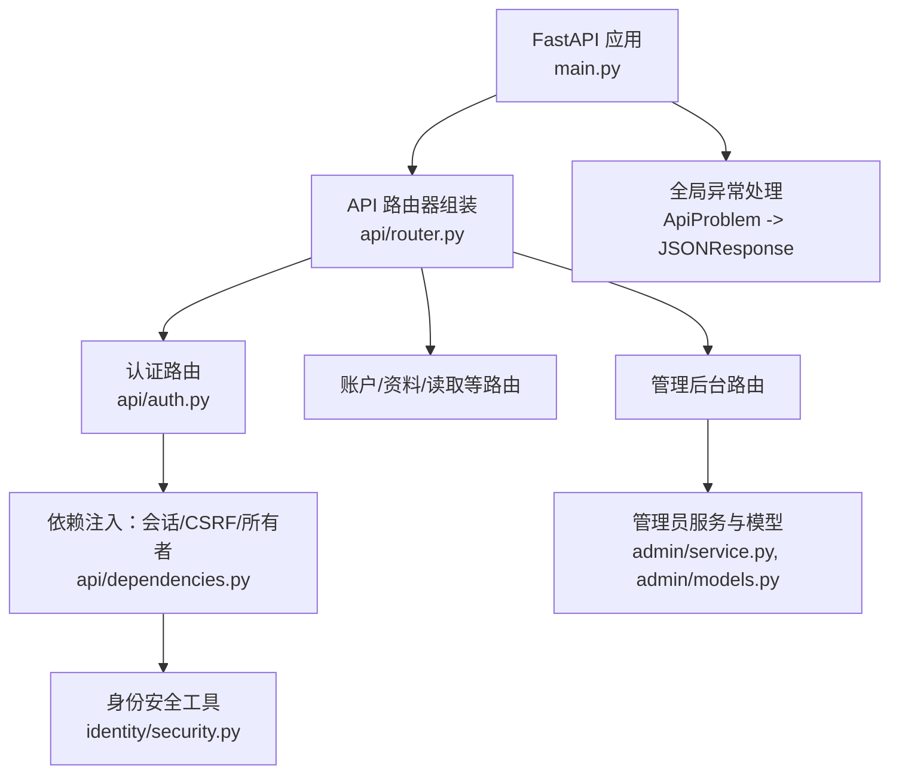
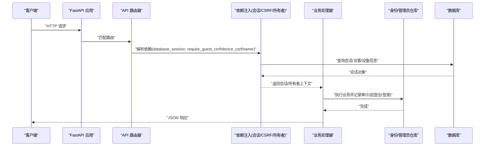
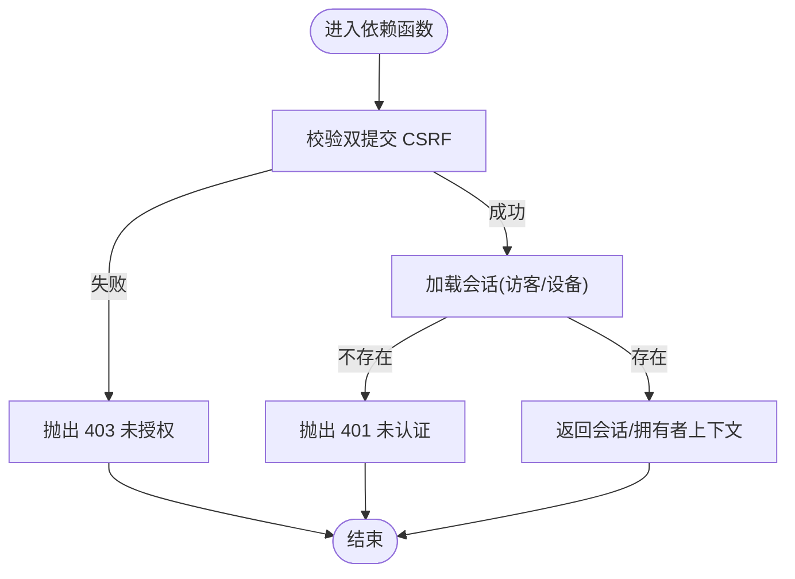
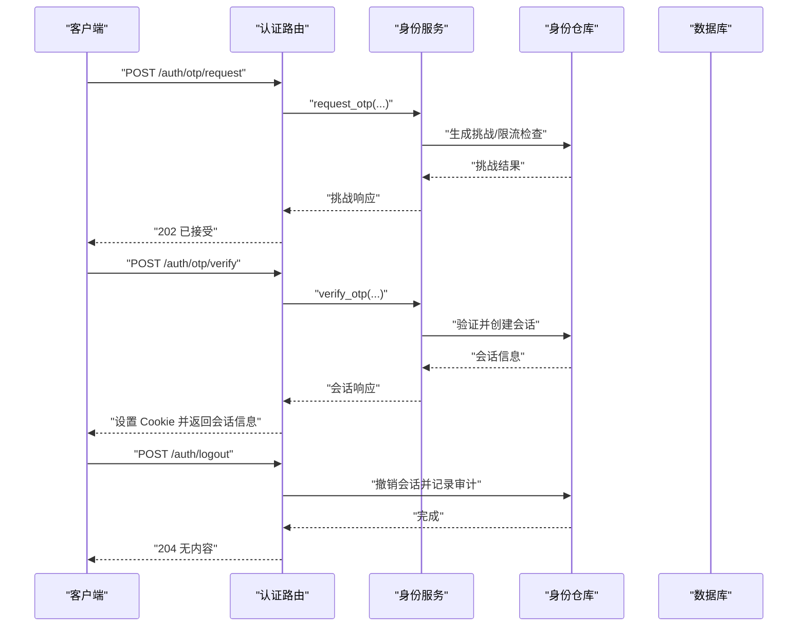
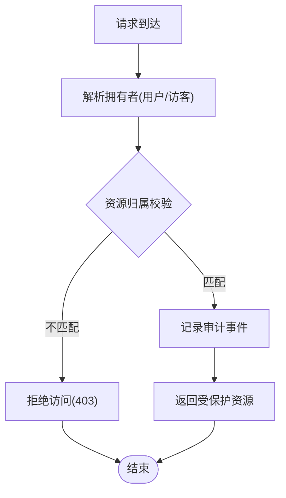
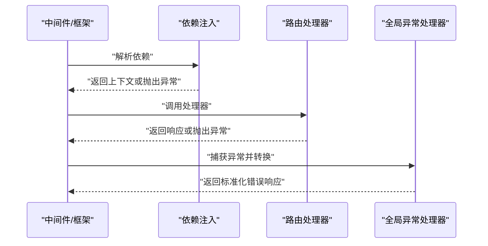
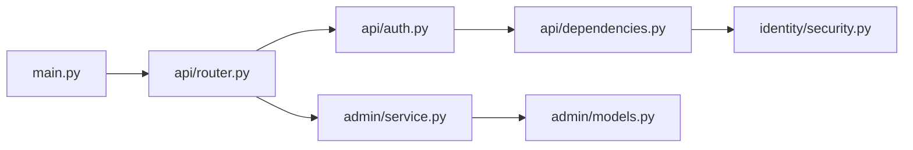

# 权限拦截器与装饰器

<cite>
**本文引用的文件**
- [backend/app/api/dependencies.py](file://backend/app/api/dependencies.py)
- [backend/app/api/auth.py](file://backend/app/api/auth.py)
- [backend/app/main.py](file://backend/app/main.py)
- [backend/app/identity/security.py](file://backend/app/identity/security.py)
- [backend/app/admin/service.py](file://backend/app/admin/service.py)
- [backend/app/admin/models.py](file://backend/app/admin/models.py)
- [backend/app/api/router.py](file://backend/app/api/router.py)
</cite>

## 目录
1. [简介](#简介)
2. [项目结构](#项目结构)
3. [核心组件](#核心组件)
4. [架构总览](#架构总览)
5. [详细组件分析](#详细组件分析)
6. [依赖关系分析](#依赖关系分析)
7. [性能考虑](#性能考虑)
8. [故障排查指南](#故障排查指南)
9. [结论](#结论)
10. [附录](#附录)

## 简介
本文件聚焦于 FastAPI 依赖注入体系中的“权限拦截器”（以依赖函数形式实现）与“基于装饰器的权限控制模式”，并结合本项目实际代码，系统阐述：
- 依赖函数的实现与请求上下文获取方式
- 基于装饰器的权限校验流程（CSRF、会话、资源归属）
- 资源级权限检查（数据隔离、操作审计、访问日志）
- 中间件链中的执行顺序与错误处理机制
- 权限缓存策略与性能优化建议
- 测试方法与调试技巧

## 项目结构
后端采用模块化组织，权限相关能力主要分布在以下位置：
- API 层：路由注册、依赖声明、异常统一处理
- 身份与会话：Cookie、令牌哈希、会话模型与仓库
- 管理员域：员工登录、会话、审计事件
- 应用启动：全局异常处理器、速率限制、可观测性安装



**图表来源**
- [backend/app/main.py:30-152](file://backend/app/main.py#L30-L152)
- [backend/app/api/router.py:12-21](file://backend/app/api/router.py#L12-L21)
- [backend/app/api/auth.py:27-161](file://backend/app/api/auth.py#L27-L161)
- [backend/app/api/dependencies.py:19-137](file://backend/app/api/dependencies.py#L19-L137)
- [backend/app/identity/security.py:5-11](file://backend/app/identity/security.py#L5-L11)
- [backend/app/admin/service.py:33-129](file://backend/app/admin/service.py#L33-L129)
- [backend/app/admin/models.py:17-81](file://backend/app/admin/models.py#L17-L81)

**章节来源**
- [backend/app/main.py:30-152](file://backend/app/main.py#L30-L152)
- [backend/app/api/router.py:12-21](file://backend/app/api/router.py#L12-L21)

## 核心组件
- 依赖注入式权限拦截器
  - 数据库会话生命周期管理
  - 访客会话校验与 CSRF 双重提交验证
  - 设备会话校验与 CSRF 双重提交验证
  - 资源拥有者识别（用户或访客）
- 管理员权限与审计
  - 员工登录、登出与会话管理
  - 管理员审计事件记录
- 全局异常处理
  - ApiProblem 统一转换为 HTTP 响应
  - 请求校验异常标准化

**章节来源**
- [backend/app/api/dependencies.py:19-137](file://backend/app/api/dependencies.py#L19-L137)
- [backend/app/admin/service.py:33-129](file://backend/app/admin/service.py#L33-L129)
- [backend/app/admin/models.py:59-81](file://backend/app/admin/models.py#L59-L81)
- [backend/app/main.py:115-136](file://backend/app/main.py#L115-L136)

## 架构总览
下图展示了从请求进入 FastAPI 到权限校验、业务处理、审计记录的完整链路。



**图表来源**
- [backend/app/main.py:115-140](file://backend/app/main.py#L115-L140)
- [backend/app/api/auth.py:51-161](file://backend/app/api/auth.py#L51-L161)
- [backend/app/api/dependencies.py:19-137](file://backend/app/api/dependencies.py#L19-L137)
- [backend/app/admin/service.py:49-101](file://backend/app/admin/service.py#L49-L101)

## 详细组件分析

### 依赖注入式权限拦截器（FastAPI Depends）
- 数据库会话
  - 通过依赖函数提供异步会话，自动回滚异常分支，保证事务一致性。
- 访客会话与 CSRF
  - 校验 Cookie 中的访客令牌与请求头中的 CSRF Token 是否一致且有效；
  - 从仓库中加载活跃访客会话并比对 CSRF 哈希，防止跨站伪造。
- 设备会话与 CSRF
  - 校验 Cookie 中的设备会话令牌，加载活跃会话并比对 CSRF 哈希；
  - 用于写操作的强校验路径（如登出）。
- 资源拥有者识别
  - 优先尝试设备会话，失败则回退为访客会话；
  - 返回统一的拥有者上下文，便于后续资源级权限判断。
- 私有响应标记
  - 为敏感响应设置缓存控制与搜索引擎索引控制头，避免泄露。



**图表来源**
- [backend/app/api/dependencies.py:29-130](file://backend/app/api/dependencies.py#L29-L130)

**章节来源**
- [backend/app/api/dependencies.py:19-137](file://backend/app/api/dependencies.py#L19-L137)

### 认证流程与审计（OTP、登出）
- OTP 请求与验证
  - 需要访客会话与 CSRF 保护；
  - 调用身份服务发送验证码并返回挑战信息；
  - 验证通过后创建设备会话并写入 Cookie。
- 登出
  - 需要设备会话与 CSRF 保护；
  - 撤销会话并记录审计事件。



**图表来源**
- [backend/app/api/auth.py:51-161](file://backend/app/api/auth.py#L51-L161)

**章节来源**
- [backend/app/api/auth.py:51-161](file://backend/app/api/auth.py#L51-L161)

### 管理员权限与审计
- 员工登录
  - 校验邮箱与密码，支持引导式超级管理员初始化；
  - 创建会话并记录登录审计事件。
- 管理员登出
  - 撤销会话并记录登出审计事件。
- 数据模型
  - 员工用户与会话表结构，包含角色、状态、过期时间等字段；
  - 管理员审计事件表，记录动作与元数据。

```mermaid
classDiagram
class StaffUser {
+UUID id
+string email
+string password_hash
+string display_name
+string role
+string status
+datetime last_login_at
}
class StaffSession {
+UUID id
+UUID staff_user_id
+string token_hash
+string csrf_token_hash
+datetime expires_at
+datetime last_seen_at
+datetime revoked_at
}
class AdminAuditEvent {
+UUID id
+UUID staff_user_id
+UUID actor_session_id
+string action
+dict event_metadata
+datetime created_at
}
StaffUser ||--o{ StaffSession : "拥有"
StaffUser ||--o{ AdminAuditEvent : "产生"
StaffSession ||--o{ AdminAuditEvent : "作为行为主体"
```

**图表来源**
- [backend/app/admin/models.py:17-81](file://backend/app/admin/models.py#L17-L81)

**章节来源**
- [backend/app/admin/service.py:33-129](file://backend/app/admin/service.py#L33-L129)
- [backend/app/admin/models.py:17-81](file://backend/app/admin/models.py#L17-L81)

### 资源级权限检查与数据隔离
- 资源拥有者上下文
  - 通过依赖函数返回统一拥有者对象，区分用户与访客；
  - 结合业务逻辑进行资源级鉴权（例如仅允许本人访问其资料/解读）。
- 数据隔离
  - 在仓储或服务层依据拥有者 ID 过滤数据，确保多租户/多用户隔离。
- 访问日志与审计
  - 关键操作（登录、登出、配置变更）记录审计事件；
  - 审计事件包含操作人、会话、动作与元数据。



**图表来源**
- [backend/app/api/dependencies.py:87-130](file://backend/app/api/dependencies.py#L87-L130)
- [backend/app/admin/service.py:74-101](file://backend/app/admin/service.py#L74-L101)

**章节来源**
- [backend/app/api/dependencies.py:87-130](file://backend/app/api/dependencies.py#L87-L130)
- [backend/app/admin/service.py:74-101](file://backend/app/admin/service.py#L74-L101)

### 中间件链中的执行顺序与错误处理
- 执行顺序
  - FastAPI 先执行依赖注入（会话、CSRF、拥有者），再进入路由处理器；
  - 全局异常处理器捕获 ApiProblem 并转为标准 JSON 响应。
- 错误处理
  - 未认证：401；
  - 未授权/CSRF 失败：403；
  - 请求校验失败：400；
  - 第三方服务不可用：503。



**图表来源**
- [backend/app/main.py:115-136](file://backend/app/main.py#L115-L136)
- [backend/app/api/dependencies.py:29-130](file://backend/app/api/dependencies.py#L29-L130)

**章节来源**
- [backend/app/main.py:115-136](file://backend/app/main.py#L115-L136)
- [backend/app/api/dependencies.py:29-130](file://backend/app/api/dependencies.py#L29-L130)

### 基于装饰器的权限控制模式
- 在本项目中，权限控制主要通过 FastAPI 的依赖注入实现，而非传统意义上的装饰器；
- 若需扩展为装饰器模式，可将依赖函数封装为装饰器，复用相同的校验逻辑（CSRF、会话、拥有者）；
- 优势：保持与 FastAPI 生态一致，同时可在装饰器内注入额外横切关注点（如审计、限流）。

[本节为概念性说明，不直接分析具体文件]

## 依赖关系分析
- 模块耦合
  - 认证路由依赖依赖注入模块提供的会话与 CSRF 校验；
  - 管理员服务依赖管理员模型与仓库；
  - 应用启动装配全局异常处理与速率限制。
- 外部依赖
  - 数据库会话工厂；
  - 身份令牌哈希与安全工具；
  - 速率限制器与会话存储。



**图表来源**
- [backend/app/main.py:30-152](file://backend/app/main.py#L30-L152)
- [backend/app/api/router.py:12-21](file://backend/app/api/router.py#L12-L21)
- [backend/app/api/auth.py:27-161](file://backend/app/api/auth.py#L27-L161)
- [backend/app/api/dependencies.py:19-137](file://backend/app/api/dependencies.py#L19-L137)
- [backend/app/identity/security.py:5-11](file://backend/app/identity/security.py#L5-L11)
- [backend/app/admin/service.py:33-129](file://backend/app/admin/service.py#L33-L129)
- [backend/app/admin/models.py:17-81](file://backend/app/admin/models.py#L17-L81)

**章节来源**
- [backend/app/main.py:30-152](file://backend/app/main.py#L30-L152)
- [backend/app/api/router.py:12-21](file://backend/app/api/router.py#L12-L21)
- [backend/app/api/auth.py:27-161](file://backend/app/api/auth.py#L27-L161)
- [backend/app/api/dependencies.py:19-137](file://backend/app/api/dependencies.py#L19-L137)
- [backend/app/identity/security.py:5-11](file://backend/app/identity/security.py#L5-L11)
- [backend/app/admin/service.py:33-129](file://backend/app/admin/service.py#L33-L129)
- [backend/app/admin/models.py:17-81](file://backend/app/admin/models.py#L17-L81)

## 性能考虑
- 会话与令牌
  - 使用哈希存储与比较，避免明文暴露；
  - 合理设置会话过期时间与刷新策略。
- CSRF 校验
  - 仅在写操作路径启用双重提交校验，减少读路径开销。
- 速率限制
  - 对 OTP 请求、访客会话创建、读取/资料写入、管理员登录等关键路径实施窗口限流，降低滥用风险。
- 缓存策略
  - 对敏感响应设置私有缓存控制头，避免 CDN/代理缓存；
  - 对只读热点数据可引入应用级缓存（如内存缓存），但需考虑失效与一致性。
- 数据库访问
  - 使用异步会话与最小化查询范围，避免 N+1 问题；
  - 对高频查询建立合适索引（如会话过期时间、用户 ID）。

[本节提供通用指导，不直接分析具体文件]

## 故障排查指南
- 常见错误码
  - 401：未认证（缺少会话或会话无效）；
  - 403：未授权（CSRF 校验失败或资源不归属）；
  - 400：请求校验失败；
  - 429：频率限制触发；
  - 503：第三方服务不可用。
- 定位步骤
  - 检查请求是否携带正确的 Cookie 与 CSRF 头；
  - 确认会话是否活跃且未过期；
  - 查看审计事件与日志，定位异常分支；
  - 使用 OpenAPI 文档与测试用例复现问题。
- 调试技巧
  - 在本地环境启用开发模式，观察 OTP 开发码；
  - 通过全局异常处理器输出标准化错误信息；
  - 针对依赖注入函数添加断点，逐步验证上下文构建过程。

**章节来源**
- [backend/app/main.py:115-136](file://backend/app/main.py#L115-L136)
- [backend/app/api/auth.py:51-161](file://backend/app/api/auth.py#L51-L161)
- [backend/app/api/dependencies.py:29-130](file://backend/app/api/dependencies.py#L29-L130)

## 结论
本项目通过 FastAPI 依赖注入实现了高内聚、低耦合的权限拦截机制：
- 以依赖函数为核心，统一处理会话、CSRF 与资源拥有者识别；
- 管理员域具备完整的登录、登出与审计能力；
- 全局异常处理器保障错误响应的标准化与可观测性；
- 结合速率限制与缓存控制，兼顾安全性与性能。
未来可扩展为装饰器模式以增强横切能力，同时保持与现有依赖注入体系的一致性。

## 附录
- 最佳实践
  - 所有写操作必须经过 CSRF 校验；
  - 敏感响应必须标记私有缓存；
  - 关键操作必须记录审计事件；
  - 对外部依赖失败进行降级与重试控制。
- 测试建议
  - 覆盖未认证、未授权、CSRF 失败、会话过期等边界场景；
  - 模拟第三方服务不可用，验证 503 分支；
  - 验证审计事件是否正确记录。

[本节为补充说明，不直接分析具体文件]