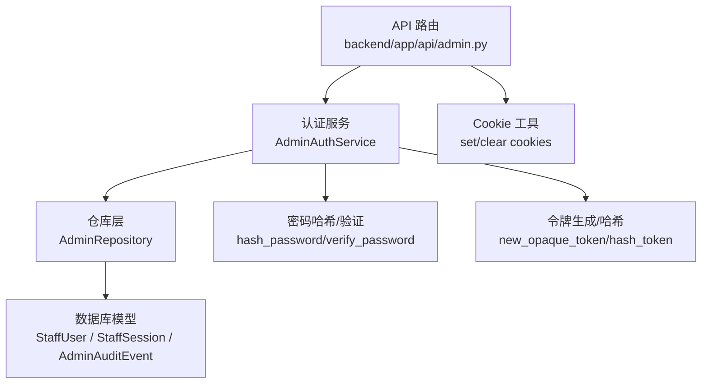
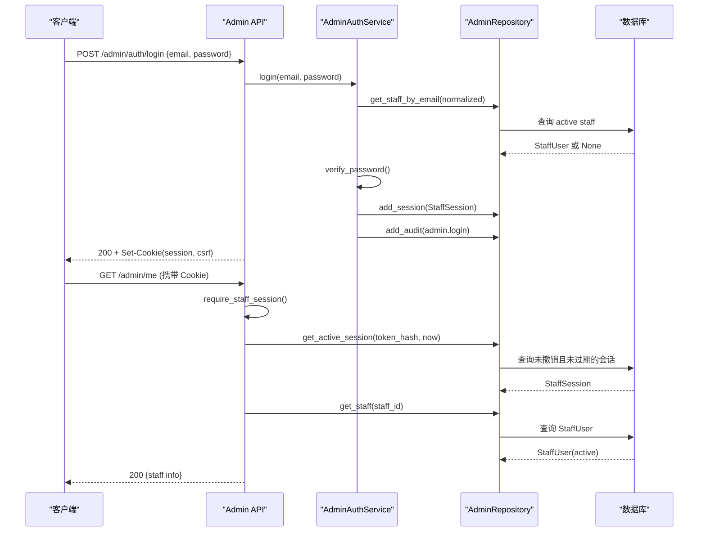
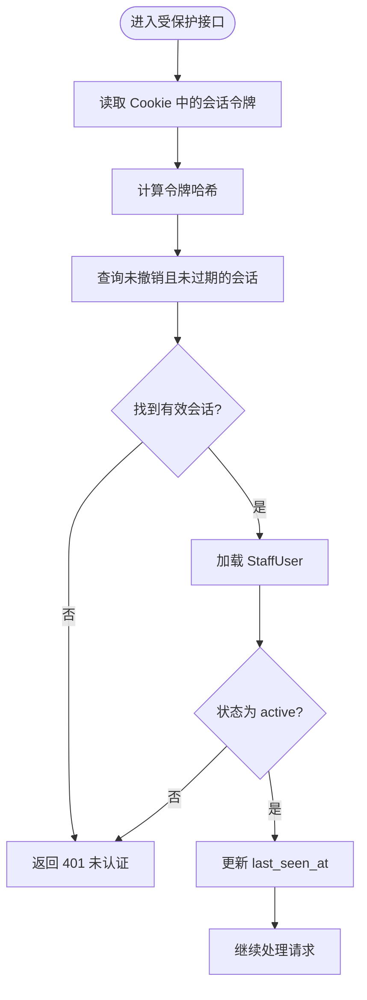
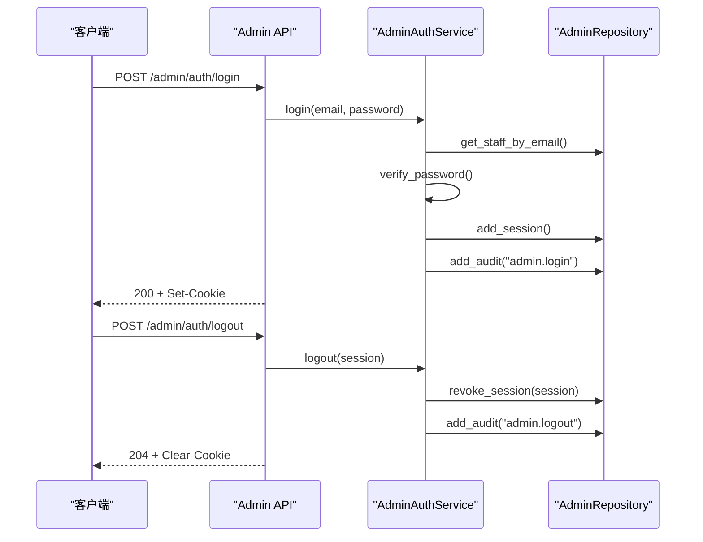
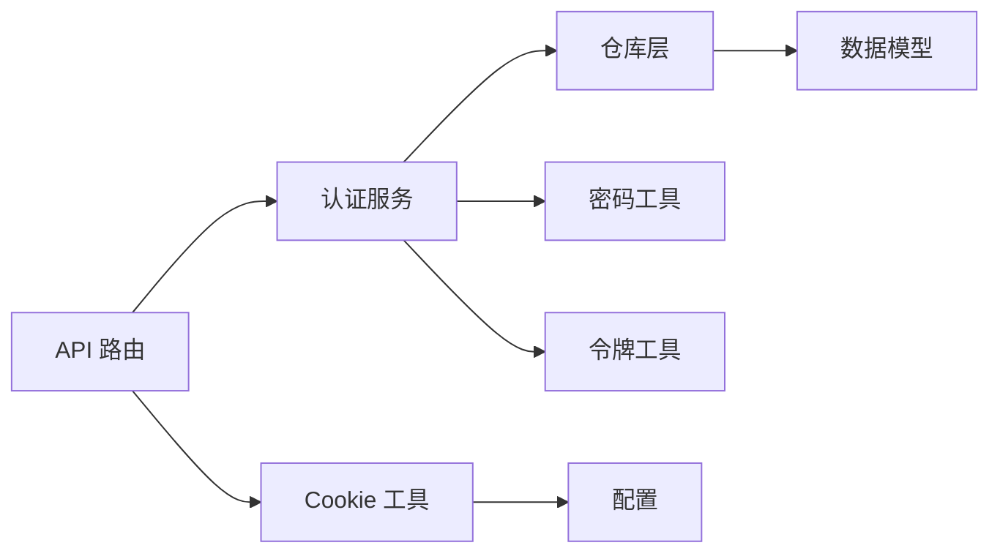

# 管理员角色模型

<cite>
**本文引用的文件**
- [backend/app/admin/models.py](file://backend/app/admin/models.py)
- [backend/app/admin/service.py](file://backend/app/admin/service.py)
- [backend/app/admin/repository.py](file://backend/app/admin/repository.py)
- [backend/app/admin/schemas.py](file://backend/app/admin/schemas.py)
- [backend/app/admin/passwords.py](file://backend/app/admin/passwords.py)
- [backend/app/admin/cookies.py](file://backend/app/admin/cookies.py)
- [backend/app/api/admin.py](file://backend/app/api/admin.py)
- [backend/app/identity/security.py](file://backend/app/identity/security.py)
- [backend/app/config.py](file://backend/app/config.py)
- [backend/tests/test_admin_auth.py](file://backend/tests/test_admin_auth.py)
</cite>

## 目录
1. [简介](#简介)
2. [项目结构](#项目结构)
3. [核心组件](#核心组件)
4. [架构总览](#架构总览)
5. [详细组件分析](#详细组件分析)
6. [依赖关系分析](#依赖关系分析)
7. [性能考虑](#性能考虑)
8. [故障排查指南](#故障排查指南)
9. [结论](#结论)
10. [附录](#附录)

## 简介
本文件聚焦于管理员角色模型，围绕 StaffUser 数据模型、角色与权限、会话管理、生命周期操作以及安全与最佳实践进行系统化说明。当前实现中，管理员角色以字符串枚举形式存在，尚未实现细粒度的权限继承与聚合策略；系统通过会话令牌与 CSRF 机制保障访问安全，并通过审计事件记录关键操作。

## 项目结构
管理员相关代码主要位于后端模块的 admin 子包与 API 路由中：
- 数据模型与持久化：models.py、repository.py
- 认证与会话服务：service.py、passwords.py、security.py
- Cookie 与请求校验：cookies.py、api/admin.py
- 配置与安全约束：config.py
- 前端调用与测试：admin/src/components/admin-shell.tsx（仅引用）、tests/test_admin_auth.py

图表来源
- [backend/app/api/admin.py:68-100](file://backend/app/api/admin.py#L68-L100)
- [backend/app/admin/service.py:33-89](file://backend/app/admin/service.py#L33-L89)
- [backend/app/admin/repository.py:14-57](file://backend/app/admin/repository.py#L14-L57)
- [backend/app/admin/models.py:17-81](file://backend/app/admin/models.py#L17-L81)
- [backend/app/admin/cookies.py:38-81](file://backend/app/admin/cookies.py#L38-L81)
- [backend/app/admin/passwords.py:16-55](file://backend/app/admin/passwords.py#L16-L55)
- [backend/app/identity/security.py:5-11](file://backend/app/identity/security.py#L5-L11)

章节来源
- [backend/app/api/admin.py:1-200](file://backend/app/api/admin.py#L1-L200)
- [backend/app/admin/models.py:1-81](file://backend/app/admin/models.py#L1-L81)
- [backend/app/admin/service.py:1-148](file://backend/app/admin/service.py#L1-L148)
- [backend/app/admin/repository.py:1-57](file://backend/app/admin/repository.py#L1-L57)
- [backend/app/admin/cookies.py:1-81](file://backend/app/admin/cookies.py#L1-L81)
- [backend/app/admin/passwords.py:1-55](file://backend/app/admin/passwords.py#L1-L55)
- [backend/app/identity/security.py:1-11](file://backend/app/identity/security.py#L1-L11)
- [backend/app/config.py:141-145](file://backend/app/config.py#L141-L145)

## 核心组件
- StaffUser：管理员账户实体，包含唯一邮箱、密码哈希、显示名、角色、状态、创建时间与最后登录时间等字段。
- StaffSession：管理员会话实体，存储会话令牌哈希、CSRF 令牌哈希、过期时间、最后访问时间、撤销时间等。
- AdminAuditEvent：管理员审计事件，记录操作人、会话、动作与元数据。
- AdminAuthService：登录、登出、引导创建超级管理员与会话生命周期管理。
- AdminRepository：对 StaffUser、StaffSession、AdminAuditEvent 的增删查改封装。
- Cookie 工具：设置/清除管理员会话与 CSRF Cookie。
- 密码与令牌：基于 scrypt 的密码哈希与验证；随机不透明令牌与 SHA-256 哈希。

章节来源
- [backend/app/admin/models.py:17-81](file://backend/app/admin/models.py#L17-L81)
- [backend/app/admin/service.py:24-89](file://backend/app/admin/service.py#L24-L89)
- [backend/app/admin/repository.py:14-57](file://backend/app/admin/repository.py#L14-L57)
- [backend/app/admin/cookies.py:38-81](file://backend/app/admin/cookies.py#L38-L81)
- [backend/app/admin/passwords.py:16-55](file://backend/app/admin/passwords.py#L16-L55)
- [backend/app/identity/security.py:5-11](file://backend/app/identity/security.py#L5-L11)

## 架构总览
管理员认证与授权流程由 API 路由驱动，经依赖注入获取数据库会话，调用认证服务完成身份校验与会话创建，再通过 Cookie 下发会话令牌与 CSRF 令牌。后续受保护接口通过依赖注入校验会话有效性与 CSRF 一致性。

图表来源
- [backend/app/api/admin.py:103-145](file://backend/app/api/admin.py#L103-L145)
- [backend/app/api/admin.py:68-84](file://backend/app/api/admin.py#L68-L84)
- [backend/app/admin/service.py:49-89](file://backend/app/admin/service.py#L49-L89)
- [backend/app/admin/repository.py:22-53](file://backend/app/admin/repository.py#L22-L53)

## 详细组件分析

### StaffUser 数据模型与角色定义
- 字段说明
  - id：UUID 主键
  - email：唯一邮箱，用于登录与检索
  - password_hash：scrypt 哈希值
  - display_name：显示名称
  - role：角色字符串，当前类型为 Literal 枚举，支持 support、finance、ops、superadmin
  - status：账户状态，默认 active，登录时要求为 active
  - created_at：创建时间
  - last_login_at：最后登录时间
- 索引与约束
  - 邮箱唯一约束
  - 状态索引优化查询
- 角色类型
  - superadmin：超级管理员（引导创建）
  - support：客服管理员
  - finance：财务管理员
  - ops：运维管理员
- 注意
  - 当前角色仅为字符串标识，未实现基于角色的权限继承与聚合策略
  - 业务侧可按需扩展权限检查逻辑

章节来源
- [backend/app/admin/models.py:17-34](file://backend/app/admin/models.py#L17-L34)
- [backend/app/admin/schemas.py:11](file://backend/app/admin/schemas.py#L11)

### 会话管理与令牌机制
- 会话模型 StaffSession
  - staff_user_id：关联管理员账户
  - token_hash：会话令牌的 SHA-256 哈希，避免明文存储
  - csrf_token_hash：CSRF 令牌的哈希，用于跨站请求伪造防护
  - expires_at：会话过期时间
  - last_seen_at：最后访问时间，用于续期或活跃度判断
  - revoked_at：撤销时间，用于主动登出或强制下线
- 令牌生成与存储
  - new_opaque_token：生成随机不透明令牌
  - hash_token：SHA-256 哈希后存入数据库
- Cookie 下发
  - mingli_admin_session：HttpOnly，防止脚本读取
  - mingli_admin_csrf：非 HttpOnly，供前端在请求头中回传
- 会话校验
  - require_staff_session：从 Cookie 取令牌，计算哈希并查询未撤销且未过期的会话
  - require_staff_csrf：校验请求头中的 X-CSRF-Token 与 Cookie 一致，并与数据库中存储的哈希比对

图表来源
- [backend/app/api/admin.py:68-84](file://backend/app/api/admin.py#L68-L84)
- [backend/app/admin/repository.py:42-53](file://backend/app/admin/repository.py#L42-L53)

章节来源
- [backend/app/admin/models.py:36-57](file://backend/app/admin/models.py#L36-L57)
- [backend/app/admin/cookies.py:38-81](file://backend/app/admin/cookies.py#L38-L81)
- [backend/app/api/admin.py:68-100](file://backend/app/api/admin.py#L68-L100)
- [backend/app/identity/security.py:5-11](file://backend/app/identity/security.py#L5-L11)

### 管理员账户生命周期管理
- 创建
  - 引导创建：在允许引导的环境（local/test）下，首次登录可自动创建超级管理员账户，角色固定为 superadmin，状态为 active
  - 密码哈希：使用 scrypt 参数 n=2^14、r=8、p=1，密钥长度 64，盐 16 字节
- 激活
  - 登录成功后，写入会话并记录审计事件；last_login_at 更新为当前时间
- 禁用
  - 可通过修改 StaffUser.status 为非 active 来禁用账户；登录与鉴权时会拒绝非 active 账户
- 删除
  - 当前未提供直接删除接口；可通过数据库级联删除（外键 ondelete=CASCADE）清理关联会话与审计事件
- 登出
  - 将会话标记为已撤销（revoked_at），并清除 Cookie

图表来源
- [backend/app/admin/service.py:49-101](file://backend/app/admin/service.py#L49-L101)
- [backend/app/admin/repository.py:33-57](file://backend/app/admin/repository.py#L33-L57)
- [backend/app/api/admin.py:103-163](file://backend/app/api/admin.py#L103-L163)

章节来源
- [backend/app/admin/service.py:103-129](file://backend/app/admin/service.py#L103-L129)
- [backend/app/admin/passwords.py:16-55](file://backend/app/admin/passwords.py#L16-L55)
- [backend/app/api/admin.py:103-163](file://backend/app/api/admin.py#L103-L163)

### 角色类型与权限范围
- 角色类型
  - superadmin：超级管理员，具备最高权限（当前实现中无具体权限控制）
  - support：客服管理员
  - finance：财务管理员
  - ops：运维管理员
- 权限范围
  - 当前未实现基于角色的访问控制（RBAC），所有受保护接口仅校验会话与 CSRF
  - 可在 API 层按 role 字段扩展权限检查，例如限制某些接口仅 superadmin 可访问
- 建议
  - 引入权限集合与角色继承关系，如 superadmin 继承其他角色权限
  - 在路由层增加装饰器或中间件，依据角色与资源粒度进行授权

章节来源
- [backend/app/admin/schemas.py:11](file://backend/app/admin/schemas.py#L11)
- [backend/app/api/admin.py:68-100](file://backend/app/api/admin.py#L68-L100)

### 会话存储、令牌验证与过期处理
- 存储
  - 会话令牌与 CSRF 令牌均以哈希形式存储在 StaffSession
  - 通过索引优化查询效率
- 验证
  - 每次请求计算令牌哈希并匹配数据库记录
  - 同时校验 CSRF 令牌一致性
- 过期
  - 会话具有 expires_at，超过时间的会话视为无效
  - 可通过 revoke_session 主动撤销会话
- 配置
  - 会话时长由 admin_session_hours 配置，默认 8 小时，范围 1-24

章节来源
- [backend/app/admin/repository.py:42-57](file://backend/app/admin/repository.py#L42-L57)
- [backend/app/config.py:141-145](file://backend/app/config.py#L141-L145)
- [backend/app/api/admin.py:68-100](file://backend/app/api/admin.py#L68-L100)

### 角色继承与权限聚合策略
- 现状
  - 当前角色为简单字符串，未实现继承与聚合
- 建议设计
  - 引入角色表与权限表，建立多对多关系
  - 支持角色继承（如 superadmin 继承 ops、finance、support）
  - 在 API 层根据角色与资源进行权限判定
  - 审计事件中记录角色与权限上下文，便于追踪

[本节为概念性说明，不直接分析具体文件]

## 依赖关系分析
- API 路由依赖认证服务与仓库层
- 认证服务依赖仓库层、密码工具与安全令牌工具
- 仓库层依赖数据库模型
- Cookie 工具依赖配置项（域名、Secure、SameSite）
- 配置项约束生产环境安全策略（禁止引导凭据、强制 Secure Cookie）

图表来源
- [backend/app/api/admin.py:33-53](file://backend/app/api/admin.py#L33-L53)
- [backend/app/admin/service.py:33-48](file://backend/app/admin/service.py#L33-L48)
- [backend/app/admin/repository.py:14-17](file://backend/app/admin/repository.py#L14-L17)
- [backend/app/admin/cookies.py:15-35](file://backend/app/admin/cookies.py#L15-L35)
- [backend/app/config.py:141-145](file://backend/app/config.py#L141-L145)

章节来源
- [backend/app/api/admin.py:1-200](file://backend/app/api/admin.py#L1-L200)
- [backend/app/admin/service.py:1-148](file://backend/app/admin/service.py#L1-L148)
- [backend/app/admin/repository.py:1-57](file://backend/app/admin/repository.py#L1-L57)
- [backend/app/admin/cookies.py:1-81](file://backend/app/admin/cookies.py#L1-L81)
- [backend/app/config.py:141-145](file://backend/app/config.py#L141-L145)

## 性能考虑
- 数据库索引
  - staff_users.status 索引加速活跃账户查询
  - staff_sessions.staff_user_id 索引加速会话查找
  - admin_audit_events.staff_user_id 与 created_at 索引提升审计查询效率
- 令牌哈希
  - 使用 SHA-256 哈希减少敏感信息暴露
- 速率限制
  - 登录接口按邮箱桶进行速率限制，防止暴力破解
- 会话续期
  - 通过 last_seen_at 可结合定时任务清理长期不活跃会话

章节来源
- [backend/app/admin/models.py:19-22](file://backend/app/admin/models.py#L19-L22)
- [backend/app/admin/models.py:38-41](file://backend/app/admin/models.py#L38-L41)
- [backend/app/admin/models.py:61-64](file://backend/app/admin/models.py#L61-L64)
- [backend/app/api/admin.py:56-65](file://backend/app/api/admin.py#L56-L65)

## 故障排查指南
- 登录失败
  - 检查邮箱是否注册且状态为 active
  - 检查密码是否正确（scrypt 哈希验证）
  - 检查是否触发速率限制
- 会话无效
  - 检查 Cookie 是否存在且未过期
  - 检查 CSRF 令牌是否匹配
  - 检查会话是否被撤销
- 生产环境错误
  - 确认未启用引导凭据
  - 确认 Cookie Secure 已启用
  - 确认内容加密密钥与身份哈希密钥正确注入

章节来源
- [backend/app/admin/service.py:49-57](file://backend/app/admin/service.py#L49-L57)
- [backend/app/api/admin.py:68-100](file://backend/app/api/admin.py#L68-L100)
- [backend/app/config.py:188-216](file://backend/app/config.py#L188-L216)

## 结论
当前管理员角色模型提供了基础的身份与会话管理能力，角色以字符串形式存在，尚未实现细粒度权限控制。建议在现有基础上引入 RBAC 与权限聚合策略，增强安全性与可维护性。同时，保持严格的会话与 CSRF 校验，完善审计日志，确保管理员操作可追溯。

## 附录
- 测试用例参考
  - 引导登录、获取当前用户、概览、登出流程
- 配置项参考
  - 管理员会话时长、登录速率限制、引导凭据开关

章节来源
- [backend/tests/test_admin_auth.py:7-41](file://backend/tests/test_admin_auth.py#L7-L41)
- [backend/app/config.py:141-145](file://backend/app/config.py#L141-L145)