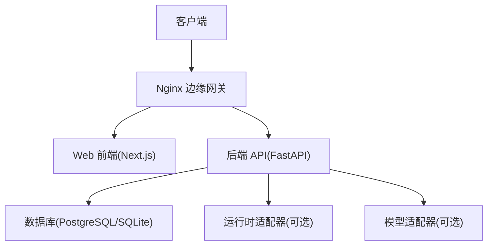
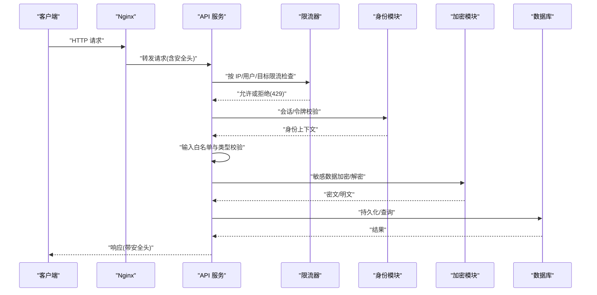
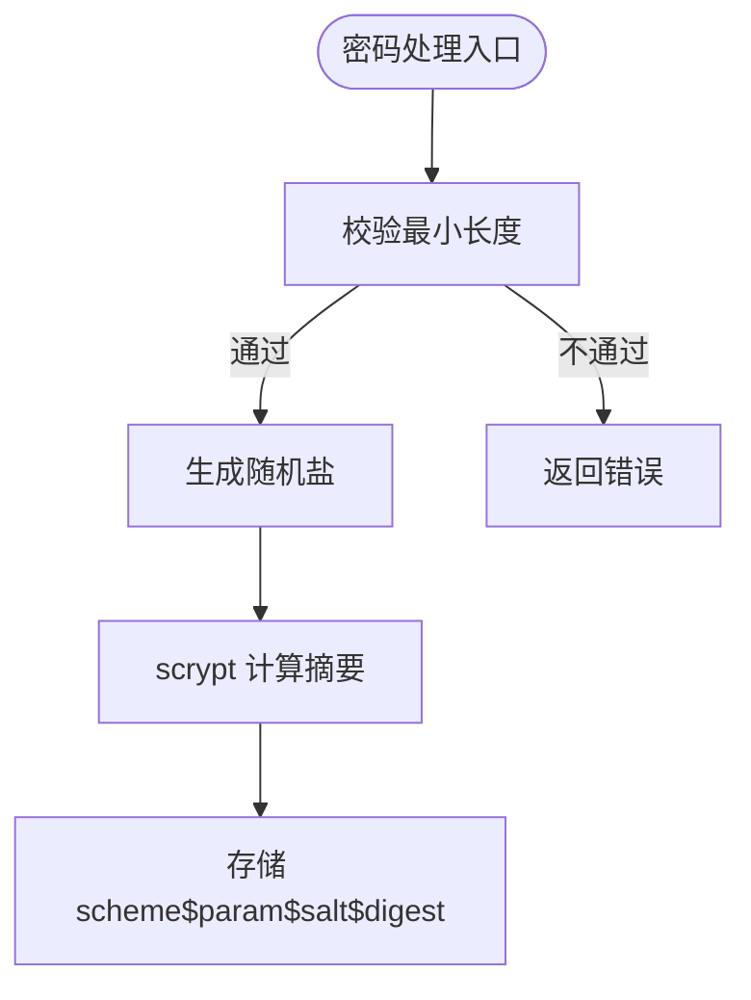
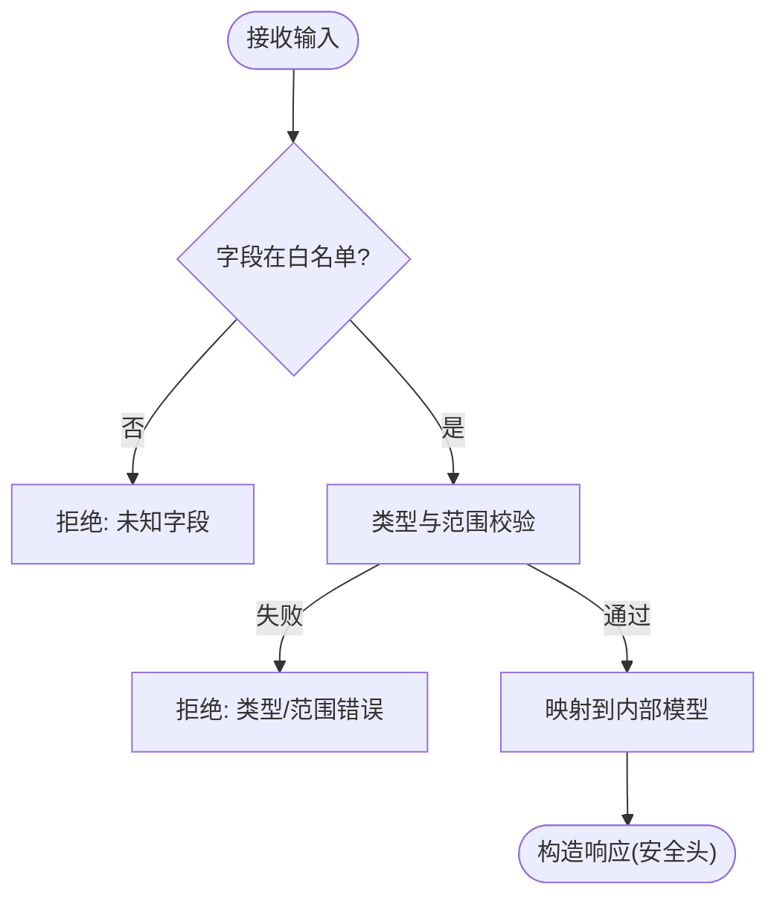
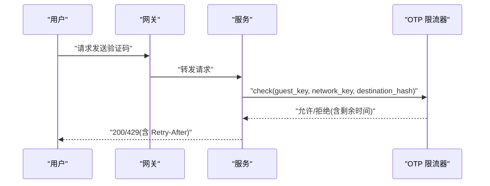
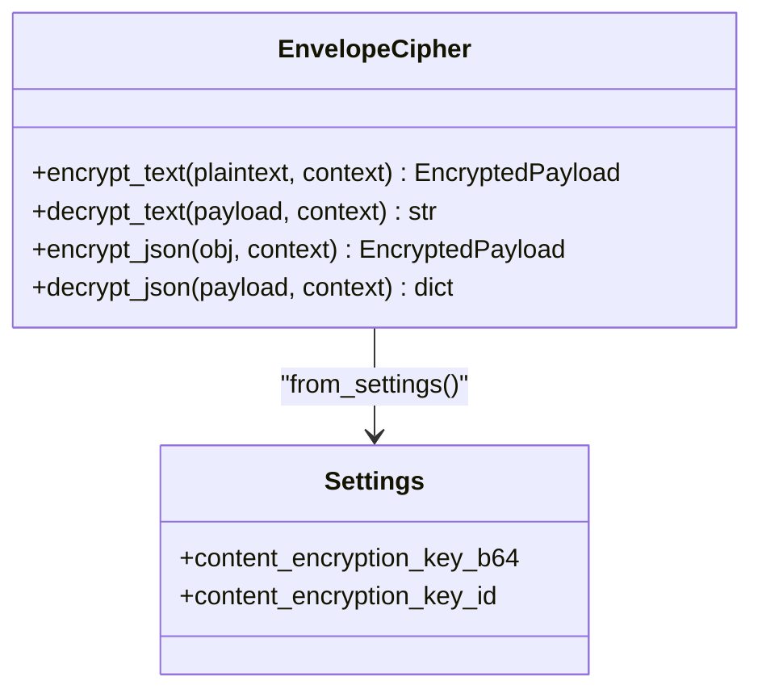
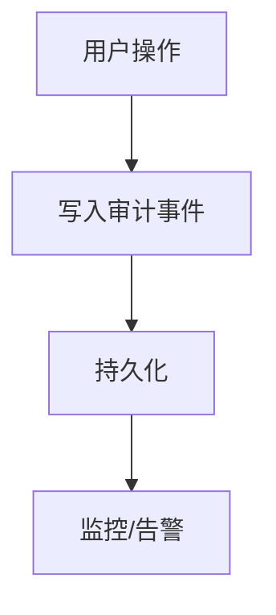
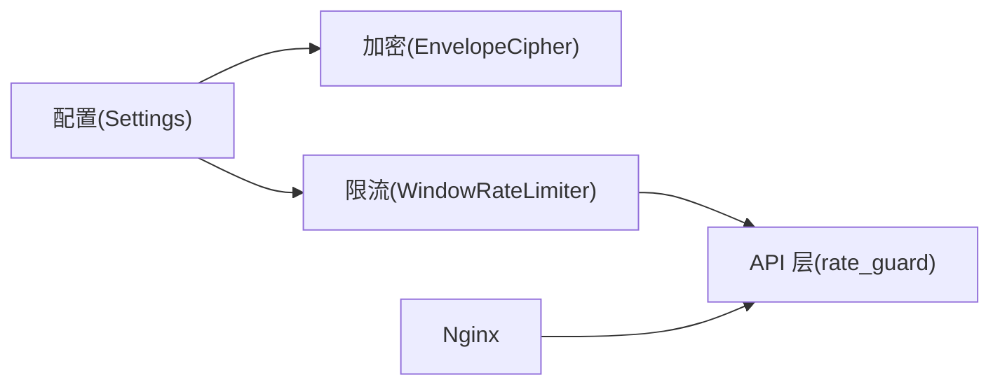

# 安全策略与防护

<cite>
**本文引用的文件**
- [backend/app/config.py](file://backend/app/config.py)
- [backend/app/admin/passwords.py](file://backend/app/admin/passwords.py)
- [backend/app/identity/security.py](file://backend/app/identity/security.py)
- [backend/app/security/envelope.py](file://backend/app/security/envelope.py)
- [backend/app/api/rate_guard.py](file://backend/app/api/rate_guard.py)
- [backend/app/readings/rate_limit.py](file://backend/app/readings/rate_limit.py)
- [backend/app/identity/otp.py](file://backend/app/identity/otp.py)
- [infra/nginx/app.conf](file://infra/nginx/app.conf)
- [backend/app/readings/service.py](file://backend/app/readings/service.py)
- [backend/tests/test_guest_sessions.py](file://backend/tests/test_guest_sessions.py)
- [backend/tests/test_auth.py](file://backend/tests/test_auth.py)
- [backend/tests/test_sensitive_payloads.py](file://backend/tests/test_sensitive_payloads.py)
- [backend/alembic/versions/0001_identity_foundation.py](file://backend/alembic/versions/0001_identity_foundation.py)
</cite>

## 目录
1. [简介](#简介)
2. [项目结构](#项目结构)
3. [核心组件](#核心组件)
4. [架构总览](#架构总览)
5. [详细组件分析](#详细组件分析)
6. [依赖关系分析](#依赖关系分析)
7. [性能考量](#性能考量)
8. [故障排查指南](#故障排查指南)
9. [结论](#结论)
10. [附录：检查清单与渗透测试指南](#附录检查清单与渗透测试指南)

## 简介
本文件聚焦于后端服务的安全策略与防护实践，覆盖密码安全、输入验证与输出编码、网络安全配置、速率限制与防滥用、敏感数据处理、审计与监控，以及安全配置检查清单和渗透测试指南。内容基于仓库中实际实现进行归纳与可视化说明，帮助读者快速理解并落地相关安全措施。

## 项目结构
本项目采用前后端分离与模块化后端组织方式：
- 前端（Next.js）通过 Nginx 反向代理访问后端 API。
- 后端使用 FastAPI 应用，集中管理配置、身份认证、限流、加密与审计等能力。
- 基础设施层通过 Nginx 提供安全头、健康检查与请求转发。

图表来源
- [infra/nginx/app.conf:1-45](file://infra/nginx/app.conf#L1-L45)
- [backend/app/main.py](file://backend/app/main.py)

章节来源
- [infra/nginx/app.conf:1-45](file://infra/nginx/app.conf#L1-L45)
- [backend/app/config.py:62-149](file://backend/app/config.py#L62-L149)

## 核心组件
- 配置与安全基线：统一的环境变量加载与生产环境强制校验，确保 Cookie 安全、禁用模拟 OTP、强制注入密钥、锁定运行时路径与模型参数等。
- 密码与令牌：管理员密码使用 scrypt 加盐哈希；令牌生成与存储采用不可逆哈希与随机令牌。
- 数据机密性：对持久化敏感载荷使用 AES-256-GCM 信封加密，结合域隔离上下文与指纹校验。
- 速率限制与防滥用：多粒度窗口限流（IP、用户、目标地址），配合重试提示与失败回滚。
- 输入验证与输出编码：严格的白名单字段校验、类型与范围约束，避免注入与越权。
- 网络安全：Nginx 设置安全响应头、缓存控制与可信代理转发。
- 审计与监控：审计事件表用于记录关键操作；运行期审计脚本保障产物完整性。

章节来源
- [backend/app/config.py:188-329](file://backend/app/config.py#L188-L329)
- [backend/app/admin/passwords.py:16-54](file://backend/app/admin/passwords.py#L16-L54)
- [backend/app/identity/security.py:5-10](file://backend/app/identity/security.py#L5-L10)
- [backend/app/security/envelope.py:32-122](file://backend/app/security/envelope.py#L32-L122)
- [backend/app/readings/rate_limit.py:9-61](file://backend/app/readings/rate_limit.py#L9-L61)
- [backend/app/api/rate_guard.py:5-19](file://backend/app/api/rate_guard.py#L5-L19)
- [backend/app/identity/otp.py:157-180](file://backend/app/identity/otp.py#L157-L180)
- [infra/nginx/app.conf:1-45](file://infra/nginx/app.conf#L1-L45)
- [backend/app/readings/service.py:706-773](file://backend/app/readings/service.py#L706-L773)
- [backend/alembic/versions/0001_identity_foundation.py:104-135](file://backend/alembic/versions/0001_identity_foundation.py#L104-L135)

## 架构总览
下图展示从请求进入 Nginx 到后端处理、限流、鉴权、输入校验、加密存储与审计的完整链路。

图表来源
- [infra/nginx/app.conf:1-45](file://infra/nginx/app.conf#L1-L45)
- [backend/app/api/rate_guard.py:5-19](file://backend/app/api/rate_guard.py#L5-L19)
- [backend/app/readings/rate_limit.py:23-49](file://backend/app/readings/rate_limit.py#L23-L49)
- [backend/app/identity/security.py:5-10](file://backend/app/identity/security.py#L5-L10)
- [backend/app/security/envelope.py:56-96](file://backend/app/security/envelope.py#L56-L96)
- [backend/app/readings/service.py:706-773](file://backend/app/readings/service.py#L706-L773)

## 详细组件分析

### 密码安全策略
- 算法选择与强度
  - 管理员密码使用 scrypt 加盐哈希，包含最小长度校验与常量时间比较，防止时序攻击。
  - 令牌生成使用安全的随机源，存储时仅保存不可逆哈希值。
- 盐值与参数
  - 盐由安全随机数生成，scrypt 参数固定为较高成本因子，抵御暴力破解。
- 密码强度规则
  - 最小长度要求，不满足则拒绝注册/修改。

图表来源
- [backend/app/admin/passwords.py:16-54](file://backend/app/admin/passwords.py#L16-L54)
- [backend/app/identity/security.py:5-10](file://backend/app/identity/security.py#L5-L10)

章节来源
- [backend/app/admin/passwords.py:16-54](file://backend/app/admin/passwords.py#L16-L54)
- [backend/app/identity/security.py:5-10](file://backend/app/identity/security.py#L5-L10)

### 输入验证与输出编码
- 输入验证
  - 严格白名单字段校验，未知字段直接拒绝。
  - 类型与范围校验（整数、文本、选项），越界即报错。
  - 对运行时输入字段进行策略匹配，禁止未批准的类型。
- 输出编码
  - 对外响应由框架与网关统一设置安全头，避免 XSS 与嗅探。
  - JSON 序列化使用确定性格式，便于签名与审计。

图表来源
- [backend/app/readings/service.py:706-773](file://backend/app/readings/service.py#L706-L773)
- [infra/nginx/app.conf:5-8](file://infra/nginx/app.conf#L5-L8)

章节来源
- [backend/app/readings/service.py:706-773](file://backend/app/readings/service.py#L706-L773)
- [infra/nginx/app.conf:5-8](file://infra/nginx/app.conf#L5-L8)

### 网络安全配置
- HTTPS 与头部
  - Nginx 设置 X-Content-Type-Options、X-Frame-Options、Referrer-Policy、Permissions-Policy。
  - API 响应附加 Cache-Control 私有且禁止缓存。
- 可信代理
  - 通过 X-Forwarded-* 传递真实客户端信息，支持可信 CIDR 列表识别真实 IP。
- HSTS
  - 建议在网关层启用 HSTS（当前配置未显式声明，可按需补充）。

图表来源
- [infra/nginx/app.conf:1-45](file://infra/nginx/app.conf#L1-L45)

章节来源
- [infra/nginx/app.conf:1-45](file://infra/nginx/app.conf#L1-L45)

### 速率限制与防滥用
- 多粒度限流
  - 进程内滑动窗口限流器，按 key（如用户、IP、目标地址）统计命中次数。
  - 超过阈值返回 429，并附带 Retry-After 秒数。
- OTP 发送限流
  - 三重窗口：网络级、访客级、目标地址级，失败可回滚计数，避免误扣。
- 可信代理 IP 解析
  - 根据 trusted_proxy_cidrs 从 X-Forwarded-For 提取真实客户端 IP。

图表来源
- [backend/app/readings/rate_limit.py:23-49](file://backend/app/readings/rate_limit.py#L23-L49)
- [backend/app/api/rate_guard.py:5-19](file://backend/app/api/rate_guard.py#L5-L19)
- [backend/app/identity/otp.py:157-180](file://backend/app/identity/otp.py#L157-L180)
- [backend/tests/test_guest_sessions.py:106-143](file://backend/tests/test_guest_sessions.py#L106-L143)
- [backend/tests/test_auth.py:524-539](file://backend/tests/test_auth.py#L524-L539)

章节来源
- [backend/app/readings/rate_limit.py:9-61](file://backend/app/readings/rate_limit.py#L9-L61)
- [backend/app/api/rate_guard.py:5-19](file://backend/app/api/rate_guard.py#L5-L19)
- [backend/app/identity/otp.py:157-180](file://backend/app/identity/otp.py#L157-L180)
- [backend/tests/test_guest_sessions.py:106-143](file://backend/tests/test_guest_sessions.py#L106-L143)
- [backend/tests/test_auth.py:524-539](file://backend/tests/test_auth.py#L524-L539)

### 敏感数据处理
- 环境变量与密钥管理
  - 所有密钥通过环境变量注入，生产环境强制校验，禁止本地默认密钥。
  - 深度过滤日志中的敏感键（如 DeepSeek API Key），避免泄露。
- 数据脱敏
  - 测试与证据脚本对邮箱等敏感信息进行掩码处理。
- 加密存储
  - 使用 AES-256-GCM 信封加密，结合域隔离上下文与 HMAC 指纹，确保机密性与完整性。
  - 密钥轮换通过 key_id 标识，支持未来扩展。

图表来源
- [backend/app/security/envelope.py:32-122](file://backend/app/security/envelope.py#L32-L122)
- [backend/app/config.py:188-236](file://backend/app/config.py#L188-L236)

章节来源
- [backend/app/config.py:188-236](file://backend/app/config.py#L188-L236)
- [backend/tests/test_sensitive_payloads.py:36-53](file://backend/tests/test_sensitive_payloads.py#L36-L53)
- [scripts/server_task13_trajectory_payload.py:81-125](file://scripts/server_task13_trajectory_payload.py#L81-L125)

### 安全审计与监控
- 审计事件
  - 数据库表 audit_events 记录用户行为、动作与元数据，便于事后追溯。
- 运行期审计
  - 审计脚本校验提供者就绪状态、回放一致性与夹具匹配，确保产物可信。
- 告警与观测
  - 配置项 alert_sink_enabled 控制告警通道；生产环境要求开启以支撑真实流量。

图表来源
- [backend/alembic/versions/0001_identity_foundation.py:104-135](file://backend/alembic/versions/0001_identity_foundation.py#L104-L135)
- [infra/mingli-runtime/audit_runtime.py:145-175](file://infra/mingli-runtime/audit_runtime.py#L145-L175)
- [backend/app/config.py:147-149](file://backend/app/config.py#L147-L149)

章节来源
- [backend/alembic/versions/0001_identity_foundation.py:104-135](file://backend/alembic/versions/0001_identity_foundation.py#L104-L135)
- [infra/mingli-runtime/audit_runtime.py:145-175](file://infra/mingli-runtime/audit_runtime.py#L145-L175)
- [backend/app/config.py:147-149](file://backend/app/config.py#L147-L149)

## 依赖关系分析
- 配置驱动安全基线：Settings 在启动时执行严格的生产安全检查，影响后续所有安全组件的行为。
- 限流器被 API 层复用：rate_guard 将限流异常转换为标准问题对象，统一返回 429。
- 加密模块依赖配置提供的密钥与 key_id，确保上下文隔离与指纹校验。
- Nginx 作为入口，为所有响应附加安全头，保护前端与 API。

图表来源
- [backend/app/config.py:188-329](file://backend/app/config.py#L188-L329)
- [backend/app/security/envelope.py:48-54](file://backend/app/security/envelope.py#L48-L54)
- [backend/app/readings/rate_limit.py:9-61](file://backend/app/readings/rate_limit.py#L9-L61)
- [backend/app/api/rate_guard.py:5-19](file://backend/app/api/rate_guard.py#L5-L19)
- [infra/nginx/app.conf:1-45](file://infra/nginx/app.conf#L1-L45)

章节来源
- [backend/app/config.py:188-329](file://backend/app/config.py#L188-L329)
- [backend/app/security/envelope.py:48-54](file://backend/app/security/envelope.py#L48-L54)
- [backend/app/readings/rate_limit.py:9-61](file://backend/app/readings/rate_limit.py#L9-L61)
- [backend/app/api/rate_guard.py:5-19](file://backend/app/api/rate_guard.py#L5-L19)
- [infra/nginx/app.conf:1-45](file://infra/nginx/app.conf#L1-L45)

## 性能考量
- 限流器使用内存队列与滑动窗口，时间复杂度近似 O(1) 追加与清理，适合高并发短窗口场景。
- scrypt 参数较高，增加 CPU 开销但提升抗暴力破解能力；建议在生产环境中合理调优。
- 加密使用 AES-GCM，具备高效认证加密性能；注意 nonce 唯一性与上下文隔离。
- Nginx 安全头与缓存控制几乎无性能损耗，但应避免过度日志与调试开关。

[本节为通用指导，无需具体文件引用]

## 故障排查指南
- 429 限流错误
  - 检查 WindowRateLimiter 的 key 与窗口配置，确认是否触发上限。
  - 查看 Retry-After 头部，等待后重试。
- OTP 发送失败
  - 检查三重窗口（网络、访客、目标）是否达到限制；失败会回滚计数，避免误扣。
  - 确认 SMTP 配置齐全且可用。
- 加密失败
  - 检查 key_id 是否匹配、上下文是否正确、nonce/ciphertext 是否损坏。
  - 若指纹不匹配，可能数据被篡改或上下文不一致。
- 生产环境启动失败
  - 检查 cookie_secure、OTP 适配器、运行时路径、模型参数是否符合强制规则。

章节来源
- [backend/app/readings/rate_limit.py:23-49](file://backend/app/readings/rate_limit.py#L23-L49)
- [backend/app/identity/otp.py:157-180](file://backend/app/identity/otp.py#L157-L180)
- [backend/app/security/envelope.py:75-96](file://backend/app/security/envelope.py#L75-L96)
- [backend/app/config.py:188-329](file://backend/app/config.py#L188-L329)

## 结论
本项目在密码安全、输入验证、网络安全、限流防滥用、敏感数据加密与审计方面形成了闭环策略。通过配置驱动的强约束、多粒度限流与审计追踪，有效降低了常见攻击面。建议在生产环境中持续完善 HSTS、告警与监控集成，并定期开展渗透测试与合规审查。

[本节为总结，无需具体文件引用]

## 附录：检查清单与渗透测试指南

### 安全配置检查清单
- 密码与令牌
  - 管理员密码使用 scrypt 加盐哈希，最小长度校验生效。
  - 令牌生成使用安全随机源，存储为不可逆哈希。
- 输入与输出
  - 输入字段白名单与类型/范围校验已启用。
  - 响应头包含 X-Content-Type-Options、X-Frame-Options、Referrer-Policy、Permissions-Policy。
- 网络安全
  - Nginx 设置安全头与缓存控制；如需 HSTS，请在网关层启用。
  - 可信代理 CIDR 正确配置，真实 IP 解析无误。
- 限流与防滥用
  - 进程内限流器与 OTP 三重窗口限流已启用。
  - 429 响应携带 Retry-After。
- 敏感数据
  - 生产环境强制注入密钥，禁止本地默认值。
  - 敏感载荷使用 AES-GCM 信封加密，key_id 与上下文隔离。
- 审计与监控
  - 审计事件表存在并可写入。
  - 告警通道在生产环境启用。

章节来源
- [backend/app/admin/passwords.py:16-54](file://backend/app/admin/passwords.py#L16-L54)
- [backend/app/identity/security.py:5-10](file://backend/app/identity/security.py#L5-L10)
- [backend/app/readings/service.py:706-773](file://backend/app/readings/service.py#L706-L773)
- [infra/nginx/app.conf:5-8](file://infra/nginx/app.conf#L5-L8)
- [backend/app/readings/rate_limit.py:23-49](file://backend/app/readings/rate_limit.py#L23-L49)
- [backend/app/identity/otp.py:157-180](file://backend/app/identity/otp.py#L157-L180)
- [backend/app/security/envelope.py:56-96](file://backend/app/security/envelope.py#L56-L96)
- [backend/alembic/versions/0001_identity_foundation.py:104-135](file://backend/alembic/versions/0001_identity_foundation.py#L104-L135)
- [backend/app/config.py:188-329](file://backend/app/config.py#L188-L329)

### 渗透测试指南
- 输入验证
  - 尝试注入未知字段、非法类型与越界数值，预期返回 400。
- 限流与滥用
  - 高频请求应触发 429，并观察 Retry-After。
  - 不同 IP/目标地址应有独立窗口，避免相互影响。
- 身份与会话
  - 伪造令牌或过期会话应被拒绝。
  - 可信代理下，真实 IP 解析应符合预期。
- 敏感数据
  - 尝试解密错误上下文或篡改密文，应抛出解密错误。
  - 日志与响应不应泄露密钥或敏感字段。
- 网络安全
  - 检查响应头是否包含必要的安全头。
  - 验证缓存控制是否阻止敏感数据缓存。

章节来源
- [backend/tests/test_readings_api.py:849-898](file://backend/tests/test_readings_api.py#L849-L898)
- [backend/tests/test_guest_sessions.py:106-143](file://backend/tests/test_guest_sessions.py#L106-L143)
- [backend/tests/test_auth.py:524-539](file://backend/tests/test_auth.py#L524-L539)
- [backend/tests/test_sensitive_payloads.py:36-53](file://backend/tests/test_sensitive_payloads.py#L36-L53)
- [infra/nginx/app.conf:5-8](file://infra/nginx/app.conf#L5-L8)