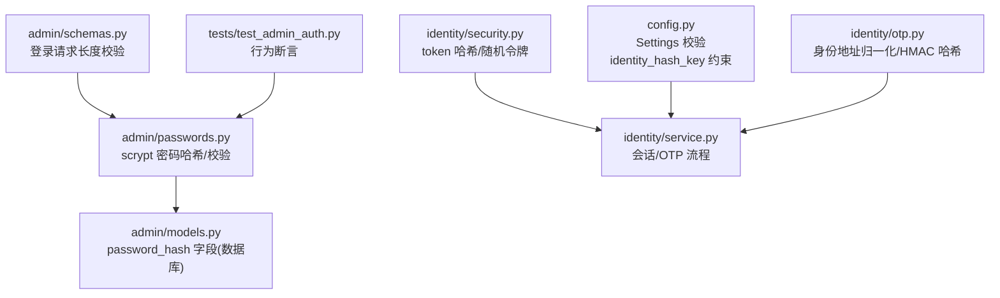
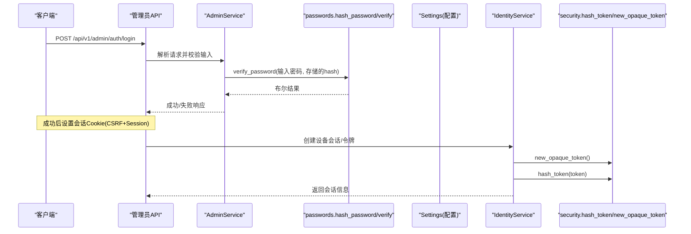
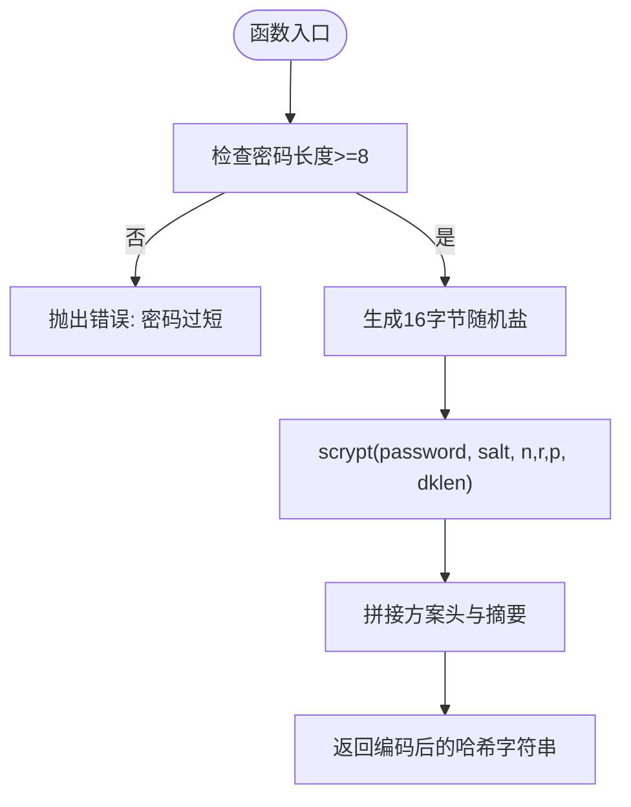
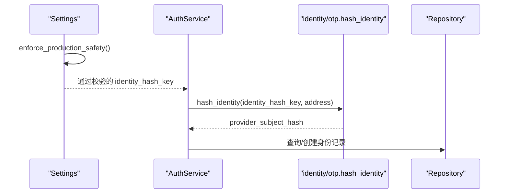
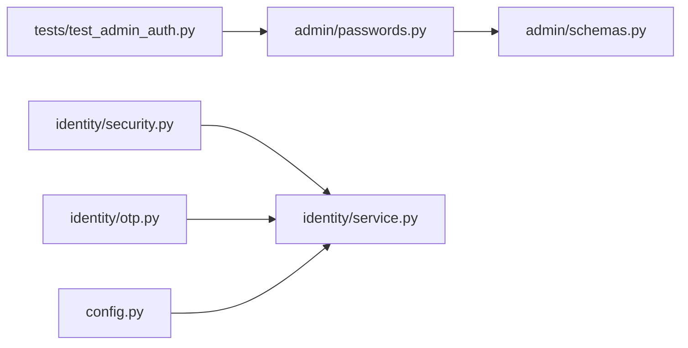

# 密码安全策略

<cite>
**本文引用的文件**
- [backend/app/admin/passwords.py](file://backend/app/admin/passwords.py)
- [backend/app/identity/security.py](file://backend/app/identity/security.py)
- [backend/app/config.py](file://backend/app/config.py)
- [backend/app/identity/service.py](file://backend/app/identity/service.py)
- [backend/app/identity/otp.py](file://backend/app/identity/otp.py)
- [backend/app/admin/schemas.py](file://backend/app/admin/schemas.py)
- [backend/tests/test_admin_auth.py](file://backend/tests/test_admin_auth.py)
</cite>

## 目录
1. [简介](#简介)
2. [项目结构](#项目结构)
3. [核心组件](#核心组件)
4. [架构总览](#架构总览)
5. [详细组件分析](#详细组件分析)
6. [依赖关系分析](#依赖关系分析)
7. [性能与安全考量](#性能与安全考量)
8. [故障排查指南](#故障排查指南)
9. [结论](#结论)
10. [附录：配置检查清单与最佳实践](#附录：配置检查清单与最佳实践)

## 简介
本文件聚焦于系统内的密码安全策略，覆盖以下主题：
- 密码哈希算法的选择与实现（当前使用 scrypt；对比 bcrypt 与 argon2）
- 盐值生成机制与密码强度验证规则
- 身份认证密钥管理（identity_hash_key 的配置、校验与使用场景）
- 密码存储最佳实践（参数调优、暴力破解防护、轮换策略）
- 生产环境安全要求（禁止本地默认密钥、强制安全随机数等）
- 配置检查清单与常见漏洞防护措施
- 正确实现密码验证与更新的流程示例（以代码路径引用代替具体代码内容）

## 项目结构
与密码安全相关的后端模块主要位于 backend/app 下：
- 管理员密码哈希与校验：admin/passwords.py
- 令牌与标识哈希工具：identity/security.py
- 运行时配置与安全约束：config.py
- 身份服务与 OTP 流程：identity/service.py、identity/otp.py
- 管理员 API 输入校验：admin/schemas.py
- 相关测试用例：tests/test_admin_auth.py

**图表来源**
- [backend/app/admin/passwords.py:16-31](file://backend/app/admin/passwords.py#L16-L31)
- [backend/app/identity/security.py:5-10](file://backend/app/identity/security.py#LL5-L10)
- [backend/app/config.py:123-126](file://backend/app/config.py#L123-L126)
- [backend/app/identity/service.py:78-98](file://backend/app/identity/service.py#L78-L98)
- [backend/app/identity/otp.py:211-218](file://backend/app/identity/otp.py#L211-L218)
- [backend/app/admin/schemas.py:14-18](file://backend/app/admin/schemas.py#L14-L18)
- [backend/tests/test_admin_auth.py:44-61](file://backend/tests/test_admin_auth.py#L44-L61)

**章节来源**
- [backend/app/admin/passwords.py:16-54](file://backend/app/admin/passwords.py#L16-L54)
- [backend/app/identity/security.py:5-10](file://backend/app/identity/security.py#L5-L10)
- [backend/app/config.py:123-126](file://backend/app/config.py#L123-L126)
- [backend/app/identity/service.py:78-98](file://backend/app/identity/service.py#L78-L98)
- [backend/app/identity/otp.py:211-218](file://backend/app/identity/otp.py#L211-L218)
- [backend/app/admin/schemas.py:14-18](file://backend/app/admin/schemas.py#L14-L18)
- [backend/tests/test_admin_auth.py:44-61](file://backend/tests/test_admin_auth.py#L44-L61)

## 核心组件
- 管理员密码哈希与校验：基于标准库 hashlib.scrypt，固定参数 n/r/p/dklen，随机盐，HMAC 比较防时序攻击。
- 令牌与标识哈希：使用 secrets 生成不可预测令牌；对 token 进行 SHA-256 哈希后存储。
- 配置与安全约束：Settings 在初始化时执行严格的生产环境安全检查，包括 identity_hash_key 的注入与复用限制。
- 身份服务：通过 identity_hash_key 对身份地址进行 HMAC-SHA256 哈希，用于跨渠道去重与隐私保护。
- 输入校验：管理员登录请求对密码长度进行最小/最大限制。

**章节来源**
- [backend/app/admin/passwords.py:16-54](file://backend/app/admin/passwords.py#L16-L54)
- [backend/app/identity/security.py:5-10](file://backend/app/identity/security.py#L5-L10)
- [backend/app/config.py:188-236](file://backend/app/config.py#L188-L236)
- [backend/app/identity/service.py:100-115](file://backend/app/identity/service.py#L100-L115)
- [backend/app/admin/schemas.py:14-18](file://backend/app/admin/schemas.py#L14-L18)

## 架构总览
下图展示了密码与身份相关的关键调用链：管理员登录、密码哈希、身份哈希与令牌处理。

**图表来源**
- [backend/app/admin/passwords.py:34-54](file://backend/app/admin/passwords.py#L34-L54)
- [backend/app/identity/security.py:5-10](file://backend/app/identity/security.py#L5-L10)
- [backend/app/identity/service.py:153-191](file://backend/app/identity/service.py#L153-L191)
- [backend/tests/test_admin_auth.py:7-18](file://backend/tests/test_admin_auth.py#L7-L18)

## 详细组件分析

### 管理员密码哈希与校验（scrypt）
- 算法选择：采用标准库 hashlib.scrypt，具备内存硬特性，适合抵御 GPU/ASIC 暴力破解。
- 参数说明：n=2^14、r=8、p=1、dklen=64，提供合理的计算成本与内存占用平衡。
- 盐值生成：使用 secrets.token_bytes(16) 生成加密安全的随机盐。
- 编码格式：自定义方案头 scrypt$N$R$P$salt_hex$digest_hex，便于扩展与迁移。
- 验证过程：解析方案头，按原参数重新计算哈希，使用 hmac.compare_digest 进行恒定时间比较，避免时序侧信道。

**图表来源**
- [backend/app/admin/passwords.py:16-31](file://backend/app/admin/passwords.py#L16-L31)

**章节来源**
- [backend/app/admin/passwords.py:16-54](file://backend/app/admin/passwords.py#L16-L54)

### 令牌与标识哈希（identity/security.py）
- 不可预测令牌：new_opaque_token 使用 secrets.token_urlsafe(32)，适用于会话、CSRF 等场景。
- 令牌哈希：hash_token 对明文 token 进行 SHA-256 哈希后存储，避免明文泄露风险。

**章节来源**
- [backend/app/identity/security.py:5-10](file://backend/app/identity/security.py#L5-L10)

### 身份哈希 key（identity_hash_key）
- 用途：对身份地址进行 HMAC-SHA256 哈希，形成 provider_subject_hash，用于跨渠道去重与隐私保护。
- 配置与校验：
  - 默认值为本地开发用键，生产环境必须注入真实密钥。
  - 生产环境禁止使用以 local-only- 开头的键。
  - 内容加密密钥不得与 identity_hash_key 重复，防止密钥复用导致的安全风险。
- 使用位置：身份服务在请求 OTP 时对地址进行哈希，作为唯一标识参与挑战与限流。

**图表来源**
- [backend/app/config.py:188-236](file://backend/app/config.py#L188-L236)
- [backend/app/identity/service.py:100-115](file://backend/app/identity/service.py#L100-L115)
- [backend/app/identity/otp.py:211-218](file://backend/app/identity/otp.py#L211-L218)

**章节来源**
- [backend/app/config.py:123-126](file://backend/app/config.py#L123-L126)
- [backend/app/config.py:188-236](file://backend/app/config.py#L188-L236)
- [backend/app/identity/service.py:100-115](file://backend/app/identity/service.py#L100-L115)
- [backend/app/identity/otp.py:211-218](file://backend/app/identity/otp.py#L211-L218)

### 密码强度验证规则
- 管理员登录请求：密码字段最小长度为 8，最大长度为 200。
- 哈希层额外校验：hash_password 内部再次检查密码长度小于 8 即拒绝。
- 建议：可结合业务需求增加复杂度规则（大小写、数字、特殊字符），但需确保不引入可被枚举的模式。

**章节来源**
- [backend/app/admin/schemas.py:14-18](file://backend/app/admin/schemas.py#L14-L18)
- [backend/app/admin/passwords.py:16-18](file://backend/app/admin/passwords.py#L16-L18)

### 身份认证密钥管理与使用场景
- identity_hash_key 用于：
  - 身份地址哈希（provider_subject_hash），用于跨渠道统一身份标识。
  - 作为 OTP 挑战码的 HMAC 密钥（与 challenge_id 组合）。
- 安全要求：
  - 生产环境必须注入非本地默认值。
  - 不得与内容加密密钥相同。
  - 建议使用高熵随机密钥，定期轮换并通过安全通道分发。

**章节来源**
- [backend/app/config.py:188-236](file://backend/app/config.py#L188-L236)
- [backend/app/identity/otp.py:211-218](file://backend/app/identity/otp.py#L211-L218)
- [backend/app/identity/service.py:100-115](file://backend/app/identity/service.py#L100-L115)

### 密码存储最佳实践
- 算法选择：当前使用 scrypt，具备抗并行破解能力；若未来升级，可评估 bcrypt 或 argon2id。
- 参数调优：根据服务器资源调整 n/r/p/dklen，使单次验证耗时在合理范围（例如数百毫秒级）。
- 盐值：每次哈希均使用独立的高熵随机盐，避免彩虹表攻击。
- 比对：使用恒定时间比较（hmac.compare_digest）防止时序攻击。
- 轮换：支持方案头中的参数版本化，便于平滑迁移到新参数或新算法。
- 备份与审计：记录哈希参数变更事件，保留旧哈希以便兼容验证。

[本节为通用指导，不直接分析具体文件]

### bcrypt 与 argon2 对比分析（概念性）
- bcrypt：成熟稳定，内置盐，参数 cost factor 可调；抗 GPU 能力较强，但在大内存攻击面前略逊于 argon2。
- argon2id：推荐用于新系统，同时优化对抗 GPU/ASIC 与侧信道攻击；可配置内存、迭代次数、并行度。
- 迁移建议：保持方案头版本化，逐步提升参数；双写期间同时支持新旧哈希，验证时优先匹配旧哈希再写入新哈希。

[本节为概念性内容，不直接分析具体文件]

## 依赖关系分析
- admin/passwords.py 仅依赖标准库（hashlib、secrets、hmac），无外部依赖，降低供应链风险。
- identity/security.py 同样仅依赖标准库，保证轻量与安全。
- config.py 使用 pydantic-settings 加载环境变量，并在 model_validator 中执行严格的生产环境约束。
- identity/service.py 依赖 identity/otp.py 的地址归一化与 HMAC 哈希，以及 security.py 的令牌工具。
- 测试覆盖管理员登录流程与生产配置约束。

**图表来源**
- [backend/app/admin/passwords.py:16-54](file://backend/app/admin/passwords.py#L16-L54)
- [backend/app/identity/security.py:5-10](file://backend/app/identity/security.py#L5-L10)
- [backend/app/identity/service.py:78-98](file://backend/app/identity/service.py#L78-L98)
- [backend/app/identity/otp.py:211-218](file://backend/app/identity/otp.py#L211-L218)
- [backend/app/config.py:188-236](file://backend/app/config.py#L188-L236)
- [backend/tests/test_admin_auth.py:44-61](file://backend/tests/test_admin_auth.py#L44-L61)

**章节来源**
- [backend/app/admin/passwords.py:16-54](file://backend/app/admin/passwords.py#L16-L54)
- [backend/app/identity/security.py:5-10](file://backend/app/identity/security.py#L5-L10)
- [backend/app/identity/service.py:78-98](file://backend/app/identity/service.py#L78-L98)
- [backend/app/identity/otp.py:211-218](file://backend/app/identity/otp.py#L211-L218)
- [backend/app/config.py:188-236](file://backend/app/config.py#L188-L236)
- [backend/tests/test_admin_auth.py:44-61](file://backend/tests/test_admin_auth.py#L44-L61)

## 性能与安全考量
- 性能：scrypt 的计算成本由 n/r/p 控制，需在生产环境压测确定合适参数，确保用户体验与安全性平衡。
- 安全：
  - 所有随机数来自 secrets，满足密码学安全要求。
  - 使用 hmac.compare_digest 避免时序攻击。
  - 生产环境强制注入密钥，禁止本地默认值与密钥复用。
  - 输入校验与速率限制（OTP）共同缓解暴力破解与滥用。

[本节为通用指导，不直接分析具体文件]

## 故障排查指南
- 管理员登录失败：
  - 检查密码长度是否满足最小要求。
  - 确认存储的哈希方案头与参数一致。
  - 查看响应中是否包含敏感信息（测试断言确保不包含 password_hash）。
- 生产环境启动失败：
  - 检查 identity_hash_key 是否为本地默认值或被禁用。
  - 检查内容加密密钥是否与 identity_hash_key 重复。
  - 确认 SMTP、Runtime、Model 等适配器配置符合生产约束。

**章节来源**
- [backend/tests/test_admin_auth.py:44-61](file://backend/tests/test_admin_auth.py#L44-L61)
- [backend/app/config.py:188-236](file://backend/app/config.py#L188-L236)

## 结论
本系统在后端实现了严格的密码安全策略：
- 管理员密码使用 scrypt 进行哈希，具备抗暴力破解能力。
- 身份哈希 key 在生产环境强制注入且禁止复用，保障身份标识的隐私与一致性。
- 配置层在生产环境执行多项安全约束，防止误配导致的脆弱性。
- 通过速率限制、CSRF、会话管理等机制，进一步降低攻击面。
建议持续评估算法参数与演进路线（如迁移到 argon2id），并保持配置与密钥管理的自动化审计。

[本节为总结性内容，不直接分析具体文件]

## 附录：配置检查清单与最佳实践

### 配置检查清单
- 生产环境
  - cookie_secure 必须启用。
  - identity_hash_key 必须为非本地默认值且未被禁用。
  - content_encryption_key_b64 必须为有效 base64 且长度正确，且不得与 identity_hash_key 相同。
  - 禁止使用 admin_bootstrap_email/password。
  - 禁止使用 fake OTP/Runtime/Model 适配器。
  - 模型相关超时、温度、输出 token 等参数必须在允许范围内。
- 密钥管理
  - 使用高熵随机密钥，定期轮换。
  - 通过安全通道分发，避免日志与错误消息泄露。
  - 记录密钥轮换事件，保留旧密钥用于过渡期兼容。

**章节来源**
- [backend/app/config.py:188-236](file://backend/app/config.py#L188-L236)

### 密码存储与验证流程（示例路径）
- 密码哈希与校验
  - 哈希：参考 [backend/app/admin/passwords.py:16-31](file://backend/app/admin/passwords.py#L16-L31)
  - 校验：参考 [backend/app/admin/passwords.py:34-54](file://backend/app/admin/passwords.py#L34-L54)
- 管理员登录与响应
  - 登录请求校验：参考 [backend/app/admin/schemas.py:14-18](file://backend/app/admin/schemas.py#L14-L18)
  - 行为断言（不含敏感信息）：参考 [backend/tests/test_admin_auth.py:44-61](file://backend/tests/test_admin_auth.py#L44-L61)
- 身份哈希与令牌
  - 身份地址哈希：参考 [backend/app/identity/otp.py:211-218](file://backend/app/identity/otp.py#L211-L218)
  - 令牌哈希与生成：参考 [backend/app/identity/security.py:5-10](file://backend/app/identity/security.py#L5-L10)
  - 会话创建流程：参考 [backend/app/identity/service.py:153-191](file://backend/app/identity/service.py#L153-L191)

[本节提供路径引用，未展示具体代码内容]