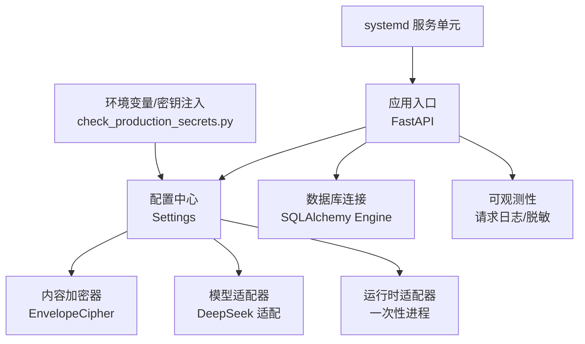
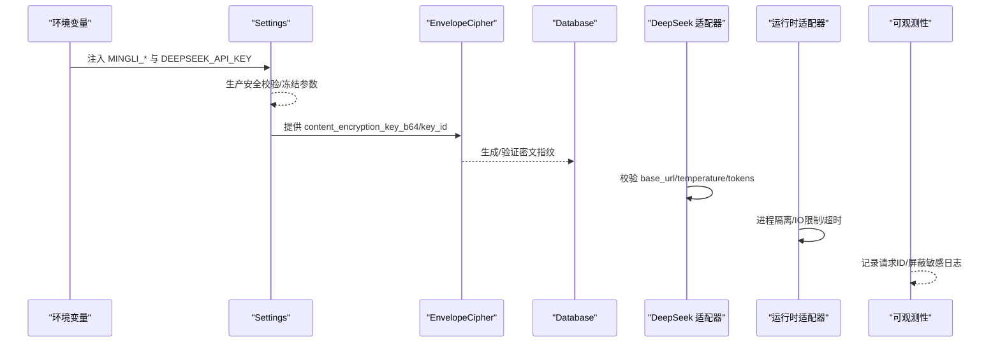
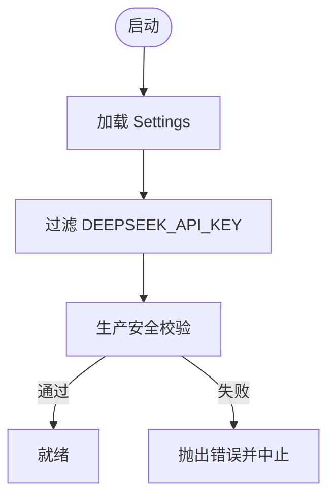
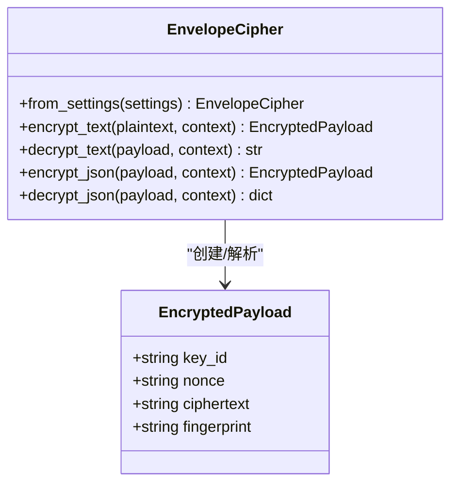
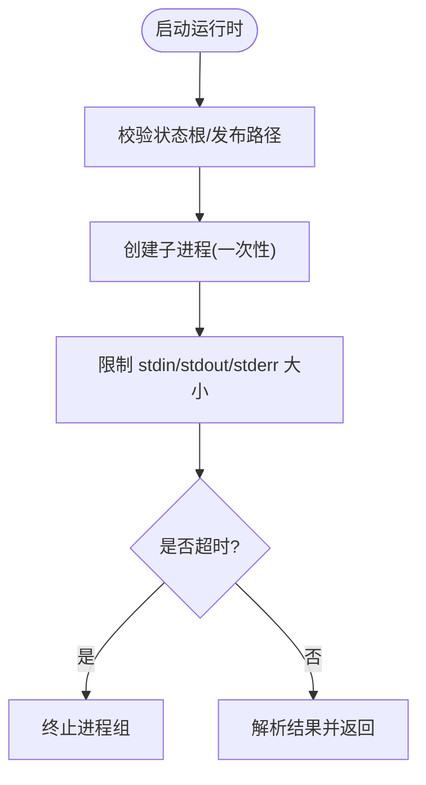
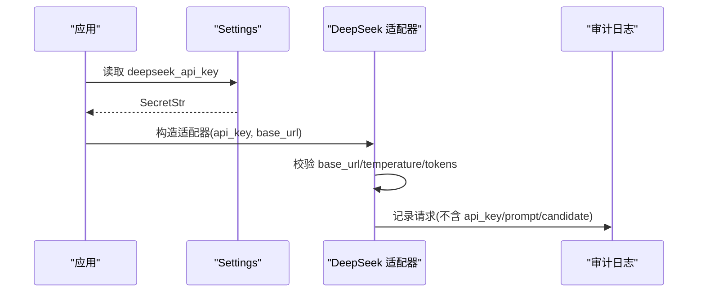
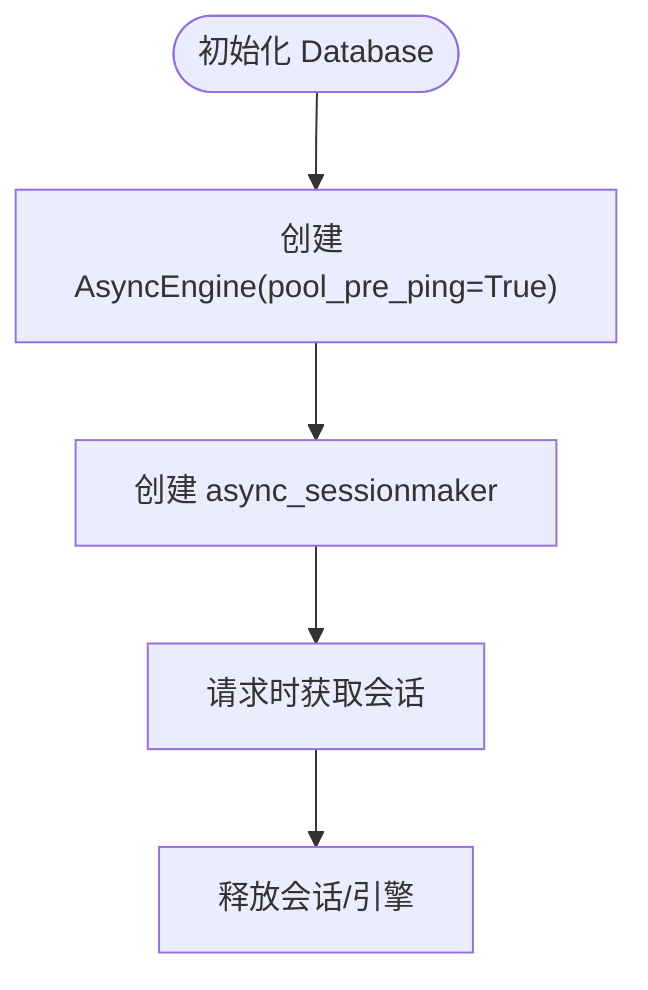
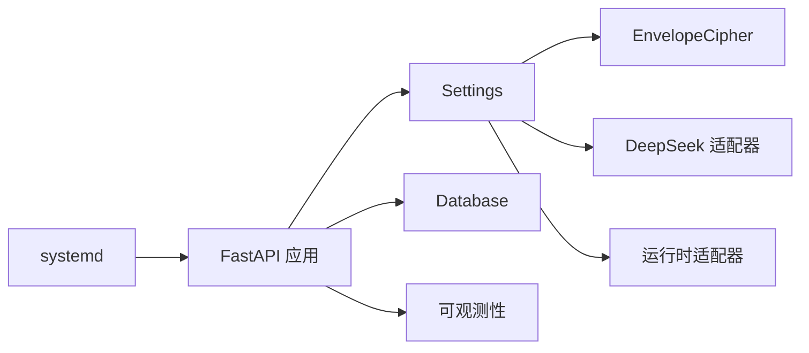

# 敏感数据处理

<cite>
**本文引用的文件**
- [backend/app/config.py](file://backend/app/config.py)
- [backend/app/security/envelope.py](file://backend/app/security/envelope.py)
- [backend/app/adapters/model.py](file://backend/app/adapters/model.py)
- [backend/app/observability.py](file://backend/app/observability.py)
- [backend/app/database.py](file://backend/app/database.py)
- [backend/app/adapters/runtime.py](file://backend/app/adapters/runtime.py)
- [infra/systemd/fateradar-test-api.service](file://infra/systemd/fateradar-test-api.service)
- [infra/systemd/fateradar-test-worker.service](file://infra/systemd/fateradar-test-worker.service)
- [infra/systemd/fateradar-test-web.service](file://infra/systemd/fateradar-test-web.service)
- [infra/fateradar-test.env.example](file://infra/fateradar-test.env.example)
- [scripts/check_production_secrets.py](file://scripts/check_production_secrets.py)
- [backend/tests/test_sensitive_payloads.py](file://backend/tests/test_sensitive_payloads.py)
- [backend/tests/test_standalone_model_adapter.py](file://backend/tests/test_standalone_model_adapter.py)
- [backend/tests/test_model_data_boundary.py](file://backend/tests/test_model_data_boundary.py)
</cite>

## 目录
1. [简介](#简介)
2. [项目结构](#项目结构)
3. [核心组件](#核心组件)
4. [架构总览](#架构总览)
5. [详细组件分析](#详细组件分析)
6. [依赖关系分析](#依赖关系分析)
7. [性能与安全考量](#性能与安全考量)
8. [故障排查指南](#故障排查指南)
9. [结论](#结论)
10. [附录：安全清单与最佳实践](#附录：安全清单与最佳实践)

## 简介
本文件聚焦于代码库中的敏感数据处理能力，覆盖以下主题：
- 环境变量管理与密钥注入：分层加载、隔离与校验。
- 内容加密机制：content_encryption_key 管理、算法选择与数据脱敏策略。
- 运行时环境的安全隔离：进程隔离、文件系统访问控制与内存安全。
- API 密钥安全处理：DeepSeek API Key 的注入与日志脱敏。
- 数据库连接安全配置：连接池、查询日志脱敏与备份数据安全。
- 生产环境安全要求：禁止默认密钥、强制使用安全的密钥存储方案。
- 完整流程与最佳实践示例：从配置到运行时的端到端安全路径。
- 安全审计日志与异常检测：可观测性与告警接入。

## 项目结构
后端以 FastAPI 应用为核心，通过 Settings 集中管理配置；安全相关能力集中在 security 包；外部模型调用通过 adapters 抽象；运行时通过独立的“一次性进程”执行，配合 systemd 进行系统级隔离；基础设施提供示例环境与启动脚本。

图表来源
- [backend/app/config.py:62-186](file://backend/app/config.py#L62-L186)
- [backend/app/security/envelope.py:32-73](file://backend/app/security/envelope.py#L32-L73)
- [backend/app/adapters/model.py:149-175](file://backend/app/adapters/model.py#L149-L175)
- [backend/app/adapters/runtime.py:605-707](file://backend/app/adapters/runtime.py#L605-L707)
- [backend/app/database.py:12-33](file://backend/app/database.py#L12-L33)
- [backend/app/observability.py:14-52](file://backend/app/observability.py#L14-L52)
- [infra/systemd/fateradar-test-api.service:19-52](file://infra/systemd/fateradar-test-api.service#L19-L52)
- [scripts/check_production_secrets.py:23-70](file://scripts/check_production_secrets.py#L23-L70)

章节来源
- [backend/app/config.py:62-186](file://backend/app/config.py#L62-L186)
- [infra/fateradar-test.env.example:13-45](file://infra/fateradar-test.env.example#L13-L45)

## 核心组件
- 配置与密钥注入（Settings）
  - 自定义设置源，将 DEEPSEEK_API_KEY 单独提取并严格限制读取位置，避免被 dotenv/file secrets 污染。
  - 生产模式强制校验：禁用 fake 适配器、固定运行时路径、冻结模型参数、强制注入身份哈希键与内容加密键。
- 内容加密（EnvelopeCipher）
  - 基于 AES-256-GCM 的认证加密，附带 HMAC 指纹校验，支持文本与 JSON 加解密。
  - key_id 绑定上下文，防止跨上下文重用密文。
- 模型适配器（DeepSeek）
  - 仅允许白名单 base_url，严格校验 API Key 非空，冻结温度与输出 token 上限，记录审计日志时排除敏感字段。
- 运行时适配器（一次性进程）
  - 独立进程执行，限制输入输出大小，超时后终止进程组，状态根目录权限校验。
- 数据库连接
  - 使用 SQLAlchemy AsyncEngine，启用连接探测，会话工厂关闭自动过期。
- 可观测性
  - 统一请求日志格式，屏蔽底层传输库的敏感日志，附加 X-Request-ID。

章节来源
- [backend/app/config.py:150-329](file://backend/app/config.py#L150-L329)
- [backend/app/security/envelope.py:32-122](file://backend/app/security/envelope.py#L32-L122)
- [backend/app/adapters/model.py:149-175](file://backend/app/adapters/model.py#L149-L175)
- [backend/app/adapters/runtime.py:605-707](file://backend/app/adapters/runtime.py#L605-L707)
- [backend/app/database.py:12-33](file://backend/app/database.py#L12-L33)
- [backend/app/observability.py:14-52](file://backend/app/observability.py#L14-L52)

## 架构总览
下图展示敏感数据在系统中的流转路径：配置层负责密钥注入与校验；加密层对持久化数据进行认证加密；模型层对外部 API 密钥进行最小暴露；运行时层通过进程隔离与资源限制降低风险；数据库层通过连接池与探测保障可用性；可观测性层确保日志不泄露敏感信息。

图表来源
- [backend/app/config.py:150-329](file://backend/app/config.py#L150-L329)
- [backend/app/security/envelope.py:48-73](file://backend/app/security/envelope.py#L48-L73)
- [backend/app/adapters/model.py:149-175](file://backend/app/adapters/model.py#L149-L175)
- [backend/app/adapters/runtime.py:605-707](file://backend/app/adapters/runtime.py#L605-L707)
- [backend/app/observability.py:27-52](file://backend/app/observability.py#L27-L52)

## 详细组件分析

### 环境变量管理与密钥注入
- 分层加载顺序
  - init_settings → 精确 DeepSeek 密钥源 → 过滤后的 env/dotenv/file secrets（剔除 DEEPSEEK_API_KEY）。
- 关键约束
  - production 下必须注入 identity_hash_key 与 content_encryption_key_b64/key_id，且不得复用 identity_hash_key。
  - 冻结 P0 模型参数（provider/profile/id/base_url/endpoint/thinking_mode），并限制超时与响应大小。
  - 运行时路径在 production 下固定为只读发布树与指定状态根。
- 部署前检查
  - check_production_secrets.py 校验必需环境变量存在、非本地占位值、base64 长度与合法性。

图表来源
- [backend/app/config.py:150-186](file://backend/app/config.py#L150-L186)
- [backend/app/config.py:188-329](file://backend/app/config.py#L188-L329)
- [scripts/check_production_secrets.py:23-70](file://scripts/check_production_secrets.py#L23-L70)

章节来源
- [backend/app/config.py:150-329](file://backend/app/config.py#L150-L329)
- [scripts/check_production_secrets.py:23-70](file://scripts/check_production_secrets.py#L23-L70)
- [infra/fateradar-test.env.example:13-45](file://infra/fateradar-test.env.example#L13-L45)

### 内容加密机制
- 算法与密钥
  - AES-256-GCM 认证加密，HMAC-SHA256 指纹校验，key_id 绑定上下文。
  - 密钥来自 content_encryption_key_b64（32 字节），key_id 用于多版本密钥轮换。
- 数据流
  - 加密：明文→AESGCM(nonce, aad=context)→密文+指纹。
  - 解密：校验 key_id→AESGCM 解密→计算指纹比对。
- 生产约束
  - 禁止使用本地默认密钥或 local-only 标识的 key_id。
  - 禁止与 identity_hash_key 复用。

图表来源
- [backend/app/security/envelope.py:32-122](file://backend/app/security/envelope.py#L32-L122)
- [backend/app/config.py:217-236](file://backend/app/config.py#L217-L236)

章节来源
- [backend/app/security/envelope.py:32-122](file://backend/app/security/envelope.py#L32-L122)
- [backend/app/config.py:217-236](file://backend/app/config.py#L217-L236)
- [backend/tests/test_sensitive_payloads.py:36-53](file://backend/tests/test_sensitive_payloads.py#L36-L53)

### 运行时环境的安全隔离
- 进程隔离
  - 一次性进程执行，独立会话，限制 PATH、HOME、LANG/LC_ALL，禁止写入字节码。
  - 输入输出大小限制，超时后终止进程组。
- 文件系统访问控制
  - 状态根目录必须存在且权限私有，禁止符号链接与越界路径。
  - 发布树只读，manifest 与文件模式严格校验。
- 内存与系统调用
  - systemd 启用 MemoryDenyWriteExecute（Python 栈无 JIT）、RestrictSUIDSGID、ProtectSystem=strict 等。
  - 网络限制为 AF_INET/AF_INET6/AF_UNIX，禁止特权容器与额外用户。

图表来源
- [backend/app/adapters/runtime.py:605-707](file://backend/app/adapters/runtime.py#L605-L707)
- [infra/systemd/fateradar-test-api.service:32-52](file://infra/systemd/fateradar-test-api.service#L32-L52)
- [infra/systemd/fateradar-test-worker.service:36-59](file://infra/systemd/fateradar-test-worker.service#L36-L59)
- [infra/systemd/fateradar-test-web.service:39-63](file://infra/systemd/fateradar-test-web.service#L39-L63)

章节来源
- [backend/app/adapters/runtime.py:605-707](file://backend/app/adapters/runtime.py#L605-L707)
- [infra/systemd/fateradar-test-api.service:32-52](file://infra/systemd/fateradar-test-api.service#L32-L52)
- [infra/systemd/fateradar-test-worker.service:36-59](file://infra/systemd/fateradar-test-worker.service#L36-L59)
- [infra/systemd/fateradar-test-web.service:39-63](file://infra/systemd/fateradar-test-web.service#L39-L63)

### API 密钥的安全处理（DeepSeek）
- 注入与校验
  - 仅从环境变量 DEEPSEEK_API_KEY 注入，其他来源显式剔除。
  - 适配器构造时校验非空与 base_url 白名单。
- 日志脱敏
  - 测试用例保证审计日志不包含 prompt、candidate、api_key 等敏感字段。
- 冻结参数
  - temperature 与 max_output_tokens 固定，防止偏离 P0 模型配置。

图表来源
- [backend/app/config.py:150-186](file://backend/app/config.py#L150-L186)
- [backend/app/adapters/model.py:149-175](file://backend/app/adapters/model.py#L149-L175)
- [backend/tests/test_standalone_model_adapter.py:870-902](file://backend/tests/test_standalone_model_adapter.py#L870-L902)

章节来源
- [backend/app/config.py:150-186](file://backend/app/config.py#L150-L186)
- [backend/app/adapters/model.py:149-175](file://backend/app/adapters/model.py#L149-L175)
- [backend/tests/test_standalone_model_adapter.py:870-902](file://backend/tests/test_standalone_model_adapter.py#L870-L902)

### 数据库连接的安全配置
- 连接池与会话
  - 使用 asyncpg 异步引擎，启用 pool_pre_ping 探测连接健康。
  - 会话工厂 expire_on_commit=False，减少不必要的刷新。
- 查询日志脱敏
  - 未直接实现 SQL 语句脱敏；建议结合上层中间件或驱动日志级别控制，避免打印敏感参数。
- 备份数据安全
  - 参考运行时与验证脚本中对快照/恢复的完整性校验与加密标记，确保备份不可篡改。

图表来源
- [backend/app/database.py:12-33](file://backend/app/database.py#L12-L33)

章节来源
- [backend/app/database.py:12-33](file://backend/app/database.py#L12-L33)

### 生产环境的安全要求
- 禁止默认密钥
  - identity_hash_key 与 content_encryption_key_b64 不得使用本地默认或 local-only 标识。
- 强制安全存储
  - 通过环境变量注入，部署前由 check_production_secrets.py 校验。
- 冻结与白名单
  - 模型 provider/profile/id/base_url/endpoint/thinking_mode 必须匹配冻结值。
  - 运行时路径固定，状态根必须存在且权限私有。

章节来源
- [backend/app/config.py:188-329](file://backend/app/config.py#L188-L329)
- [scripts/check_production_secrets.py:23-70](file://scripts/check_production_secrets.py#L23-L70)

### 完整流程与最佳实践示例
- 配置阶段
  - 设置 MINGLI_ENVIRONMENT=production，注入 MINGLI_IDENTITY_HASH_KEY、MINGLI_CONTENT_ENCRYPTION_KEY_B64/MINGLI_CONTENT_ENCRYPTION_KEY_ID。
  - 如需 DeepSeek，设置 DEEPSEEK_API_KEY，并确保 model_adapter=deepseek 且价格快照与货币合法。
- 加密阶段
  - 使用 EnvelopeCipher.from_settings 构建加密器，对所有敏感持久化负载进行 AES-GCM 加密并附带指纹。
- 运行时阶段
  - 使用 OneShotMingliRuntimeAdapter 执行一次性进程，限制 IO 与超时，状态根目录权限私有。
- 可观测性
  - 安装 request_observability 中间件，记录结构化日志，屏蔽 httpx/httpcore/h2/hpack 的敏感日志。

章节来源
- [backend/app/config.py:150-329](file://backend/app/config.py#L150-L329)
- [backend/app/security/envelope.py:48-73](file://backend/app/security/envelope.py#L48-L73)
- [backend/app/adapters/runtime.py:605-707](file://backend/app/adapters/runtime.py#L605-L707)
- [backend/app/observability.py:14-52](file://backend/app/observability.py#L14-L52)

## 依赖关系分析
- 配置依赖
  - Settings 依赖 pydantic-settings，自定义 _MappingSettingsSource 实现分层加载与过滤。
- 加密依赖
  - EnvelopeCipher 依赖 cryptography 的 AESGCM 与 hmac/sha256。
- 模型依赖
  - DeepSeek 适配器依赖 httpx 传输，严格白名单 base_url。
- 运行时依赖
  - 一次性进程通过 asyncio.subprocess 启动，限制 PATH 与 HOME。
- 数据库依赖
  - SQLAlchemy 异步引擎与 asyncpg。
- 系统依赖
  - systemd 服务单元提供系统级隔离与资源限制。

图表来源
- [backend/app/config.py:62-186](file://backend/app/config.py#L62-L186)
- [backend/app/security/envelope.py:32-73](file://backend/app/security/envelope.py#L32-L73)
- [backend/app/adapters/model.py:149-175](file://backend/app/adapters/model.py#L149-L175)
- [backend/app/adapters/runtime.py:605-707](file://backend/app/adapters/runtime.py#L605-L707)
- [backend/app/database.py:12-33](file://backend/app/database.py#L12-L33)
- [infra/systemd/fateradar-test-api.service:19-52](file://infra/systemd/fateradar-test-api.service#L19-L52)

章节来源
- [backend/app/config.py:62-186](file://backend/app/config.py#L62-L186)
- [backend/app/security/envelope.py:32-73](file://backend/app/security/envelope.py#L32-L73)
- [backend/app/adapters/model.py:149-175](file://backend/app/adapters/model.py#L149-L175)
- [backend/app/adapters/runtime.py:605-707](file://backend/app/adapters/runtime.py#L605-L707)
- [backend/app/database.py:12-33](file://backend/app/database.py#L12-L33)
- [infra/systemd/fateradar-test-api.service:19-52](file://infra/systemd/fateradar-test-api.service#L19-L52)

## 性能与安全考量
- 性能
  - 模型超时与响应大小限制避免长尾请求与内存压力。
  - 数据库连接池启用预检，减少无效连接开销。
  - 一次性进程限制 IO 大小，防止大负载拖垮主进程。
- 安全
  - 生产模式冻结模型参数与路径，禁止 fake 适配器。
  - 内容加密使用 AES-GCM 与 HMAC 指纹，防止篡改与跨上下文重用。
  - 日志屏蔽底层传输库的敏感信息，审计日志不包含 API Key、prompt 等。
  - systemd 强化系统调用、内存与文件系统访问。

[本节为通用指导，无需具体文件引用]

## 故障排查指南
- 配置错误
  - 若生产环境缺少必要密钥或使用了本地默认值，Settings 会抛出验证错误；使用 check_production_secrets.py 提前发现。
- 加密失败
  - 解密时报 EnvelopeDecryptionError 通常表示 key_id 不匹配、密文损坏或上下文不一致。
- 模型调用失败
  - base_url 不在白名单或 API Key 为空会导致构造失败；检查 Settings 与适配器参数。
- 运行时异常
  - 子进程超时或输出过大将触发 RuntimeTransportError；检查超时与 IO 限制配置。
- 数据库连接问题
  - 连接探测失败需检查数据库 URL 与网络可达性。

章节来源
- [backend/app/config.py:188-329](file://backend/app/config.py#L188-L329)
- [backend/app/security/envelope.py:75-96](file://backend/app/security/envelope.py#L75-L96)
- [backend/app/adapters/model.py:149-175](file://backend/app/adapters/model.py#L149-L175)
- [backend/app/adapters/runtime.py:641-707](file://backend/app/adapters/runtime.py#L641-L707)
- [backend/app/database.py:23-33](file://backend/app/database.py#L23-L33)

## 结论
该代码库在敏感数据处理方面采用了多层防护：严格的配置注入与生产校验、基于 AES-GCM 的内容加密与指纹校验、对外部 API 密钥的最小暴露与日志脱敏、一次性进程与系统级隔离、以及健壮的可观测性。遵循本文的最佳实践与检查清单，可在生产环境中有效降低敏感数据泄露与滥用风险。

[本节为总结，无需具体文件引用]

## 附录：安全清单与最佳实践
- 环境变量与密钥
  - 生产环境必须注入 MINGLI_IDENTITY_HASH_KEY、MINGLI_CONTENT_ENCRYPTION_KEY_B64/MINGLI_CONTENT_ENCRYPTION_KEY_ID。
  - 如需 DeepSeek，设置 DEEPSEEK_API_KEY，并确保 model_adapter=deepseek 且价格快照与货币合法。
  - 部署前运行 check_production_secrets.py 进行前置检查。
- 加密与脱敏
  - 所有敏感持久化负载使用 EnvelopeCipher 进行 AES-GCM 加密，并附带指纹。
  - 审计日志不包含 API Key、prompt、candidate 等敏感字段。
- 运行时与系统
  - 使用一次性进程执行外部任务，限制 IO 与超时，状态根目录权限私有。
  - systemd 启用 NoNewPrivileges、PrivateTmp、ProtectSystem=strict、MemoryDenyWriteExecute（Python 栈）。
- 数据库
  - 使用连接池与连接探测，避免无效连接；谨慎配置驱动日志级别，避免打印敏感参数。
- 生产冻结
  - 模型 provider/profile/id/base_url/endpoint/thinking_mode 必须匹配冻结值。
  - 运行时路径固定，状态根必须存在且权限私有。

章节来源
- [scripts/check_production_secrets.py:23-70](file://scripts/check_production_secrets.py#L23-L70)
- [backend/app/config.py:188-329](file://backend/app/config.py#L188-L329)
- [backend/app/security/envelope.py:48-73](file://backend/app/security/envelope.py#L48-L73)
- [backend/tests/test_model_data_boundary.py:257-302](file://backend/tests/test_model_data_boundary.py#L257-L302)
- [infra/systemd/fateradar-test-api.service:32-52](file://infra/systemd/fateradar-test-api.service#L32-L52)