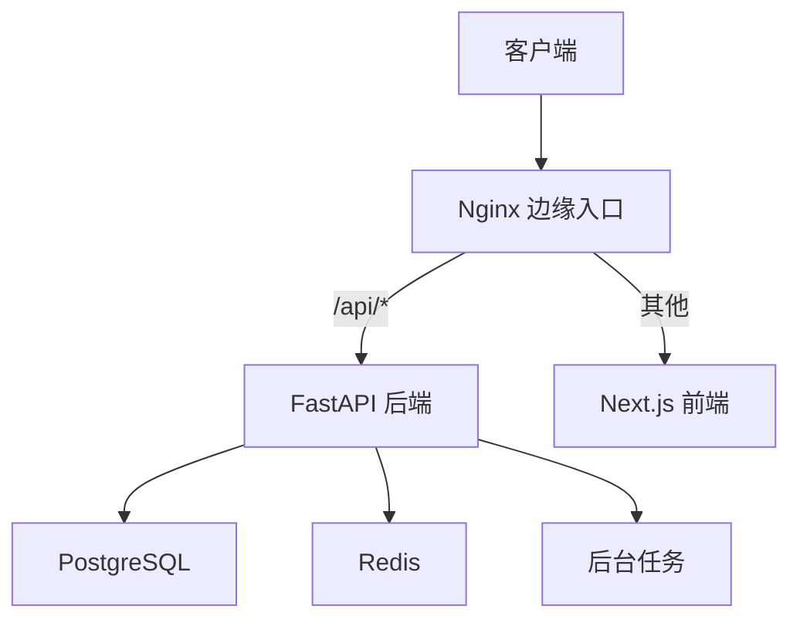
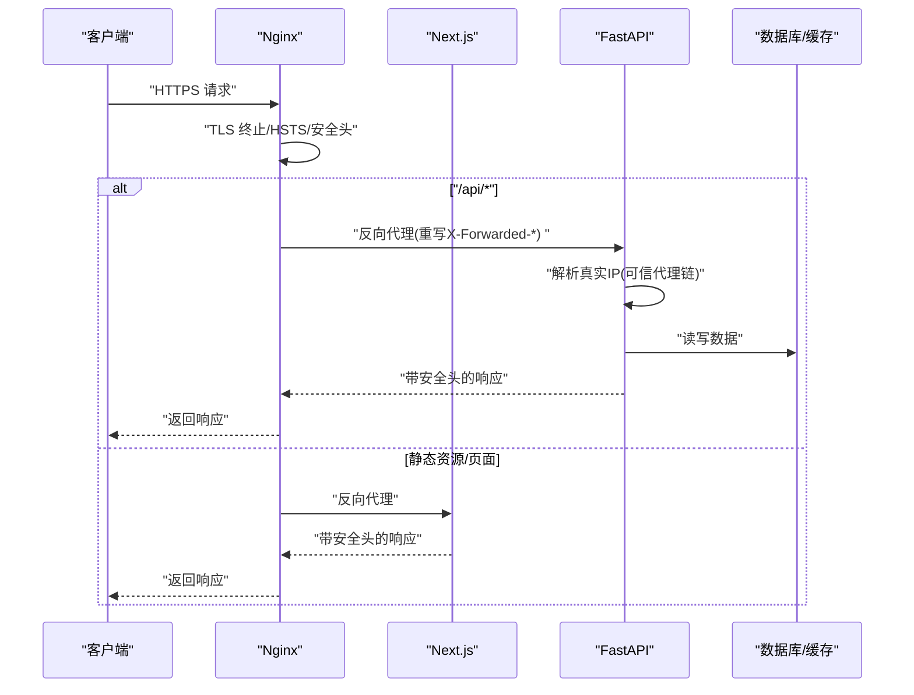
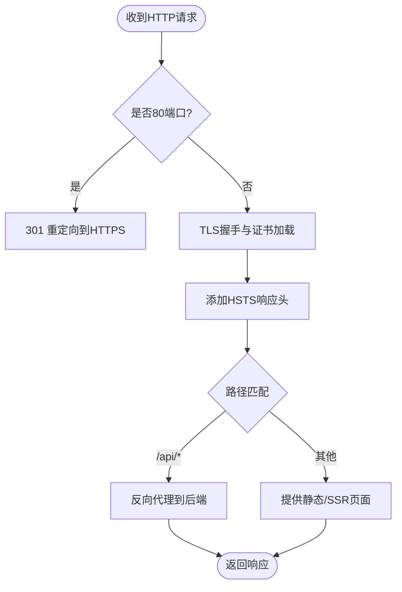
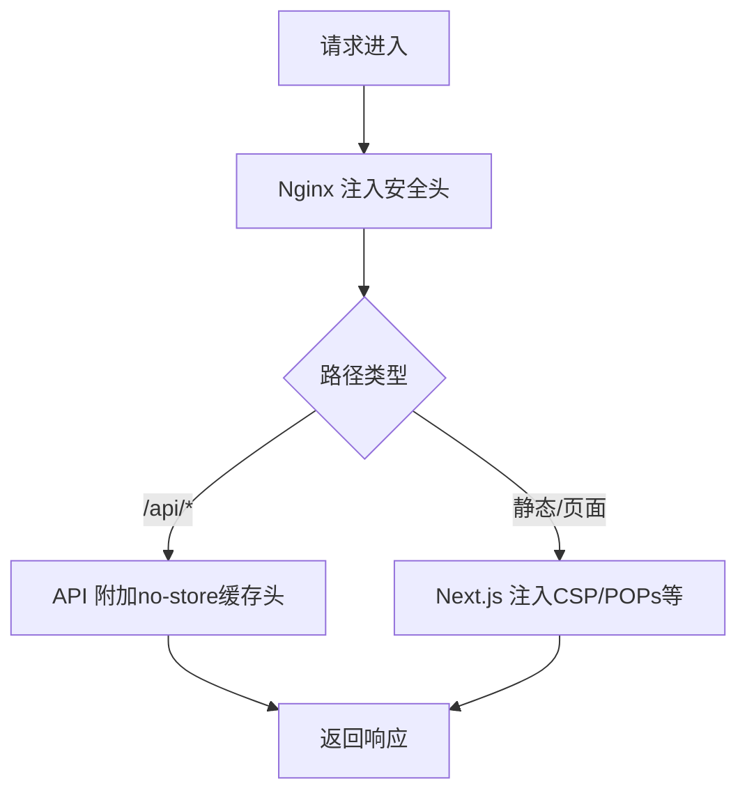
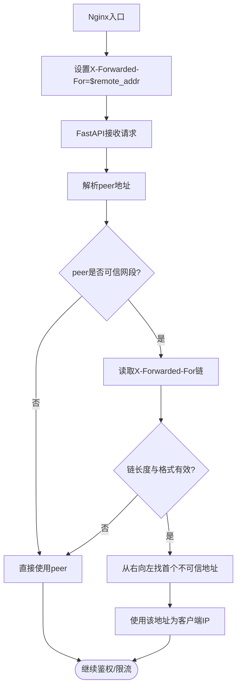
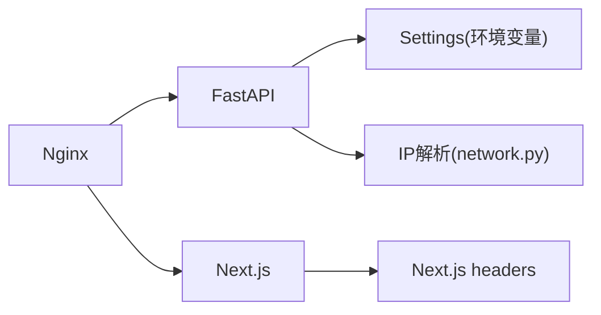

# 网络安全配置

<cite>
**本文引用的文件**
- [backend/app/config.py](file://backend/app/config.py)
- [backend/app/network.py](file://backend/app/network.py)
- [infra/nginx/fateradar-tls.conf](file://infra/nginx/fateradar-tls.conf)
- [infra/nginx/fateradar.conf](file://infra/nginx/fateradar.conf)
- [infra/nginx/app.conf](file://infra/nginx/app.conf)
- [infra/nginx/fateradar-test-loopback.conf](file://infra/nginx/fateradar-test-loopback.conf)
- [infra/compose.local.yml](file://infra/compose.local.yml)
- [web/next.config.ts](file://web/next.config.ts)
- [admin/next.config.ts](file://admin/next.config.ts)
- [backend/tests/test_network.py](file://backend/tests/test_network.py)
- [tests/contract/test_infra_contract.py](file://tests/contract/test_infra_contract.py)
</cite>

## 目录
1. [简介](#简介)
2. [项目结构](#项目结构)
3. [核心组件](#核心组件)
4. [架构总览](#架构总览)
5. [详细组件分析](#详细组件分析)
6. [依赖关系分析](#依赖关系分析)
7. [性能与安全注意事项](#性能与安全注意事项)
8. [故障排查指南](#故障排查指南)
9. [结论](#结论)
10. [附录：检查清单与最佳实践](#附录检查清单与最佳实践)

## 简介
本文件聚焦于项目的网络安全配置，覆盖 HTTPS 强制、SSL/TLS 与证书管理、协议版本控制、CORS 策略（含源/方法/头部）、HSTS 实现与作用机制、关键安全头设置（X-Frame-Options、X-Content-Type-Options、Referrer-Policy 等）、代理信任配置（trusted_proxy_cidrs）与 IP 地址验证、网络层异常连接检测与流量分析思路，以及 Nginx 反向代理的安全配置示例与生产环境最佳实践。文档同时提供可操作的检查清单与故障排查指引，帮助在开发与生产环境中稳定落地安全基线。

## 项目结构
本项目采用“边缘 Nginx + Web(Next.js) + API(FastAPI) + Worker”的分层架构。Nginx 作为统一入口负责 TLS 终止、安全头注入、请求转发与基础访问控制；Web 应用通过 Next.js 的 headers 能力补充前端侧安全头；API 服务基于 FastAPI，结合配置中心与环境变量完成运行时安全约束；Worker 处理异步任务。本地与测试环境通过 Docker Compose 编排，生产环境使用独立的 Nginx 配置文件进行 TLS 与域名路由。

**图示来源**
- [infra/nginx/app.conf:16-44](file://infra/nginx/app.conf#L16-L44)
- [infra/nginx/fateradar-tls.conf:57-84](file://infra/nginx/fateradar-tls.conf#L57-L84)
- [infra/compose.local.yml:31-49](file://infra/compose.local.yml#L31-L49)

**章节来源**
- [infra/nginx/app.conf:1-44](file://infra/nginx/app.conf#L1-L44)
- [infra/nginx/fateradar-tls.conf:1-125](file://infra/nginx/fateradar-tls.conf#L1-L125)
- [infra/compose.local.yml:1-93](file://infra/compose.local.yml#L1-L93)

## 核心组件
- 配置与安全基线：通过环境变量集中管理 Cookie 安全标志、可信代理网段、OTP 适配器、模型调用限制等，并在生产环境执行严格校验。
- 网络层 IP 解析：在受信任代理链中解析真实客户端 IP，防止伪造 X-Forwarded-For。
- Nginx 边缘安全：HTTPS 强制、HSTS、安全头、健康检查端点、反代规则与缓存控制。
- 前端安全头：Next.js 为全站与敏感路径注入 CSP、Referrer-Policy、Permissions-Policy、Cache-Control 等。
- 容器编排：Compose 声明服务边界并注入 MINGLI_TRUSTED_PROXY_CIDRS 等安全相关环境变量。

**章节来源**
- [backend/app/config.py:62-149](file://backend/app/config.py#L62-L149)
- [backend/app/network.py:16-54](file://backend/app/network.py#L16-L54)
- [infra/nginx/fateradar-tls.conf:57-125](file://infra/nginx/fateradar-tls.conf#L57-L125)
- [web/next.config.ts:27-65](file://web/next.config.ts#L27-L65)
- [infra/compose.local.yml:31-49](file://infra/compose.local.yml#L31-L49)

## 架构总览
下图展示了从客户端到后端的完整安全链路：Nginx 负责 TLS 终止与 HSTS，将请求转发至 Web 或 API；API 根据 trusted proxy 白名单解析真实客户端 IP，并对会话、CSRF、速率限制等进行保护；前端通过 Next.js 的 headers 强化响应安全头。

**图示来源**
- [infra/nginx/app.conf:16-44](file://infra/nginx/app.conf#L16-L44)
- [infra/nginx/fateradar-tls.conf:57-125](file://infra/nginx/fateradar-tls.conf#L57-L125)
- [backend/app/network.py:22-54](file://backend/app/network.py#L22-L54)

## 详细组件分析

### HTTPS 强制与 SSL/TLS 配置
- 端口与域名：HTTP 80 默认站点直接拒绝；各域名在 80 上仅用于 ACME 挑战与 301 重定向到 HTTPS。
- 证书与参数：使用 Let’s Encrypt 证书路径与 DH 参数，并通过 include 引入通用 TLS 选项。
- HSTS：在 HTTPS server 块中启用 Strict-Transport-Security，强制浏览器后续请求走 HTTPS。
- 健康检查：/healthz 关闭访问日志并返回最小响应体，便于探针探测。

**图示来源**
- [infra/nginx/fateradar-tls.conf:8-54](file://infra/nginx/fateradar-tls.conf#L8-L54)
- [infra/nginx/fateradar-tls.conf:57-125](file://infra/nginx/fateradar-tls.conf#L57-L125)

**章节来源**
- [infra/nginx/fateradar-tls.conf:1-125](file://infra/nginx/fateradar-tls.conf#L1-L125)

### 协议版本控制与加密套件
- 通过 include /etc/letsencrypt/options-ssl-nginx.conf 引入由证书管理器维护的 TLS 选项，确保禁用过时协议与弱套件。
- 建议在生产环境定期审计该包含文件的实际内容，确保符合当前安全基线。

**章节来源**
- [infra/nginx/fateradar-tls.conf:61-64](file://infra/nginx/fateradar-tls.conf#L61-L64)
- [infra/nginx/fateradar-tls.conf:91-94](file://infra/nginx/fateradar-tls.conf#L91-L94)
- [infra/nginx/fateradar-tls.conf:104-107](file://infra/nginx/fateradar-tls.conf#L104-L107)

### 证书管理与自动续期
- 证书路径指向 /etc/letsencrypt/live/<domain>/fullchain.pem 与 privkey.pem。
- HTTP 80 开放 .well-known/acme-challenge 以支持自动续期。
- 建议配合外部脚本在证书更新后重载 Nginx（仓库中存在 reload 脚本）。

**章节来源**
- [infra/nginx/fateradar-tls.conf:13-17](file://infra/nginx/fateradar-tls.conf#L13-L17)
- [infra/nginx/fateradar-tls.conf:29-33](file://infra/nginx/fateradar-tls.conf#L29-L33)
- [infra/nginx/fateradar-tls.conf:45-49](file://infra/nginx/fateradar-tls.conf#L45-L49)

### CORS 策略配置
- 当前代码库未显式定义跨域白名单或预检逻辑。若需跨域访问，建议在 Nginx 层对特定 origin/methods/headers 放行，或在 API 层按域与方法精细化控制。
- 对于内部同域场景（如 /api/* 与 / 同源），无需额外 CORS 配置。

**章节来源**
- [infra/nginx/app.conf:16-44](file://infra/nginx/app.conf#L16-L44)
- [infra/nginx/fateradar-test-loopback.conf:28-44](file://infra/nginx/fateradar-test-loopback.conf#L28-L44)

### HSTS 实现与作用机制
- 在 HTTPS server 块中添加 Strict-Transport-Security 响应头，使浏览器在有效期内强制使用 HTTPS，避免降级攻击。
- 建议逐步提升 max-age 并配合子域名 preload 列表评估。

**章节来源**
- [infra/nginx/fateradar-tls.conf:69-73](file://infra/nginx/fateradar-tls.conf#L69-L73)
- [infra/nginx/fateradar-tls.conf:109-111](file://infra/nginx/fateradar-tls.conf#L109-L111)

### 安全头设置
- 全站基线：X-Content-Type-Options: nosniff、X-Frame-Options: DENY、Referrer-Policy: strict-origin-when-cross-origin、Permissions-Policy: 限制摄像头/麦克风/定位/支付等。
- API 响应：额外设置 Cache-Control: private, no-store, max-age=0，避免中间缓存泄露敏感数据。
- 前端：Next.js 为全站与敏感路径注入 CSP、Referrer-Policy、Permissions-Policy、X-Content-Type-Options、X-Frame-Options、Cross-Origin-Opener-Policy 等。

**图示来源**
- [infra/nginx/app.conf:5-8](file://infra/nginx/app.conf#L5-L8)
- [infra/nginx/app.conf:27-31](file://infra/nginx/app.conf#L27-L31)
- [web/next.config.ts:39-61](file://web/next.config.ts#L39-L61)
- [admin/next.config.ts:39-60](file://admin/next.config.ts#L39-L60)

**章节来源**
- [infra/nginx/app.conf:1-44](file://infra/nginx/app.conf#L1-L44)
- [infra/nginx/fateradar-test-loopback.conf:15-44](file://infra/nginx/fateradar-test-loopback.conf#L15-L44)
- [web/next.config.ts:27-65](file://web/next.config.ts#L27-L65)
- [admin/next.config.ts:1-64](file://admin/next.config.ts#L1-L64)

### 代理信任配置与 IP 地址验证
- trusted_proxy_cidrs：通过环境变量 MINGLI_TRUSTED_PROXY_CIDRS 传入，用于标识受信任的代理网段。
- 真实客户端 IP 解析：当直连 peer 属于可信网段时，从 X-Forwarded-For 链自右向左查找第一个不可信地址作为客户端 IP；若链过长或包含非法地址则回退到 peer。
- Nginx 在入口处覆写 X-Forwarded-For 为 $remote_addr，防止客户端伪造。

**图示来源**
- [infra/nginx/app.conf:22-24](file://infra/nginx/app.conf#L22-L24)
- [infra/nginx/fateradar-test-loopback.conf:34-37](file://infra/nginx/fateradar-test-loopback.conf#L34-L37)
- [backend/app/network.py:22-54](file://backend/app/network.py#L22-L54)

**章节来源**
- [backend/app/config.py:139-139](file://backend/app/config.py#L139-L139)
- [infra/compose.local.yml:40-40](file://infra/compose.local.yml#L40-L40)
- [backend/app/network.py:16-54](file://backend/app/network.py#L16-L54)
- [backend/tests/test_network.py:17-39](file://backend/tests/test_network.py#L17-L39)

### 网络层安全监控与异常检测
- 健康检查：/healthz 提供轻量探针，便于负载均衡与健康判定。
- 日志与追踪：Nginx 通过 $request_id 透传，便于全链路追踪；建议结合集中式日志系统对异常连接、高频失败、异常 UA/Referer 进行告警。
- 速率限制：API 层具备多种速率限制配置项（如 OTP、写入操作、登录等），可在高并发下抑制滥用。

**章节来源**
- [infra/nginx/app.conf:10-14](file://infra/nginx/app.conf#L10-L14)
- [infra/nginx/app.conf:22-24](file://infra/nginx/app.conf#L22-L24)
- [backend/app/config.py:122-148](file://backend/app/config.py#L122-L148)

### Nginx 反向代理安全配置示例与生产最佳实践
- 入口安全：默认站点拒绝所有未知主机；HTTP 仅用于 ACME 与重定向。
- 安全头：全站注入 X-Content-Type-Options、X-Frame-Options、Referrer-Policy、Permissions-Policy；API 路径追加 no-store 缓存控制。
- 反代规范：统一设置 Host、X-Forwarded-Host、X-Forwarded-Proto、X-Forwarded-For、X-Real-IP、X-Request-ID；API 路径重复基线安全头以避免继承中断。
- 生产建议：
  - 使用独立 TLS 配置文件，集中管理证书与 TLS 选项。
  - 开启 HSTS，并根据业务评估是否加入 preload。
  - 对敏感路径（如 /app、/account）在前端与后端均标记私有与禁止索引。
  - 限制上游超时与响应大小，避免资源耗尽。
  - 使用最小权限原则部署 Nginx 与证书目录。

**章节来源**
- [infra/nginx/fateradar.conf:1-59](file://infra/nginx/fateradar.conf#L1-L59)
- [infra/nginx/fateradar-tls.conf:1-125](file://infra/nginx/fateradar-tls.conf#L1-L125)
- [infra/nginx/app.conf:1-44](file://infra/nginx/app.conf#L1-L44)
- [web/next.config.ts:39-61](file://web/next.config.ts#L39-L61)
- [admin/next.config.ts:39-60](file://admin/next.config.ts#L39-L60)

## 依赖关系分析
- Nginx 与后端：Nginx 将 /api/* 反向代理到后端服务，并将 / 转发到前端；所有路径均覆写 X-Forwarded-* 以确保后端获取真实客户端信息。
- 后端配置：Settings 集中管理安全相关环境变量，并在生产环境执行严格校验（如 cookie_secure、OTP 适配器、模型调用限制、路径绝对性等）。
- 前端安全头：Next.js 为全站与敏感路径注入安全头，并与 Nginx 形成互补。

**图示来源**
- [infra/nginx/app.conf:16-44](file://infra/nginx/app.conf#L16-L44)
- [backend/app/config.py:62-149](file://backend/app/config.py#L62-L149)
- [backend/app/network.py:22-54](file://backend/app/network.py#L22-L54)
- [web/next.config.ts:39-61](file://web/next.config.ts#L39-L61)

**章节来源**
- [infra/nginx/app.conf:1-44](file://infra/nginx/app.conf#L1-L44)
- [backend/app/config.py:62-149](file://backend/app/config.py#L62-L149)
- [backend/app/network.py:22-54](file://backend/app/network.py#L22-L54)
- [web/next.config.ts:39-61](file://web/next.config.ts#L39-L61)

## 性能与安全注意事项
- 合理设置超时与响应大小：后端模型调用与运行时资源需限制超时与最大响应字节，避免恶意请求导致资源耗尽。
- 缓存控制：API 与敏感页面一律 no-store，避免中间缓存泄露。
- 最小化暴露面：默认站点拒绝未知主机；仅开放必要端口与路径。
- 密钥与凭据：生产环境必须注入强随机密钥，禁止使用本地默认值。

[本节为通用指导，不直接分析具体文件]

## 故障排查指南
- 无法访问 HTTPS：检查 Nginx 证书路径与权限、ACME 挑战路径是否可达、TLS 选项是否正确 include。
- HSTS 导致无法回退 HTTP：确认已正确配置 301 重定向，必要时临时降低 max-age 以便调试。
- 客户端 IP 不正确：确认 Nginx 入口是否覆写 X-Forwarded-For 为 $remote_addr；检查 trusted_proxy_cidrs 是否包含上游代理网段。
- 安全头缺失：Nginx location 内声明 Cache-Control 会中断父级 add_header 继承，需在 location 内重复基线安全头。
- 前端 CSP 报错：核对 Next.js headers 中的 CSP 指令是否与资源加载策略一致。

**章节来源**
- [infra/nginx/fateradar-tls.conf:13-17](file://infra/nginx/fateradar-tls.conf#L13-L17)
- [infra/nginx/fateradar-tls.conf:57-84](file://infra/nginx/fateradar-tls.conf#L57-L84)
- [infra/nginx/app.conf:22-31](file://infra/nginx/app.conf#L22-L31)
- [backend/app/network.py:22-54](file://backend/app/network.py#L22-L54)
- [web/next.config.ts:39-61](file://web/next.config.ts#L39-L61)

## 结论
本项目在边缘层（Nginx）实现了 HTTPS 强制、HSTS 与基础安全头；在后端（FastAPI）通过环境变量与运行时校验保障生产安全基线，并结合可信代理链解析真实客户端 IP；前端（Next.js）补充了 CSP、Referrer-Policy、Permissions-Policy 等关键安全头。整体架构清晰、职责明确，适合在生产环境扩展与加固。

[本节为总结性内容，不直接分析具体文件]

## 附录：检查清单与最佳实践
- HTTPS 与证书
  - 确认所有 HTTP 请求 301 到 HTTPS。
  - 确保证书路径正确且可被 Nginx 读取。
  - 确保证书自动续期流程可用。
- HSTS
  - 已在 HTTPS server 块中设置 Strict-Transport-Security。
  - 评估是否加入 preload 列表。
- 安全头
  - 全站设置 X-Content-Type-Options、X-Frame-Options、Referrer-Policy、Permissions-Policy。
  - API 路径设置 Cache-Control: private, no-store, max-age=0。
  - 前端为敏感路径设置私有与禁止索引。
- 代理信任与 IP 解析
  - 配置 MINGLI_TRUSTED_PROXY_CIDRS 包含上游代理网段。
  - Nginx 入口覆写 X-Forwarded-For 为 $remote_addr。
  - 后端使用可信代理链解析真实客户端 IP。
- 速率限制与超时
  - 为 OTP、写入、登录等接口设置合理的速率窗口与上限。
  - 限制模型调用超时与响应大小。
- 监控与日志
  - 启用 /healthz 健康检查。
  - 透传 X-Request-ID 并接入集中式日志系统。
  - 对异常连接、高频失败、异常 UA/Referer 建立告警。

**章节来源**
- [infra/nginx/fateradar-tls.conf:57-125](file://infra/nginx/fateradar-tls.conf#L57-L125)
- [infra/nginx/app.conf:5-8](file://infra/nginx/app.conf#L5-L8)
- [infra/nginx/app.conf:27-31](file://infra/nginx/app.conf#L27-L31)
- [infra/compose.local.yml:40-40](file://infra/compose.local.yml#L40-L40)
- [backend/app/config.py:122-148](file://backend/app/config.py#L122-L148)
- [backend/app/network.py:22-54](file://backend/app/network.py#L22-L54)
- [tests/contract/test_infra_contract.py:24-41](file://tests/contract/test_infra_contract.py#L24-L41)