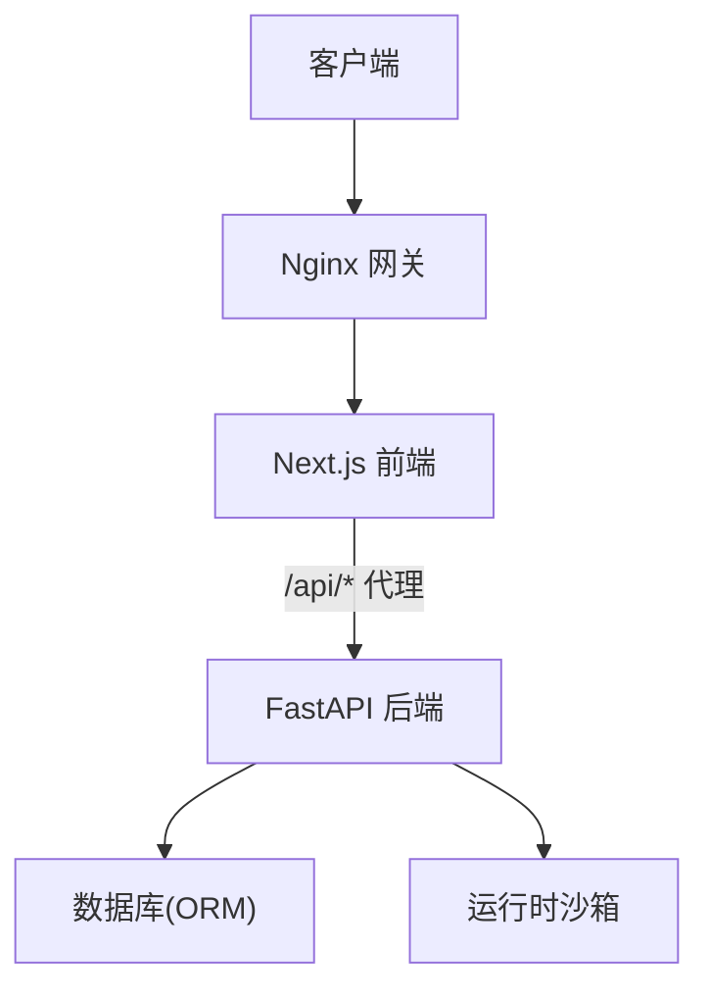
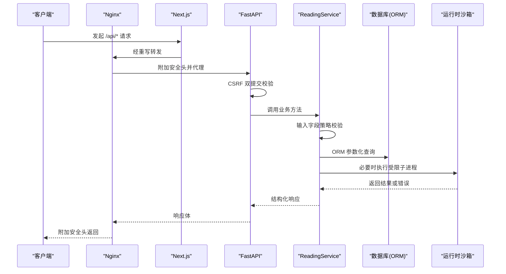
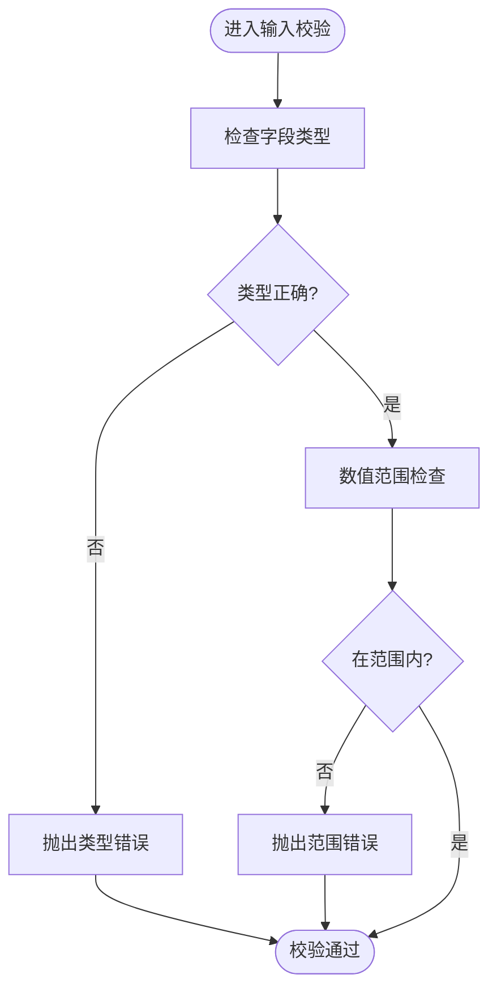
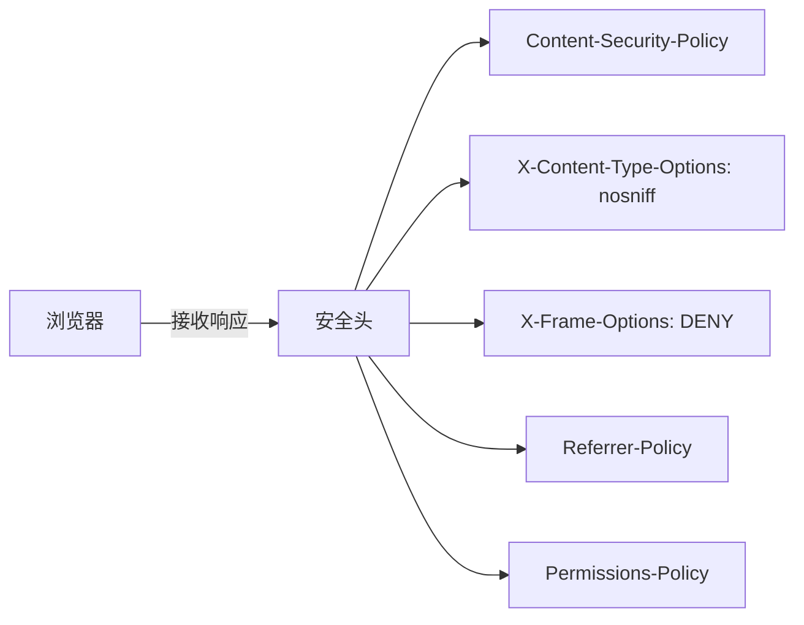
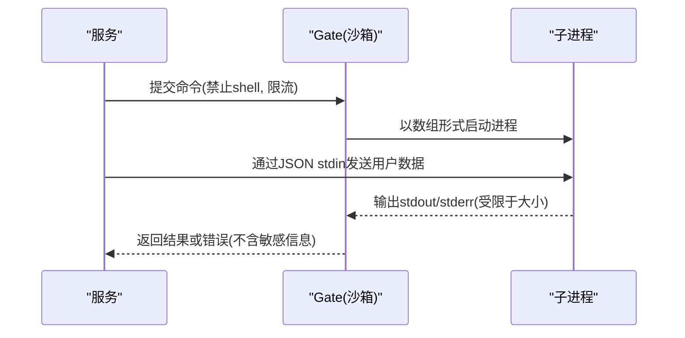
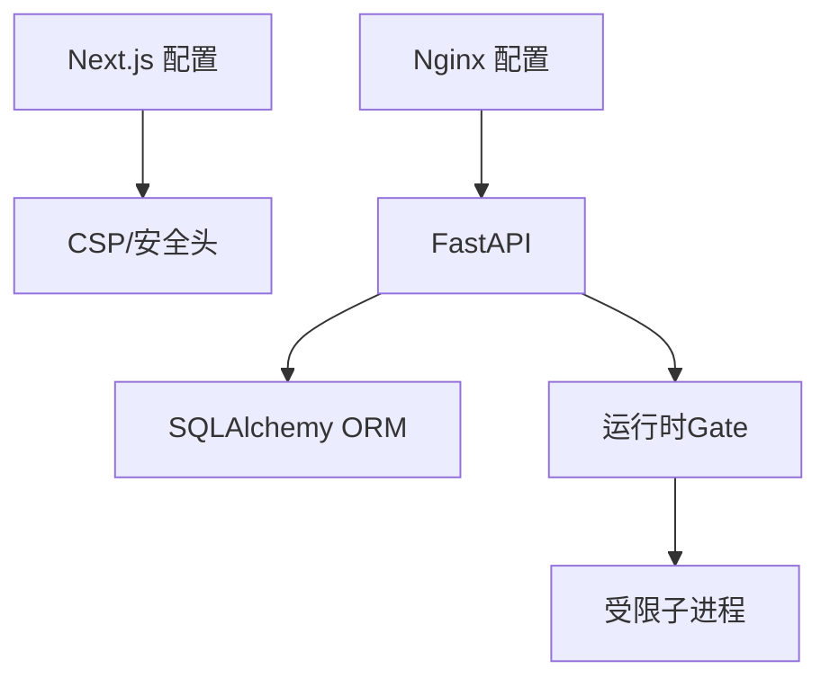

# 输入验证与输出编码

<cite>
**本文引用的文件**
- [backend/app/api/validators.py](file://backend/app/api/validators.py)
- [backend/app/readings/service.py](file://backend/app/readings/service.py)
- [backend/app/database.py](file://backend/app/database.py)
- [backend/app/api/dependencies.py](file://backend/app/api/dependencies.py)
- [infra/nginx/app.conf](file://infra/nginx/app.conf)
- [web/src/test/security-config.test.ts](file://web/src/test/security-config.test.ts)
- [infra/mingli-runtime/local_gate.py](file://infra/mingli-runtime/local_gate.py)
- [backend/tests/test_runtime_process_adapter.py](file://backend/tests/test_runtime_process_adapter.py)
</cite>

## 目录
1. [简介](#简介)
2. [项目结构](#项目结构)
3. [核心组件](#核心组件)
4. [架构总览](#架构总览)
5. [详细组件分析](#详细组件分析)
6. [依赖关系分析](#依赖关系分析)
7. [性能考虑](#性能考虑)
8. [故障排查指南](#故障排查指南)
9. [结论](#结论)
10. [附录](#附录)

## 简介
本文件聚焦于“输入验证与输出编码”的安全实践，覆盖请求数据校验、SQL注入防护、XSS防护、命令注入防护、文件上传安全以及最佳实践与测试要点。内容基于后端FastAPI服务、Nginx网关、前端Next.js配置以及运行时沙箱隔离机制进行系统化说明，帮助读者理解从入口到落库、从渲染到输出的全链路安全控制点。

## 项目结构
本项目在前后端分离的架构下，围绕“输入—处理—存储—输出”的关键路径建立安全边界：
- 前端（Next.js）通过重写将 /api/* 代理至内部 FastAPI，并设置浏览器安全头（CSP、X-Frame-Options、Referrer-Policy 等）。
- Nginx 作为边缘网关，统一附加基础安全响应头，并对 API 路径强制私有缓存策略。
- 后端使用 SQLAlchemy 异步引擎与 ORM，避免拼接 SQL；对运行时外部进程执行采用白名单与沙箱限制。
- 业务层在服务中实现严格的输入字段策略校验与错误分类。

**图表来源**
- [infra/nginx/app.conf:1-44](file://infra/nginx/app.conf#L1-L44)
- [web/src/test/security-config.test.ts:10-33](file://web/src/test/security-config.test.ts#L10-L33)
- [backend/app/database.py:12-33](file://backend/app/database.py#L12-L33)
- [infra/mingli-runtime/local_gate.py:136-171](file://infra/mingli-runtime/local_gate.py#L136-L171)

**章节来源**
- [infra/nginx/app.conf:1-44](file://infra/nginx/app.conf#L1-L44)
- [web/src/test/security-config.test.ts:10-33](file://web/src/test/security-config.test.ts#L10-L33)
- [backend/app/database.py:12-33](file://backend/app/database.py#L12-L33)
- [infra/mingli-runtime/local_gate.py:136-171](file://infra/mingli-runtime/local_gate.py#L136-L171)

## 核心组件
- 请求输入校验
  - IANA 时区名称校验器，确保传入时区值合法。
  - 运行时输入字段策略校验，按类型与范围约束用户输入。
- 数据库访问
  - 使用 SQLAlchemy 异步引擎与 ORM，查询以参数化方式执行，避免字符串拼接。
- CSRF 保护
  - 双提交令牌校验，结合 HMAC 比较防止跨站请求伪造。
- 输出安全
  - 前端与网关统一设置安全响应头（CSP、X-Content-Type-Options、Referrer-Policy、Permissions-Policy），并对私密页面禁用缓存与索引。
- 命令执行隔离
  - 运行时子进程执行禁止 shell 模式，限制标准输出/错误大小，仅通过 JSON stdin 传递用户数据，避免命令注入。

**章节来源**
- [backend/app/api/validators.py:1-10](file://backend/app/api/validators.py#L1-L10)
- [backend/app/readings/service.py:88-114](file://backend/app/readings/service.py#L88-L114)
- [backend/app/readings/service.py:751-773](file://backend/app/readings/service.py#L751-L773)
- [backend/app/database.py:12-33](file://backend/app/database.py#L12-L33)
- [backend/app/api/dependencies.py:113-136](file://backend/app/api/dependencies.py#L113-L136)
- [infra/nginx/app.conf:1-44](file://infra/nginx/app.conf#L1-L44)
- [web/src/test/security-config.test.ts:21-33](file://web/src/test/security-config.test.ts#L21-L33)
- [infra/mingli-runtime/local_gate.py:136-171](file://infra/mingli-runtime/local_gate.py#L136-L171)

## 架构总览
下图展示一次读取请求从前端到后端的完整调用链，重点标注输入校验、CSRF、ORM 查询与输出安全头的位置。

**图表来源**
- [backend/app/api/dependencies.py:113-136](file://backend/app/api/dependencies.py#L113-L136)
- [backend/app/readings/service.py:751-773](file://backend/app/readings/service.py#L751-L773)
- [backend/app/database.py:12-33](file://backend/app/database.py#L12-L33)
- [infra/nginx/app.conf:1-44](file://infra/nginx/app.conf#L1-L44)
- [infra/mingli-runtime/local_gate.py:136-171](file://infra/mingli-runtime/local_gate.py#L136-L171)

## 详细组件分析

### 请求输入验证机制
- IANA 时区校验器
  - 通过系统时区库验证时区名合法性，非法时区抛出异常，阻止后续处理。
- 运行时输入字段策略
  - 针对 integer、text/textarea、choice 等类型进行严格类型检查。
  - 数值型输入支持最小/最大范围约束，越界即拒绝。
  - 对“requirements.any_of”的结构进行完整性校验，确保每个备选集合恰好选择一个字段。
- 错误分类
  - 使用专门的领域错误类型表达输入不合法，便于上层统一处理与日志记录。

**图表来源**
- [backend/app/readings/service.py:751-773](file://backend/app/readings/service.py#L751-L773)
- [backend/app/readings/service.py:677-703](file://backend/app/readings/service.py#L677-L703)

**章节来源**
- [backend/app/api/validators.py:1-10](file://backend/app/api/validators.py#L1-L10)
- [backend/app/readings/service.py:88-114](file://backend/app/readings/service.py#L88-L114)
- [backend/app/readings/service.py:677-703](file://backend/app/readings/service.py#L677-L703)
- [backend/app/readings/service.py:751-773](file://backend/app/readings/service.py#L751-L773)

### SQL 注入防护
- 参数化查询与 ORM
  - 使用 SQLAlchemy 异步引擎与 ORM，所有查询通过对象与参数化语句执行，避免拼接 SQL。
  - 健康探针示例展示了使用 text() 执行简单查询，但仍遵循参数化原则。
- 建议规范
  - 禁止使用 f-string 或 .format 拼接 SQL。
  - 对外部输入一律通过 ORM 映射或参数绑定。
  - 对复杂查询使用预编译语句或视图，减少动态拼接面。

**章节来源**
- [backend/app/database.py:12-33](file://backend/app/database.py#L12-L33)

### XSS 攻击防护
- 输出编码策略
  - 前端通过 Next.js 配置为所有页面添加 CSP、X-Content-Type-Options、Referrer-Policy、X-Frame-Options 等安全头，限制脚本来源与嵌套框架。
  - 私密路由（如 /app/*、/account/*）强制私有缓存与禁止索引，降低敏感信息泄露风险。
- 网关加固
  - Nginx 在服务器级别统一附加安全头，并在 /api/* 路径重复声明以确保继承不被覆盖。
- 测试保障
  - 单元测试断言关键安全头存在且值符合预期，确保配置变更不会破坏安全基线。

**图表来源**
- [web/src/test/security-config.test.ts:21-33](file://web/src/test/security-config.test.ts#L21-L33)
- [infra/nginx/app.conf:1-44](file://infra/nginx/app.conf#L1-L44)

**章节来源**
- [web/src/test/security-config.test.ts:21-33](file://web/src/test/security-config.test.ts#L21-L33)
- [infra/nginx/app.conf:1-44](file://infra/nginx/app.conf#L1-L44)

### 命令注入防护
- 外部命令执行限制
  - 运行时子进程执行明确禁止 shell 模式，避免解析用户输入中的 shell 元字符。
  - 标准输入通过 JSON 传递用户数据，命令行参数不包含用户内容，阻断注入路径。
- 资源限制与隔离
  - 限制 stdout/stderr 字节上限，防止内存耗尽攻击。
  - 使用独立会话启动进程，限制其生命周期与资源占用。
- 测试验证
  - 测试用例验证异常消息中不暴露状态令牌、用户原文或服务密钥等敏感信息。
  - 验证即使传入包含 shell 扩展的命令字符串，也不会被执行。

**图表来源**
- [infra/mingli-runtime/local_gate.py:136-171](file://infra/mingli-runtime/local_gate.py#L136-L171)
- [backend/tests/test_runtime_process_adapter.py:239-266](file://backend/tests/test_runtime_process_adapter.py#L239-L266)
- [backend/tests/test_runtime_process_adapter.py:356-397](file://backend/tests/test_runtime_process_adapter.py#L356-L397)

**章节来源**
- [infra/mingli-runtime/local_gate.py:136-171](file://infra/mingli-runtime/local_gate.py#L136-L171)
- [backend/tests/test_runtime_process_adapter.py:239-266](file://backend/tests/test_runtime_process_adapter.py#L239-L266)
- [backend/tests/test_runtime_process_adapter.py:356-397](file://backend/tests/test_runtime_process_adapter.py#L356-L397)

### 文件上传安全
- 当前代码库未直接实现通用文件上传接口。建议在新增上传能力时遵循以下策略：
  - 类型白名单：仅允许已知安全的 MIME 类型与扩展名。
  - 大小限制：在网关与后端双重限制上传体积，防止 DoS。
  - 恶意检测：对二进制文件进行签名校验或沙箱扫描。
  - 存储隔离：将上传文件置于不可执行的目录，并通过 CDN 或静态服务提供访问。
  - 命名随机化：避免使用用户提供的文件名，防止路径穿越。

[本节为通用指导，不直接分析具体文件]

### CSRF 与敏感响应头
- CSRF 双提交校验
  - 设备与会话级 CSRF 校验，使用 HMAC 常量时间比较，防止时序攻击。
- 私密响应头
  - 对包含敏感数据的响应设置私有缓存与禁止索引头，避免中间节点缓存泄露。

**章节来源**
- [backend/app/api/dependencies.py:113-136](file://backend/app/api/dependencies.py#L113-L136)

## 依赖关系分析
- 前端依赖 Next.js 配置来注入安全头，并通过 rewrites 将 /api/* 指向内部服务。
- Nginx 作为反向代理，统一附加安全头并限制缓存策略。
- 后端依赖 SQLAlchemy 进行 ORM 操作，避免 SQL 注入。
- 运行时模块通过 Gate 限制子进程执行，确保命令注入被阻断。

**图表来源**
- [web/src/test/security-config.test.ts:10-33](file://web/src/test/security-config.test.ts#L10-L33)
- [infra/nginx/app.conf:1-44](file://infra/nginx/app.conf#L1-L44)
- [backend/app/database.py:12-33](file://backend/app/database.py#L12-L33)
- [infra/mingli-runtime/local_gate.py:136-171](file://infra/mingli-runtime/local_gate.py#L136-L171)

**章节来源**
- [web/src/test/security-config.test.ts:10-33](file://web/src/test/security-config.test.ts#L10-L33)
- [infra/nginx/app.conf:1-44](file://infra/nginx/app.conf#L1-L44)
- [backend/app/database.py:12-33](file://backend/app/database.py#L12-L33)
- [infra/mingli-runtime/local_gate.py:136-171](file://infra/mingli-runtime/local_gate.py#L136-L171)

## 性能考虑
- 输入校验尽量前置，尽早失败以减少后续处理开销。
- 使用 ORM 参数化查询可提升执行计划复用率，降低数据库负载。
- 运行时子进程执行需限制资源与超时，避免长耗时任务阻塞请求。
- 安全头由网关集中设置，减少应用层重复逻辑。

[本节提供通用指导，不直接分析具体文件]

## 故障排查指南
- 输入校验失败
  - 关注类型与范围错误提示，定位字段策略定义与入参结构。
- CSRF 校验失败
  - 检查双提交令牌是否一致，确认服务端哈希比对流程未被篡改。
- 数据库连接问题
  - 使用健康探针验证连接池与引擎状态。
- 运行时执行异常
  - 检查子进程启动参数是否为数组形式，确认未启用 shell。
  - 查看 stdout/stderr 限制是否触发，调整阈值或优化输出。

**章节来源**
- [backend/app/readings/service.py:751-773](file://backend/app/readings/service.py#L751-L773)
- [backend/app/api/dependencies.py:113-136](file://backend/app/api/dependencies.py#L113-L136)
- [backend/app/database.py:23-33](file://backend/app/database.py#L23-L33)
- [infra/mingli-runtime/local_gate.py:136-171](file://infra/mingli-runtime/local_gate.py#L136-L171)

## 结论
本项目在输入验证、SQL 注入防护、XSS 防护、命令注入防护等方面建立了多层次的安全防线：前端与网关统一安全头，后端严格输入校验与 ORM 参数化查询，运行时沙箱隔离外部命令执行。配合自动化测试断言，确保安全配置与行为的可回归性。建议持续完善文件上传安全与更多场景的输入白名单策略，保持最小权限与默认拒绝的原则。

[本节为总结性内容，不直接分析具体文件]

## 附录
- 最佳实践清单
  - 输入侧：类型白名单、长度与范围限制、枚举值校验、必填项检查。
  - 存储侧：ORM 参数化、避免动态 SQL、最小权限账户。
  - 输出侧：CSP、X-Content-Type-Options、Referrer-Policy、X-Frame-Options。
  - 执行侧：禁止 shell、限制资源、仅 JSON 传参、异常信息脱敏。
  - 上传侧：MIME 白名单、大小限制、病毒扫描、随机命名、不可执行目录。
- 常见攻击模式与防御
  - SQL 注入：参数化查询与 ORM。
  - XSS：CSP 与输出编码。
  - 命令注入：禁止 shell、白名单命令、沙箱隔离。
  - CSRF：双提交令牌与 HMAC 比较。
  - 文件上传：类型与大小限制、恶意检测、存储隔离。

[本节为通用指导，不直接分析具体文件]