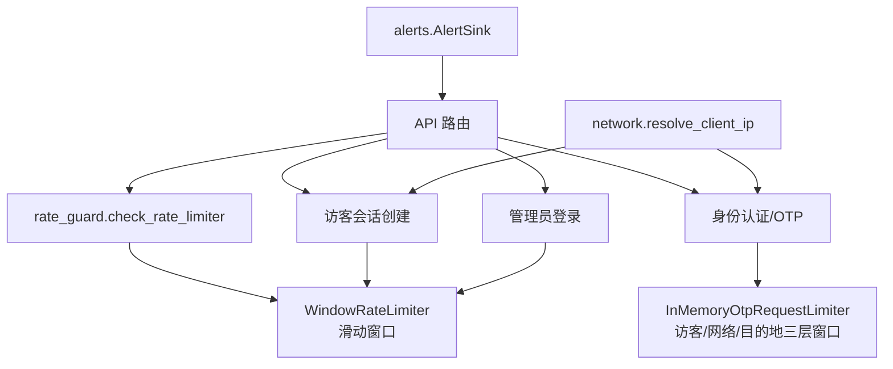
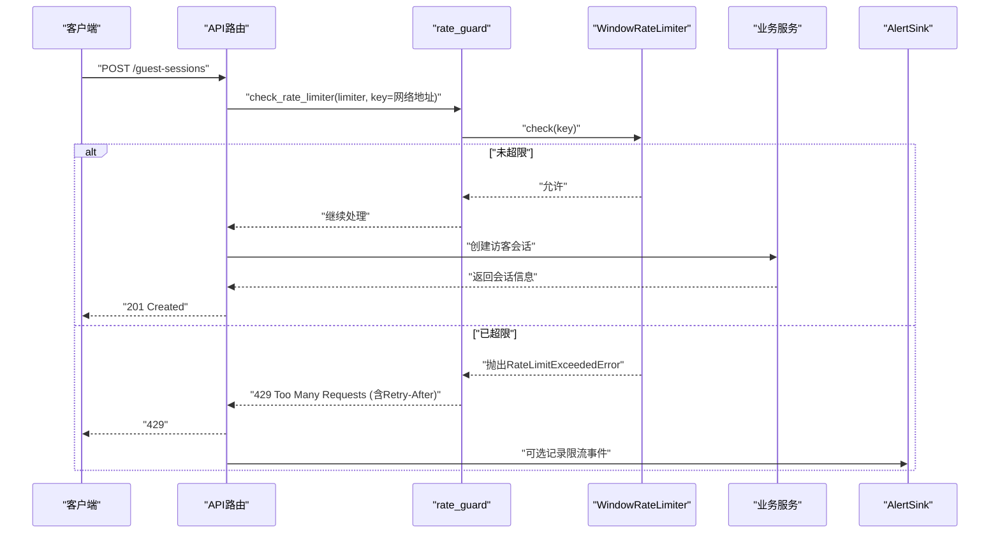
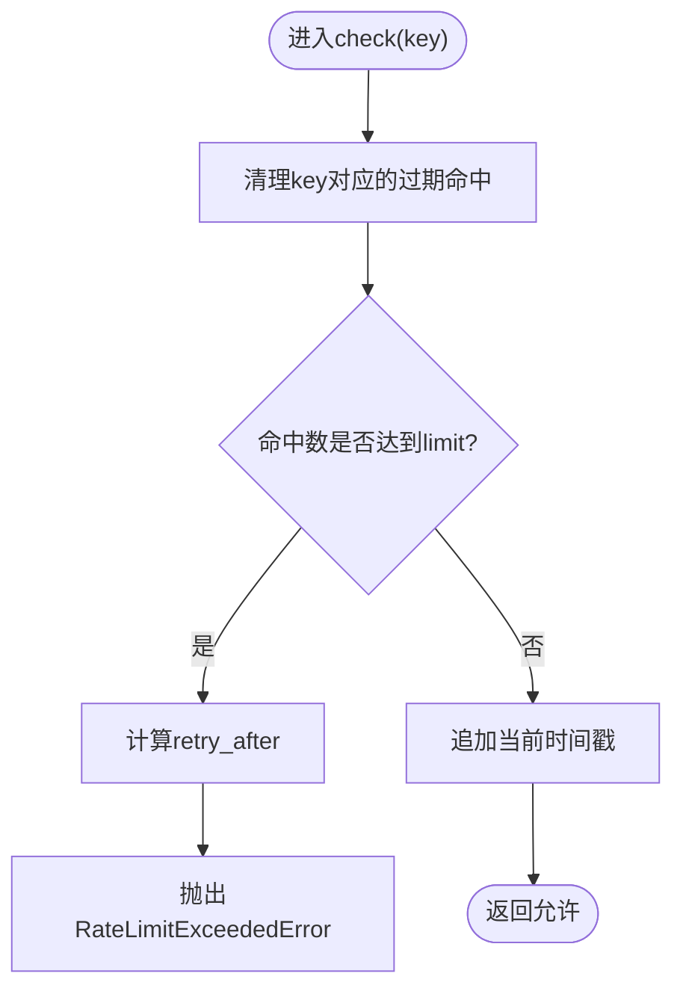
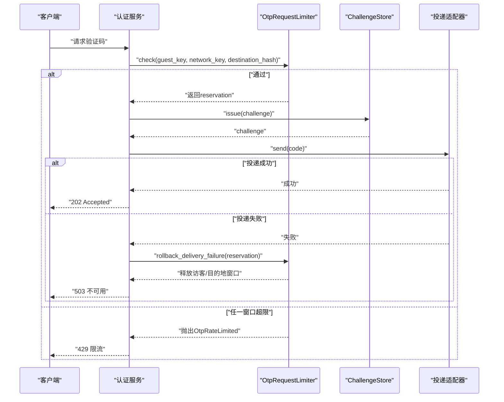
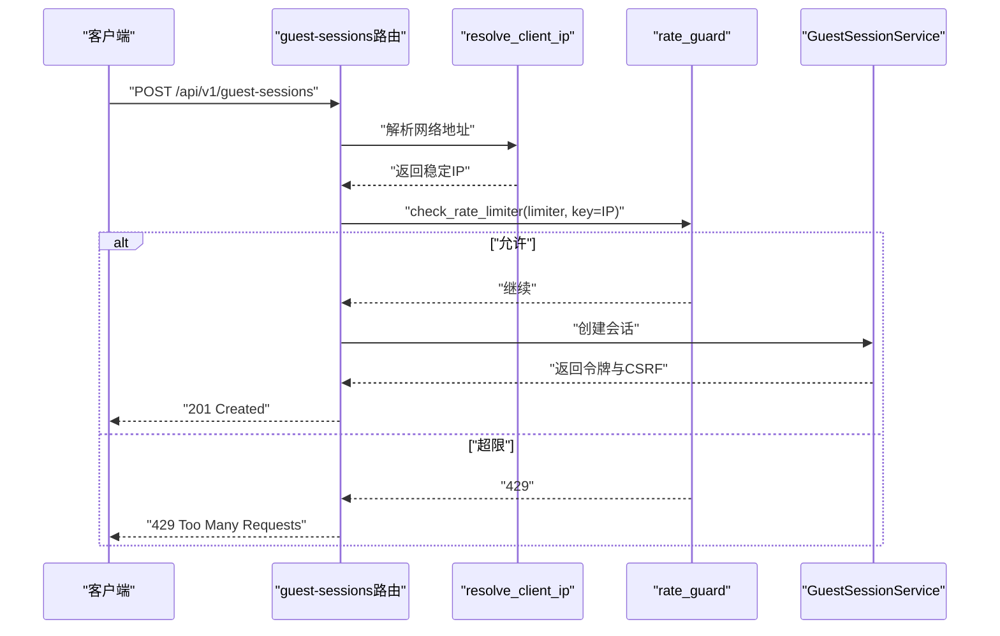
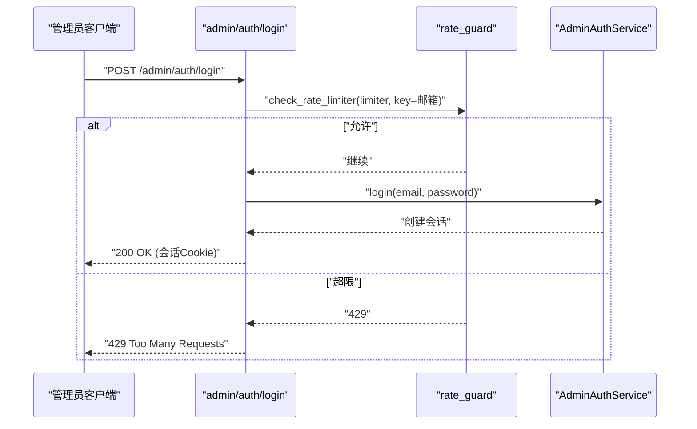
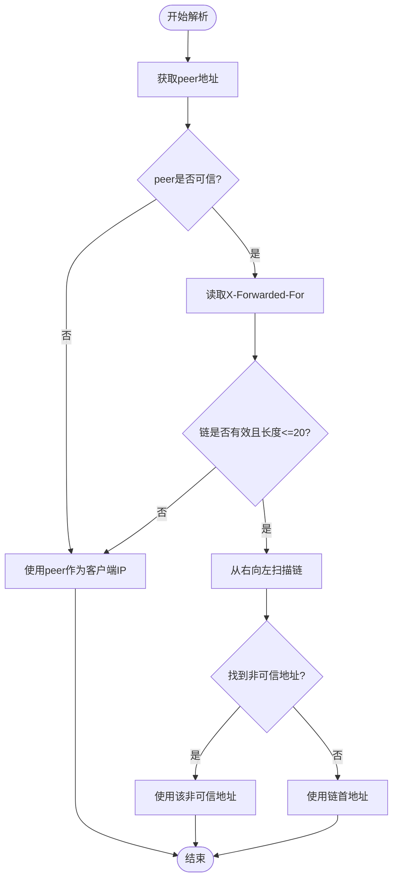
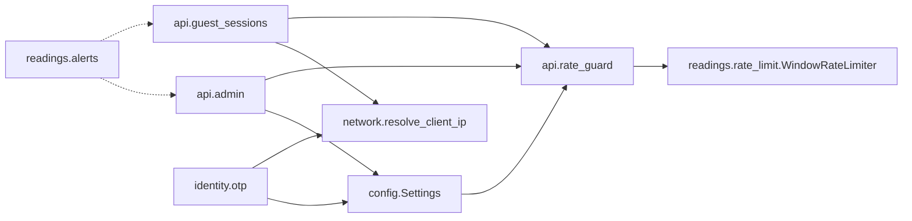

# 速率限制与防滥用

<cite>
**本文引用的文件**
- [backend/app/readings/rate_limit.py](file://backend/app/readings/rate_limit.py)
- [backend/app/api/rate_guard.py](file://backend/app/api/rate_guard.py)
- [backend/app/identity/otp.py](file://backend/app/identity/otp.py)
- [backend/app/config.py](file://backend/app/config.py)
- [backend/app/network.py](file://backend/app/network.py)
- [backend/app/api/guest_sessions.py](file://backend/app/api/guest_sessions.py)
- [backend/app/api/admin.py](file://backend/app/api/admin.py)
- [backend/app/readings/alerts.py](file://backend/app/readings/alerts.py)
- [backend/tests/test_guest_sessions.py](file://backend/tests/test_guest_sessions.py)
- [backend/tests/test_auth.py](file://backend/tests/test_auth.py)
- [backend/tests/test_smtp_otp_adapter.py](file://backend/tests/test_smtp_otp_adapter.py)
</cite>

## 目录
1. [简介](#简介)
2. [项目结构](#项目结构)
3. [核心组件](#核心组件)
4. [架构总览](#架构总览)
5. [详细组件分析](#详细组件分析)
6. [依赖关系分析](#依赖关系分析)
7. [性能考量](#性能考量)
8. [故障排查指南](#故障排查指南)
9. [结论](#结论)
10. [附录：配置项与最佳实践](#附录：配置项与最佳实践)

## 简介
本文件系统性梳理并解释本项目中的速率限制与防滥用机制，覆盖多层级限流策略（IP/网络级、用户/访客会话级、API端点级）、OTP验证码的防滥用保护（发送频率、尝试次数、时间窗口）、读写操作的差异化限流、管理员登录的额外保护、限流算法选择与配置、以及监控告警的实现示例。目标是帮助读者在不深入代码细节的情况下理解整体设计，并在需要时快速定位到具体实现位置。

## 项目结构
后端采用模块化组织，限流相关能力分布在以下位置：
- 通用滑动窗口限流器：用于写操作（读取、写入）的进程内限流
- OTP请求的多层限流：访客、网络、目标地址三层窗口控制
- 访客会话创建限流：按网络地址进行窗口限制
- 管理员登录限流：按邮箱桶进行登录尝试限制
- IP解析与可信代理：从请求中安全地解析客户端真实IP
- 告警基础设施：结构化日志告警输出

图表来源
- [backend/app/api/rate_guard.py:5-19](file://backend/app/api/rate_guard.py#L5-L19)
- [backend/app/readings/rate_limit.py:9-60](file://backend/app/readings/rate_limit.py#L9-L60)
- [backend/app/identity/otp.py:64-180](file://backend/app/identity/otp.py#L64-L180)
- [backend/app/api/guest_sessions.py:16-52](file://backend/app/api/guest_sessions.py#L16-L52)
- [backend/app/api/admin.py:56-145](file://backend/app/api/admin.py#L56-L145)
- [backend/app/network.py:22-54](file://backend/app/network.py#L22-L54)
- [backend/app/readings/alerts.py:16-81](file://backend/app/readings/alerts.py#L16-L81)

章节来源
- [backend/app/readings/rate_limit.py:9-60](file://backend/app/readings/rate_limit.py#L9-L60)
- [backend/app/api/rate_guard.py:5-19](file://backend/app/api/rate_guard.py#L5-L19)
- [backend/app/identity/otp.py:64-180](file://backend/app/identity/otp.py#L64-L180)
- [backend/app/network.py:22-54](file://backend/app/network.py#L22-L54)
- [backend/app/api/guest_sessions.py:16-52](file://backend/app/api/guest_sessions.py#L16-L52)
- [backend/app/api/admin.py:56-145](file://backend/app/api/admin.py#L56-L145)
- [backend/app/readings/alerts.py:16-81](file://backend/app/readings/alerts.py#L16-L81)

## 核心组件
- 滑动窗口限流器 WindowRateLimiter：基于单调时钟和双端队列维护每个键在时间窗口内的命中次数，超限返回重试等待秒数。适用于读/写等API端点级限流。
- OTP请求多层限流 InMemoryOtpRequestLimiter：对同一请求同时检查访客窗口、网络窗口、目的地窗口，失败时原子回滚已消耗的前置窗口；投递失败时仅保留网络窗口，避免攻击者利用投递失败绕过IP限制。
- 访客会话创建限流：通过统一限流器按网络地址限制会话创建频率，防止资源耗尽。
- 管理员登录限流：按邮箱桶限制登录尝试频率，避免暴力破解。
- 客户端IP解析：支持可信代理链，拒绝伪造X-Forwarded-For，确保限流键稳定可靠。
- 告警基础设施：提供可插拔的告警接收器，便于接入外部监控系统。

章节来源
- [backend/app/readings/rate_limit.py:9-60](file://backend/app/readings/rate_limit.py#L9-L60)
- [backend/app/identity/otp.py:64-180](file://backend/app/identity/otp.py#L64-L180)
- [backend/app/api/guest_sessions.py:16-52](file://backend/app/api/guest_sessions.py#L16-L52)
- [backend/app/api/admin.py:56-145](file://backend/app/api/admin.py#L56-L145)
- [backend/app/network.py:22-54](file://backend/app/network.py#L22-L54)
- [backend/app/readings/alerts.py:16-81](file://backend/app/readings/alerts.py#L16-L81)

## 架构总览
系统采用“分层限流 + 统一网关”的设计：
- 入口层：FastAPI路由根据端点类型调用不同的限流策略
- 限流层：统一的check_rate_limiter将限流异常转换为标准HTTP 429响应，附带Retry-After头
- 业务层：OTP、访客会话、管理员登录等业务逻辑在限流通过后执行
- 支撑层：IP解析、配置加载、告警输出

图表来源
- [backend/app/api/guest_sessions.py:16-52](file://backend/app/api/guest_sessions.py#L16-L52)
- [backend/app/api/rate_guard.py:5-19](file://backend/app/api/rate_guard.py#L5-L19)
- [backend/app/readings/rate_limit.py:23-49](file://backend/app/readings/rate_limit.py#L23-L49)
- [backend/app/readings/alerts.py:16-81](file://backend/app/readings/alerts.py#L16-L81)

## 详细组件分析

### 滑动窗口限流器（读/写端点级）
- 算法：滑动窗口（Sliding Window），使用单调时间与双端队列维护窗口内命中时间戳
- 复杂度：每次check为O(1)均摊（清理过期元素为摊销常数）
- 适用场景：读取、写入、配置文件项指定的各类写操作端点
- 错误处理：超限抛出RateLimitExceededError，包含retry_after_seconds
- 集成方式：通过check_rate_limiter统一封装为HTTP 429响应

图表来源
- [backend/app/readings/rate_limit.py:23-49](file://backend/app/readings/rate_limit.py#L23-L49)

章节来源
- [backend/app/readings/rate_limit.py:9-60](file://backend/app/readings/rate_limit.py#L9-L60)
- [backend/app/api/rate_guard.py:5-19](file://backend/app/api/rate_guard.py#L5-L19)

### OTP验证码防滥用保护
- 多层窗口：
  - 访客窗口：限制同一访客在窗口内的请求次数
  - 网络窗口：限制同一网络地址的请求次数，抵御分布式攻击
  - 目的地窗口：限制同一目标地址（手机号/邮箱归一化后哈希）的请求次数，跨访客共享
- 原子性与回滚：
  - 若后续层拒绝，会原子释放之前已消耗的访客/网络计数，保证被拒请求不占用容量
  - 投递失败时仅保留网络窗口，释放访客与目的地窗口，避免提供商故障导致合法用户无法重试
- 验证尝试限制：
  - 挑战码存在最大尝试次数，超过后触发限流
  - 冷却期限制重复发放，防止短时间内大量生成新挑战
- 密钥与哈希：
  - 目的地与验证码校验使用HMAC哈希，避免明文暴露敏感信息

图表来源
- [backend/app/identity/otp.py:64-180](file://backend/app/identity/otp.py#L64-L180)
- [backend/app/identity/otp.py:221-304](file://backend/app/identity/otp.py#L221-L304)

章节来源
- [backend/app/identity/otp.py:64-180](file://backend/app/identity/otp.py#L64-L180)
- [backend/app/identity/otp.py:221-304](file://backend/app/identity/otp.py#L221-L304)
- [backend/tests/test_smtp_otp_adapter.py:416-505](file://backend/tests/test_smtp_otp_adapter.py#L416-L505)

### 访客会话创建限制
- 目的：防止资源耗尽攻击（如批量创建会话）
- 策略：按网络地址进行滑动窗口限流，支持可信代理链解析真实客户端IP
- 行为：超限返回429并携带Retry-After；窗口到期后自动恢复

图表来源
- [backend/app/api/guest_sessions.py:16-52](file://backend/app/api/guest_sessions.py#L16-L52)
- [backend/app/network.py:22-54](file://backend/app/network.py#L22-L54)
- [backend/app/api/rate_guard.py:5-19](file://backend/app/api/rate_guard.py#L5-L19)

章节来源
- [backend/tests/test_guest_sessions.py:78-175](file://backend/tests/test_guest_sessions.py#L78-L175)
- [backend/app/api/guest_sessions.py:16-52](file://backend/app/api/guest_sessions.py#L16-L52)
- [backend/app/network.py:22-54](file://backend/app/network.py#L22-L54)

### 管理员登录额外保护
- 登录尝试限制：按邮箱桶进行滑动窗口限流，避免暴力破解
- 行为：超限返回429并提示等待；成功登录后设置会话Cookie
- 安全：不泄露账户是否存在，统一错误消息

图表来源
- [backend/app/api/admin.py:56-145](file://backend/app/api/admin.py#L56-L145)
- [backend/app/api/rate_guard.py:5-19](file://backend/app/api/rate_guard.py#L5-L19)

章节来源
- [backend/app/api/admin.py:56-145](file://backend/app/api/admin.py#L56-L145)

### 客户端IP解析与可信代理
- 功能：从请求中解析稳定的客户端IP，支持可信代理链
- 规则：
  - 如果直连peer不在可信网段，直接使用该peer作为客户端IP
  - 如果在可信网段，则从X-Forwarded-For链中自右向左查找第一个非可信地址
  - 对非法或过长链进行防御性处理，降级为peer地址
- 作用：确保限流键准确反映真实客户端，防止伪造IP绕过限制

图表来源
- [backend/app/network.py:22-54](file://backend/app/network.py#L22-L54)

章节来源
- [backend/app/network.py:22-54](file://backend/app/network.py#L22-L54)
- [backend/tests/test_network.py:1-39](file://backend/tests/test_network.py#L1-L39)

### 监控指标与告警机制
- 告警基础设施：定义AlertEvent与AlertSink协议，支持Noop、Logging、Recording三种实现
- 生产建议：
  - 启用alert_sink_enabled以输出结构化告警日志
  - 将告警接入外部监控系统（如Prometheus、ELK、云厂商监控）
  - 针对限流事件（429）增加指标采集与阈值告警
- 示例：通过LoggingAlertSink输出ops_alert事件，便于集中收集与分析

章节来源
- [backend/app/readings/alerts.py:16-81](file://backend/app/readings/alerts.py#L16-L81)
- [backend/app/config.py:147-148](file://backend/app/config.py#L147-L148)

## 依赖关系分析
- 模块耦合：
  - rate_guard依赖WindowRateLimiter，将限流异常转换为HTTP问题
  - guest_sessions与admin路由依赖rate_guard进行端点级限流
  - identity.otp模块内部实现多层限流与存储，独立于API路由
  - network模块为各限流点提供稳定的客户端IP解析
  - config模块集中管理所有限流参数，便于环境差异与调优
- 外部依赖：
  - 测试中使用内存实现，生产需替换为持久化存储（如Redis）
  - 告警sink可扩展至外部系统

图表来源
- [backend/app/config.py:127-148](file://backend/app/config.py#L127-L148)
- [backend/app/api/rate_guard.py:5-19](file://backend/app/api/rate_guard.py#L5-L19)
- [backend/app/readings/rate_limit.py:9-60](file://backend/app/readings/rate_limit.py#L9-L60)
- [backend/app/api/guest_sessions.py:16-52](file://backend/app/api/guest_sessions.py#L16-L52)
- [backend/app/api/admin.py:56-145](file://backend/app/api/admin.py#L56-L145)
- [backend/app/identity/otp.py:64-180](file://backend/app/identity/otp.py#L64-L180)
- [backend/app/network.py:22-54](file://backend/app/network.py#L22-L54)
- [backend/app/readings/alerts.py:16-81](file://backend/app/readings/alerts.py#L16-L81)

章节来源
- [backend/app/config.py:127-148](file://backend/app/config.py#L127-L148)
- [backend/app/api/rate_guard.py:5-19](file://backend/app/api/rate_guard.py#L5-L19)
- [backend/app/readings/rate_limit.py:9-60](file://backend/app/readings/rate_limit.py#L9-L60)
- [backend/app/api/guest_sessions.py:16-52](file://backend/app/api/guest_sessions.py#L16-L52)
- [backend/app/api/admin.py:56-145](file://backend/app/api/admin.py#L56-L145)
- [backend/app/identity/otp.py:64-180](file://backend/app/identity/otp.py#L64-L180)
- [backend/app/network.py:22-54](file://backend/app/network.py#L22-L54)
- [backend/app/readings/alerts.py:16-81](file://backend/app/readings/alerts.py#L16-L81)

## 性能考量
- 算法选择：
  - 滑动窗口：适合短窗口高频请求，内存占用与请求量线性相关，具备精确的时间窗口控制
  - 令牌桶：适合平滑突发流量，但当前实现未直接使用；可在未来扩展
- 内存与并发：
  - WindowRateLimiter使用deque与字典，单进程内高效；多实例部署需考虑分布式状态（如Redis）
  - OTP多层限流使用异步锁保证原子性，避免竞态条件
- 网络解析：
  - 可信代理链解析有长度上限与格式校验，防止恶意构造头部造成性能问题
- 建议：
  - 生产环境将OTP限流与存储迁移至Redis，提升水平扩展能力
  - 结合外部监控系统采集429比率、重试等待时间、热点IP分布等指标

[本节为通用指导，不直接分析具体文件]

## 故障排查指南
- 常见问题：
  - 频繁429：检查对应限流键（IP/邮箱/目的地哈希）是否命中窗口上限；确认窗口大小与限制值是否合理
  - 投递失败导致阻塞：确认OTP投递失败时是否正确回滚访客与目的地窗口；网络窗口应保留以防止绕过
  - 代理环境下限流不准确：检查trusted_proxy_cidrs配置与X-Forwarded-For链是否被正确解析
- 定位方法：
  - 查看告警日志中的ops_alert事件，确认限流触发点
  - 通过测试用例验证不同场景下的行为（如test_guest_sessions、test_auth、test_smtp_otp_adapter）
- 修复建议：
  - 调整窗口大小与限制值，平衡用户体验与安全
  - 在生产环境启用alert_sink_enabled，接入监控告警

章节来源
- [backend/tests/test_guest_sessions.py:78-175](file://backend/tests/test_guest_sessions.py#L78-L175)
- [backend/tests/test_auth.py:287-326](file://backend/tests/test_auth.py#L287-L326)
- [backend/tests/test_smtp_otp_adapter.py:416-505](file://backend/tests/test_smtp_otp_adapter.py#L416-L505)
- [backend/app/readings/alerts.py:16-81](file://backend/app/readings/alerts.py#L16-L81)

## 结论
本项目实现了多层次、细粒度的速率限制与防滥用机制，涵盖IP/网络级、用户/访客会话级、API端点级，并通过OTP多层窗口、管理员登录限流、可信代理IP解析等手段增强安全性。滑动窗口算法在保证精度的同时具备良好的性能表现。配合告警基础设施，可实现有效的监控与运维闭环。建议在生产环境中将关键状态迁移至分布式存储，并结合外部监控系统完善指标与告警。

[本节为总结性内容，不直接分析具体文件]

## 附录：配置项与最佳实践
- 关键配置项（来自Settings）：
  - OTP相关：otp_ttl_seconds、otp_cooldown_seconds、otp_max_attempts、otp_rate_window_seconds、otp_guest_window_limit、otp_network_window_limit、otp_destination_window_limit
  - 访客会话：guest_session_create_rate_limit、guest_session_create_rate_window_seconds
  - 写操作：reading_write_rate_limit、reading_write_rate_window_seconds、profile_write_rate_limit、profile_write_rate_window_seconds
  - 管理员登录：admin_login_rate_limit、admin_login_rate_window_seconds
  - 其他：trusted_proxy_cidrs、real_traffic_enabled、alert_sink_enabled
- 最佳实践：
  - 生产环境禁用fake/SMTP OTP，使用持久化存储与真实通道
  - 合理设置窗口大小与限制值，避免误伤正常用户
  - 启用alert_sink_enabled并接入监控，关注429比率与热点IP
  - 定期审计trusted_proxy_cidrs，确保仅信任必要的代理网段

章节来源
- [backend/app/config.py:127-148](file://backend/app/config.py#L127-L148)
- [backend/app/config.py:188-329](file://backend/app/config.py#L188-L329)