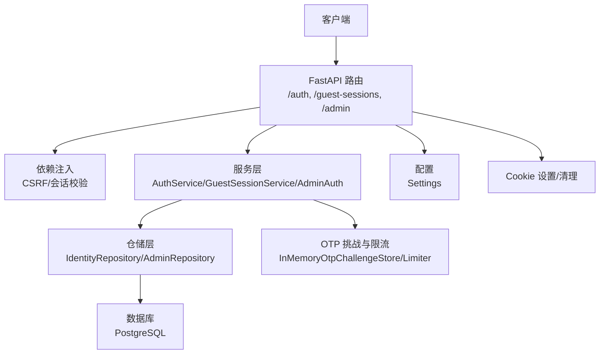
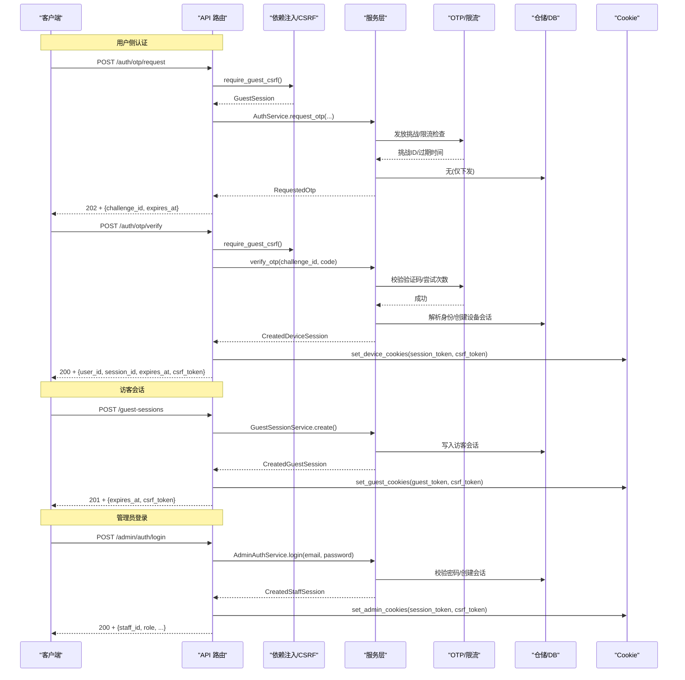
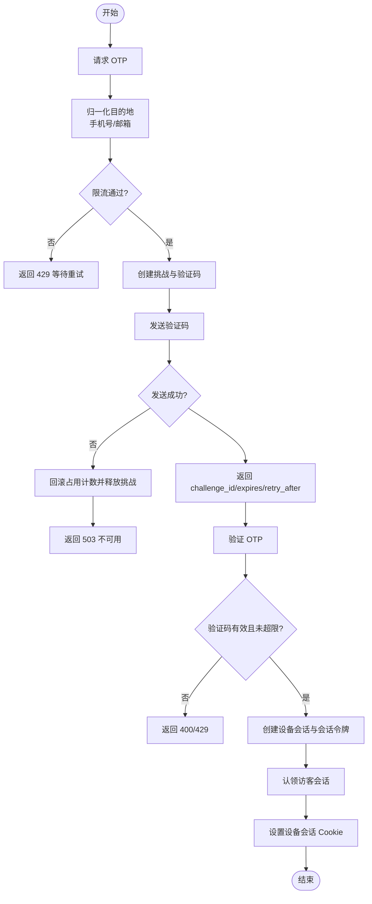
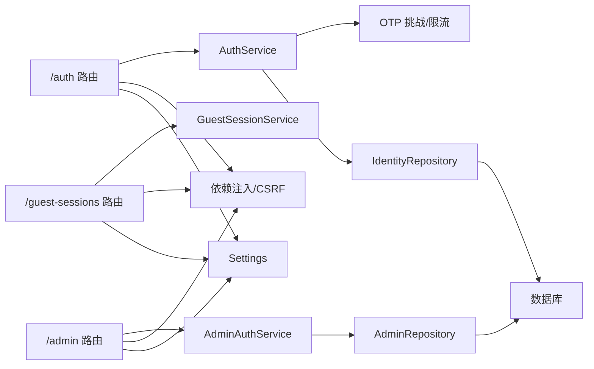

# 认证授权机制

<cite>
**本文引用的文件**
- [backend/app/api/auth.py](file://backend/app/api/auth.py)
- [backend/app/identity/service.py](file://backend/app/identity/service.py)
- [backend/app/identity/otp.py](file://backend/app/identity/otp.py)
- [backend/app/identity/security.py](file://backend/app/identity/security.py)
- [backend/app/identity/models.py](file://backend/app/identity/models.py)
- [backend/app/identity/cookies.py](file://backend/app/identity/cookies.py)
- [backend/app/api/guest_sessions.py](file://backend/app/api/guest_sessions.py)
- [backend/app/api/dependencies.py](file://backend/app/api/dependencies.py)
- [backend/app/config.py](file://backend/app/config.py)
- [backend/app/admin/service.py](file://backend/app/admin/service.py)
- [backend/app/admin/passwords.py](file://backend/app/admin/passwords.py)
- [backend/app/admin/models.py](file://backend/app/admin/models.py)
- [backend/app/api/admin.py](file://backend/app/api/admin.py)
- [backend/app/main.py](file://backend/app/main.py)
</cite>

## 目录
1. [简介](#简介)
2. [项目结构](#项目结构)
3. [核心组件](#核心组件)
4. [架构总览](#架构总览)
5. [详细组件分析](#详细组件分析)
6. [依赖关系分析](#依赖关系分析)
7. [性能与安全考量](#性能与安全考量)
8. [故障排查指南](#故障排查指南)
9. [结论](#结论)
10. [附录](#附录)

## 简介
本文件系统性梳理并说明该项目的认证与授权机制，覆盖以下主题：
- 身份认证流程：手机号 OTP 验证、邮箱 OTP 登录、访客会话管理
- 令牌与会话：令牌生成、验证、刷新与安全存储策略（基于服务端会话与 Cookie）
- 访问控制：管理员角色模型、用户角色定义与权限检查中间件
- 会话管理：Cookie 安全配置、会话生命周期、跨域请求处理
- 密码安全：哈希算法选择、盐值生成、密码强度校验
- 常见威胁防护与调试技巧

注意：本项目未使用 JWT；认证采用“服务端会话 + Cookie”模式，通过设备会话与会话令牌实现鉴权。

## 项目结构
后端以 FastAPI 为 API 框架，围绕 identity（用户身份）、admin（后台管理）、api（路由与依赖注入）等模块组织。认证相关的关键路径如下：
- 用户侧认证：/auth/*（OTP 请求、验证、登出）
- 访客会话：/guest-sessions/*（创建访客会话）
- 管理员认证：/admin/*（登录、登出、当前信息）
- 依赖注入与 CSRF：app/api/dependencies.py
- 会话与 Cookie：app/identity/cookies.py
- 配置与安全约束：app/config.py
- 应用启动与限流器初始化：app/main.py

图表来源
- [backend/app/api/auth.py:44-161](file://backend/app/api/auth.py#L44-L161)
- [backend/app/api/guest_sessions.py:16-53](file://backend/app/api/guest_sessions.py#L16-L53)
- [backend/app/api/admin.py:103-200](file://backend/app/api/admin.py#L103-L200)
- [backend/app/api/dependencies.py:19-137](file://backend/app/api/dependencies.py#L19-L137)
- [backend/app/identity/service.py:35-192](file://backend/app/identity/service.py#L35-L192)
- [backend/app/identity/otp.py:64-304](file://backend/app/identity/otp.py#L64-L304)
- [backend/app/config.py:62-335](file://backend/app/config.py#L62-L335)
- [backend/app/main.py:50-77](file://backend/app/main.py#L50-L77)

章节来源
- [backend/app/api/auth.py:44-161](file://backend/app/api/auth.py#L44-L161)
- [backend/app/api/guest_sessions.py:16-53](file://backend/app/api/guest_sessions.py#L16-L53)
- [backend/app/api/admin.py:103-200](file://backend/app/api/admin.py#L103-L200)
- [backend/app/api/dependencies.py:19-137](file://backend/app/api/dependencies.py#L19-L137)
- [backend/app/identity/service.py:35-192](file://backend/app/identity/service.py#L35-L192)
- [backend/app/identity/otp.py:64-304](file://backend/app/identity/otp.py#L64-L304)
- [backend/app/config.py:62-335](file://backend/app/config.py#L62-L335)
- [backend/app/main.py:50-77](file://backend/app/main.py#L50-L77)

## 核心组件
- 身份认证服务：负责 OTP 发放、验证、设备会话创建与审计记录
- 访客会话服务：创建短期访客会话，支持后续升级为正式用户
- 管理员认证服务：邮箱+密码登录、会话创建、审计与可选引导账户
- 依赖注入与 CSRF：统一校验会话有效性、双提交 CSRF 保护
- Cookie 工具：按环境安全地设置/清除会话与 CSRF Cookie
- 配置系统：强制生产环境安全策略（如禁用 fake OTP、强制 secure cookie）
- 数据模型：用户、登录标识、设备会话、访客会话、审计事件、管理员与会话

章节来源
- [backend/app/identity/service.py:35-192](file://backend/app/identity/service.py#L35-L192)
- [backend/app/api/guest_sessions.py:16-53](file://backend/app/api/guest_sessions.py#L16-L53)
- [backend/app/admin/service.py:33-148](file://backend/app/admin/service.py#L33-L148)
- [backend/app/api/dependencies.py:29-137](file://backend/app/api/dependencies.py#L29-L137)
- [backend/app/identity/cookies.py:12-102](file://backend/app/identity/cookies.py#L12-L102)
- [backend/app/config.py:62-335](file://backend/app/config.py#L62-L335)
- [backend/app/identity/models.py:31-132](file://backend/app/identity/models.py#L31-L132)
- [backend/app/admin/models.py:17-81](file://backend/app/admin/models.py#L17-L81)

## 架构总览
下图展示从客户端到数据库的完整调用链，包括 OTP 流程、访客会话与管理端登录。

图表来源
- [backend/app/api/auth.py:44-161](file://backend/app/api/auth.py#L44-L161)
- [backend/app/identity/service.py:100-192](file://backend/app/identity/service.py#L100-L192)
- [backend/app/identity/otp.py:221-304](file://backend/app/identity/otp.py#L221-L304)
- [backend/app/api/guest_sessions.py:16-53](file://backend/app/api/guest_sessions.py#L16-L53)
- [backend/app/api/admin.py:103-145](file://backend/app/api/admin.py#L103-L145)
- [backend/app/admin/service.py:49-89](file://backend/app/admin/service.py#L49-L89)

## 详细组件分析

### 手机号/邮箱 OTP 认证流程
- 入口：POST /auth/otp/request
  - 需要有效的访客会话与 CSRF（双提交）
  - 归一化目的地（手机号或邮箱），生成一次性挑战与验证码
  - 多层限流：按访客、网络、目标地址窗口限制
  - 发送验证码（适配器可替换），失败时回滚占用计数
- 入口：POST /auth/otp/verify
  - 校验挑战与验证码（含尝试次数上限）
  - 解析/创建用户与登录标识，创建设备会话与会话令牌
  - 将访客会话“认领”为用户所有（幂等保护）
  - 设置设备会话 Cookie（HttpOnly、SameSite=Lax、Secure 由环境决定）
- 入口：POST /auth/logout
  - 撤销设备会话，记录审计事件，清理 Cookie

图表来源
- [backend/app/api/auth.py:44-161](file://backend/app/api/auth.py#L44-L161)
- [backend/app/identity/service.py:100-192](file://backend/app/identity/service.py#L100-L192)
- [backend/app/identity/otp.py:64-304](file://backend/app/identity/otp.py#L64-L304)

章节来源
- [backend/app/api/auth.py:44-161](file://backend/app/api/auth.py#L44-L161)
- [backend/app/identity/service.py:100-192](file://backend/app/identity/service.py#L100-L192)
- [backend/app/identity/otp.py:183-304](file://backend/app/identity/otp.py#L183-L304)

### 访客会话管理
- 创建访客会话：POST /guest-sessions
  - 基于 IP 的速率限制
  - 生成访客 token 与 CSRF token，写入数据库（哈希存储）
  - 设置访客 Cookie（HttpOnly 的 token，非 HttpOnly 的 CSRF）
- 用途：作为 OTP 请求的前置凭据，防止滥用；认证成功后可被“认领”为用户

章节来源
- [backend/app/api/guest_sessions.py:16-53](file://backend/app/api/guest_sessions.py#L16-L53)
- [backend/app/identity/service.py:35-59](file://backend/app/identity/service.py#L35-L59)
- [backend/app/identity/cookies.py:35-60](file://backend/app/identity/cookies.py#L35-L60)

### 管理员认证与会话
- 登录：POST /admin/auth/login
  - 邮箱+密码校验（scrypt 哈希比对）
  - 可选引导账户（仅在 local/test 允许）
  - 创建管理员会话与会话令牌，设置管理员 Cookie
- 登出：POST /admin/auth/logout
  - 撤销会话，记录审计事件，清理 Cookie
- 当前用户：GET /admin/me
  - 返回管理员基本信息与会话元数据

章节来源
- [backend/app/api/admin.py:103-200](file://backend/app/api/admin.py#L103-L200)
- [backend/app/admin/service.py:49-148](file://backend/app/admin/service.py#L49-L148)
- [backend/app/admin/passwords.py:16-55](file://backend/app/admin/passwords.py#L16-L55)

### 令牌与会话机制（非 JWT）
- 令牌类型
  - 设备会话令牌：用于已认证用户的设备级会话
  - 访客会话令牌：用于未认证用户的临时会话
  - 管理员会话令牌：用于后台管理会话
- 令牌生成与存储
  - 使用安全随机字符串作为令牌
  - 数据库中仅存储令牌的哈希值，避免明文泄露风险
- 令牌验证
  - 从 Cookie 读取令牌，计算哈希后查询数据库中的活跃会话
  - 结合 CSRF 双提交校验，防止跨站请求伪造
- 刷新策略
  - 当前实现未提供显式刷新接口；可通过重新登录或再次触发 OTP 验证获得新会话
  - 会话有效期由配置项控制（设备会话天数、管理员会话小时数）

章节来源
- [backend/app/identity/security.py:5-11](file://backend/app/identity/security.py#L5-L11)
- [backend/app/identity/models.py:68-110](file://backend/app/identity/models.py#L68-L110)
- [backend/app/api/dependencies.py:72-120](file://backend/app/api/dependencies.py#L72-L120)
- [backend/app/config.py:122-145](file://backend/app/config.py#L122-L145)

### 基于角色的访问控制（RBAC）
- 管理员角色
  - 管理员用户包含角色字段（例如 superadmin），在登录响应中返回
  - 当前路由层未实现细粒度 RBAC 中间件；可在业务路由中根据角色进行判断
- 用户角色
  - 普通用户模型未包含角色字段；如需扩展，可在用户模型中添加角色字段并在依赖注入中校验
- 权限检查中间件
  - 当前主要依赖会话存在性与 CSRF 校验
  - 建议在敏感操作前增加基于角色的检查逻辑（例如在路由层或自定义依赖中）

章节来源
- [backend/app/admin/models.py:17-34](file://backend/app/admin/models.py#L17-L34)
- [backend/app/api/admin.py:103-145](file://backend/app/api/admin.py#L103-L145)
- [backend/app/identity/models.py:31-66](file://backend/app/identity/models.py#L31-L66)

### 会话管理与 Cookie 安全
- Cookie 名称
  - 访客会话：mingli_guest
  - 设备会话：mingli_session
  - CSRF：mingli_csrf
  - 管理员会话：见 admin.cookies（常量名）
- 安全属性
  - HttpOnly：会话 Cookie 启用，降低 XSS 窃取风险
  - SameSite：Lax，缓解跨站请求风险
  - Secure：生产环境强制启用（配置校验）
  - Domain/Path：按配置设置，便于跨子域共享
- 生命周期
  - 访客会话：固定时长（默认 24 小时）
  - 设备会话：可配置天数（默认 30 天）
  - 管理员会话：可配置小时数（默认 8 小时）
- 跨域请求处理
  - 通过 SameSite=Lax 与 CSRF 双提交共同防护
  - 若需跨域，请确保前端携带 x-csrf-token 头并与 Cookie 一致

章节来源
- [backend/app/identity/cookies.py:12-102](file://backend/app/identity/cookies.py#L12-L102)
- [backend/app/config.py:72-77](file://backend/app/config.py#L72-L77)
- [backend/app/api/dependencies.py:29-54](file://backend/app/api/dependencies.py#L29-L54)

### 密码安全策略
- 算法选择
  - 管理员密码使用 scrypt，参数 N=2^14、r=8、p=1，密钥长度 64 字节
- 盐值生成
  - 每次哈希使用随机盐（16 字节）
- 强度校验
  - 最小长度 8 字符，否则拒绝
- 验证方式
  - 解析编码串，提取参数与盐，重新计算并安全比较

章节来源
- [backend/app/admin/passwords.py:1-55](file://backend/app/admin/passwords.py#L1-L55)

### 常见安全威胁防护
- 暴力破解与重放攻击
  - OTP 挑战具备 TTL、冷却期与最大尝试次数
  - 多层限流：访客、网络、目标地址维度
- 跨站请求伪造（CSRF）
  - 双提交模式：Cookie 中的 CSRF token 与请求头 x-csrf-token 必须一致
  - 服务器端对 CSRF token 哈希进行比对
- 会话劫持
  - 会话令牌仅存哈希，Cookie 启用 HttpOnly 与 Secure（生产）
  - 登出时撤销会话并清理 Cookie
- 配置安全
  - 生产环境禁止使用 fake OTP、fake runtime/model、本地加密密钥等不安全配置

章节来源
- [backend/app/identity/otp.py:64-304](file://backend/app/identity/otp.py#L64-L304)
- [backend/app/api/dependencies.py:29-120](file://backend/app/api/dependencies.py#L29-L120)
- [backend/app/config.py:188-329](file://backend/app/config.py#L188-L329)

### 调试技巧
- 开发环境 OTP 测试码
  - 在 local/test 环境且使用 fake OTP 适配器时，返回 fake_otp_code
- 日志与审计
  - 登录、登出、OTP 验证等操作均记录审计事件，便于追踪
- 限流与错误码
  - 429：请求过多，查看 retry_after_seconds
  - 503：OTP 投递不可用，稍后重试
  - 400/401/403：分别对应无效/未认证/CSRF 失败

章节来源
- [backend/app/api/auth.py:83-87](file://backend/app/api/auth.py#L83-L87)
- [backend/app/identity/service.py:176-183](file://backend/app/identity/service.py#L176-L183)
- [backend/app/api/admin.py:117-128](file://backend/app/api/admin.py#L117-L128)

## 依赖关系分析

图表来源
- [backend/app/api/auth.py:44-161](file://backend/app/api/auth.py#L44-L161)
- [backend/app/api/guest_sessions.py:16-53](file://backend/app/api/guest_sessions.py#L16-L53)
- [backend/app/api/admin.py:103-200](file://backend/app/api/admin.py#L103-L200)
- [backend/app/identity/service.py:78-192](file://backend/app/identity/service.py#L78-L192)
- [backend/app/admin/service.py:33-148](file://backend/app/admin/service.py#L33-L148)
- [backend/app/api/dependencies.py:19-137](file://backend/app/api/dependencies.py#L19-L137)
- [backend/app/config.py:62-335](file://backend/app/config.py#L62-L335)

章节来源
- [backend/app/api/auth.py:44-161](file://backend/app/api/auth.py#L44-L161)
- [backend/app/api/guest_sessions.py:16-53](file://backend/app/api/guest_sessions.py#L16-L53)
- [backend/app/api/admin.py:103-200](file://backend/app/api/admin.py#L103-L200)
- [backend/app/identity/service.py:78-192](file://backend/app/identity/service.py#L78-L192)
- [backend/app/admin/service.py:33-148](file://backend/app/admin/service.py#L33-L148)
- [backend/app/api/dependencies.py:19-137](file://backend/app/api/dependencies.py#L19-L137)
- [backend/app/config.py:62-335](file://backend/app/config.py#L62-L335)

## 性能与安全考量
- 性能
  - OTP 挑战与限流使用内存结构，适合本地/测试；生产建议替换为 Redis 以支持多实例
  - 会话查询基于哈希索引，减少全表扫描
  - 审计事件异步写入可降低主路径延迟（当前同步写入，可根据负载调整）
- 安全
  - 生产环境强制 secure cookie、禁用 fake 适配器与本地密钥
  - 所有敏感令牌仅存哈希，避免泄露
  - CSRF 双提交与 SameSite 组合防护跨站请求
  - 密码哈希使用 scrypt，参数可调以平衡安全性与性能

[本节为通用指导，不直接分析具体文件]

## 故障排查指南
- 429 Too Many Requests
  - 检查 OTP 冷却期与多层限流配置
  - 确认是否在同一访客/网络/目标地址窗口内频繁请求
- 503 OTP Delivery Unavailable
  - 检查邮件适配器配置与连接状态
  - 关注回滚逻辑是否正确释放占用计数
- 401 Authentication Required
  - 检查 Cookie 是否存在且未过期
  - 确认会话是否被撤销或失效
- 403 CSRF Validation Failed
  - 确认请求头 x-csrf-token 与 Cookie 中的 CSRF token 一致
  - 检查跨域请求是否携带正确头部
- 400 Invalid or Expired Code
  - 检查 OTP 是否过期或尝试次数超限
  - 确认挑战 ID 与验证码匹配

章节来源
- [backend/app/api/auth.py:69-110](file://backend/app/api/auth.py#L69-L110)
- [backend/app/api/dependencies.py:29-120](file://backend/app/api/dependencies.py#L29-L120)
- [backend/app/identity/otp.py:221-304](file://backend/app/identity/otp.py#L221-L304)

## 结论
本项目采用“服务端会话 + Cookie”的认证授权方案，具备完善的 OTP 流程、访客会话管理、管理员认证与会话安全策略。通过严格的配置校验、CSRF 双提交、多层限流与审计记录，有效抵御常见安全威胁。未来可扩展 RBAC 中间件与令牌刷新机制以满足更复杂的权限与体验需求。

[本节为总结性内容，不直接分析具体文件]

## 附录
- 关键配置项
  - OTP：TTL、冷却期、最大尝试次数、速率窗口与限制
  - 会话：设备会话天数、管理员会话小时数
  - Cookie：secure、domain、path
  - 生产安全：禁用 fake 适配器、强制 secure cookie、注入必要密钥
- 数据模型
  - 用户、登录标识、设备会话、访客会话、审计事件
  - 管理员用户、管理员会话、管理员审计事件

章节来源
- [backend/app/config.py:122-145](file://backend/app/config.py#L122-L145)
- [backend/app/identity/models.py:31-132](file://backend/app/identity/models.py#L31-L132)
- [backend/app/admin/models.py:17-81](file://backend/app/admin/models.py#L17-L81)