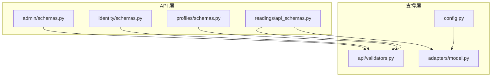
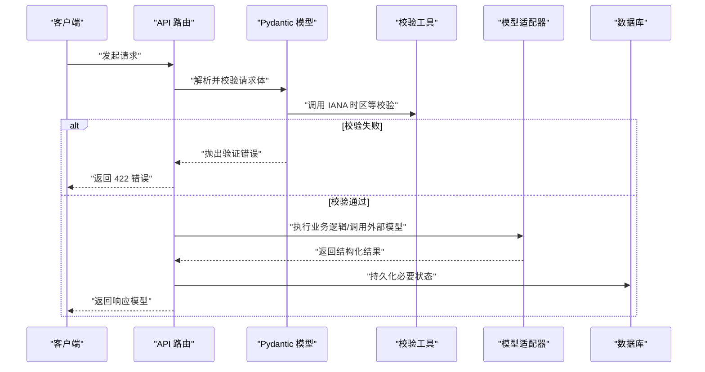
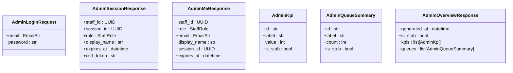
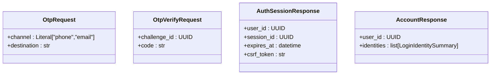
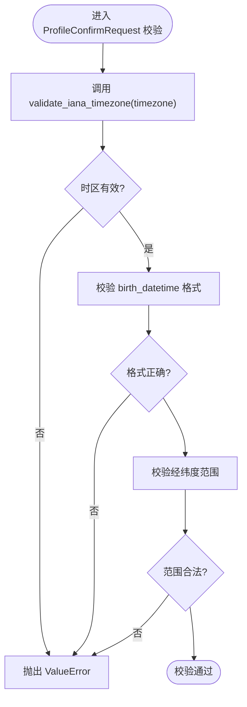
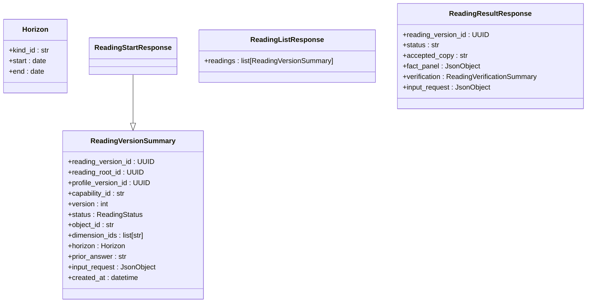
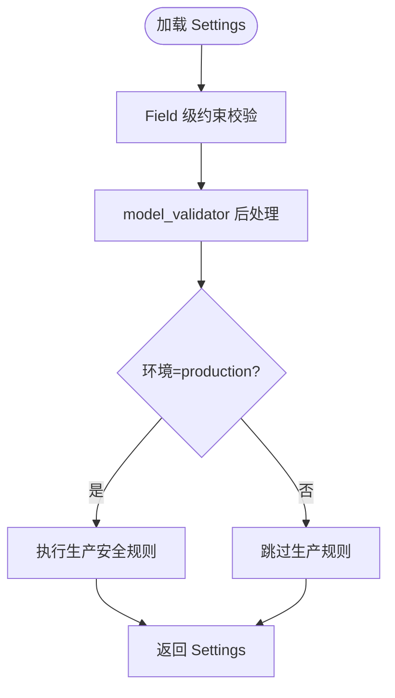
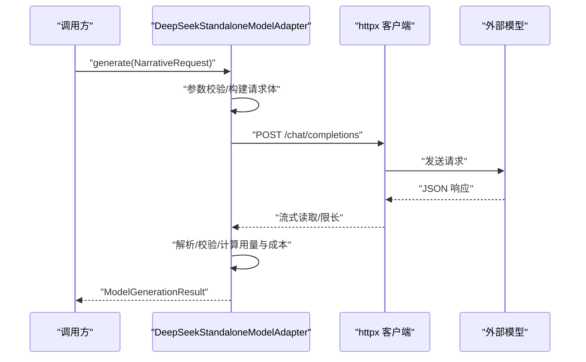
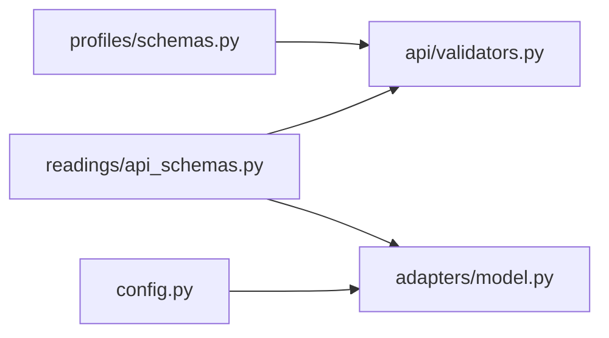

# Pydantic 数据模型

<cite>
**本文引用的文件**
- [backend/app/admin/schemas.py](file://backend/app/admin/schemas.py)
- [backend/app/identity/schemas.py](file://backend/app/identity/schemas.py)
- [backend/app/profiles/schemas.py](file://backend/app/profiles/schemas.py)
- [backend/app/readings/api_schemas.py](file://backend/app/readings/api_schemas.py)
- [backend/app/config.py](file://backend/app/config.py)
- [backend/app/api/validators.py](file://backend/app/api/validators.py)
- [backend/app/adapters/model.py](file://backend/app/adapters/model.py)
</cite>

## 目录
1. [简介](#简介)
2. [项目结构](#项目结构)
3. [核心组件](#核心组件)
4. [架构总览](#架构总览)
5. [详细组件分析](#详细组件分析)
6. [依赖关系分析](#依赖关系分析)
7. [性能考虑](#性能考虑)
8. [故障排查指南](#故障排查指南)
9. [结论](#结论)
10. [附录](#附录)

## 简介
本文件系统性梳理项目中基于 Pydantic v2 的数据模型设计，覆盖请求模型、响应模型与共享配置模型的职责边界、字段约束、默认值、验证规则与序列化配置。重点说明：
- 字段类型约束与默认值策略（含枚举、范围、模式匹配、可选字段）
- 验证器集成（field_validator、model_validator）与外部数据源校验（IANA 时区）
- 模型继承与组合模式（基础模型复用、复杂对象构建）
- 异步场景下的验证与错误处理（结合适配器层）
- 版本管理与向后兼容策略（OpenAPI/Schema 对齐、严格拒绝多余字段）
- 最佳实践与迁移建议

## 项目结构
后端模块按领域划分，Pydantic 模型集中在以下位置：
- 管理端 API 模型：admin/schemas.py
- 身份与会话模型：identity/schemas.py
- 用户画像模型：profiles/schemas.py
- 命理解读 API 模型：readings/api_schemas.py
- 运行时配置模型：config.py（Settings）
- 通用校验工具：api/validators.py
- 模型适配器（含内部数据结构与契约）：adapters/model.py

图表来源
- [backend/app/admin/schemas.py:1-68](file://backend/app/admin/schemas.py#L1-L68)
- [backend/app/identity/schemas.py:1-62](file://backend/app/identity/schemas.py#L1-L62)
- [backend/app/profiles/schemas.py:1-60](file://backend/app/profiles/schemas.py#L1-L60)
- [backend/app/readings/api_schemas.py:1-130](file://backend/app/readings/api_schemas.py#L1-L130)
- [backend/app/api/validators.py:1-10](file://backend/app/api/validators.py#L1-L10)
- [backend/app/config.py:62-149](file://backend/app/config.py#L62-L149)
- [backend/app/adapters/model.py:144-196](file://backend/app/adapters/model.py#L144-L196)

章节来源
- [backend/app/admin/schemas.py:1-68](file://backend/app/admin/schemas.py#L1-L68)
- [backend/app/identity/schemas.py:1-62](file://backend/app/identity/schemas.py#L1-L62)
- [backend/app/profiles/schemas.py:1-60](file://backend/app/profiles/schemas.py#L1-L60)
- [backend/app/readings/api_schemas.py:1-130](file://backend/app/readings/api_schemas.py#L1-L130)
- [backend/app/config.py:62-149](file://backend/app/config.py#L62-L149)
- [backend/app/api/validators.py:1-10](file://backend/app/api/validators.py#L1-L10)
- [backend/app/adapters/model.py:144-196](file://backend/app/adapters/model.py#L144-L196)

## 核心组件
- 管理端模型：登录、会话、个人信息、概览指标与队列摘要
- 身份与会话模型：访客会话、OTP 流程、认证会话、账户信息
- 画像模型：草稿创建、确认提交、列表汇总
- 命理解读模型：开始读取、后续跟进、验证反馈、结果返回、时间范围
- 配置模型：应用运行参数、安全限制、速率限制、生产环境强约束
- 校验工具：IANA 时区有效性校验

章节来源
- [backend/app/admin/schemas.py:14-68](file://backend/app/admin/schemas.py#L14-L68)
- [backend/app/identity/schemas.py:8-62](file://backend/app/identity/schemas.py#L8-L62)
- [backend/app/profiles/schemas.py:10-60](file://backend/app/profiles/schemas.py#L10-L60)
- [backend/app/readings/api_schemas.py:17-130](file://backend/app/readings/api_schemas.py#L17-L130)
- [backend/app/config.py:62-149](file://backend/app/config.py#L62-L149)
- [backend/app/api/validators.py:4-10](file://backend/app/api/validators.py#L4-L10)

## 架构总览
Pydantic 模型在 API 层承担“输入校验 + 输出序列化”的职责；配置模型负责集中式参数加载与安全策略；校验工具提供跨模块复用的业务规则；适配器层将外部模型调用封装为统一接口并产出审计收据。

图表来源
- [backend/app/readings/api_schemas.py:17-130](file://backend/app/readings/api_schemas.py#L17-L130)
- [backend/app/api/validators.py:4-10](file://backend/app/api/validators.py#L4-L10)
- [backend/app/adapters/model.py:200-334](file://backend/app/adapters/model.py#L200-L334)

## 详细组件分析

### 管理端 API 模型（admin/schemas.py）
- 设计要点
  - 使用 ConfigDict(extra="forbid") 禁止额外字段，确保严格的请求/响应契约
  - 使用 EmailStr 进行邮箱格式校验
  - 使用 Field 的 min_length/max_length/ge 等约束保证长度与数值范围
  - 使用 Literal 限定角色枚举
- 关键模型
  - AdminLoginRequest：登录请求，包含邮箱与密码长度约束
  - AdminSessionResponse/AdminMeResponse：会话与当前管理员信息
  - AdminKpi/AdminQueueSummary：指标与队列摘要，value/count 非负
  - AdminOverviewResponse：聚合概览，包含生成时间与是否占位标记

图表来源
- [backend/app/admin/schemas.py:14-68](file://backend/app/admin/schemas.py#L14-L68)

章节来源
- [backend/app/admin/schemas.py:14-68](file://backend/app/admin/schemas.py#L14-L68)

### 身份与会话模型（identity/schemas.py）
- 设计要点
  - 严格 forbid 额外字段
  - 使用 Literal 固定状态与渠道
  - OTP 验证码使用正则 pattern 校验六位数字
  - 支持 from_attributes=True 用于从 ORM 对象构造响应
- 关键模型
  - GuestSessionResponse/OtpRequest/OtpChallengeResponse/OtpVerifyRequest/AuthSessionResponse/LoginIdentitySummary/AccountResponse

图表来源
- [backend/app/identity/schemas.py:16-62](file://backend/app/identity/schemas.py#L16-L62)

章节来源
- [backend/app/identity/schemas.py:8-62](file://backend/app/identity/schemas.py#L8-L62)

### 画像模型（profiles/schemas.py）
- 设计要点
  - 使用 field_validator 对 timezone 调用 IANA 时区校验函数
  - birth_datetime 使用 ISO 8601 风格正则约束
  - 坐标范围 ge/le 限制经纬度合法区间
  - 性别与时基策略使用 Literal 枚举
- 关键模型
  - ProfileDraftRequest/ProfileConfirmRequest/ProfileSummary/ProfileListResponse

图表来源
- [backend/app/profiles/schemas.py:23-44](file://backend/app/profiles/schemas.py#L23-L44)
- [backend/app/api/validators.py:4-10](file://backend/app/api/validators.py#L4-L10)

章节来源
- [backend/app/profiles/schemas.py:10-60](file://backend/app/profiles/schemas.py#L10-L60)
- [backend/app/api/validators.py:4-10](file://backend/app/api/validators.py#L4-L10)

### 命理解读 API 模型（readings/api_schemas.py）
- 设计要点
  - 使用 Annotated + Field 定义复合类型 LiuyaoCast（长度为 6、元素取值 6-9）
  - 使用 field_validator 对 timezone 做 IANA 校验
  - Horizon 表示可选起止日期的时间范围
  - ReadingVersionSummary 作为多种响应的基础模型，体现继承复用
  - 所有模型均 forbid 额外字段，保障 OpenAPI 契约一致性
- 关键模型
  - PreviewStartRequest/FortuneStartRequest/LiuyaoStartRequest/SupplyInputRequest/FollowUpRequest/VerificationRequest/Horizon/ReadingVersionSummary/ReadingStartResponse/ReadingListResponse/ReadingVerificationSummary/ReadingResultResponse

图表来源
- [backend/app/readings/api_schemas.py:76-130](file://backend/app/readings/api_schemas.py#L76-L130)

章节来源
- [backend/app/readings/api_schemas.py:1-130](file://backend/app/readings/api_schemas.py#L1-L130)

### 配置模型（config.py）
- 设计要点
  - 使用 SettingsConfigDict 设置环境变量前缀、大小写不敏感、忽略多余键
  - 大量使用 Field 的 ge/gt/le/pattern 等约束，确保数值与字符串合法性
  - SecretStr 保护敏感信息（如 API Key、加密密钥）
  - model_validator(mode="after") 实现跨字段联合校验与环境安全策略
  - settings_customise_sources 自定义配置源，过滤敏感字段避免泄露
- 关键特性
  - 生产环境强制安全策略（Cookie 安全、禁用 fake 适配器、固定路径、白名单模型配置）
  - 超时、温度、最大输出 token、响应字节上限等模型调用参数受控
  - 内容加密密钥必须为有效的 base64 且长度固定，禁止与身份哈希密钥复用

图表来源
- [backend/app/config.py:62-149](file://backend/app/config.py#L62-L149)
- [backend/app/config.py:188-329](file://backend/app/config.py#L188-L329)

章节来源
- [backend/app/config.py:62-149](file://backend/app/config.py#L62-L149)
- [backend/app/config.py:188-329](file://backend/app/config.py#L188-L329)

### 校验工具（api/validators.py）
- 功能：验证 IANA 时区名称的有效性，无效时抛出 ValueError
- 复用方式：被 profiles 与 readings 的 field_validator 调用，确保时区一致性

章节来源
- [backend/app/api/validators.py:4-10](file://backend/app/api/validators.py#L4-L10)

### 模型适配器（adapters/model.py）
- 作用：封装外部模型调用（DeepSeek），统一输入输出与审计收据
- 关键点
  - 构造参数严格校验（超时、温度、最大输出 token、响应大小）
  - 请求体规范化与指纹计算，响应体限流与解码校验
  - 错误码标准化，取消与超时分别处理
  - 价格快照与用量统计，成本计算
- 与 Pydantic 的关系：适配器内部使用 dataclass 与 Protocol 表达契约，配合 Pydantic 模型完成端到端数据流转

图表来源
- [backend/app/adapters/model.py:144-196](file://backend/app/adapters/model.py#L144-L196)
- [backend/app/adapters/model.py:200-334](file://backend/app/adapters/model.py#L200-L334)

章节来源
- [backend/app/adapters/model.py:144-196](file://backend/app/adapters/model.py#L144-L196)
- [backend/app/adapters/model.py:200-334](file://backend/app/adapters/model.py#L200-L334)

## 依赖关系分析
- 模型间耦合
  - readings/api_schemas.py 中的 ReadingStartResponse 继承自 ReadingVersionSummary，体现“基础模型复用 + 扩展”的组合模式
  - profiles 与 readings 共用同一 IANA 时区校验工具，降低重复逻辑
- 外部依赖
  - config.py 依赖 pydantic_settings 与自定义 Source，实现环境变量与敏感字段过滤
  - adapters/model.py 依赖 httpx 与外部模型服务，并通过 Pydantic 模型完成输入输出契约

图表来源
- [backend/app/profiles/schemas.py:10-44](file://backend/app/profiles/schemas.py#L10-L44)
- [backend/app/readings/api_schemas.py:17-55](file://backend/app/readings/api_schemas.py#L17-L55)
- [backend/app/config.py:62-149](file://backend/app/config.py#L62-L149)
- [backend/app/adapters/model.py:144-196](file://backend/app/adapters/model.py#L144-L196)

章节来源
- [backend/app/profiles/schemas.py:10-44](file://backend/app/profiles/schemas.py#L10-L44)
- [backend/app/readings/api_schemas.py:17-55](file://backend/app/readings/api_schemas.py#L17-L55)
- [backend/app/config.py:62-149](file://backend/app/config.py#L62-L149)
- [backend/app/adapters/model.py:144-196](file://backend/app/adapters/model.py#L144-L196)

## 性能考虑
- 请求体最小化：使用 forbid 额外字段减少反序列化开销与攻击面
- 数值与长度约束：通过 Field 的 ge/gt/le/min_length/max_length 尽早拦截非法输入，避免昂贵下游处理
- 时区校验：集中到 validators.py，避免重复解析与异常分支
- 适配器层限流：响应体大小限制、超时控制、token 用量上限，防止资源耗尽
- 配置项边界：生产环境冻结关键参数（温度、最大输出 token、超时、路径），降低运行时抖动

## 故障排查指南
- 常见验证错误
  - 时区无效：检查 timezone 是否为合法 IANA 名称（参考 validators.py）
  - 字段缺失或多余：确认请求体与模型字段一致，extra="forbid" 会拒绝未知字段
  - 数值越界：检查 ge/gt/le 约束，尤其是坐标、配额、超时等
  - 模式不匹配：birth_datetime、验证码等需符合正则
- 配置问题
  - 生产环境安全策略失败：检查 cookie_secure、otp_adapter、路径白名单、密钥注入
  - 模型调用失败：检查超时、温度、最大输出 token、响应大小限制是否符合配置
- 定位方法
  - 查看 Pydantic 验证错误堆栈，定位具体字段
  - 检查适配器层的错误码与收据（receipt），区分网络、超时、上游错误与解析错误

章节来源
- [backend/app/api/validators.py:4-10](file://backend/app/api/validators.py#L4-L10)
- [backend/app/config.py:188-329](file://backend/app/config.py#L188-L329)
- [backend/app/adapters/model.py:200-334](file://backend/app/adapters/model.py#L200-L334)

## 结论
本项目以 Pydantic v2 为核心，构建了严格的 API 契约与安全的配置体系：
- 通过 forbid 额外字段、枚举与范围约束，确保输入输出的稳定性与可预测性
- 借助 field_validator 与 model_validator，将跨模块的业务规则与生产安全策略集中管理
- 采用基础模型继承与组合，提升可读性与复用性
- 在适配器层实现对外部模型的稳定封装与审计，保障可观测性与成本控制
- 版本管理上，通过严格契约与 OpenAPI 对齐，便于向后兼容与平滑迁移

## 附录
- 最佳实践
  - 新增字段优先设为可选并提供默认值，逐步推进必填
  - 使用 Literal 表达有限集合，避免魔法字符串
  - 将复杂校验抽取为独立 validator，保持模型简洁
  - 对敏感字段使用 SecretStr，并在日志中避免泄露
  - 生产环境冻结关键参数，变更走评审与灰度
- 迁移方案
  - 引入新字段时保留旧字段一段时间，提供兼容性映射
  - 通过 model_validator 实现渐进式弃用提示
  - 更新 OpenAPI/Schema 文档，同步前端与测试用例
  - 使用迁移脚本与回滚策略，确保数据一致性