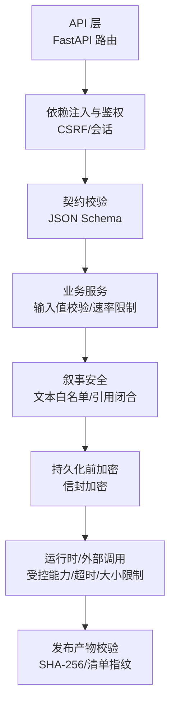
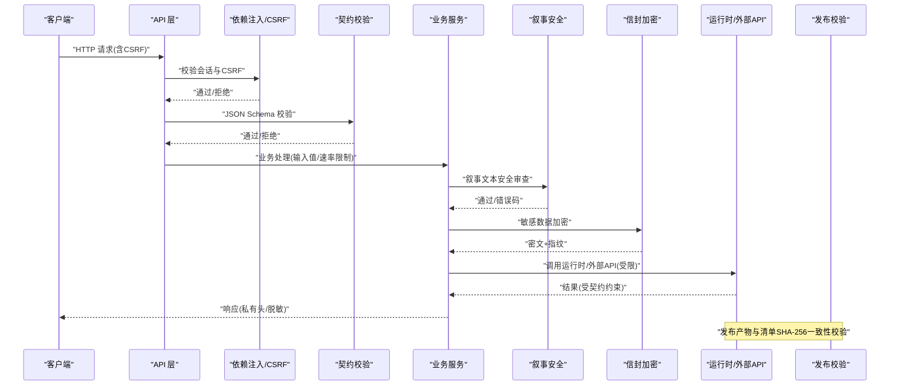
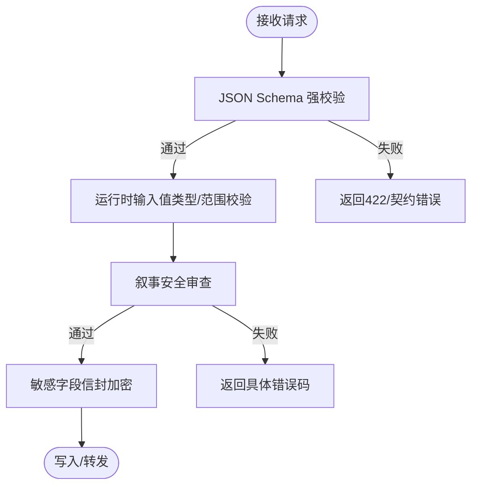
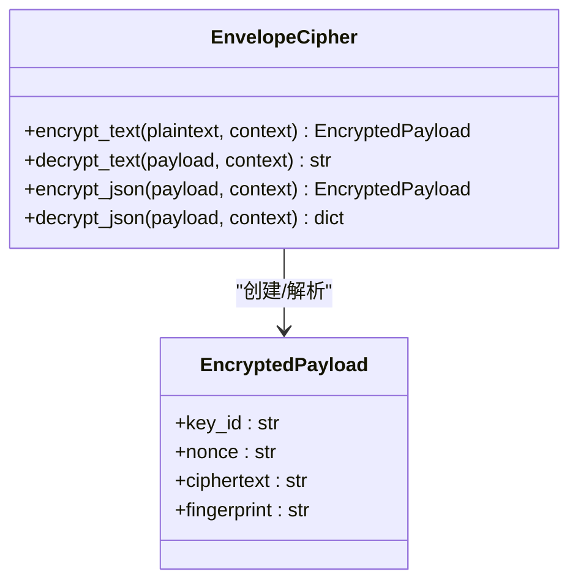
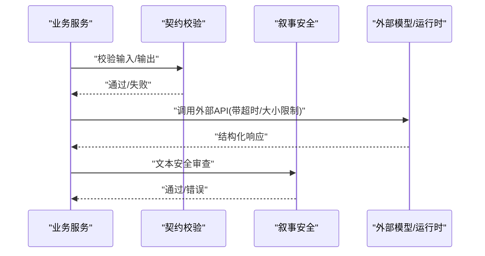
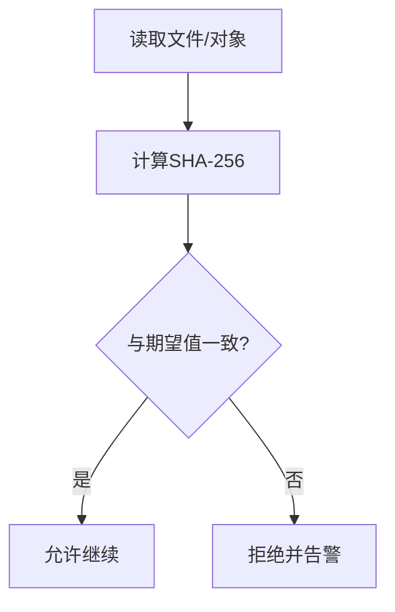
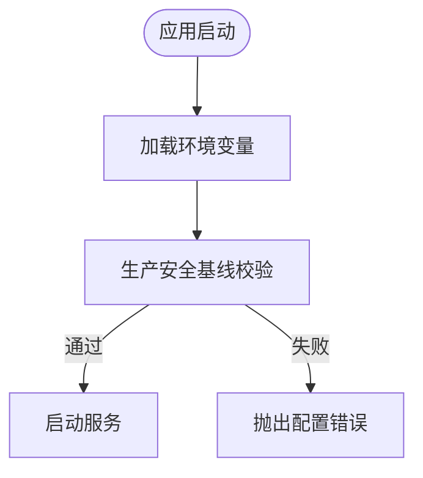
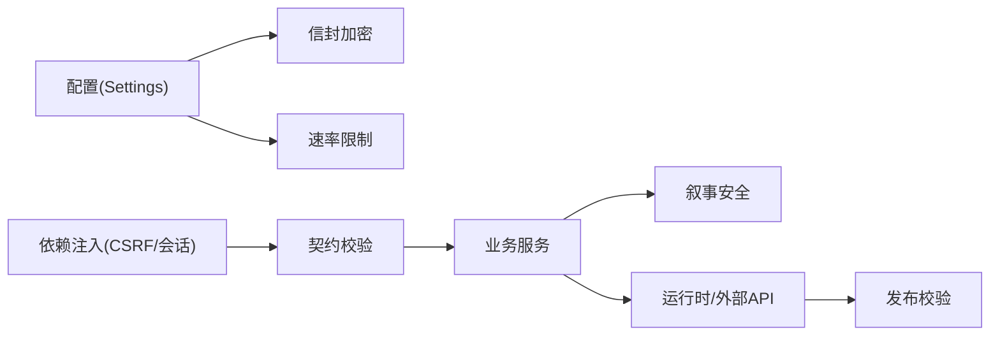

# 数据清洗与安全

<cite>
**本文引用的文件**
- [backend/app/config.py](file://backend/app/config.py)
- [backend/app/security/envelope.py](file://backend/app/security/envelope.py)
- [backend/app/api/dependencies.py](file://backend/app/api/dependencies.py)
- [backend/app/readings/runtime_contracts.py](file://backend/app/readings/runtime_contracts.py)
- [backend/app/readings/narrative_guard.py](file://backend/app/readings/narrative_guard.py)
- [backend/app/readings/capability_policy.py](file://backend/app/readings/capability_policy.py)
- [backend/app/readings/service.py](file://backend/app/readings/service.py)
- [backend/app/api/rate_guard.py](file://backend/app/api/rate_guard.py)
- [backend/app/identity/security.py](file://backend/app/identity/security.py)
- [contracts/schemas/mingli-command-v2.schema.json](file://contracts/schemas/mingli-command-v2.schema.json)
- [contracts/schemas/mingli-result-v2.schema.json](file://contracts/schemas/mingli-result-v2.schema.json)
- [infra/mingli-runtime/verify_release.py](file://infra/mingli-runtime/verify_release.py)
- [scripts/server_task13_trajectory_payload.py](file://scripts/server_task13_trajectory_payload.py)
</cite>

## 目录
1. [简介](#简介)
2. [项目结构](#项目结构)
3. [核心组件](#核心组件)
4. [架构总览](#架构总览)
5. [详细组件分析](#详细组件分析)
6. [依赖关系分析](#依赖关系分析)
7. [性能考量](#性能考量)
8. [故障排查指南](#故障排查指南)
9. [结论](#结论)
10. [附录](#附录)

## 简介
本文件聚焦于“数据清洗与安全”的端到端实现与规范，覆盖输入清洗（XSS、SQL注入防护、格式标准化）、敏感数据处理（信封加密、密钥管理、脱敏）、外部数据验证（第三方 API 响应校验、文件格式校验、内容安全检查）、数据完整性保障（哈希、数字签名、防篡改）、安全配置管理（环境变量校验、基线检查）以及安全编码规范与漏洞防护指南。文档以代码为依据，提供可视化流程图与时序图，帮助读者快速理解并落地实践。

## 项目结构
后端采用模块化组织：配置与运行时安全在 app/config.py；敏感数据加密封装在 app/security/envelope.py；请求级鉴权与 CSRF 在 app/api/dependencies.py；外部契约与 JSON Schema 校验在 app/readings/runtime_contracts.py；叙事输出安全在 app/readings/narrative_guard.py；能力暴露策略在 app/readings/capability_policy.py；输入值类型与范围校验在 app/readings/service.py；速率限制在 app/api/rate_guard.py；令牌与哈希工具在 app/identity/security.py；发布产物完整性校验在 infra/mingli-runtime/verify_release.py；测试与证据扫描在 scripts/server_task13_trajectory_payload.py。

**图表来源**
- [backend/app/api/dependencies.py:29-136](file://backend/app/api/dependencies.py#L29-L136)
- [backend/app/readings/runtime_contracts.py:27-39](file://backend/app/readings/runtime_contracts.py#L27-L39)
- [backend/app/readings/narrative_guard.py:70-190](file://backend/app/readings/narrative_guard.py#L70-L190)
- [backend/app/security/envelope.py:32-121](file://backend/app/security/envelope.py#L32-L121)
- [infra/mingli-runtime/verify_release.py:372-390](file://infra/mingli-runtime/verify_release.py#L372-L390)

**章节来源**
- [backend/app/config.py:62-149](file://backend/app/config.py#L62-L149)
- [backend/app/api/dependencies.py:29-136](file://backend/app/api/dependencies.py#L29-L136)
- [backend/app/readings/runtime_contracts.py:18-39](file://backend/app/readings/runtime_contracts.py#L18-L39)

## 核心组件
- 配置与安全基线：集中式 Settings 通过环境变量加载，并在生产环境强制启用严格的安全约束（Cookie Secure、禁用 fake 适配器、固定路径、冻结模型参数、资源上限等）。
- 信封加密：使用 AES-256-GCM 对敏感内容进行认证加密，附带领域上下文与 HMAC 指纹，防止篡改与误用。
- 请求级安全：基于双提交 CSRF、会话 Cookie 与数据库中的哈希比对，保护写操作；私有响应头禁止缓存与索引。
- 契约校验：所有进入系统的外部 JSON 均通过冻结的 JSON Schema 进行强校验，拒绝未知字段与非法类型。
- 叙事安全：对生成文本进行白名单规则校验，禁止内部标识泄露、概率/保证性措辞与未经验证的精确数值。
- 能力策略：仅暴露 P0 能力集合，并通过产品路由将动作映射到受控能力。
- 输入值校验：按运行时输入字段策略进行类型与范围校验，越界即失败。
- 速率限制：针对写操作与 OTP 发送实施窗口限流，返回标准重试头。
- 发布完整性：对运行时代码树、镜像、清单等进行 SHA-256 校验，确保制品未被替换。

**章节来源**
- [backend/app/config.py:188-329](file://backend/app/config.py#L188-L329)
- [backend/app/security/envelope.py:32-121](file://backend/app/security/envelope.py#L32-L121)
- [backend/app/api/dependencies.py:29-136](file://backend/app/api/dependencies.py#L29-L136)
- [backend/app/readings/runtime_contracts.py:27-39](file://backend/app/readings/runtime_contracts.py#L27-L39)
- [backend/app/readings/narrative_guard.py:70-190](file://backend/app/readings/narrative_guard.py#L70-L190)
- [backend/app/readings/capability_policy.py:53-67](file://backend/app/readings/capability_policy.py#L53-L67)
- [backend/app/readings/service.py:743-773](file://backend/app/readings/service.py#L743-L773)
- [backend/app/api/rate_guard.py:5-19](file://backend/app/api/rate_guard.py#L5-L19)
- [infra/mingli-runtime/verify_release.py:372-390](file://infra/mingli-runtime/verify_release.py#L372-L390)

## 架构总览
下图展示从请求入口到落库与对外输出的关键安全环节：CSRF/会话校验 → JSON Schema 契约校验 → 业务输入值校验 → 叙事安全审查 → 信封加密 → 外部运行时/模型调用（受限）→ 发布产物完整性校验。

**图表来源**
- [backend/app/api/dependencies.py:29-136](file://backend/app/api/dependencies.py#L29-L136)
- [backend/app/readings/runtime_contracts.py:27-39](file://backend/app/readings/runtime_contracts.py#L27-L39)
- [backend/app/readings/narrative_guard.py:70-190](file://backend/app/readings/narrative_guard.py#L70-L190)
- [backend/app/security/envelope.py:56-96](file://backend/app/security/envelope.py#L56-L96)
- [infra/mingli-runtime/verify_release.py:372-390](file://infra/mingli-runtime/verify_release.py#L372-L390)

## 详细组件分析

### 输入数据清洗与格式标准化
- XSS 防护：前端与后端共同防御。后端通过 JSON Schema 严格限定结构与类型，禁止额外字段；叙事安全模块过滤内部标识与不当措辞，避免脚本注入或信息泄露。
- SQL 注入防护：通过 ORM 与参数化查询（由框架与驱动保证），结合最小权限原则与只读视图（如适用），避免拼接 SQL。
- 格式标准化：统一使用 JSON Schema 冻结接口；时间、枚举、数组长度、唯一性等均在 schema 中声明；IANA 时区名称通过专用校验器验证。

**图表来源**
- [backend/app/readings/runtime_contracts.py:27-39](file://backend/app/readings/runtime_contracts.py#L27-L39)
- [backend/app/readings/service.py:751-773](file://backend/app/readings/service.py#L751-L773)
- [backend/app/readings/narrative_guard.py:70-190](file://backend/app/readings/narrative_guard.py#L70-L190)
- [backend/app/security/envelope.py:56-96](file://backend/backend/app/security/envelope.py#L56-L96)

**章节来源**
- [contracts/schemas/mingli-command-v2.schema.json:1-126](file://contracts/schemas/mingli-command-v2.schema.json#L1-L126)
- [contracts/schemas/mingli-result-v2.schema.json:1-392](file://contracts/schemas/mingli-result-v2.schema.json#L1-L392)
- [backend/app/readings/service.py:751-773](file://backend/app/readings/service.py#L751-L773)
- [backend/app/readings/narrative_guard.py:70-190](file://backend/app/readings/narrative_guard.py#L70-L190)

### 敏感数据处理：信封加密、密钥管理与数据脱敏
- 信封加密：使用 AES-256-GCM 对明文进行认证加密，附加领域上下文（AAD）与 HMAC 指纹，解密时校验 key_id、上下文与指纹，任何篡改或不匹配即失败。
- 密钥管理：内容加密密钥必须为有效的 Base64 且恰好 32 字节；生产环境禁止本地默认密钥，禁止与身份哈希密钥复用；密钥 ID 用于多版本密钥轮换。
- 数据脱敏：日志与证据扫描中识别敏感标记（如状态令牌、提示词、API Key、原始出生时间等），并对邮箱等个人信息进行掩码处理，避免回显 Cookie Token。

**图表来源**
- [backend/app/security/envelope.py:24-121](file://backend/app/security/envelope.py#L24-L121)

**章节来源**
- [backend/app/security/envelope.py:32-121](file://backend/app/security/envelope.py#L32-L121)
- [backend/app/config.py:217-236](file://backend/app/config.py#L217-L236)
- [scripts/server_task13_trajectory_payload.py:95-125](file://scripts/server_task13_trajectory_payload.py#L95-L125)
- [scripts/server_task13_trajectory_payload.py:202-216](file://scripts/server_task13_trajectory_payload.py#L202-L216)

### 外部数据验证：第三方 API 响应、文件格式与内容安全
- 第三方 API 响应：通过 JSON Schema 冻结协议（命令/结果），任何不符合结构的响应将被拒绝；同时限制模型响应体大小与超时，防止资源耗尽。
- 文件格式校验：运行时输入字段按 type_id 进行严格类型检查（整数、文本、选择），并支持最小/最大范围约束。
- 内容安全检查：叙事安全模块禁止内部标识可见、概率/保证性措辞、虚构的具体日期与金额，确保输出符合产品语义与合规要求。

**图表来源**
- [backend/app/readings/runtime_contracts.py:27-39](file://backend/app/readings/runtime_contracts.py#L27-L39)
- [backend/app/readings/service.py:751-773](file://backend/app/readings/service.py#L751-L773)
- [backend/app/readings/narrative_guard.py:70-190](file://backend/app/readings/narrative_guard.py#L70-L190)
- [backend/app/config.py:253-271](file://backend/app/config.py#L253-L271)

**章节来源**
- [backend/app/readings/runtime_contracts.py:27-39](file://backend/app/readings/runtime_contracts.py#L27-L39)
- [backend/app/readings/service.py:751-773](file://backend/app/readings/service.py#L751-L773)
- [backend/app/readings/narrative_guard.py:70-190](file://backend/app/readings/narrative_guard.py#L70-L190)
- [backend/app/config.py:253-271](file://backend/app/config.py#L253-L271)

### 数据完整性保障：哈希验证、数字签名与防篡改
- 哈希验证：对文件与 JSON 内容计算 SHA-256，用于制品完整性与可重现性；发布校验器对运行时代码树、镜像、清单进行确定性哈希。
- 数字签名：通过信封加密的 HMAC 指纹与领域上下文绑定，确保密文未被篡改且仅适用于特定上下文。
- 防篡改机制：生产环境锁定运行时路径、Python 解释器路径、发布根与状态根，并要求固定的 manifest digest 与 capability shape sha256，拒绝非预期制品。

**图表来源**
- [infra/mingli-runtime/verify_release.py:372-390](file://infra/mingli-runtime/verify_release.py#L372-L390)
- [backend/app/security/envelope.py:63-96](file://backend/app/security/envelope.py#L63-L96)
- [backend/app/config.py:292-320](file://backend/app/config.py#L292-L320)

**章节来源**
- [infra/mingli-runtime/verify_release.py:372-390](file://infra/mingli-runtime/verify_release.py#L372-L390)
- [backend/app/security/envelope.py:63-96](file://backend/app/security/envelope.py#L63-L96)
- [backend/app/config.py:292-320](file://backend/app/config.py#L292-L320)

### 安全配置管理：环境变量验证、热更新与安全基线
- 环境变量验证：Settings 仅从显式环境变量加载，过滤敏感键（如 DeepSeek API Key）以避免泄露；生产环境强制启用 Secure Cookie、禁用 fake 适配器、要求 SMTP 完整凭据、冻结模型参数与超时上限。
- 热更新：当前实现为进程启动时加载配置，无运行时热更新；如需热更新，应引入配置中心与灰度发布流程，并确保变更通过相同的安全基线检查。
- 安全基线检查：生产环境强制固定路径、冻结 manifest digest 与 capability shape sha256，禁止真实流量直至门禁关闭。

**图表来源**
- [backend/app/config.py:150-186](file://backend/app/config.py#L150-L186)
- [backend/app/config.py:188-329](file://backend/app/config.py#L188-L329)

**章节来源**
- [backend/app/config.py:150-186](file://backend/app/config.py#L150-L186)
- [backend/app/config.py:188-329](file://backend/app/config.py#L188-L329)

### 安全编码规范与漏洞防护指南
- 输入侧：始终使用 JSON Schema 强校验；对运行时输入字段进行类型与范围校验；拒绝未知字段与非法类型。
- 输出侧：对敏感信息进行脱敏；设置私有响应头禁止缓存与索引；避免回显 Cookie 或令牌。
- 传输侧：生产环境强制 Secure Cookie；对所有写操作启用 CSRF 双提交；对速率限制返回 Retry-After。
- 存储侧：敏感数据使用信封加密；密钥与身份哈希密钥分离；生产环境禁止本地默认密钥。
- 外部调用：限制超时与响应体大小；仅暴露 P0 能力；对运行时路径与制品进行完整性校验。
- 审计与证据：记录步骤与响应摘要，扫描敏感标记，生成可验证的证据文件。

**章节来源**
- [backend/app/api/dependencies.py:29-136](file://backend/app/api/dependencies.py#L29-L136)
- [backend/app/readings/capability_policy.py:53-67](file://backend/app/readings/capability_policy.py#L53-L67)
- [backend/app/api/rate_guard.py:5-19](file://backend/app/api/rate_guard.py#L5-L19)
- [scripts/server_task13_trajectory_payload.py:95-125](file://scripts/server_task13_trajectory_payload.py#L95-L125)

## 依赖关系分析
- 配置依赖：Settings 依赖环境变量与 Pydantic 校验；生产环境约束强耦合于安全基线。
- 安全依赖：EnvelopeCipher 依赖 cryptography 与 hmac；Identity security 提供令牌生成与哈希。
- 契约依赖：runtime_contracts 依赖 jsonschema 与冻结的 schemas；narrative_guard 依赖 output contracts 与 runtime contracts。
- 运行时依赖：capability_policy 限制能力暴露；service 依赖输入字段策略；rate_guard 依赖速率限制器。
- 发布校验：verify_release 依赖文件系统、hashlib 与子进程，确保制品一致性。

**图表来源**
- [backend/app/config.py:188-329](file://backend/app/config.py#L188-L329)
- [backend/app/security/envelope.py:32-121](file://backend/app/security/envelope.py#L32-L121)
- [backend/app/api/dependencies.py:29-136](file://backend/app/api/dependencies.py#L29-L136)
- [backend/app/readings/runtime_contracts.py:27-39](file://backend/app/readings/runtime_contracts.py#L27-L39)
- [backend/app/readings/narrative_guard.py:70-190](file://backend/app/readings/narrative_guard.py#L70-L190)
- [infra/mingli-runtime/verify_release.py:372-390](file://infra/mingli-runtime/verify_release.py#L372-L390)

**章节来源**
- [backend/app/config.py:188-329](file://backend/app/config.py#L188-L329)
- [backend/app/security/envelope.py:32-121](file://backend/app/security/envelope.py#L32-L121)
- [backend/app/api/dependencies.py:29-136](file://backend/app/api/dependencies.py#L29-L136)
- [backend/app/readings/runtime_contracts.py:27-39](file://backend/app/readings/runtime_contracts.py#L27-L39)
- [backend/app/readings/narrative_guard.py:70-190](file://backend/app/readings/narrative_guard.py#L70-L190)
- [infra/mingli-runtime/verify_release.py:372-390](file://infra/mingli-runtime/verify_release.py#L372-L390)

## 性能考量
- 契约校验使用 LRU 缓存的 Validator，减少重复加载与编译开销。
- 信封加密使用高效 AEAD（AES-GCM），指纹计算轻量，适合高吞吐场景。
- 速率限制基于内存窗口计数器，注意在高并发下需评估内存占用与过期策略。
- 外部调用设置连接、读取与总体超时，防止慢请求拖垮服务；限制响应体大小，避免内存溢出。
- 发布校验在构建与部署阶段执行，不影响运行时性能。

[本节为通用指导，不直接分析具体文件]

## 故障排查指南
- CSRF 失败：检查 Cookie 与 Header 是否一致；确认会话有效且 CSRF 哈希匹配。
- 契约校验失败：根据错误路径定位字段，核对 JSON Schema 定义；确保无额外字段与类型正确。
- 输入值校验失败：检查字段类型与范围是否符合策略；确认必填项已提供。
- 叙事安全失败：检查是否包含内部标识、概率/保证性措辞或虚构具体值；修正文案。
- 信封解密失败：确认 key_id、上下文与指纹一致；检查密钥是否正确注入。
- 发布校验失败：核对 manifest digest 与 capability shape sha256；确认制品未被替换。

**章节来源**
- [backend/app/api/dependencies.py:29-136](file://backend/app/api/dependencies.py#L29-L136)
- [backend/app/readings/runtime_contracts.py:27-39](file://backend/app/readings/runtime_contracts.py#L27-L39)
- [backend/app/readings/service.py:751-773](file://backend/app/readings/service.py#L751-L773)
- [backend/app/readings/narrative_guard.py:70-190](file://backend/app/readings/narrative_guard.py#L70-L190)
- [backend/app/security/envelope.py:75-96](file://backend/app/security/envelope.py#L75-L96)
- [infra/mingli-runtime/verify_release.py:372-390](file://infra/mingli-runtime/verify_release.py#L372-L390)

## 结论
本项目通过“契约先行、安全前置”的策略，构建了从输入到输出的全链路数据清洗与安全体系。JSON Schema 冻结接口、运行时输入值校验、叙事安全审查、信封加密与发布完整性校验共同保障了数据的合法性、机密性与完整性。配合严格的配置基线与速率限制，系统在安全性与可用性之间取得平衡。建议持续完善自动化测试与审计证据，确保演进过程中的安全基线不被突破。

[本节为总结，不直接分析具体文件]

## 附录
- 参考实现路径：
  - 配置与安全基线：[backend/app/config.py:188-329](file://backend/app/config.py#L188-L329)
  - 信封加密：[backend/app/security/envelope.py:32-121](file://backend/app/security/envelope.py#L32-L121)
  - CSRF/会话：[backend/app/api/dependencies.py:29-136](file://backend/app/api/dependencies.py#L29-L136)
  - 契约校验：[backend/app/readings/runtime_contracts.py:27-39](file://backend/app/readings/runtime_contracts.py#L27-L39)
  - 叙事安全：[backend/app/readings/narrative_guard.py:70-190](file://backend/app/readings/narrative_guard.py#L70-L190)
  - 能力策略：[backend/app/readings/capability_policy.py:53-67](file://backend/app/readings/capability_policy.py#L53-L67)
  - 输入值校验：[backend/app/readings/service.py:751-773](file://backend/app/readings/service.py#L751-L773)
  - 速率限制：[backend/app/api/rate_guard.py:5-19](file://backend/app/api/rate_guard.py#L5-L19)
  - 发布校验：[infra/mingli-runtime/verify_release.py:372-390](file://infra/mingli-runtime/verify_release.py#L372-L390)
  - 敏感标记扫描：[scripts/server_task13_trajectory_payload.py:95-125](file://scripts/server_task13_trajectory_payload.py#L95-L125)

[本节为参考列表，不直接分析具体文件]