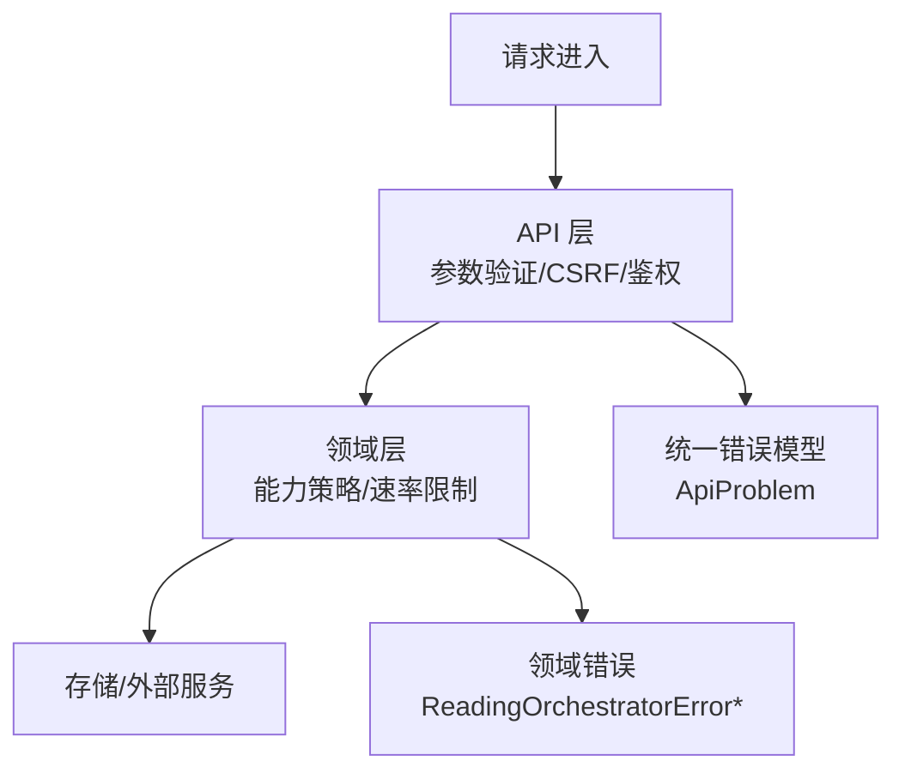
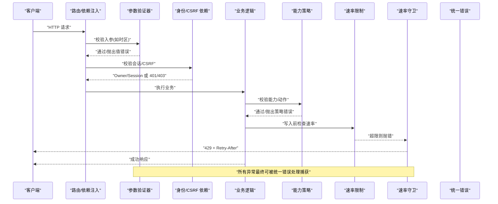
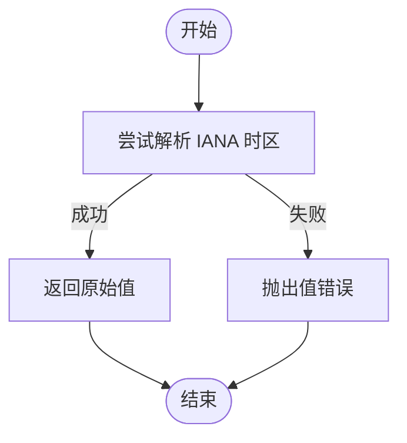
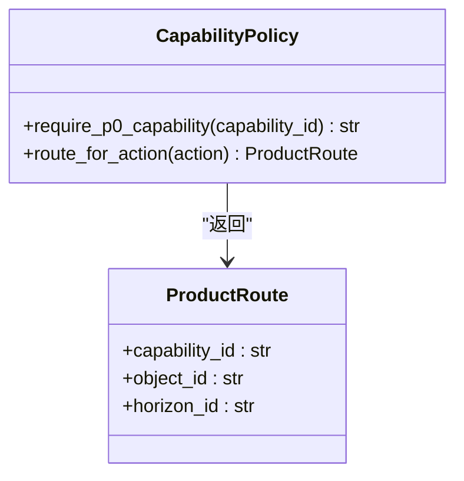
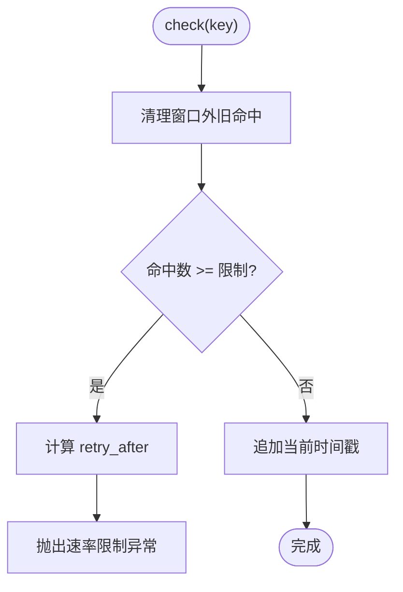
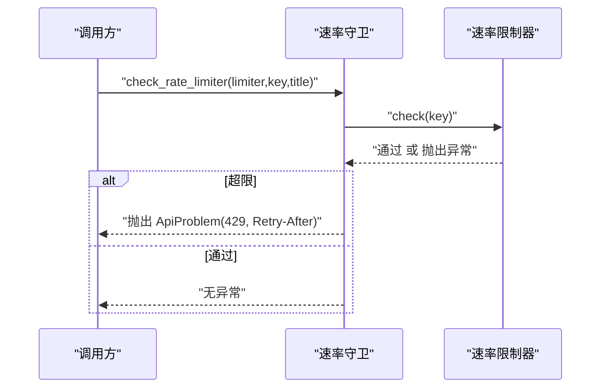
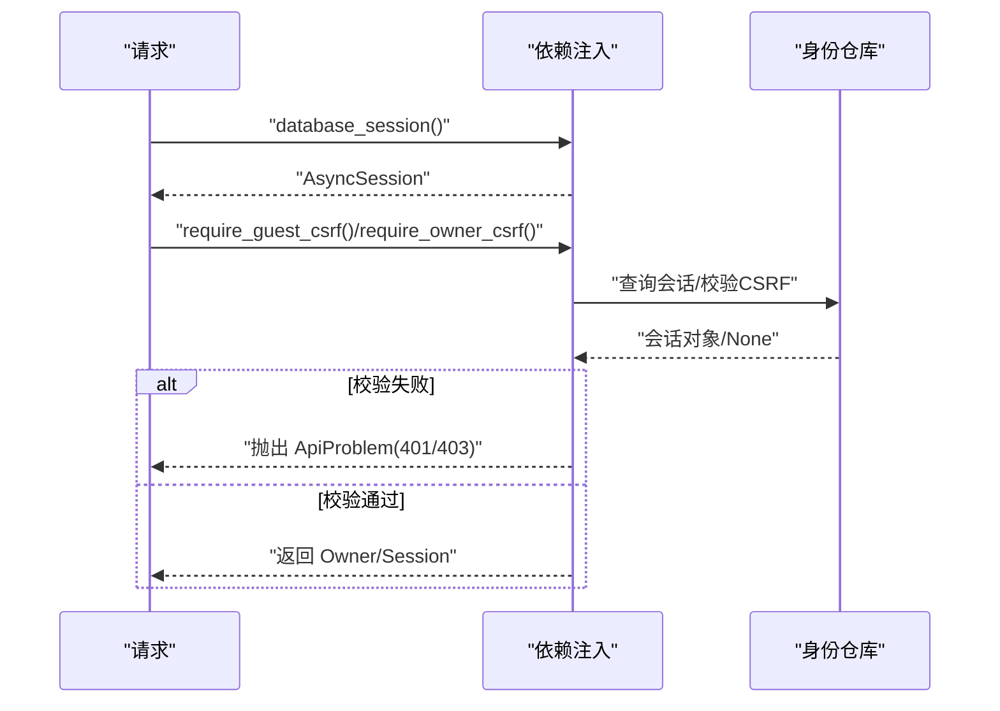
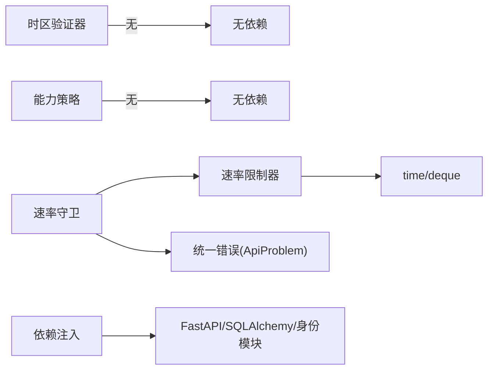

# 自定义验证器

<cite>
**本文引用的文件**
- [backend/app/api/validators.py](file://backend/app/api/validators.py)
- [backend/app/readings/capability_policy.py](file://backend/app/readings/capability_policy.py)
- [backend/app/readings/rate_limit.py](file://backend/app/readings/rate_limit.py)
- [backend/app/api/rate_guard.py](file://backend/app/api/rate_guard.py)
- [backend/app/api/errors.py](file://backend/app/api/errors.py)
- [backend/app/api/dependencies.py](file://backend/app/api/dependencies.py)
- [backend/app/readings/errors.py](file://backend/app/readings/errors.py)
</cite>

## 目录
1. [简介](#简介)
2. [项目结构](#项目结构)
3. [核心组件](#核心组件)
4. [架构总览](#架构总览)
5. [详细组件分析](#详细组件分析)
6. [依赖关系分析](#依赖关系分析)
7. [性能考量](#性能考量)
8. [故障排查指南](#故障排查指南)
9. [结论](#结论)
10. [附录：开发与测试指南](#附录开发与测试指南)

## 简介
本文件围绕后端中的“自定义验证器”展开，系统性解析三类关键验证能力：时区校验、能力策略校验与速率限制校验。文档同时总结验证器的开发模式（同步/异步、复合/条件）、业务规则实现（权限、配额、状态），以及注册与依赖注入机制（中间件集成、路由级验证）。最后给出性能优化建议与完整的开发与测试实践指引。

## 项目结构
本项目在后端模块中按领域划分验证相关代码：
- 参数级验证：时区校验位于 API 层，作为轻量同步验证器。
- 业务策略验证：能力策略位于 readings 领域，用于控制产品功能暴露面。
- 限流验证：速率限制在 readings 领域实现，API 层通过守卫函数将其转换为标准 HTTP 问题。
- 统一错误模型：API 层提供统一的 ApiProblem 异常，便于上层捕获并生成响应。
- 依赖注入：FastAPI 的 Depends 用于数据库会话、身份与会话校验等横切关注点。

**图示来源**
- [backend/app/api/validators.py:1-10](file://backend/app/api/validators.py#L1-L10)
- [backend/app/readings/capability_policy.py:1-68](file://backend/app/readings/capability_policy.py#L1-L68)
- [backend/app/readings/rate_limit.py:1-61](file://backend/app/readings/rate_limit.py#L1-L61)
- [backend/app/api/rate_guard.py:1-20](file://backend/app/api/rate_guard.py#L1-L20)
- [backend/app/api/errors.py:1-17](file://backend/app/api/errors.py#L1-L17)
- [backend/app/readings/errors.py:1-30](file://backend/app/readings/errors.py#L1-L30)

**章节来源**
- [backend/app/api/validators.py:1-10](file://backend/app/api/validators.py#L1-L10)
- [backend/app/readings/capability_policy.py:1-68](file://backend/app/readings/capability_policy.py#L1-L68)
- [backend/app/readings/rate_limit.py:1-61](file://backend/app/readings/rate_limit.py#L1-L61)
- [backend/app/api/rate_guard.py:1-20](file://backend/app/api/rate_guard.py#L1-L20)
- [backend/app/api/errors.py:1-17](file://backend/app/api/errors.py#L1-L17)
- [backend/app/readings/errors.py:1-30](file://backend/app/readings/errors.py#L1-L30)

## 核心组件
- 时区验证器：基于 IANA 时区库进行有效性校验，失败抛出值错误。
- 能力策略验证器：维护可暴露的能力集合与产品路由映射，拒绝未暴露或不受支持的动作。
- 速率限制器：进程内滑动窗口计数器，超限返回重试等待秒数。
- 速率守卫：将速率限制异常转换为带 Retry-After 头的 HTTP 429 问题。
- 统一错误模型：ApiProblem 承载状态码、标题、详情与额外头信息。
- 依赖注入：数据库会话、访客/设备会话、CSRF 校验与所有者抽象。

**章节来源**
- [backend/app/api/validators.py:1-10](file://backend/app/api/validators.py#L1-L10)
- [backend/app/readings/capability_policy.py:1-68](file://backend/app/readings/capability_policy.py#L1-L68)
- [backend/app/readings/rate_limit.py:1-61](file://backend/app/readings/rate_limit.py#L1-L61)
- [backend/app/api/rate_guard.py:1-20](file://backend/app/api/rate_guard.py#L1-L20)
- [backend/app/api/errors.py:1-17](file://backend/app/api/errors.py#L1-L17)
- [backend/app/api/dependencies.py:1-137](file://backend/app/api/dependencies.py#L1-L137)

## 架构总览
下图展示了从请求到验证再到响应的整体流程，涵盖参数验证、身份与会话校验、能力策略与速率限制，以及错误转换。

**图示来源**
- [backend/app/api/validators.py:1-10](file://backend/app/api/validators.py#L1-L10)
- [backend/app/api/dependencies.py:19-130](file://backend/app/api/dependencies.py#L19-L130)
- [backend/app/readings/capability_policy.py:53-68](file://backend/app/readings/capability_policy.py#L53-L68)
- [backend/app/readings/rate_limit.py:23-49](file://backend/app/readings/rate_limit.py#L23-L49)
- [backend/app/api/rate_guard.py:5-20](file://backend/app/api/rate_guard.py#L5-L20)
- [backend/app/api/errors.py:1-17](file://backend/app/api/errors.py#L1-L17)

## 详细组件分析

### 时区验证器（同步参数验证）
- 职责：校验传入的 IANA 时区字符串是否有效。
- 行为：调用系统时区解析，若无效则抛出值错误；否则原样返回。
- 使用场景：表单/接口入参校验阶段，快速失败。
- 复杂度：O(1) 单次校验，异常路径为解析开销。

**图示来源**
- [backend/app/api/validators.py:4-9](file://backend/app/api/validators.py#L4-L9)

**章节来源**
- [backend/app/api/validators.py:1-10](file://backend/app/api/validators.py#L1-L10)

### 能力策略验证器（业务规则：权限/暴露面）
- 职责：确保当前产品版本仅暴露允许的能力，并将动作映射到受控的产品路由。
- 关键点：
  - 白名单能力集合与 P0 暴露集合。
  - 动作到路由的映射表，包含 capability_id、object_id、horizon_id。
  - require_p0_capability 强制 P0 暴露约束。
  - route_for_action 校验动作合法性并返回路由。
- 异常：未暴露能力、不支持的动作。

**图示来源**
- [backend/app/readings/capability_policy.py:31-68](file://backend/app/readings/capability_policy.py#L31-L68)

**章节来源**
- [backend/app/readings/capability_policy.py:1-68](file://backend/app/readings/capability_policy.py#L1-L68)

### 速率限制器（配额控制：滑动窗口）
- 职责：对每个 owner 键维护滑动窗口内的请求计数，超过阈值即拒绝。
- 数据结构：内存字典 + 双端队列记录时间戳。
- 算法要点：
  - 清理过期时间戳（窗口起始点之前）。
  - 判断是否达到上限，若达到则计算重试等待秒数。
  - 新增命中时间戳。
- 复杂度：均摊 O(1)，清理操作与窗口大小线性相关但随时间衰减。

**图示来源**
- [backend/app/readings/rate_limit.py:23-49](file://backend/app/readings/rate_limit.py#L23-L49)

**章节来源**
- [backend/app/readings/rate_limit.py:1-61](file://backend/app/readings/rate_limit.py#L1-L61)

### 速率守卫（中间件式集成：将限流转为 HTTP 问题）
- 职责：调用速率限制器，捕获超限异常并转换为带 Retry-After 头的 429 问题。
- 集成方式：可在路由或中间件中按需调用，统一错误表现。

**图示来源**
- [backend/app/api/rate_guard.py:5-20](file://backend/app/api/rate_guard.py#L5-L20)
- [backend/app/readings/rate_limit.py:23-49](file://backend/app/readings/rate_limit.py#L23-L49)
- [backend/app/api/errors.py:1-17](file://backend/app/api/errors.py#L1-L17)

**章节来源**
- [backend/app/api/rate_guard.py:1-20](file://backend/app/api/rate_guard.py#L1-L20)
- [backend/app/api/errors.py:1-17](file://backend/app/api/errors.py#L1-L17)

### 依赖注入与路由级验证（身份、CSRF、会话）
- 数据库会话：以异步上下文管理，异常时回滚。
- 访客/设备会话：从 Cookie 提取令牌，查询活跃会话，缺失或无效返回 401。
- CSRF 校验：双提交模式（Cookie 与 Header 对比），失败返回 403。
- Owner 抽象：统一用户/访客的身份标识与 CSRF 哈希，供后续校验复用。
- 私有响应标记：设置缓存与索引控制头，保护敏感数据。

**图示来源**
- [backend/app/api/dependencies.py:19-130](file://backend/app/api/dependencies.py#L19-L130)
- [backend/app/api/errors.py:1-17](file://backend/app/api/errors.py#L1-L17)

**章节来源**
- [backend/app/api/dependencies.py:1-137](file://backend/app/api/dependencies.py#L1-L137)
- [backend/app/api/errors.py:1-17](file://backend/app/api/errors.py#L1-L17)

### 业务规则验证（权限、配额、状态）
- 权限检查：通过能力策略验证器限制可暴露能力与动作映射。
- 配额控制：通过速率限制器对写操作进行滑动窗口配额控制。
- 状态验证：结合依赖注入获取的 Owner/Session 与 CSRF 校验，确保请求来自合法主体且具备相应权限。

**章节来源**
- [backend/app/readings/capability_policy.py:53-68](file://backend/app/readings/capability_policy.py#L53-L68)
- [backend/app/readings/rate_limit.py:23-49](file://backend/app/readings/rate_limit.py#L23-L49)
- [backend/app/api/dependencies.py:39-130](file://backend/app/api/dependencies.py#L39-L130)

## 依赖关系分析
- 参数验证器不依赖其他模块，纯函数式。
- 能力策略依赖常量与数据类，无外部 IO。
- 速率限制器依赖时间与双端队列，无网络/IO。
- 速率守卫依赖速率限制器与统一错误模型。
- 依赖注入模块依赖 FastAPI、SQLAlchemy、身份模型与安全工具。

**图示来源**
- [backend/app/api/validators.py:1-10](file://backend/app/api/validators.py#L1-L10)
- [backend/app/readings/capability_policy.py:1-68](file://backend/app/readings/capability_policy.py#L1-L68)
- [backend/app/readings/rate_limit.py:1-61](file://backend/app/readings/rate_limit.py#L1-L61)
- [backend/app/api/rate_guard.py:1-20](file://backend/app/api/rate_guard.py#L1-L20)
- [backend/app/api/errors.py:1-17](file://backend/app/api/errors.py#L1-L17)
- [backend/app/api/dependencies.py:1-137](file://backend/app/api/dependencies.py#L1-L137)

**章节来源**
- [backend/app/api/validators.py:1-10](file://backend/app/api/validators.py#L1-L10)
- [backend/app/readings/capability_policy.py:1-68](file://backend/app/readings/capability_policy.py#L1-L68)
- [backend/app/readings/rate_limit.py:1-61](file://backend/app/readings/rate_limit.py#L1-L61)
- [backend/app/api/rate_guard.py:1-20](file://backend/app/api/rate_guard.py#L1-L20)
- [backend/app/api/errors.py:1-17](file://backend/app/api/errors.py#L1-L17)
- [backend/app/api/dependencies.py:1-137](file://backend/app/api/dependencies.py#L1-L137)

## 性能考量
- 时区验证：O(1) 解析，避免重复解析相同值时可考虑缓存结果。
- 能力策略：常量查找与映射表访问均为 O(1)。
- 速率限制：滑动窗口清理为摊销 O(1)，在高并发下注意内存占用与定期清理。
- 批量验证：可将多个参数验证合并执行，聚合错误信息后再一次性返回，减少往返。
- 错误聚合：在更高层组装多个验证失败的细节，提升用户体验与调试效率。
- 缓存策略：对只读配置（如能力白名单、动作映射）可进程内缓存，降低启动或热更新成本。

[本节为通用指导，无需特定文件引用]

## 故障排查指南
- 时区无效：确认传入值为标准 IANA 时区名称，检查系统时区数据库是否完整。
- 能力未暴露：核对当前产品版本暴露集合与动作映射，必要时扩展白名单或调整路由。
- 速率限制触发：检查 key 粒度是否合理（如按用户/租户隔离），调整 limit 与 window_seconds。
- CSRF 失败：确认客户端是否正确设置 Cookie 与 Header，服务端比较是否一致。
- 会话缺失：检查 Cookie 是否存在且有效，数据库会话是否过期或被清理。

**章节来源**
- [backend/app/api/validators.py:4-9](file://backend/app/api/validators.py#L4-L9)
- [backend/app/readings/capability_policy.py:53-68](file://backend/app/readings/capability_policy.py#L53-L68)
- [backend/app/readings/rate_limit.py:23-49](file://backend/app/readings/rate_limit.py#L23-L49)
- [backend/app/api/dependencies.py:39-130](file://backend/app/api/dependencies.py#L39-L130)

## 结论
本项目通过分层、可组合的验证器体系实现了从参数到业务规则的全面校验：时区验证保证输入正确性，能力策略保障产品边界，速率限制控制资源使用。配合依赖注入与统一错误模型，验证逻辑清晰、易于测试与扩展。建议在复杂场景中引入批量验证与错误聚合，进一步提升健壮性与可观测性。

[本节为总结，无需特定文件引用]

## 附录：开发与测试指南

### 验证器开发模式
- 同步验证器：适用于轻量、无 IO 的参数校验（如时区）。
- 异步验证器：需要访问数据库或外部服务的校验（如会话、配额）。
- 复合验证器：组合多个验证步骤，按顺序执行并在某步失败时短路。
- 条件验证器：根据上下文（如角色、能力）动态启用不同验证分支。

### 注册与依赖注入
- 在路由或中间件中通过 Depends 声明依赖，自动完成生命周期管理。
- 将验证器封装为可复用的依赖项，便于在不同路由复用。
- 使用统一错误模型输出标准化问题，便于前端处理。

### 测试示例（思路）
- 时区验证：构造无效时区字符串，断言抛出值错误；构造有效时区，断言通过。
- 能力策略：遍历动作与能力组合，断言未暴露动作抛出策略错误；已暴露动作返回路由。
- 速率限制：模拟多次请求，断言第 N+1 次触发 429，并携带 Retry-After。
- CSRF：分别构造缺少 Cookie/Header、Header 不匹配的场景，断言 403。
- 会话：构造无效/过期会话，断言 401；有效会话返回 Owner。

[本节为实践指导，无需特定文件引用]