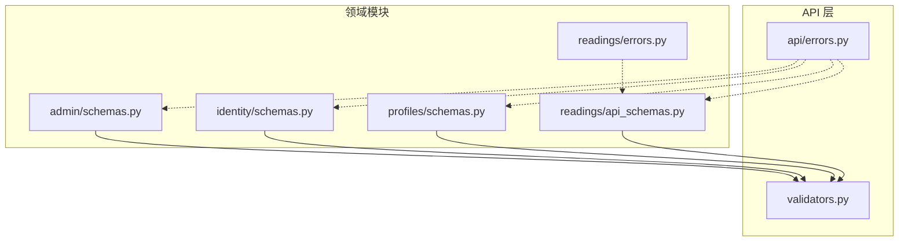
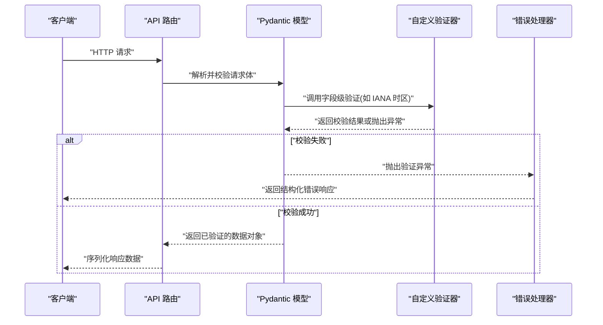
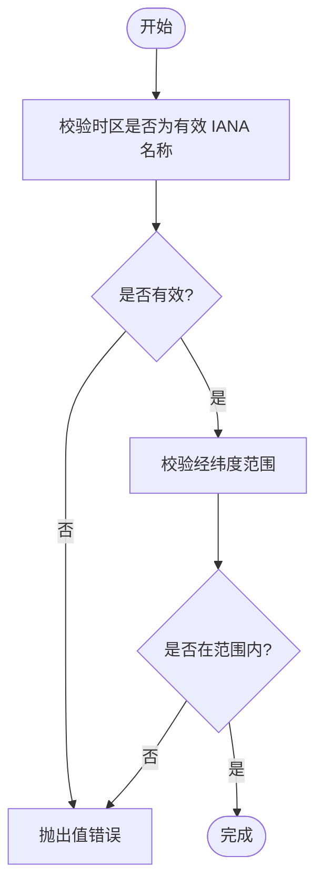
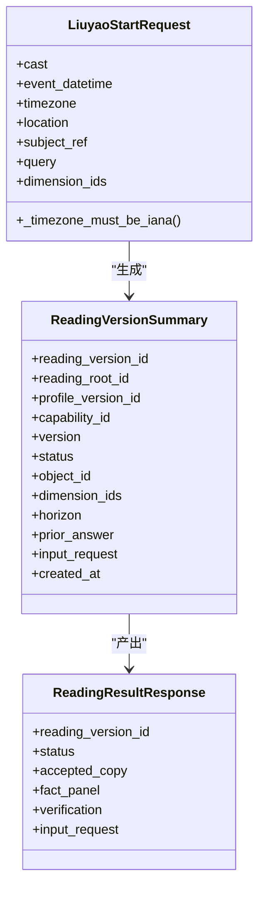
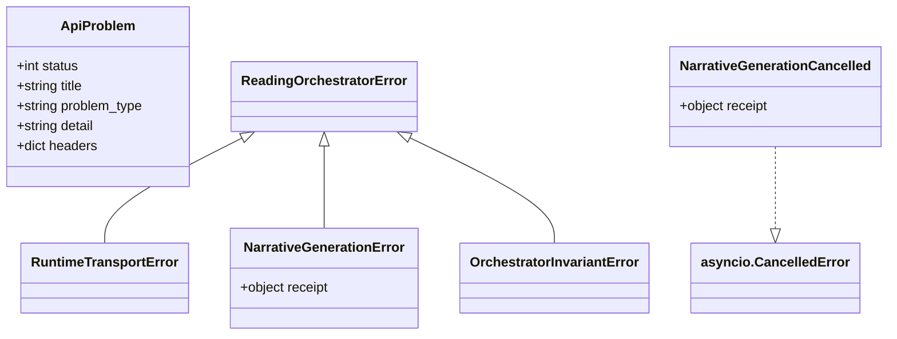
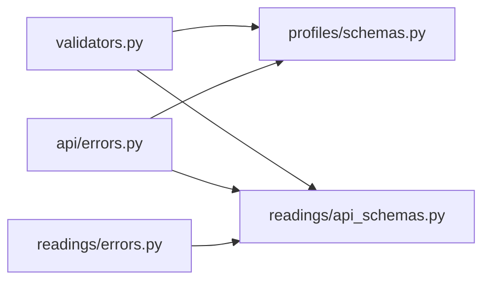

# 请求验证与数据清洗

<cite>
**本文引用的文件**
- [backend/app/api/validators.py](file://backend/app/api/validators.py)
- [backend/app/admin/schemas.py](file://backend/app/admin/schemas.py)
- [backend/app/identity/schemas.py](file://backend/app/identity/schemas.py)
- [backend/app/profiles/schemas.py](file://backend/app/profiles/schemas.py)
- [backend/app/readings/api_schemas.py](file://backend/app/readings/api_schemas.py)
- [backend/app/api/errors.py](file://backend/app/api/errors.py)
- [backend/app/readings/errors.py](file://backend/app/readings/errors.py)
</cite>

## 目录
1. [简介](#简介)
2. [项目结构](#项目结构)
3. [核心组件](#核心组件)
4. [架构总览](#架构总览)
5. [详细组件分析](#详细组件分析)
6. [依赖关系分析](#依赖关系分析)
7. [性能考虑](#性能考虑)
8. [故障排查指南](#故障排查指南)
9. [结论](#结论)
10. [附录](#附录)

## 简介
本文件聚焦后端 API 层的请求验证与数据清洗，围绕 Pydantic 模型在输入校验、响应序列化与类型转换中的应用展开。文档说明输入数据的清洗策略（含 XSS 防护、SQL 注入防护与格式标准化）、自定义验证器开发（业务规则、异步验证器与复合字段）、错误消息定制（多语言提示、用户友好信息与调试信息控制），以及验证性能优化（批量验证、缓存策略与错误聚合）。文末提供常见验证场景与最佳实践示例，帮助读者在实际项目中落地安全、可维护且高性能的验证体系。

## 项目结构
本项目在后端采用按领域划分的模块组织方式：API 层通过 Pydantic 模型定义请求与响应契约；各业务域（身份、档案、阅读等）分别维护自身的 schemas；通用验证逻辑集中在 validators 中；错误处理通过统一的异常类型与领域错误进行分层表达。

图表来源
- [backend/app/api/validators.py:1-10](file://backend/app/api/validators.py#L1-L10)
- [backend/app/admin/schemas.py:1-68](file://backend/app/admin/schemas.py#L1-L68)
- [backend/app/identity/schemas.py:1-62](file://backend/app/identity/schemas.py#L1-L62)
- [backend/app/profiles/schemas.py:1-60](file://backend/app/profiles/schemas.py#L1-L60)
- [backend/app/readings/api_schemas.py:1-130](file://backend/app/readings/api_schemas.py#L1-L130)
- [backend/app/api/errors.py:1-17](file://backend/app/api/errors.py#L1-L17)
- [backend/app/readings/errors.py:1-30](file://backend/app/readings/errors.py#L1-L30)

章节来源
- [backend/app/api/validators.py:1-10](file://backend/app/api/validators.py#L1-L10)
- [backend/app/admin/schemas.py:1-68](file://backend/app/admin/schemas.py#L1-L68)
- [backend/app/identity/schemas.py:1-62](file://backend/app/identity/schemas.py#L1-L62)
- [backend/app/profiles/schemas.py:1-60](file://backend/app/profiles/schemas.py#L1-L60)
- [backend/app/readings/api_schemas.py:1-130](file://backend/app/readings/api_schemas.py#L1-L130)
- [backend/app/api/errors.py:1-17](file://backend/app/api/errors.py#L1-L17)
- [backend/app/readings/errors.py:1-30](file://backend/app/readings/errors.py#L1-L30)

## 核心组件
- 通用验证器：提供 IANA 时区名称校验，确保时间相关字段使用合法时区标识。
- 管理端 Schema：管理员登录与会话、概览等请求/响应的强类型约束。
- 身份认证 Schema：访客会话、OTP 发送与校验、登录会话与账户摘要。
- 档案 Schema：草稿创建、确认提交（含出生日期、时区、坐标、性别与时制策略等）。
- 阅读 Schema：预览/运势/六爻启动、补充输入、后续追问、验证反馈、版本摘要与结果返回。
- 错误模型：统一 API 问题异常与阅读编排器领域错误。

章节来源
- [backend/app/api/validators.py:1-10](file://backend/app/api/validators.py#L1-L10)
- [backend/app/admin/schemas.py:1-68](file://backend/app/admin/schemas.py#L1-L68)
- [backend/app/identity/schemas.py:1-62](file://backend/app/identity/schemas.py#L1-L62)
- [backend/app/profiles/schemas.py:1-60](file://backend/app/profiles/schemas.py#L1-L60)
- [backend/app/readings/api_schemas.py:1-130](file://backend/app/readings/api_schemas.py#L1-L130)
- [backend/app/api/errors.py:1-17](file://backend/app/api/errors.py#L1-L17)
- [backend/app/readings/errors.py:1-30](file://backend/app/readings/errors.py#L1-L30)

## 架构总览
下图展示了从请求进入 API 到 Pydantic 模型校验、再到响应序列化的整体流程，并标注了关键文件位置。

图表来源
- [backend/app/api/validators.py:1-10](file://backend/app/api/validators.py#L1-L10)
- [backend/app/profiles/schemas.py:23-44](file://backend/app/profiles/schemas.py#L23-L44)
- [backend/app/readings/api_schemas.py:36-55](file://backend/app/readings/api_schemas.py#L36-L55)
- [backend/app/api/errors.py:1-17](file://backend/app/api/errors.py#L1-L17)

## 详细组件分析

### 通用验证器：IANA 时区校验
- 职责：校验传入的时区字符串是否为合法的 IANA 时区名，非法时抛出值错误。
- 使用点：在档案与阅读相关请求中作为字段级验证器被复用，保证时间计算的一致性。
- 复杂度：O(1) 近似（系统时区表查找），无额外内存占用。
- 扩展建议：可结合缓存将常见时区映射为常量以提升高并发下的性能。

章节来源
- [backend/app/api/validators.py:1-10](file://backend/app/api/validators.py#L1-L10)
- [backend/app/profiles/schemas.py:40-44](file://backend/app/profiles/schemas.py#L40-L44)
- [backend/app/readings/api_schemas.py:51-55](file://backend/app/readings/api_schemas.py#L51-L55)

### 管理端 Schema：登录与会话
- 输入约束：邮箱格式、密码长度范围、禁止多余字段。
- 输出约束：会话标识、角色、显示名、过期时间与 CSRF 令牌。
- 设计要点：使用严格配置拒绝未知字段，避免意外属性泄露；对敏感字段进行最小化暴露。

章节来源
- [backend/app/admin/schemas.py:14-30](file://backend/app/admin/schemas.py#L14-L30)
- [backend/app/admin/schemas.py:32-41](file://backend/app/admin/schemas.py#L32-L41)

### 身份认证 Schema：OTP 与登录会话
- OTP 发送：限定渠道与目的地长度，防止过长负载与无效渠道。
- OTP 校验：验证码必须匹配六位数字的正则模式，增强前端与后端一致性。
- 会话响应：包含用户标识、会话标识、过期时间与 CSRF 令牌，便于后续鉴权与安全交互。

章节来源
- [backend/app/identity/schemas.py:16-37](file://backend/app/identity/schemas.py#L16-L37)
- [backend/app/identity/schemas.py:39-46](file://backend/app/identity/schemas.py#L39-L46)

### 档案 Schema：确认提交与复合字段验证
- 日期时间：使用 ISO 8601 正则约束，确保跨平台解析一致。
- 时区：通过自定义验证器强制使用有效 IANA 时区。
- 地理坐标：经度与纬度范围限制，配合可选的来源描述字段。
- 性别与时制策略：使用字面量枚举，减少歧义。
- 字段级验证：通过字段验证器实现跨字段或外部资源校验（可扩展为异步）。

图表来源
- [backend/app/profiles/schemas.py:23-44](file://backend/app/profiles/schemas.py#L23-L44)
- [backend/app/api/validators.py:1-10](file://backend/app/api/validators.py#L1-L10)

章节来源
- [backend/app/profiles/schemas.py:23-44](file://backend/app/profiles/schemas.py#L23-L44)

### 阅读 Schema：启动与结果
- 六爻启动：支持“数字硬币”快捷输入或固定长度的卦象数组，并对每个元素进行数值范围约束。
- 事件时间与时区：要求明确的事件时间与有效时区，保障时序一致性。
- 维度与查询：限制维度数量与查询长度，避免过大负载。
- 结果返回：包含版本摘要、状态、接受副本、事实面板与验证信息等。

图表来源
- [backend/app/readings/api_schemas.py:36-55](file://backend/app/readings/api_schemas.py#L36-L55)
- [backend/app/readings/api_schemas.py:84-130](file://backend/app/readings/api_schemas.py#L84-L130)

章节来源
- [backend/app/readings/api_schemas.py:11-14](file://backend/app/readings/api_schemas.py#L11-L14)
- [backend/app/readings/api_schemas.py:36-55](file://backend/app/readings/api_schemas.py#L36-L55)
- [backend/app/readings/api_schemas.py:84-130](file://backend/app/readings/api_schemas.py#L84-L130)

### 错误处理：统一 API 问题与领域错误
- API 问题异常：封装 HTTP 状态码、标题、类型、详情与头信息，便于中间件统一转换为响应。
- 领域错误：阅读编排器的运行时传输错误、叙事生成错误、取消与不变式违反等，用于上层捕获与降级。

图表来源
- [backend/app/api/errors.py:1-17](file://backend/app/api/errors.py#L1-L17)
- [backend/app/readings/errors.py:1-30](file://backend/app/readings/errors.py#L1-L30)

章节来源
- [backend/app/api/errors.py:1-17](file://backend/app/api/errors.py#L1-L17)
- [backend/app/readings/errors.py:1-30](file://backend/app/readings/errors.py#L1-L30)

## 依赖关系分析
- 领域 Schema 依赖通用验证器：档案与阅读模块通过字段验证器复用 IANA 时区校验，降低重复代码与维护成本。
- 错误模型解耦：API 层错误与领域错误分层清晰，便于在不同层级进行捕获与转换。
- 配置项集中：所有模型均启用严格配置，禁止额外字段，减少上游耦合风险。

图表来源
- [backend/app/api/validators.py:1-10](file://backend/app/api/validators.py#L1-L10)
- [backend/app/profiles/schemas.py:1-60](file://backend/app/profiles/schemas.py#L1-L60)
- [backend/app/readings/api_schemas.py:1-130](file://backend/app/readings/api_schemas.py#L1-L130)
- [backend/app/api/errors.py:1-17](file://backend/app/api/errors.py#L1-L17)
- [backend/app/readings/errors.py:1-30](file://backend/app/readings/errors.py#L1-L30)

章节来源
- [backend/app/api/validators.py:1-10](file://backend/app/api/validators.py#L1-L10)
- [backend/app/profiles/schemas.py:1-60](file://backend/app/profiles/schemas.py#L1-L60)
- [backend/app/readings/api_schemas.py:1-130](file://backend/app/readings/api_schemas.py#L1-L130)
- [backend/app/api/errors.py:1-17](file://backend/app/api/errors.py#L1-L17)
- [backend/app/readings/errors.py:1-30](file://backend/app/readings/errors.py#L1-L30)

## 性能考虑
- 批量验证：对列表型字段（如维度 IDs、卦象数组）使用 Pydantic 内置约束，避免逐条循环校验带来的开销。
- 缓存策略：对 IANA 时区校验结果进行 LRU 缓存，减少高频请求时的系统表查找成本。
- 错误聚合：利用 Pydantic 的错误收集机制一次性返回所有字段错误，减少往返次数。
- 正则与模式：尽量使用轻量正则与范围约束，避免复杂表达式导致的回溯开销。
- 响应序列化：仅暴露必要字段，减少 JSON 体积与序列化时间。

[本节为通用指导，不直接分析具体文件]

## 故障排查指南
- 常见验证失败
  - 时区非法：检查传入的时区字符串是否为有效 IANA 名称。
  - 坐标越界：核对经纬度范围是否符合约束。
  - OTP 验证码格式：确认是否为六位数字。
  - 额外字段：确认请求体未包含模型未定义的字段。
- 定位方法
  - 查看 Pydantic 返回的错误详情，定位具体字段与原因。
  - 结合领域错误类型判断是否为编排器层面的运行时问题。
- 修复建议
  - 在前端增加与后端一致的校验提示，减少无效请求。
  - 对频繁失败的字段增加白名单或下拉选择，降低误输概率。

章节来源
- [backend/app/api/validators.py:1-10](file://backend/app/api/validators.py#L1-L10)
- [backend/app/identity/schemas.py:16-37](file://backend/app/identity/schemas.py#L16-L37)
- [backend/app/profiles/schemas.py:23-44](file://backend/app/profiles/schemas.py#L23-L44)
- [backend/app/readings/api_schemas.py:36-55](file://backend/app/readings/api_schemas.py#L36-L55)
- [backend/app/readings/errors.py:1-30](file://backend/app/readings/errors.py#L1-L30)

## 结论
本项目通过 Pydantic 模型在 API 层实现了严格的请求体验证与响应序列化，借助通用验证器与字段级校验保证了数据的一致性与安全性。结合统一错误模型与领域错误分层，提升了可维护性与可观测性。建议在后续迭代中引入缓存、批量验证与错误聚合等优化手段，进一步提升性能与用户体验。

[本节为总结性内容，不直接分析具体文件]

## 附录

### 输入数据清洗策略
- XSS 防护
  - 在展示层对用户输入进行转义与渲染上下文隔离。
  - 对富文本输入采用白名单过滤与沙箱渲染。
- SQL 注入防护
  - 使用参数化查询与 ORM，避免拼接 SQL。
  - 对自由文本输入进行长度与字符集限制。
- 数据格式标准化
  - 日期时间统一为 ISO 8601，时区统一为 IANA 名称。
  - 数值字段进行范围与精度约束，字符串字段进行长度与模式限制。

[本节为通用指导，不直接分析具体文件]

### 自定义验证器开发
- 业务规则验证：在字段验证器中嵌入业务约束（如状态机允许的状态转移）。
- 异步验证器：对于需要访问外部资源的校验（如唯一性检查），使用异步验证器提升吞吐。
- 复合字段验证：在模型级别进行跨字段校验（如开始时间不得晚于结束时间）。

[本节为通用指导，不直接分析具体文件]

### 错误消息定制
- 多语言错误提示：根据请求头或用户偏好返回本地化消息。
- 用户友好信息：对外隐藏内部细节，仅提供可读的错误描述。
- 调试信息控制：在生产环境关闭详细堆栈，保留必要上下文以便排障。

[本节为通用指导，不直接分析具体文件]

### 验证性能优化
- 批量验证：对集合字段使用 Pydantic 的列表约束，减少循环开销。
- 缓存策略：对昂贵校验（如时区、外部服务可用性）进行结果缓存。
- 错误聚合：一次性返回所有字段错误，减少往返次数与前端重试压力。

[本节为通用指导，不直接分析具体文件]

### 常见验证场景与最佳实践
- 场景示例
  - 注册表单：邮箱、密码强度、手机号格式校验。
  - 订单提交：商品 ID、数量、价格范围与地址格式校验。
  - 报表导出：时间范围、维度选择与分页参数校验。
- 最佳实践
  - 前后端共享校验规则，减少不一致。
  - 使用枚举与字面量约束，避免魔法字符串。
  - 对敏感字段进行最小化暴露与脱敏处理。

[本节为通用指导，不直接分析具体文件]