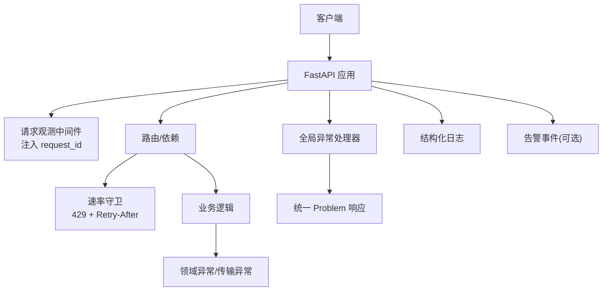
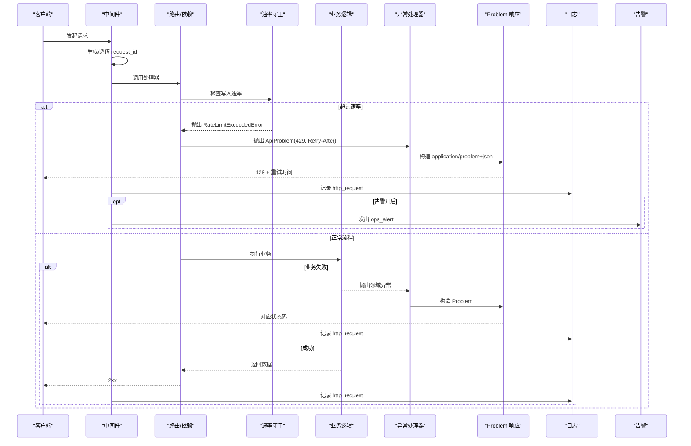
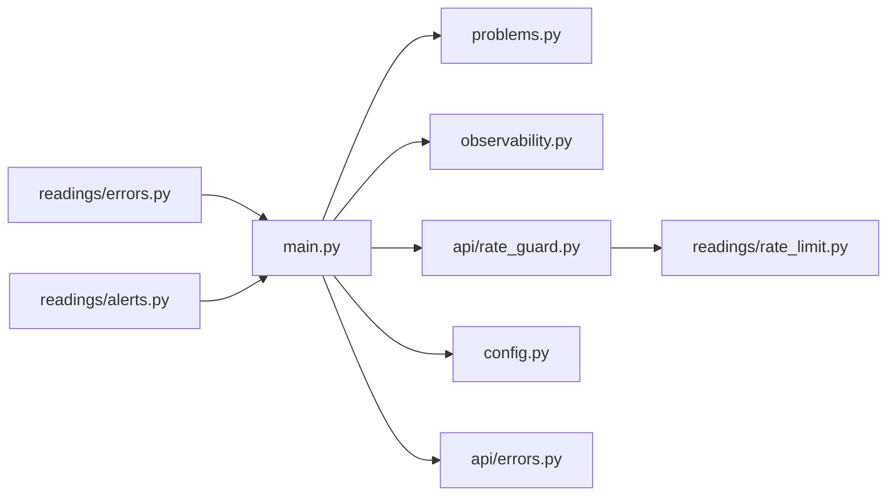

# 错误处理与消息定制

<cite>
**本文引用的文件**
- [backend/app/api/errors.py](file://backend/app/api/errors.py)
- [backend/app/api/problems.py](file://backend/app/api/problems.py)
- [backend/app/main.py](file://backend/app/main.py)
- [backend/app/observability.py](file://backend/app/observability.py)
- [backend/app/readings/errors.py](file://backend/app/readings/errors.py)
- [backend/app/readings/rate_limit.py](file://backend/app/readings/rate_limit.py)
- [backend/app/api/rate_guard.py](file://backend/app/api/rate_guard.py)
- [backend/app/readings/alerts.py](file://backend/app/readings/alerts.py)
- [backend/app/config.py](file://backend/app/config.py)
- [contracts/openapi/v1.yaml](file://contracts/openapi/v1.yaml)
- [backend/tests/test_auth.py](file://backend/tests/test_auth.py)
- [web/src/components/dashboard-hub.tsx](file://web/src/components/dashboard-hub.tsx)
- [web/src/test/otp-form.test.tsx](file://web/src/test/otp-form.test.tsx)
</cite>

## 目录
1. [简介](#简介)
2. [项目结构](#项目结构)
3. [核心组件](#核心组件)
4. [架构总览](#架构总览)
5. [详细组件分析](#详细组件分析)
6. [依赖关系分析](#依赖关系分析)
7. [性能考量](#性能考量)
8. [故障排查指南](#故障排查指南)
9. [结论](#结论)
10. [附录](#附录)

## 简介
本文件系统化梳理后端与前端的错误处理与消息定制方案，覆盖异常分类、错误码定义、统一错误响应格式、用户友好提示生成、安全过滤与审计追踪、错误恢复（重试/降级/熔断）、监控告警集成以及最佳实践。目标是让非技术读者也能理解系统如何“出错—记录—反馈—恢复”。

## 项目结构
错误处理贯穿 FastAPI 应用生命周期：请求进入时注入可追踪的 request_id；业务层抛出领域异常或速率限制异常；全局异常处理器将其转换为统一的 Problem JSON 响应；日志与告警在中间件和专用模块中结构化输出；前端根据状态码与标题展示用户友好的错误信息并提供重试入口。

图表来源
- [backend/app/main.py:115-136](file://backend/app/main.py#L115-L136)
- [backend/app/observability.py:27-51](file://backend/app/observability.py#L27-L51)
- [backend/app/api/problems.py:5-27](file://backend/app/api/problems.py#L5-L27)
- [backend/app/api/rate_guard.py:5-19](file://backend/app/api/rate_guard.py#L5-L19)

章节来源
- [backend/app/main.py:30-155](file://backend/app/main.py#L30-L155)
- [backend/app/observability.py:1-52](file://backend/app/observability.py#L1-L52)
- [backend/app/api/problems.py:1-28](file://backend/app/api/problems.py#L1-L28)

## 核心组件
- 统一问题类型与响应
  - ApiProblem 异常承载 HTTP 状态码、标题、问题类型、详情与额外头。
  - problem_response 将异常转为 application/problem+json 响应，并附带 request_id。
- 全局异常处理
  - 捕获 ApiProblem 与 Pydantic 验证异常，统一返回 Problem 文档。
  - OpenAPI 文档主动移除 422 响应声明，避免暴露内部校验细节。
- 速率限制与重试提示
  - WindowRateLimiter 实现滑动窗口限流；超限抛出 RateLimitExceededError。
  - rate_guard.check_rate_limiter 将限流异常转换为 429 并设置 Retry-After。
- 可观测性与审计
  - 请求中间件为每个请求分配/透传 request_id，记录结构化日志。
  - alerts 模块提供告警事件结构与 sink（本地/测试/禁用），用于运维告警。
- 配置与安全
  - Settings 强制生产环境安全策略（如禁用 fake 适配器、固定路径、密钥注入等）。
  - 敏感字段通过 SecretStr 与白名单/模式约束保护。

章节来源
- [backend/app/api/errors.py:1-17](file://backend/app/api/errors.py#L1-L17)
- [backend/app/api/problems.py:1-28](file://backend/app/api/problems.py#L1-L28)
- [backend/app/main.py:115-151](file://backend/app/main.py#L115-L151)
- [backend/app/readings/rate_limit.py:9-60](file://backend/app/readings/rate_limit.py#L9-L60)
- [backend/app/api/rate_guard.py:1-20](file://backend/app/api/rate_guard.py#L1-L20)
- [backend/app/observability.py:1-52](file://backend/app/observability.py#L1-L52)
- [backend/app/readings/alerts.py:1-81](file://backend/app/readings/alerts.py#L1-L81)
- [backend/app/config.py:62-329](file://backend/app/config.py#L62-L329)

## 架构总览
下图展示了从请求到错误响应的完整链路，包括异常分类、统一响应、速率限制、可观测性与告警。

图表来源
- [backend/app/observability.py:27-51](file://backend/app/observability.py#L27-L51)
- [backend/app/api/rate_guard.py:5-19](file://backend/app/api/rate_guard.py#L5-L19)
- [backend/app/main.py:115-136](file://backend/app/main.py#L115-L136)
- [backend/app/api/problems.py:5-27](file://backend/app/api/problems.py#L5-L27)
- [backend/app/readings/alerts.py:20-40](file://backend/app/readings/alerts.py#L20-L40)

## 详细组件分析

### 异常分类与错误码
- 领域异常
  - ReadingOrchestratorError 及其子类用于读取编排过程中的显式失败（运行时传输未知、模型未返回有效候选、外部取消、不变量违反）。
- 速率限制异常
  - RateLimitExceededError 携带 retry_after_seconds，供上层转换为 429 与 Retry-After。
- 统一问题
  - ApiProblem 作为跨层传递的“问题”载体，包含 status/title/problem_type/detail/headers。
- 错误码约定
  - 400：无效请求（Pydantic 校验失败）
  - 429：达到速率限制，附带 Retry-After
  - 503：依赖不可用（例如 OTP 投递不可用）
  - 其他业务错误按语义映射到合适的 HTTP 状态码

章节来源
- [backend/app/readings/errors.py:4-30](file://backend/app/readings/errors.py#L4-L30)
- [backend/app/readings/rate_limit.py:55-60](file://backend/app/readings/rate_limit.py#L55-L60)
- [backend/app/api/errors.py:1-17](file://backend/app/api/errors.py#L1-L17)
- [backend/tests/test_auth.py:524-539](file://backend/tests/test_auth.py#L524-L539)

### 统一错误响应格式
- 媒体类型：application/problem+json
- 字段
  - type：问题类型标识（URI 或自定义命名空间）
  - title：人类可读的错误标题
  - status：HTTP 状态码
  - request_id：本次请求的唯一标识，便于追踪
  - detail：可选的详细信息（仅在需要时附加）
- 额外头
  - Retry-After：当 429 时指示重试等待秒数

章节来源
- [backend/app/api/problems.py:5-27](file://backend/app/api/problems.py#L5-L27)
- [contracts/openapi/v1.yaml:1247-1267](file://contracts/openapi/v1.yaml#L1247-L1267)
- [backend/app/main.py:115-136](file://backend/app/main.py#L115-L136)

### 用户友好错误消息与上下文
- 多语言支持
  - 当前后端使用英文标题（如 “Invalid request”、“OTP delivery unavailable”、“Please wait before requesting another code”），前端可根据 locale 进行翻译或替换。
- 上下文信息提取
  - 所有错误响应均包含 request_id，便于前后端联合定位。
  - 速率限制错误通过 Retry-After 提供具体等待时间。
- 调试信息控制
  - 默认不向客户端暴露堆栈或内部细节；detail 字段仅在必要时由业务决定是否填充。
  - 日志采用结构化 JSON，便于检索与分析。

章节来源
- [backend/app/main.py:126-136](file://backend/app/main.py#L126-L136)
- [backend/tests/test_auth.py:524-539](file://backend/tests/test_auth.py#L524-L539)
- [backend/app/observability.py:27-51](file://backend/app/observability.py#L27-L51)

### 安全错误处理策略
- 敏感信息过滤
  - 配置层对敏感字段使用 SecretStr，并在日志/导出中剔除敏感键。
  - 传输层日志降低敏感库级别，避免泄露报文细节。
- 错误日志记录
  - 每次 HTTP 请求以结构化日志记录 method/path/status/duration/request_id。
- 审计追踪
  - 告警模块提供 AlertEvent 与多种 Sink（日志/测试/禁用），用于关键事件上报。
  - 管理端审计页面预留接入点（Phase B 计划）。

章节来源
- [backend/app/config.py:108-125](file://backend/app/config.py#L108-L125)
- [backend/app/observability.py:14-17](file://backend/app/observability.py#L14-L17)
- [backend/app/readings/alerts.py:20-81](file://backend/app/readings/alerts.py#L20-L81)
- [admin/src/app/audit/page.tsx:4-10](file://admin/src/app/audit/page.tsx#L4-L10)

### 错误恢复机制
- 重试策略
  - 429 响应携带 Retry-After，客户端应遵循该头部进行退避重试。
  - 前端在会话失效或网络中断场景提供“重新载入”操作。
- 降级处理
  - OTP 投递在 provider 不可用时回退为 503 并保留网络窗口计数，防止攻击者利用故障绕过频率限制。
- 熔断保护
  - 配置层在生产环境禁止使用 fake 适配器、固定运行路径与发布产物摘要，确保关键依赖受控。
  - 速率限制器在写路径上保护数据库与下游服务免受突发流量冲击。

章节来源
- [backend/app/api/rate_guard.py:5-19](file://backend/app/api/rate_guard.py#L5-L19)
- [backend/app/readings/rate_limit.py:23-49](file://backend/app/readings/rate_limit.py#L23-L49)
- [backend/app/config.py:188-329](file://backend/app/config.py#L188-L329)
- [web/src/components/dashboard-hub.tsx:236-253](file://web/src/components/dashboard-hub.tsx#L236-L253)
- [backend/tests/test_auth.py:524-539](file://backend/tests/test_auth.py#L524-L539)

### 错误监控与告警集成
- 指标收集
  - 每次请求记录 event=http_request，包含 request_id、method、path、status、duration_ms。
- 趋势分析
  - 基于结构化日志聚合统计错误率、延迟分布与热点路径。
- 自动通知
  - 通过 alerts 模块发出 ops_alert，结合外部告警系统实现阈值触发与通知。

章节来源
- [backend/app/observability.py:27-51](file://backend/app/observability.py#L27-L51)
- [backend/app/readings/alerts.py:20-81](file://backend/app/readings/alerts.py#L20-L81)

### 前端错误处理与消息定制
- 错误展示
  - 在私人首页加载失败时显示错误面板，并提供“重新载入”按钮与账户页跳转。
- 表单错误
  - 验证码发送失败时，在目标输入框旁展示友好提示，并通过 aria-describedby 关联无障碍描述。
- 国际化建议
  - 前端可按 locale 将后端 title/detail 映射为本地化文案，保持体验一致。

章节来源
- [web/src/components/dashboard-hub.tsx:236-253](file://web/src/components/dashboard-hub.tsx#L236-L253)
- [web/src/test/otp-form.test.tsx:342-368](file://web/src/test/otp-form.test.tsx#L342-L368)

## 依赖关系分析
- 低耦合设计
  - 业务层仅抛出领域异常；全局异常处理器负责统一转换。
  - 速率限制通过独立模块与守卫函数解耦，便于复用与测试。
- 直接依赖
  - main.py 依赖 observability、problems、rate_guard、config 等模块完成启动装配与异常处理。
- 间接依赖
  - 前端通过 OpenAPI 契约了解 429/503 等响应语义，配合前端 UI 进行重试与降级。

图表来源
- [backend/app/main.py:115-140](file://backend/app/main.py#L115-L140)
- [backend/app/api/rate_guard.py:1-20](file://backend/app/api/rate_guard.py#L1-L20)
- [backend/app/readings/rate_limit.py:1-60](file://backend/app/readings/rate_limit.py#L1-L60)
- [backend/app/readings/errors.py:1-30](file://backend/app/readings/errors.py#L1-L30)
- [backend/app/readings/alerts.py:1-81](file://backend/app/readings/alerts.py#L1-L81)
- [backend/app/config.py:62-329](file://backend/app/config.py#L62-L329)

章节来源
- [backend/app/main.py:30-155](file://backend/app/main.py#L30-L155)
- [backend/app/api/rate_guard.py:1-20](file://backend/app/api/rate_guard.py#L1-L20)
- [backend/app/readings/rate_limit.py:1-60](file://backend/app/readings/rate_limit.py#L1-L60)

## 性能考量
- 限流窗口清理
  - 滑动窗口定期修剪过期命中，避免内存增长。
- 日志开销
  - 结构化日志最小化字段，避免冗余；敏感传输日志降级别。
- 超时与资源限制
  - 配置层对模型连接/读取/整体超时与响应体大小进行上限约束，防止资源耗尽。

章节来源
- [backend/app/readings/rate_limit.py:34-49](file://backend/app/readings/rate_limit.py#L34-L49)
- [backend/app/observability.py:14-17](file://backend/app/observability.py#L14-L17)
- [backend/app/config.py:253-271](file://backend/app/config.py#L253-L271)

## 故障排查指南
- 快速定位
  - 使用响应中的 request_id 在日志系统中检索完整请求链路。
- 常见错误
  - 429：检查 Retry-After 值与客户端重试间隔；确认速率限制配置是否合理。
  - 503：检查 OTP 投递或下游依赖可用性；观察告警事件。
  - 400：检查请求参数是否符合契约；查看 OpenAPI 文档。
- 前端交互
  - 若出现会话失效或网络中断，引导用户点击“重新载入”或前往账户页重新登录。
- 安全与合规
  - 确认生产环境已启用安全 Cookie、禁用 fake 适配器、注入必要密钥。

章节来源
- [backend/app/observability.py:27-51](file://backend/app/observability.py#L27-L51)
- [backend/tests/test_auth.py:524-539](file://backend/tests/test_auth.py#L524-L539)
- [web/src/components/dashboard-hub.tsx:236-253](file://web/src/components/dashboard-hub.tsx#L236-L253)
- [backend/app/config.py:188-329](file://backend/app/config.py#L188-L329)

## 结论
本项目采用“领域异常 + 统一 Problem 响应 + 结构化日志/告警”的分层错误处理架构，结合严格的速率限制与生产安全配置，既保证了用户体验（友好提示、可重试），又确保了安全性与可观测性（request_id、审计事件、敏感信息保护）。建议在后续迭代中继续完善前端多语言错误文案、扩展告警渠道，并持续优化限流与超时策略以适应真实流量。

## 附录
- 错误响应示例字段说明
  - type：问题类型标识（URI 或命名空间）
  - title：人类可读标题
  - status：HTTP 状态码
  - request_id：请求追踪 ID
  - detail：可选详情
  - headers：额外头（如 Retry-After）

章节来源
- [backend/app/api/problems.py:5-27](file://backend/app/api/problems.py#L5-L27)
- [contracts/openapi/v1.yaml:1247-1267](file://contracts/openapi/v1.yaml#L1247-L1267)