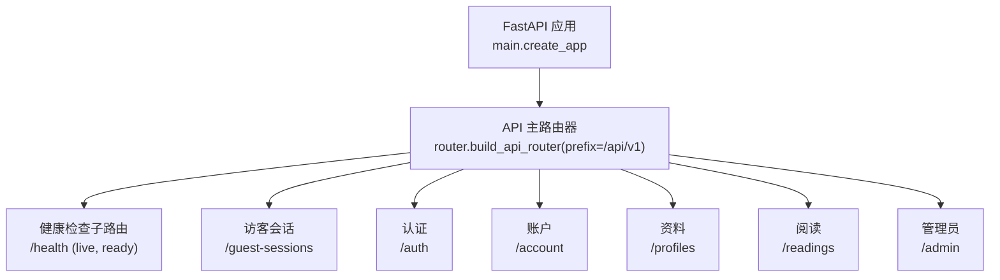
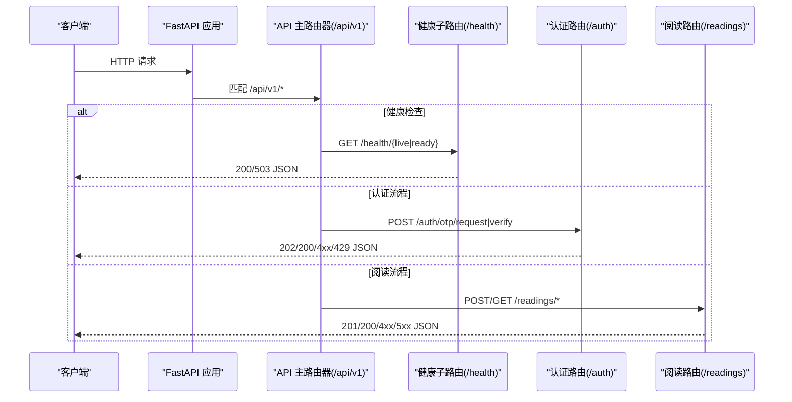
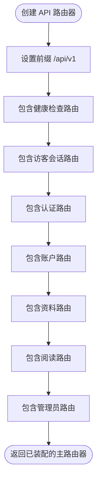
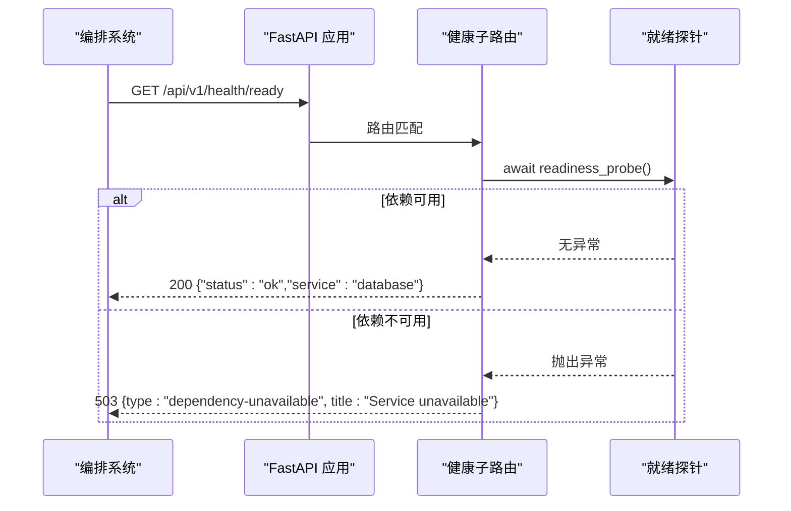
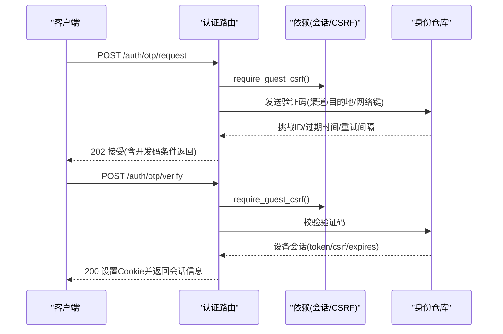
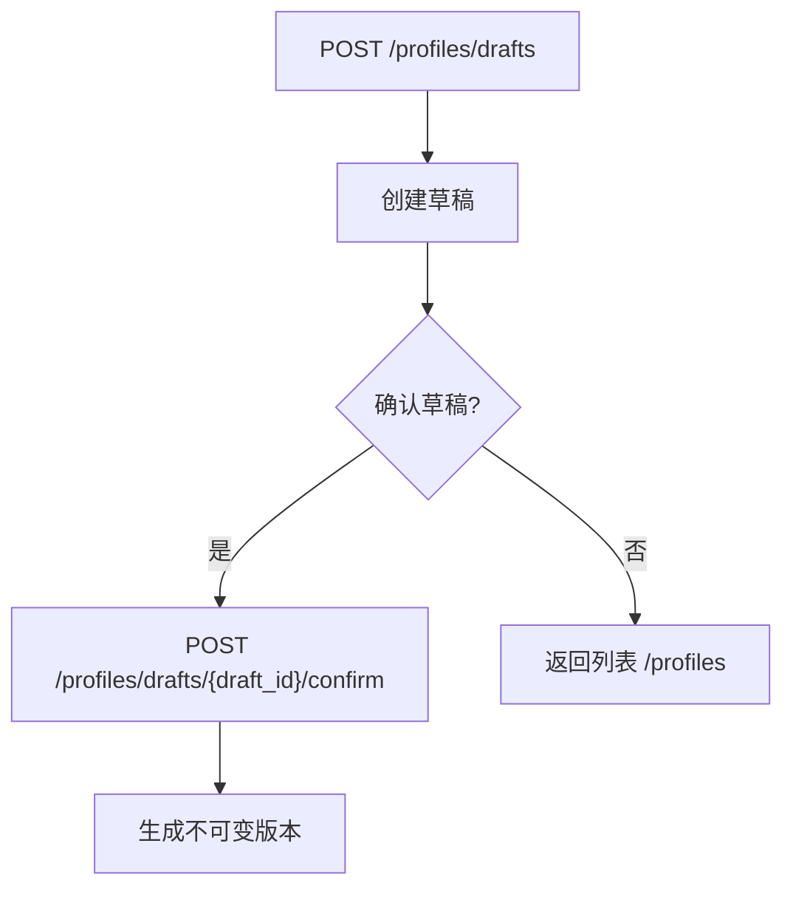
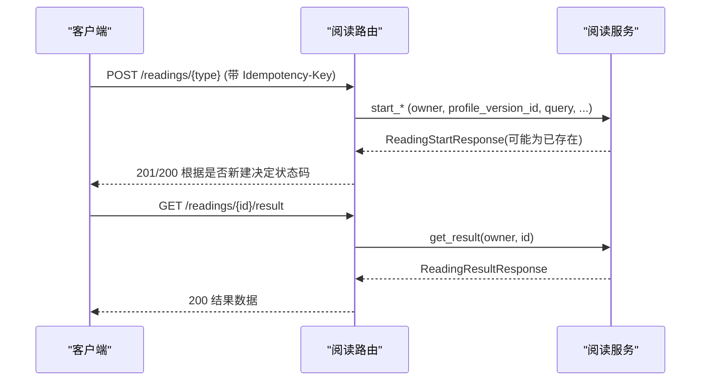
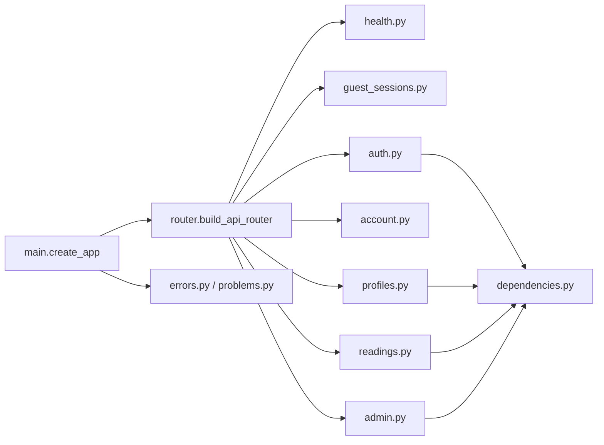

# 路由组织与版本管理

<cite>
**本文引用的文件**
- [backend/app/main.py](file://backend/app/main.py)
- [backend/app/api/router.py](file://backend/app/api/router.py)
- [backend/app/api/health.py](file://backend/app/api/health.py)
- [backend/app/api/auth.py](file://backend/app/api/auth.py)
- [backend/app/api/account.py](file://backend/app/api/account.py)
- [backend/app/api/guest_sessions.py](file://backend/app/api/guest_sessions.py)
- [backend/app/api/profiles.py](file://backend/app/api/profiles.py)
- [backend/app/api/readings.py](file://backend/app/api/readings.py)
- [backend/app/api/admin.py](file://backend/app/api/admin.py)
- [backend/app/api/dependencies.py](file://backend/app/api/dependencies.py)
- [backend/app/api/errors.py](file://backend/app/api/errors.py)
- [backend/app/api/problems.py](file://backend/app/api/problems.py)
- [contracts/openapi/v1.yaml](file://contracts/openapi/v1.yaml)
</cite>

## 目录
1. [简介](#简介)
2. [项目结构](#项目结构)
3. [核心组件](#核心组件)
4. [架构总览](#架构总览)
5. [详细组件分析](#详细组件分析)
6. [依赖关系分析](#依赖关系分析)
7. [性能考虑](#性能考虑)
8. [故障排查指南](#故障排查指南)
9. [结论](#结论)
10. [附录](#附录)

## 简介
本文件聚焦于 FastAPI 后端的路由组织与 API 版本化管理，系统性解析模块化构建模式、子路由器注册机制、路径前缀策略、URL 版本控制（/api/v1）、向后兼容与废弃接口处理、RESTful 命名规范、健康检查端点（就绪探针）以及监控指标暴露方式。同时给出路由性能优化建议与最佳实践示例，帮助团队在演进过程中保持 API 的稳定性、可观测性与可维护性。

## 项目结构
后端采用“按领域划分模块 + 集中式主路由器组装”的组织方式：
- 主应用负责生命周期、异常处理、全局配置与 OpenAPI 文档定制，并统一挂载 API 路由。
- 业务路由以独立模块存在（认证、账户、访客会话、资料、阅读、管理员），每个模块定义自己的 APIRouter 与前缀、标签与操作 ID。
- 健康检查作为独立子路由器，通过注入就绪探针实现外部依赖可用性探测。
- OpenAPI 契约文件集中描述对外暴露的 v1 接口，便于前后端对齐与自动化测试。

**图表来源**
- [backend/app/main.py:30-156](file://backend/app/main.py#L30-L156)
- [backend/app/api/router.py:12-21](file://backend/app/api/router.py#L12-L21)
- [backend/app/api/health.py:11-36](file://backend/app/api/health.py#L11-L36)

**章节来源**
- [backend/app/main.py:30-156](file://backend/app/main.py#L30-L156)
- [backend/app/api/router.py:12-21](file://backend/app/api/router.py#L12-L21)

## 核心组件
- 主应用工厂 create_app：装配数据库、限流器、OTP 适配器、日志与请求可观测性，注册全局异常处理器，挂载 API 路由，并定制 OpenAPI 输出。
- API 主路由器 build_api_router：以 /api/v1 为前缀，集中注册健康、访客、认证、账户、资料、阅读与管理员子路由。
- 健康检查子路由：提供 /health/live 与 /health/ready，后者通过注入的可等待就绪探针检测依赖可用性。
- 各业务子路由：遵循 RESTful 风格，使用 tags 分组、operation_id 标识、CSRF 校验与速率限制。
- 依赖与错误处理：统一的数据库会话、所有者识别、CSRF 校验、私有响应标记；统一的 ApiProblem 与 problem_response 输出。

**章节来源**
- [backend/app/main.py:30-156](file://backend/app/main.py#L30-L156)
- [backend/app/api/router.py:12-21](file://backend/app/api/router.py#L12-L21)
- [backend/app/api/health.py:11-36](file://backend/app/api/health.py#L11-L36)
- [backend/app/api/dependencies.py:19-137](file://backend/app/api/dependencies.py#L19-L137)
- [backend/app/api/errors.py:1-17](file://backend/app/api/errors.py#L1-L17)
- [backend/app/api/problems.py:5-28](file://backend/app/api/problems.py#L5-L28)

## 架构总览
下图展示从请求进入 FastAPI 到具体业务处理的调用链，包括版本化前缀、健康检查与业务路由的装配关系。

**图表来源**
- [backend/app/main.py:115-152](file://backend/app/main.py#L115-L152)
- [backend/app/api/router.py:12-21](file://backend/app/api/router.py#L12-L21)
- [backend/app/api/health.py:11-36](file://backend/app/api/health.py#L11-L36)
- [backend/app/api/auth.py:27-161](file://backend/app/api/auth.py#L27-L161)
- [backend/app/api/readings.py:42-399](file://backend/app/api/readings.py#L42-L399)

## 详细组件分析

### 主路由器构建与子路由注册
- 主路由器以 /api/v1 为前缀，确保所有对外 API 具备明确的版本边界。
- 子路由注册顺序体现关注点分离：健康检查优先，随后是身份与会话、资源型路由（资料、阅读）、管理后台。
- 每个子路由模块内部使用 prefix 进一步细分资源域，并通过 tags 与 operation_id 提升可读性与工具生成质量。

**图表来源**
- [backend/app/api/router.py:12-21](file://backend/app/api/router.py#L12-L21)

**章节来源**
- [backend/app/api/router.py:12-21](file://backend/app/api/router.py#L12-L21)

### URL 路径版本控制与向后兼容
- 版本化策略：所有对外 API 统一位于 /api/v1，便于未来引入 /api/v2 时进行灰度与并行运行。
- 向后兼容性：新增字段应默认可选或兼容旧客户端；删除字段需保留一段时间并提供迁移指引；变更行为需通过版本升级而非破坏性更新。
- 废弃接口处理：对即将下线接口可通过返回特定状态码（如 410 Gone）或 404 配合告警与日志，并在 OpenAPI 中标注弃用信息。当前代码未显式实现 410，但可在路由层扩展。

**章节来源**
- [backend/app/api/router.py:12-21](file://backend/app/api/router.py#L12-L21)
- [contracts/openapi/v1.yaml:1-200](file://contracts/openapi/v1.yaml#L1-L200)

### 健康检查端点与就绪探针集成
- /health/live：进程存活检查，快速返回服务是否可接收请求。
- /health/ready：依赖就绪检查，调用注入的可等待探针（例如数据库连通性）。失败时返回 503 并附带问题类型，便于编排系统（Kubernetes）进行流量摘除。
- 探针注入：主应用将数据库探针作为默认就绪探针传入，支持测试环境替换。

**图表来源**
- [backend/app/api/health.py:11-36](file://backend/app/api/health.py#L11-L36)
- [backend/app/main.py:140-152](file://backend/app/main.py#L140-L152)

**章节来源**
- [backend/app/api/health.py:11-36](file://backend/app/api/health.py#L11-L36)
- [backend/app/main.py:140-152](file://backend/app/main.py#L140-L152)

### 认证与授权路由（/auth、/account、/guest-sessions）
- 访客会话：创建短生命周期匿名会话，设置 HttpOnly Cookie，并进行网络维度限速。
- 认证流程：发送 OTP 验证码（支持短信/邮箱通道），验证后建立设备会话并设置安全 Cookie；登出撤销会话。
- 账户查询：读取当前用户与已验证登录身份，标记响应为私有，禁止缓存与索引。
- CSRF 保护：双提交令牌校验，防止跨站请求伪造。

**图表来源**
- [backend/app/api/auth.py:27-161](file://backend/app/api/auth.py#L27-L161)
- [backend/app/api/guest_sessions.py:13-53](file://backend/app/api/guest_sessions.py#L13-L53)
- [backend/app/api/dependencies.py:39-130](file://backend/app/api/dependencies.py#L39-L130)

**章节来源**
- [backend/app/api/auth.py:27-161](file://backend/app/api/auth.py#L27-L161)
- [backend/app/api/guest_sessions.py:13-53](file://backend/app/api/guest_sessions.py#L13-L53)
- [backend/app/api/account.py:10-29](file://backend/app/api/account.py#L10-L29)
- [backend/app/api/dependencies.py:39-130](file://backend/app/api/dependencies.py#L39-L130)

### 资料路由（/profiles）
- 草稿创建与确认：先创建草稿，再一次性确认为不可变版本，避免中间态被重复消费。
- 列表查询：列出当前拥有者的资料摘要。
- 速率限制：写操作按拥有者维度限速，防止滥用。

**图表来源**
- [backend/app/api/profiles.py:28-111](file://backend/app/api/profiles.py#L28-L111)

**章节来源**
- [backend/app/api/profiles.py:28-111](file://backend/app/api/profiles.py#L28-L111)

### 阅读路由（/readings）
- 启动多种阅读类型：预览、今日、周、六爻等，均支持幂等键（Idempotency-Key）防重放。
- 输入补充与结果获取：分阶段交互，先收集必要输入，再产出结果。
- 验证与后续跟进：允许用户对结果进行验证并提交后续问题。
- 速率限制：写操作按拥有者维度限速，保障系统稳定性。

**图表来源**
- [backend/app/api/readings.py:42-399](file://backend/app/api/readings.py#L42-L399)

**章节来源**
- [backend/app/api/readings.py:42-399](file://backend/app/api/readings.py#L42-L399)

### 管理员路由（/admin）
- 员工登录/登出：基于会话与 CSRF 双重保护，支持引导账号初始化。
- 个人信息与概览：受保护的只读接口，用于管理后台展示。
- 速率限制：登录尝试按邮箱维度限速，防止暴力破解。

**章节来源**
- [backend/app/api/admin.py:33-200](file://backend/app/api/admin.py#L33-L200)

### 开放 API 契约（OpenAPI v1）
- 契约文件定义了 /api/v1 下所有公开端点的操作 ID、标签、请求体与响应模型，便于前端生成与一致性校验。
- 健康、身份、资料、阅读等分组清晰，便于团队协作与自动化测试。

**章节来源**
- [contracts/openapi/v1.yaml:1-200](file://contracts/openapi/v1.yaml#L1-L200)

## 依赖关系分析
- 主应用依赖：
  - 配置中心 Settings：加载环境变量、校验生产安全约束。
  - 数据库与会话：通过依赖注入提供异步会话，统一事务边界。
  - 限流器：针对访客会话创建、资料/阅读写入、管理员登录等关键路径实施速率限制。
  - 可观测性：日志与请求追踪安装。
- 路由依赖：
  - 依赖模块 dependencies：数据库会话、CSRF、所有者识别、私有响应标记。
  - 错误处理：ApiProblem 与 problem_response 统一错误格式。
  - 业务服务：各模块通过 service/repository 访问领域逻辑与持久化。

**图表来源**
- [backend/app/main.py:30-156](file://backend/app/main.py#L30-L156)
- [backend/app/api/router.py:12-21](file://backend/app/api/router.py#L12-L21)
- [backend/app/api/dependencies.py:19-137](file://backend/app/api/dependencies.py#L19-L137)
- [backend/app/api/errors.py:1-17](file://backend/app/api/errors.py#L1-L17)
- [backend/app/api/problems.py:5-28](file://backend/app/api/problems.py#L5-L28)

**章节来源**
- [backend/app/main.py:30-156](file://backend/app/main.py#L30-L156)
- [backend/app/api/router.py:12-21](file://backend/app/api/router.py#L12-L21)
- [backend/app/api/dependencies.py:19-137](file://backend/app/api/dependencies.py#L19-L137)
- [backend/app/api/errors.py:1-17](file://backend/app/api/errors.py#L1-L17)
- [backend/app/api/problems.py:5-28](file://backend/app/api/problems.py#L5-L28)

## 性能考虑
- 路由前缀与分组：使用 /api/v1 前缀与 tags 分组，减少路由匹配开销并提升文档可读性。
- 幂等性：写操作支持 Idempotency-Key 头，避免重复提交导致的状态不一致与额外计算。
- 速率限制：对敏感写操作（资料、阅读、管理员登录）与访客会话创建实施窗口限流，保护后端资源。
- 会话与 Cookie：使用 HttpOnly 与安全 Cookie，减少 XSS 风险与不必要的数据传输。
- 响应缓存控制：私有响应标记 cache-control 与 robots 指令，避免敏感数据被缓存或索引。
- OpenAPI 裁剪：移除 422 响应以减少文档噪声，聚焦业务契约。

[本节为通用性能指导，不直接分析具体文件]

## 故障排查指南
- 健康检查失败：
  - 检查 /health/ready 返回 503 的原因，查看问题类型是否为依赖不可用。
  - 确认就绪探针实现（默认数据库探针）是否正常连接。
- 认证失败：
  - 检查 CSRF 双提交是否正确携带 cookie 与 header。
  - 检查访客/设备会话是否有效且未过期。
- 速率限制触发：
  - 观察 429 响应，调整客户端重试策略与退避。
  - 根据业务场景调优限流参数（窗口大小与阈值）。
- 错误格式统一：
  - 所有业务异常通过 ApiProblem 抛出，并由全局处理器转换为 application/problem+json 格式，便于前端统一处理。

**章节来源**
- [backend/app/api/health.py:11-36](file://backend/app/api/health.py#L11-L36)
- [backend/app/api/dependencies.py:39-130](file://backend/app/api/dependencies.py#L39-L130)
- [backend/app/api/errors.py:1-17](file://backend/app/api/errors.py#L1-L17)
- [backend/app/api/problems.py:5-28](file://backend/app/api/problems.py#L5-L28)

## 结论
本项目通过清晰的模块化路由组织、严格的 URL 版本控制与健康检查机制，实现了稳定、可观测、易维护的 API 体系。借助 OpenAPI 契约与统一的错误处理，前后端协作顺畅，运维可快速定位问题。建议在后续演进中继续坚持版本化前缀、幂等设计、速率限制与私有响应标记，逐步完善废弃接口治理与监控指标暴露，持续提升系统的可靠性与可扩展性。

## 附录
- 路由命名规范建议：
  - 资源名词复数形式（如 profiles、readings）。
  - HTTP 动词映射：GET 列表/详情，POST 创建/动作，PUT/PATCH 更新，DELETE 删除。
  - 路径参数使用 UUID 或明确语义的标识符，避免歧义。
- 监控指标建议：
  - 在健康检查中增加自定义探针（如缓存、消息队列、外部服务）。
  - 结合请求可观测性，记录关键路径耗时与错误率，接入监控系统。

[本节为概念性内容，不直接分析具体文件]