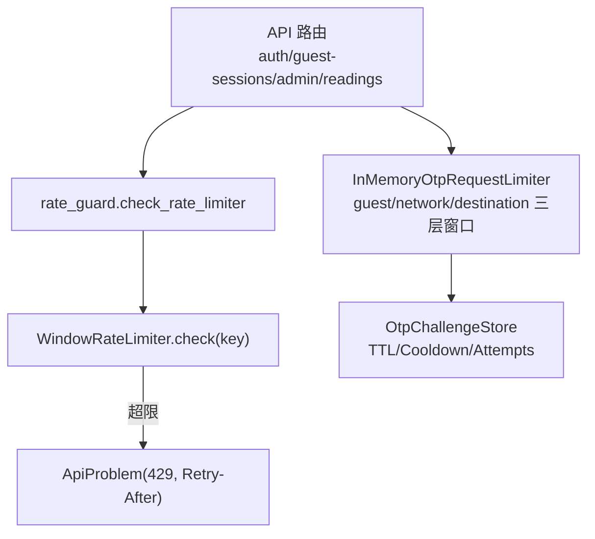
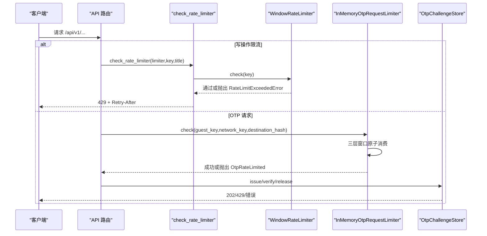
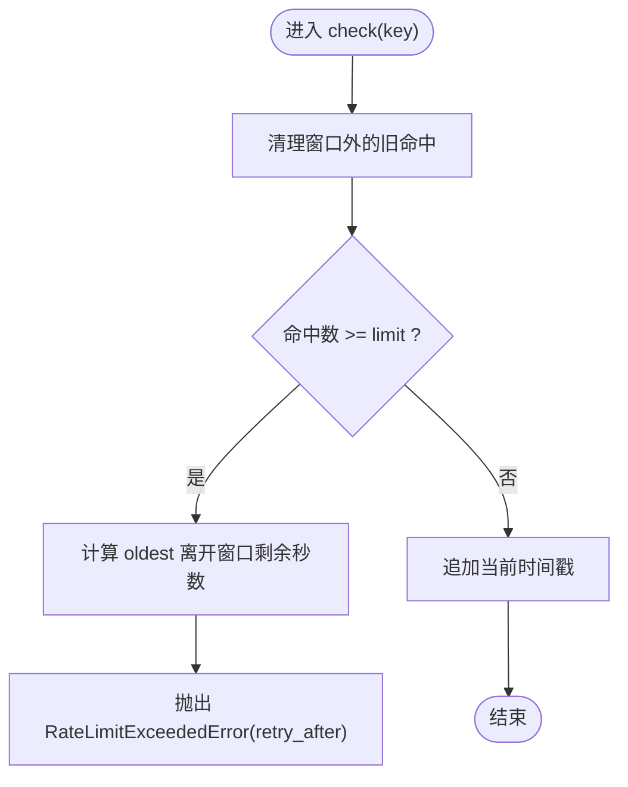
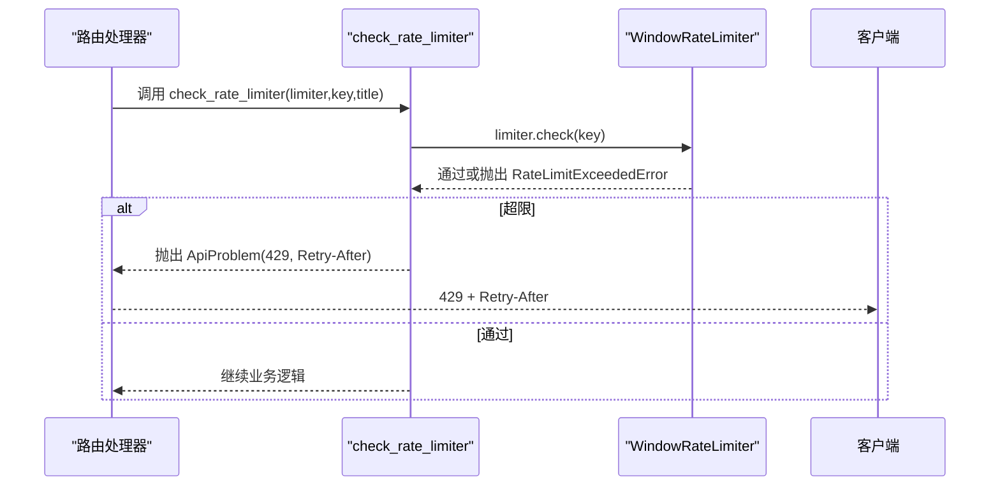
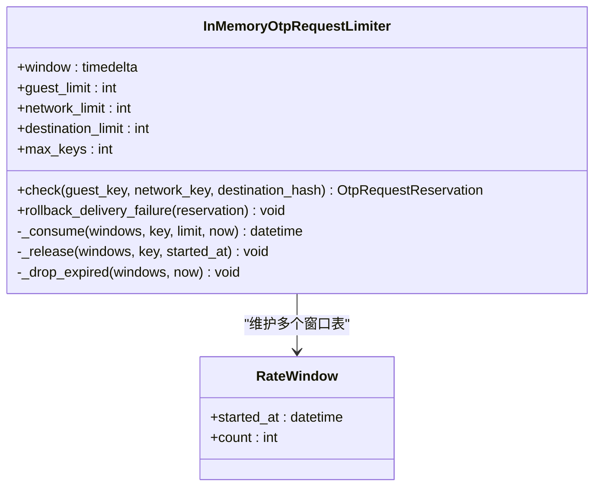
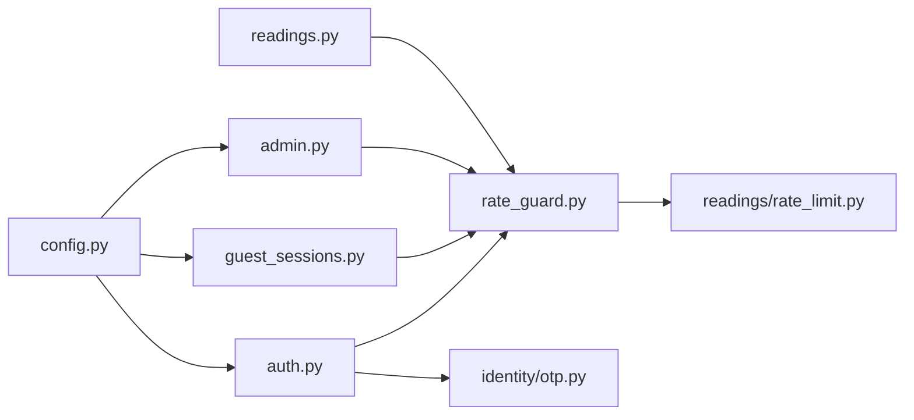

# 速率限制与流量控制

<cite>
**本文引用的文件**
- [backend/app/readings/rate_limit.py](file://backend/app/readings/rate_limit.py)
- [backend/app/api/rate_guard.py](file://backend/app/api/rate_guard.py)
- [backend/app/identity/otp.py](file://backend/app/identity/otp.py)
- [backend/app/config.py](file://backend/app/config.py)
- [backend/app/api/auth.py](file://backend/app/api/auth.py)
- [backend/app/api/guest_sessions.py](file://backend/app/api/guest_sessions.py)
- [backend/app/api/admin.py](file://backend/app/api/admin.py)
- [backend/tests/test_guest_sessions.py](file://backend/tests/test_guest_sessions.py)
- [backend/tests/test_auth.py](file://backend/tests/test_auth.py)
- [infra/EMAIL_OTP_RUNBOOK.md](file://infra/EMAIL_OTP_RUNBOOK.md)
</cite>

## 目录
1. [简介](#简介)
2. [项目结构](#项目结构)
3. [核心组件](#核心组件)
4. [架构总览](#架构总览)
5. [详细组件分析](#详细组件分析)
6. [依赖关系分析](#依赖关系分析)
7. [性能考量](#性能考量)
8. [故障排查指南](#故障排查指南)
9. [结论](#结论)
10. [附录](#附录)

## 简介
本文件系统性梳理本项目中的速率限制与流量控制实现，覆盖滑动窗口算法、多维度限流策略（IP、用户、端点）、HTTP 429 响应与重试建议头、配置管理与环境差异化、测试方法与调优建议。当前代码库以“进程内滑动窗口”为主，并在 OTP 场景提供“多层级窗口 + 原子回滚”的本地实现；生产部署文档指出需引入 Redis/Postgres 等持久化存储以实现分布式锁、计数器与过期时间管理。

## 项目结构
- 通用滑动窗口限流器：用于写操作维度的单实例限流
- API 网关式统一处理：将限流异常转换为标准 HTTP 429 并附带 Retry-After
- OTP 多层级限流：访客、网络（IP）、目的地（邮箱/手机号）三层窗口，支持失败回滚
- 配置中心：集中暴露限流参数与环境安全校验
- 测试：覆盖窗口恢复、代理 IP 区分、失败回滚等行为验证

图表来源
- [backend/app/api/rate_guard.py:5-19](file://backend/app/api/rate_guard.py#L5-L19)
- [backend/app/readings/rate_limit.py:9-60](file://backend/app/readings/rate_limit.py#L9-L60)
- [backend/app/identity/otp.py:64-180](file://backend/app/identity/otp.py#L64-L180)

章节来源
- [backend/app/readings/rate_limit.py:1-61](file://backend/app/readings/rate_limit.py#L1-L61)
- [backend/app/api/rate_guard.py:1-20](file://backend/app/api/rate_guard.py#L1-L20)
- [backend/app/identity/otp.py:1-304](file://backend/app/identity/otp.py#L1-L304)
- [backend/app/config.py:62-149](file://backend/app/config.py#L62-L149)

## 核心组件
- WindowRateLimiter：基于 deque 的滑动窗口，按 key 统计请求时间戳，窗口外自动清理，超限返回 retry_after
- rate_guard.check_rate_limiter：捕获限流异常，统一输出 429 与 Retry-After 头
- InMemoryOtpRequestLimiter：三层窗口（guest/network/destination），原子消费与失败回滚，保护网络层不被绕过
- OtpChallengeStore：验证码挑战的 TTL、冷却期、尝试次数限制，失败释放避免状态泄漏
- Settings：集中定义各维度限流参数与环境安全约束

章节来源
- [backend/app/readings/rate_limit.py:9-60](file://backend/app/readings/rate_limit.py#L9-L60)
- [backend/app/api/rate_guard.py:5-19](file://backend/app/api/rate_guard.py#L5-L19)
- [backend/app/identity/otp.py:64-180](file://backend/app/identity/otp.py#L64-L180)
- [backend/app/identity/otp.py:221-304](file://backend/app/identity/otp.py#L221-L304)
- [backend/app/config.py:126-149](file://backend/app/config.py#L126-L149)

## 架构总览
下图展示从 API 路由到限流器的调用链，以及 OTP 场景的多层窗口与回滚机制。

图表来源
- [backend/app/api/rate_guard.py:5-19](file://backend/app/api/rate_guard.py#L5-L19)
- [backend/app/readings/rate_limit.py:23-49](file://backend/app/readings/rate_limit.py#L23-L49)
- [backend/app/identity/otp.py:86-122](file://backend/app/identity/otp.py#L86-L122)
- [backend/app/identity/otp.py:240-304](file://backend/app/identity/otp.py#L240-L304)

## 详细组件分析

### 滑动窗口算法（WindowRateLimiter）
- 数据结构：每个 key 维护一个有序的时间戳队列，窗口起始时间为 now - window_seconds
- 复杂度：每次检查为 O(1) 均摊（尾部追加，头部清理过期项）
- 行为：达到 limit 后计算 oldest 离开窗口的剩余秒数作为 retry_after
- 适用场景：进程内写操作限流（如读取生成、资料写入等）

图表来源
- [backend/app/readings/rate_limit.py:23-49](file://backend/app/readings/rate_limit.py#L23-L49)

章节来源
- [backend/app/readings/rate_limit.py:9-60](file://backend/app/readings/rate_limit.py#L9-L60)

### 统一限流响应（rate_guard）
- 职责：捕获限流异常，转换为 ApiProblem，设置 HTTP 429 与 Retry-After 头
- 优点：接口层统一限流语义，便于前端重试策略

图表来源
- [backend/app/api/rate_guard.py:5-19](file://backend/app/api/rate_guard.py#L5-L19)

章节来源
- [backend/app/api/rate_guard.py:1-20](file://backend/app/api/rate_guard.py#L1-L20)

### OTP 多层级限流（InMemoryOtpRequestLimiter）
- 维度：
  - 访客级别（guest_key）：防止同一会话滥用
  - 网络级别（network_key）：基于 IP 的聚合限制，抵御来自同一网络的攻击
  - 目的地级别（destination_hash）：对邮箱/手机号进行哈希后的频率限制
- 原子性与回滚：在锁内依次消费三层窗口，若后续层拒绝则回滚已消费的 guest/network 计数，保证不浪费容量
- 资源保护：当窗口表键数量超过阈值时主动清理过期项，必要时直接限流以避免内存膨胀

图表来源
- [backend/app/identity/otp.py:64-180](file://backend/app/identity/otp.py#L64-L180)

章节来源
- [backend/app/identity/otp.py:64-180](file://backend/app/identity/otp.py#L64-L180)

### 验证码挑战与冷却（OtpChallengeStore）
- 功能：发放挑战码、设置 TTL、冷却期、最大尝试次数
- 失败释放：未送达的挑战会释放其冷却占用，使重试立即可用
- 验证：校验过期、尝试次数、HMAC 一致性，成功后标记消耗

章节来源
- [backend/app/identity/otp.py:221-304](file://backend/app/identity/otp.py#L221-L304)

### 配置与环境差异化（Settings）
- 限流相关配置：
  - OTP：窗口时长、访客/网络/目的地限制、冷却期、最大尝试次数
  - 访客会话创建：速率限制与窗口时长
  - 读写操作：读取/资料写入的速率限制与窗口时长
  - 管理员登录：登录速率限制与窗口时长
  - 可信代理 CIDR：用于正确识别真实客户端 IP
- 生产安全：禁止使用 fake 适配器、强制安全 Cookie、固定运行时路径等

章节来源
- [backend/app/config.py:126-149](file://backend/app/config.py#L126-L149)
- [backend/app/config.py:188-329](file://backend/app/config.py#L188-L329)

### 多维度限流策略映射
- IP 级别限制：通过 network_key（可结合 X-Forwarded-For 与 trusted_proxy_cidrs）实现
- 用户级别限制：通过 guest_key（会话标识）实现
- API 端点级别限制：通过 WindowRateLimiter 的 key（例如按端点+主体组合）实现

章节来源
- [backend/tests/test_auth.py:290-326](file://backend/tests/test_auth.py#L290-L326)
- [backend/app/api/guest_sessions.py:32-37](file://backend/app/api/guest_sessions.py#L32-L37)
- [backend/app/api/admin.py:56-64](file://backend/app/api/admin.py#L56-L64)

## 依赖关系分析
- API 路由依赖 rate_guard 统一处理限流异常
- WindowRateLimiter 被多个写操作端点复用
- OTP 流程依赖 InMemoryOtpRequestLimiter 与 OtpChallengeStore
- 配置由 Settings 集中管理，影响所有限流行为

图表来源
- [backend/app/api/auth.py:16-110](file://backend/app/api/auth.py#L16-L110)
- [backend/app/api/guest_sessions.py:32-37](file://backend/app/api/guest_sessions.py#L32-L37)
- [backend/app/api/admin.py:56-64](file://backend/app/api/admin.py#L56-L64)
- [backend/app/api/rate_guard.py:5-19](file://backend/app/api/rate_guard.py#L5-L19)
- [backend/app/readings/rate_limit.py:9-60](file://backend/app/readings/rate_limit.py#L9-L60)
- [backend/app/identity/otp.py:64-180](file://backend/app/identity/otp.py#L64-L180)
- [backend/app/config.py:126-149](file://backend/app/config.py#L126-L149)

章节来源
- [backend/app/api/auth.py:16-110](file://backend/app/api/auth.py#L16-L110)
- [backend/app/api/guest_sessions.py:32-37](file://backend/app/api/guest_sessions.py#L32-L37)
- [backend/app/api/admin.py:56-64](file://backend/app/api/admin.py#L56-L64)
- [backend/app/api/rate_guard.py:5-19](file://backend/app/api/rate_guard.py#L5-L19)
- [backend/app/readings/rate_limit.py:9-60](file://backend/app/readings/rate_limit.py#L9-L60)
- [backend/app/identity/otp.py:64-180](file://backend/app/identity/otp.py#L64-L180)
- [backend/app/config.py:126-149](file://backend/app/config.py#L126-L149)

## 性能考量
- 滑动窗口使用 deque，时间复杂度接近 O(1)，适合高并发写限流
- OTP 多层窗口在单进程内使用 asyncio.Lock 保证原子性，但多实例部署时需持久化
- 键空间保护：当窗口表键过多时主动清理过期项，避免内存增长
- 生产部署文档明确指出：当前为单进程约束，需引入 Redis/Postgres 以支持多实例安全限流

章节来源
- [backend/app/readings/rate_limit.py:23-49](file://backend/app/readings/rate_limit.py#L23-L49)
- [backend/app/identity/otp.py:148-180](file://backend/app/identity/otp.py#L148-L180)
- [infra/EMAIL_OTP_RUNBOOK.md:106-113](file://infra/EMAIL_OTP_RUNBOOK.md#L106-L113)

## 故障排查指南
- 429 响应与重试：
  - 写操作：通过 rate_guard 统一返回 429，并携带 Retry-After 头
  - OTP：根据 OtpRateLimited 或验证失败返回 429，提示等待
- 窗口恢复：
  - 测试验证了窗口过期后请求恢复通过，且包含 Retry-After 头
- 代理 IP 识别：
  - 通过 trusted_proxy_cidrs 与 X-Forwarded-For 正确区分真实客户端 IP
- 失败回滚：
  - OTP 投递失败会释放挑战与冷却占用，允许立即重试，同时保留网络窗口防止绕过

章节来源
- [backend/app/api/rate_guard.py:11-19](file://backend/app/api/rate_guard.py#L11-L19)
- [backend/app/identity/otp.py:124-140](file://backend/app/identity/otp.py#L124-L140)
- [backend/tests/test_guest_sessions.py:146-176](file://backend/tests/test_guest_sessions.py#L146-L176)
- [backend/tests/test_auth.py:290-326](file://backend/tests/test_auth.py#L290-L326)
- [backend/tests/test_auth.py:408-449](file://backend/tests/test_auth.py#L408-L449)

## 结论
本项目在当前阶段采用进程内滑动窗口与多层级窗口实现速率限制，具备清晰的异常处理与重试指导。未来在多实例生产环境中应引入 Redis/Postgres 实现分布式锁、计数器与过期时间管理，以确保跨实例的一致性与安全性。

## 附录

### 限流算法选择与应用
- 滑动窗口：当前实现的核心算法，适用于写操作与 OTP 多层窗口
- 令牌桶/漏桶：当前代码未实现，可在需要平滑突发流量的场景考虑引入

### Redis 应用规划
- 分布式锁：确保多实例下原子更新窗口计数
- 计数器存储：替代进程内 dict/deque，支持持久化与共享
- 过期时间管理：利用 TTL 自动清理过期键，降低维护成本

### 限流配置管理
- 动态配置：可通过环境变量注入不同环境的限流参数
- 环境差异化：Settings 内置生产安全校验，防止误配
- 监控指标：可结合告警系统记录 429 比例与热点 key

### 限流响应处理
- HTTP 429：统一通过 ApiProblem 返回
- 重试建议头：Retry-After 指示客户端等待时间
- 用户体验：前端依据 Retry-After 实施退避重试，避免雪崩

### 测试方法
- 窗口恢复：验证过期后请求恢复并通过
- 代理 IP 区分：验证 trusted_proxy_cidrs 下的真实 IP 识别
- 失败回滚：验证投递失败不会残留状态，允许立即重试

章节来源
- [backend/app/config.py:126-149](file://backend/app/config.py#L126-L149)
- [backend/tests/test_guest_sessions.py:146-176](file://backend/tests/test_guest_sessions.py#L146-L176)
- [backend/tests/test_auth.py:290-326](file://backend/tests/test_auth.py#L290-L326)
- [infra/EMAIL_OTP_RUNBOOK.md:106-113](file://infra/EMAIL_OTP_RUNBOOK.md#L106-L113)