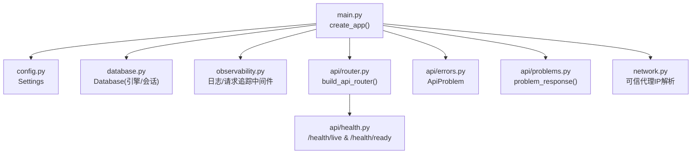
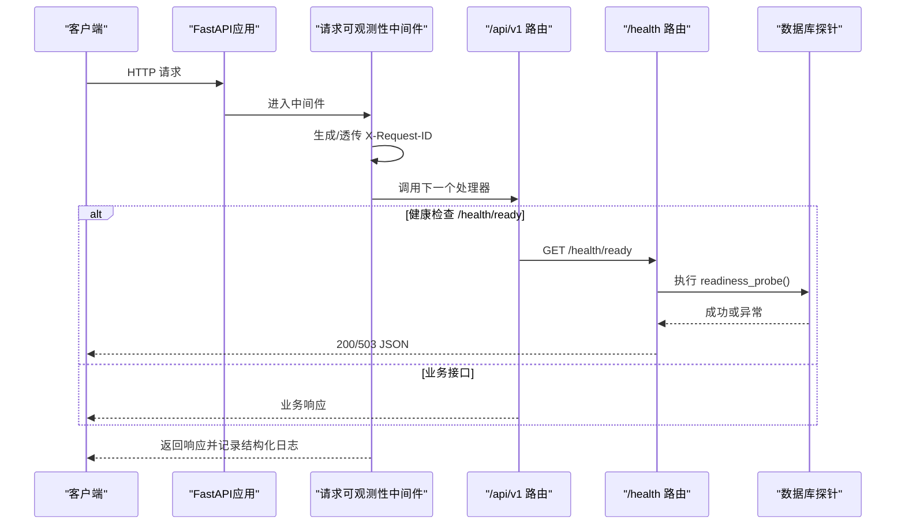
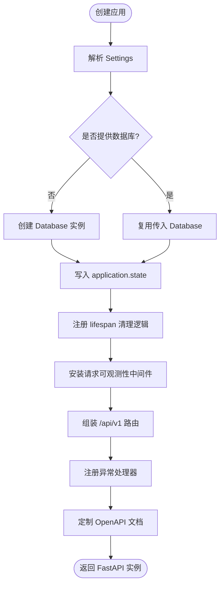
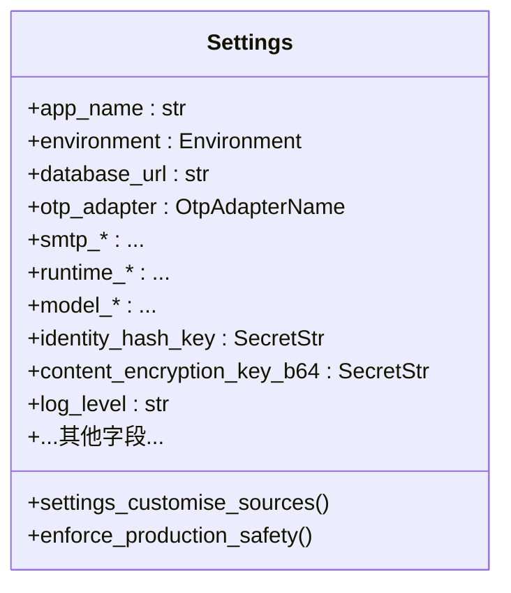
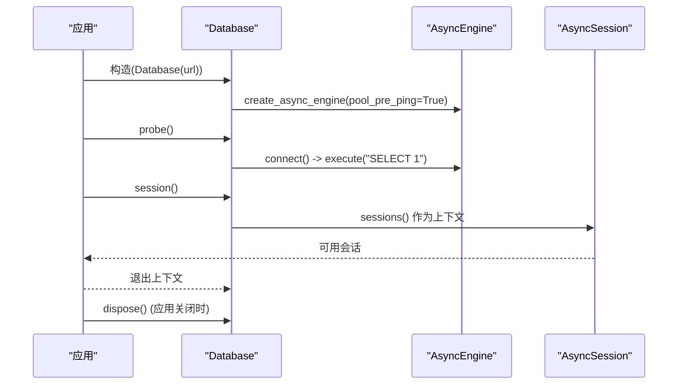
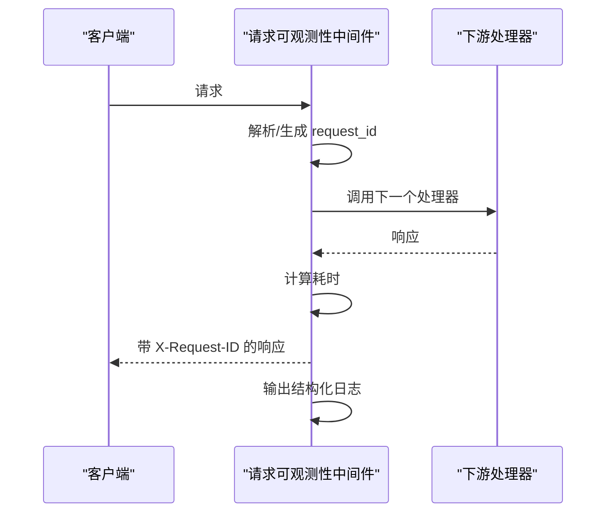
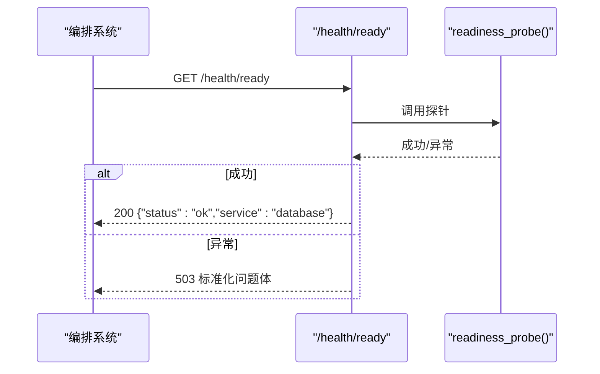
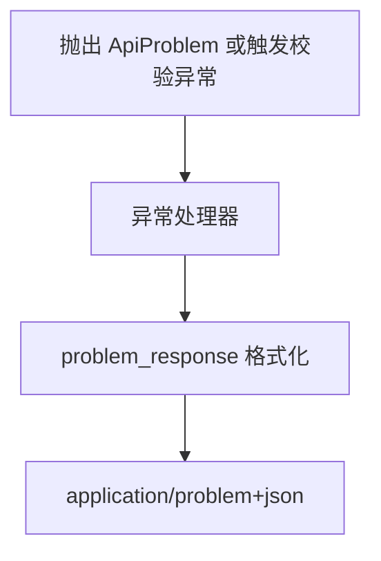
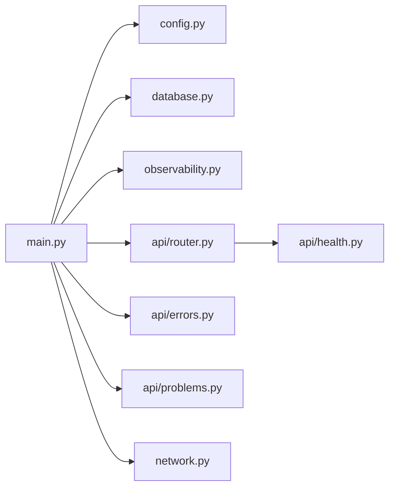

# FastAPI 应用核心

<cite>
**本文引用的文件**
- [backend/app/main.py](file://backend/app/main.py)
- [backend/app/config.py](file://backend/app/config.py)
- [backend/app/database.py](file://backend/app/database.py)
- [backend/app/observability.py](file://backend/app/observability.py)
- [backend/app/api/health.py](file://backend/app/api/health.py)
- [backend/app/api/router.py](file://backend/app/api/router.py)
- [backend/app/api/errors.py](file://backend/app/api/errors.py)
- [backend/app/api/problems.py](file://backend/app/api/problems.py)
- [backend/app/network.py](file://backend/app/network.py)
</cite>

## 目录
1. [简介](#简介)
2. [项目结构](#项目结构)
3. [核心组件](#核心组件)
4. [架构总览](#架构总览)
5. [详细组件分析](#详细组件分析)
6. [依赖关系分析](#依赖关系分析)
7. [性能考量](#性能考量)
8. [故障排查指南](#故障排查指南)
9. [结论](#结论)
10. [附录：配置示例与最佳实践](#附录配置示例与最佳实践)

## 简介
本文件聚焦后端 FastAPI 应用的核心实现，围绕应用工厂函数 create_app 的生命周期管理、依赖注入、中间件注册与异常处理机制展开；深入解析 Settings 配置系统的环境变量管理、配置验证与运行时切换；说明数据库连接池初始化与会话管理策略；阐述可观测性集成（日志、请求追踪、性能监控）；解释健康检查端点与就绪探针机制；并给出错误处理策略（自定义异常类型、HTTP 状态码映射、错误响应格式化）、配置示例与最佳实践。

## 项目结构
后端应用采用模块化组织，核心入口在 main.py，通过 create_app 构建 FastAPI 实例，集中完成：
- 应用生命周期钩子（lifespan）
- 全局状态与依赖注入（settings、database、rate limiters、OTP 相关组件）
- 中间件安装（请求可观测性）
- 路由装配（统一前缀 /api/v1）
- 异常处理器（业务问题与参数校验）
- OpenAPI 文档定制

**图表来源**
- [backend/app/main.py:30-152](file://backend/app/main.py#L30-L152)
- [backend/app/config.py:62-335](file://backend/app/config.py#L62-L335)
- [backend/app/database.py:12-33](file://backend/app/database.py#L12-L33)
- [backend/app/observability.py:14-52](file://backend/app/observability.py#L14-L52)
- [backend/app/api/router.py:12-22](file://backend/app/api/router.py#L12-L22)
- [backend/app/api/health.py:11-37](file://backend/app/api/health.py#L11-L37)
- [backend/app/api/errors.py:1-17](file://backend/app/api/errors.py#L1-L17)
- [backend/app/api/problems.py:5-28](file://backend/app/api/problems.py#L5-L28)
- [backend/app/network.py:16-72](file://backend/app/network.py#L16-L72)

**章节来源**
- [backend/app/main.py:30-152](file://backend/app/main.py#L30-L152)
- [backend/app/api/router.py:12-22](file://backend/app/api/router.py#L12-L22)

## 核心组件
- 应用工厂 create_app：负责应用装配、生命周期、依赖注入、中间件与异常处理。
- Settings：基于 Pydantic Settings 的配置模型，提供环境变量加载、严格的生产环境安全校验与默认值。
- Database：封装异步 SQLAlchemy 引擎与会话工厂，提供探活与资源清理能力。
- Observability：统一日志级别设置与 HTTP 请求级可观测性中间件（请求ID、耗时、JSON 结构化日志）。
- Health：/health/live 与 /health/ready 端点，后者通过外部传入的 readiness_probe 回调检测依赖可用性。
- 错误处理：统一的 ApiProblem 异常与 problem_response 响应格式，结合 FastAPI 内置校验异常处理。
- Network：可信代理网络解析与客户端 IP 稳定解析工具。

**章节来源**
- [backend/app/main.py:30-152](file://backend/app/main.py#L30-L152)
- [backend/app/config.py:62-335](file://backend/app/config.py#L62-L335)
- [backend/app/database.py:12-33](file://backend/app/database.py#L12-L33)
- [backend/app/observability.py:14-52](file://backend/app/observability.py#L14-L52)
- [backend/app/api/health.py:11-37](file://backend/app/api/health.py#L11-L37)
- [backend/app/api/errors.py:1-17](file://backend/app/api/errors.py#L1-L17)
- [backend/app/api/problems.py:5-28](file://backend/app/api/problems.py#L5-L28)
- [backend/app/network.py:16-72](file://backend/app/network.py#L16-L72)

## 架构总览
FastAPI 应用以 create_app 为中心，将配置、数据库、速率限制、OTP 适配器、可信代理等依赖注入到 application.state，并通过中间件和异常处理器形成横切关注点。路由按模块拆分，统一挂载于 /api/v1，健康检查独立挂载于 /health。

**图表来源**
- [backend/app/main.py:138-140](file://backend/app/main.py#L138-L140)
- [backend/app/observability.py:27-52](file://backend/app/observability.py#L27-L52)
- [backend/app/api/router.py:12-22](file://backend/app/api/router.py#L12-L22)
- [backend/app/api/health.py:11-37](file://backend/app/api/health.py#L11-L37)
- [backend/app/database.py:23-28](file://backend/app/database.py#L23-L28)

## 详细组件分析

### 应用工厂 create_app：生命周期、依赖注入、中间件与异常处理
- 生命周期管理：
  - 使用 asynccontextmanager 定义 lifespan，在应用关闭时清理各速率限制器，并在拥有数据库实例时释放连接池。
- 依赖注入：
  - 将 Settings、Database、Session 工厂、OTP 挑战存储与限流器、可信代理网络、OTP 发送适配器等写入 application.state，供后续依赖解析与业务逻辑使用。
- 中间件注册：
  - 安装请求可观测性中间件，为每个请求注入 request_id 并输出结构化日志。
- 异常处理：
  - 注册 ApiProblem 与 RequestValidationError 的统一处理器，均通过 problem_response 生成标准化的 Problem Details 风格响应体。
- OpenAPI 定制：
  - 移除 422 响应声明，避免对外暴露内部校验细节。

**图表来源**
- [backend/app/main.py:30-152](file://backend/app/main.py#L30-L152)

**章节来源**
- [backend/app/main.py:30-152](file://backend/app/main.py#L30-L152)

### Settings 配置系统：环境变量、验证与运行时切换
- 环境变量管理：
  - 使用 pydantic-settings 的 BaseSettings，前缀 MINGLI_，大小写不敏感，忽略多余字段。
  - 支持从 init、精确映射源（如 DEEPSEEK_API_KEY）、过滤后的环境变量、dotenv、文件密钥等多源合并。
- 配置验证：
  - 生产环境强制安全策略：必须启用 secure cookie、禁止 fake OTP/Runtime/Model 适配器、要求固定路径与受控 manifest/capability digest、禁止明文引导凭据等。
  - 对 SMTP、内容加密密钥、模型超时与令牌上限等进行范围与格式校验。
- 运行时切换：
  - 通过 environment 字段区分 local/test/staging/production，不同环境触发不同的行为与约束。
  - get_settings 使用 lru_cache 缓存单例，便于多次获取一致配置。

**图表来源**
- [backend/app/config.py:62-335](file://backend/app/config.py#L62-L335)

**章节来源**
- [backend/app/config.py:62-335](file://backend/app/config.py#L62-L335)

### 数据库连接池与会话管理
- 连接池：
  - 使用 SQLAlchemy 异步引擎 create_async_engine，开启 pool_pre_ping 确保连接有效性。
- 会话工厂：
  - 使用 async_sessionmaker 创建 AsyncSession 工厂，提交后不过期，便于事务内读取。
- 探活与清理：
  - probe 方法执行 SELECT 1 探测数据库连通性。
  - dispose 方法释放引擎连接池。
- 会话上下文：
  - session 方法提供异步迭代器式会话上下文，自动管理生命周期。

**图表来源**
- [backend/app/database.py:12-33](file://backend/app/database.py#L12-L33)
- [backend/app/main.py:40-49](file://backend/app/main.py#L40-L49)

**章节来源**
- [backend/app/database.py:12-33](file://backend/app/database.py#L12-L33)
- [backend/app/main.py:40-49](file://backend/app/main.py#L40-L49)

### 可观测性：日志、请求追踪与性能监控
- 日志配置：
  - configure_logging 设置根日志级别为应用指定级别，并抑制传输层敏感日志器的噪声。
- 请求追踪：
  - 中间件从请求头 x-request-id 提取或生成唯一 ID，写入 request.state 并回写到响应头 X-Request-ID。
- 性能监控：
  - 记录每次请求的方法、路径、状态码与耗时（毫秒），输出为紧凑的 JSON 行日志，便于聚合与分析。

**图表来源**
- [backend/app/observability.py:14-52](file://backend/app/observability.py#L14-L52)

**章节来源**
- [backend/app/observability.py:14-52](file://backend/app/observability.py#L14-L52)

### 健康检查与就绪探针
- /health/live：快速存活检查，始终返回 ok。
- /health/ready：依赖探针回调，默认传入 database.probe，用于确认数据库可达；失败返回 503 并附带标准化问题体。

**图表来源**
- [backend/app/api/health.py:11-37](file://backend/app/api/health.py#L11-L37)
- [backend/app/database.py:23-28](file://backend/app/database.py#L23-L28)

**章节来源**
- [backend/app/api/health.py:11-37](file://backend/app/api/health.py#L11-L37)
- [backend/app/database.py:23-28](file://backend/app/database.py#L23-L28)

### 错误处理策略：自定义异常、状态码映射与响应格式化
- 自定义异常：
  - ApiProblem 携带 status、title、problem_type、detail、headers，用于表达领域错误语义。
- 统一响应：
  - problem_response 生成 application/problem+json 格式的响应体，包含 type、title、status、request_id 与可选 detail。
- 内置异常映射：
  - RequestValidationError 被捕获并转换为 400 的 invalid-request 问题体，屏蔽内部校验细节。
- 路由装配：
  - build_api_router 将健康检查与各业务路由统一挂载至 /api/v1。

**图表来源**
- [backend/app/api/errors.py:1-17](file://backend/app/api/errors.py#L1-L17)
- [backend/app/api/problems.py:5-28](file://backend/app/api/problems.py#L5-L28)
- [backend/app/main.py:115-136](file://backend/app/main.py#L115-L136)
- [backend/app/api/router.py:12-22](file://backend/app/api/router.py#L12-L22)

**章节来源**
- [backend/app/api/errors.py:1-17](file://backend/app/api/errors.py#L1-L17)
- [backend/app/api/problems.py:5-28](file://backend/app/api/problems.py#L5-L28)
- [backend/app/main.py:115-136](file://backend/app/main.py#L115-L136)
- [backend/app/api/router.py:12-22](file://backend/app/api/router.py#L12-L22)

### 可信代理与客户端 IP 解析
- parse_trusted_proxy_cidrs：将逗号分隔的 CIDR 字符串解析为网络元组。
- resolve_client_ip：在存在可信代理时，从 X-Forwarded-For 链中自右向左查找第一个不可信地址作为客户端真实 IP；否则回退到直连 peer 地址。
- 安全性：限制链长度、拒绝非法地址、规范化 IPv4-mapped IPv6。

**章节来源**
- [backend/app/network.py:16-72](file://backend/app/network.py#L16-L72)

## 依赖关系分析
- main.py 依赖 config、database、observability、api.router、api.health、api.errors、api.problems、network 等模块，形成“中心装配”模式。
- router.py 聚合多个业务路由与健康路由，降低主入口复杂度。
- health.py 通过回调解耦具体依赖检测，便于替换与测试。
- observability.py 作为横切中间件，对所有请求生效，无侵入地增强可观测性。

**图表来源**
- [backend/app/main.py:30-152](file://backend/app/main.py#L30-L152)
- [backend/app/api/router.py:12-22](file://backend/app/api/router.py#L12-L22)

**章节来源**
- [backend/app/main.py:30-152](file://backend/app/main.py#L30-L152)
- [backend/app/api/router.py:12-22](file://backend/app/api/router.py#L12-L22)

## 性能考量
- 数据库连接池：
  - 使用 pool_pre_ping 减少无效连接带来的失败重试成本；应用关闭时显式 dispose 释放资源。
- 请求可观测性：
  - 仅记录必要字段并以紧凑 JSON 输出，避免过大日志体积；使用高性能计时 time.perf_counter。
- 配置缓存：
  - get_settings 使用 lru_cache 避免重复解析环境变量。
- 速率限制：
  - 多类写入操作（阅读、档案、访客会话、管理员登录）均配置窗口型速率限制器，保护后端资源。

[本节为通用指导，不直接分析具体文件]

## 故障排查指南
- 启动阶段配置错误：
  - 若生产环境未设置 secure cookie、使用了禁用适配器或未注入必需密钥，Settings 验证会抛出异常，需检查对应环境变量。
- 健康检查失败：
  - /health/ready 返回 503 表示依赖不可用（通常为数据库不可达），检查数据库连接串与网络连通性。
- 请求无法追踪：
  - 若响应头缺少 X-Request-ID，检查中间件是否安装以及上游代理是否透传/改写请求头。
- 错误响应不符合预期：
  - 确认业务代码抛出 ApiProblem 或使用标准异常，确保 problem_response 正确填充字段。

**章节来源**
- [backend/app/config.py:188-329](file://backend/app/config.py#L188-L329)
- [backend/app/api/health.py:18-34](file://backend/app/api/health.py#L18-L34)
- [backend/app/observability.py:20-52](file://backend/app/observability.py#L20-L52)
- [backend/app/api/problems.py:5-28](file://backend/app/api/problems.py#L5-L28)

## 结论
该 FastAPI 应用通过 create_app 实现了高内聚的应用装配：以 Settings 为核心的配置治理、以 Database 为中心的持久化抽象、以中间件与异常处理器为横切能力的可观测性与错误治理体系，配合健康检查与路由模块化，形成了可扩展、可维护且易于部署的后端服务骨架。

## 附录：配置示例与最佳实践
- 环境变量命名规范：
  - 所有配置项以 MINGLI_ 为前缀，例如 MINGLI_DATABASE_URL、MINGLI_LOG_LEVEL、MINGLI_OTP_ADAPTER 等。
  - 特殊密钥如 DeepSeek API Key 使用 DEEPSEEK_API_KEY 注入，并在配置源中被精确映射。
- 生产环境关键配置建议：
  - 设置 environment=production，并确保 cookie_secure=true。
  - 使用 smtp 或 disabled OTP 适配器（生产禁用 fake），并按要求注入 host、username、password、sender。
  - 注入 identity_hash_key 与 content_encryption_key_b64（Base64 编码的 32 字节密钥），二者不得相同。
  - 固定 runtime 路径与受控 manifest/capability digest，确保运行环境一致性。
  - 合理设置模型超时与令牌上限，保证稳定性与成本控制。
- 调试与本地开发：
  - 可使用 fake OTP 与本地数据库 URL 快速启动；通过 log_level 调整日志详细程度。
- 健康检查集成：
  - 编排系统应定期访问 /health/live 与 /health/ready，根据 200/503 判定服务状态。
- 错误响应约定：
  - 所有错误统一返回 application/problem+json，包含 type、title、status、request_id，便于前端与运维统一处理。

**章节来源**
- [backend/app/config.py:62-335](file://backend/app/config.py#L62-L335)
- [backend/app/api/health.py:11-37](file://backend/app/api/health.py#L11-L37)
- [backend/app/api/problems.py:5-28](file://backend/app/api/problems.py#L5-L28)