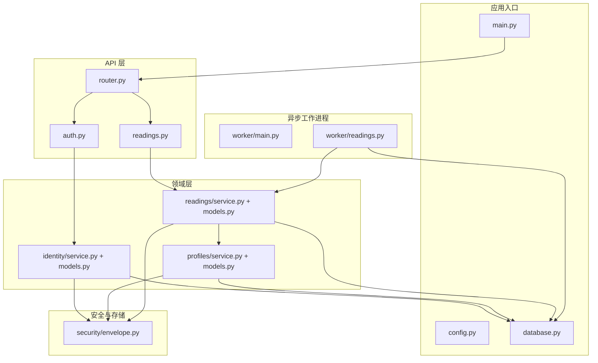
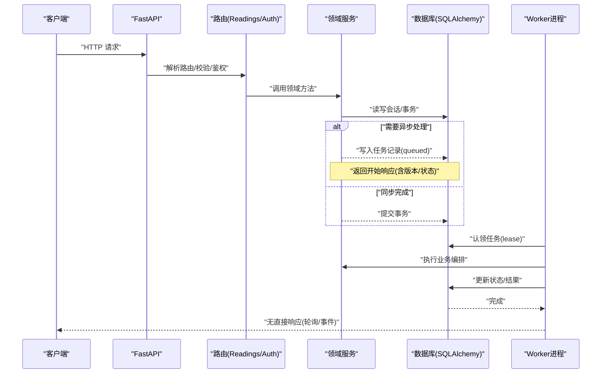
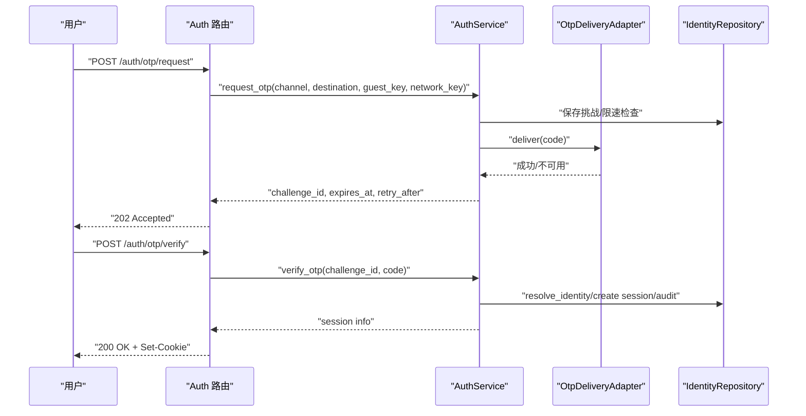
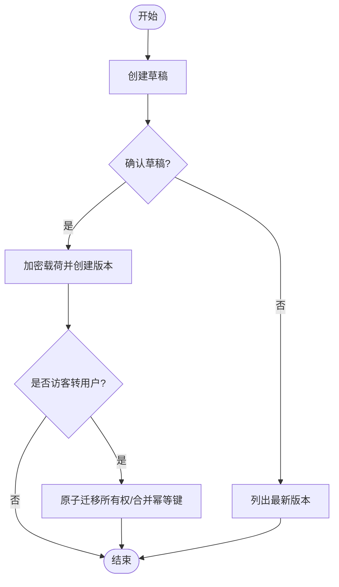
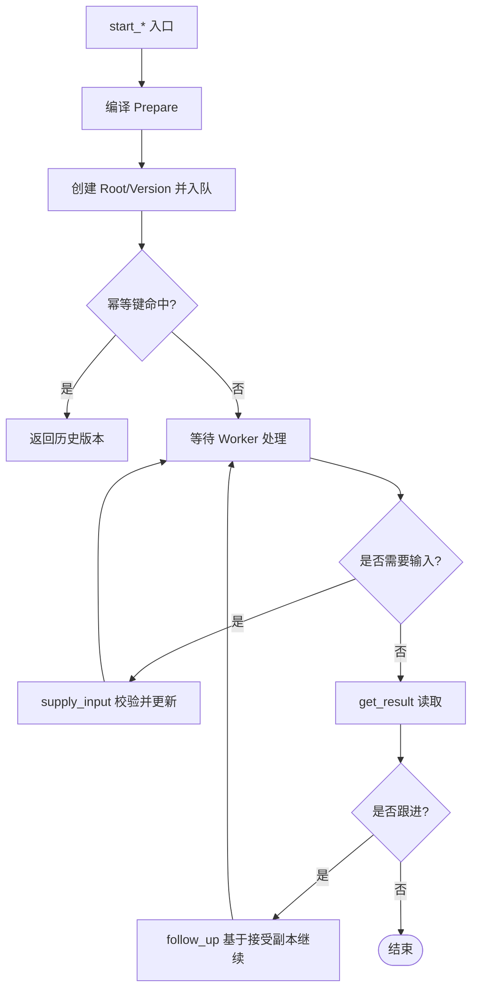
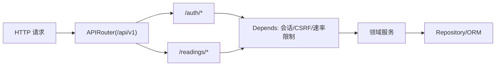
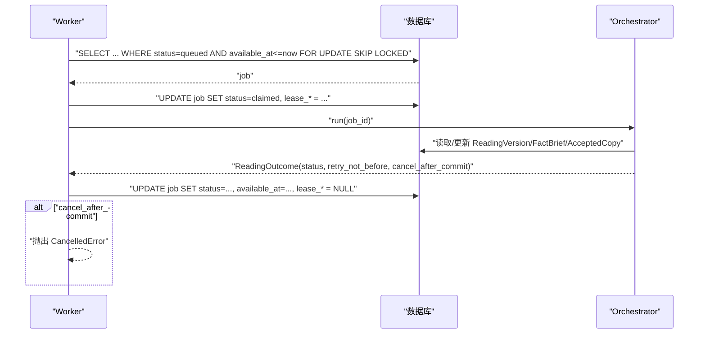
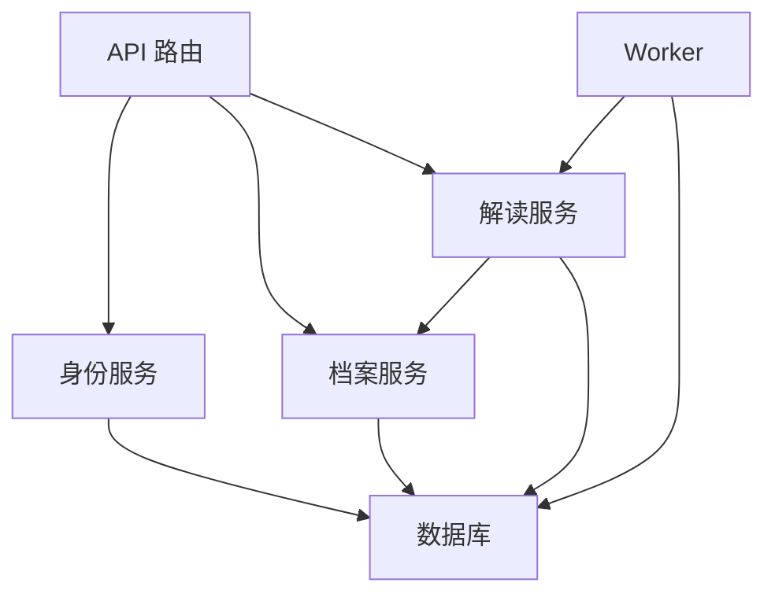

# 后端架构

<cite>
**本文引用的文件**
- [backend/app/main.py](file://backend/app/main.py)
- [backend/app/config.py](file://backend/app/config.py)
- [backend/app/database.py](file://backend/app/database.py)
- [backend/app/api/router.py](file://backend/app/api/router.py)
- [backend/app/api/auth.py](file://backend/app/api/auth.py)
- [backend/app/api/readings.py](file://backend/app/api/readings.py)
- [backend/app/identity/service.py](file://backend/app/identity/service.py)
- [backend/app/identity/models.py](file://backend/app/identity/models.py)
- [backend/app/profiles/service.py](file://backend/app/profiles/service.py)
- [backend/app/profiles/models.py](file://backend/app/profiles/models.py)
- [backend/app/readings/service.py](file://backend/app/readings/service.py)
- [backend/app/readings/models.py](file://backend/app/readings/models.py)
- [backend/app/security/envelope.py](file://backend/app/security/envelope.py)
- [backend/worker/main.py](file://backend/worker/main.py)
- [backend/worker/readings.py](file://backend/worker/readings.py)
</cite>

## 目录
1. [简介](#简介)
2. [项目结构](#项目结构)
3. [核心组件](#核心组件)
4. [架构总览](#架构总览)
5. [详细组件分析](#详细组件分析)
6. [依赖关系分析](#依赖关系分析)
7. [性能考量](#性能考量)
8. [故障排查指南](#故障排查指南)
9. [结论](#结论)
10. [附录](#附录)

## 简介
本仓库采用 FastAPI 模块化单体架构，围绕“身份认证（identity）”、“用户档案（profiles）”、“命理解读（readings）”三大领域组织代码。API 层通过路由聚合与中间件式校验完成请求治理；领域服务封装业务规则、数据持久化与安全策略；异步 Worker 进程基于数据库任务队列驱动长耗时任务执行，具备租约锁、重试与错误恢复能力。数据访问层使用 SQLAlchemy 异步 ORM，结合加密信封与不可变记录约束保障数据安全与可审计性。安全机制涵盖 OTP 登录、设备会话 Cookie、CSRF Token、速率限制、内容加密等。

## 项目结构
后端以 app 为应用主体，按领域划分 identity、profiles、readings 模块；api 层提供 HTTP 接口；worker 子包实现后台任务处理；database、config、security、observability 等横切关注点集中管理。

**图表来源**
- [backend/app/main.py:30-156](file://backend/app/main.py#L30-L156)
- [backend/app/api/router.py:1-22](file://backend/app/api/router.py#L1-L22)
- [backend/app/identity/service.py:78-192](file://backend/app/identity/service.py#L78-L192)
- [backend/app/profiles/service.py:44-189](file://backend/app/profiles/service.py#L44-L189)
- [backend/app/readings/service.py:117-819](file://backend/app/readings/service.py#L117-L819)
- [backend/app/security/envelope.py:32-122](file://backend/app/security/envelope.py#L32-L122)
- [backend/worker/main.py:57-120](file://backend/worker/main.py#L57-L120)
- [backend/worker/readings.py:108-319](file://backend/worker/readings.py#L108-L319)

**章节来源**
- [backend/app/main.py:30-156](file://backend/app/main.py#L30-L156)
- [backend/app/api/router.py:1-22](file://backend/app/api/router.py#L1-L22)

## 核心组件
- 应用启动与生命周期：创建 FastAPI 实例、注册异常处理器、注入设置与数据库、装配限流器与 OTP 适配器、安装日志与观测、挂载 API 路由。
- 配置系统：集中管理环境、数据库、OTP、模型调用、运行时、安全密钥等参数，并提供生产环境安全校验。
- 数据库访问：封装异步引擎与会话工厂，提供健康探针与资源清理。
- 领域服务：
  - 身份认证：访客会话、OTP 请求与验证、设备会话创建与审计。
  - 用户档案：草稿创建、版本确认、所有者迁移（访客到已认证用户）。
  - 命理解读：多类型解读启动、输入补充、结果查询、跟进、幂等键控制、状态机流转。
- 安全：AES-GCM 信封加密、HMAC 指纹校验、令牌哈希存储、CSRF Token。
- 异步 Worker：基于数据库的任务队列，带租约锁、重试调度、错误恢复与告警。

**章节来源**
- [backend/app/main.py:30-156](file://backend/app/main.py#L30-L156)
- [backend/app/config.py:62-335](file://backend/app/config.py#L62-L335)
- [backend/app/database.py:12-33](file://backend/app/database.py#L12-L33)
- [backend/app/identity/service.py:28-192](file://backend/app/identity/service.py#L28-L192)
- [backend/app/profiles/service.py:44-189](file://backend/app/profiles/service.py#L44-L189)
- [backend/app/readings/service.py:117-819](file://backend/app/readings/service.py#L117-L819)
- [backend/app/security/envelope.py:32-122](file://backend/app/security/envelope.py#L32-L122)
- [backend/worker/readings.py:108-319](file://backend/worker/readings.py#L108-L319)

## 架构总览
FastAPI 作为 HTTP 入口，统一挂载 /api/v1 路由。请求经依赖注入获取会话与鉴权上下文，进入对应领域服务。写操作触发任务入队，Worker 进程从数据库拉取任务，加租约后执行编排流程，更新状态并产出结果。敏感数据通过信封加密落库，所有关键实体遵循不可变或追加型记录约束。

**图表来源**
- [backend/app/api/readings.py:87-399](file://backend/app/api/readings.py#L87-L399)
- [backend/app/readings/service.py:455-513](file://backend/app/readings/service.py#L455-L513)
- [backend/worker/readings.py:121-218](file://backend/worker/readings.py#L121-L218)

## 详细组件分析

### 身份认证（identity）
- 访客会话：生成 token 与 CSRF Token，设置过期时间，落库哈希值。
- OTP 流程：
  - 请求验证码：归一化目的地、生成挑战、限速检查、投递（支持 fake/smtp/禁用），失败回滚限速槽位。
  - 验证验证码：核对挑战、解析/创建身份、生成设备会话、记录审计事件。
- 安全要点：令牌与 CSRF 均以哈希存储；设备会话 Cookie 携带 token 与 CSRF；注销时撤销会话并记录审计。

**图表来源**
- [backend/app/api/auth.py:30-138](file://backend/app/api/auth.py#L30-L138)
- [backend/app/identity/service.py:78-192](file://backend/app/identity/service.py#L78-L192)

**章节来源**
- [backend/app/identity/service.py:28-192](file://backend/app/identity/service.py#L28-L192)
- [backend/app/identity/models.py:31-132](file://backend/app/identity/models.py#L31-L132)
- [backend/app/api/auth.py:30-161](file://backend/app/api/auth.py#L30-L161)

### 用户档案（profiles）
- 草稿创建：归属用户或访客，生成 profile 记录。
- 版本确认：将草稿转为不可变版本，载荷通过信封加密存储，重复确认受唯一约束保护。
- 所有者迁移：在用户登录后，原子地将访客拥有的档案与命理解读所有权转移至该用户，合并幂等键冲突。

**图表来源**
- [backend/app/profiles/service.py:52-189](file://backend/app/profiles/service.py#L52-L189)
- [backend/app/profiles/models.py:21-80](file://backend/app/profiles/models.py#L21-L80)

**章节来源**
- [backend/app/profiles/service.py:44-189](file://backend/app/profiles/service.py#L44-L189)
- [backend/app/profiles/models.py:21-80](file://backend/app/profiles/models.py#L21-L80)

### 命理解读（readings）
- 启动解读：支持预览、今日/周运势、六爻起卦；编译 Prepare 命令；持久化根与版本；入队任务；幂等键防重放。
- 输入补充：校验输入需求，映射字段，替换 Prepare 事实，重新入队。
- 结果与跟进：读取摘要、事实面板、接受副本、验证反馈；基于接受副本继续跟进。
- 状态机：input_ready → waiting_input → prepared/completing → accepted/delayed/stopped 等，由 Worker 推进。

**图表来源**
- [backend/app/readings/service.py:129-513](file://backend/app/readings/service.py#L129-L513)
- [backend/app/readings/service.py:552-620](file://backend/app/readings/service.py#L552-L620)
- [backend/app/readings/service.py:677-731](file://backend/app/readings/service.py#L677-L731)

**章节来源**
- [backend/app/readings/service.py:117-819](file://backend/app/readings/service.py#L117-L819)
- [backend/app/readings/models.py:53-378](file://backend/app/readings/models.py#L53-L378)

### API 层设计
- 路由组织：统一前缀 /api/v1，健康检查、访客会话、认证、账户、档案、解读、管理员路由聚合。
- 中间件链：依赖注入会话、所有者校验、CSRF 校验、速率限制守卫。
- 请求验证：Pydantic 模型校验；自定义问题对象统一错误格式；OpenAPI 文档移除 422 展示。
- 响应格式化：根据是否幂等重放调整状态码；私有响应标记。

**图表来源**
- [backend/app/api/router.py:1-22](file://backend/app/api/router.py#L1-L22)
- [backend/app/api/auth.py:30-161](file://backend/app/api/auth.py#L30-L161)
- [backend/app/api/readings.py:45-399](file://backend/app/api/readings.py#L45-L399)
- [backend/app/main.py:115-152](file://backend/app/main.py#L115-L152)

**章节来源**
- [backend/app/api/router.py:1-22](file://backend/app/api/router.py#L1-L22)
- [backend/app/api/readings.py:45-399](file://backend/app/api/readings.py#L45-L399)
- [backend/app/main.py:115-152](file://backend/app/main.py#L115-L152)

### 异步任务处理机制（Worker）
- 任务队列：基于 reading_jobs 表，状态 queued/claimed/running/waiting_input/stopped/delayed/runtime_unknown 等。
- 租约锁：claim_one 使用 with_for_update(skip_locked=True) 抢占；lease_generation、lease_token、lease_expires_at 防并发与过期。
- 重试策略：根据 ReadingStatus 与 retry_not_before 计算下次可用时间；对暂态错误延迟重试。
- 错误恢复：过期租约回收；无状态 Prepare 的 Runtime 未知状态回退；提交后取消信号处理。

**图表来源**
- [backend/worker/readings.py:63-105](file://backend/worker/readings.py#L63-L105)
- [backend/worker/readings.py:121-218](file://backend/worker/readings.py#L121-L218)
- [backend/worker/main.py:57-120](file://backend/worker/main.py#L57-L120)

**章节来源**
- [backend/worker/readings.py:108-319](file://backend/worker/readings.py#L108-L319)
- [backend/worker/main.py:57-120](file://backend/worker/main.py#L57-L120)

### 数据库访问层设计
- ORM 模型：用户、登录身份、设备/访客会话、审计事件；档案与版本；解读根/版本、事实简报、尝试记录、接受副本、任务记录、幂等键、验证。
- 约束与索引：唯一约束、检查约束、命名约定、PostgreSQL JSONB 优化。
- 事务管理：API 层按需 commit；Worker 内 begin() 包裹处理；with_for_update 保证一致性。
- 查询优化：条件索引、只选必要字段、分页/限制（如历史列表上限）。

**章节来源**
- [backend/app/identity/models.py:31-132](file://backend/app/identity/models.py#L31-L132)
- [backend/app/profiles/models.py:21-80](file://backend/app/profiles/models.py#L21-L80)
- [backend/app/readings/models.py:28-378](file://backend/app/readings/models.py#L28-L378)
- [backend/app/database.py:12-33](file://backend/app/database.py#L12-L33)

### 安全机制
- JWT/令牌：当前实现使用 opaque token（哈希存储）与设备会话 Cookie；未直接使用 JWT。
- CSRF 防护：访客与设备会话均包含 CSRF Token，并在写操作依赖中校验。
- 权限控制：Owner 协议区分 user/guest；路由依赖 require_owner_csrf 确保跨站伪造防护。
- 数据加密：EnvelopeCipher 使用 AES-GCM 与 HMAC 指纹，载荷 key_id/nonce/ciphertext/fingerprint 落库。
- 速率限制：全局与领域级 WindowRateLimiter，防止滥用。

**章节来源**
- [backend/app/security/envelope.py:32-122](file://backend/app/security/envelope.py#L32-L122)
- [backend/app/api/auth.py:30-161](file://backend/app/api/auth.py#L30-L161)
- [backend/app/api/readings.py:45-399](file://backend/app/api/readings.py#L45-L399)
- [backend/app/main.py:73-108](file://backend/app/main.py#L73-L108)

## 依赖关系分析
- 模块耦合：API 层仅依赖领域服务与共享依赖；领域服务通过 Repository 与 ORM 交互；Worker 与领域服务解耦，通过数据库任务协作。
- 外部依赖：SQLAlchemy 异步、PostgreSQL、可选 SMTP、DeepSeek 模型适配器、运行时隔离执行。
- 循环依赖：通过函数内导入避免（如 auth 路由中延迟引入 ProfileService）。

**图表来源**
- [backend/app/api/router.py:1-22](file://backend/app/api/router.py#L1-L22)
- [backend/app/readings/service.py:117-124](file://backend/app/readings/service.py#L117-L124)
- [backend/worker/readings.py:234-286](file://backend/worker/readings.py#L234-L286)

**章节来源**
- [backend/app/api/router.py:1-22](file://backend/app/api/router.py#L1-L22)
- [backend/app/readings/service.py:117-124](file://backend/app/readings/service.py#L117-L124)
- [backend/worker/readings.py:234-286](file://backend/worker/readings.py#L234-L286)

## 性能考量
- 连接池与探针：AsyncEngine 启用 pool_pre_ping，定期探测连通性。
- 会话复用：expire_on_commit=False 减少刷新开销。
- 任务并发：skip_locked 避免争用；租约锁防止重复处理。
- 查询优化：JSONB 列、条件索引、限制返回数量（如阅读历史上限）。
- 超时与限流：模型调用超时、输出大小限制；多粒度速率限制（访客、网络、目的地、设备）。
- 日志与观测：统一配置日志级别与请求观测安装。

[本节为通用指导，不直接分析具体文件]

## 故障排查指南
- 认证失败：
  - 检查 OTP 投递是否可用（SMTP/禁用模式）、限速是否触发、挑战是否过期。
  - 核查设备会话 Cookie 是否包含有效 token 与 CSRF。
- 解读任务卡住：
  - 查看 reading_jobs 状态是否为 claimed 且租约是否过期；检查 ReadingVersion 状态与 prepare_has_state_token。
  - 若处于 runtime_unknown，需确认 Prepare 是否包含 state_token。
- 幂等键冲突：
  - 确认 Idempotency-Key 与 action/payload 一致；重复提交会返回历史版本而非新建。
- 数据解密失败：
  - 检查 key_id 匹配、nonce/ciphertext 完整性、HMAC 指纹是否一致。

**章节来源**
- [backend/app/identity/service.py:100-192](file://backend/app/identity/service.py#L100-L192)
- [backend/app/readings/service.py:429-596](file://backend/app/readings/service.py#L429-L596)
- [backend/worker/readings.py:121-218](file://backend/worker/readings.py#L121-L218)
- [backend/app/security/envelope.py:75-96](file://backend/app/security/envelope.py#L75-L96)

## 结论
该后端采用清晰的模块化单体设计，职责边界明确：API 层负责接入与治理，领域服务承载业务逻辑，Worker 承担异步编排与持久化。通过数据库任务队列与租约锁实现可靠的任务处理，配合幂等键、速率限制与内容加密，兼顾安全性与可扩展性。未来可在监控指标、分布式追踪与更多外部适配方面持续增强。

[本节为总结，不直接分析具体文件]

## 附录
- 配置项建议：生产环境务必注入 content_encryption_key_b64、identity_hash_key、SMTP 凭据与路径；关闭 fake 适配器；启用告警接收器。
- 运维提示：Worker 进程应独立部署，合理设置 poll_interval 与租约时长；监控 reading_jobs 积压与失败率；定期清理过期会话与审计日志。

[本节为附加信息，不直接分析具体文件]