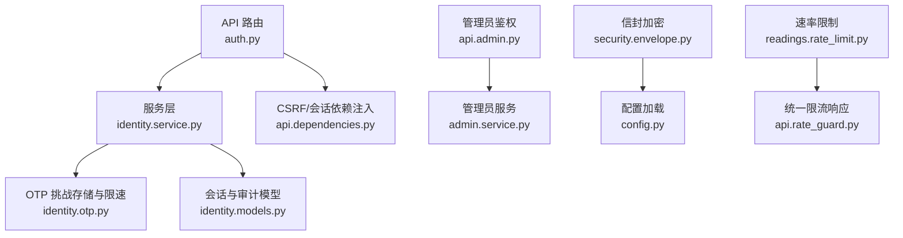
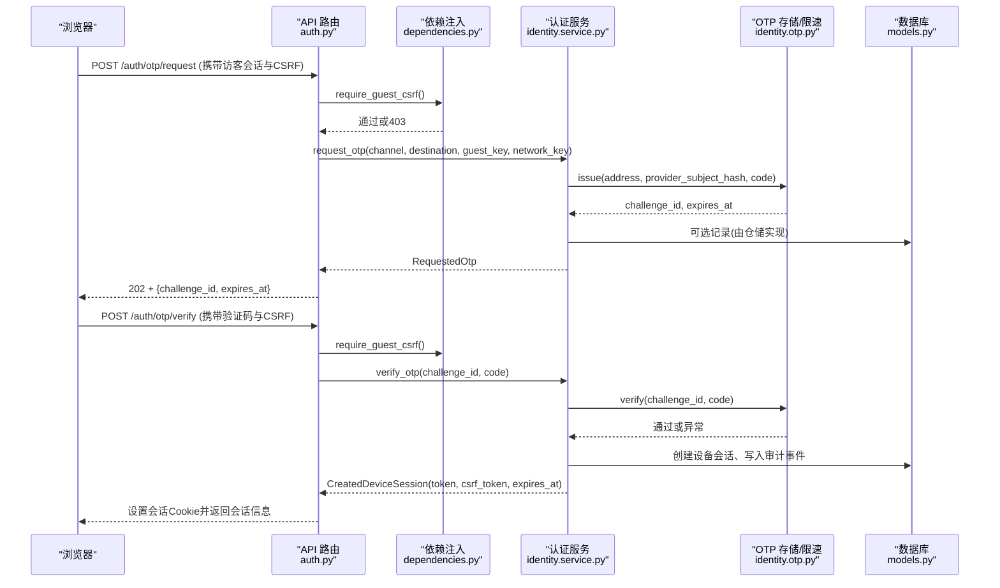
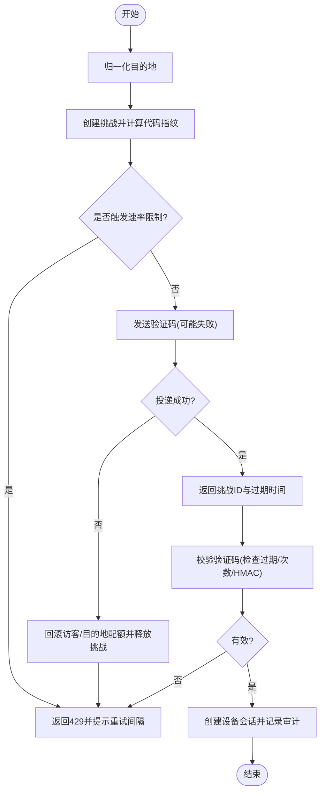
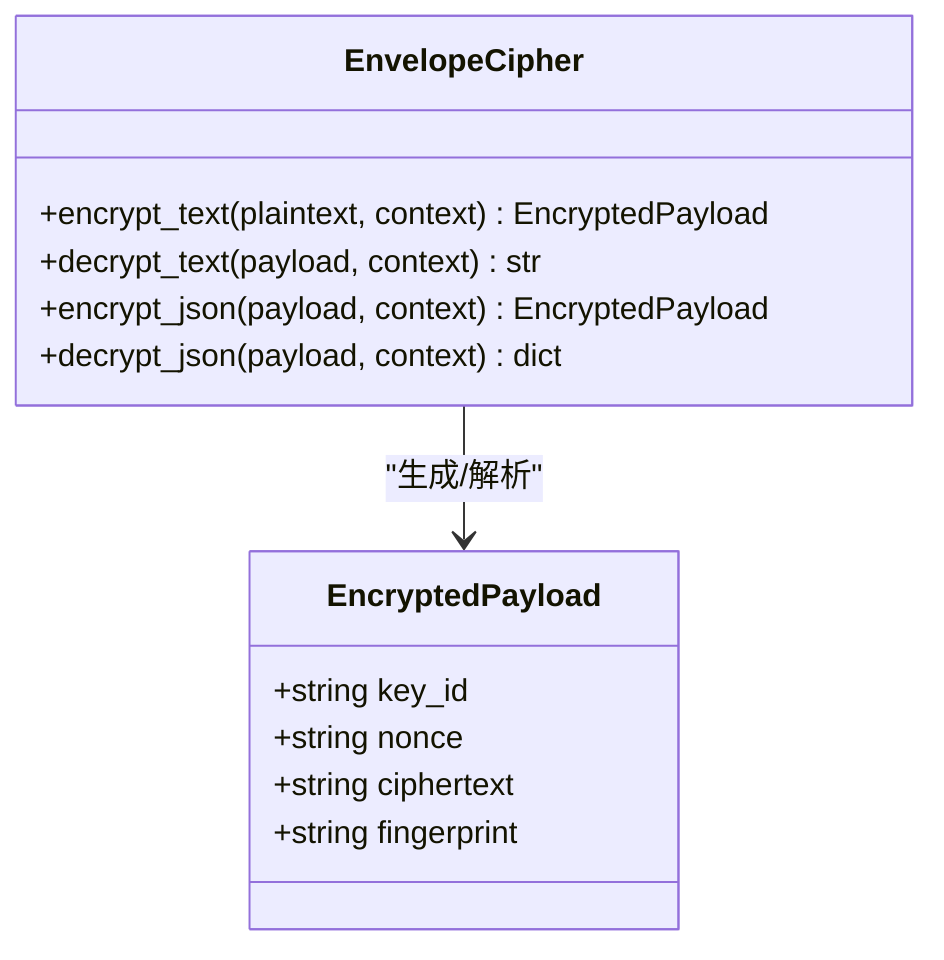
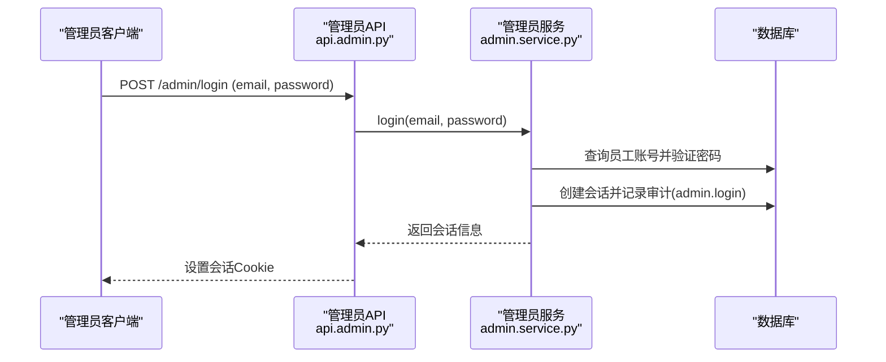
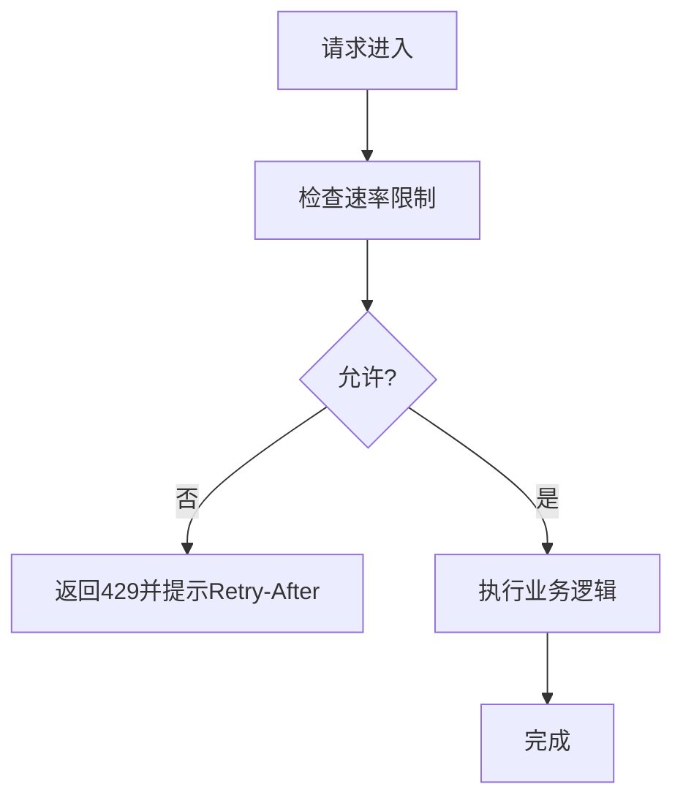
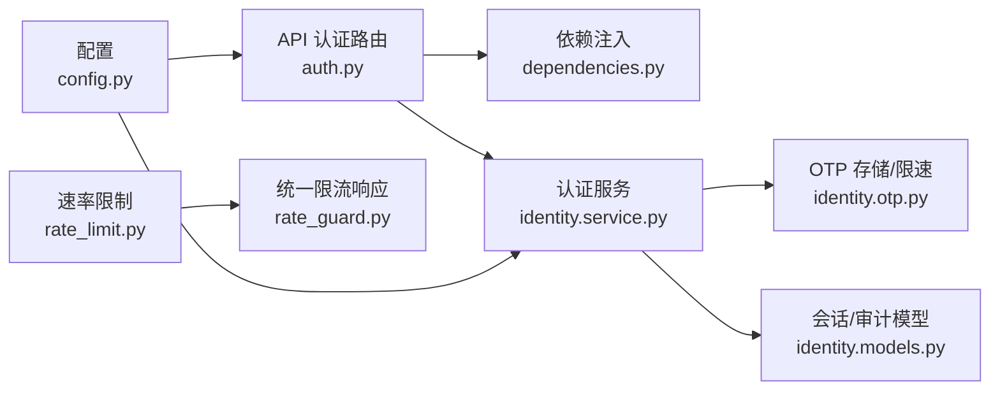

# 安全机制

<cite>
**本文引用的文件**
- [backend/app/identity/security.py](file://backend/app/identity/security.py)
- [backend/app/identity/otp.py](file://backend/app/identity/otp.py)
- [backend/app/security/envelope.py](file://backend/app/security/envelope.py)
- [backend/app/api/auth.py](file://backend/app/api/auth.py)
- [backend/app/api/dependencies.py](file://backend/app/api/dependencies.py)
- [backend/app/config.py](file://backend/app/config.py)
- [backend/app/admin/passwords.py](file://backend/app/admin/passwords.py)
- [backend/app/admin/service.py](file://backend/app/admin/service.py)
- [backend/app/readings/rate_limit.py](file://backend/app/readings/rate_limit.py)
- [backend/app/api/rate_guard.py](file://backend/app/api/rate_guard.py)
- [backend/app/identity/models.py](file://backend/app/identity/models.py)
- [backend/app/identity/service.py](file://backend/app/identity/service.py)
- [backend/app/api/admin.py](file://backend/app/api/admin.py)
</cite>

## 目录
1. [简介](#简介)
2. [项目结构](#项目结构)
3. [核心组件](#核心组件)
4. [架构总览](#架构总览)
5. [详细组件分析](#详细组件分析)
6. [依赖关系分析](#依赖关系分析)
7. [性能与安全权衡](#性能与安全权衡)
8. [故障排查指南](#故障排查指南)
9. [结论](#结论)
10. [附录：配置与部署要点](#附录配置与部署要点)

## 简介
本文件系统性梳理后端的安全机制，覆盖身份认证（OTP、令牌签发与会话管理）、数据安全（信封加密、敏感字段保护、密钥轮换策略）、访问控制（基于角色的权限控制、资源级授权、操作审计）、防护策略（CSRF、XSS、SQL注入、请求速率限制）、安全配置管理（环境变量、配置文件、环境隔离）以及安全监控与审计（登录日志、操作审计、告警）。同时给出最佳实践与应急响应流程建议。

## 项目结构
安全相关能力主要分布在以下模块：
- 身份与会话：identity（OTP、会话模型、令牌哈希、Cookie 校验）
- 安全数据：security.envelope（信封加密）
- API 层：api.auth（用户认证流程）、api.dependencies（CSRF、会话依赖注入）、api.admin（管理员鉴权）
- 配置与策略：config（生产安全强制约束、速率限制参数）
- 速率限制：readings.rate_limit（滑动窗口限流）、api.rate_guard（统一限流错误封装）
- 管理员密码：admin.passwords（scrypt 密码哈希）

**图表来源**
- [backend/app/api/auth.py:44-161](file://backend/app/api/auth.py#L44-L161)
- [backend/app/identity/service.py:78-192](file://backend/app/identity/service.py#L78-L192)
- [backend/app/identity/otp.py:64-304](file://backend/app/identity/otp.py#L64-L304)
- [backend/app/identity/models.py:31-132](file://backend/app/identity/models.py#L31-L132)
- [backend/app/api/dependencies.py:19-137](file://backend/app/api/dependencies.py#L19-L137)
- [backend/app/api/admin.py:68-100](file://backend/app/api/admin.py#L68-L100)
- [backend/app/security/envelope.py:20-122](file://backend/app/security/envelope.py#L20-L122)
- [backend/app/config.py:62-335](file://backend/app/config.py#L62-L335)
- [backend/app/readings/rate_limit.py:9-61](file://backend/app/readings/rate_limit.py#L9-L61)
- [backend/app/api/rate_guard.py:1-20](file://backend/app/api/rate_guard.py#L1-L20)

**章节来源**
- [backend/app/api/auth.py:44-161](file://backend/app/api/auth.py#L44-L161)
- [backend/app/identity/service.py:78-192](file://backend/app/identity/service.py#L78-L192)
- [backend/app/identity/otp.py:64-304](file://backend/app/identity/otp.py#L64-L304)
- [backend/app/identity/models.py:31-132](file://backend/app/identity/models.py#L31-L132)
- [backend/app/api/dependencies.py:19-137](file://backend/app/api/dependencies.py#L19-L137)
- [backend/app/api/admin.py:68-100](file://backend/app/api/admin.py#L68-L100)
- [backend/app/security/envelope.py:20-122](file://backend/app/security/envelope.py#L20-L122)
- [backend/app/config.py:62-335](file://backend/app/config.py#L62-L335)
- [backend/app/readings/rate_limit.py:9-61](file://backend/app/readings/rate_limit.py#L9-L61)
- [backend/app/api/rate_guard.py:1-20](file://backend/app/api/rate_guard.py#L1-L20)

## 核心组件
- OTP 验证码生成与校验：包含地址归一化、HMAC 签名、挑战存储、冷却期与尝试次数限制、三层速率限制（访客、网络、目的地），并支持投递失败回滚。
- 令牌与会话：不透明令牌生成、令牌哈希持久化、设备会话与访客会话生命周期管理、CSRF 双提交校验。
- 信封加密：AES-GCM 加解密、域分离上下文、指纹校验、密钥 ID 绑定。
- 管理员密码：scrypt 哈希与验证，最小长度校验。
- 速率限制：滑动窗口限流器与统一 429 响应封装。
- 配置安全：生产环境强制策略（Secure Cookie、禁用 fake 适配器、固定路径、密钥注入等）。

**章节来源**
- [backend/app/identity/otp.py:13-304](file://backend/app/identity/otp.py#L13-L304)
- [backend/app/identity/security.py:5-10](file://backend/app/identity/security.py#L5-L10)
- [backend/app/identity/models.py:68-132](file://backend/app/identity/models.py#L68-L132)
- [backend/app/security/envelope.py:20-122](file://backend/app/security/envelope.py#L20-L122)
- [backend/app/admin/passwords.py:16-55](file://backend/app/admin/passwords.py#L16-L55)
- [backend/app/readings/rate_limit.py:9-61](file://backend/app/readings/rate_limit.py#L9-L61)
- [backend/app/api/rate_guard.py:1-20](file://backend/app/api/rate_guard.py#L1-L20)
- [backend/app/config.py:62-335](file://backend/app/config.py#L62-L335)

## 架构总览
下图展示从浏览器到后端的认证与安全处理主链路，包括 CSRF、OTP、会话与审计。

**图表来源**
- [backend/app/api/auth.py:44-161](file://backend/app/api/auth.py#L44-L161)
- [backend/app/api/dependencies.py:39-54](file://backend/app/api/dependencies.py#L39-L54)
- [backend/app/identity/service.py:100-192](file://backend/app/identity/service.py#L100-L192)
- [backend/app/identity/otp.py:221-304](file://backend/app/identity/otp.py#L221-L304)
- [backend/app/identity/models.py:68-132](file://backend/app/identity/models.py#L68-L132)

## 详细组件分析

### 身份认证系统（OTP、令牌签发、会话管理）
- OTP 生成与校验
  - 地址归一化：手机号与邮箱标准化与脱敏显示。
  - 挑战存储：为每个挑战生成唯一 ID，计算代码 HMAC 指纹，设定 TTL、冷却期与最大尝试次数。
  - 三层速率限制：按访客键、网络键、目的地哈希分别限制，失败可回滚以避免浪费配额。
  - 校验流程：检查过期、已消费、尝试次数；使用恒定时间比较防止时序攻击。
- 令牌与会话
  - 不透明令牌：使用安全随机源生成，仅哈希值落库。
  - 访客会话：短期会话，用于未登录态的 CSRF 与后续认领。
  - 设备会话：登录后创建，含 token_hash、csrf_token_hash、过期时间与最后活跃时间。
  - 注销：标记撤销并记录审计事件。
- CSRF 防护
  - 双提交：Cookie 中的 CSRF Token 与请求头 x-csrf-token 必须一致且与服务器端哈希比对。
  - 针对访客与会话分别提供依赖注入校验。

**图表来源**
- [backend/app/identity/otp.py:183-304](file://backend/app/identity/otp.py#L183-L304)
- [backend/app/identity/service.py:100-192](file://backend/app/identity/service.py#L100-L192)
- [backend/app/api/auth.py:44-161](file://backend/app/api/auth.py#L44-L161)

**章节来源**
- [backend/app/identity/otp.py:13-304](file://backend/app/identity/otp.py#L13-L304)
- [backend/app/identity/service.py:78-192](file://backend/app/identity/service.py#L78-L192)
- [backend/app/api/auth.py:44-161](file://backend/app/api/auth.py#L44-L161)
- [backend/app/api/dependencies.py:29-54](file://backend/app/api/dependencies.py#L29-L54)
- [backend/app/identity/models.py:68-132](file://backend/app/identity/models.py#L68-L132)

### 数据安全保护（信封加密、敏感字段、密钥轮换）
- 信封加密
  - 算法：AES-256-GCM，带附加数据的认证加密。
  - 上下文：以领域上下文作为 AAD，确保不同场景密文不可互换。
  - 指纹：对明文与上下文进行 HMAC 指纹校验，防篡改。
  - 密钥标识：密文中包含 key_id，便于多版本密钥共存与迁移。
- 敏感字段
  - 会话令牌与 CSRF Token 均以哈希形式持久化，避免明文落库。
  - 管理员密码采用 scrypt 哈希，具备成本参数与盐值。
- 密钥轮换策略
  - 通过 content_encryption_key_id 区分密钥版本；新密钥下发时，旧密文仍可被读取（若兼容逻辑存在），新写入使用新密钥。
  - 生产环境强制要求注入有效的 32 字节 Base64 密钥，禁止复用 identity_hash_key。

**图表来源**
- [backend/app/security/envelope.py:20-122](file://backend/app/security/envelope.py#L20-L122)

**章节来源**
- [backend/app/security/envelope.py:20-122](file://backend/app/security/envelope.py#L20-L122)
- [backend/app/admin/passwords.py:16-55](file://backend/app/admin/passwords.py#L16-L55)
- [backend/app/identity/security.py:5-10](file://backend/app/identity/security.py#L5-L10)
- [backend/app/config.py:217-236](file://backend/app/config.py#L217-L236)

### 访问控制机制（角色权限、资源授权、操作审计）
- 角色与权限
  - 管理员账户：支持超级管理员角色，登录成功后建立会话并记录审计事件。
  - 普通用户：通过设备会话访问受保护资源。
- 资源级授权
  - 依赖注入 require_owner/require_device_session 等，根据 Cookie 与数据库状态判定主体与有效性。
  - 管理员接口额外校验 CSRF 与活动状态。
- 操作审计
  - 登录、登出、OTP 验证等关键动作均记录审计事件，包含用户、会话、动作与元数据。

**图表来源**
- [backend/app/api/admin.py:68-100](file://backend/app/api/admin.py#L68-L100)
- [backend/app/admin/service.py:49-89](file://backend/app/admin/service.py#L49-L89)

**章节来源**
- [backend/app/api/admin.py:68-100](file://backend/app/api/admin.py#L68-L100)
- [backend/app/admin/service.py:33-148](file://backend/app/admin/service.py#L33-L148)
- [backend/app/identity/models.py:113-132](file://backend/app/identity/models.py#L113-L132)

### 防护策略（CSRF、XSS、SQL注入、请求速率限制）
- CSRF 防护
  - 双提交模式：Cookie 与请求头一致性校验，并与服务端哈希比对。
  - 针对不同主体（访客、设备会话、管理员）提供专用依赖注入。
- XSS 防护
  - 前端测试断言禁止 onPaste 与缩放禁用，降低恶意脚本注入风险。
  - 响应头设置私有缓存与禁止索引，减少敏感内容泄露面。
- SQL 注入防护
  - 使用 ORM 与参数化查询；任务抓取使用 SKIP LOCKED 等安全并发原语。
- 请求速率限制
  - 滑动窗口限流器：按拥有者维度限制写操作，超限返回 429 并附带 Retry-After。
  - OTP 请求三层限速：访客、网络、目的地，失败可回滚。

**图表来源**
- [backend/app/readings/rate_limit.py:9-61](file://backend/app/readings/rate_limit.py#L9-L61)
- [backend/app/api/rate_guard.py:1-20](file://backend/app/api/rate_guard.py#L1-L20)

**章节来源**
- [backend/app/api/dependencies.py:29-137](file://backend/app/api/dependencies.py#L29-L137)
- [backend/app/readings/rate_limit.py:9-61](file://backend/app/readings/rate_limit.py#L9-L61)
- [backend/app/api/rate_guard.py:1-20](file://backend/app/api/rate_guard.py#L1-L20)

### 安全配置管理（环境变量、配置文件、环境隔离）
- 环境变量安全
  - 所有敏感项通过环境变量注入，SecretStr 类型避免日志泄露。
  - 生产环境强制 Secure Cookie、禁用 fake 适配器、固定运行时路径、注入内容加密密钥与身份哈希密钥。
- 配置文件保护
  - 配置类在启动时执行严格校验，拒绝不安全组合。
- 部署环境隔离
  - 生产环境禁用真实流量开关，要求告警接收器启用；模型调用白名单与固定参数冻结。

**章节来源**
- [backend/app/config.py:62-335](file://backend/app/config.py#L62-L335)

### 安全监控与审计（登录日志、操作审计、安全事件告警）
- 登录日志
  - 管理员登录/登出记录审计事件，包含角色与会话信息。
- 操作审计
  - 用户 OTP 验证、设备会话撤销等关键动作记录审计事件。
- 安全事件告警
  - 配置项 alert_sink_enabled 控制告警输出；生产环境要求开启。

**章节来源**
- [backend/app/admin/service.py:49-148](file://backend/app/admin/service.py#L49-L148)
- [backend/app/identity/service.py:153-192](file://backend/app/identity/service.py#L153-L192)
- [backend/app/config.py:146-149](file://backend/app/config.py#L146-L149)

### 安全最佳实践（密码策略、会话安全、数据传输安全）
- 密码策略
  - 管理员密码最小长度校验，使用 scrypt 高成本哈希。
- 会话安全
  - 会话令牌与 CSRF Token 仅哈希落库；Cookie 设置 HttpOnly、Secure、SameSite。
  - 会话过期与撤销机制完善。
- 数据传输安全
  - 生产环境强制 Secure Cookie；敏感响应头禁止缓存与索引。
  - 使用 AES-GCM 信封加密保护敏感载荷，结合指纹校验防篡改。

**章节来源**
- [backend/app/admin/passwords.py:16-55](file://backend/app/admin/passwords.py#L16-L55)
- [backend/app/api/dependencies.py:133-137](file://backend/app/api/dependencies.py#L133-L137)
- [backend/app/security/envelope.py:20-122](file://backend/app/security/envelope.py#L20-L122)

### 安全漏洞防护指南与应急响应流程
- 常见漏洞防护
  - CSRF：强制双提交与哈希比对，对所有写操作生效。
  - XSS：前端禁用危险事件，响应头禁止缓存与索引。
  - SQL 注入：ORM 与参数化查询，避免拼接 SQL。
  - 速率滥用：多层速率限制与 429 响应，配合 Retry-After。
- 应急响应流程
  - 发现异常：监控告警与审计日志定位事件。
  - 快速处置：吊销受影响会话、重置密码、封禁可疑 IP/目的地。
  - 恢复与复盘：修复配置或代码缺陷，更新密钥与策略，复盘改进。

[本节为通用指导，不直接分析具体文件]

## 依赖关系分析
安全组件之间的耦合与协作如下：
- API 路由依赖依赖注入进行 CSRF 与会话校验。
- 认证服务依赖 OTP 挑战存储与速率限制器。
- 配置驱动安全策略（生产强制、速率参数、密钥注入）。
- 审计事件贯穿登录、登出、OTP 验证等关键路径。

**图表来源**
- [backend/app/api/auth.py:44-161](file://backend/app/api/auth.py#L44-L161)
- [backend/app/api/dependencies.py:19-137](file://backend/app/api/dependencies.py#L19-L137)
- [backend/app/identity/service.py:78-192](file://backend/app/identity/service.py#L78-L192)
- [backend/app/identity/otp.py:64-304](file://backend/app/identity/otp.py#L64-L304)
- [backend/app/identity/models.py:31-132](file://backend/app/identity/models.py#L31-L132)
- [backend/app/config.py:62-335](file://backend/app/config.py#L62-L335)
- [backend/app/readings/rate_limit.py:9-61](file://backend/app/readings/rate_limit.py#L9-L61)
- [backend/app/api/rate_guard.py:1-20](file://backend/app/api/rate_guard.py#L1-L20)

**章节来源**
- [backend/app/api/auth.py:44-161](file://backend/app/api/auth.py#L44-L161)
- [backend/app/api/dependencies.py:19-137](file://backend/app/api/dependencies.py#L19-L137)
- [backend/app/identity/service.py:78-192](file://backend/app/identity/service.py#L78-L192)
- [backend/app/identity/otp.py:64-304](file://backend/app/identity/otp.py#L64-L304)
- [backend/app/identity/models.py:31-132](file://backend/app/identity/models.py#L31-L132)
- [backend/app/config.py:62-335](file://backend/app/config.py#L62-L335)
- [backend/app/readings/rate_limit.py:9-61](file://backend/app/readings/rate_limit.py#L9-L61)
- [backend/app/api/rate_guard.py:1-20](file://backend/app/api/rate_guard.py#L1-L20)

## 性能与安全权衡
- OTP 速率限制：三层限制平衡用户体验与抗滥用；投递失败回滚避免误伤配额。
- 会话与审计：频繁写入审计事件需考虑数据库压力，建议异步化或批量化。
- 信封加密：GCM 加解密开销可控，但应合理选择上下文与密钥版本，避免频繁轮换带来的解密失败。
- 速率限制：滑动窗口适合短时突发保护，注意内存占用与清理策略。

[本节为通用讨论，不直接分析具体文件]

## 故障排查指南
- 403 CSRF 校验失败
  - 检查 Cookie 与请求头是否一致，确认依赖注入是否正确应用。
- 429 请求过于频繁
  - 检查 OTP 三层限速与写操作滑动窗口限制，关注 Retry-After。
- 401 认证失败
  - 检查会话是否过期或被撤销，确认令牌哈希匹配。
- 解密失败
  - 检查 key_id 是否匹配、上下文是否正确、密文是否被篡改。

**章节来源**
- [backend/app/api/dependencies.py:29-137](file://backend/app/api/dependencies.py#L29-L137)
- [backend/app/readings/rate_limit.py:9-61](file://backend/app/readings/rate_limit.py#L9-L61)
- [backend/app/security/envelope.py:20-122](file://backend/app/security/envelope.py#L20-L122)

## 结论
该后端实现了较为完整的安全体系：OTP 验证码生成与校验、令牌与会话管理、信封加密与密钥标识、CSRF 防护、滑动窗口速率限制、管理员角色与审计、以及生产环境强约束配置。建议在扩展新功能时遵循“默认安全”原则，持续强化输入校验、最小权限与可观测性。

[本节为总结，不直接分析具体文件]

## 附录：配置与部署要点
- 环境变量
  - MINGLI_CONTENT_ENCRYPTION_KEY_B64：32 字节 Base64 编码的内容加密密钥。
  - MINGLI_CONTENT_ENCRYPTION_KEY_ID：密钥版本标识。
  - MINGLI_IDENTITY_HASH_KEY：身份哈希密钥（生产环境必须注入）。
  - MINGLI_COOKIE_SECURE：生产环境必须为真。
  - MINGLI_OTP_ADAPTER：生产环境禁止使用 fake。
  - MINGLI_ADMIN_BOOTSTRAP_*：生产环境禁止使用。
- 部署隔离
  - 生产环境固定运行时路径与状态根目录。
  - 模型调用白名单与参数冻结。
  - 真实流量开关在生产环境保持关闭直至门控关闭。

**章节来源**
- [backend/app/config.py:62-335](file://backend/app/config.py#L62-L335)