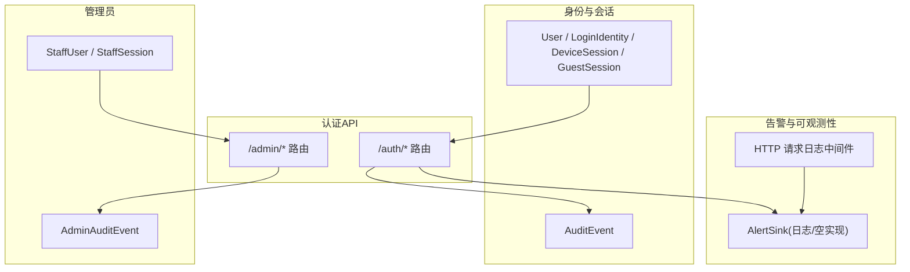
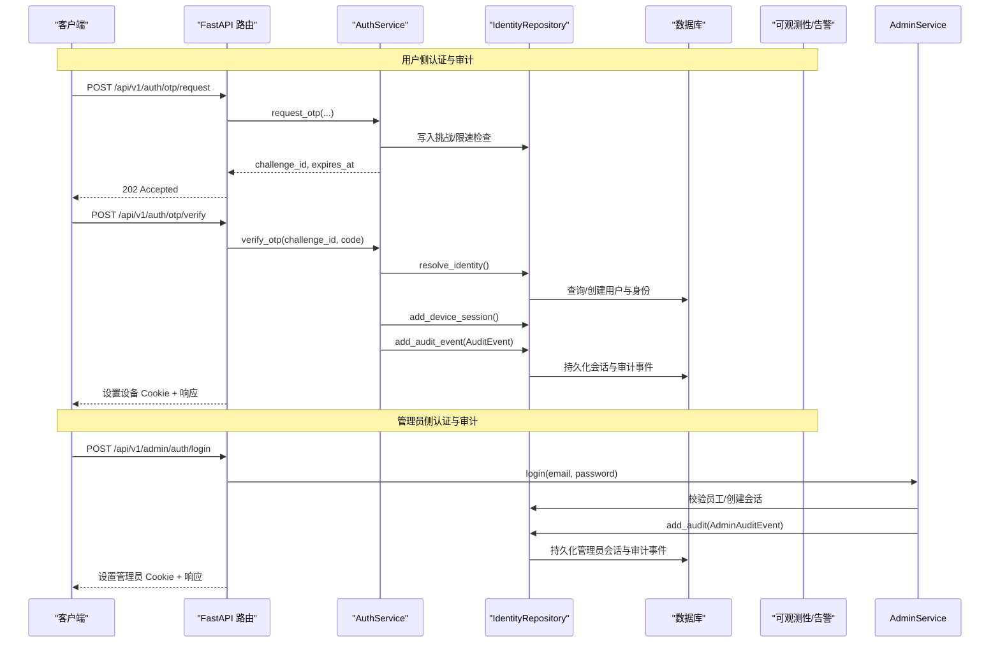
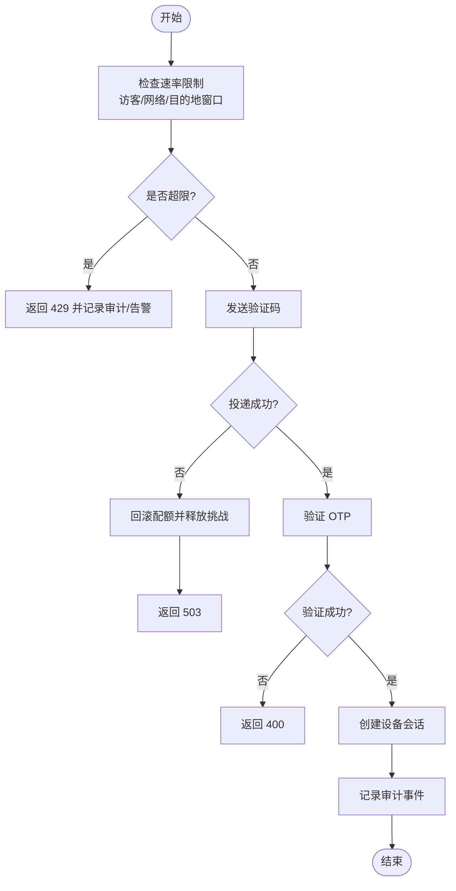
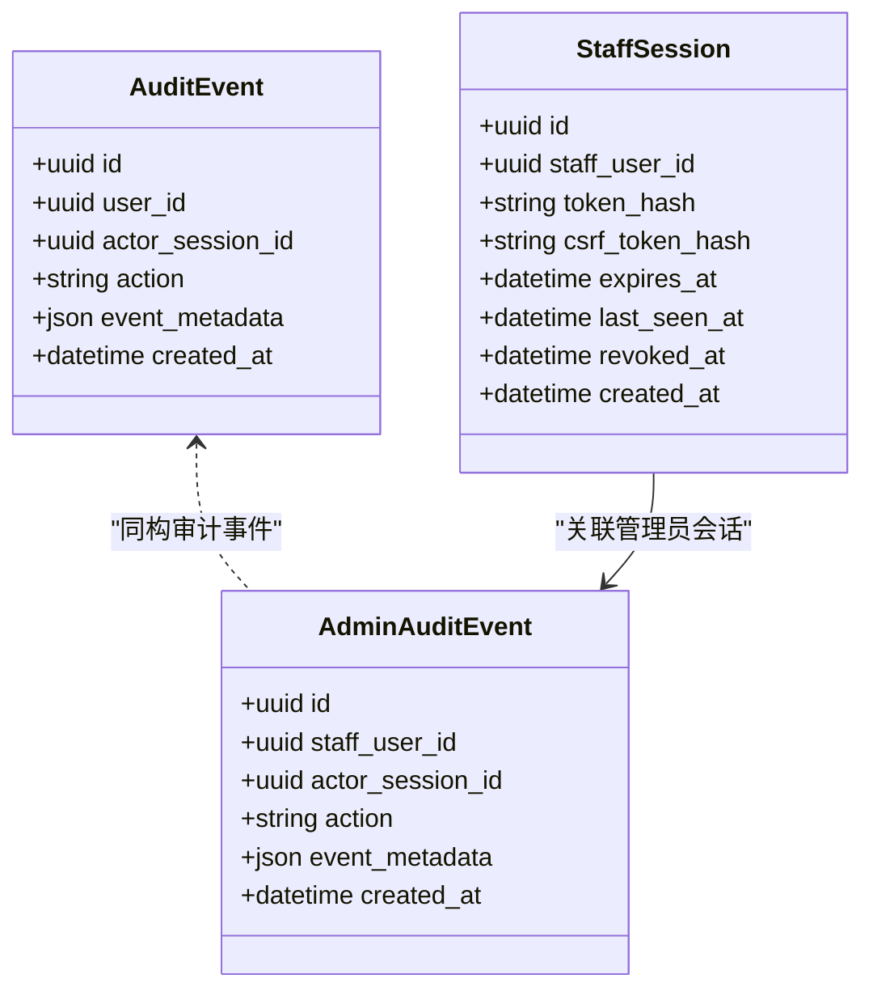
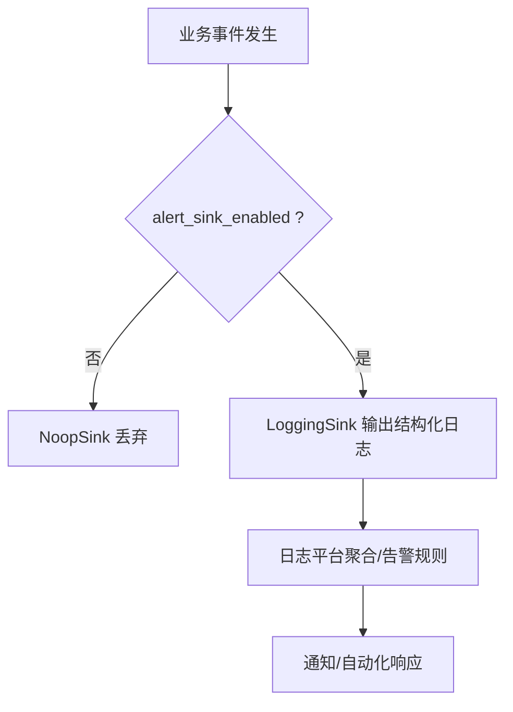
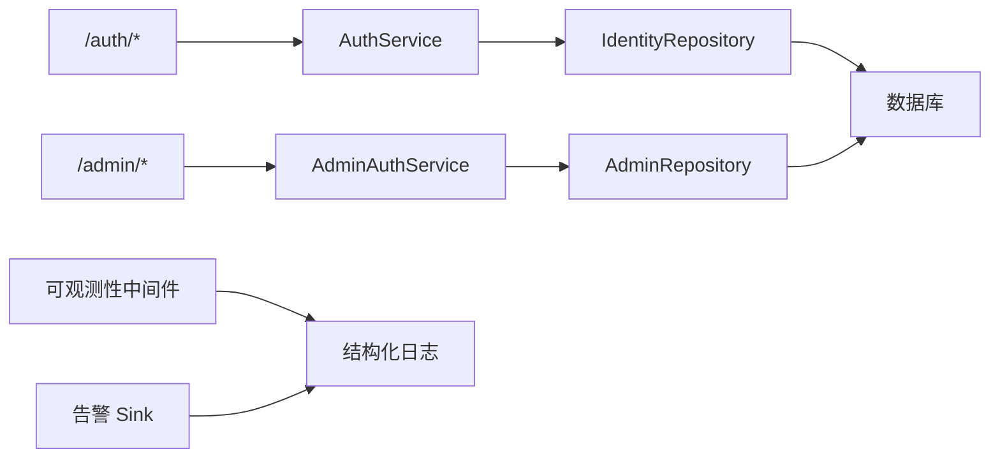

# 安全监控与审计

<cite>
**本文引用的文件**
- [backend/app/identity/models.py](file://backend/app/identity/models.py)
- [backend/app/admin/models.py](file://backend/app/admin/models.py)
- [backend/app/api/auth.py](file://backend/app/api/auth.py)
- [backend/app/identity/service.py](file://backend/app/identity/service.py)
- [backend/app/identity/repository.py](file://backend/app/identity/repository.py)
- [backend/app/admin/service.py](file://backend/app/admin/service.py)
- [backend/app/admin/repository.py](file://backend/app/admin/repository.py)
- [backend/app/api/admin.py](file://backend/app/api/admin.py)
- [backend/app/readings/alerts.py](file://backend/app/readings/alerts.py)
- [backend/app/config.py](file://backend/app/config.py)
- [backend/app/observability.py](file://backend/app/observability.py)
- [backend/alembic/versions/0001_identity_foundation.py](file://backend/alembic/versions/0001_identity_foundation.py)
- [backend/alembic/versions/0008_admin_staff_foundation.py](file://backend/alembic/versions/0008_admin_staff_foundation.py)
- [backend/tests/test_config.py](file://backend/tests/test_config.py)
- [docs/plans/2026-08-11-admin-console-plan.md](file://docs/plans/2026-08-11-admin-console-plan.md)
</cite>

## 目录
1. [简介](#简介)
2. [项目结构](#项目结构)
3. [核心组件](#核心组件)
4. [架构总览](#架构总览)
5. [详细组件分析](#详细组件分析)
6. [依赖关系分析](#依赖关系分析)
7. [性能考虑](#性能考虑)
8. [故障排查指南](#故障排查指南)
9. [结论](#结论)
10. [附录](#附录)

## 简介
本文件围绕“安全监控与审计”目标，系统化梳理登录日志记录、操作审计机制、安全事件告警、安全指标收集、审计数据存储以及威胁检测与应急响应流程。内容基于后端代码中的身份与会话模型、管理员会话与审计表、认证流程、速率限制、结构化日志与告警输出等实现进行说明，帮助读者在不深入源码的情况下理解系统的安全能力边界与扩展点。

## 项目结构
与安全监控和审计相关的代码主要分布在以下模块：
- 身份与会话：用户、访客、设备会话、登录身份、通用审计事件
- 管理员与会话：员工账号、管理员会话、管理员审计事件
- 认证API：OTP 请求/验证、登出、审计落库
- 告警与可观测性：结构化告警事件、HTTP 请求日志、配置开关
- 数据库迁移：审计事件表结构定义

图表来源
- [backend/app/identity/models.py:31-132](file://backend/app/identity/models.py#L31-L132)
- [backend/app/admin/models.py:17-81](file://backend/app/admin/models.py#L17-L81)
- [backend/app/api/auth.py:27-161](file://backend/app/api/auth.py#L27-L161)
- [backend/app/api/admin.py:33-200](file://backend/app/api/admin.py#L33-L200)
- [backend/app/readings/alerts.py:16-75](file://backend/app/readings/alerts.py#L16-L75)
- [backend/app/observability.py:27-51](file://backend/app/observability.py#L27-L51)

章节来源
- [backend/app/identity/models.py:31-132](file://backend/app/identity/models.py#L31-L132)
- [backend/app/admin/models.py:17-81](file://backend/app/admin/models.py#L17-L81)
- [backend/app/api/auth.py:27-161](file://backend/app/api/auth.py#L27-L161)
- [backend/app/api/admin.py:33-200](file://backend/app/api/admin.py#L33-L200)
- [backend/app/readings/alerts.py:16-75](file://backend/app/readings/alerts.py#L16-L75)
- [backend/app/observability.py:27-51](file://backend/app/observability.py#L27-L51)

## 核心组件
- 登录与会话审计
  - 用户侧：设备会话、访客会话、登录身份；通用审计事件表用于记录关键动作（如 OTP 验证成功、设备会话撤销）。
  - 管理员侧：员工账号、管理员会话、管理员审计事件表用于记录管理端登录/登出及关键写操作。
- 认证流程
  - 用户侧通过 OTP 通道完成验证并创建设备会话；失败或限流时返回明确错误码。
  - 管理员侧独立会话体系，具备 CSRF 校验与登录速率限制。
- 告警与可观测性
  - 告警 Sink 支持本地/测试环境的结构化日志输出，生产需开启 sink 才能放行真实流量。
  - HTTP 请求中间件为每次请求注入唯一 ID 并输出结构化访问日志。
- 配置与门禁
  - 生产环境强制多项安全策略（如禁用模拟适配器、固定运行时路径、禁止明文引导凭据等），并默认关闭真实流量与告警。

章节来源
- [backend/app/identity/models.py:68-132](file://backend/app/identity/models.py#L68-L132)
- [backend/app/admin/models.py:17-81](file://backend/app/admin/models.py#L17-L81)
- [backend/app/api/auth.py:44-161](file://backend/app/api/auth.py#L44-L161)
- [backend/app/api/admin.py:68-163](file://backend/app/api/admin.py#L68-L163)
- [backend/app/readings/alerts.py:16-75](file://backend/app/readings/alerts.py#L16-L75)
- [backend/app/observability.py:14-51](file://backend/app/observability.py#L14-L51)
- [backend/app/config.py:188-329](file://backend/app/config.py#L188-L329)

## 架构总览
下图展示了从客户端到服务端的认证与审计主链路，包括用户侧与管理员侧两条路径，以及告警与可观测性输出。

图表来源
- [backend/app/api/auth.py:44-161](file://backend/app/api/auth.py#L44-L161)
- [backend/app/identity/service.py:100-192](file://backend/app/identity/service.py#L100-L192)
- [backend/app/identity/repository.py:48-114](file://backend/app/identity/repository.py#L48-L114)
- [backend/app/api/admin.py:103-163](file://backend/app/api/admin.py#L103-L163)
- [backend/app/admin/service.py:49-101](file://backend/app/admin/service.py#L49-L101)
- [backend/app/admin/repository.py:14-57](file://backend/app/admin/repository.py#L14-L57)

## 详细组件分析

### 登录日志记录（尝试、成功/失败统计、异常行为）
- 登录尝试与失败
  - 管理员登录：对邮箱维度实施窗口速率限制，超限返回统一提示，避免泄露账户存在性。
  - 用户 OTP：请求验证码与验证均受多层速率限制（访客、网络、目的地窗口），失败时返回明确状态码（400/429/503）。
- 成功登录审计
  - 用户侧：OTP 验证成功后记录审计事件，包含用户、会话、动作与提供者信息。
  - 管理员侧：登录成功后记录管理员审计事件，包含员工、会话、动作与角色。
- 异常行为检测
  - 速率限制触发即视为异常信号，可用于后续阈值告警。
  - 投递不可用（503）会回滚访客与目的地配额，防止攻击者利用投递故障绕过限制。

图表来源
- [backend/app/identity/otp.py:64-180](file://backend/app/identity/otp.py#L64-L180)
- [backend/app/identity/service.py:100-192](file://backend/app/identity/service.py#L100-L192)
- [backend/app/api/auth.py:44-161](file://backend/app/api/auth.py#L44-L161)

章节来源
- [backend/app/api/auth.py:44-161](file://backend/app/api/auth.py#L44-L161)
- [backend/app/identity/service.py:100-192](file://backend/app/identity/service.py#L100-L192)
- [backend/app/identity/otp.py:64-180](file://backend/app/identity/otp.py#L64-L180)

### 操作审计机制（管理员追踪、数据变更、合规报告）
- 管理员操作追踪
  - 管理员登录/登出均记录审计事件，包含员工、会话、动作与元数据。
  - 管理员会话具备 CSRF 校验，确保跨站请求防护。
- 数据变更审计
  - 用户侧关键动作（如设备会话撤销、OTP 验证）写入通用审计事件表。
  - 管理员侧关键写操作建议走领域服务并追加审计事件（当前提供基础骨架）。
- 合规报告生成
  - 审计事件表具备时间索引与用户/员工索引，便于按时间范围与主体检索。
  - 结合结构化日志与告警事件，可导出报表用于合规审计。

图表来源
- [backend/app/identity/models.py:113-132](file://backend/app/identity/models.py#L113-L132)
- [backend/app/admin/models.py:36-81](file://backend/app/admin/models.py#L36-L81)
- [backend/alembic/versions/0001_identity_foundation.py:104-128](file://backend/alembic/versions/0001_identity_foundation.py#L104-L128)
- [backend/alembic/versions/0008_admin_staff_foundation.py:71-103](file://backend/alembic/versions/0008_admin_staff_foundation.py#L71-L103)

章节来源
- [backend/app/admin/service.py:49-101](file://backend/app/admin/service.py#L49-L101)
- [backend/app/api/admin.py:68-163](file://backend/app/api/admin.py#L68-L163)
- [backend/app/identity/models.py:113-132](file://backend/app/identity/models.py#L113-L132)
- [backend/app/admin/models.py:36-81](file://backend/app/admin/models.py#L36-L81)

### 安全事件告警（阈值监控、实时通知、自动化响应）
- 阈值监控
  - 配置项控制告警 Sink 启用；生产要求真实流量开启时必须启用告警 Sink。
  - 速率限制器在超限时抛出异常，可作为阈值触发点。
- 实时通知
  - 告警 Sink 将事件序列化为结构化日志，便于接入日志平台进行实时告警。
- 自动化响应
  - 当前实现以日志为主；可在上层日志平台基于事件 kind 与 details 执行自动封禁、降级或工单。

图表来源
- [backend/app/readings/alerts.py:16-75](file://backend/app/readings/alerts.py#L16-L75)
- [backend/app/config.py:188-329](file://backend/app/config.py#L188-L329)
- [backend/tests/test_config.py:117-126](file://backend/tests/test_config.py#L117-L126)

章节来源
- [backend/app/readings/alerts.py:16-75](file://backend/app/readings/alerts.py#L16-L75)
- [backend/app/config.py:188-329](file://backend/app/config.py#L188-L329)
- [backend/tests/test_config.py:117-126](file://backend/tests/test_config.py#L117-L126)

### 安全指标收集（关键指标、仪表盘、历史趋势）
- 关键指标
  - HTTP 请求：方法、路径、状态码、耗时、请求 ID。
  - 认证指标：OTP 请求/验证成功率、失败原因、速率限制触发次数。
  - 管理员指标：登录/登出次数、会话活跃数、审计事件量。
- 仪表盘展示
  - 基于结构化日志与审计事件，可在日志平台构建仪表盘（如登录失败率、告警事件量、审计事件时序）。
- 历史趋势
  - 审计事件表含时间索引，可按时间范围聚合统计；告警日志可回溯分析。

章节来源
- [backend/app/observability.py:27-51](file://backend/app/observability.py#L27-L51)
- [backend/app/identity/models.py:113-132](file://backend/app/identity/models.py#L113-L132)
- [backend/app/admin/models.py:36-81](file://backend/app/admin/models.py#L36-L81)
- [backend/app/readings/alerts.py:20-40](file://backend/app/readings/alerts.py#L20-L40)

### 审计数据存储（日志轮转、归档策略、查询优化）
- 存储位置
  - 审计事件持久化至数据库表（用户侧与管理员侧分别存储）。
  - 告警与 HTTP 访问日志输出至标准日志。
- 日志轮转与归档
  - 由部署层日志采集器负责轮转与归档；应用层不直接处理文件轮转。
- 查询优化
  - 审计事件表建立时间与主体索引，便于按时间范围与用户/员工检索。
  - 告警事件使用结构化字段，便于高效过滤与聚合。

章节来源
- [backend/alembic/versions/0001_identity_foundation.py:104-128](file://backend/alembic/versions/0001_identity_foundation.py#L104-L128)
- [backend/alembic/versions/0008_admin_staff_foundation.py:71-103](file://backend/alembic/versions/0008_admin_staff_foundation.py#L71-L103)
- [backend/app/observability.py:27-51](file://backend/app/observability.py#L27-L51)

### 威胁检测机制（异常识别、模式匹配、机器学习辅助）
- 异常行为识别
  - 速率限制触发、投递不可用、重复失败验证等作为异常信号。
- 模式匹配
  - 基于结构化日志的关键词与字段组合（如事件类型、状态码、错误码）进行规则匹配。
- 机器学习辅助
  - 可将审计事件与告警事件作为特征输入，训练异常检测模型（例如登录失败聚类、异常时段活动检测）。

章节来源
- [backend/app/identity/otp.py:64-180](file://backend/app/identity/otp.py#L64-L180)
- [backend/app/readings/alerts.py:20-40](file://backend/app/readings/alerts.py#L20-L40)
- [backend/app/observability.py:27-51](file://backend/app/observability.py#L27-L51)

### 应急响应流程与事后分析报告模板
- 应急响应流程
  - 发现：通过告警 Sink 或日志平台检测到异常（如大量 429/401）。
  - 评估：结合请求 ID 与审计事件定位受影响用户/管理员与时间范围。
  - 处置：临时封禁 IP/账号、降低速率限制阈值、暂停可疑会话。
  - 复盘：汇总审计事件与告警日志，形成事后报告。
- 事后分析报告模板
  - 事件概述：时间、影响面、根因假设。
  - 证据链：请求 ID、审计事件、告警事件、相关日志片段。
  - 处置过程：采取的措施与效果。
  - 改进计划：配置加固、速率调整、监控增强。

[本节为概念性流程与模板，不直接引用具体文件]

## 依赖关系分析
- 组件耦合
  - 认证 API 依赖身份服务与仓库；服务层负责业务逻辑与审计落库。
  - 管理员 API 依赖管理员服务与仓库；会话校验与 CSRF 保护在路由层完成。
  - 告警 Sink 与可观测性中间件解耦，便于替换实现。
- 外部依赖
  - 数据库：PostgreSQL（异步驱动），审计事件与会话表。
  - 日志平台：结构化日志输出，用于告警与审计。
- 循环依赖
  - 未发现明显循环依赖；各层职责清晰。

图表来源
- [backend/app/api/auth.py:27-161](file://backend/app/api/auth.py#L27-L161)
- [backend/app/identity/service.py:78-192](file://backend/app/identity/service.py#L78-L192)
- [backend/app/identity/repository.py:16-114](file://backend/app/identity/repository.py#L16-L114)
- [backend/app/api/admin.py:33-200](file://backend/app/api/admin.py#L33-L200)
- [backend/app/admin/service.py:33-101](file://backend/app/admin/service.py#L33-L101)
- [backend/app/admin/repository.py:14-57](file://backend/app/admin/repository.py#L14-L57)
- [backend/app/observability.py:27-51](file://backend/app/observability.py#L27-L51)
- [backend/app/readings/alerts.py:16-75](file://backend/app/readings/alerts.py#L16-L75)

章节来源
- [backend/app/api/auth.py:27-161](file://backend/app/api/auth.py#L27-L161)
- [backend/app/identity/service.py:78-192](file://backend/app/identity/service.py#L78-L192)
- [backend/app/identity/repository.py:16-114](file://backend/app/identity/repository.py#L16-L114)
- [backend/app/api/admin.py:33-200](file://backend/app/api/admin.py#L33-L200)
- [backend/app/admin/service.py:33-101](file://backend/app/admin/service.py#L33-L101)
- [backend/app/admin/repository.py:14-57](file://backend/app/admin/repository.py#L14-L57)
- [backend/app/observability.py:27-51](file://backend/app/observability.py#L27-L51)
- [backend/app/readings/alerts.py:16-75](file://backend/app/readings/alerts.py#L16-L75)

## 性能考虑
- 速率限制内存占用
  - 内置限速器维护多窗口字典，需关注键数量上限与过期清理，避免内存增长。
- 数据库写入
  - 审计事件与会话写入为同步事务的一部分，注意批量写入与连接池大小。
- 日志吞吐
  - 结构化日志在高并发下可能成为瓶颈，建议在生产环境合理配置日志级别与采样。

[本节提供一般性指导，不直接分析具体文件]

## 故障排查指南
- 常见问题
  - 登录失败频繁：检查速率限制配置与上游投递可用性。
  - 管理员无法登录：确认会话是否存在且未过期，CSRF 头是否正确。
  - 告警未生效：确认配置中 alert_sink_enabled 与 real_traffic_enabled 的关系。
- 定位步骤
  - 通过请求 ID 追踪完整调用链。
  - 检索审计事件表，按用户/员工与时间范围筛选。
  - 查看告警日志，确认事件结构与关键字段。

章节来源
- [backend/app/api/auth.py:44-161](file://backend/app/api/auth.py#L44-L161)
- [backend/app/api/admin.py:68-163](file://backend/app/api/admin.py#L68-L163)
- [backend/app/readings/alerts.py:16-75](file://backend/app/readings/alerts.py#L16-L75)
- [backend/app/observability.py:27-51](file://backend/app/observability.py#L27-L51)

## 结论
本系统在用户与管理员两条认证路径上实现了完整的审计落库与结构化日志输出，并通过速率限制与配置门禁保障基本安全基线。告警 Sink 与可观测性中间件为实时监控与自动化响应提供了可扩展的基础。未来可在现有基础上增强告警规则、引入更丰富的指标与可视化，并结合机器学习提升异常检测能力。

[本节为总结性内容，不直接引用具体文件]

## 附录
- 管理员控制台计划要点
  - 独立 OpenAPI、角色划分、写操作全审计、短会话与绝对超时、速率限制、脱敏 DTO、幂等键。
- 生产门禁
  - 告警 sink、真实流量 fail-closed、密钥注入检查、发布物签名校验。

章节来源
- [docs/plans/2026-08-11-admin-console-plan.md:120-169](file://docs/plans/2026-08-11-admin-console-plan.md#L120-L169)
- [docs/plans/2026-08-11-admin-console-plan.md:230-291](file://docs/plans/2026-08-11-admin-console-plan.md#L230-L291)