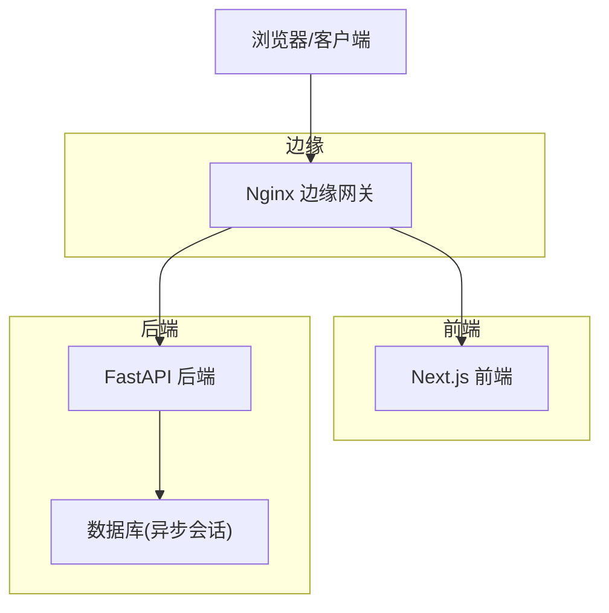
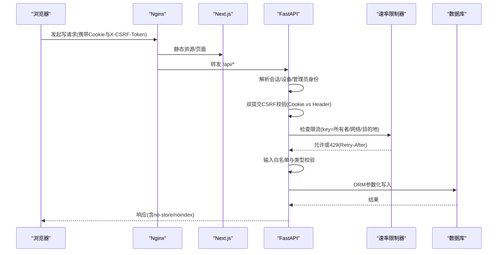
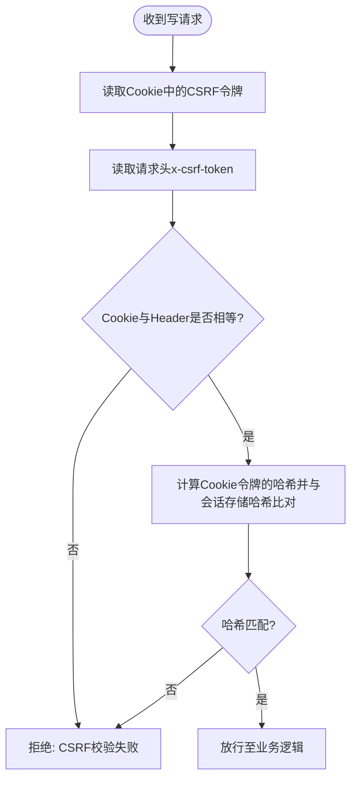
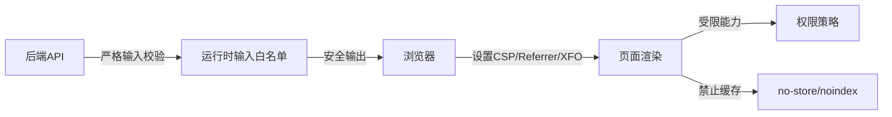
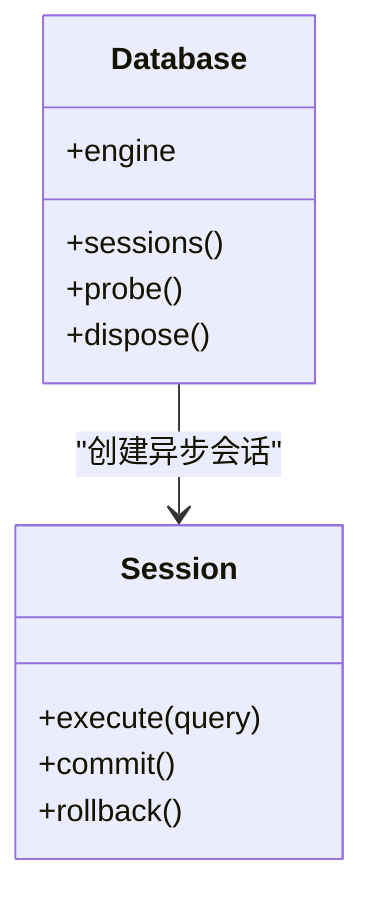
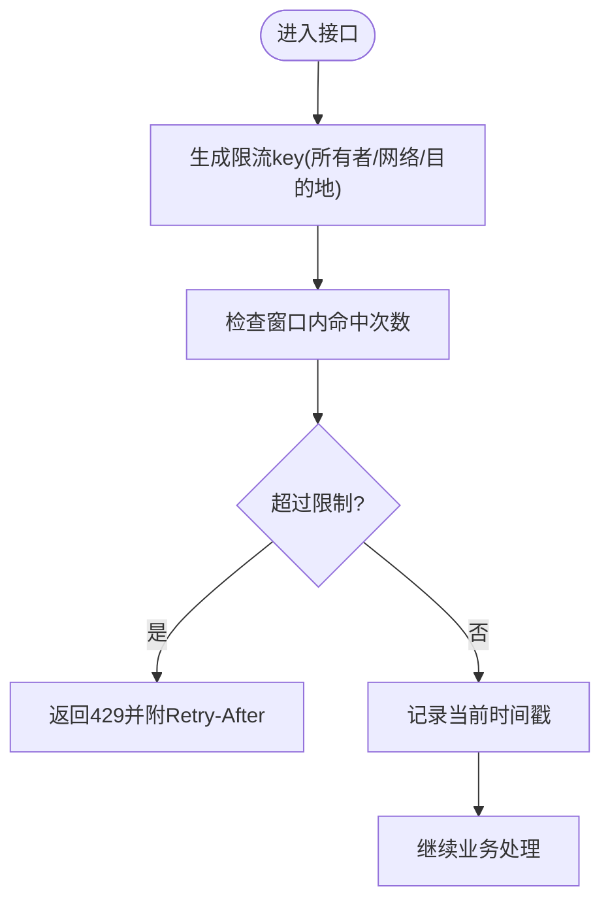
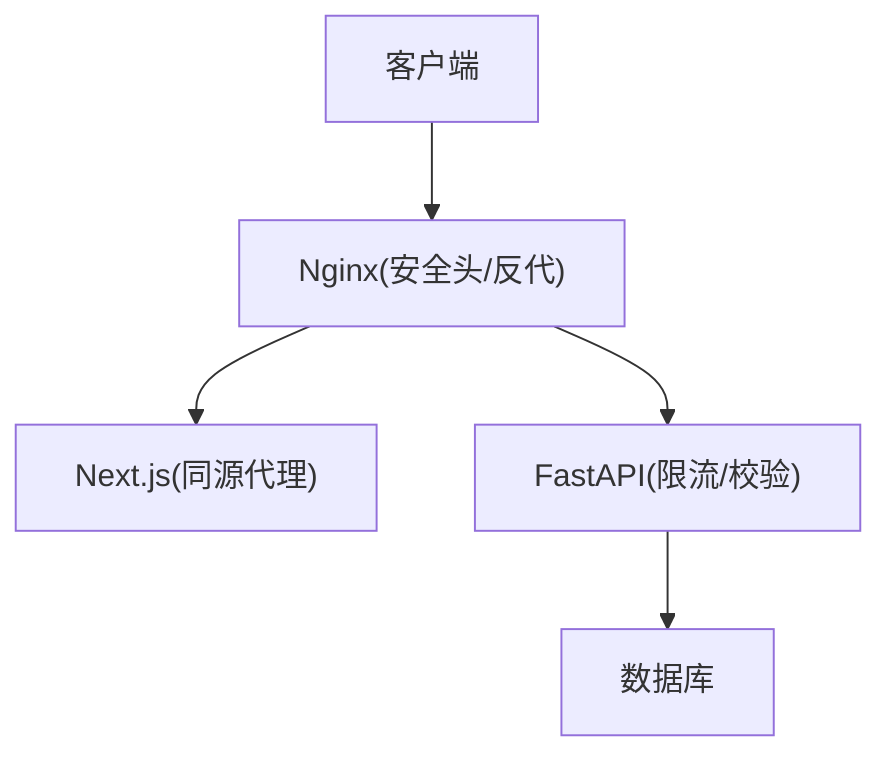
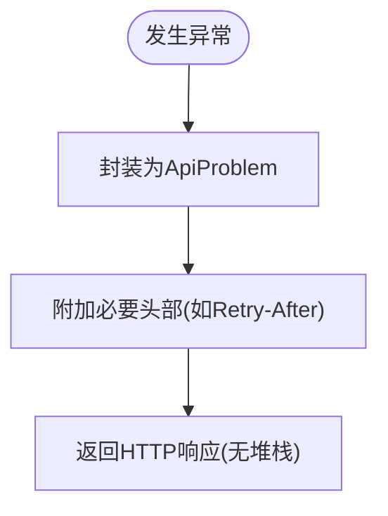
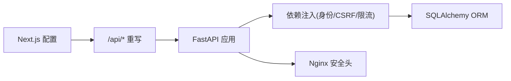

# 安全防护策略

<cite>
**本文引用的文件**
- [backend/app/api/dependencies.py](file://backend/app/api/dependencies.py)
- [backend/app/api/admin.py](file://backend/app/api/admin.py)
- [backend/app/identity/security.py](file://backend/app/identity/security.py)
- [backend/app/network.py](file://backend/app/network.py)
- [backend/app/readings/rate_limit.py](file://backend/app/readings/rate_limit.py)
- [backend/app/api/rate_guard.py](file://backend/app/api/rate_guard.py)
- [backend/app/main.py](file://backend/app/main.py)
- [backend/app/config.py](file://backend/app/config.py)
- [backend/app/database.py](file://backend/app/database.py)
- [backend/app/api/errors.py](file://backend/app/api/errors.py)
- [backend/app/readings/service.py](file://backend/app/readings/service.py)
- [infra/nginx/app.conf](file://infra/nginx/app.conf)
- [infra/nginx/fateradar-test-loopback.conf](file://infra/nginx/fateradar-test-loopback.conf)
- [web/src/test/security-config.test.ts](file://web/src/test/security-config.test.ts)
- [backend/tests/test_guest_sessions.py](file://backend/tests/test_guest_sessions.py)
- [backend/tests/test_auth.py](file://backend/tests/test_auth.py)
</cite>

## 目录
1. [简介](#简介)
2. [项目结构](#项目结构)
3. [核心组件](#核心组件)
4. [架构总览](#架构总览)
5. [详细组件分析](#详细组件分析)
6. [依赖关系分析](#依赖关系分析)
7. [性能考量](#性能考量)
8. [故障排查指南](#故障排查指南)
9. [结论](#结论)
10. [附录](#附录)

## 简介
本文件面向后端与前端的安全防护实践，围绕 CSRF、XSS、SQL 注入、请求速率限制、网络安全配置与错误处理安全等主题，结合代码实现给出可操作的策略说明。文档同时提供架构图、序列图与流程图，帮助读者理解各安全控制点在系统中的位置与协作方式。

## 项目结构
本项目采用前后端分离的模块化架构：
- 前端 Next.js 应用通过重写将 /api/* 代理到内部 FastAPI 服务；在浏览器侧统一设置安全响应头（CSP、Referrer-Policy、X-Frame-Options 等），并对私有页面禁用缓存与索引。
- 后端 FastAPI 应用负责身份与会话管理、CSRF 校验、速率限制、输入校验与数据库访问；通过 Nginx 反向代理对外暴露，并在边缘层设置基础安全头。
- 基础设施层包含 Nginx 配置、Docker 编排与运行环境约束，确保生产环境的强制安全基线。

图表来源
- [infra/nginx/app.conf:1-44](file://infra/nginx/app.conf#L1-L44)
- [web/src/test/security-config.test.ts:10-33](file://web/src/test/security-config.test.ts#L10-L33)

章节来源
- [infra/nginx/app.conf:1-44](file://infra/nginx/app.conf#L1-L44)
- [web/src/test/security-config.test.ts:10-33](file://web/src/test/security-config.test.ts#L10-L33)

## 核心组件
- CSRF 防护：双提交令牌 + Cookie/Header 比对 + 服务端存储哈希比对，覆盖访客、设备与管理员会话。
- XSS 防护：前端统一 CSP、Referrer-Policy、X-Frame-Options；后端对敏感响应标记 no-store/noindex；运行时输入严格白名单与类型校验。
- SQL 注入防护：使用 SQLAlchemy ORM 与参数化查询；模型层定义唯一约束与索引；测试验证迁移产物。
- 请求速率限制：进程内滑动窗口限流器，按所有者/网络/目的地维度限流；统一封装为 429 并返回 Retry-After。
- 网络安全：Nginx 统一安全头；可信代理 IP 解析；Cookie Secure/SameSite 配置；生产环境强制安全策略。
- 错误处理安全：统一异常类型，避免堆栈泄露；仅返回必要标题与状态码；调试模式受配置约束。

章节来源
- [backend/app/api/dependencies.py:29-54](file://backend/app/api/dependencies.py#L29-L54)
- [backend/app/api/admin.py:68-100](file://backend/app/api/admin.py#L68-L100)
- [backend/app/identity/security.py:1-11](file://backend/app/identity/security.py#L1-L11)
- [backend/app/readings/rate_limit.py:1-61](file://backend/app/readings/rate_limit.py#L1-L61)
- [backend/app/api/rate_guard.py:1-20](file://backend/app/api/rate_guard.py#L1-L20)
- [infra/nginx/app.conf:1-44](file://infra/nginx/app.conf#L1-L44)
- [backend/app/config.py:188-329](file://backend/app/config.py#L188-L329)
- [backend/app/api/errors.py:1-17](file://backend/app/api/errors.py#L1-L17)

## 架构总览
下图展示一次写操作从浏览器到后端的完整安全路径：前端设置安全头与同源代理，后端进行身份与会话校验、CSRF 校验、速率限制与输入校验，最终通过 ORM 写入数据库。

图表来源
- [infra/nginx/app.conf:16-32](file://infra/nginx/app.conf#L16-L32)
- [backend/app/api/dependencies.py:29-54](file://backend/app/api/dependencies.py#L29-L54)
- [backend/app/readings/rate_limit.py:23-32](file://backend/app/readings/rate_limit.py#L23-L32)
- [backend/app/readings/service.py:706-773](file://backend/app/readings/service.py#L706-L773)
- [backend/app/database.py:12-32](file://backend/app/database.py#L12-L32)

## 详细组件分析

### CSRF 防护
- 双提交令牌机制：Cookie 中的令牌与请求头 x-csrf-token 必须一致，使用恒定时间比较防止时序攻击。
- 服务端存储哈希：会话创建时生成不透明令牌并存储其哈希；请求时再次比对会话中存储的 CSRF 哈希。
- 多角色覆盖：访客会话、设备会话、管理员会话均要求 CSRF 校验。
- Cookie 安全属性：HttpOnly、Secure、SameSite=Lax，降低窃取与跨站风险。

图表来源
- [backend/app/api/dependencies.py:29-54](file://backend/app/api/dependencies.py#L29-L54)
- [backend/app/api/admin.py:87-100](file://backend/app/api/admin.py#L87-L100)
- [backend/tests/test_guest_sessions.py:14-38](file://backend/tests/test_guest_sessions.py#L14-L38)

章节来源
- [backend/app/api/dependencies.py:29-54](file://backend/app/api/dependencies.py#L29-L54)
- [backend/app/api/admin.py:68-100](file://backend/app/api/admin.py#L68-L100)
- [backend/tests/test_guest_sessions.py:14-38](file://backend/tests/test_guest_sessions.py#L14-L38)

### XSS 防护
- 内容安全策略：前端全局规则设置 default-src 'self' 与 frame-ancestors 'none'，禁止点击劫持与外部脚本加载。
- 基础安全头：X-Content-Type-Options nosniff、Referrer-Policy strict-origin-when-cross-origin、X-Frame-Options DENY、Permissions-Policy 限制敏感能力。
- 私有数据保护：对私有页面与 API 响应设置 Cache-Control private, no-store 与 X-Robots-Tag noindex, nofollow, noarchive，防止缓存与索引泄露。
- 输入输出编码：后端对运行时输入执行严格的白名单与类型校验，仅允许产品批准的字段与类型，避免任意代码执行。

图表来源
- [web/src/test/security-config.test.ts:21-33](file://web/src/test/security-config.test.ts#L21-L33)
- [infra/nginx/app.conf:5-8](file://infra/nginx/app.conf#L5-L8)
- [backend/app/readings/service.py:706-773](file://backend/app/readings/service.py#L706-L773)

章节来源
- [web/src/test/security-config.test.ts:21-33](file://web/src/test/security-config.test.ts#L21-L33)
- [infra/nginx/app.conf:5-8](file://infra/nginx/app.conf#L5-L8)
- [backend/app/readings/service.py:706-773](file://backend/app/readings/service.py#L706-L773)

### SQL 注入防护
- 参数化查询与 ORM：使用 SQLAlchemy 异步引擎与会话，所有查询通过 ORM 与参数化语句执行，避免拼接 SQL。
- 模型约束：登录身份表存在 provider 与 provider_subject_hash 的唯一约束，防止重复与冲突。
- 迁移验证：测试确认迁移产物包含预期表结构与约束，保障数据库层一致性。

图表来源
- [backend/app/database.py:12-32](file://backend/app/database.py#L12-L32)
- [backend/tests/test_migrations.py:43-65](file://backend/tests/test_migrations.py#L43-L65)

章节来源
- [backend/app/database.py:12-32](file://backend/app/database.py#L12-L32)
- [backend/tests/test_migrations.py:43-65](file://backend/tests/test_migrations.py#L43-L65)

### 请求速率限制
- 滑动窗口限流器：基于内存队列记录每个 key 的请求时间戳，窗口过期自动清理；超过限制抛出带重试秒数的异常。
- 多维度限流：支持按所有者写操作、网络 IP、目的地、访客会话创建等维度限流。
- 统一错误封装：通过 rate_guard 将限流异常转换为 429 并附带 Retry-After 头。
- 可信代理 IP 解析：根据 trusted_proxy_cidrs 解析真实客户端 IP，避免伪造 X-Forwarded-For。

图表来源
- [backend/app/readings/rate_limit.py:23-32](file://backend/app/readings/rate_limit.py#L23-L32)
- [backend/app/api/rate_guard.py:5-20](file://backend/app/api/rate_guard.py#L5-L20)
- [backend/app/network.py:22-54](file://backend/app/network.py#L22-L54)
- [backend/tests/test_auth.py:287-326](file://backend/tests/test_auth.py#L287-L326)

章节来源
- [backend/app/readings/rate_limit.py:1-61](file://backend/app/readings/rate_limit.py#L1-L61)
- [backend/app/api/rate_guard.py:1-20](file://backend/app/api/rate_guard.py#L1-L20)
- [backend/app/network.py:1-72](file://backend/app/network.py#L1-L72)
- [backend/tests/test_auth.py:287-326](file://backend/tests/test_auth.py#L287-L326)

### 网络安全配置
- HTTPS 强制与 Cookie 安全：生产环境强制 cookie_secure=True，防止明文传输与中间人攻击。
- 边缘安全头：Nginx 统一设置 X-Content-Type-Options、X-Frame-Options、Referrer-Policy、Permissions-Policy，并对 API 响应强制 no-store。
- CORS 与同源：前端通过 Next.js rewrites 将 /api/* 代理到内部服务，减少跨域暴露面；必要时可在 Nginx 或后端进一步收紧允许的源与方法。
- 可信代理：通过 trusted_proxy_cidrs 限定可信代理网段，解析真实客户端 IP，避免伪造。

图表来源
- [infra/nginx/app.conf:1-44](file://infra/nginx/app.conf#L1-L44)
- [infra/nginx/fateradar-test-loopback.conf:26-57](file://infra/nginx/fateradar-test-loopback.conf#L26-L57)
- [web/src/test/security-config.test.ts:10-33](file://web/src/test/security-config.test.ts#L10-L33)
- [backend/app/config.py:188-329](file://backend/app/config.py#L188-L329)

章节来源
- [infra/nginx/app.conf:1-44](file://infra/nginx/app.conf#L1-L44)
- [infra/nginx/fateradar-test-loopback.conf:26-57](file://infra/nginx/fateradar-test-loopback.conf#L26-L57)
- [web/src/test/security-config.test.ts:10-33](file://web/src/test/security-config.test.ts#L10-L33)
- [backend/app/config.py:188-329](file://backend/app/config.py#L188-L329)

### 错误处理安全
- 统一异常：ApiProblem 封装状态码、标题、问题类型与可选头部，避免堆栈信息泄露。
- 调试模式管理：生产环境禁用调试端点与日志级别，限制敏感配置注入；通过 Settings 的模型校验强制安全基线。
- 敏感响应标记：对私有数据响应添加 no-store 与 noindex，防止缓存与搜索引擎抓取。

图表来源
- [backend/app/api/errors.py:1-17](file://backend/app/api/errors.py#L1-L17)
- [backend/app/config.py:188-329](file://backend/app/config.py#L188-L329)
- [backend/app/api/dependencies.py:133-136](file://backend/app/api/dependencies.py#L133-L136)

章节来源
- [backend/app/api/errors.py:1-17](file://backend/app/api/errors.py#L1-L17)
- [backend/app/config.py:188-329](file://backend/app/config.py#L188-L329)
- [backend/app/api/dependencies.py:133-136](file://backend/app/api/dependencies.py#L133-L136)

## 依赖关系分析
- 前端依赖 Next.js 重写与安全头配置，将 API 请求路由到内部服务，减少跨域风险。
- 后端依赖 FastAPI 依赖注入与中间件，组合身份校验、CSRF 校验、速率限制与输入校验。
- 基础设施依赖 Nginx 作为边缘网关，统一安全头与反代策略。
- 数据库依赖 SQLAlchemy ORM 与迁移工具，保证数据结构与约束的一致性。

图表来源
- [web/src/test/security-config.test.ts:10-33](file://web/src/test/security-config.test.ts#L10-L33)
- [backend/app/main.py:50-77](file://backend/app/main.py#L50-L77)
- [backend/app/database.py:12-32](file://backend/app/database.py#L12-L32)
- [infra/nginx/app.conf:16-32](file://infra/nginx/app.conf#L16-L32)

章节来源
- [web/src/test/security-config.test.ts:10-33](file://web/src/test/security-config.test.ts#L10-L33)
- [backend/app/main.py:50-77](file://backend/app/main.py#L50-L77)
- [backend/app/database.py:12-32](file://backend/app/database.py#L12-L32)
- [infra/nginx/app.conf:16-32](file://infra/nginx/app.conf#L16-L32)

## 性能考量
- 滑动窗口限流器使用 deque 维护时间戳，窗口清理与检查均为 O(n) 但 n 为窗口内命中数，通常很小；在高并发场景下建议扩展为分布式计数器。
- 数据库连接池启用 pool_pre_ping，提升连接健康检测效率；异步会话减少阻塞。
- 前端 CSP 与 no-store 可能增加首屏开销，需权衡安全与性能；可通过按需加载与缓存策略优化。

[本节为通用指导，无需特定文件引用]

## 故障排查指南
- CSRF 校验失败：检查 Cookie 与请求头是否同时存在且一致；确认会话中存储的 CSRF 哈希是否正确更新。
- 速率限制触发：查看限流 key 与窗口配置；确认可信代理 IP 解析正确；关注 Retry-After 头提示的重试间隔。
- 安全头缺失：检查 Nginx 与 Next.js 配置是否生效；确认 API 响应未覆盖 Cache-Control。
- 生产环境启动失败：核对 Settings 的模型校验错误，如 cookie_secure、OTP 适配器、运行时路径与密钥注入。

章节来源
- [backend/app/api/dependencies.py:29-54](file://backend/app/api/dependencies.py#L29-L54)
- [backend/app/readings/rate_limit.py:23-32](file://backend/app/readings/rate_limit.py#L23-L32)
- [infra/nginx/app.conf:16-32](file://infra/nginx/app.conf#L16-L32)
- [backend/app/config.py:188-329](file://backend/app/config.py#L188-L329)

## 结论
本项目在 CSRF、XSS、SQL 注入、速率限制、网络安全与错误处理等方面形成了较为完整的安全闭环。通过前端统一安全头与同源代理、后端严格的身份与会话校验、输入白名单与 ORM 参数化查询、以及基础设施层的边缘安全策略，有效降低了常见攻击面。建议在后续迭代中引入分布式限流与更细粒度的 CORS 策略，并持续进行安全扫描与渗透测试以巩固防线。

[本节为总结性内容，无需特定文件引用]

## 附录
- 安全漏洞扫描与渗透测试实施指南
  - 自动化扫描：集成 SAST/DAST 工具于 CI/CD 流水线，定期扫描前端与后端代码及依赖。
  - 渗透测试：针对认证与会话流程、CSRF 与 XSS 注入点、速率限制绕过点进行人工测试。
  - 配置审计：核查 Nginx 与 Next.js 安全头、Cookie 属性、CORS 策略与可信代理配置。
  - 数据库审计：验证迁移与约束、最小权限原则与备份恢复流程。
  - 监控与告警：对 429、403、401 等异常状态进行监控与阈值告警，及时发现潜在攻击。

[本节为通用指导，无需特定文件引用]