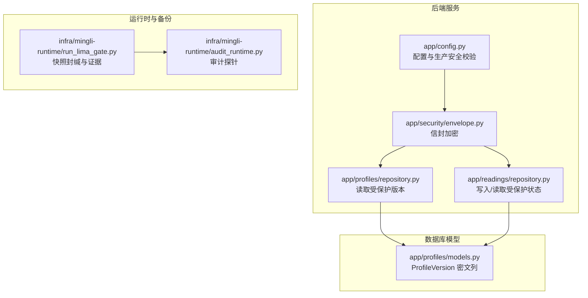
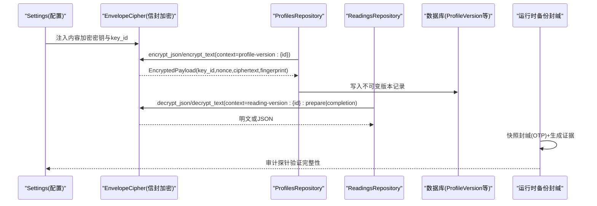
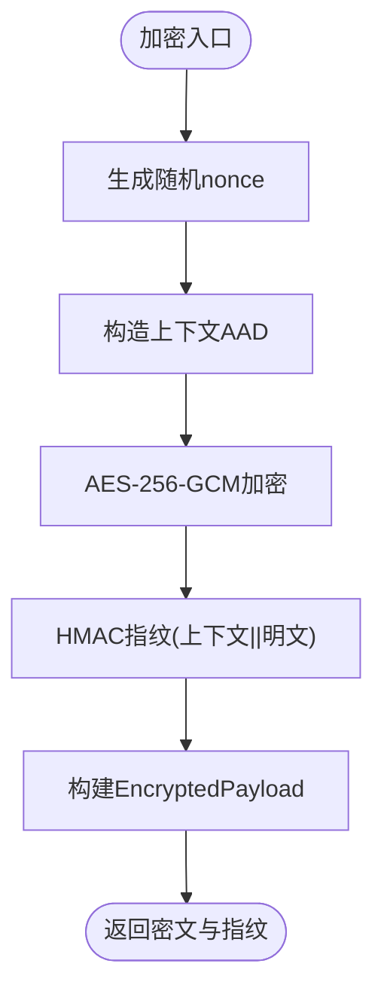
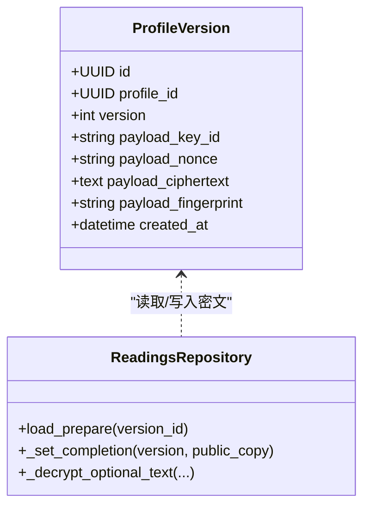
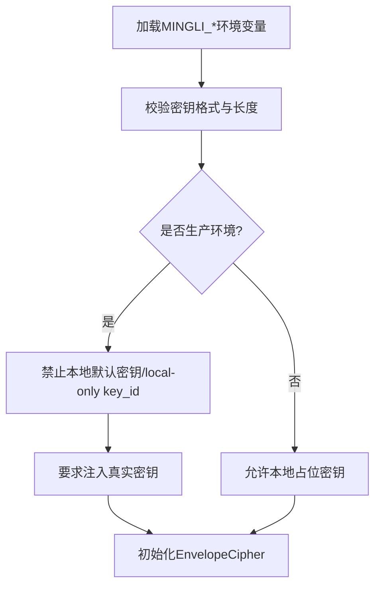
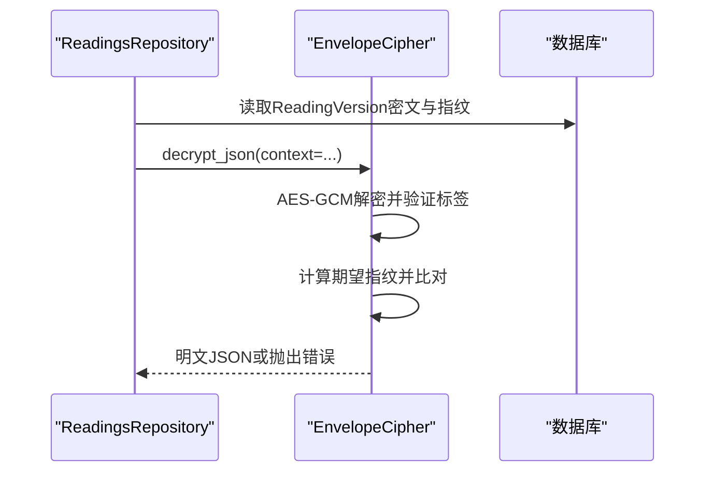
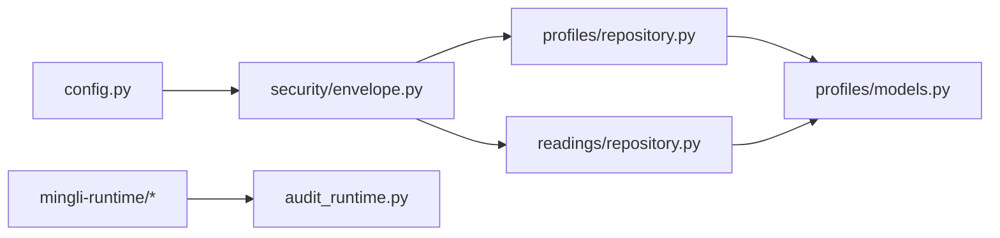

# 数据加密保护

<cite>
**本文引用的文件**
- [backend/app/security/envelope.py](file://backend/app/security/envelope.py)
- [backend/app/config.py](file://backend/app/config.py)
- [backend/app/profiles/models.py](file://backend/app/profiles/models.py)
- [backend/app/profiles/repository.py](file://backend/app/profiles/repository.py)
- [backend/app/readings/repository.py](file://backend/app/readings/repository.py)
- [backend/tests/test_sensitive_payloads.py](file://backend/tests/test_sensitive_payloads.py)
- [infra/fateradar-test.env.example](file://infra/fateradar-test.env.example)
- [infra/mingli-runtime/audit_runtime.py](file://infra/mingli-runtime/audit_runtime.py)
- [infra/mingli-runtime/run_lima_gate.py](file://infra/mingli-runtime/run_lima_gate.py)
- [tests/contract/test_mingli_runtime_release.py](file://tests/contract/test_mingli_runtime_release.py)
</cite>

## 目录
1. [简介](#简介)
2. [项目结构](#项目结构)
3. [核心组件](#核心组件)
4. [架构总览](#架构总览)
5. [详细组件分析](#详细组件分析)
6. [依赖关系分析](#依赖关系分析)
7. [性能考虑](#性能考虑)
8. [故障排查指南](#故障排查指南)
9. [结论](#结论)
10. [附录](#附录)

## 简介
本文件系统性说明本项目中的数据加密保护方案，重点覆盖：
- 信封加密机制：信封结构、算法选择与密钥管理策略
- 敏感字段加密：个人身份信息、联系方式、财务数据的加密存储方式
- 密钥轮换策略：生命周期管理、版本兼容性与平滑迁移
- 数据完整性验证：数字签名思路、校验和计算与篡改检测
- 加密配置管理：环境变量、配置文件保护与多环境密钥隔离
- 加密性能优化：批量加密、缓存策略与异步处理建议
- 故障排查与密钥恢复流程

## 项目结构
后端安全能力集中在 app/security 模块，并通过配置模块注入密钥；持久化层在 profiles 与 readings 的 repository 中调用加密能力；运行时与备份恢复在 infra/mingli-runtime 中提供额外完整性保障。

图表来源
- [backend/app/security/envelope.py:32-121](file://backend/app/security/envelope.py#L32-L121)
- [backend/app/config.py:62-126](file://backend/app/config.py#L62-L126)
- [backend/app/profiles/repository.py:184-197](file://backend/app/profiles/repository.py#L184-L197)
- [backend/app/readings/repository.py:817-861](file://backend/app/readings/repository.py#L817-L861)
- [backend/app/profiles/models.py:49-79](file://backend/app/profiles/models.py#L49-L79)
- [infra/mingli-runtime/run_lima_gate.py:927-964](file://infra/mingli-runtime/run_lima_gate.py#L927-L964)
- [infra/mingli-runtime/audit_runtime.py:376-393](file://infra/mingli-runtime/audit_runtime.py#L376-L393)

章节来源
- [backend/app/security/envelope.py:32-121](file://backend/app/security/envelope.py#L32-L121)
- [backend/app/config.py:62-126](file://backend/app/config.py#L62-L126)
- [backend/app/profiles/models.py:49-79](file://backend/app/profiles/models.py#L49-L79)
- [backend/app/profiles/repository.py:184-197](file://backend/app/profiles/repository.py#L184-L197)
- [backend/app/readings/repository.py:817-861](file://backend/app/readings/repository.py#L817-L861)
- [infra/mingli-runtime/run_lima_gate.py:927-964](file://infra/mingli-runtime/run_lima_gate.py#L927-L964)
- [infra/mingli-runtime/audit_runtime.py:376-393](file://infra/mingli-runtime/audit_runtime.py#L376-L393)

## 核心组件
- 信封加密器 EnvelopeCipher：基于 AES-256-GCM 的对称加密，使用随机 nonce 与领域分离上下文（AAD），并附加 HMAC 指纹用于完整性校验。
- 配置 Settings：集中加载 MINGLI_ 前缀的环境变量，强制生产环境的安全约束（如必须注入内容加密密钥、禁止本地默认密钥等）。
- 持久化模型 ProfileVersion：以不可变记录形式保存密文载荷及指纹，确保历史版本不被修改。
- Repository 集成：profiles 与 readings 的仓库在读写时通过 context 将业务域与加密上下文绑定，防止重放与跨域误用。
- 运行时备份封缄：对快照进行一次性掩码（OTP）式封缄并生成可审计的证据，保证备份产物可验证且密钥销毁。

章节来源
- [backend/app/security/envelope.py:32-121](file://backend/app/security/envelope.py#L32-L121)
- [backend/app/config.py:188-236](file://backend/app/config.py#L188-L236)
- [backend/app/profiles/models.py:49-79](file://backend/app/profiles/models.py#L49-L79)
- [backend/app/profiles/repository.py:184-197](file://backend/app/profiles/repository.py#L184-L197)
- [backend/app/readings/repository.py:817-861](file://backend/app/readings/repository.py#L817-L861)
- [infra/mingli-runtime/run_lima_gate.py:927-964](file://infra/mingli-runtime/run_lima_gate.py#L927-L964)

## 架构总览
下图展示从配置到加密再到持久化的端到端流程，以及运行时备份封缄的完整性保障。

图表来源
- [backend/app/config.py:48-54](file://backend/app/config.py#L48-L54)
- [backend/app/security/envelope.py:56-121](file://backend/app/security/envelope.py#L56-L121)
- [backend/app/profiles/repository.py:184-197](file://backend/app/profiles/repository.py#L184-L197)
- [backend/app/readings/repository.py:283-299](file://backend/app/readings/repository.py#L283-L299)
- [infra/mingli-runtime/run_lima_gate.py:927-964](file://infra/mingli-runtime/run_lima_gate.py#L927-L964)
- [infra/mingli-runtime/audit_runtime.py:376-393](file://infra/mingli-runtime/audit_runtime.py#L376-L393)

## 详细组件分析

### 信封加密机制
- 算法与模式：AES-256-GCM，提供机密性与认证（AEAD）。
- 随机性：每次加密生成新的 12 字节随机 nonce，避免相同明文产生相同密文。
- 领域分离：通过 context（例如 profile-version:{id}、reading-version:{id}:prepare）作为 AAD，使同一密钥在不同上下文中不可互换。
- 完整性指纹：使用独立派生的 HMAC 密钥对“上下文+明文”计算指纹，解密后比对，防止篡改。
- 数据结构：EncryptedPayload 包含 key_id、nonce、ciphertext、fingerprint，便于存储与检索。

图表来源
- [backend/app/security/envelope.py:56-73](file://backend/app/security/envelope.py#L56-L73)

章节来源
- [backend/app/security/envelope.py:20-121](file://backend/app/security/envelope.py#L20-L121)

### 敏感字段加密与存储
- 个人身份信息、联系方式、财务数据等敏感信息以 JSON 对象形式序列化后整体加密，避免字段级拆分带来的不一致风险。
- 存储位置：
  - ProfileVersion 表保存 payload_key_id、payload_nonce、payload_ciphertext、payload_fingerprint，对应受保护的档案版本。
  - ReadingVersion 相关字段保存 prepare/completion 等阶段的密文与指纹。
- 访问控制：
  - 读取时通过精确的 context 解密，若上下文不匹配则失败，防止跨域重用。
  - ProfileVersion 为不可变记录，一旦创建不允许更新，保证历史版本完整。

图表来源
- [backend/app/profiles/models.py:49-79](file://backend/app/profiles/models.py#L49-L79)
- [backend/app/readings/repository.py:817-861](file://backend/app/readings/repository.py#L817-L861)

章节来源
- [backend/app/profiles/models.py:49-79](file://backend/app/profiles/models.py#L49-L79)
- [backend/app/profiles/repository.py:184-197](file://backend/app/profiles/repository.py#L184-L197)
- [backend/app/readings/repository.py:283-299](file://backend/app/readings/repository.py#L283-L299)
- [backend/app/readings/repository.py:817-861](file://backend/app/readings/repository.py#L817-L861)

### 密钥管理策略
- 密钥来源：通过 Settings 的 content_encryption_key_b64 与 content_encryption_key_id 注入，支持 base64 编码的 32 字节密钥。
- 生产安全校验：
  - 禁止使用本地默认密钥或 local-only 前缀的 key_id。
  - 禁止与身份哈希密钥复用。
  - 要求 cookie_secure、禁用 fake 适配器、固定运行时路径等。
- 多环境隔离：
  - 通过 MINGLI_ 前缀环境变量区分不同环境的密钥与行为。
  - 测试/开发可使用占位密钥，但不得混入真实密钥。

图表来源
- [backend/app/config.py:188-236](file://backend/app/config.py#L188-L236)
- [infra/fateradar-test.env.example:34-41](file://infra/fateradar-test.env.example#L34-L41)

章节来源
- [backend/app/config.py:62-126](file://backend/app/config.py#L62-L126)
- [backend/app/config.py:188-236](file://backend/app/config.py#L188-L236)
- [infra/fateradar-test.env.example:34-41](file://infra/fateradar-test.env.example#L34-L41)

### 数据完整性验证
- 密文完整性：AES-GCM 自带认证标签，解密失败会抛出异常。
- 指纹校验：HMAC 指纹在解密后再次计算并与存储指纹对比，防止密文或指纹被篡改。
- 运行时证据：备份快照采用一次性掩码封缄，生成包含明密文摘要与命令绑定的证据，供审计探针验证。

图表来源
- [backend/app/security/envelope.py:75-96](file://backend/app/security/envelope.py#L75-L96)
- [backend/app/readings/repository.py:283-299](file://backend/app/readings/repository.py#L283-L299)

章节来源
- [backend/app/security/envelope.py:75-96](file://backend/app/security/envelope.py#L75-L96)
- [infra/mingli-runtime/run_lima_gate.py:927-964](file://infra/mingli-runtime/run_lima_gate.py#L927-L964)
- [infra/mingli-runtime/audit_runtime.py:376-393](file://infra/mingli-runtime/audit_runtime.py#L376-L393)

### 密钥轮换策略（生命周期、版本兼容与平滑迁移）
- 当前实现要点：
  - 每个密文携带 key_id，便于未来按 key_id 路由到不同密钥实例。
  - 读取时使用当前配置的 key_id 进行解密，若 key_id 不匹配则拒绝，避免旧密钥泄露风险。
- 建议的轮换流程（概念性）：
  - 生成新密钥并分配新 key_id。
  - 双写阶段：对新写入的数据使用新密钥，同时保留旧 key_id 的密文。
  - 后台重加密：逐步读取旧密文，使用旧密钥解密后再用新密钥重新加密，更新 key_id 与密文。
  - 退役旧密钥：确认所有可迁移数据完成重加密后，停用旧密钥。
- 兼容性注意事项：
  - 保持 AES-GCM 参数一致（密钥长度、nonce 长度、AAD 上下文格式）。
  - 指纹算法与派生方式保持不变，确保历史数据仍可验证。
  - 迁移过程需幂等，避免重复重加密导致不一致。

[本节为概念性说明，未直接分析具体代码文件]

### 加密配置管理
- 环境变量：
  - MINGLI_CONTENT_ENCRYPTION_KEY_B64：base64 编码的 32 字节内容加密密钥。
  - MINGLI_CONTENT_ENCRYPTION_KEY_ID：密钥标识，用于区分不同版本或用途。
  - 其他安全相关变量如 MINGLI_COOKIE_SECURE、MINGLI_OTP_ADAPTER 等配合生产安全策略。
- 配置文件保护：
  - 示例 env 文件仅含占位值，部署时需替换为真实密钥，并以严格权限（如 600）保护。
- 多环境隔离：
  - 通过不同的 MINGLI_* 环境变量组合实现环境隔离，生产环境强制更严格的校验。

章节来源
- [infra/fateradar-test.env.example:34-41](file://infra/fateradar-test.env.example#L34-L41)
- [backend/app/config.py:62-126](file://backend/app/config.py#L62-L126)
- [backend/app/config.py:188-236](file://backend/app/config.py#L188-L236)

### 加密性能优化
- 批量加密：
  - 建议在应用层对多个明文进行批处理，减少密钥实例化与网络往返开销。
  - 注意保持每个明文独立的 nonce 与上下文，避免共享随机性。
- 缓存策略：
  - 可对频繁使用的密钥实例进行进程内缓存（如单例），但不应缓存明文或敏感中间结果。
  - 对于只读场景，可在内存中缓存已解密的短期数据，设置合理过期时间。
- 异步处理：
  - 将耗时加密/解密任务放入异步队列，避免阻塞请求线程。
  - 结合速率限制与超时控制，防止资源耗尽。

[本节为通用优化建议，未直接分析具体代码文件]

## 依赖关系分析
- 模块耦合：
  - envelope.py 提供基础加密能力，被 profiles 与 readings 的 repository 复用。
  - config.py 负责注入密钥并执行生产安全校验，影响 envelope.py 的初始化。
  - models.py 定义不可变记录，确保历史密文不被篡改。
- 外部依赖：
  - cryptography 库提供 AES-GCM 与异常类型。
  - 运行时脚本与审计探针提供额外的完整性证据。

图表来源
- [backend/app/config.py:48-54](file://backend/app/config.py#L48-L54)
- [backend/app/security/envelope.py:32-121](file://backend/app/security/envelope.py#L32-L121)
- [backend/app/profiles/repository.py:184-197](file://backend/app/profiles/repository.py#L184-L197)
- [backend/app/readings/repository.py:283-299](file://backend/app/readings/repository.py#L283-L299)
- [backend/app/profiles/models.py:49-79](file://backend/app/profiles/models.py#L49-L79)
- [infra/mingli-runtime/audit_runtime.py:376-393](file://infra/mingli-runtime/audit_runtime.py#L376-L393)

章节来源
- [backend/app/config.py:48-54](file://backend/app/config.py#L48-L54)
- [backend/app/security/envelope.py:32-121](file://backend/app/security/envelope.py#L32-L121)
- [backend/app/profiles/repository.py:184-197](file://backend/app/profiles/repository.py#L184-L197)
- [backend/app/readings/repository.py:283-299](file://backend/app/readings/repository.py#L283-L299)
- [backend/app/profiles/models.py:49-79](file://backend/app/profiles/models.py#L49-L79)
- [infra/mingli-runtime/audit_runtime.py:376-393](file://infra/mingli-runtime/audit_runtime.py#L376-L393)

## 性能考虑
- 加密算法选择：AES-GCM 在硬件加速下性能优异，适合高吞吐场景。
- 随机数生成：使用操作系统提供的安全随机源，避免伪随机导致的碰撞风险。
- 上下文设计：合理的 context 设计可减少不必要的重加密与错误重试。
- 资源限制：结合超时与大小限制，防止恶意输入导致资源耗尽。

[本节为通用性能讨论，未直接分析具体代码文件]

## 故障排查指南
- 常见错误与定位：
  - 解密失败：检查 key_id 是否匹配、context 是否正确、密文与指纹是否完整。
  - 指纹不匹配：可能因密文或明文被篡改，或上下文不一致。
  - 配置错误：生产环境缺少必要密钥或使用了本地默认密钥将被拒绝。
- 日志与证据：
  - 利用运行时审计探针输出断言结果，辅助定位问题。
  - 备份恢复证据中包含明密文摘要与命令绑定，可用于回溯。
- 恢复流程：
  - 若密钥丢失，无法解密历史数据；应提前建立密钥备份与轮换计划。
  - 使用备份快照证据验证恢复过程的一致性，确保数据未被污染。

章节来源
- [backend/tests/test_sensitive_payloads.py:9-53](file://backend/tests/test_sensitive_payloads.py#L9-L53)
- [infra/mingli-runtime/audit_runtime.py:376-393](file://infra/mingli-runtime/audit_runtime.py#L376-L393)
- [tests/contract/test_mingli_runtime_release.py:2534-2563](file://tests/contract/test_mingli_runtime_release.py#L2534-L2563)

## 结论
本项目采用信封加密与领域分离上下文，结合 HMAC 指纹与不可变记录，实现了敏感数据的高强度保护与完整性验证。配置层在生产环境强制执行严格的安全策略，运行时备份封缄提供了额外的可审计性。建议在未来引入密钥轮换机制与更多性能优化措施，以进一步提升系统的安全性与可扩展性。

## 附录
- 环境变量参考：
  - MINGLI_CONTENT_ENCRYPTION_KEY_B64：内容加密密钥（base64 编码的 32 字节）
  - MINGLI_CONTENT_ENCRYPTION_KEY_ID：密钥标识
  - MINGLI_COOKIE_SECURE：生产环境必须启用
  - MINGLI_OTP_ADAPTER：生产环境禁止使用 fake
- 测试用例参考：
  - 验证随机 nonce、稳定指纹、上下文隔离与生产密钥要求

章节来源
- [infra/fateradar-test.env.example:34-41](file://infra/fateradar-test.env.example#L34-L41)
- [backend/tests/test_sensitive_payloads.py:9-53](file://backend/tests/test_sensitive_payloads.py#L9-L53)