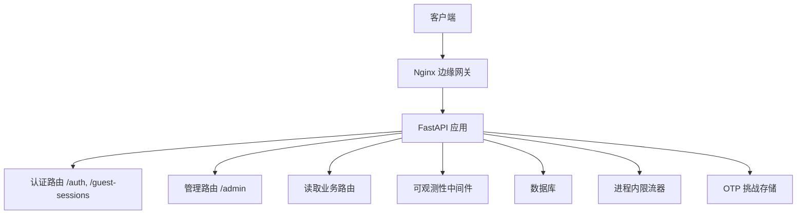
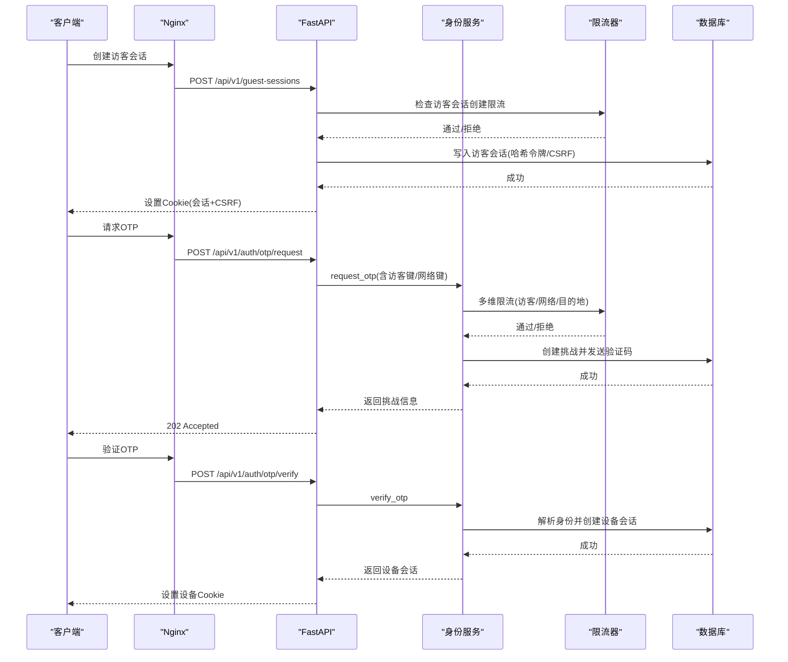
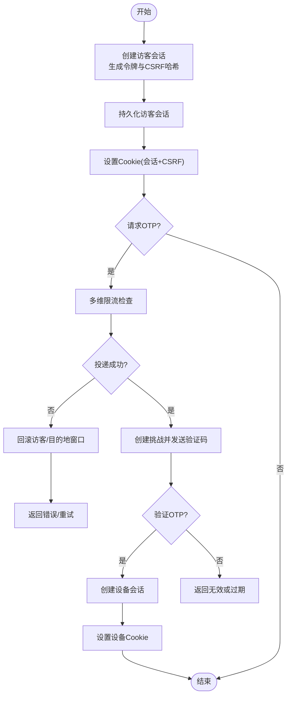
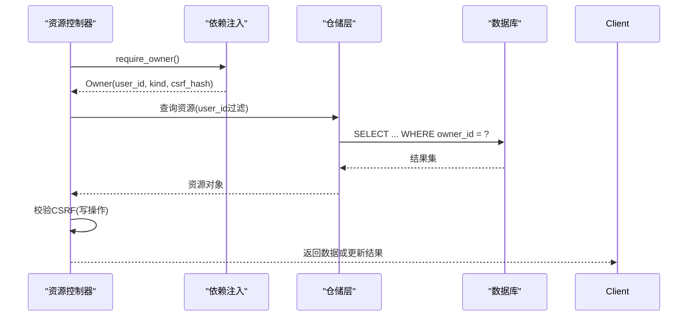
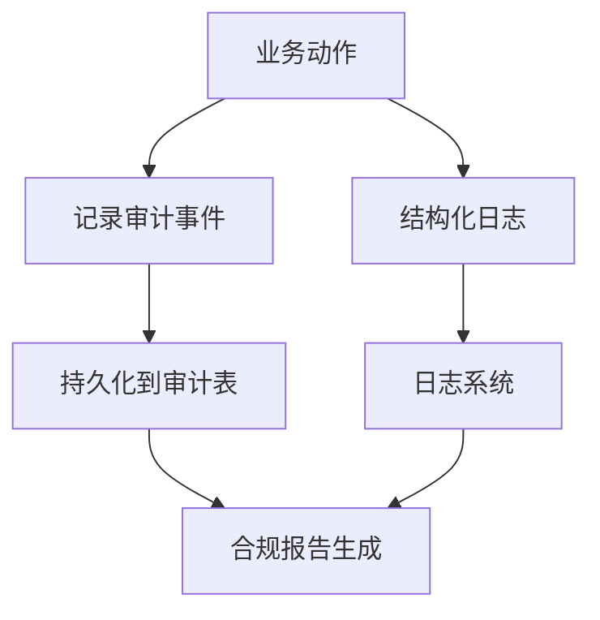
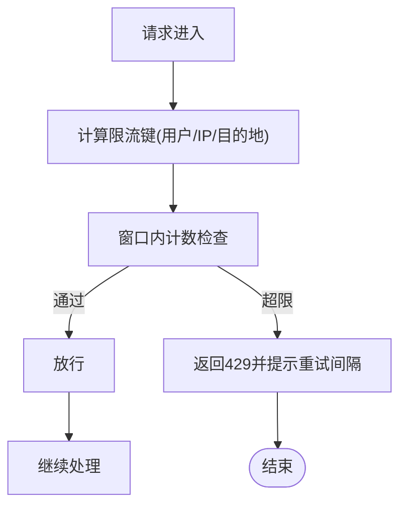
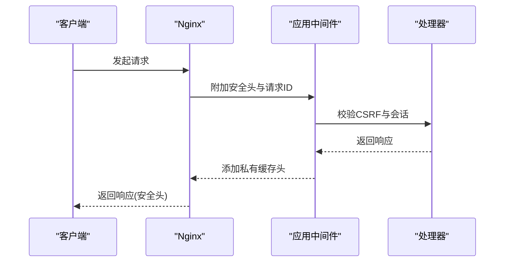
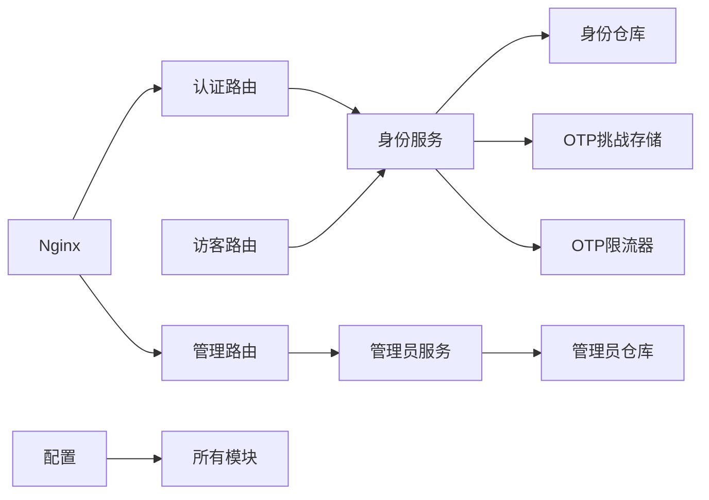

# 访问控制机制

<cite>
**本文引用的文件**
- [backend/app/main.py](file://backend/app/main.py)
- [backend/app/config.py](file://backend/app/config.py)
- [backend/app/api/auth.py](file://backend/app/api/auth.py)
- [backend/app/api/guest_sessions.py](file://backend/app/api/guest_sessions.py)
- [backend/app/api/admin.py](file://backend/app/api/admin.py)
- [backend/app/api/dependencies.py](file://backend/app/api/dependencies.py)
- [backend/app/api/rate_guard.py](file://backend/app/api/rate_guard.py)
- [backend/app/readings/rate_limit.py](file://backend/app/readings/rate_limit.py)
- [backend/app/identity/models.py](file://backend/app/identity/models.py)
- [backend/app/identity/service.py](file://backend/app/identity/service.py)
- [backend/app/identity/security.py](file://backend/app/identity/security.py)
- [backend/app/identity/cookies.py](file://backend/app/identity/cookies.py)
- [backend/app/identity/otp.py](file://backend/app/identity/otp.py)
- [backend/app/admin/models.py](file://backend/app/admin/models.py)
- [backend/app/admin/service.py](file://backend/app/admin/service.py)
- [backend/app/observability.py](file://backend/app/observability.py)
- [infra/nginx/app.conf](file://infra/nginx/app.conf)
- [contracts/schemas/auth-session.schema.json](file://contracts/schemas/auth-session.schema.json)
</cite>

## 目录
1. [简介](#简介)
2. [项目结构](#项目结构)
3. [核心组件](#核心组件)
4. [架构总览](#架构总览)
5. [详细组件分析](#详细组件分析)
6. [依赖关系分析](#依赖关系分析)
7. [性能考量](#性能考量)
8. [故障排查指南](#故障排查指南)
9. [结论](#结论)
10. [附录](#附录)

## 简介
本文件系统性阐述该项目的访问控制机制，覆盖以下方面：
- 基于角色的权限控制（RBAC）：角色定义、权限分配与继承关系。
- 资源级授权：对象级访问控制、数据范围限制与动态权限评估。
- 操作审计：日志记录、审计事件捕获与合规性报告。
- 速率限制策略：请求频率控制、IP限流与用户配额管理。
- 中间件安全拦截：请求验证、响应过滤与安全头设置。
- 权限模型设计：RBAC实现、最小权限原则与权限升级防护。
- 监控告警与异常检测：可观测性与告警开关。

## 项目结构
后端采用模块化分层：API路由层、身份与会话、管理员域、读取业务域、配置与可观测性、Nginx边缘网关等。访问控制贯穿各层：
- API路由层负责鉴权依赖注入、CSRF校验、速率限制与错误映射。
- 身份与会话提供设备会话、访客会话、OTP挑战与令牌安全。
- 管理员域提供员工登录、会话与审计。
- 读取业务域提供写操作的滑动窗口限流。
- 配置层集中管控生产安全约束与限流参数。
- Nginx在边缘层设置安全响应头并转发可信代理信息。



**图表来源**
- [backend/app/main.py:50-77](file://backend/app/main.py#L50-L77)
- [infra/nginx/app.conf:1-44](file://infra/nginx/app.conf#L1-L44)

**章节来源**
- [backend/app/main.py:50-77](file://backend/app/main.py#L50-L77)
- [infra/nginx/app.conf:1-44](file://infra/nginx/app.conf#L1-L44)

## 核心组件
- 会话与身份
  - 设备会话与会话Cookie：用于已认证用户的持久会话与CSRF双提交校验。
  - 访客会话：未登录用户临时会话，支持后续认领为正式用户。
  - OTP挑战与验证码：通道无关的目的地归一化、多粒度限流与失败回滚。
- 管理员域
  - 员工账号、会话与审计事件；支持环境可控的引导账户创建。
- 速率限制
  - 通用滑动窗口限流器，面向写操作与特定接口。
  - OTP请求的多维限流（访客、网络、目的地）。
- 安全与配置
  - 生产安全强制校验（Cookie安全、禁用模拟适配器、固定路径与白名单）。
  - 边缘安全头与缓存策略。
- 可观测性
  - 请求ID注入、结构化日志输出。

**章节来源**
- [backend/app/identity/models.py:68-132](file://backend/app/identity/models.py#L68-L132)
- [backend/app/identity/service.py:35-192](file://backend/app/identity/service.py#L35-L192)
- [backend/app/admin/models.py:17-81](file://backend/app/admin/models.py#L17-L81)
- [backend/app/admin/service.py:33-148](file://backend/app/admin/service.py#L33-L148)
- [backend/app/readings/rate_limit.py:9-61](file://backend/app/readings/rate_limit.py#L9-L61)
- [backend/app/identity/otp.py:64-180](file://backend/app/identity/otp.py#L64-L180)
- [backend/app/config.py:62-335](file://backend/app/config.py#L62-L335)
- [backend/app/observability.py:27-52](file://backend/app/observability.py#L27-L52)

## 架构总览
访问控制的关键流程包括：
- 访客会话创建与CSRF保护。
- OTP请求与验证，建立设备会话。
- 管理员登录与会话管理。
- 写操作前的速率限制检查。
- 边缘安全头与请求追踪。



**图表来源**
- [backend/app/api/guest_sessions.py:16-52](file://backend/app/api/guest_sessions.py#L16-L52)
- [backend/app/api/auth.py:44-138](file://backend/app/api/auth.py#L44-L138)
- [backend/app/identity/service.py:100-192](file://backend/app/identity/service.py#L100-L192)
- [backend/app/identity/otp.py:86-180](file://backend/app/identity/otp.py#L86-L180)

## 详细组件分析

### 会话与身份（设备会话、访客会话、OTP）
- 访客会话
  - 创建时生成不透明令牌与CSRF令牌，仅保存哈希值到数据库。
  - 新访客会话会撤销旧会话，防止重放。
  - Cookie设置包含HttpOnly与SameSite策略，生产环境强制Secure。
- 设备会话
  - 通过OTP验证后创建，绑定用户与登录身份，支持过期与吊销。
  - 所有写操作需携带CSRF双提交校验，确保跨站请求伪造防护。
- OTP流程
  - 目的地归一化与哈希，避免明文暴露。
  - 三层限流：访客维度、网络维度、目的地维度；失败时回滚非网络维度计数。
  - 提供商不可用时释放挑战并保留网络窗口，防止攻击者利用中断绕过限流。



**图表来源**
- [backend/app/api/guest_sessions.py:16-52](file://backend/app/api/guest_sessions.py#L16-L52)
- [backend/app/identity/service.py:35-192](file://backend/app/identity/service.py#L35-L192)
- [backend/app/identity/otp.py:86-180](file://backend/app/identity/otp.py#L86-L180)

**章节来源**
- [backend/app/identity/models.py:68-132](file://backend/app/identity/models.py#L68-L132)
- [backend/app/identity/service.py:35-192](file://backend/app/identity/service.py#L35-L192)
- [backend/app/identity/cookies.py:1-60](file://backend/app/identity/cookies.py#L1-L60)
- [backend/app/identity/otp.py:64-180](file://backend/app/identity/otp.py#L64-L180)

### 管理员权限（RBAC）
- 角色与权限
  - 员工表包含角色字段，当前实现以“superadmin”作为初始引导角色。
  - 登录成功后创建员工会话，记录登录审计事件。
  - 登出时吊销会话并记录审计事件。
- 权限分配与继承
  - 当前版本未实现细粒度权限矩阵与继承链；建议扩展为角色-权限映射表与继承规则。
- 最小权限与升级防护
  - 管理员登录受速率限制；生产环境禁止引导账户。
  - 建议在后续版本引入基于资源的授权（如按模块/功能点）与权限提升审批流程。

```mermaid
classDiagram
class StaffUser {
+uuid id
+string email
+string password_hash
+string display_name
+string role
+string status
+datetime last_login_at
}
class StaffSession {
+uuid id
+uuid staff_user_id
+string token_hash
+string csrf_token_hash
+datetime expires_at
+datetime last_seen_at
+datetime revoked_at
}
class AdminAuditEvent {
+uuid id
+uuid staff_user_id
+uuid actor_session_id
+string action
+jsonb event_metadata
+datetime created_at
}
StaffUser ||--o{ StaffSession : "拥有"
StaffUser ||--o{ AdminAuditEvent : "产生"
StaffSession ||--o{ AdminAuditEvent : "作为执行上下文"
```

**图表来源**
- [backend/app/admin/models.py:17-81](file://backend/app/admin/models.py#L17-L81)
- [backend/app/admin/service.py:33-148](file://backend/app/admin/service.py#L33-L148)

**章节来源**
- [backend/app/admin/models.py:17-81](file://backend/app/admin/models.py#L17-L81)
- [backend/app/admin/service.py:33-148](file://backend/app/admin/service.py#L33-L148)
- [backend/app/api/admin.py:33-65](file://backend/app/api/admin.py#L33-L65)

### 资源级授权（对象级访问控制、数据范围限制、动态权限评估）
- 对象级访问控制
  - 通过Owner抽象统一用户与会客主体，依赖注入获取当前主体并校验CSRF。
  - 资源控制器应结合Owner.id进行数据归属校验，确保只能访问自身数据。
- 数据范围限制
  - 读取与写入操作可通过Repository层增加user_id过滤条件，实现行级隔离。
- 动态权限评估
  - 可在服务层根据业务上下文（如租户、组织、资源标签）动态决定允许/拒绝。
  - 建议引入策略引擎或声明式注解简化权限判定。



**图表来源**
- [backend/app/api/dependencies.py:87-130](file://backend/app/api/dependencies.py#L87-L130)

**章节来源**
- [backend/app/api/dependencies.py:87-130](file://backend/app/api/dependencies.py#L87-L130)

### 操作审计（日志记录、事件捕获、合规报告）
- 事件捕获
  - 用户侧：设备会话创建、OTP验证、登出等动作记录到审计事件表。
  - 管理员侧：登录、登出、引导创建等动作记录到管理员审计事件表。
- 日志记录
  - 请求级可观测性中间件记录方法、路径、状态码、耗时与请求ID。
- 合规报告
  - 审计事件具备时间戳与元数据，便于导出与合规审查。
  - 生产环境要求开启告警接收器与真实流量开关前完成门禁检查。



**图表来源**
- [backend/app/identity/models.py:113-132](file://backend/app/identity/models.py#L113-L132)
- [backend/app/admin/models.py:59-81](file://backend/app/admin/models.py#L59-L81)
- [backend/app/observability.py:27-52](file://backend/app/observability.py#L27-L52)

**章节来源**
- [backend/app/identity/models.py:113-132](file://backend/app/identity/models.py#L113-L132)
- [backend/app/admin/models.py:59-81](file://backend/app/admin/models.py#L59-L81)
- [backend/app/observability.py:27-52](file://backend/app/observability.py#L27-L52)

### 速率限制策略（请求频率控制、IP限流、用户配额）
- 通用写操作限流
  - 使用滑动窗口限流器，按主体键限制单位时间内的写次数。
  - 超限返回429并附带Retry-After。
- OTP多维限流
  - 访客维度、网络维度、目的地维度分别计数，失败时回滚非网络维度。
  - 支持可信代理网络识别，区分真实客户端IP。
- 用户配额管理
  - 通过Owner键对读/写操作进行配额控制，可扩展为按订阅等级差异化限额。



**图表来源**
- [backend/app/readings/rate_limit.py:9-61](file://backend/app/readings/rate_limit.py#L9-L61)
- [backend/app/api/rate_guard.py:5-20](file://backend/app/api/rate_guard.py#L5-L20)
- [backend/app/identity/otp.py:86-180](file://backend/app/identity/otp.py#L86-L180)

**章节来源**
- [backend/app/readings/rate_limit.py:9-61](file://backend/app/readings/rate_limit.py#L9-L61)
- [backend/app/api/rate_guard.py:5-20](file://backend/app/api/rate_guard.py#L5-L20)
- [backend/app/identity/otp.py:86-180](file://backend/app/identity/otp.py#L86-L180)

### 中间件安全拦截（请求验证、响应过滤、安全头）
- 请求验证
  - CSRF双提交校验：Cookie中的CSRF与请求头一致且匹配会话哈希。
  - 会话有效性校验：设备与会客会话均需在有效期内且未被吊销。
- 响应过滤
  - 私有响应标记：禁止缓存与索引，防止敏感数据泄露。
- 安全头设置
  - Nginx设置X-Content-Type-Options、X-Frame-Options、Referrer-Policy、Permissions-Policy。
  - 应用层注入X-Request-ID以便追踪。



**图表来源**
- [backend/app/api/dependencies.py:29-130](file://backend/app/api/dependencies.py#L29-L130)
- [backend/app/observability.py:27-52](file://backend/app/observability.py#L27-L52)
- [infra/nginx/app.conf:1-44](file://infra/nginx/app.conf#L1-L44)

**章节来源**
- [backend/app/api/dependencies.py:29-130](file://backend/app/api/dependencies.py#L29-L130)
- [backend/app/observability.py:27-52](file://backend/app/observability.py#L27-L52)
- [infra/nginx/app.conf:1-44](file://infra/nginx/app.conf#L1-L44)

### 权限模型设计（RBAC实现、最小权限原则、权限升级防护）
- RBAC实现现状
  - 管理员域具备角色字段与基础会话管理；尚未实现细粒度权限矩阵。
  - 建议扩展为角色-权限映射与资源级授权策略。
- 最小权限原则
  - 默认拒绝，显式授权；仅授予完成任务所需的最小权限。
  - 写操作前置限流与CSRF校验，降低滥用风险。
- 权限升级防护
  - 管理员引导仅在非生产环境允许；生产环境禁用模拟适配器与本地密钥。
  - 建议引入权限提升审批与二次确认流程。

**章节来源**
- [backend/app/admin/models.py:17-81](file://backend/app/admin/models.py#L17-L81)
- [backend/app/admin/service.py:33-148](file://backend/app/admin/service.py#L33-L148)
- [backend/app/config.py:188-329](file://backend/app/config.py#L188-L329)

### 监控告警与异常检测
- 可观测性
  - 每个HTTP请求记录结构化日志，包含方法、路径、状态码、耗时与请求ID。
- 告警开关
  - 生产环境要求开启告警接收器；真实流量开关需满足门禁条件。
- 异常检测
  - 通过限流与错误码（401/403/429/503）识别异常行为。
  - 审计事件可用于事后分析与合规报告。

**章节来源**
- [backend/app/observability.py:27-52](file://backend/app/observability.py#L27-L52)
- [backend/app/config.py:188-329](file://backend/app/config.py#L188-L329)

## 依赖关系分析
访问控制相关模块的依赖关系如下：
- API路由依赖身份服务、限流器与数据库会话。
- 身份服务依赖仓库、挑战存储、投递适配器与限流器。
- 管理员服务依赖仓库与密码工具。
- 配置层约束生产安全与运行时参数。
- Nginx在边缘层设置安全头并转发可信代理信息。



**图表来源**
- [backend/app/api/auth.py:30-41](file://backend/app/api/auth.py#L30-L41)
- [backend/app/api/guest_sessions.py:22-52](file://backend/app/api/guest_sessions.py#L22-L52)
- [backend/app/api/admin.py:36-65](file://backend/app/api/admin.py#L36-L65)
- [backend/app/identity/service.py:78-99](file://backend/app/identity/service.py#L78-L99)
- [backend/app/admin/service.py:33-48](file://backend/app/admin/service.py#L33-L48)
- [backend/app/config.py:62-149](file://backend/app/config.py#L62-L149)
- [infra/nginx/app.conf:16-32](file://infra/nginx/app.conf#L16-L32)

**章节来源**
- [backend/app/api/auth.py:30-41](file://backend/app/api/auth.py#L30-L41)
- [backend/app/api/guest_sessions.py:22-52](file://backend/app/api/guest_sessions.py#L22-L52)
- [backend/app/api/admin.py:36-65](file://backend/app/api/admin.py#L36-L65)
- [backend/app/identity/service.py:78-99](file://backend/app/identity/service.py#L78-L99)
- [backend/app/admin/service.py:33-48](file://backend/app/admin/service.py#L33-L48)
- [backend/app/config.py:62-149](file://backend/app/config.py#L62-L149)
- [infra/nginx/app.conf:16-32](file://infra/nginx/app.conf#L16-L32)

## 性能考量
- 限流器为进程内滑动窗口，适合单机或小规模集群；分布式场景建议替换为Redis-backed实现。
- OTP多维限流使用内存字典与锁，注意键空间膨胀与过期清理。
- 审计事件与日志可能带来I/O开销，建议异步落盘与采样策略。
- Nginx安全头与缓存策略影响浏览器缓存行为，需平衡安全与性能。

[本节提供一般性指导，无需具体文件分析]

## 故障排查指南
- 401/403错误
  - 检查Cookie是否包含有效会话与CSRF令牌。
  - 确认CSRF双提交校验通过且会话未吊销。
- 429错误
  - 检查限流键与窗口大小；查看Retry-After提示。
  - OTP请求被拒时，检查访客、网络、目的地维度是否超限。
- 503错误
  - OTP投递不可用；检查投递适配器与重试逻辑。
- 审计与日志
  - 通过审计事件与结构化日志定位问题；关注请求ID关联。

**章节来源**
- [backend/app/api/dependencies.py:29-130](file://backend/app/api/dependencies.py#L29-L130)
- [backend/app/api/rate_guard.py:5-20](file://backend/app/api/rate_guard.py#L5-L20)
- [backend/app/identity/otp.py:86-180](file://backend/app/identity/otp.py#L86-L180)
- [backend/app/observability.py:27-52](file://backend/app/observability.py#L27-L52)

## 结论
本项目实现了较为完善的访问控制基础能力：
- 身份与会话管理：设备与会客会话、OTP挑战与CSRF保护。
- 管理员权限：基础RBAC与审计事件。
- 速率限制：通用与OTP多维限流。
- 安全中间件：边缘安全头与应用层私有响应标记。
- 可观测性：结构化日志与请求追踪。
建议后续增强：
- 细粒度RBAC与资源级授权策略。
- 分布式限流与审计存储。
- 权限升级审批与动态策略引擎。

[本节总结性内容，无需具体文件分析]

## 附录
- 会话响应契约
  - 认证会话响应包含用户ID、会话ID、过期时间与CSRF令牌。

**章节来源**
- [contracts/schemas/auth-session.schema.json:1-14](file://contracts/schemas/auth-session.schema.json#L1-L14)