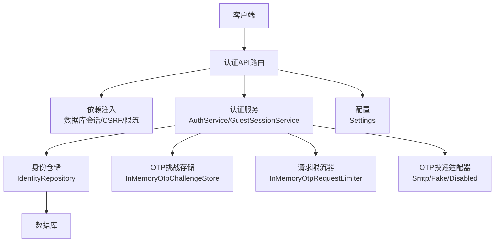
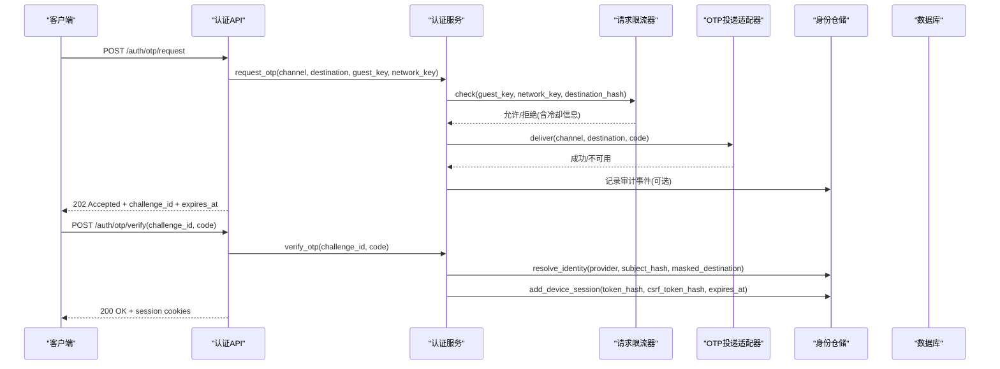
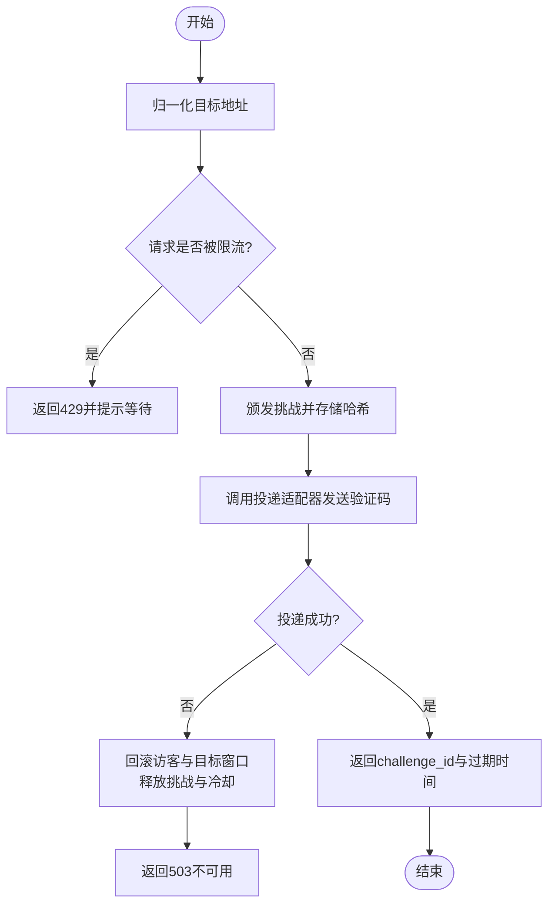
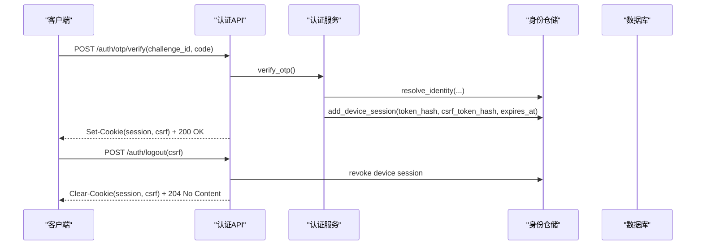
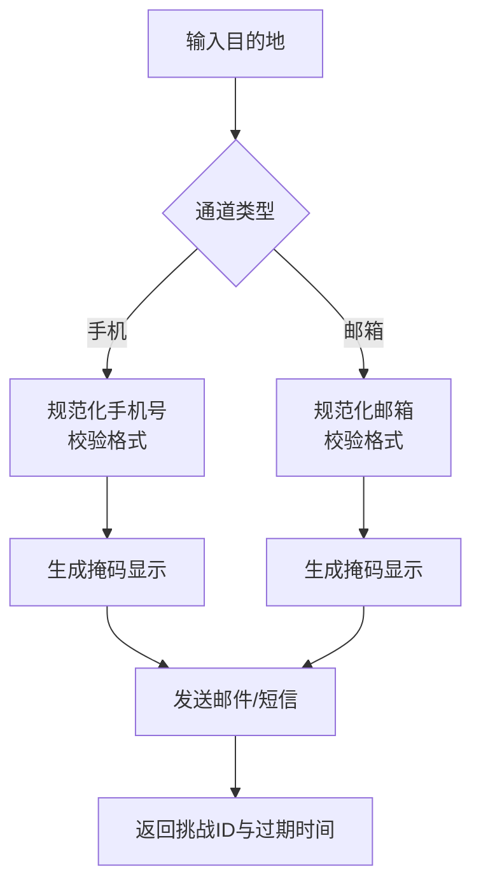
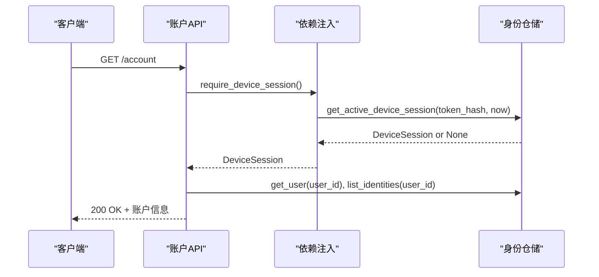
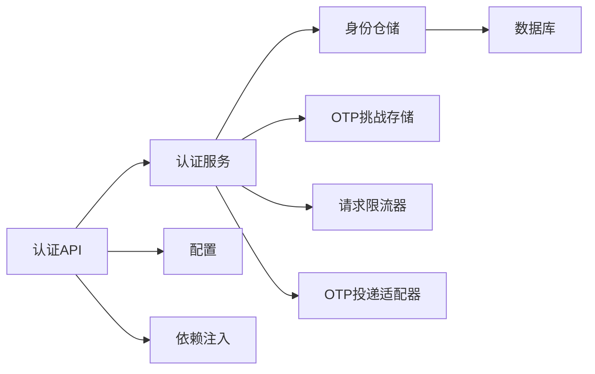

# 身份认证系统

<cite>
**本文引用的文件**
- [backend/app/identity/service.py](file://backend/app/identity/service.py)
- [backend/app/identity/otp.py](file://backend/app/identity/otp.py)
- [backend/app/identity/security.py](file://backend/app/identity/security.py)
- [backend/app/api/auth.py](file://backend/app/api/auth.py)
- [backend/app/api/guest_sessions.py](file://backend/app/api/guest_sessions.py)
- [backend/app/identity/models.py](file://backend/app/identity/models.py)
- [backend/app/identity/cookies.py](file://backend/app/identity/cookies.py)
- [backend/app/adapters/otp.py](file://backend/app/adapters/otp.py)
- [backend/app/config.py](file://backend/app/config.py)
- [backend/app/api/dependencies.py](file://backend/app/api/dependencies.py)
- [backend/app/admin/service.py](file://backend/app/admin/service.py)
- [backend/app/api/account.py](file://backend/app/api/account.py)
- [backend/tests/test_auth.py](file://backend/tests/test_auth.py)
- [backend/tests/test_guest_sessions.py](file://backend/tests/test_guest_sessions.py)
</cite>

## 目录
1. [简介](#简介)
2. [项目结构](#项目结构)
3. [核心组件](#核心组件)
4. [架构总览](#架构总览)
5. [详细组件分析](#详细组件分析)
6. [依赖关系分析](#依赖关系分析)
7. [性能考虑](#性能考虑)
8. [故障排查指南](#故障排查指南)
9. [结论](#结论)
10. [附录](#附录)

## 简介
本文件围绕身份认证系统，系统性说明 OTP 验证码生成机制、令牌签发与存储、会话管理（访客、用户、管理员）、多因素认证支持、认证状态管理以及安全最佳实践与故障排查。内容基于后端代码实现，覆盖从 API 到服务层、数据模型与安全策略的完整链路。

## 项目结构
认证相关能力主要分布在以下模块：
- 接口层：FastAPI 路由处理请求与响应，负责参数校验、限流、CSRF 校验与错误映射
- 服务层：业务编排 OTP 发放、验证、会话创建与审计记录
- 适配层：OTP 投递适配器（邮件 SMTP、Fake、Disabled）
- 安全与配置：令牌生成与哈希、Cookie 设置、生产环境安全约束
- 数据模型：用户、登录身份、设备会话、访客会话、审计事件等持久化实体



**图示来源**
- [backend/app/api/auth.py:30-41](file://backend/app/api/auth.py#L30-L41)
- [backend/app/identity/service.py:78-98](file://backend/app/identity/service.py#L78-L98)
- [backend/app/identity/otp.py:221-239](file://backend/app/identity/otp.py#L221-L239)
- [backend/app/adapters/otp.py:57-129](file://backend/app/adapters/otp.py#L57-L129)
- [backend/app/config.py:62-146](file://backend/app/config.py#L62-L146)

**章节来源**
- [backend/app/api/auth.py:30-41](file://backend/app/api/auth.py#L30-L41)
- [backend/app/identity/service.py:78-98](file://backend/app/identity/service.py#L78-L98)
- [backend/app/identity/otp.py:221-239](file://backend/app/identity/otp.py#L221-L239)
- [backend/app/adapters/otp.py:57-129](file://backend/app/adapters/otp.py#L57-L129)
- [backend/app/config.py:62-146](file://backend/app/config.py#L62-L146)

## 核心组件
- OTP 验证码生成与校验
  - 随机数生成：使用密码学安全的随机源生成六位数字验证码；开发/测试环境可返回固定“开发码”
  - 验证码格式与有效期：通过挑战对象管理 TTL、冷却期、最大尝试次数与失败计数
  - 速率限制：三层窗口（访客、网络、目标地址）防刷与回滚机制
- 令牌签发与存储
  - 不透明令牌：使用安全随机字符串作为会话令牌
  - 哈希存储：所有敏感令牌均以哈希形式落库，避免明文泄露
  - 安全传输：Cookie 启用 Secure、HttpOnly、SameSite=lax，并设置过期时间
- 会话管理
  - 访客会话：短期匿名会话，用于发起 OTP 请求与 CSRF 保护
  - 用户会话：验证通过后创建设备级会话，绑定用户与身份标识
  - 管理员会话：独立的管理员登录流程与会话生命周期
- 多因素认证支持
  - 手机号验证：规范化中国大陆手机号，脱敏显示
  - 邮箱验证：标准化邮箱地址，脱敏本地部分
  - 第三方集成：通过通道抽象扩展更多渠道（当前实现为 phone/email）
- 认证状态管理
  - 登录状态检查：通过设备会话依赖注入校验
  - 会话续期：通过 last_seen_at 与过期时间控制
  - 自动登出：会话过期或主动注销时撤销会话并清理 Cookie
- 安全最佳实践
  - 密码策略：管理员密码哈希与校验
  - 会话安全：CSRF 双提交校验、令牌哈希存储、Cookie 安全标志
  - 防暴力破解：OTP 冷却期、最大尝试次数、多层速率限制

**章节来源**
- [backend/app/identity/service.py:23-26](file://backend/app/identity/service.py#L23-L26)
- [backend/app/identity/otp.py:17-24](file://backend/app/identity/otp.py#L17-L24)
- [backend/app/identity/otp.py:183-218](file://backend/app/identity/otp.py#L183-L218)
- [backend/app/identity/otp.py:221-304](file://backend/app/identity/otp.py#L221-L304)
- [backend/app/identity/security.py:5-11](file://backend/app/identity/security.py#L5-L11)
- [backend/app/identity/cookies.py:12-102](file://backend/app/identity/cookies.py#L12-L102)
- [backend/app/api/dependencies.py:29-130](file://backend/app/api/dependencies.py#L29-L130)
- [backend/app/config.py:188-239](file://backend/app/config.py#L188-L239)

## 架构总览
认证系统采用分层设计：API 路由负责协议与边界校验，服务层编排 OTP 流程与会话创建，适配层屏蔽投递细节，仓储层负责持久化，配置层提供安全约束与运行时开关。



**图示来源**
- [backend/app/api/auth.py:44-138](file://backend/app/api/auth.py#L44-L138)
- [backend/app/identity/service.py:100-191](file://backend/app/identity/service.py#L100-L191)
- [backend/app/identity/otp.py:64-181](file://backend/app/identity/otp.py#L64-L181)
- [backend/app/adapters/otp.py:57-129](file://backend/app/adapters/otp.py#L57-L129)

## 详细组件分析

### OTP 验证码生成与校验
- 随机数生成：使用密码学安全随机源生成六位数字验证码；在开发与测试环境中可通过配置返回固定“开发码”，便于自动化测试
- 挑战存储：每个验证码以 HMAC 哈希形式存储，附带挑战 ID、目标地址、提供者主体哈希、创建与过期时间、尝试次数与消费时间
- 冷却与重试：同一目标地址存在冷却期，防止频繁重发；失败投递会释放挑战与冷却占用，确保恢复后可立即重试
- 验证流程：校验挑战是否存在、未过期、未消费且尝试次数未超限；成功后标记消费并清理冷却记录



**图示来源**
- [backend/app/identity/service.py:100-151](file://backend/app/identity/service.py#L100-L151)
- [backend/app/identity/otp.py:64-181](file://backend/app/identity/otp.py#L64-L181)
- [backend/app/adapters/otp.py:57-129](file://backend/app/adapters/otp.py#L57-L129)

**章节来源**
- [backend/app/identity/service.py:100-151](file://backend/app/identity/service.py#L100-L151)
- [backend/app/identity/otp.py:183-218](file://backend/app/identity/otp.py#L183-L218)
- [backend/app/identity/otp.py:221-304](file://backend/app/identity/otp.py#L221-L304)
- [backend/tests/test_auth.py:161-177](file://backend/tests/test_auth.py#L161-L177)
- [backend/tests/test_auth.py:408-449](file://backend/tests/test_auth.py#L408-L449)

### 令牌签发与存储
- 不透明令牌：使用安全随机字符串作为会话令牌，避免可预测性
- 哈希存储：所有令牌（访客、设备、CSRF）均以 SHA-256 哈希形式持久化，降低泄露风险
- 安全传输：Cookie 启用 Secure、HttpOnly、SameSite=lax，并设置明确的过期时间；CSRF Token 仅用于双提交校验，不设为 HttpOnly
- 注销流程：注销时撤销设备会话并清理 Cookie，确保会话失效



**图示来源**
- [backend/app/api/auth.py:91-160](file://backend/app/api/auth.py#L91-L160)
- [backend/app/identity/service.py:153-191](file://backend/app/identity/service.py#L153-L191)
- [backend/app/identity/security.py:5-11](file://backend/app/identity/security.py#L5-L11)
- [backend/app/identity/cookies.py:63-102](file://backend/app/identity/cookies.py#L63-L102)

**章节来源**
- [backend/app/api/auth.py:91-160](file://backend/app/api/auth.py#L91-L160)
- [backend/app/identity/service.py:153-191](file://backend/app/identity/service.py#L153-L191)
- [backend/app/identity/security.py:5-11](file://backend/app/identity/security.py#L5-L11)
- [backend/app/identity/cookies.py:63-102](file://backend/app/identity/cookies.py#L63-L102)
- [backend/tests/test_auth.py:53-88](file://backend/tests/test_auth.py#L53-L88)
- [backend/tests/test_auth.py:179-196](file://backend/tests/test_auth.py#L179-L196)

### 会话管理机制
- 访客会话
  - 创建：生成不透明令牌与 CSRF Token，设置 24 小时过期，写入 Cookie 并持久化哈希
  - 限流：按网络地址限制创建频率，支持可信代理识别真实客户端 IP
  - 轮换：新访客会话创建时会撤销旧会话，保证唯一有效
- 用户会话
  - 创建：OTP 验证通过后创建设备会话，绑定用户与身份，设置设备会话天数
  - 校验：受保护接口通过依赖注入校验设备会话与 CSRF
  - 注销：撤销会话并清理 Cookie
- 管理员会话
  - 登录：邮箱+密码校验，支持首次引导创建超级管理员
  - 会话：独立会话模型与审计事件，支持注销与审计追踪

```mermaid
classDiagram
class GuestSession {
+UUID id
+string token_hash
+string csrf_token_hash
+datetime expires_at
+datetime claimed_at
+UUID claimed_by_user_id
+datetime revoked_at
+datetime created_at
}
class DeviceSession {
+UUID id
+UUID user_id
+string token_hash
+string csrf_token_hash
+datetime expires_at
+datetime last_seen_at
+datetime revoked_at
+datetime created_at
}
class StaffSession {
+UUID id
+UUID staff_user_id
+string token_hash
+string csrf_token_hash
+datetime expires_at
+datetime last_seen_at
+datetime revoked_at
+datetime created_at
}
class LoginIdentity {
+UUID id
+UUID user_id
+string provider
+string provider_subject_hash
+string masked_destination
+string status
+datetime verified_at
+datetime created_at
}
class User {
+UUID id
+string status
+datetime created_at
}
User ||--o{ LoginIdentity : "拥有"
User ||--o{ DeviceSession : "拥有"
StaffSession ..> User : "管理员会话关联"
```

**图示来源**
- [backend/app/identity/models.py:31-132](file://backend/app/identity/models.py#L31-L132)
- [backend/app/admin/service.py:33-89](file://backend/app/admin/service.py#L33-L89)

**章节来源**
- [backend/app/api/guest_sessions.py:16-53](file://backend/app/api/guest_sessions.py#L16-L53)
- [backend/app/identity/service.py:35-58](file://backend/app/identity/service.py#L35-L58)
- [backend/app/identity/models.py:68-110](file://backend/app/identity/models.py#L68-L110)
- [backend/app/admin/service.py:33-89](file://backend/app/admin/service.py#L33-L89)
- [backend/tests/test_guest_sessions.py:14-76](file://backend/tests/test_guest_sessions.py#L14-L76)
- [backend/tests/test_guest_sessions.py:78-176](file://backend/tests/test_guest_sessions.py#L78-L176)

### 多因素认证支持
- 手机号验证
  - 规范化：去除非数字字符，处理国家码前缀，校验中国大陆手机号格式
  - 脱敏：展示掩码形式，避免暴露完整号码
- 邮箱验证
  - 规范化：大小写统一、去除空白，校验邮箱格式
  - 脱敏：掩码本地部分，保留域名
- 第三方集成
  - 通道抽象：通过 OtpChannel 抽象不同渠道，当前实现 phone/email
  - 投递适配：SMTP 邮件发送，支持 STARTTLS/SSL；测试环境使用 Fake 适配器



**图示来源**
- [backend/app/identity/otp.py:183-218](file://backend/app/identity/otp.py#L183-L218)
- [backend/app/adapters/otp.py:57-129](file://backend/app/adapters/otp.py#L57-L129)

**章节来源**
- [backend/app/identity/otp.py:183-218](file://backend/app/identity/otp.py#L183-L218)
- [backend/app/adapters/otp.py:57-129](file://backend/app/adapters/otp.py#L57-L129)
- [backend/tests/test_auth.py:118-142](file://backend/tests/test_auth.py#L118-L142)

### 认证状态管理
- 登录状态检查
  - 设备会话依赖：通过 require_device_session 校验当前请求是否已登录
  - 账户查询：获取用户信息与已验证身份列表
- 会话续期
  - last_seen_at：记录最近访问时间，结合过期时间控制会话寿命
  - 访客会话：每次创建新会话会撤销旧会话，避免并发冲突
- 自动登出
  - 主动注销：撤销设备会话并清理 Cookie
  - 过期失效：会话过期后无法通过依赖注入校验



**图示来源**
- [backend/app/api/account.py:13-28](file://backend/app/api/account.py#L13-L28)
- [backend/app/api/dependencies.py:72-84](file://backend/app/api/dependencies.py#L72-L84)

**章节来源**
- [backend/app/api/account.py:13-28](file://backend/app/api/account.py#L13-L28)
- [backend/app/api/dependencies.py:72-84](file://backend/app/api/dependencies.py#L72-L84)
- [backend/tests/test_auth.py:192-196](file://backend/tests/test_auth.py#L192-L196)

### 安全最佳实践
- 密码策略
  - 管理员密码：使用哈希存储与校验，避免明文保存
  - 首次引导：仅在允许环境下创建超级管理员，生产环境禁用引导
- 会话安全
  - CSRF 双提交：Cookie 与请求头同时携带并比对，防止跨站请求伪造
  - 令牌哈希：所有敏感令牌均以哈希形式存储，降低泄露影响
  - Cookie 安全：启用 Secure、HttpOnly、SameSite=lax，设置明确过期时间
- 防暴力破解
  - OTP 冷却期：同一目标地址冷却一段时间，防止频繁重发
  - 最大尝试次数：单挑战最多尝试次数，超过后拒绝
  - 多层速率限制：访客、网络、目标地址三层窗口，防止滥用
  - 生产安全：禁止使用 Fake 适配器与本地密钥，强制安全 Cookie

**章节来源**
- [backend/app/admin/service.py:49-89](file://backend/app/admin/service.py#L49-L89)
- [backend/app/api/dependencies.py:29-130](file://backend/app/api/dependencies.py#L29-L130)
- [backend/app/identity/otp.py:17-24](file://backend/app/identity/otp.py#L17-L24)
- [backend/app/identity/otp.py:221-304](file://backend/app/identity/otp.py#L221-L304)
- [backend/app/config.py:188-239](file://backend/app/config.py#L188-L239)

## 依赖关系分析
认证系统各组件之间的依赖关系清晰，API 层依赖服务层，服务层依赖仓储、适配层与配置，数据模型贯穿整个流程。



**图示来源**
- [backend/app/api/auth.py:30-41](file://backend/app/api/auth.py#L30-L41)
- [backend/app/identity/service.py:78-98](file://backend/app/identity/service.py#L78-L98)
- [backend/app/identity/otp.py:221-239](file://backend/app/identity/otp.py#L221-L239)
- [backend/app/adapters/otp.py:57-129](file://backend/app/adapters/otp.py#L57-L129)
- [backend/app/config.py:62-146](file://backend/app/config.py#L62-L146)

**章节来源**
- [backend/app/api/auth.py:30-41](file://backend/app/api/auth.py#L30-L41)
- [backend/app/identity/service.py:78-98](file://backend/app/identity/service.py#L78-L98)
- [backend/app/identity/otp.py:221-239](file://backend/app/identity/otp.py#L221-L239)
- [backend/app/adapters/otp.py:57-129](file://backend/app/adapters/otp.py#L57-L129)
- [backend/app/config.py:62-146](file://backend/app/config.py#L62-L146)

## 性能考虑
- 内存限流器：适用于测试与本地环境，生产环境建议替换为 Redis 实现以支持分布式限流
- 挑战存储：当前为内存存储，生产环境需替换为持久化存储以确保高可用与一致性
- 会话清理：定期清理过期会话与访客会话，减少数据库压力
- 投递优化：邮件发送异步化，避免阻塞主请求路径
- 缓存策略：对热点数据（如用户信息）进行缓存，提升查询性能

[本节为通用指导，无需特定文件来源]

## 故障排查指南
- OTP 请求被限流
  - 现象：返回 429，提示等待
  - 原因：访客、网络或目标地址窗口达到限制
  - 解决：等待窗口过期或调整限流配置
- OTP 投递不可用
  - 现象：返回 503，提示不可用
  - 原因：SMTP 服务器不可达或配置错误
  - 解决：检查 SMTP 配置与网络连接，确认 STARTTLS/SSL 支持
- 验证码无效或过期
  - 现象：返回 400，提示无效或过期
  - 原因：验证码错误、挑战已消费或过期
  - 解决：重新请求验证码，注意有效期与尝试次数
- 会话无效或认证失败
  - 现象：返回 401，提示需要认证
  - 原因：会话过期、被撤销或 CSRF 校验失败
  - 解决：重新登录，检查 Cookie 与请求头是否正确携带
- 生产环境启动失败
  - 现象：配置校验失败
  - 原因：生产环境禁止使用 Fake 适配器、本地密钥或未配置必要参数
  - 解决：根据错误提示修正配置，确保生产安全约束满足

**章节来源**
- [backend/tests/test_auth.py:161-177](file://backend/tests/test_auth.py#L161-L177)
- [backend/tests/test_auth.py:199-223](file://backend/tests/test_auth.py#L199-L223)
- [backend/tests/test_auth.py:329-367](file://backend/tests/test_auth.py#L329-L367)
- [backend/tests/test_auth.py:408-449](file://backend/tests/test_auth.py#L408-L449)
- [backend/tests/test_guest_sessions.py:78-176](file://backend/tests/test_guest_sessions.py#L78-L176)

## 结论
该身份认证系统通过分层架构实现了安全的 OTP 验证码流程、会话管理与多因素认证支持。系统在安全方面采取了多项措施，包括令牌哈希存储、CSRF 双提交、多层速率限制与生产环境安全约束。通过清晰的依赖关系与完善的测试覆盖，系统具备良好的可维护性与可扩展性。在生产部署时，应关注持久化存储替换、性能优化与安全配置完善。

[本节为总结性内容，无需特定文件来源]

## 附录
- 关键配置项
  - OTP 相关：TTL、冷却期、最大尝试次数、速率窗口与限制
  - 会话相关：访客会话时长、设备会话天数、管理员会话时长
  - 安全相关：Cookie 安全标志、可信代理 CIDR、生产环境安全约束
- 常用 API
  - 访客会话：POST /guest-sessions
  - OTP 请求：POST /auth/otp/request
  - OTP 验证：POST /auth/otp/verify
  - 注销：POST /auth/logout
  - 账户查询：GET /account

**章节来源**
- [backend/app/config.py:122-146](file://backend/app/config.py#L122-L146)
- [backend/app/api/guest_sessions.py:16-53](file://backend/app/api/guest_sessions.py#L16-L53)
- [backend/app/api/auth.py:44-160](file://backend/app/api/auth.py#L44-L160)
- [backend/app/api/account.py:13-28](file://backend/app/api/account.py#L13-L28)