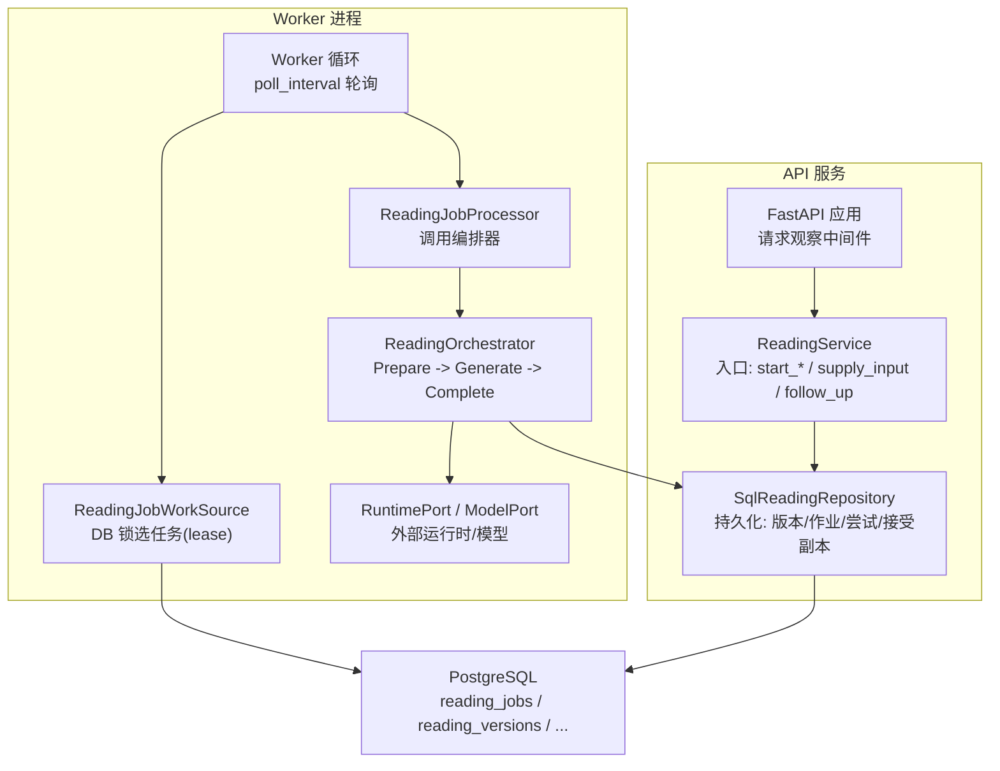
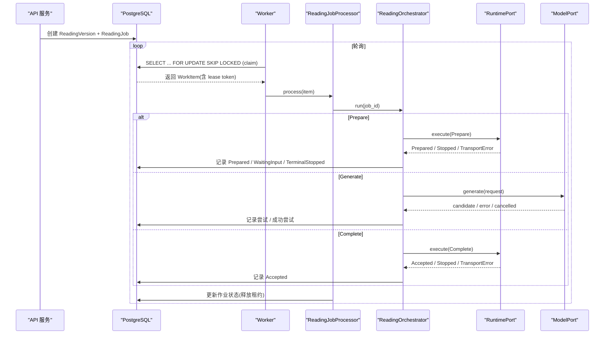
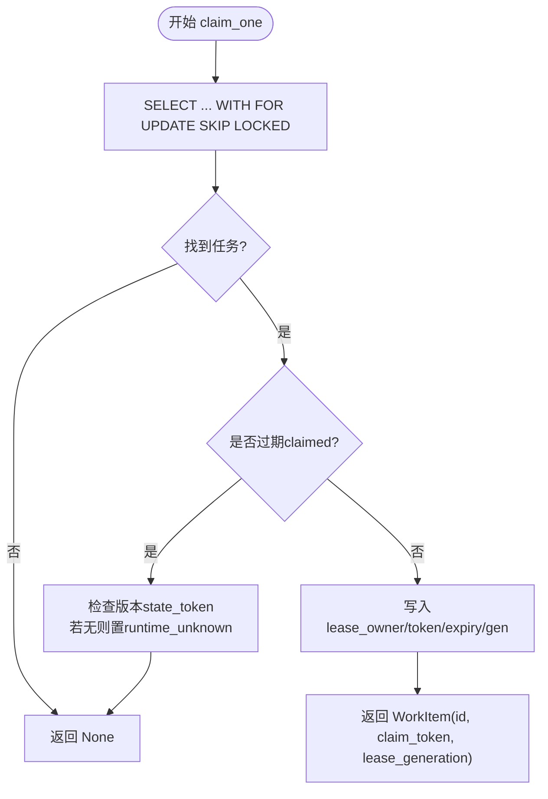
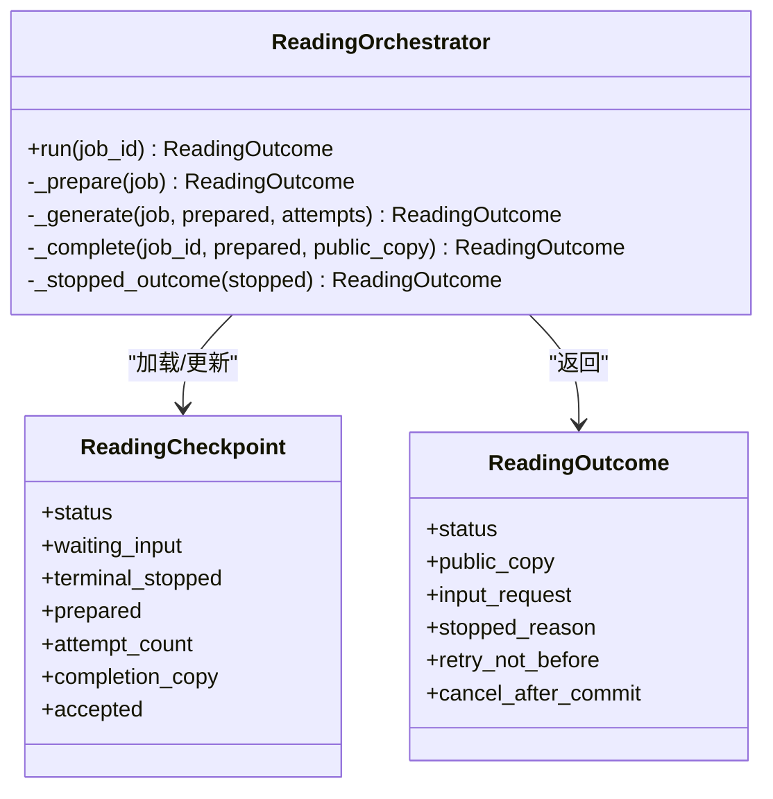
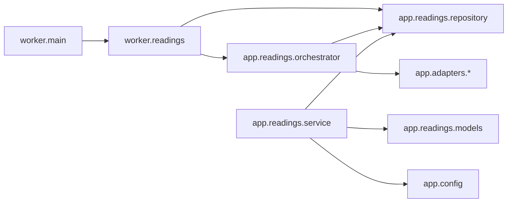

# 异步任务处理

<cite>
**本文引用的文件**
- [backend/worker/main.py](file://backend/worker/main.py)
- [backend/worker/readings.py](file://backend/worker/readings.py)
- [backend/app/readings/orchestrator.py](file://backend/app/readings/orchestrator.py)
- [backend/app/readings/service.py](file://backend/app/readings/service.py)
- [backend/app/readings/models.py](file://backend/app/readings/models.py)
- [backend/app/readings/repository.py](file://backend/app/readings/repository.py)
- [backend/app/readings/status.py](file://backend/app/readings/status.py)
- [backend/app/readings/alerts.py](file://backend/app/readings/alerts.py)
- [backend/app/readings/errors.py](file://backend/app/readings/errors.py)
- [backend/app/observability.py](file://backend/app/observability.py)
- [backend/app/config.py](file://backend/app/config.py)
</cite>

## 目录
1. [简介](#简介)
2. [项目结构](#项目结构)
3. [核心组件](#核心组件)
4. [架构总览](#架构总览)
5. [详细组件分析](#详细组件分析)
6. [依赖关系分析](#依赖关系分析)
7. [性能考量](#性能考量)
8. [故障排查指南](#故障排查指南)
9. [结论](#结论)
10. [附录](#附录)

## 简介
本文件面向“命理解读”系统的异步任务处理子系统，系统性解析 Worker 进程架构、任务队列设计、进程管理与资源隔离策略；深入说明命理解读任务的编排器实现（状态机、执行流程与错误恢复）；阐述调度策略（优先级、负载均衡、并发控制）、重试机制（退避、失败处理、死信队列）、监控与可观测性（指标、日志关联、性能分析）、持久化策略（状态存储、结果缓存、审计追踪），并提供调优与排障建议。

## 项目结构
系统采用“API 服务 + 独立 Worker 进程”的解耦架构：
- API 服务负责请求接入、输入校验、版本创建、任务入队与查询。
- Worker 进程通过数据库作为任务源，拉取并执行命理解读任务，驱动外部运行时与模型生成，最终落盘结果。

图表来源
- [backend/app/observability.py:27-51](file://backend/app/observability.py#L27-L51)
- [backend/app/readings/service.py:129-254](file://backend/app/readings/service.py#L129-L254)
- [backend/app/readings/repository.py:120-200](file://backend/app/readings/repository.py#L120-L200)
- [backend/worker/main.py:74-97](file://backend/worker/main.py#L74-L97)
- [backend/worker/readings.py:108-161](file://backend/worker/readings.py#L108-L161)
- [backend/worker/readings.py:164-231](file://backend/worker/readings.py#L164-L231)
- [backend/app/readings/orchestrator.py:212-450](file://backend/app/readings/orchestrator.py#L212-L450)

章节来源
- [backend/worker/main.py:74-97](file://backend/worker/main.py#L74-L97)
- [backend/worker/readings.py:108-161](file://backend/worker/readings.py#L108-L161)
- [backend/app/readings/service.py:129-254](file://backend/app/readings/service.py#L129-L254)
- [backend/app/readings/repository.py:120-200](file://backend/app/readings/repository.py#L120-L200)
- [backend/app/readings/orchestrator.py:212-450](file://backend/app/readings/orchestrator.py#L212-L450)

## 核心组件
- Worker 框架：通用异步工作循环，支持单次执行与持续轮询。
- 任务源：基于 PostgreSQL 的行级锁与租约（lease）机制，保证多 Worker 安全竞争。
- 处理器：将任务交给编排器执行，并在事务中更新作业状态。
- 编排器：实现命理解读的状态机（准备、生成、完成），处理传输错误、模型拒绝与取消。
- 服务层：构建 Prepare 命令、持久化版本、创建作业、幂等键与输入补充。
- 持久化：加密存储 Prepare、候选、结果、接受副本；不可变记录保障审计。
- 可观测性：结构化日志、告警事件、请求 ID 透传。

章节来源
- [backend/worker/main.py:10-97](file://backend/worker/main.py#L10-L97)
- [backend/worker/readings.py:108-231](file://backend/worker/readings.py#L108-L231)
- [backend/app/readings/orchestrator.py:178-450](file://backend/app/readings/orchestrator.py#L178-L450)
- [backend/app/readings/service.py:117-513](file://backend/app/readings/service.py#L117-L513)
- [backend/app/readings/models.py:28-378](file://backend/app/readings/models.py#L28-L378)
- [backend/app/readings/alerts.py:16-75](file://backend/app/readings/alerts.py#L16-L75)
- [backend/app/observability.py:14-51](file://backend/app/observability.py#L14-L51)

## 架构总览
Worker 进程以固定间隔从数据库中“抢占”任务，使用行级锁与租约令牌避免重复处理。编排器按阶段推进：
- Prepare：与外部运行时交互，可能进入 waiting_input 或 prepared。
- Generate：调用模型生成候选，经护栏校验后组装公开副本。
- Complete：向运行时提交最终结果，成功后标记为 accepted。

图表来源
- [backend/worker/readings.py:63-82](file://backend/worker/readings.py#L63-L82)
- [backend/worker/readings.py:121-161](file://backend/worker/readings.py#L121-L161)
- [backend/worker/readings.py:175-218](file://backend/worker/readings.py#L175-L218)
- [backend/app/readings/orchestrator.py:212-450](file://backend/app/readings/orchestrator.py#L212-L450)
- [backend/app/readings/service.py:455-513](file://backend/app/readings/service.py#L455-L513)

## 详细组件分析

### Worker 进程与任务队列
- 工作循环：支持 --once 单次执行与 --poll-interval 持续轮询。
- 任务抢占：使用 SQL 语句选择 queued 或已过期 claimed 的任务，order by available_at, id，limit 1，with_for_update(skip_locked=True)。
- 租约机制：claim 时写入 lease_owner、lease_token、lease_expires_at、lease_generation；处理完成后释放。
- 失效保护：若读取到 expired claim 且对应版本无 state_token，则回退为 runtime_unknown，避免孤儿 Root。

图表来源
- [backend/worker/readings.py:63-82](file://backend/worker/readings.py#L63-L82)
- [backend/worker/readings.py:121-161](file://backend/worker/readings.py#L121-L161)

章节来源
- [backend/worker/main.py:74-97](file://backend/worker/main.py#L74-L97)
- [backend/worker/readings.py:108-161](file://backend/worker/readings.py#L108-L161)

### 编排器状态机与执行流程
- 状态枚举：input_ready、waiting_input、terminal_stopped、prepared、completing、accepted、delayed、runtime_unknown。
- 主流程 run：
  - 若已 accepted 直接返回。
  - 若 terminal_stopped 直接返回。
  - 若存在 completion intent 且 prepared 存在，进入 _complete。
  - 若 delayed 或 runtime_unknown，直接返回。
  - 若 waiting_input 且 prepare 无 state_token，视为 stopped。
  - 若 prepared 存在，进入 _generate。
  - 否则进入 _prepare。
- Prepare：调用运行时，可能返回 Prepared、Stopped 或传输错误；无 state_token 的传输错误会标记为 runtime_unknown。
- Generate：调用模型生成，进行护栏校验与公开副本组装；失败记录尝试次数，超过上限进入 delayed。
- Complete：提交最终结果，若传输错误则延迟重试；成功后记录 accepted。

图表来源
- [backend/app/readings/orchestrator.py:60-79](file://backend/app/readings/orchestrator.py#L60-L79)
- [backend/app/readings/orchestrator.py:178-450](file://backend/app/readings/orchestrator.py#L178-L450)
- [backend/app/readings/status.py:4-13](file://backend/app/readings/status.py#L4-L13)

章节来源
- [backend/app/readings/orchestrator.py:212-450](file://backend/app/readings/orchestrator.py#L212-L450)
- [backend/app/readings/status.py:4-13](file://backend/app/readings/status.py#L4-L13)

### 任务调度策略
- 优先级队列：通过 available_at 排序，支持延迟执行（retry_not_before）。
- 负载均衡：skip_locked 行级锁确保多 Worker 不重复领取同一任务。
- 并发控制：每个 ReadingVersion 仅有一个活跃作业（索引约束），串行化同一版本的执行。
- 幂等与防重：服务层使用 Idempotency-Key 防止重复创建；作业层面使用 lease token 与 generation 防并发覆盖。

章节来源
- [backend/worker/readings.py:63-82](file://backend/worker/readings.py#L63-L82)
- [backend/app/readings/models.py:247-291](file://backend/app/readings/models.py#L247-L291)
- [backend/app/readings/service.py:455-513](file://backend/app/readings/service.py#L455-L513)

### 重试机制与失败处理
- Prepare 传输错误：若有 state_token，设置 retry_not_before 并返回 input_ready；若无 state_token，标记为 runtime_unknown。
- Complete 传输错误：保持 completing 状态，设置 retry_not_before，下次事务精确回放相同 token 与副本。
- 模型生成失败：记录尝试次数，超过 max_attempts 进入 delayed；cancelled 会触发 cancel_after_commit，在事务提交后取消当前 Worker 上下文。
- 指数退避：当前实现为固定 backoff（prepare_transport_backoff、complete_transport_backoff），可通过配置调整；未实现严格指数退避。
- 死信队列：delayed 状态充当“慢速队列”，由后续轮询继续尝试；无独立死信表。

章节来源
- [backend/app/readings/orchestrator.py:250-414](file://backend/app/readings/orchestrator.py#L250-L414)
- [backend/app/readings/errors.py:4-30](file://backend/app/readings/errors.py#L4-L30)

### 监控与可观测性
- 请求级观察：中间件注入 X-Request-ID，输出结构化 http_request 日志。
- 告警事件：编排器 emit alert（如 runtime_unknown、guard_rejection、delayed、model_cost），默认写入日志 sink。
- 日志级别：通过 Settings.log_level 配置；敏感传输日志降级。
- 指标收集：当前以结构化日志为主，未集成专用指标导出器；可通过日志聚合平台采集。

章节来源
- [backend/app/observability.py:14-51](file://backend/app/observability.py#L14-L51)
- [backend/app/readings/alerts.py:16-75](file://backend/app/readings/alerts.py#L16-L75)
- [backend/app/config.py:146-148](file://backend/app/config.py#L146-L148)

### 持久化策略
- 状态存储：ReadingVersion.status、ReadingJobRecord.status 驱动流程；FactBrief、GenerationAttempt、AcceptedCopy 记录关键数据。
- 结果缓存：AcceptedCopy 保存最终接受副本；Completion Intent 用于幂等完成。
- 审计追踪：不可变记录（RuntimeRelease、FactBrief、GenerationAttempt、AcceptedCopy）禁止更新，强制追加式审计。
- 加密存储：Prepare、Candidate、LastResult、Completion 均使用信封加密（key_id、nonce、ciphertext、digest）。

章节来源
- [backend/app/readings/models.py:28-378](file://backend/app/readings/models.py#L28-L378)
- [backend/app/readings/repository.py:120-200](file://backend/app/readings/repository.py#L120-L200)

### 任务调优指南
- 内存管理：
  - 使用 dataclass(slots=True) 降低内存占用。
  - 限制模型响应大小与超时，避免大对象驻留。
- CPU 优化：
  - 合理设置 poll_interval，减少空转开销。
  - 利用 skip_locked 避免锁竞争热点。
- 扩展性考虑：
  - 水平扩展 Worker 数量，受限于单版本串行约束。
  - 通过 available_at 实现延迟任务与优先级。
  - 生产环境强制真实 Runtime/Model 适配器，禁用 fake。

章节来源
- [backend/worker/main.py:74-97](file://backend/worker/main.py#L74-L97)
- [backend/worker/readings.py:63-82](file://backend/worker/readings.py#L63-L82)
- [backend/app/config.py:188-329](file://backend/app/config.py#L188-L329)

## 依赖关系分析
- Worker 依赖：
  - worker.main.Worker 提供循环与参数解析。
  - worker.readings.ReadingJobWorkSource/Processor 实现 DB 抢占与编排器调用。
  - app.readings.orchestrator.ReadingOrchestrator 编排 Prepare/Generate/Complete。
  - app.readings.repository.SqlReadingRepository 持久化。
  - app.adapters.* 提供运行时与模型适配。
- 服务层依赖：
  - app.readings.service.ReadingService 构建 Prepare、创建版本与作业、幂等键。
  - app.readings.models 定义所有持久化实体。
  - app.config.Settings 提供运行期配置与安全校验。

图表来源
- [backend/worker/main.py:74-97](file://backend/worker/main.py#L74-L97)
- [backend/worker/readings.py:254-319](file://backend/worker/readings.py#L254-L319)
- [backend/app/readings/orchestrator.py:178-450](file://backend/app/readings/orchestrator.py#L178-L450)
- [backend/app/readings/repository.py:51-200](file://backend/app/readings/repository.py#L51-L200)
- [backend/app/readings/service.py:117-513](file://backend/app/readings/service.py#L117-L513)
- [backend/app/readings/models.py:28-378](file://backend/app/readings/models.py#L28-L378)
- [backend/app/config.py:62-335](file://backend/app/config.py#L62-L335)

章节来源
- [backend/worker/readings.py:254-319](file://backend/worker/readings.py#L254-L319)
- [backend/app/readings/service.py:117-513](file://backend/app/readings/service.py#L117-L513)
- [backend/app/readings/orchestrator.py:178-450](file://backend/app/readings/orchestrator.py#L178-L450)
- [backend/app/readings/repository.py:51-200](file://backend/app/readings/repository.py#L51-L200)
- [backend/app/readings/models.py:28-378](file://backend/app/readings/models.py#L28-L378)
- [backend/app/config.py:62-335](file://backend/app/config.py#L62-L335)

## 性能考量
- 数据库锁粒度：使用 with_for_update(skip_locked=True) 最小化锁持有时间。
- 事务边界：作业状态更新与租约释放在同一事务内，保证一致性。
- 网络超时：模型与运行时调用具备连接/读取/整体超时限制，避免阻塞 Worker。
- 日志开销：结构化日志便于聚合，但需注意高吞吐下的 I/O 成本。
- 扩展性：单版本串行，多版本并行；通过增加 Worker 提升吞吐。

[本节为通用指导，无需特定文件引用]

## 故障排查指南
- 任务无法被领取：
  - 检查 reading_jobs 索引与 available_at；确认没有长事务持有锁。
  - 验证 lease 字段完整性（owner/token/expiry/gen）。
- 任务反复失败：
  - 查看 orchestrator 告警（runtime_unknown、guard_rejection、delayed）。
  - 检查模型与运行时超时与限流配置。
- 结果不一致：
  - 核对 AcceptedCopy 与 Completion Intent 的一致性。
  - 确认 Complete 阶段传输错误后的重试逻辑。
- 性能瓶颈：
  - 调整 poll_interval 与 Worker 数量。
  - 评估模型响应大小与超时阈值。

章节来源
- [backend/app/readings/orchestrator.py:250-414](file://backend/app/readings/orchestrator.py#L250-L414)
- [backend/app/readings/alerts.py:48-75](file://backend/app/readings/alerts.py#L48-L75)
- [backend/app/config.py:253-291](file://backend/app/config.py#L253-L291)

## 结论
该异步任务处理子系统通过“数据库即队列 + 租约锁 + 编排器状态机”的设计，实现了可靠、可观测、可扩展的命理解读任务执行。其特点包括：
- 强一致的任务抢占与状态推进。
- 明确的错误分类与恢复路径（transport error、model rejection、cancelled）。
- 审计友好的不可变记录与加密存储。
- 可配置的运行时与模型适配器，满足本地/预发/生产环境差异。
未来可在重试策略上引入指数退避、在监控上集成指标导出、在调度上引入更细粒度的优先级队列，以进一步提升鲁棒性与可观测性。

[本节为总结，无需特定文件引用]

## 附录
- 关键配置项（部分）：
  - 数据库 URL、日志级别、告警开关。
  - 运行时适配器与超时、最大 IO 字节数。
  - 模型适配器、提供商、端点、超时、温度、最大输出 token、价格快照等。
- 状态流转参考：
  - input_ready → prepared → completed → accepted
  - input_ready → waiting_input → input_ready（补充输入）
  - 任意阶段 → terminal_stopped（终止）
  - 任意阶段 → delayed（达到最大尝试）
  - 任意阶段 → runtime_unknown（无 state_token 的传输错误）

章节来源
- [backend/app/config.py:62-335](file://backend/app/config.py#L62-L335)
- [backend/app/readings/status.py:4-13](file://backend/app/readings/status.py#L4-L13)