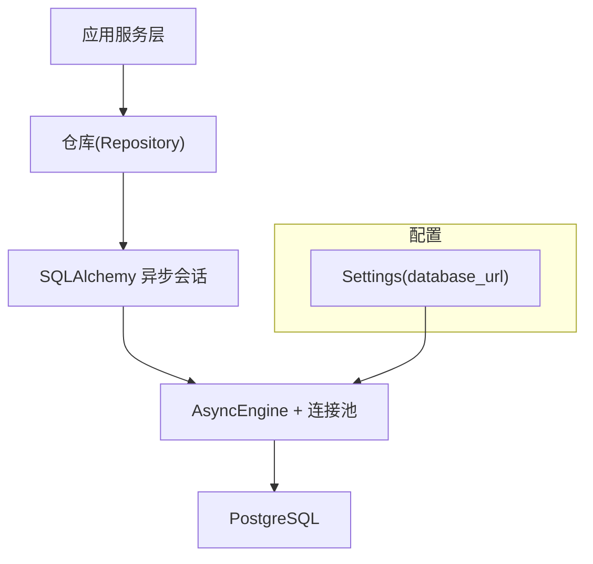
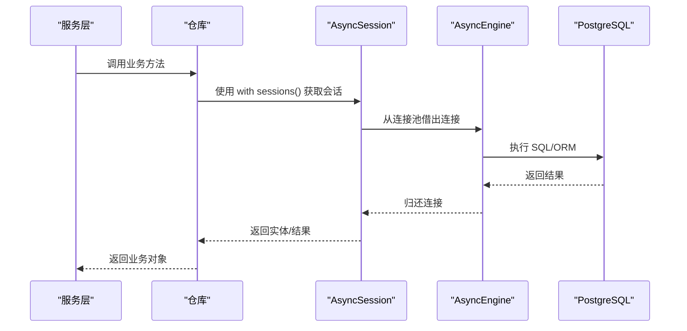
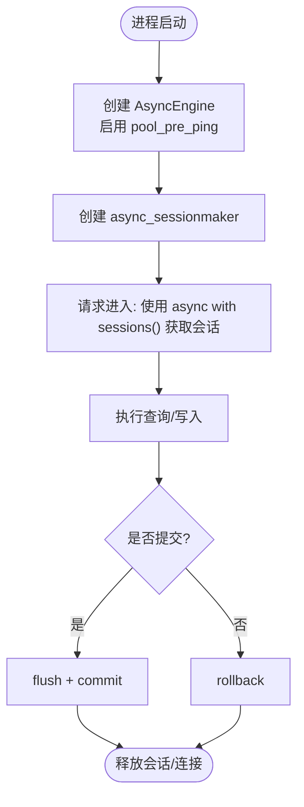
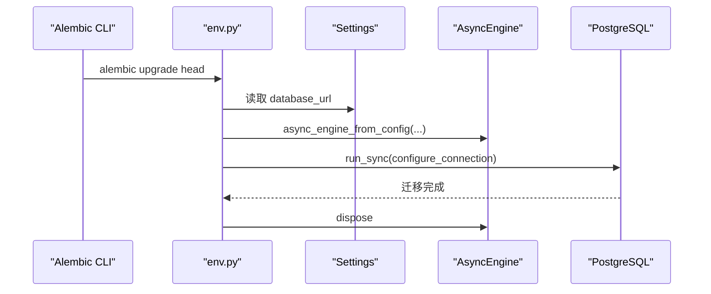
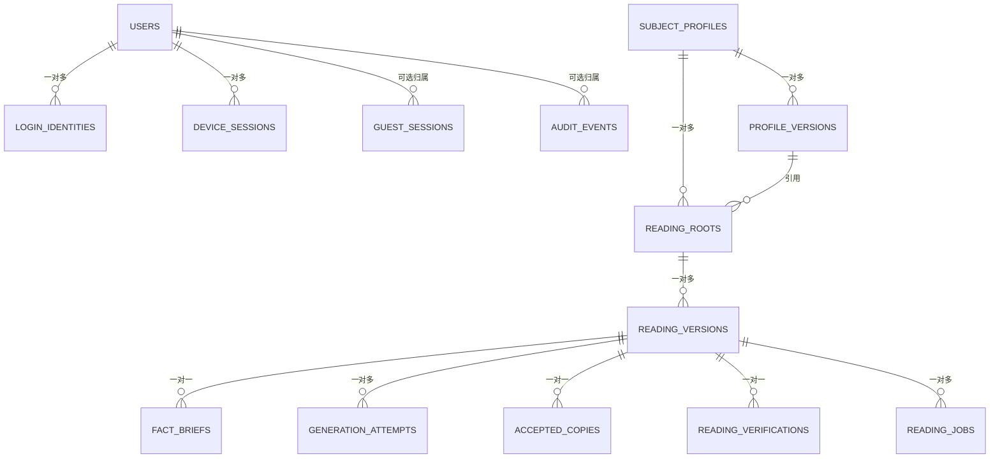
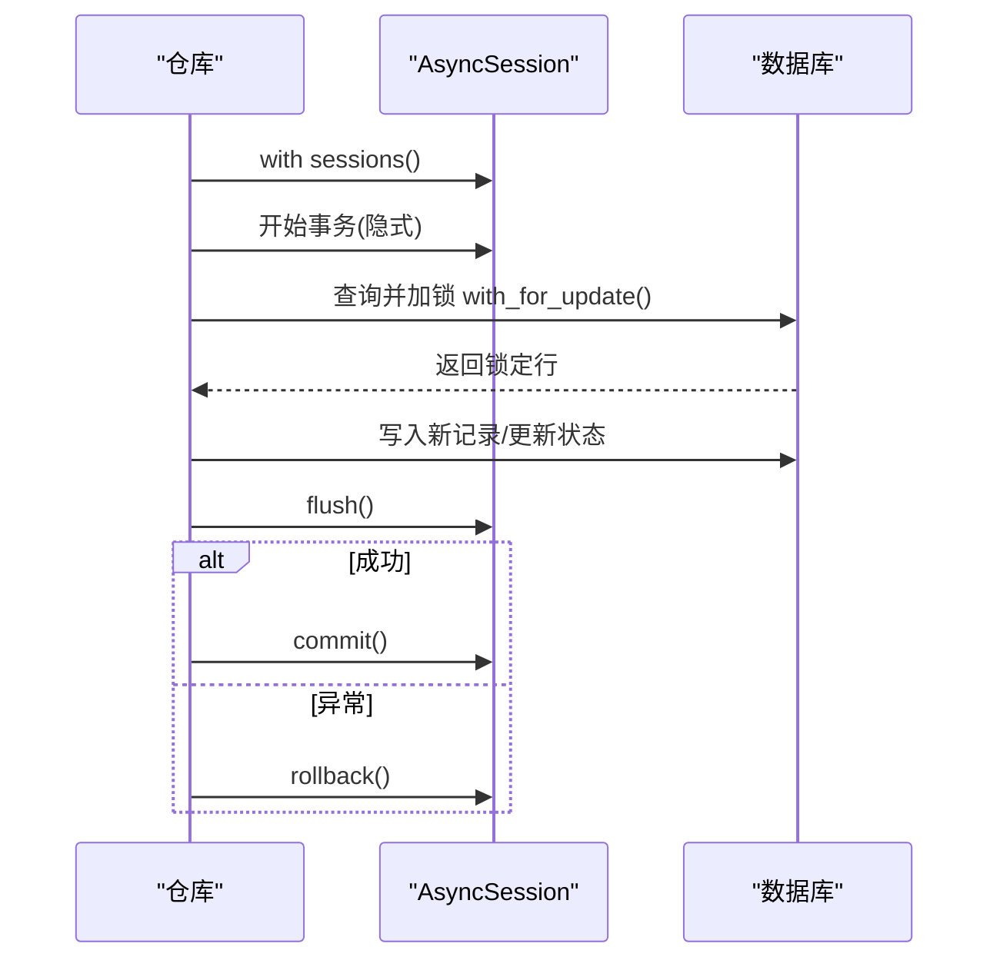
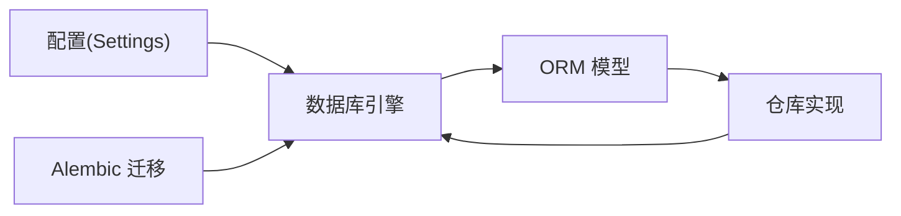

# 数据库访问层

<cite>
**本文引用的文件**
- [backend/app/database.py](file://backend/app/database.py)
- [backend/app/config.py](file://backend/app/config.py)
- [backend/alembic/env.py](file://backend/alembic/env.py)
- [backend/alembic/versions/0001_identity_foundation.py](file://backend/alembic/versions/0001_identity_foundation.py)
- [backend/alembic/versions/0002_profiles_and_readings.py](file://backend/alembic/versions/0002_profiles_and_readings.py)
- [backend/app/persistence.py](file://backend/app/persistence.py)
- [backend/app/identity/models.py](file://backend/app/identity/models.py)
- [backend/app/profiles/models.py](file://backend/app/profiles/models.py)
- [backend/app/readings/models.py](file://backend/app/readings/models.py)
- [backend/app/admin/models.py](file://backend/app/admin/models.py)
- [backend/app/identity/repository.py](file://backend/app/identity/repository.py)
- [backend/app/profiles/repository.py](file://backend/app/profiles/repository.py)
- [backend/app/readings/repository.py](file://backend/app/readings/repository.py)
</cite>

## 目录
1. [简介](#简介)
2. [项目结构](#项目结构)
3. [核心组件](#核心组件)
4. [架构总览](#架构总览)
5. [详细组件分析](#详细组件分析)
6. [依赖关系分析](#依赖关系分析)
7. [性能考虑](#性能考虑)
8. [故障排查指南](#故障排查指南)
9. [结论](#结论)
10. [附录](#附录)

## 简介
本文件聚焦后端数据库访问层，系统性说明 SQLAlchemy ORM 的异步会话管理、连接池配置与事务策略；梳理数据模型设计（表结构、关系映射、约束）；总结查询优化技术（索引、构建器、调优）；阐述 Alembic 迁移管理与回滚策略；归纳数据访问模式（CRUD、复杂查询、批量优化）；补充缓存策略（结果缓存、连接复用、内存缓存）；并给出监控维护与性能调优、故障排查建议。

## 项目结构
数据库相关代码主要分布在以下位置：
- 引擎与会话：backend/app/database.py
- 配置来源：backend/app/config.py
- 迁移环境：backend/alembic/env.py 及 versions/*
- 领域模型：app/identity/models.py、app/profiles/models.py、app/readings/models.py、app/admin/models.py
- 仓库实现：app/identity/repository.py、app/profiles/repository.py、app/readings/repository.py
- 持久化异常：app/persistence.py

图表来源
- [backend/app/database.py:12-32](file://backend/app/database.py#L12-L32)
- [backend/app/config.py:62-75](file://backend/app/config.py#L62-L75)

章节来源
- [backend/app/database.py:12-32](file://backend/app/database.py#L12-L32)
- [backend/app/config.py:62-75](file://backend/app/config.py#L62-L75)

## 核心组件
- 异步引擎与会话工厂：提供 AsyncEngine、async_sessionmaker 以及上下文管理器形式的 session() 生成器，统一生命周期管理。
- 配置中心：通过 Settings 读取 database_url，支持环境变量前缀与环境校验。
- 迁移环境：Alembic 在离线/在线模式下分别执行迁移，使用 async_engine_from_config 创建异步引擎并运行迁移。
- 领域模型：以 DeclarativeBase 定义表结构、外键、唯一约束、检查约束与索引。
- 仓库层：封装 CRUD、复杂查询、并发控制（行锁）、不可变记录保护与加密载荷读写。

章节来源
- [backend/app/database.py:12-32](file://backend/app/database.py#L12-L32)
- [backend/app/config.py:62-75](file://backend/app/config.py#L62-L75)
- [backend/alembic/env.py:20-58](file://backend/alembic/env.py#L20-L58)
- [backend/app/identity/models.py:27-29](file://backend/app/identity/models.py#L27-L29)
- [backend/app/profiles/models.py:21-79](file://backend/app/profiles/models.py#L21-L79)
- [backend/app/readings/models.py:28-378](file://backend/app/readings/models.py#L28-L378)
- [backend/app/admin/models.py:17-81](file://backend/app/admin/models.py#L17-L81)
- [backend/app/identity/repository.py:16-114](file://backend/app/identity/repository.py#L16-L114)
- [backend/app/profiles/repository.py:15-198](file://backend/app/profiles/repository.py#L15-L198)
- [backend/app/readings/repository.py:44-800](file://backend/app/readings/repository.py#L44-L800)

## 架构总览
下图展示从请求到数据库的调用链：服务层通过仓库获取 AsyncSession，执行 SQL 或 ORM 操作，最终由 AsyncEngine 管理连接池与数据库交互。

图表来源
- [backend/app/database.py:12-32](file://backend/app/database.py#L12-L32)
- [backend/app/readings/repository.py:120-167](file://backend/app/readings/repository.py#L120-L167)
- [backend/app/profiles/repository.py:46-104](file://backend/app/profiles/repository.py#L46-L104)

## 详细组件分析

### 异步会话与连接池
- 引擎创建：使用 create_async_engine 并开启 pool_pre_ping，确保连接健康探测。
- 会话工厂：async_sessionmaker(class_=AsyncSession, expire_on_commit=False)，提交后不自动失效，便于后续只读访问。
- 会话生命周期：session() 作为异步迭代器，with 块内自动管理会话生命周期。
- 健康检查：probe 方法执行 SELECT 1 验证连通性。
- 资源释放：dispose 关闭引擎与连接池。

图表来源
- [backend/app/database.py:12-32](file://backend/app/database.py#L12-L32)

章节来源
- [backend/app/database.py:12-32](file://backend/app/database.py#L12-L32)

### 配置与迁移
- 配置：Settings.database_url 默认 PostgreSQL 异步驱动 URL，可通过环境变量覆盖。
- 迁移环境：
  - 离线模式：直接配置 URL 并运行迁移。
  - 在线模式：使用 async_engine_from_config 创建异步引擎，run_sync 执行同步迁移函数。
- 目标元数据：聚合各模块 Base.metadata，确保所有模型参与迁移。

图表来源
- [backend/alembic/env.py:20-58](file://backend/alembic/env.py#L20-L58)
- [backend/app/config.py:62-75](file://backend/app/config.py#L62-L75)

章节来源
- [backend/alembic/env.py:20-58](file://backend/alembic/env.py#L20-L58)
- [backend/app/config.py:62-75](file://backend/app/config.py#L62-L75)

### 数据模型与约束
- 命名约定：统一主键、索引、唯一约束、外键命名规范，便于识别与维护。
- 身份域：
  - users、login_identities、device_sessions、guest_sessions、audit_events
  - 唯一约束与索引：如登录标识唯一、用户ID索引、会话过期时间索引等。
- 资料域：
  - subject_profiles、profile_versions
  - 检查约束：拥有者必须为用户或访客之一；版本不可变（before_update 抛出异常）。
- 阅读域：
  - runtime_releases、reading_roots、reading_versions、fact_briefs、generation_attempts、accepted_copies、reading_jobs、reading_idempotency_keys、reading_verifications
  - 大量检查约束保证成对字段一致性（如密文与指纹同时存在/不存在），作业状态机与租约一致性。
  - 唯一约束与条件唯一索引：如 reading_jobs 的活跃版本唯一索引。
- 管理域：
  - staff_users、staff_sessions、admin_audit_events

图表来源
- [backend/app/identity/models.py:31-132](file://backend/app/identity/models.py#L31-L132)
- [backend/app/profiles/models.py:21-79](file://backend/app/profiles/models.py#L21-L79)
- [backend/app/readings/models.py:28-378](file://backend/app/readings/models.py#L28-L378)
- [backend/app/admin/models.py:17-81](file://backend/app/admin/models.py#L17-L81)

章节来源
- [backend/app/identity/models.py:31-132](file://backend/app/identity/models.py#L31-L132)
- [backend/app/profiles/models.py:21-79](file://backend/app/profiles/models.py#L21-L79)
- [backend/app/readings/models.py:28-378](file://backend/app/readings/models.py#L28-L378)
- [backend/app/admin/models.py:17-81](file://backend/app/admin/models.py#L17-L81)

### 事务处理策略
- 会话级事务：通过 async_sessionmaker 创建的会话默认包裹事务，with 块结束时根据是否 flush/commit 决定提交或回滚。
- 嵌套事务：在需要原子子操作时使用 begin_nested 进行保存点，捕获完整性冲突后进行补偿逻辑。
- 行级锁：使用 with_for_update() 对关键行加锁，避免并发下重复分配版本号或竞态条件。
- 不可变记录：通过 before_update 事件监听抛出自定义异常，强制“追加写”语义。

图表来源
- [backend/app/readings/repository.py:120-167](file://backend/app/readings/repository.py#L120-L167)
- [backend/app/profiles/repository.py:46-104](file://backend/app/profiles/repository.py#L46-L104)
- [backend/app/readings/repository.py:378-404](file://backend/app/readings/repository.py#L378-L404)

章节来源
- [backend/app/readings/repository.py:120-167](file://backend/app/readings/repository.py#L120-L167)
- [backend/app/profiles/repository.py:46-104](file://backend/app/profiles/repository.py#L46-L104)
- [backend/app/readings/repository.py:378-404](file://backend/app/readings/repository.py#L378-L404)

### 查询优化与构建器
- 索引策略：
  - 常用过滤列建立普通索引，如 login_identities.user_id、guest_sessions.expires_at、audit_events.user_id、staff_users.status、admin_audit_events.created_at。
  - 条件唯一索引：reading_jobs.active_version 仅对活跃状态唯一，避免并发重复领取。
  - 复合索引：reading_jobs(status, available_at) 加速任务领取。
- 查询构建：
  - 使用 select 与标量查询减少对象开销。
  - 联合查询时按需选择列，避免 N+1。
  - 使用子查询与 group by 获取最新版本。
- 性能调优：
  - 合理分页与限制 limit。
  - 利用 server_default 与数据库侧计算减少往返。
  - 对大 JSON 字段谨慎查询，必要时拆分或归档。

章节来源
- [backend/app/identity/models.py:41-132](file://backend/app/identity/models.py#L41-L132)
- [backend/app/readings/models.py:247-337](file://backend/app/readings/models.py#L247-L337)
- [backend/app/admin/models.py:17-81](file://backend/app/admin/models.py#L17-L81)
- [backend/app/profiles/repository.py:145-182](file://backend/app/profiles/repository.py#L145-L182)

### 数据迁移管理
- 版本控制：每个迁移脚本包含 revision、down_revision、upgrade/downgrade。
- 环境适配：离线模式直接配置 URL 运行；在线模式通过异步引擎运行同步迁移函数。
- 回滚策略：每个迁移均实现 downgrade，按依赖链逐步回滚。
- 元数据聚合：env.py 中导入各 models 模块，确保 Base.metadata 包含全部表结构。

章节来源
- [backend/alembic/env.py:20-58](file://backend/alembic/env.py#L20-L58)
- [backend/alembic/versions/0001_identity_foundation.py:19-136](file://backend/alembic/versions/0001_identity_foundation.py#L19-L136)
- [backend/alembic/versions/0002_profiles_and_readings.py:28-303](file://backend/alembic/versions/0002_profiles_and_readings.py#L28-L303)

### 数据访问模式
- CRUD 封装：
  - 身份域：创建/撤销会话、解析身份、查询用户与列表。
  - 资料域：创建资料与版本、获取最新版本、加载加密载荷。
  - 阅读域：创建根与版本、作业调度、状态流转、幂等键、接受副本、验证反馈。
- 复杂查询：
  - 联合查询 ReadingRoot 与 ReadingVersion 并按所有者过滤。
  - 子查询获取每个 profile 的最新版本。
- 批量与并发：
  - 使用 with_for_update 串行化版本分配。
  - 条件唯一索引防止并发重复领取作业。
  - 嵌套事务处理唯一冲突后的重试/补偿。

章节来源
- [backend/app/identity/repository.py:16-114](file://backend/app/identity/repository.py#L16-L114)
- [backend/app/profiles/repository.py:15-198](file://backend/app/profiles/repository.py#L15-L198)
- [backend/app/readings/repository.py:44-800](file://backend/app/readings/repository.py#L44-L800)

### 缓存策略
- 查询结果缓存：当前仓库层未内置通用缓存，建议在服务层或网关层引入 Redis/Memcached 对热点只读数据进行缓存，注意设置合理的 TTL 与失效策略。
- 连接复用：由 SQLAlchemy 连接池负责，已启用 pool_pre_ping 提升健壮性。
- 内存缓存：可在进程内对极小且稳定的配置或字典使用 lru_cache（例如 Settings 已缓存实例），但需谨慎处理变更与线程安全。

[本节为通用建议，不直接分析具体文件]

### 监控与维护
- 慢查询分析：结合数据库日志与 EXPLAIN/ANALYZE 定位热点查询，关注缺少索引或全表扫描。
- 连接池监控：观察连接数、等待队列、空闲超时，调整 pool_size/max_overflow/idle_timeout 等参数。
- 备份恢复：定期全量与增量备份，演练恢复流程；迁移前后做好快照。

[本节为通用建议，不直接分析具体文件]

## 依赖关系分析

图表来源
- [backend/app/config.py:62-75](file://backend/app/config.py#L62-L75)
- [backend/app/database.py:12-32](file://backend/app/database.py#L12-L32)
- [backend/alembic/env.py:20-58](file://backend/alembic/env.py#L20-L58)

章节来源
- [backend/app/config.py:62-75](file://backend/app/config.py#L62-L75)
- [backend/app/database.py:12-32](file://backend/app/database.py#L12-L32)
- [backend/alembic/env.py:20-58](file://backend/alembic/env.py#L20-L58)

## 性能考虑
- 连接池与超时：根据并发与延迟要求调整连接池大小与超时；生产环境建议显式配置。
- 查询计划：对高频查询添加合适索引，避免 SELECT *，尽量使用标量查询。
- 事务粒度：缩小事务范围，减少锁持有时间；必要时使用保存点。
- 大对象存储：JSONB/Text 字段体积较大时，考虑分表或归档历史数据。
- 并发控制：充分利用条件唯一索引与行锁，避免应用层重试风暴。

[本节为通用建议，不直接分析具体文件]

## 故障排查指南
- 连接失败：检查 database_url 与网络连通性；使用 probe 快速诊断。
- 迁移失败：确认 env.py 正确导入所有模型；核对 down_revision 链；必要时回滚至上一版本。
- 唯一约束冲突：捕获 IntegrityError，采用“先查后插”或“插入后处理冲突”的策略。
- 不可变记录被修改：捕获 ImmutableRecordError，检查业务逻辑是否误改历史版本。
- 会话泄漏：确保使用 async with sessions() 管理生命周期，避免手动忘记 close。

章节来源
- [backend/app/database.py:23-32](file://backend/app/database.py#L23-L32)
- [backend/alembic/env.py:20-58](file://backend/alembic/env.py#L20-L58)
- [backend/app/readings/repository.py:378-404](file://backend/app/readings/repository.py#L378-L404)
- [backend/app/persistence.py:1-3](file://backend/app/persistence.py#L1-L3)

## 结论
本项目基于 SQLAlchemy 异步生态构建了稳健的数据库访问层：统一的引擎与会话管理、严格的模型约束与不可变记录保护、完善的 Alembic 迁移体系、以及面向并发与一致性的仓库实现。配合合适的索引与查询优化、合理的连接池配置与监控维护，可支撑高可靠的生产场景。

## 附录
- 术语
  - 会话：一次数据库事务的上下文，负责对象跟踪与提交/回滚。
  - 连接池：复用底层数据库连接以提升吞吐与降低延迟。
  - 不可变记录：一旦写入即不允许修改的数据行，通常用于审计或版本化。
- 参考路径
  - 引擎与会话：[backend/app/database.py](file://backend/app/database.py)
  - 配置：[backend/app/config.py](file://backend/app/config.py)
  - 迁移：[backend/alembic/env.py](file://backend/alembic/env.py)、[backend/alembic/versions](file://backend/alembic/versions)
  - 模型：[backend/app/identity/models.py](file://backend/app/identity/models.py)、[backend/app/profiles/models.py](file://backend/app/profiles/models.py)、[backend/app/readings/models.py](file://backend/app/readings/models.py)、[backend/app/admin/models.py](file://backend/app/admin/models.py)
  - 仓库：[backend/app/identity/repository.py](file://backend/app/identity/repository.py)、[backend/app/profiles/repository.py](file://backend/app/profiles/repository.py)、[backend/app/readings/repository.py](file://backend/app/readings/repository.py)