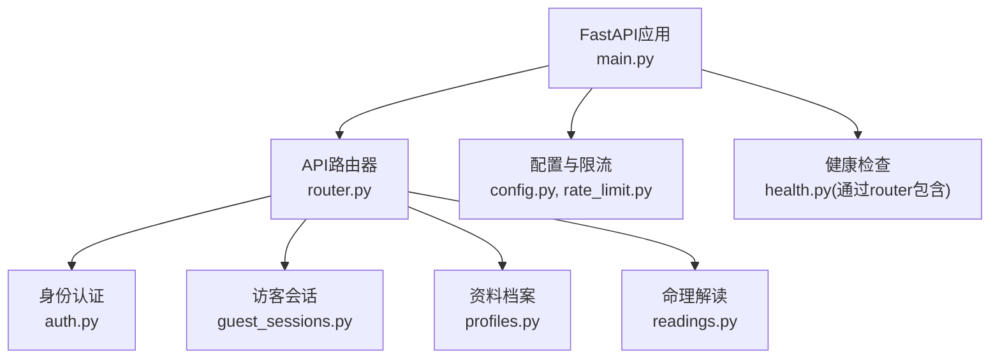
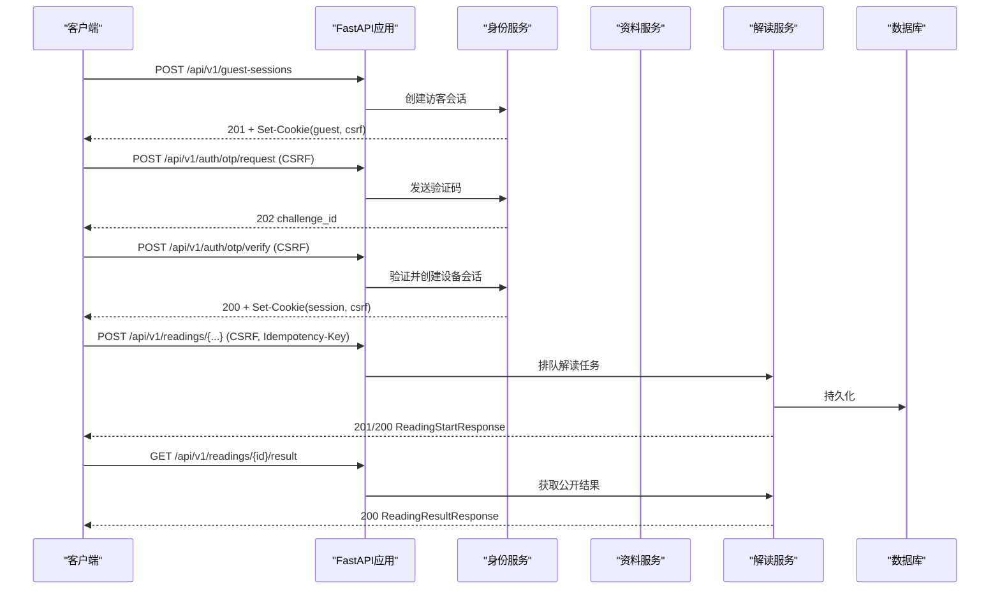
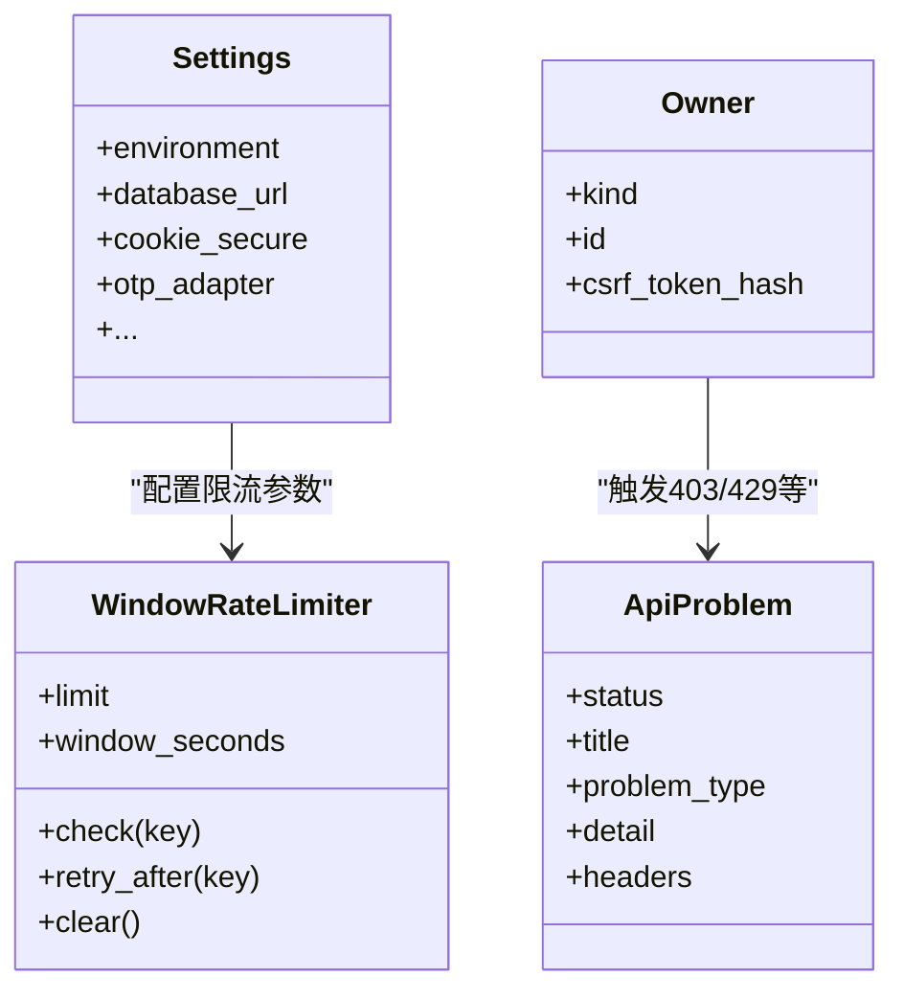

# API接口规范

<cite>
**本文引用的文件**
- [backend/app/main.py](file://backend/app/main.py)
- [backend/app/api/router.py](file://backend/app/api/router.py)
- [backend/app/api/auth.py](file://backend/app/api/auth.py)
- [backend/app/api/guest_sessions.py](file://backend/app/api/guest_sessions.py)
- [backend/app/api/profiles.py](file://backend/app/api/profiles.py)
- [backend/app/api/readings.py](file://backend/app/api/readings.py)
- [backend/app/api/dependencies.py](file://backend/app/api/dependencies.py)
- [backend/app/api/errors.py](file://backend/app/api/errors.py)
- [backend/app/api/rate_guard.py](file://backend/app/api/rate_guard.py)
- [backend/app/readings/api_schemas.py](file://backend/app/readings/api_schemas.py)
- [backend/app/readings/rate_limit.py](file://backend/app/readings/rate_limit.py)
- [backend/app/config.py](file://backend/app/config.py)
- [contracts/openapi/v1.yaml](file://contracts/openapi/v1.yaml)
</cite>

## 目录
1. [简介](#简介)
2. [项目结构](#项目结构)
3. [核心组件](#核心组件)
4. [架构总览](#架构总览)
5. [详细组件分析](#详细组件分析)
6. [依赖关系分析](#依赖关系分析)
7. [性能与限流](#性能与限流)
8. [故障排查指南](#故障排查指南)
9. [结论](#结论)
10. [附录：端点清单与示例](#附录端点清单与示例)

## 简介
本规范面向命理解读（Readings）相关的RESTful API，覆盖认证与会话、资料档案（Profiles）、命理解读（Readings）等能力。文档基于OpenAPI契约与后端实现，说明HTTP方法、路径、请求参数、响应格式、错误模型、速率限制、版本策略与客户端集成要点。所有端点统一以 /api/v1 为前缀。

## 项目结构
- API路由注册在统一入口中，按功能模块拆分到独立router文件。
- 认证与会话由身份模块提供；资料档案与命理解读分别有独立服务层。
- OpenAPI契约位于 contracts/openapi/v1.yaml，作为对外稳定契约。
- 应用启动时注入配置、数据库、限流器、OTP存储等全局状态。

图表来源
- [backend/app/main.py:30-156](file://backend/app/main.py#L30-L156)
- [backend/app/api/router.py:12-21](file://backend/app/api/router.py#L12-L21)

章节来源
- [backend/app/main.py:30-156](file://backend/app/main.py#L30-L156)
- [backend/app/api/router.py:12-21](file://backend/app/api/router.py#L12-L21)

## 核心组件
- 统一异常与问题体：ApiProblem 与 application 级异常处理器将业务异常转换为标准化的 application/problem+json 响应。
- 会话与权限：
  - 访客会话：创建并设置 HttpOnly Cookie，附带CSRF令牌。
  - 设备会话：通过OTP校验后建立可撤销的设备会话Cookie。
  - Owner抽象：统一用户或访客的“拥有者”上下文，用于资源归属校验。
  - CSRF双提交：Cookie中的CSRF Token与请求头 X-CSRF-Token 必须一致。
- 速率限制：基于滑动窗口的进程内 WindowRateLimiter，按 owner 维度对写操作进行限流。
- 幂等性：部分写接口支持 Idempotency-Key 请求头，重复键返回相同结果。

章节来源
- [backend/app/api/errors.py:1-17](file://backend/app/api/errors.py#L1-L17)
- [backend/app/main.py:115-136](file://backend/app/main.py#L115-L136)
- [backend/app/api/dependencies.py:19-137](file://backend/app/api/dependencies.py#L19-L137)
- [backend/app/api/rate_guard.py:1-20](file://backend/app/api/rate_guard.py#L1-L20)
- [backend/app/readings/rate_limit.py:9-61](file://backend/app/readings/rate_limit.py#L9-L61)

## 架构总览

图表来源
- [backend/app/api/guest_sessions.py:16-53](file://backend/app/api/guest_sessions.py#L16-L53)
- [backend/app/api/auth.py:44-161](file://backend/app/api/auth.py#L44-L161)
- [backend/app/api/readings.py:87-399](file://backend/app/api/readings.py#L87-L399)
- [contracts/openapi/v1.yaml:41-549](file://contracts/openapi/v1.yaml#L41-L549)

## 详细组件分析

### 认证与会话（Identity）
- 创建访客会话
  - 方法/路径：POST /api/v1/guest-sessions
  - 作用：创建或轮换短期匿名浏览器会话，设置 HttpOnly Cookie 与 CSRF。
  - 速率限制：按网络IP窗口限制。
  - 响应：201 Created，包含 expires_at 与 csrf_token。
- 请求验证码
  - 方法/路径：POST /api/v1/auth/otp/request
  - 必需头：X-CSRF-Token（与Cookie中的csrf一致）。
  - 请求体：channel（phone/email），destination。
  - 响应：202 Accepted，challenge_id、expires_at、retry_after_seconds，开发环境可能返回 development_code。
  - 错误：400 无效目的地、429 频率限制、503 投递不可用。
- 验证验证码并登录
  - 方法/路径：POST /api/v1/auth/otp/verify
  - 必需头：X-CSRF-Token。
  - 请求体：challenge_id、code（6位数字）。
  - 响应：200 OK，设置设备会话Cookie（mingli_session）与csrf，返回 user_id、session_id、expires_at、csrf_token。
  - 错误：400 无效或过期、429 尝试过多、409 访客已被认领。
- 登出
  - 方法/路径：POST /api/v1/auth/logout
  - 安全：需要设备会话Cookie。
  - 响应：204 No Content，清除设备会话Cookie。

章节来源
- [backend/app/api/guest_sessions.py:16-53](file://backend/app/api/guest_sessions.py#L16-L53)
- [backend/app/api/auth.py:44-161](file://backend/app/api/auth.py#L44-L161)
- [contracts/openapi/v1.yaml:41-128](file://contracts/openapi/v1.yaml#L41-L128)

### 资料档案（Profiles）
- 创建草稿
  - 方法/路径：POST /api/v1/profiles/drafts
  - 必需头：X-CSRF-Token。
  - 请求体：label。
  - 响应：201 Created，draft_id。
  - 速率限制：按owner写窗口限制。
- 确认草稿为不可变版本
  - 方法/路径：POST /api/v1/profiles/drafts/{draft_id}/confirm
  - 必需头：X-CSRF-Token。
  - 请求体：birth_datetime、timezone、location、gender、time_basis_policy、zi_hour_policy、可选坐标等。
  - 响应：201 Created，ProfileSummary。
  - 错误：404 草稿不存在、409 已确认。
- 列出资料版本
  - 方法/路径：GET /api/v1/profiles
  - 安全：需要设备会话或访客会话。
  - 响应：200 OK，ProfileListResponse。

章节来源
- [backend/app/api/profiles.py:31-111](file://backend/app/api/profiles.py#L31-L111)
- [contracts/openapi/v1.yaml:145-220](file://contracts/openapi/v1.yaml#L145-L220)

### 命理解读（Readings）
- 开始预览（八字预览）
  - 方法/路径：POST /api/v1/readings/preview
  - 必需头：X-CSRF-Token，可选 Idempotency-Key。
  - 请求体：profile_version_id，可选 query、dimension_ids。
  - 响应：201 Created（新任务）或 200 OK（幂等回放），ReadingStartResponse。
  - 速率限制：按owner写窗口限制。
- 开始今日运势
  - 方法/路径：POST /api/v1/readings/today
  - 必需头：X-CSRF-Token，可选 Idempotency-Key。
  - 请求体：profile_version_id，可选 query。
  - 响应：同上。
- 开始本周运势
  - 方法/路径：POST /api/v1/readings/week
  - 必需头：X-CSRF-Token，可选 Idempotency-Key。
  - 请求体：profile_version_id，可选 query。
  - 响应：同上。
- 开始六爻解读
  - 方法/路径：POST /api/v1/readings/liuyao
  - 必需头：X-CSRF-Token，可选 Idempotency-Key。
  - 请求体：cast（6个6-9整数或"digital_coin"）、event_datetime、timezone、location、可选 subject_ref、query、dimension_ids。
  - 响应：同上。
- 列表与查询
  - 方法/路径：GET /api/v1/readings
  - 响应：200 OK，ReadingListResponse。
  - 方法/路径：GET /api/v1/readings/{reading_version_id}
  - 响应：200 OK，ReadingStartResponse（当前版本状态）。
- 补充输入
  - 方法/路径：POST /api/v1/readings/{reading_version_id}/input
  - 必需头：X-CSRF-Token。
  - 请求体：values（至少一个字段）。
  - 响应：201 Created（新任务）或 200 OK（幂等回放）。
- 获取结果
  - 方法/路径：GET /api/v1/readings/{reading_version_id}/result
  - 响应：200 OK，ReadingResultResponse（公开事实、证据、限制与已接受副本）。
- 提交验证反馈
  - 方法/路径：POST /api/v1/readings/{reading_version_id}/verification
  - 必需头：X-CSRF-Token。
  - 请求体：outcome（accepted/partial/disagreed/unknown），可选 note。
  - 响应：201 Created 或 200 OK（已存在）。
- 后续追问
  - 方法/路径：POST /api/v1/readings/{reading_version_id}/follow-up
  - 必需头：X-CSRF-Token，可选 Idempotency-Key。
  - 请求体：可选 query。
  - 响应：201 Created 或 200 OK（幂等回放）。

章节来源
- [backend/app/api/readings.py:87-399](file://backend/app/api/readings.py#L87-L399)
- [contracts/openapi/v1.yaml:221-549](file://contracts/openapi/v1.yaml#L221-L549)
- [backend/app/readings/api_schemas.py:17-130](file://backend/app/readings/api_schemas.py#L17-L130)

### 数据模型与响应体
- 请求体与响应体定义遵循 OpenAPI 契约与Pydantic模型，包括：
  - OtpRequest/OtpChallengeResponse/OtpVerifyRequest/AuthSessionResponse
  - ProfileDraftRequest/ProfileConfirmRequest/ProfileSummary/ProfileListResponse
  - PreviewStartRequest/FortuneStartRequest/LiuyaoStartRequest/SupplyInputRequest/FollowUpRequest/VerificationRequest
  - ReadingVersionSummary/ReadingStartResponse/ReadingListResponse/ReadingResultResponse/ReadingFactPanel 等
- 公共错误体 Problem：type、title、status、detail、request_id。

章节来源
- [contracts/openapi/v1.yaml:573-1268](file://contracts/openapi/v1.yaml#L573-L1268)
- [backend/app/readings/api_schemas.py:17-130](file://backend/app/readings/api_schemas.py#L17-L130)

## 依赖关系分析
- 路由组织：主应用加载 router，再挂载 health、guest-sessions、auth、account、profiles、readings、admin 子路由。
- 依赖注入：
  - database_session：每个请求生命周期内提供异步数据库会话。
  - require_owner/require_owner_csrf：解析Owner并校验CSRF。
  - require_device_session/require_guest_session：校验会话有效性。
- 外部依赖：
  - OTP适配器：fake/smtp/disabled/production-fail-closed。
  - 速率限制器：进程内滑动窗口。
  - 配置：Settings 集中管理环境变量与安全约束。

图表来源
- [backend/app/config.py:62-335](file://backend/app/config.py#L62-L335)
- [backend/app/readings/rate_limit.py:9-61](file://backend/app/readings/rate_limit.py#L9-L61)
- [backend/app/api/errors.py:1-17](file://backend/app/api/errors.py#L1-L17)
- [backend/app/api/dependencies.py:87-130](file://backend/app/api/dependencies.py#L87-L130)

章节来源
- [backend/app/api/router.py:12-21](file://backend/app/api/router.py#L12-L21)
- [backend/app/api/dependencies.py:19-137](file://backend/app/api/dependencies.py#L19-L137)
- [backend/app/config.py:62-335](file://backend/app/config.py#L62-L335)

## 性能与限流
- 写入限流：
  - 访客会话创建：按网络IP窗口限制。
  - 资料档案写：按owner窗口限制。
  - 命理解读写：按owner窗口限制。
- 限流实现：WindowRateLimiter 使用单调时间与滑动窗口，超限返回429并携带 Retry-After。
- 幂等性：Idempotency-Key 保证相同键的请求返回相同结果，避免重复计费或重复生成。
- 缓存控制：读取类接口默认不缓存敏感内容，写接口强制私有缓存控制。

章节来源
- [backend/app/api/rate_guard.py:1-20](file://backend/app/api/rate_guard.py#L1-L20)
- [backend/app/readings/rate_limit.py:9-61](file://backend/app/readings/rate_limit.py#L9-L61)
- [backend/app/api/dependencies.py:133-137](file://backend/app/api/dependencies.py#L133-L137)
- [contracts/openapi/v1.yaml:556-572](file://contracts/openapi/v1.yaml#L556-L572)

## 故障排查指南
- 常见错误码与含义：
  - 400 Invalid request：请求体校验失败或编译错误。
  - 401 Authentication required：缺少有效设备会话或访客会话。
  - 403 CSRF validation failed：CSRF双提交不一致或缺失。
  - 404 Resource not found：资源不存在或无所有权。
  - 409 Conflict：状态不允许该转换（如已排队、已确认、幂等冲突）。
  - 429 Too many requests：达到速率限制，关注 Retry-After。
  - 503 Service unavailable：依赖不可用（如OTP投递、运行时发布不可用）。
- 定位步骤：
  - 检查请求头是否包含正确的 X-CSRF-Token 与必要的会话Cookie。
  - 核对请求体字段是否符合OpenAPI契约（类型、长度、枚举）。
  - 观察响应体 Problem 中的 type、title、detail 与 request_id。
  - 若429，等待 Retry-After 秒数后重试。

章节来源
- [backend/app/main.py:115-136](file://backend/app/main.py#L115-L136)
- [backend/app/api/errors.py:1-17](file://backend/app/api/errors.py#L1-L17)
- [contracts/openapi/v1.yaml:1204-1268](file://contracts/openapi/v1.yaml#L1204-L1268)

## 结论
本API采用统一的OpenAPI契约与标准化错误模型，结合会话与CSRF保护、幂等性与速率限制，确保命理解读流程的安全、稳定与可观测。建议客户端严格遵循契约、处理幂等与限流、并在错误时依据Problem体进行友好提示与重试。

## 附录：端点清单与示例

### 端点清单
- 健康检查
  - GET /api/v1/health/live
  - GET /api/v1/health/ready
- 身份与会话
  - POST /api/v1/guest-sessions
  - POST /api/v1/auth/otp/request
  - POST /api/v1/auth/otp/verify
  - POST /api/v1/auth/logout
- 资料档案
  - POST /api/v1/profiles/drafts
  - POST /api/v1/profiles/drafts/{draft_id}/confirm
  - GET /api/v1/profiles
- 命理解读
  - POST /api/v1/readings/preview
  - POST /api/v1/readings/today
  - POST /api/v1/readings/week
  - POST /api/v1/readings/liuyao
  - GET /api/v1/readings
  - GET /api/v1/readings/{reading_version_id}
  - POST /api/v1/readings/{reading_version_id}/input
  - GET /api/v1/readings/{reading_version_id}/result
  - POST /api/v1/readings/{reading_version_id}/verification
  - POST /api/v1/readings/{reading_version_id}/follow-up

章节来源
- [backend/app/api/router.py:12-21](file://backend/app/api/router.py#L12-L21)
- [contracts/openapi/v1.yaml:15-549](file://contracts/openapi/v1.yaml#L15-L549)

### 认证与授权机制
- 会话管理：
  - 访客会话：创建后设置 HttpOnly Cookie（guest token）与CSRF。
  - 设备会话：OTP验证成功后设置 mingli_session Cookie，支持撤销。
- 权限控制：
  - 读接口：需有效会话（设备或访客）。
  - 写接口：需有效会话且通过CSRF双提交校验。
  - 资源归属：通过Owner抽象校验资源属于当前会话。
- CSRF防护：
  - 写接口必须携带 X-CSRF-Token，且与Cookie中的csrf一致。

章节来源
- [backend/app/api/dependencies.py:29-130](file://backend/app/api/dependencies.py#L29-L130)
- [backend/app/api/auth.py:91-161](file://backend/app/api/auth.py#L91-L161)
- [contracts/openapi/v1.yaml:551-572](file://contracts/openapi/v1.yaml#L551-L572)

### 请求验证与错误处理
- 参数校验：基于Pydantic与OpenAPI契约，非法字段或类型将返回400。
- 业务规则：如状态机约束（waiting_input、already queued等）返回409。
- 标准化错误：application/problem+json，包含 type、title、status、detail、request_id。
- 速率限制：429并附带Retry-After。

章节来源
- [backend/app/main.py:115-136](file://backend/app/main.py#L115-L136)
- [backend/app/api/readings.py:67-85](file://backend/app/api/readings.py#L67-L85)
- [contracts/openapi/v1.yaml:1204-1268](file://contracts/openapi/v1.yaml#L1204-L1268)

### 速率限制与配额控制
- 访客会话创建：按网络IP窗口限制。
- 资料档案写：按owner窗口限制。
- 命理解读写：按owner窗口限制。
- 实现：WindowRateLimiter 滑动窗口，超限抛出 RateLimitExceededError，转为429并带Retry-After。

章节来源
- [backend/app/readings/rate_limit.py:9-61](file://backend/app/readings/rate_limit.py#L9-L61)
- [backend/app/api/rate_guard.py:1-20](file://backend/app/api/rate_guard.py#L1-L20)
- [backend/app/config.py:126-145](file://backend/app/config.py#L126-L145)

### API版本管理与向后兼容
- 版本前缀：/api/v1。
- 契约优先：OpenAPI契约作为稳定边界，新增字段应向后兼容。
- 变更策略：破坏性变更应通过新版本前缀（如/api/v2）引入，旧版本保持兼容期。

章节来源
- [backend/app/api/router.py:12-21](file://backend/app/api/router.py#L12-L21)
- [contracts/openapi/v1.yaml:1-14](file://contracts/openapi/v1.yaml#L1-L14)

### 完整请求响应示例（成功与异常）
- 成功场景
  - 创建访客会话：POST /api/v1/guest-sessions → 201，Set-Cookie(guest, csrf)，body包含 expires_at、csrf_token。
  - 请求验证码：POST /api/v1/auth/otp/request → 202，body包含 challenge_id、expires_at、retry_after_seconds。
  - 验证并登录：POST /api/v1/auth/otp/verify → 200，Set-Cookie(mingli_session, csrf)，body包含 user_id、session_id、expires_at、csrf_token。
  - 开始解读：POST /api/v1/readings/{...} → 201/200，body为ReadingStartResponse。
  - 获取结果：GET /api/v1/readings/{id}/result → 200，body为ReadingResultResponse。
- 异常情况
  - 400 Invalid request：请求体校验失败或编译错误。
  - 401 Authentication required：缺少会话。
  - 403 CSRF validation failed：CSRF不一致或缺失。
  - 404 Resource not found：资源不存在或无所有权。
  - 409 Conflict：状态不允许该转换或幂等冲突。
  - 429 Too many requests：达到速率限制，响应头含 Retry-After。
  - 503 Service unavailable：依赖不可用。

章节来源
- [backend/app/api/guest_sessions.py:16-53](file://backend/app/api/guest_sessions.py#L16-L53)
- [backend/app/api/auth.py:44-161](file://backend/app/api/auth.py#L44-L161)
- [backend/app/api/readings.py:87-399](file://backend/app/api/readings.py#L87-L399)
- [contracts/openapi/v1.yaml:41-549](file://contracts/openapi/v1.yaml#L41-L549)
- [contracts/openapi/v1.yaml:1204-1268](file://contracts/openapi/v1.yaml#L1204-L1268)

### 客户端集成指南与SDK使用示例
- 基础流程
  - 初始化：获取根路径 /api/v1。
  - 访客会话：调用 POST /api/v1/guest-sessions，保存 guest cookie 与 csrf。
  - 请求验证码：POST /api/v1/auth/otp/request，携带 X-CSRF-Token。
  - 验证登录：POST /api/v1/auth/otp/verify，携带 X-CSRF-Token，保存 session cookie 与 csrf。
  - 业务调用：所有写操作携带 X-CSRF-Token；读操作携带会话Cookie。
- 幂等与重试
  - 写操作添加 Idempotency-Key 请求头，服务端保证幂等。
  - 遇到429时读取 Retry-After 并退避重试。
- 错误处理
  - 解析 application/problem+json，根据 status 与 title 展示错误。
  - 对401/403引导重新登录或修复CSRF。
- 安全注意
  - 仅通过HTTPS传输。
  - 不要缓存敏感响应（服务端已设置私有缓存控制）。
  - 生产环境启用Secure Cookie与可信代理网络。

章节来源
- [backend/app/api/dependencies.py:29-137](file://backend/app/api/dependencies.py#L29-L137)
- [backend/app/config.py:188-329](file://backend/app/config.py#L188-L329)
- [contracts/openapi/v1.yaml:551-572](file://contracts/openapi/v1.yaml#L551-L572)