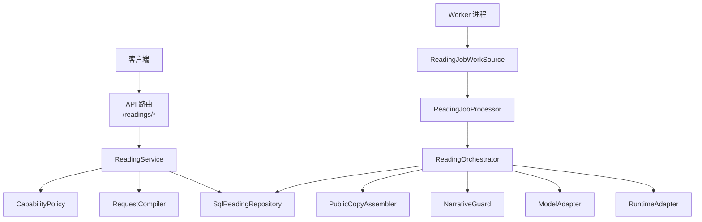
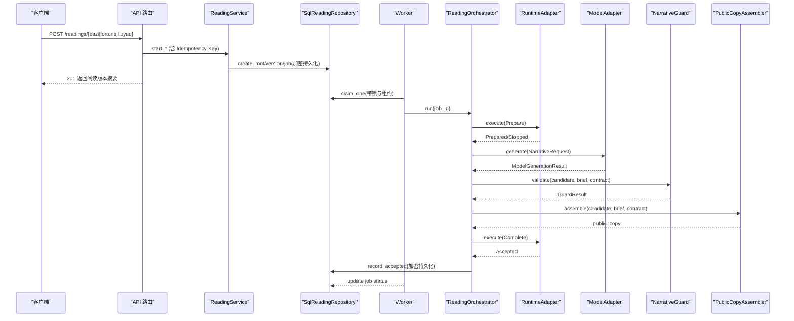
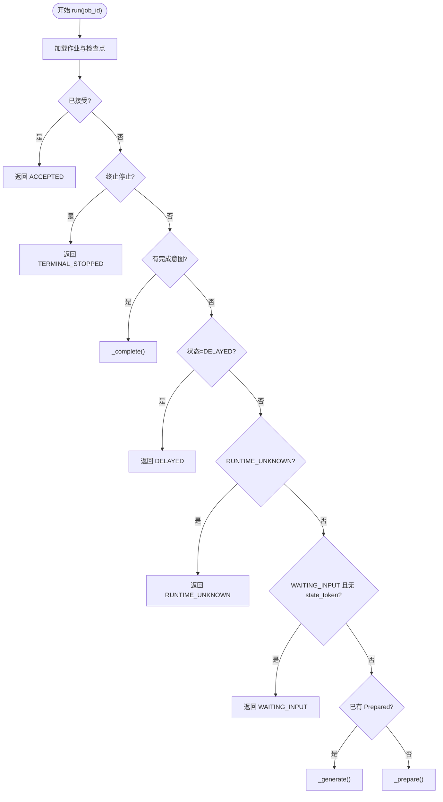
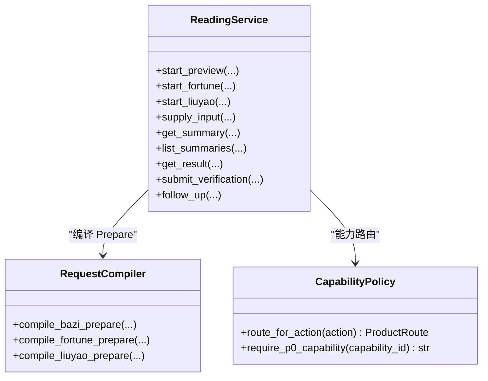
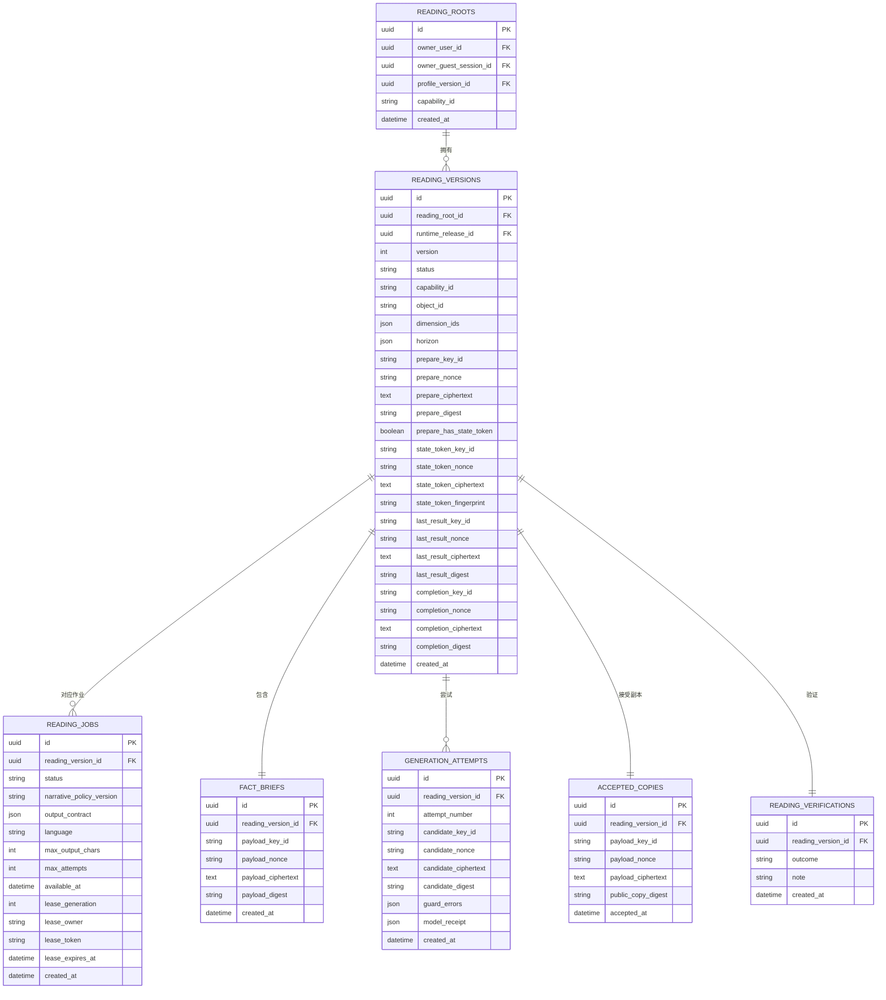
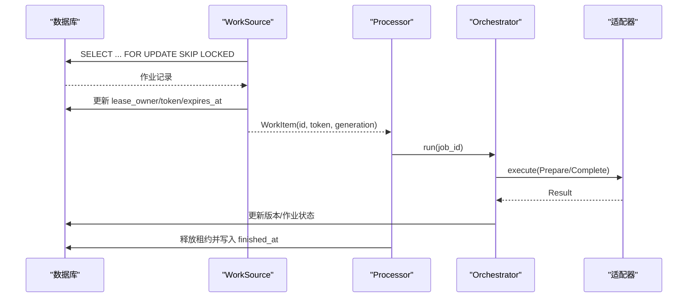
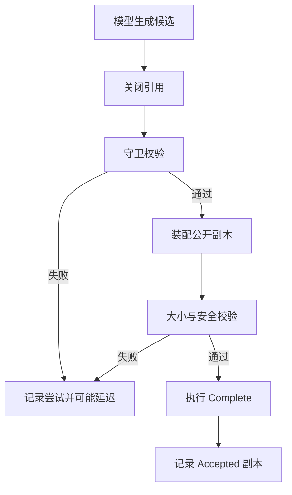
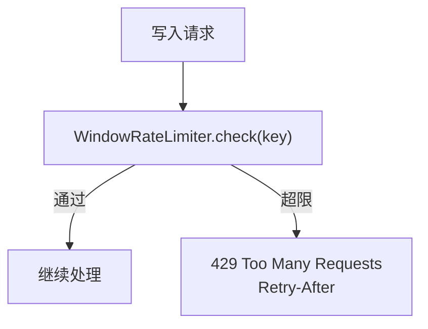
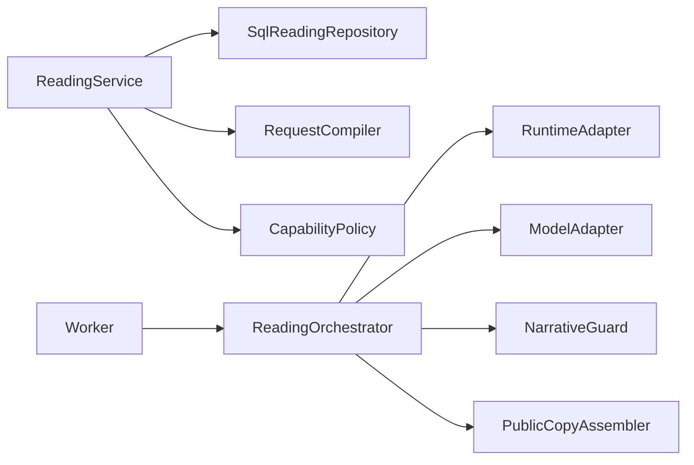

# 命理解读模块

<cite>
**本文引用的文件**
- [backend/app/readings/orchestrator.py](file://backend/app/readings/orchestrator.py)
- [backend/app/readings/service.py](file://backend/app/readings/service.py)
- [backend/app/readings/capability_policy.py](file://backend/app/readings/capability_policy.py)
- [backend/app/readings/rate_limit.py](file://backend/app/readings/rate_limit.py)
- [backend/worker/readings.py](file://backend/worker/readings.py)
- [backend/app/readings/models.py](file://backend/app/readings/models.py)
- [backend/app/readings/repository.py](file://backend/app/readings/repository.py)
- [backend/app/readings/status.py](file://backend/app/readings/status.py)
- [backend/app/api/readings.py](file://backend/app/api/readings.py)
- [backend/app/readings/request_compiler.py](file://backend/app/readings/request_compiler.py)
- [backend/app/readings/alerts.py](file://backend/app/readings/alerts.py)
- [backend/app/readings/narrative_guard.py](file://backend/app/readings/narrative_guard.py)
- [backend/app/readings/public_copy.py](file://backend/app/readings/public_copy.py)
- [backend/app/api/rate_guard.py](file://backend/app/api/rate_guard.py)
- [backend/app/adapters/runtime.py](file://backend/app/adapters/runtime.py)
</cite>

## 目录
1. [简介](#简介)
2. [项目结构](#项目结构)
3. [核心组件](#核心组件)
4. [架构总览](#架构总览)
5. [详细组件分析](#详细组件分析)
6. [依赖关系分析](#依赖关系分析)
7. [性能与缓存](#性能与缓存)
8. [故障排查指南](#故障排查指南)
9. [结论](#结论)
10. [附录：API使用示例与集成指南](#附录api使用示例与集成指南)

## 简介
本模块实现“命理解读”的完整业务流程，覆盖八字分析、运势预测与六爻占卜三类能力。系统通过服务层编排请求编译、持久化、任务调度与执行、结果生成与校验、以及最终结果的公开副本组装与提交；工作进程负责从数据库领取任务、驱动编排器运行、并回写状态。能力策略限制可对外暴露的能力集合，速率限制保护写入端点不被滥用。所有敏感数据（准备命令、事实简报、候选文本、接受副本等）均通过信封加密持久化，确保最小权限与可审计性。

## 项目结构
- API 层：FastAPI 路由接收请求，进行鉴权、限流、参数校验，调用服务层。
- 服务层：统一入口，负责创建阅读版本、编译 Prepare 命令、幂等键处理、输入补充、查询摘要与结果。
- 编排器：定义读取作业的状态机与流程控制，协调运行时、模型、守卫与公开副本装配。
- 工作进程：从数据库领取任务，加租约防并发，驱动编排器执行，更新作业与版本状态。
- 存储与模型：SQLAlchemy 模型定义版本、作业、尝试、接受副本、验证记录等，仓库封装加密读写。
- 能力策略与请求编译：将产品动作映射到能力、对象与时间范围，校验维度与输入。
- 安全与合规：输出守卫检查引用闭合、范围、确定性上限、禁止内部标识与具体承诺值；公开副本装配强制包含必要限制说明与披露文案。
- 告警：结构化告警事件用于异常与成本追踪。

**图表来源**
- [backend/app/api/readings.py:87-399](file://backend/app/api/readings.py#L87-L399)
- [backend/app/readings/service.py:117-513](file://backend/app/readings/service.py#L117-L513)
- [backend/worker/readings.py:108-286](file://backend/worker/readings.py#L108-L286)
- [backend/app/readings/orchestrator.py:178-450](file://backend/app/readings/orchestrator.py#L178-L450)
- [backend/app/adapters/runtime.py:605-756](file://backend/app/adapters/runtime.py#L605-L756)

**章节来源**
- [backend/app/api/readings.py:87-399](file://backend/app/api/readings.py#L87-L399)
- [backend/app/readings/service.py:117-513](file://backend/app/readings/service.py#L117-L513)
- [backend/worker/readings.py:108-286](file://backend/worker/readings.py#L108-L286)
- [backend/app/readings/orchestrator.py:178-450](file://backend/app/readings/orchestrator.py#L178-L450)

## 核心组件
- ReadingService：聚合请求编译、幂等键、版本创建、输入补充、结果查询与验证提交。
- SqlReadingRepository：封装所有持久化操作，包括加密存储与不可变记录约束。
- ReadingOrchestrator：定义作业生命周期，驱动 Prepare/Generate/Complete 三阶段，管理重试与延迟。
- Worker 与 JobSource/Processor：基于数据库锁与租约的任务领取与执行，保证单实例并发安全。
- CapabilityPolicy 与 RequestCompiler：产品动作到能力路由与 Prepare 命令构造，严格校验维度与输入。
- NarrativeGuard 与 PublicCopyAssembler：产出质量与合规性保障，防止泄露内部标识与越界断言。
- RateLimit + RateGuard：进程内滑动窗口限流，返回 Retry-After。
- Alerts：结构化告警事件，支持日志或测试记录。

**章节来源**
- [backend/app/readings/service.py:117-513](file://backend/app/readings/service.py#L117-L513)
- [backend/app/readings/repository.py:51-800](file://backend/app/readings/repository.py#L51-L800)
- [backend/app/readings/orchestrator.py:178-450](file://backend/app/readings/orchestrator.py#L178-L450)
- [backend/worker/readings.py:108-286](file://backend/worker/readings.py#L108-L286)
- [backend/app/readings/capability_policy.py:1-68](file://backend/app/readings/capability_policy.py#L1-L68)
- [backend/app/readings/request_compiler.py:96-216](file://backend/app/readings/request_compiler.py#L96-L216)
- [backend/app/readings/narrative_guard.py:70-191](file://backend/app/readings/narrative_guard.py#L70-L191)
- [backend/app/readings/public_copy.py:13-46](file://backend/app/readings/public_copy.py#L13-L46)
- [backend/app/readings/rate_limit.py:9-61](file://backend/app/readings/rate_limit.py#L9-L61)
- [backend/app/api/rate_guard.py:5-20](file://backend/app/api/rate_guard.py#L5-L20)
- [backend/app/readings/alerts.py:16-82](file://backend/app/readings/alerts.py#L16-L82)

## 架构总览
系统采用“服务+编排器+工作进程”的解耦设计：
- API 仅做鉴权、限流与参数校验，不执行业务主流程。
- 服务层负责领域逻辑与持久化，创建版本与作业，维护幂等键。
- 工作进程异步消费作业，编排器驱动外部运行时与模型，产出候选文本，经守卫与装配后完成提交。
- 所有关键中间态与结果均以加密形式落库，支持幂等重放与恢复。

**图表来源**
- [backend/app/api/readings.py:87-399](file://backend/app/api/readings.py#L87-L399)
- [backend/app/readings/service.py:129-513](file://backend/app/readings/service.py#L129-L513)
- [backend/worker/readings.py:121-218](file://backend/worker/readings.py#L121-L218)
- [backend/app/readings/orchestrator.py:212-435](file://backend/app/readings/orchestrator.py#L212-L435)
- [backend/app/adapters/runtime.py:605-756](file://backend/app/adapters/runtime.py#L605-L756)

## 详细组件分析

### 编排器与状态机
- 作业数据：ReadingJob 携带 Prepare 命令、叙事策略版本、输出契约、语言与最大输出长度，最多允许两次尝试。
- 检查点：ReadingCheckpoint 保存当前状态、等待输入、终止停止、已准备、尝试次数、完成意图与已接受副本。
- 流程：
  - _prepare：调用运行时执行 Prepare，若返回 Prepared 则记录并进入生成阶段；若 Stopped 且 need_input 则进入等待输入，否则终止。
  - _generate：构造 NarrativeRequest，调用模型生成，关闭候选引用，守卫校验，失败记录尝试并可能延迟；成功则装配公开副本并进入完成阶段。
  - _complete：以 Prepared 的 state_token 与持久化的 public_copy 执行 Complete，成功后记录 Accepted 并结束。
- 错误与恢复：
  - 运行时传输错误时根据是否带 state_token 决定标记为 RUNTIME_UNKNOWN 或重试。
  - 超过最大尝试次数标记 DELAYED 并告警。
  - 完成阶段传输错误会保持 COMPLETING 并重试，直到 Accepted。

**图表来源**
- [backend/app/readings/orchestrator.py:212-450](file://backend/app/readings/orchestrator.py#L212-L450)

**章节来源**
- [backend/app/readings/orchestrator.py:43-189](file://backend/app/readings/orchestrator.py#L43-L189)
- [backend/app/readings/orchestrator.py:212-450](file://backend/app/readings/orchestrator.py#L212-L450)

### 服务层与请求编译
- 能力路由：route_for_action 将产品动作映射到能力、对象与时间范围，并限制仅暴露 P0 能力。
- 请求编译：
  - 八字：compile_bazi_prepare 注入出生信息与时区、定位等事实。
  - 运势：compile_fortune_prepare 计算起止日期，注入参考时间与政策。
  - 六爻：compile_liuyao_prepare 校验掷币值或数字模式，规范化事件时间与地点。
- 幂等键：HMAC 签名 action 与规范化 JSON payload，持久化映射到阅读版本，重复请求直接回放。
- 输入补充：supply_input 校验 runtime 返回的 input_request，按策略映射并替换 facts，重新排队。

**图表来源**
- [backend/app/readings/service.py:117-513](file://backend/app/readings/service.py#L117-L513)
- [backend/app/readings/request_compiler.py:96-216](file://backend/app/readings/request_compiler.py#L96-L216)
- [backend/app/readings/capability_policy.py:31-68](file://backend/app/readings/capability_policy.py#L31-L68)

**章节来源**
- [backend/app/readings/service.py:117-513](file://backend/app/readings/service.py#L117-L513)
- [backend/app/readings/request_compiler.py:96-216](file://backend/app/readings/request_compiler.py#L96-L216)
- [backend/app/readings/capability_policy.py:1-68](file://backend/app/readings/capability_policy.py#L1-L68)

### 持久化与数据模型
- 版本与作业：ReadingVersion 与 ReadingJobRecord 分别承载命令与执行计划，状态机由 ReadingStatus 定义。
- 不可变记录：FactBrief、GenerationAttempt、AcceptedCopy 等追加只写，禁止更新。
- 加密存储：所有敏感字段通过 EnvelopeCipher 加密，key_id/nonce/ciphertext/digest 四元组持久化。
- 唯一性与约束：作业在同一版本上唯一活跃；幂等键与 owner 组合唯一；验证记录唯一。

**图表来源**
- [backend/app/readings/models.py:28-378](file://backend/app/readings/models.py#L28-L378)

**章节来源**
- [backend/app/readings/models.py:28-378](file://backend/app/readings/models.py#L28-L378)
- [backend/app/readings/repository.py:51-800](file://backend/app/readings/repository.py#L51-L800)
- [backend/app/readings/status.py:1-13](file://backend/app/readings/status.py#L1-L13)

### 异步任务处理与工作进程
- 任务领取：claim_one 使用 with_for_update(skip_locked=True) 获取待处理或过期租约的作业，设置租约所有者与过期时间。
- 任务处理：process 校验租约有效性，调用编排器执行，根据结果更新作业状态与可用时间；若需要取消则在事务外抛出 CancelledError。
- 工厂与构建：SqlReadingOrchestratorFactory 注入仓库、运行时、模型、守卫与告警；build_reading_worker 组装 Worker。

**图表来源**
- [backend/worker/readings.py:63-218](file://backend/worker/readings.py#L63-L218)
- [backend/app/readings/orchestrator.py:212-435](file://backend/app/readings/orchestrator.py#L212-L435)

**章节来源**
- [backend/worker/readings.py:63-218](file://backend/worker/readings.py#L63-L218)
- [backend/worker/readings.py:234-286](file://backend/worker/readings.py#L234-L286)

### 解读结果生成、验证与持久化
- 生成：模型生成候选文本，关闭引用后进入守卫校验。
- 验证：NarrativeGuard 检查块数量、长度、重复 ID、引用闭合、范围匹配、确定性上限、禁止内部标识与概率承诺、禁止虚构具体日期金额等。
- 装配：PublicCopyAssembler 收集必要限制说明与披露文案，拼接公开副本，再次校验大小与内容安全。
- 持久化：Successful attempt 记录候选与模型回执，完成意图持久化，Accepted 副本加密存储，版本状态转为 ACCEPTED。

**图表来源**
- [backend/app/readings/orchestrator.py:287-395](file://backend/app/readings/orchestrator.py#L287-L395)
- [backend/app/readings/narrative_guard.py:70-191](file://backend/app/readings/narrative_guard.py#L70-L191)
- [backend/app/readings/public_copy.py:13-46](file://backend/app/readings/public_copy.py#L13-L46)
- [backend/app/readings/repository.py:637-716](file://backend/app/readings/repository.py#L637-L716)

**章节来源**
- [backend/app/readings/orchestrator.py:287-395](file://backend/app/readings/orchestrator.py#L287-L395)
- [backend/app/readings/narrative_guard.py:70-191](file://backend/app/readings/narrative_guard.py#L70-L191)
- [backend/app/readings/public_copy.py:13-46](file://backend/app/readings/public_copy.py#L13-L46)
- [backend/app/readings/repository.py:637-716](file://backend/app/readings/repository.py#L637-L716)

### 能力策略与速率限制
- 能力策略：P0 暴露能力限定为 bazi、fortune、liuyao；其他能力即使安装也不对外暴露。
- 速率限制：WindowRateLimiter 基于滑动窗口与 deque 统计命中，超限返回 Retry-After；API 层通过 rate_guard 包装为 429 响应。

**图表来源**
- [backend/app/readings/rate_limit.py:9-61](file://backend/app/readings/rate_limit.py#L9-L61)
- [backend/app/api/rate_guard.py:5-20](file://backend/app/api/rate_guard.py#L5-L20)
- [backend/app/readings/capability_policy.py:20-68](file://backend/app/readings/capability_policy.py#L20-L68)

**章节来源**
- [backend/app/readings/rate_limit.py:9-61](file://backend/app/readings/rate_limit.py#L9-L61)
- [backend/app/api/rate_guard.py:5-20](file://backend/app/api/rate_guard.py#L5-L20)
- [backend/app/readings/capability_policy.py:1-68](file://backend/app/readings/capability_policy.py#L1-L68)

### 状态流转与通知机制
- 状态枚举：INPUT_READY、WAITING_INPUT、TERMINAL_STOPPED、PREPARED、COMPLETING、ACCEPTED、DELAYED、RUNTIME_UNKNOWN。
- 流转规则：
  - Prepare 成功 -> PREPARED；需要输入 -> WAITING_INPUT；终止 -> TERMINAL_STOPPED。
  - Generate 成功 -> COMPLETING；失败且未达上限 -> PREPARED 重试；达到上限 -> DELAYED。
  - Complete 成功 -> ACCEPTED；失败 -> COMPLETING 重试；终止 -> TERMINAL_STOPPED。
- 通知：AlertSink 在关键节点发出告警（如 delayed、guard_rejection、model_cost、runtime_unknown），便于监控与排障。

**章节来源**
- [backend/app/readings/status.py:1-13](file://backend/app/readings/status.py#L1-L13)
- [backend/app/readings/orchestrator.py:212-450](file://backend/app/readings/orchestrator.py#L212-L450)
- [backend/app/readings/alerts.py:16-82](file://backend/app/readings/alerts.py#L16-L82)

## 依赖关系分析
- 耦合度：
  - 服务层依赖仓库、能力策略与请求编译，低耦合于运行时与模型。
  - 编排器通过 Protocol 抽象运行时、模型、守卫与装配器，便于替换与测试。
  - 工作进程通过工厂注入依赖，避免硬编码。
- 外部依赖：
  - 运行时适配器支持 one-shot 进程与 Fake；生产环境要求真实运行时与模型适配器。
  - 数据库使用 SQLAlchemy 异步会话，配合索引与约束保证一致性。

**图表来源**
- [backend/app/readings/service.py:117-513](file://backend/app/readings/service.py#L117-L513)
- [backend/worker/readings.py:234-286](file://backend/worker/readings.py#L234-L286)
- [backend/app/readings/orchestrator.py:178-450](file://backend/app/readings/orchestrator.py#L178-L450)

**章节来源**
- [backend/app/readings/service.py:117-513](file://backend/app/readings/service.py#L117-L513)
- [backend/worker/readings.py:234-286](file://backend/worker/readings.py#L234-L286)
- [backend/app/readings/orchestrator.py:178-450](file://backend/app/readings/orchestrator.py#L178-L450)

## 性能与缓存
- 数据库层面：
  - 作业表索引优化 claim 查询；活跃作业唯一约束避免重复处理。
  - 版本与作业状态变更集中，减少热点竞争。
- 内存与队列：
  - 速率限制使用进程内 deque，适合单机限流；多实例需结合分布式方案。
- 运行时与模型：
  - 运行时适配器对 stdout/stderr 限制大小，超时保护；模型调用失败记录 receipt 以便成本与问题追踪。
- 缓存策略：
  - 当前实现未引入应用级缓存；可通过 Redis 缓存热点事实简报或结果摘要以提升读取性能。
- 监控：
  - 告警事件记录 delayed、guard_rejection、model_cost、runtime_unknown，可用于性能与健康监控。

[本节提供通用指导，无需特定文件来源]

## 故障排查指南
- 常见错误与定位：
  - 运行时未知：Prepare 无 state_token 且传输失败，标记 RUNTIME_UNKNOWN，检查运行时启动与路径配置。
  - 输入缺失：WAITING_INPUT 且无 state_token，检查前端是否正确回填 input_request。
  - 生成失败：多次尝试仍失败，查看 GenerationAttempt 的 guard_errors 与 model_receipt。
  - 容量超限：public_copy 超出契约限制，调整输出策略或限制尺寸。
  - 速率限制：429 响应，降低请求频率或扩容 Worker。
- 日志与告警：
  - 启用 LoggingAlertSink，观察 structured logs 中的 event、kind、details。
  - 关注 model_cost 告警，核对 provider、model_profile_id 与 outcome。
- 恢复步骤：
  - 对于 COMPLETING 状态，系统会自动重试；若长时间停滞，检查 Complete 传输与 Accepted 一致性。
  - 对于 DELAYED 状态，检查 max_attempts 与重试间隔，必要时人工干预。

**章节来源**
- [backend/app/readings/orchestrator.py:250-435](file://backend/app/readings/orchestrator.py#L250-L435)
- [backend/app/readings/repository.py:556-730](file://backend/app/readings/repository.py#L556-L730)
- [backend/app/readings/alerts.py:48-82](file://backend/app/readings/alerts.py#L48-L82)

## 结论
本模块通过清晰的分层与协议化接口，实现了命理解读的可靠、可恢复与可审计流程。编排器定义了健壮的状态机，工作进程保证了并发安全，仓库层确保了数据安全与一致性，守卫与装配器保障了输出质量与合规性。能力策略与速率限制提供了访问控制与保护，告警机制支撑了运维监控。整体设计兼顾可扩展性与安全性，适用于生产环境部署。

[本节总结性内容，无需特定文件来源]

## 附录：API使用示例与集成指南
- 创建八字预览：
  - 方法：POST /readings/preview
  - 头部：Idempotency-Key（可选）
  - 主体：profile_version_id、query、dimension_ids
  - 行为：创建阅读版本与作业，返回版本摘要；幂等键重复请求回放。
- 创建今日运势：
  - 方法：POST /readings/today
  - 主体：profile_version_id、query
- 创建一周运势：
  - 方法：POST /readings/week
  - 主体：profile_version_id、query
- 创建六爻占卜：
  - 方法：POST /readings/liuyao
  - 主体：cast（数组或 digital_coin）、event_datetime、timezone、location、subject_ref、query、dimension_ids
- 补充输入：
  - 方法：POST /readings/{version}/input
  - 主体：values（按 runtime 返回的 input_request 要求）
- 查询结果：
  - 方法：GET /readings/{version}/result
  - 返回：status、accepted_copy、fact_panel、verification、input_request
- 提交验证：
  - 方法：POST /readings/{version}/verification
  - 主体：outcome、note
- 后续追问：
  - 方法：POST /readings/{version}/follow-up
  - 主体：query（可选），继承 prior_answer

集成要点：
- 鉴权：使用 require_owner_csrf 保护写入端点。
- 限流：每个 owner 写入端点受 WindowRateLimiter 保护，超限返回 429 与 Retry-After。
- 幂等：建议为所有写入请求提供 Idempotency-Key，避免重复提交。
- 错误处理：捕获 ApiProblem 并展示友好提示；关注 409 冲突与 503 运行时不可用。

**章节来源**
- [backend/app/api/readings.py:87-399](file://backend/app/api/readings.py#L87-L399)
- [backend/app/readings/service.py:129-513](file://backend/app/readings/service.py#L129-L513)
- [backend/app/api/rate_guard.py:5-20](file://backend/app/api/rate_guard.py#L5-L20)