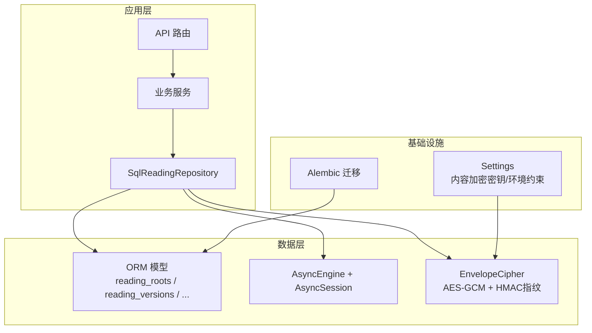
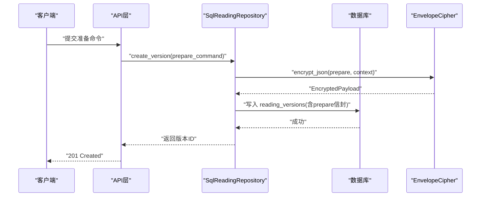
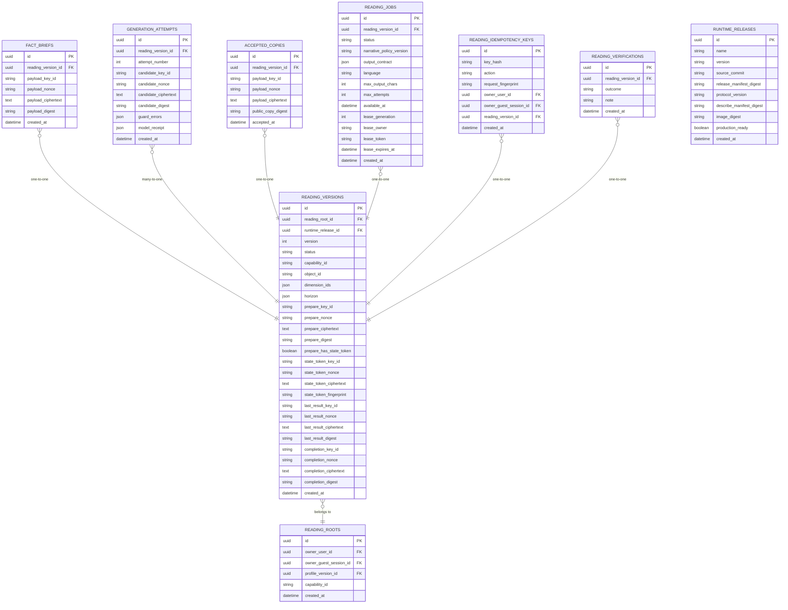
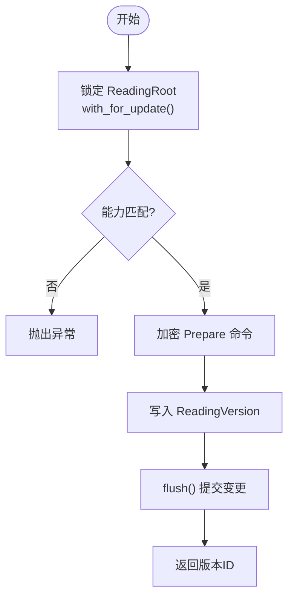
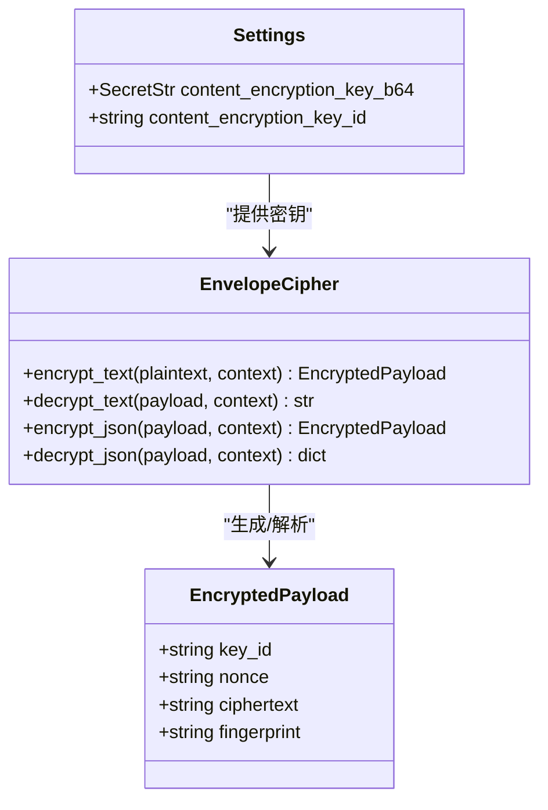
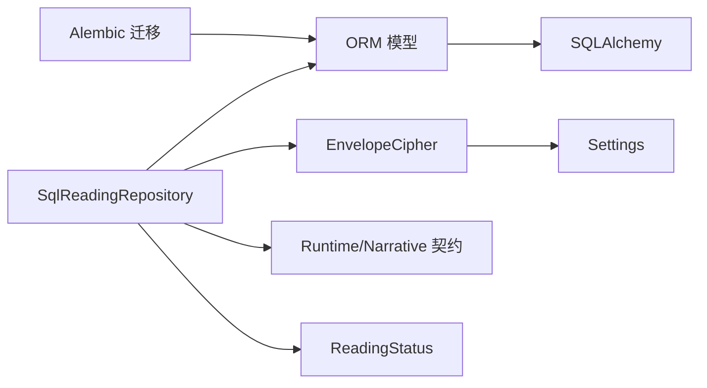

# 数据模型与存储

<cite>
**本文引用的文件**
- [backend/app/readings/models.py](file://backend/app/readings/models.py)
- [backend/app/readings/repository.py](file://backend/app/readings/repository.py)
- [backend/app/security/envelope.py](file://backend/app/security/envelope.py)
- [backend/app/database.py](file://backend/app/database.py)
- [backend/app/persistence.py](file://backend/app/persistence.py)
- [backend/app/readings/status.py](file://backend/app/readings/status.py)
- [backend/app/readings/runtime_contracts.py](file://backend/app/readings/runtime_contracts.py)
- [backend/app/readings/narrative_contracts.py](file://backend/app/readings/narrative_contracts.py)
- [backend/alembic/versions/0002_profiles_and_readings.py](file://backend/alembic/versions/0002_profiles_and_readings.py)
- [backend/alembic/versions/0003_reading_integrity_constraints.py](file://backend/alembic/versions/0003_reading_integrity_constraints.py)
- [backend/app/config.py](file://backend/app/config.py)
</cite>

## 目录
1. [简介](#简介)
2. [项目结构](#项目结构)
3. [核心组件](#核心组件)
4. [架构总览](#架构总览)
5. [详细组件分析](#详细组件分析)
6. [依赖关系分析](#依赖关系分析)
7. [性能考虑](#性能考虑)
8. [故障排查指南](#故障排查指南)
9. [结论](#结论)
10. [附录：使用示例与最佳实践](#附录使用示例与最佳实践)

## 简介
本文件聚焦命理解读（Reading）领域的数据模型与持久化设计，围绕 ReadingRoot、ReadingVersion 等核心实体展开，系统阐述字段定义、约束校验、仓储层抽象、加密与密钥管理、迁移策略、版本兼容性与性能优化。目标是帮助读者在不深入代码细节的情况下，掌握数据模型的职责边界、流转过程与安全保障机制。

## 项目结构
后端采用模块化组织，读取相关的数据模型集中在 readings 模块，数据库连接与会话由 database 模块提供，安全加密在 security 模块实现，配置集中管理于 config 模块，迁移脚本位于 alembic/versions。

图表来源
- [backend/app/readings/repository.py:51-167](file://backend/app/readings/repository.py#L51-L167)
- [backend/app/readings/models.py:53-159](file://backend/app/readings/models.py#L53-L159)
- [backend/app/security/envelope.py:32-122](file://backend/app/security/envelope.py#L32-L122)
- [backend/app/database.py:12-33](file://backend/app/database.py#L12-L33)
- [backend/app/config.py:62-126](file://backend/app/config.py#L62-L126)
- [backend/alembic/versions/0002_profiles_and_readings.py:28-288](file://backend/alembic/versions/0002_profiles_and_readings.py#L28-L288)

章节来源
- [backend/app/readings/models.py:53-159](file://backend/app/readings/models.py#L53-L159)
- [backend/app/readings/repository.py:51-167](file://backend/app/readings/repository.py#L51-L167)
- [backend/app/security/envelope.py:32-122](file://backend/app/security/envelope.py#L32-L122)
- [backend/app/database.py:12-33](file://backend/app/database.py#L12-L33)
- [backend/app/config.py:62-126](file://backend/app/config.py#L62-L126)
- [backend/alembic/versions/0002_profiles_and_readings.py:28-288](file://backend/alembic/versions/0002_profiles_and_readings.py#L28-L288)

## 核心组件
- 数据模型（ORM）：定义 reading_roots、reading_versions、fact_briefs、generation_attempts、accepted_copies、reading_jobs、reading_idempotency_keys、reading_verifications、runtime_releases 等表结构与约束。
- 仓储层：SqlReadingRepository 封装所有读写操作，负责加解密、状态机推进、幂等键、作业调度与检查点恢复。
- 加密信封：EnvelopeCipher 基于 AES-256-GCM 与域分离上下文，提供文本与 JSON 的加解密及指纹校验。
- 数据库访问：Database 提供异步引擎与会话工厂，支持健康探测与资源释放。
- 配置与安全：Settings 强制生产环境安全策略，注入内容加密密钥并校验长度与来源。
- 迁移：Alembic 脚本逐步创建表、索引与约束，确保演进可回滚。

章节来源
- [backend/app/readings/models.py:28-378](file://backend/app/readings/models.py#L28-L378)
- [backend/app/readings/repository.py:51-800](file://backend/app/readings/repository.py#L51-L800)
- [backend/app/security/envelope.py:32-122](file://backend/app/security/envelope.py#L32-L122)
- [backend/app/database.py:12-33](file://backend/app/database.py#L12-L33)
- [backend/app/config.py:62-126](file://backend/app/config.py#L62-L126)
- [backend/alembic/versions/0002_profiles_and_readings.py:28-288](file://backend/alembic/versions/0002_profiles_and_readings.py#L28-L288)

## 架构总览
读取生命周期从“准备”到“完成”，期间涉及输入准备、事实摘要、候选生成、用户接受等阶段。仓储层通过 ORM 与加密器协作，将敏感数据以信封形式落库，并通过状态枚举驱动流程推进。

图表来源
- [backend/app/readings/repository.py:120-167](file://backend/app/readings/repository.py#L120-L167)
- [backend/app/security/envelope.py:98-122](file://backend/app/security/envelope.py#L98-L122)
- [backend/app/readings/models.py:84-159](file://backend/app/readings/models.py#L84-L159)

## 详细组件分析

### 数据模型与约束
- ReadingRoot：代表一次命理解读的根，拥有唯一所有者（用户或访客会话之一），关联能力标识与可选的用户画像版本。
- ReadingVersion：版本化且不可变的核心记录，包含运行时发布版本、能力、对象、维度、时间范围、以及多组信封字段（prepare、state_token、last_result、completion）。通过数据库 CHECK 约束保证信封字段的“全有或全无”一致性。
- FactBrief：保存已准备的“事实摘要”，仅允许追加，禁止修改。
- GenerationAttempt：每次候选生成的尝试记录，包含候选信封、守卫错误列表与模型调用回执。
- AcceptedCopy：用户最终接受的公开副本，仅允许首次写入，后续写入需一致。
- ReadingJobRecord：作业队列记录，支持租约（lease）与可用性时间，用于工作进程拉取与执行。
- ReadingIdempotencyKey：按所有者与作用域的唯一幂等键，防止重复请求产生重复结果。
- ReadingVerification：用户反馈（接受/部分同意/不同意/未知），独立于模型与运行时的命令路径。
- RuntimeRelease：运行时发布元数据，标记生产可用。

图表来源
- [backend/app/readings/models.py:28-378](file://backend/app/readings/models.py#L28-L378)
- [backend/alembic/versions/0002_profiles_and_readings.py:28-288](file://backend/alembic/versions/0002_profiles_and_readings.py#L28-L288)
- [backend/alembic/versions/0003_reading_integrity_constraints.py:47-87](file://backend/alembic/versions/0003_reading_integrity_constraints.py#L47-L87)

章节来源
- [backend/app/readings/models.py:53-378](file://backend/app/readings/models.py#L53-L378)
- [backend/alembic/versions/0003_reading_integrity_constraints.py:17-44](file://backend/alembic/versions/0003_reading_integrity_constraints.py#L17-L44)

### 数据验证规则与完整性保证
- 所有者唯一性：ReadingRoot 与 IdempotencyKey 强制 owner_user_id 与 owner_guest_session_id 二者有且仅有一个非空，避免归属歧义。
- 信封一致性：state_token、last_result、completion、candidate 等字段组必须“全空或全满”，由数据库 CHECK 约束保障。
- 不可变性：FactBrief、GenerationAttempt、AcceptedCopy、RuntimeRelease 在插入后禁止更新，通过 SQLAlchemy 事件监听抛出 ImmutableRecordError。
- 幂等性：IdempotencyKey 联合 key_hash 与所有者唯一，配合仓储层的 save/find 逻辑防止重复写入。
- 契约校验：Prepare/Complete/Describe 等命令与结果均通过 JSON Schema 校验，确保跨边界数据格式稳定。

章节来源
- [backend/app/readings/models.py:53-114](file://backend/app/readings/models.py#L53-L114)
- [backend/app/readings/models.py:188-245](file://backend/app/readings/models.py#L188-L245)
- [backend/app/readings/models.py:294-337](file://backend/app/readings/models.py#L294-L337)
- [backend/app/readings/models.py:370-378](file://backend/app/readings/models.py#L370-L378)
- [backend/app/readings/runtime_contracts.py:27-40](file://backend/app/readings/runtime_contracts.py#L27-L40)
- [backend/app/readings/runtime_contracts.py:113-155](file://backend/app/readings/runtime_contracts.py#L113-L155)

### 仓储层设计与事务管理
- 抽象与职责：SqlReadingRepository 统一封装对 reading_* 表的读写，屏蔽加解密、状态转换与并发控制细节。
- 查询构建：使用 SQLAlchemy Select 组合条件、排序与限制；通过 with_for_update 锁定 root 以避免版本分配竞争。
- 事务管理：使用 session.begin_nested 进行嵌套事务，结合 IntegrityError 捕获处理冲突；flush 控制写时机，refresh 获取最新状态。
- 状态机：ReadingStatus 枚举驱动版本状态流转，仓储方法如 record_prepared、record_successful_attempt、record_accepted 等推进状态。
- 作业调度：ReadingJobRecord 支持 queued/claimed/running/stopped/delayed 等状态，配合索引 ix_reading_jobs_claim 与 uq_reading_jobs_active_version 提升并发拉取效率。

图表来源
- [backend/app/readings/repository.py:83-167](file://backend/app/readings/repository.py#L83-L167)
- [backend/app/readings/status.py:4-12](file://backend/app/readings/status.py#L4-L12)

章节来源
- [backend/app/readings/repository.py:44-167](file://backend/app/readings/repository.py#L44-L167)
- [backend/app/readings/repository.py:556-730](file://backend/app/readings/repository.py#L556-L730)
- [backend/app/readings/status.py:4-12](file://backend/app/readings/status.py#L4-L12)

### 数据加密与敏感信息保护
- 算法与模式：EnvelopeCipher 使用 AES-256-GCM 对称加密，nonce 随机生成，AAD 使用 domain-separated context 隔离不同用途的密文。
- 指纹校验：对明文与上下文计算 HMAC-SHA256 指纹，解密时比对，防止篡改与重放。
- 密钥管理：密钥通过 Settings.content_encryption_key_b64 注入，要求 base64 解码为恰好 32 字节；生产环境禁止本地默认密钥与弱 ID。
- 存储形态：JSON 与文本分别通过 encrypt_json/encrypt_text 序列化与加密，密文与 nonce、key_id、fingerprint 一起存入对应字段。
- 上下文隔离：每个实体与用途使用唯一 context，例如 "reading-version:{version_id}:prepare"，避免跨上下文重用 nonce。

图表来源
- [backend/app/security/envelope.py:24-122](file://backend/app/security/envelope.py#L24-L122)
- [backend/app/config.py:124-126](file://backend/app/config.py#L124-L126)

章节来源
- [backend/app/security/envelope.py:32-122](file://backend/app/security/envelope.py#L32-L122)
- [backend/app/config.py:188-237](file://backend/app/config.py#L188-L237)

### 数据迁移策略与版本兼容性
- 初始建表：0002 创建 subject_profiles、profile_versions、runtime_releases、reading_roots、reading_versions、fact_briefs、generation_attempts、accepted_copies、reading_jobs，并建立必要索引。
- 完整性增强：0003 引入 owner 唯一性与信封“全有或全无”的 CHECK 约束，强化数据一致性。
- 演进原则：新增字段与约束通过迁移脚本声明式添加，保持向后兼容；模型层通过 SQLAlchemy 映射与事件监听补充行为。
- 回滚策略：每个迁移定义 downgrade，支持降级与修复。

章节来源
- [backend/alembic/versions/0002_profiles_and_readings.py:28-288](file://backend/alembic/versions/0002_profiles_and_readings.py#L28-L288)
- [backend/alembic/versions/0003_reading_integrity_constraints.py:47-87](file://backend/alembic/versions/0003_reading_integrity_constraints.py#L47-L87)

### 性能优化技巧
- 索引设计：
  - uq_reading_jobs_active_version：在活跃状态下对 reading_version_id 唯一，避免同一版本多个作业并行。
  - ix_reading_jobs_claim：按 (status, available_at) 加速作业拉取。
  - ix_reading_idempotency_keys_reading_version_id：加速按版本查找幂等键。
- 查询优化：
  - 使用 select(func.max(...)) 获取最新版本号，减少应用层计算。
  - 使用 with_for_update 锁定关键行，避免竞态条件。
  - 限制历史查询数量（READING_HISTORY_LIMIT=50），避免大结果集。
- 缓存策略：
  - 命令/结果校验器使用 lru_cache 缓存 JSON Schema 验证器实例，降低启动开销。
- 批量与事务：
  - 使用 session.flush 控制写时机，结合 begin_nested 提高事务粒度控制。

章节来源
- [backend/app/readings/models.py:247-291](file://backend/app/readings/models.py#L247-L291)
- [backend/app/readings/models.py:294-337](file://backend/app/readings/models.py#L294-L337)
- [backend/app/readings/repository.py:120-167](file://backend/app/readings/repository.py#L120-L167)
- [backend/app/readings/runtime_contracts.py:27-31](file://backend/app/readings/runtime_contracts.py#L27-L31)

## 依赖关系分析
- 模型依赖：ReadingVersion 依赖 RuntimeRelease、ReadingRoot；其他实体大多依赖 ReadingVersion。
- 仓储依赖：SqlReadingRepository 依赖 models、security.envelope、profiles.models、readings.runtime_contracts、readings.narrative_contracts、readings.status。
- 配置依赖：Settings 提供加密密钥与环境安全策略，被 EnvelopeCipher 与运行时适配器使用。
- 迁移依赖：Alembic 脚本顺序演进，确保表结构与约束逐步完善。

图表来源
- [backend/app/readings/repository.py:16-39](file://backend/app/readings/repository.py#L16-L39)
- [backend/app/readings/models.py:5-25](file://backend/app/readings/models.py#L5-L25)
- [backend/app/security/envelope.py:32-55](file://backend/app/security/envelope.py#L32-L55)
- [backend/app/config.py:62-126](file://backend/app/config.py#L62-L126)

章节来源
- [backend/app/readings/repository.py:16-39](file://backend/app/readings/repository.py#L16-L39)
- [backend/app/readings/models.py:5-25](file://backend/app/readings/models.py#L5-L25)
- [backend/app/security/envelope.py:32-55](file://backend/app/security/envelope.py#L32-L55)
- [backend/app/config.py:62-126](file://backend/app/config.py#L62-L126)

## 性能考虑
- 并发安全：通过 with_for_update 锁定 root 与版本行，避免版本分配与状态更新的竞态。
- 作业调度：利用索引与条件唯一索引，确保每个版本在同一时刻只有一个活跃作业。
- 数据体积控制：限制历史查询数量，避免大结果集拖慢接口响应。
- 校验器缓存：lru_cache 缓存 JSON Schema 验证器，减少重复加载成本。
- 加密开销：合理拆分上下文，避免不必要的大对象加密；必要时分片或压缩。

[本节为通用指导，不直接分析具体文件]

## 故障排查指南
- 不可变记录错误：当尝试更新 FactBrief、GenerationAttempt、AcceptedCopy、RuntimeRelease 时会抛出 ImmutableRecordError，检查是否误用更新接口。
- 契约校验失败：Prepare/Complete/Describe 等命令或结果不符合 JSON Schema，查看 schema 路径定位问题。
- 解密失败：EnvelopeDecryptionError 可能由 key_id 不匹配、context 错误或密文损坏引起，核对上下文与密钥配置。
- 幂等冲突：IntegrityError 表明重复幂等键写入，确认上游是否重试且未正确携带幂等键。
- 作业锁冲突：uq_reading_jobs_active_version 唯一约束触发，说明同一版本存在多个活跃作业，检查工作进程去重逻辑。

章节来源
- [backend/app/persistence.py:1-3](file://backend/app/persistence.py#L1-L3)
- [backend/app/readings/runtime_contracts.py:23-40](file://backend/app/readings/runtime_contracts.py#L23-L40)
- [backend/app/security/envelope.py:20-22](file://backend/app/security/envelope.py#L20-L22)
- [backend/app/readings/repository.py:394-403](file://backend/app/readings/repository.py#L394-L403)
- [backend/app/readings/models.py:247-264](file://backend/app/readings/models.py#L247-L264)

## 结论
该数据模型以“版本化+不可变”为核心，结合数据库级约束与仓储层的状态机推进，实现了高内聚、低耦合的命理解读流程。通过信封加密与严格的环境配置，保障了敏感数据的安全与合规。迁移脚本与索引设计确保了演进的稳健性与性能的可预期性。建议在生产环境中严格遵循配置约束，持续监控作业并发与解密错误率，并根据负载调整索引与查询策略。

[本节为总结性内容，不直接分析具体文件]

## 附录：使用示例与最佳实践
- 创建解读根与版本：
  - 先创建 ReadingRoot，再调用 create_version 传入 Prepare 命令，仓储会加密并持久化。
  - 参考路径：[backend/app/readings/repository.py:83-167](file://backend/app/readings/repository.py#L83-L167)
- 恢复检查点：
  - 使用 load_checkpoint 重建 Prepared/Stopped/Accepted 状态，便于中断恢复。
  - 参考路径：[backend/app/readings/repository.py:472-554](file://backend/app/readings/repository.py#L472-L554)
- 作业拉取与执行：
  - 通过 ReadingJobRecord 的状态与索引选择待处理作业，执行后记录尝试与结果。
  - 参考路径：[backend/app/readings/repository.py:200-224](file://backend/app/readings/repository.py#L200-L224)
- 幂等写入：
  - 先 find_idempotency 检查是否存在，不存在则 save_idempotency 并继续业务逻辑。
  - 参考路径：[backend/app/readings/repository.py:406-446](file://backend/app/readings/repository.py#L406-L446)
- 加密配置：
  - 设置 MINGLI_CONTENT_ENCRYPTION_KEY_B64 与 MINGLI_CONTENT_ENCRYPTION_KEY_ID，生产环境禁止本地默认值。
  - 参考路径：[backend/app/config.py:124-126](file://backend/app/config.py#L124-L126)

[本节为使用指引，不直接分析具体文件]