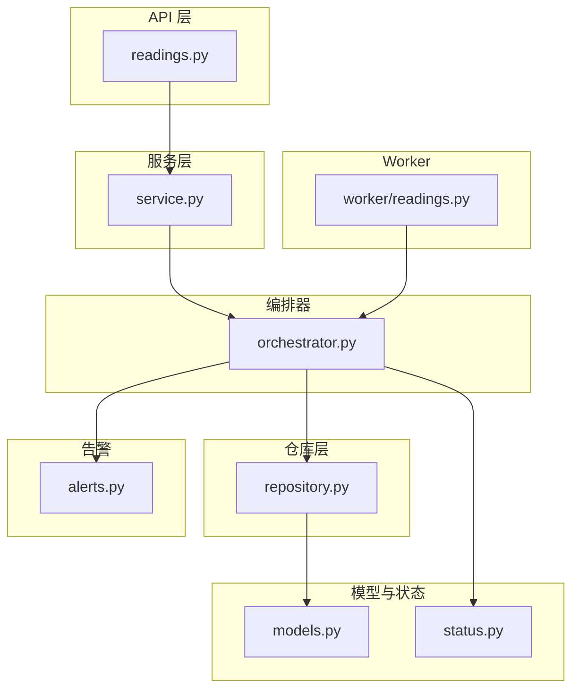
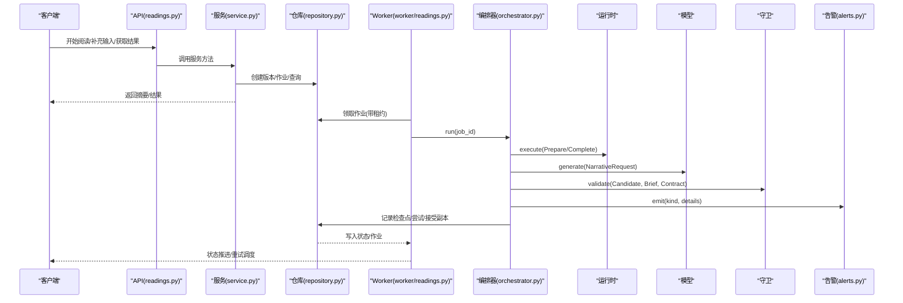
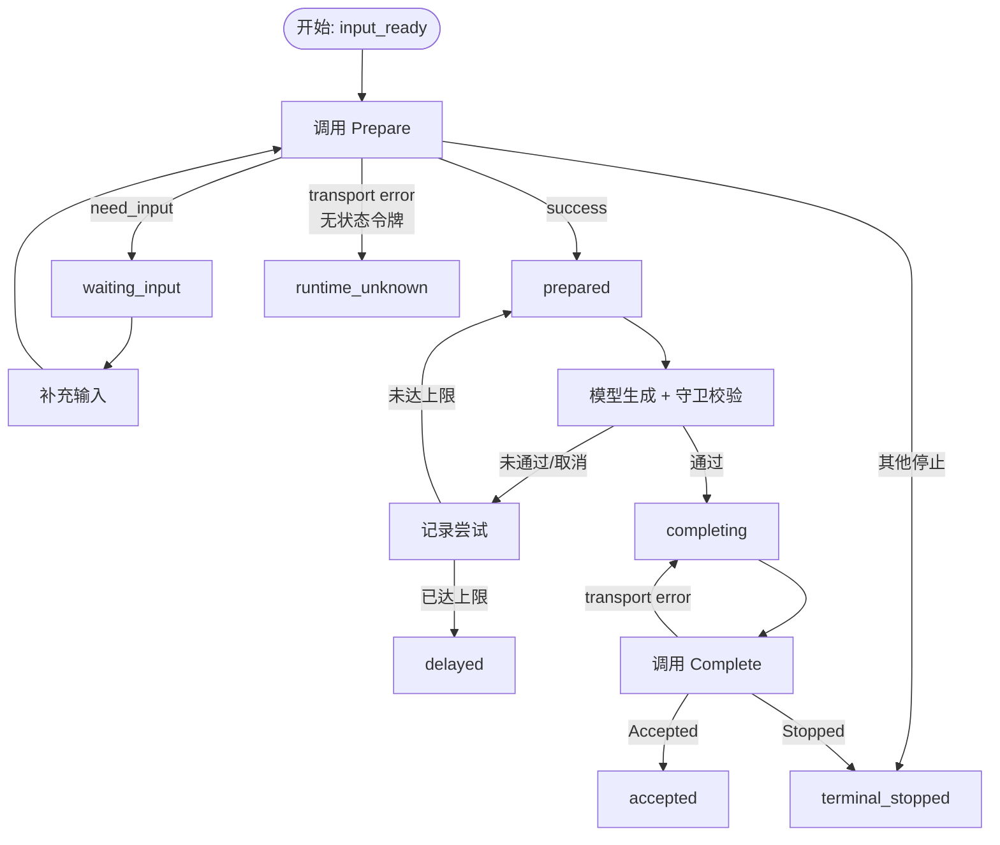
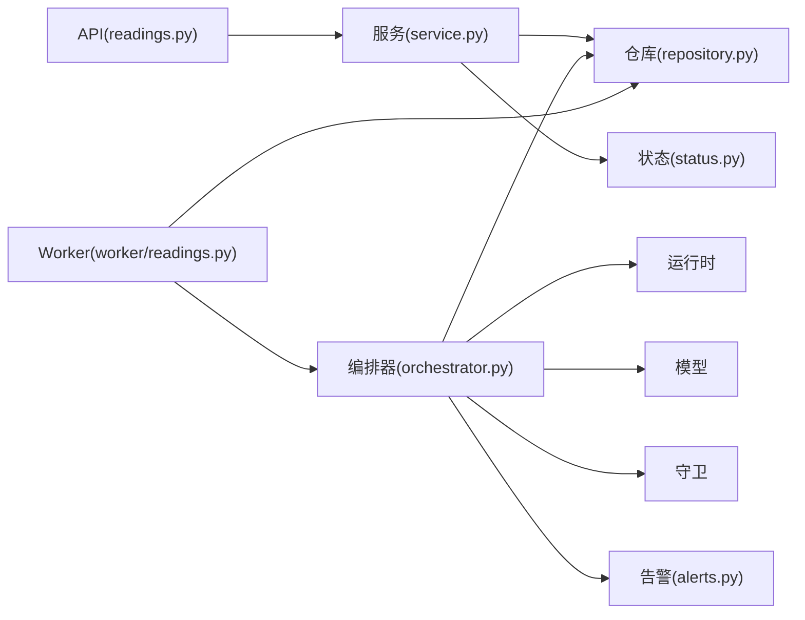
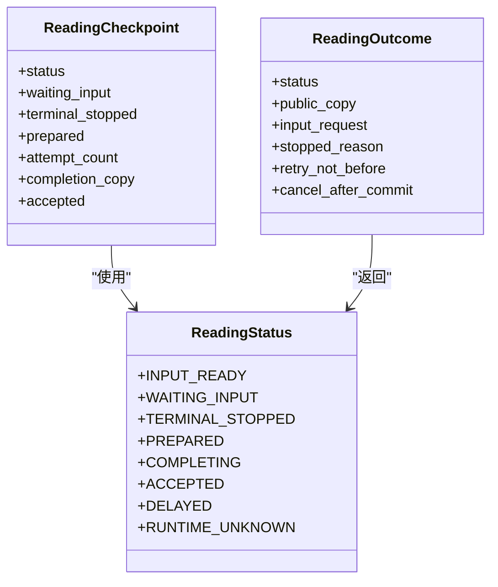
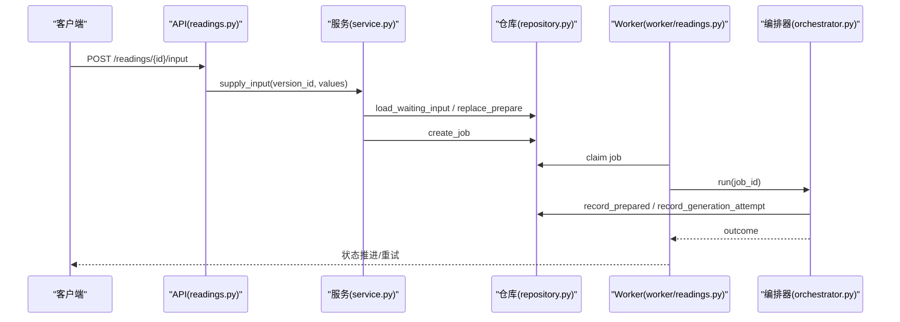

# 解读状态管理

<cite>
**本文引用的文件**
- [backend/app/readings/status.py](file://backend/app/readings/status.py)
- [backend/app/readings/models.py](file://backend/app/readings/models.py)
- [backend/app/readings/orchestrator.py](file://backend/app/readings/orchestrator.py)
- [backend/app/readings/alerts.py](file://backend/app/readings/alerts.py)
- [backend/app/readings/repository.py](file://backend/app/readings/repository.py)
- [backend/app/readings/service.py](file://backend/app/readings/service.py)
- [backend/app/api/readings.py](file://backend/app/api/readings.py)
- [backend/worker/readings.py](file://backend/worker/readings.py)
- [backend/app/readings/errors.py](file://backend/app/readings/errors.py)
</cite>

## 目录
1. [简介](#简介)
2. [项目结构](#项目结构)
3. [核心组件](#核心组件)
4. [架构总览](#架构总览)
5. [详细组件分析](#详细组件分析)
6. [依赖关系分析](#依赖关系分析)
7. [性能与索引优化](#性能与索引优化)
8. [故障排查指南](#故障排查指南)
9. [结论](#结论)
10. [附录：状态机与查询能力](#附录：状态机与查询能力)

## 简介
本文件系统性解读“解读”（Reading）在系统中的状态管理方案，覆盖完整生命周期、状态机设计、告警机制、持久化策略、查询过滤以及监控审计。目标是帮助开发者与运维人员准确理解从“等待输入”到“已完成/失败/延迟/运行时未知”等状态的转换规则与约束，并掌握如何基于现有接口进行检索与排障。

## 项目结构
围绕解读状态管理的代码主要分布在后端模块中：
- 状态枚举定义：status.py
- 数据模型与约束：models.py
- 编排器（状态机核心）：orchestrator.py
- 告警抽象与实现：alerts.py
- 仓库层（持久化与查询）：repository.py
- 服务层（API 业务入口）：service.py
- API 路由与错误映射：api/readings.py
- Worker 工作进程（任务领取、租约、重试调度）：worker/readings.py
- 异常类型定义：errors.py

**图表来源**
- [backend/app/api/readings.py:1-399](file://backend/app/api/readings.py#L1-L399)
- [backend/app/readings/service.py:1-819](file://backend/app/readings/service.py#L1-L819)
- [backend/app/readings/orchestrator.py:1-450](file://backend/app/readings/orchestrator.py#L1-L450)
- [backend/app/readings/repository.py:1-862](file://backend/app/readings/repository.py#L1-L862)
- [backend/app/readings/models.py:1-378](file://backend/app/readings/models.py#L1-L378)
- [backend/app/readings/status.py:1-13](file://backend/app/readings/status.py#L1-L13)
- [backend/app/readings/alerts.py:1-82](file://backend/app/readings/alerts.py#L1-L82)
- [backend/worker/readings.py:1-319](file://backend/worker/readings.py#L1-L319)

**章节来源**
- [backend/app/readings/status.py:1-13](file://backend/app/readings/status.py#L1-L13)
- [backend/app/readings/models.py:1-378](file://backend/app/readings/models.py#L1-L378)
- [backend/app/readings/orchestrator.py:1-450](file://backend/app/readings/orchestrator.py#L1-L450)
- [backend/app/readings/alerts.py:1-82](file://backend/app/readings/alerts.py#L1-L82)
- [backend/app/readings/repository.py:1-862](file://backend/app/readings/repository.py#L1-L862)
- [backend/app/readings/service.py:1-819](file://backend/app/readings/service.py#L1-L819)
- [backend/app/api/readings.py:1-399](file://backend/app/api/readings.py#L1-L399)
- [backend/worker/readings.py:1-319](file://backend/worker/readings.py#L1-L319)

## 核心组件
- 状态枚举：定义了读取流程的离散状态集合，包括 input_ready、waiting_input、terminal_stopped、prepared、completing、accepted、delayed、runtime_unknown。
- 编排器：实现状态机的核心逻辑，负责调用运行时、模型、守卫与组装器，并在仓库层记录检查点，保证幂等与可恢复。
- 仓库层：提供加密存储、版本控制、作业队列、尝试记录、接受副本、验证反馈等持久化能力，并提供按所有者、时间排序的列表查询。
- Worker：负责任务领取、租约锁定、过期处理、重试调度，并将编排结果写回数据库。
- 告警：统一的事件抽象，支持日志输出或测试记录，用于异常检测、成本统计与告警通知。
- 服务层：对外暴露开始阅读、补充输入、获取结果、提交验证、后续跟进等能力，并进行输入校验与权限控制。

**章节来源**
- [backend/app/readings/status.py:1-13](file://backend/app/readings/status.py#L1-L13)
- [backend/app/readings/orchestrator.py:178-450](file://backend/app/readings/orchestrator.py#L178-L450)
- [backend/app/readings/repository.py:51-862](file://backend/app/readings/repository.py#L51-L862)
- [backend/worker/readings.py:108-319](file://backend/worker/readings.py#L108-L319)
- [backend/app/readings/alerts.py:1-82](file://backend/app/readings/alerts.py#L1-L82)
- [backend/app/readings/service.py:117-819](file://backend/app/readings/service.py#L117-L819)

## 架构总览
解读流程由 API 触发，服务层创建版本与作业，Worker 领取作业并驱动编排器执行；编排器根据运行时与模型返回更新状态，并通过仓库持久化检查点；告警在关键路径上被触发，便于监控与排障。

**图表来源**
- [backend/app/api/readings.py:87-399](file://backend/app/api/readings.py#L87-L399)
- [backend/app/readings/service.py:129-514](file://backend/app/readings/service.py#L129-L514)
- [backend/worker/readings.py:121-231](file://backend/worker/readings.py#L121-L231)
- [backend/app/readings/orchestrator.py:212-435](file://backend/app/readings/orchestrator.py#L212-L435)
- [backend/app/readings/alerts.py:16-75](file://backend/app/readings/alerts.py#L16-L75)

## 详细组件分析

### 状态机设计与转换规则
- 初始状态：input_ready（准备就绪）。
- 等待输入：waiting_input（需要用户补充输入）。
- 终止停止：terminal_stopped（运行时明确终止）。
- 已准备：prepared（Prepare 成功，生成事实简报与状态令牌）。
- 完成中：completing（候选通过守卫与组装，进入 Complete）。
- 已完成：accepted（运行时确认接受，写入接受副本）。
- 延迟：delayed（达到最大尝试次数或生成耗尽）。
- 运行时未知：runtime_unknown（无状态令牌的 Prepare 超时或传输异常）。

**图表来源**
- [backend/app/readings/orchestrator.py:212-435](file://backend/app/readings/orchestrator.py#L212-L435)
- [backend/app/readings/repository.py:556-730](file://backend/app/readings/repository.py#L556-L730)
- [backend/worker/readings.py:220-231](file://backend/worker/readings.py#L220-L231)

**章节来源**
- [backend/app/readings/status.py:1-13](file://backend/app/readings/status.py#L1-L13)
- [backend/app/readings/orchestrator.py:212-435](file://backend/app/readings/orchestrator.py#L212-L435)
- [backend/app/readings/repository.py:556-730](file://backend/app/readings/repository.py#L556-L730)
- [backend/worker/readings.py:220-231](file://backend/worker/readings.py#L220-L231)

### 条件检查与约束验证
- 输入校验：服务层对 runtime 返回的 input_request 进行严格校验，确保每个需求项恰好选择一个字段，且类型、范围、选择集合法。
- 能力与所有者校验：创建版本时锁定 Reading Root 并校验 capability_id；加载版本时校验 owner_user_id 与 owner_guest_session_id。
- 幂等性：通过 Idempotency-Key 防止重复提交，冲突时返回已有版本摘要。
- 守卫校验：NarrativeGuard 对候选文本进行合规性检查，失败时记录错误并可能触发告警。
- 完整性约束：数据库 CheckConstraint 确保状态令牌、结果、完成副本等成对字段全有或全无。

**章节来源**
- [backend/app/readings/service.py:677-786](file://backend/app/readings/service.py#L677-L786)
- [backend/app/readings/repository.py:120-167](file://backend/app/readings/repository.py#L120-L167)
- [backend/app/readings/repository.py:239-281](file://backend/app/readings/repository.py#L239-L281)
- [backend/app/readings/models.py:84-160](file://backend/app/readings/models.py#L84-L160)

### 告警机制：异常检测、通知发送与故障恢复
- 事件抽象：AlertEvent 包含 kind、at、job_id、reading_version_id、details，支持结构化日志输出。
- 实现方式：默认 Noop，生产/预发启用 LoggingAlertSink；测试使用 RecordingAlertSink。
- 触发点：
  - 运行时未知：prepare 传输异常且无状态令牌时，标记 runtime_unknown 并告警。
  - 守卫拒绝：guard.validate 失败时记录错误并告警。
  - 延迟：达到最大尝试次数或生成耗尽时告警。
  - 模型成本：成功生成后记录 provider、model_profile_id、outcome。
- 故障恢复：编排器在 transport error 时设置 retry_not_before 并返回 COMPLETING/INPUT_READY，Worker 根据 available_at 重试；无令牌 Prepare 超时会置为 runtime_unknown，避免悬挂根。

**章节来源**
- [backend/app/readings/alerts.py:16-75](file://backend/app/readings/alerts.py#L16-L75)
- [backend/app/readings/orchestrator.py:196-210](file://backend/app/readings/orchestrator.py#L196-L210)
- [backend/app/readings/orchestrator.py:250-285](file://backend/app/readings/orchestrator.py#L250-L285)
- [backend/app/readings/orchestrator.py:287-394](file://backend/app/readings/orchestrator.py#L287-L394)
- [backend/worker/readings.py:121-161](file://backend/worker/readings.py#L121-L161)

### 状态持久化策略：数据库设计与索引优化
- 版本表（reading_versions）：
  - 关键字段：status、capability_id、object_id、dimension_ids、horizon、state_token、last_result、completion、created_at。
  - 约束：状态令牌、结果、完成副本等成对字段的全有或全无约束。
- 作业表（reading_jobs）：
  - 关键字段：status、available_at、lease_owner、lease_token、lease_expires_at。
  - 索引：
    - 唯一索引 uq_reading_jobs_active_version：针对 PostgreSQL 与 SQLite 的条件唯一索引，限制 active 状态（queued/claimed/running）在同一 reading_version_id 上的唯一性。
    - 复合索引 ix_reading_jobs_claim：按 status、available_at 加速领取。
- 尝试表（generation_attempts）：
  - 记录每次生成的候选、守卫错误、模型回执，attempt_number 唯一。
- 接受副本表（accepted_copies）：
  - 仅允许首次写入，后续写入会比对摘要并拒绝变更。
- 验证表（reading_verifications）：
  - 用户反馈 outcome 限定为 accepted/partial/disagreed/unknown。
- 加密存储：所有敏感载荷（prepare、brief、candidate、accepted_copy、state_token）均通过 EnvelopeCipher 加密，附带 key_id、nonce、ciphertext、digest。

**章节来源**
- [backend/app/readings/models.py:53-378](file://backend/app/readings/models.py#L53-L378)
- [backend/app/readings/repository.py:120-167](file://backend/app/readings/repository.py#L120-L167)
- [backend/app/readings/repository.py:200-237](file://backend/app/readings/repository.py#L200-L237)
- [backend/app/readings/repository.py:616-730](file://backend/app/readings/repository.py#L616-L730)

### 状态查询与过滤：按状态、时间范围、用户维度
- 列表查询：list_owned_versions 按 created_at 倒序返回最近 50 条，支持按 owner_user_id 或 owner_guest_session_id 过滤。
- 详情查询：get_summary/get_result 返回版本状态、事实面板、接受副本、验证信息、输入请求等。
- 状态过滤：可通过 service 层扩展查询参数，当前实现以所有者维度为主；如需按状态/时间范围过滤，可在 repository 层增加 Select 条件与索引。
- 建议索引：
  - 在 reading_versions 上建立 (owner_user_id, owner_guest_session_id, created_at) 复合索引以提升列表查询。
  - 在 reading_versions.status 上建立索引以支持按状态过滤。
  - 在 reading_jobs.status, reading_jobs.available_at 上已有索引，利于领取与重试。

**章节来源**
- [backend/app/readings/repository.py:239-281](file://backend/app/readings/repository.py#L239-L281)
- [backend/app/readings/service.py:294-344](file://backend/app/readings/service.py#L294-L344)
- [backend/app/readings/models.py:247-292](file://backend/app/readings/models.py#L247-L292)

### 监控与审计日志
- 告警日志：LoggingAlertSink 将 AlertEvent 序列化为结构化 JSON 输出，包含 event、kind、at、job_id、reading_version_id、details。
- 审计点：
  - 运行时未知：prepare 传输异常且无状态令牌。
  - 守卫拒绝：候选未通过校验。
  - 延迟：达到最大尝试次数或生成耗尽。
  - 模型成本：成功生成后的 provider、model_profile_id、outcome。
- 不可变记录：RuntimeRelease、FactBrief、GenerationAttempt、AcceptedCopy 在 before_update 事件中抛出 ImmutableRecordError，确保追加只写。

**章节来源**
- [backend/app/readings/alerts.py:48-75](file://backend/app/readings/alerts.py#L48-L75)
- [backend/app/readings/models.py:370-378](file://backend/app/readings/models.py#L370-L378)
- [backend/app/readings/orchestrator.py:250-394](file://backend/app/readings/orchestrator.py#L250-L394)

## 依赖关系分析
- API 层依赖服务层，服务层依赖仓库层与配置；编排器依赖运行时、模型、守卫、组装器与仓库；Worker 依赖编排器与仓库。
- 耦合点：
  - 状态枚举在多个模块引用，需保持一致。
  - 仓库层封装了加密与事务边界，编排器通过接口访问。
  - Worker 通过租约与可用时间协调并发与重试。

**图表来源**
- [backend/app/api/readings.py:1-399](file://backend/app/api/readings.py#L1-L399)
- [backend/app/readings/service.py:1-819](file://backend/app/readings/service.py#L1-L819)
- [backend/app/readings/orchestrator.py:1-450](file://backend/app/readings/orchestrator.py#L1-L450)
- [backend/app/readings/repository.py:1-862](file://backend/app/readings/repository.py#L1-L862)
- [backend/worker/readings.py:1-319](file://backend/worker/readings.py#L1-L319)
- [backend/app/readings/alerts.py:1-82](file://backend/app/readings/alerts.py#L1-L82)
- [backend/app/readings/status.py:1-13](file://backend/app/readings/status.py#L1-L13)

**章节来源**
- [backend/app/api/readings.py:1-399](file://backend/app/api/readings.py#L1-L399)
- [backend/app/readings/service.py:1-819](file://backend/app/readings/service.py#L1-L819)
- [backend/app/readings/orchestrator.py:1-450](file://backend/app/readings/orchestrator.py#L1-L450)
- [backend/app/readings/repository.py:1-862](file://backend/app/readings/repository.py#L1-L862)
- [backend/worker/readings.py:1-319](file://backend/worker/readings.py#L1-L319)
- [backend/app/readings/alerts.py:1-82](file://backend/app/readings/alerts.py#L1-L82)
- [backend/app/readings/status.py:1-13](file://backend/app/readings/status.py#L1-L13)

## 性能与索引优化
- 领取与重试：
  - reading_jobs 表已具备 ix_reading_jobs_claim 索引，按 status、available_at 提升领取效率。
  - 条件唯一索引 uq_reading_jobs_active_version 防止同一版本多份活跃作业。
- 列表查询：
  - list_owned_versions 使用 created_at 倒序与 limit，建议在 reading_versions 上建立 (owner_user_id, owner_guest_session_id, created_at) 复合索引。
- 状态过滤：
  - 若需按 status 过滤，建议在 reading_versions.status 建立索引。
- 加密开销：
  - 大量 JSONB/Text 字段加密会增加 I/O 与 CPU，建议按需解密与缓存热点数据。
- Worker 并发：
  - 租约机制避免重复处理，lease_seconds 可调以平衡吞吐与延迟。

**章节来源**
- [backend/app/readings/models.py:247-292](file://backend/app/readings/models.py#L247-L292)
- [backend/app/readings/repository.py:239-281](file://backend/app/readings/repository.py#L239-L281)
- [backend/worker/readings.py:63-82](file://backend/worker/readings.py#L63-L82)

## 故障排查指南
- 常见问题定位：
  - 运行时未知：检查 prepare 是否携带 state_token；若无令牌且传输异常，会被标记为 runtime_unknown。
  - 等待输入：确认 input_request 与 values 匹配，类型与范围符合政策。
  - 延迟：查看 generation_attempts 中的 guard_errors 与 model_receipt，确认是否达到 max_attempts。
  - 接受副本冲突：accepted_copies 仅允许首次写入，重复写入会抛出不一致错误。
- 告警排查：
  - 查看告警日志中的 kind 与 details，重点关注 guard_rejection、delayed、runtime_unknown、model_cost。
- 租约丢失：
  - Worker 在处理过程中若 lease 过期或被抢占，会抛出 LeaseLostError，需重试领取。

**章节来源**
- [backend/app/readings/orchestrator.py:250-435](file://backend/app/readings/orchestrator.py#L250-L435)
- [backend/app/readings/service.py:256-292](file://backend/app/readings/service.py#L256-L292)
- [backend/app/readings/repository.py:674-716](file://backend/app/readings/repository.py#L674-L716)
- [backend/worker/readings.py:175-218](file://backend/worker/readings.py#L175-L218)
- [backend/app/readings/alerts.py:48-75](file://backend/app/readings/alerts.py#L48-L75)

## 结论
该系统的解读状态管理采用显式状态机与持久化检查点相结合的设计，配合 Worker 的租约与重试机制，实现了高可靠、可恢复的处理流程。告警机制贯穿关键路径，便于监控与排障。数据库层面通过约束与索引保障一致性与性能。未来可按需扩展查询能力（如按状态、时间范围过滤），并持续优化加密与 I/O 开销。

## 附录：状态机与查询能力

### 状态机类图（代码级）

**图表来源**
- [backend/app/readings/status.py:1-13](file://backend/app/readings/status.py#L1-L13)
- [backend/app/readings/orchestrator.py:60-79](file://backend/app/readings/orchestrator.py#L60-L79)

### 典型流程时序（补充输入）

**图表来源**
- [backend/app/api/readings.py:281-306](file://backend/app/api/readings.py#L281-L306)
- [backend/app/readings/service.py:256-292](file://backend/app/readings/service.py#L256-L292)
- [backend/app/readings/repository.py:169-224](file://backend/app/readings/repository.py#L169-L224)
- [backend/worker/readings.py:121-231](file://backend/worker/readings.py#L121-L231)
- [backend/app/readings/orchestrator.py:250-394](file://backend/app/readings/orchestrator.py#L250-L394)