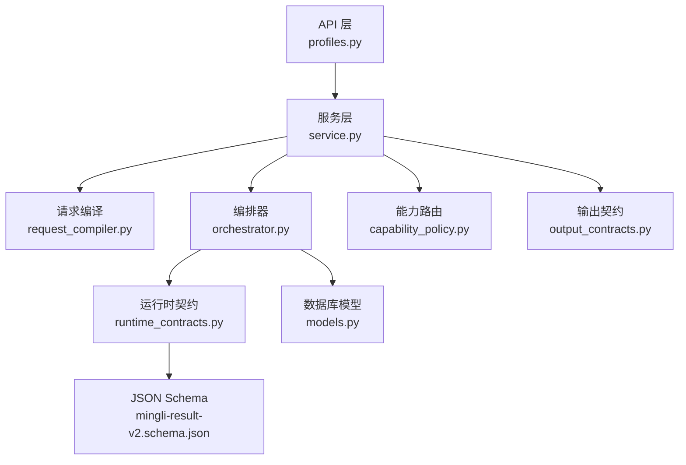
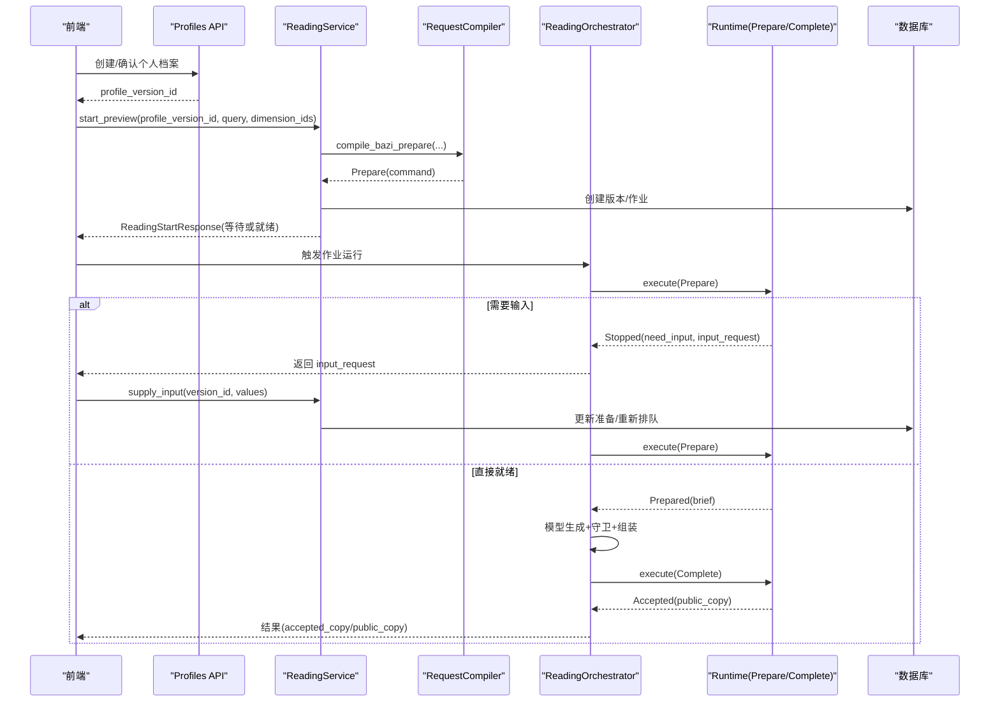
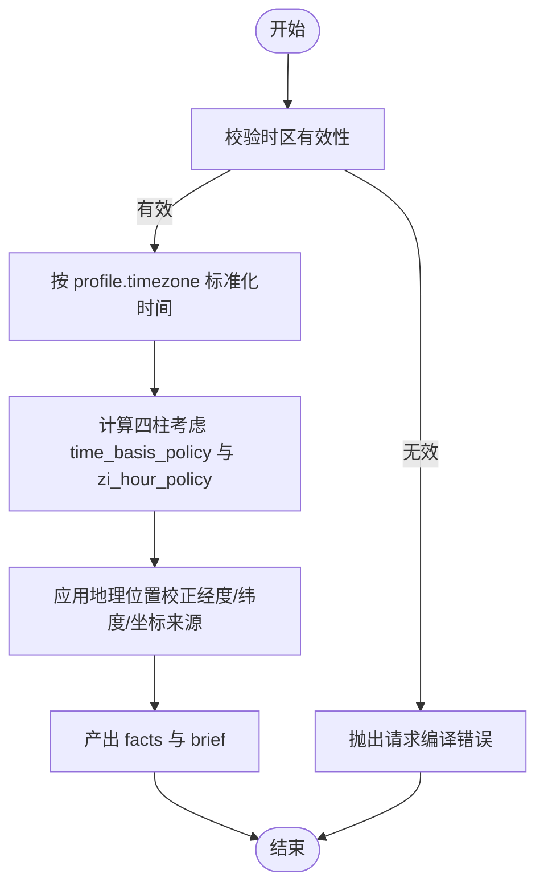
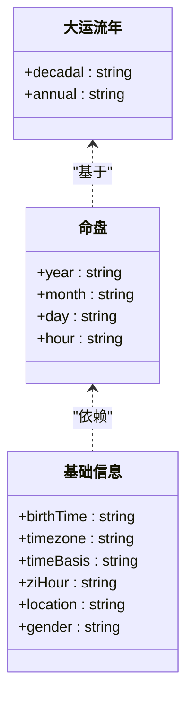
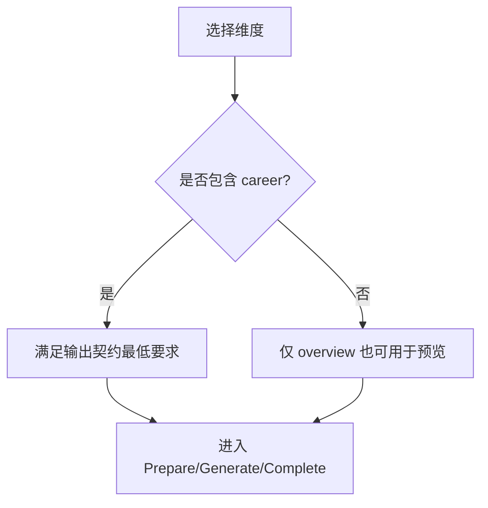
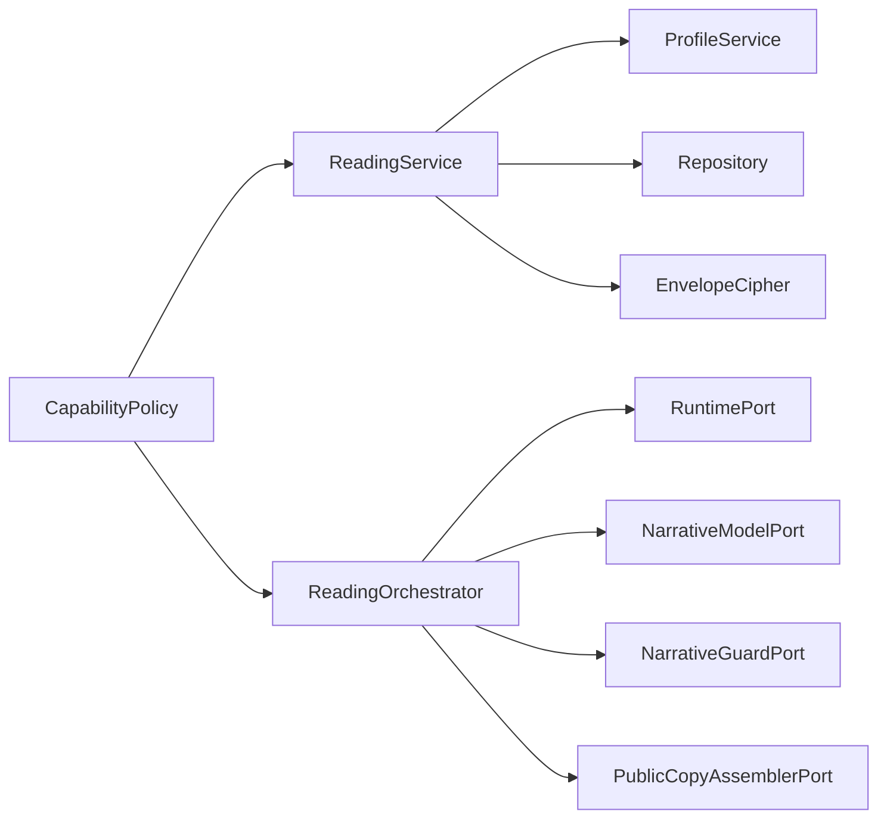

# 八字分析实现

<cite>
**本文引用的文件**
- [backend/app/readings/service.py](file://backend/app/readings/service.py)
- [backend/app/readings/orchestrator.py](file://backend/app/readings/orchestrator.py)
- [backend/app/readings/request_compiler.py](file://backend/app/readings/request_compiler.py)
- [backend/app/readings/capability_policy.py](file://backend/app/readings/capability_policy.py)
- [backend/app/readings/output_contracts.py](file://backend/app/readings/output_contracts.py)
- [backend/app/readings/runtime_contracts.py](file://backend/app/readings/runtime_contracts.py)
- [backend/app/readings/models.py](file://backend/app/readings/models.py)
- [backend/app/api/profiles.py](file://backend/app/api/profiles.py)
- [contracts/schemas/mingli-result-v2.schema.json](file://contracts/schemas/mingli-result-v2.schema.json)
- [web/src/lib/chart-workspace.ts](file://web/src/lib/chart-workspace.ts)
- [web/src/test/reading-display.test.ts](file://web/src/test/reading-display.test.ts)
</cite>

## 目录
1. [简介](#简介)
2. [项目结构](#项目结构)
3. [核心组件](#核心组件)
4. [架构总览](#架构总览)
5. [详细组件分析](#详细组件分析)
6. [依赖关系分析](#依赖关系分析)
7. [性能考量](#性能考量)
8. [故障排查指南](#故障排查指南)
9. [结论](#结论)
10. [附录](#附录)

## 简介
本文件面向“八字分析”能力，系统性说明从输入参数校验、数据处理到输出规范的完整实现。重点覆盖：
- 维度支持：overview（本命概览）、career（事业）
- 时间基准策略与子时处理机制
- 出生时间的时区转换与地理位置校正
- 命盘数据结构、四柱计算与大运流年推算的编排流程
- API 调用示例、错误处理模式与性能优化建议
- 结果结构化数据格式与前端展示要点

## 项目结构
后端以“服务层 + 编排器 + 运行时契约”的分层设计组织八字分析：
- 服务层负责用户意图解析、参数校验、持久化与调度
- 编排器驱动 Prepare/Complete 生命周期，协调模型生成与公共文案组装
- 运行时契约定义命令与结果的 JSON Schema，确保跨进程边界的数据一致性
- 能力路由将产品动作映射到具体能力（bazi/fortune/liuyao）及对象/时间范围
- 数据库模型记录版本、作业、尝试次数、已接受副本等关键状态

**图表来源**
- [backend/app/api/profiles.py:43-93](file://backend/app/api/profiles.py#L43-L93)
- [backend/app/readings/service.py:117-165](file://backend/app/readings/service.py#L117-L165)
- [backend/app/readings/request_compiler.py:96-126](file://backend/app/readings/request_compiler.py#L96-L126)
- [backend/app/readings/orchestrator.py:178-248](file://backend/app/readings/orchestrator.py#L178-L248)
- [backend/app/readings/runtime_contracts.py:113-155](file://backend/app/readings/runtime_contracts.py#L113-L155)
- [backend/app/readings/capability_policy.py:38-67](file://backend/app/readings/capability_policy.py#L38-L67)
- [backend/app/readings/output_contracts.py:10-19](file://backend/app/readings/output_contracts.py#L10-L19)
- [backend/app/readings/models.py:84-159](file://backend/app/readings/models.py#L84-L159)
- [contracts/schemas/mingli-result-v2.schema.json:1-392](file://contracts/schemas/mingli-result-v2.schema.json#L1-L392)

**章节来源**
- [backend/app/api/profiles.py:43-93](file://backend/app/api/profiles.py#L43-L93)
- [backend/app/readings/service.py:117-165](file://backend/app/readings/service.py#L117-L165)
- [backend/app/readings/request_compiler.py:96-126](file://backend/app/readings/request_compiler.py#L96-L126)
- [backend/app/readings/orchestrator.py:178-248](file://backend/app/readings/orchestrator.py#L178-L248)
- [backend/app/readings/runtime_contracts.py:113-155](file://backend/app/readings/runtime_contracts.py#L113-L155)
- [backend/app/readings/capability_policy.py:38-67](file://backend/app/readings/capability_policy.py#L38-L67)
- [backend/app/readings/output_contracts.py:10-19](file://backend/app/readings/output_contracts.py#L10-L19)
- [backend/app/readings/models.py:84-159](file://backend/app/readings/models.py#L84-L159)
- [contracts/schemas/mingli-result-v2.schema.json:1-392](file://contracts/schemas/mingli-result-v2.schema.json#L1-L392)

## 核心组件
- 服务层 ReadingService：负责启动预览（start_preview）、补充输入（supply_input）、获取摘要/结果、幂等控制、工作流推进
- 请求编译 RequestCompiler：将产品动作编译为 Prepare 命令，注入 subject_ref、intent、facts（含时间、地点、性别、时间口径、子时策略等）
- 编排器 ReadingOrchestrator：驱动 Prepare→Generate→Complete 的生命周期，处理重试、延迟、终止与接受
- 运行时契约 RuntimeContracts：定义 Prepare/Complete/Described/Prepared/Accepted/Stopped 的结构与 JSON Schema 校验
- 能力路由 CapabilityPolicy：将 action 映射到 capability_id、object_id、horizon_id，并限制 P0 暴露能力
- 输出契约 OutputContracts：限定语言、块数、字符上限、必需维度等
- 数据模型 Models：持久化 reading_versions、jobs、attempts、accepted_copies 等

**章节来源**
- [backend/app/readings/service.py:117-165](file://backend/app/readings/service.py#L117-L165)
- [backend/app/readings/request_compiler.py:96-126](file://backend/app/readings/request_compiler.py#L96-L126)
- [backend/app/readings/orchestrator.py:178-248](file://backend/app/readings/orchestrator.py#L178-L248)
- [backend/app/readings/runtime_contracts.py:113-155](file://backend/app/readings/runtime_contracts.py#L113-L155)
- [backend/app/readings/capability_policy.py:38-67](file://backend/app/readings/capability_policy.py#L38-L67)
- [backend/app/readings/output_contracts.py:10-19](file://backend/app/readings/output_contracts.py#L10-L19)
- [backend/app/readings/models.py:84-159](file://backend/app/readings/models.py#L84-L159)

## 架构总览
八字分析的端到端流程如下：
- 客户端通过 profiles API 创建并确认个人档案（包含出生时间、时区、地点、性别、时间口径、子时策略、经纬度等）
- 调用 start_preview 启动八字分析，服务层编译 Prepare 命令并持久化版本与工作项
- 编排器执行 Prepare，若需要输入则返回 input_request；否则进入模型生成阶段
- 模型生成后，经过 guard 校验与公共文案组装，最终 Complete 得到 Accepted 副本
- 前端根据 brief/facts 渲染命盘与基础信息，按维度（overview、career）展示

**图表来源**
- [backend/app/readings/service.py:129-165](file://backend/app/readings/service.py#L129-L165)
- [backend/app/readings/request_compiler.py:96-126](file://backend/app/readings/request_compiler.py#L96-L126)
- [backend/app/readings/orchestrator.py:212-285](file://backend/app/readings/orchestrator.py#L212-L285)
- [backend/app/readings/runtime_contracts.py:113-155](file://backend/app/readings/runtime_contracts.py#L113-L155)
- [backend/app/readings/models.py:84-159](file://backend/app/readings/models.py#L84-L159)

## 详细组件分析

### 输入参数验证与业务规则
- 维度白名单与唯一性校验：
  - 八字维度允许值：overview、career
  - 重复维度将被拒绝
- 时间与时区：
  - 服务器时间必须带时区；目标时区需为有效 IANA 名称
  - 参考时间会按 profile 的 timezone 进行转换
- 地理坐标：
  - longitude、latitude、coordinate_source 作为事实字段透传至运行时
- 子时策略与时间口径：
  - zi_hour_policy、time_basis_policy 作为事实字段参与后续计算
- 输入字段策略：
  - 对 runtime 返回的 input_request 中的字段类型、取值范围、选择集进行严格校验
  - 六爻抛掷值（如适用）限定为 6..9 的整数或数字硬币标记

**章节来源**
- [backend/app/readings/request_compiler.py:48-71](file://backend/app/readings/request_compiler.py#L48-L71)
- [backend/app/readings/request_compiler.py:96-126](file://backend/app/readings/request_compiler.py#L96-L126)
- [backend/app/readings/service.py:677-731](file://backend/app/readings/service.py#L677-L731)
- [backend/app/readings/service.py:751-786](file://backend/app/readings/service.py#L751-L786)

### 数据处理流程与时间基准策略
- 时间基准策略：
  - 通过 time_basis_policy 指定历法/时间口径（例如民用时等），由运行时在计算四柱时使用
- 子时处理机制：
  - 通过 zi_hour_policy 指定子时换日策略（如按午夜换日），影响时辰归属
- 时区转换：
  - 服务器时间使用 UTC，随后按 profile.timezone 转换为本地时间用于命理计算
- 地理位置校正：
  - 经度、纬度、坐标来源作为事实传入，供运行时进行真太阳时等校正（由运行时内部实现）

**图表来源**
- [backend/app/readings/request_compiler.py:62-71](file://backend/app/readings/request_compiler.py#L62-L71)
- [backend/app/readings/request_compiler.py:96-126](file://backend/app/readings/request_compiler.py#L96-L126)

**章节来源**
- [backend/app/readings/request_compiler.py:62-71](file://backend/app/readings/request_compiler.py#L62-L71)
- [backend/app/readings/request_compiler.py:96-126](file://backend/app/readings/request_compiler.py#L96-L126)

### 命盘数据结构、四柱与大运流年逻辑
- 命盘数据结构：
  - 四柱（年、月、日、时）以 facts/brief 中的结构化字段呈现，前端可据此渲染命盘
  - 基础信息包括 birthTime、timezone、timeBasis、ziHour、location、gender 等
- 四柱计算：
  - 由运行时依据 time_basis_policy 与 zi_hour_policy 计算，并以标准键名输出
- 大运与流年：
  - 大运/流年属于运行时计算范畴，服务端通过 Prepare/Complete 编排其生成与接受
  - 前端通过读取 brief/facts 中的相关字段进行展示

**图表来源**
- [web/src/lib/chart-workspace.ts:97-119](file://web/src/lib/chart-workspace.ts#L97-L119)
- [web/src/test/reading-display.test.ts:121-142](file://web/src/test/reading-display.test.ts#L121-L142)

**章节来源**
- [web/src/lib/chart-workspace.ts:97-119](file://web/src/lib/chart-workspace.ts#L97-L119)
- [web/src/test/reading-display.test.ts:121-142](file://web/src/test/reading-display.test.ts#L121-L142)

### 维度支持与业务规则
- overview（本命概览）：
  - 用于 profile_preview 场景，默认维度之一
  - 结合能力路由映射到 bazi 能力与 natal 对象、life 时间范围
- career（事业）：
  - 通用维度，可用于八字与运势等多能力
  - 输出契约要求至少包含 career 维度（preview-v1）

**图表来源**
- [backend/app/readings/capability_policy.py:38-49](file://backend/app/readings/capability_policy.py#L38-L49)
- [backend/app/readings/output_contracts.py:10-19](file://backend/app/readings/output_contracts.py#L10-L19)
- [backend/app/readings/request_compiler.py:10-13](file://backend/app/readings/request_compiler.py#L10-L13)

**章节来源**
- [backend/app/readings/capability_policy.py:38-49](file://backend/app/readings/capability_policy.py#L38-L49)
- [backend/app/readings/output_contracts.py:10-19](file://backend/app/readings/output_contracts.py#L10-L19)
- [backend/app/readings/request_compiler.py:10-13](file://backend/app/readings/request_compiler.py#L10-L13)

### API 调用示例
- 创建/确认个人档案：
  - POST /api/v1/profiles/drafts → 创建草稿
  - POST /api/v1/profiles/drafts/{draft_id}/confirm → 确认并生成 profile_version_id
- 启动八字预览：
  - 调用服务层 start_preview，传入 profile_version_id、可选 query、dimension_ids（如 ["overview","career"]）
- 补充输入（如需）：
  - 当编排器返回 need_input 时，调用 supply_input 提交 values
- 获取结果：
  - 查询 ReadingResultResponse，包含 accepted_copy、fact_panel、verification、input_request 等

**章节来源**
- [backend/app/api/profiles.py:43-93](file://backend/app/api/profiles.py#L43-L93)
- [backend/app/readings/service.py:129-165](file://backend/app/readings/service.py#L129-L165)
- [backend/app/readings/service.py:256-292](file://backend/app/readings/service.py#L256-L292)
- [backend/app/readings/service.py:318-344](file://backend/app/readings/service.py#L318-L344)

### 错误处理模式
- 请求编译错误：
  - 维度不在白名单、重复维度、时区无效、服务器时间无时区等
- 运行时契约校验失败：
  - Prepare/Complete/Described/Prepared/Accepted/Stopped 不符合 JSON Schema
- 服务层错误：
  - 未找到阅读版本、非等待输入状态、重复幂等键冲突、运行时不可用等
- 编排器异常：
  - 传输错误导致延迟重试、达到最大尝试次数后延迟、守卫拒绝等

**章节来源**
- [backend/app/readings/request_compiler.py:16-13](file://backend/app/readings/request_compiler.py#L16-L13)
- [backend/app/readings/runtime_contracts.py:23-39](file://backend/app/readings/runtime_contracts.py#L23-L39)
- [backend/app/readings/service.py:45-79](file://backend/app/readings/service.py#L45-L79)
- [backend/app/readings/orchestrator.py:250-285](file://backend/app/readings/orchestrator.py#L250-L285)
- [backend/app/readings/orchestrator.py:287-394](file://backend/app/readings/orchestrator.py#L287-L394)

### 性能优化建议
- 幂等键：
  - 使用 idempotency_key 避免重复提交，降低网络抖动带来的副作用
- 重试与退避：
  - Prepare/Complete 遇到传输错误时采用退避重试，减少瞬时失败影响
- 最大尝试次数：
  - 限制模型生成尝试次数，避免长时间阻塞；超限后进入延迟队列
- 输出契约约束：
  - 通过 max_output_chars、max_blocks 限制响应大小，提升吞吐
- 数据库索引：
  - 作业表针对 active 状态建立索引，提高领取效率

**章节来源**
- [backend/app/readings/service.py:597-620](file://backend/app/readings/service.py#L597-L620)
- [backend/app/readings/orchestrator.py:178-195](file://backend/app/readings/orchestrator.py#L178-L195)
- [backend/app/readings/orchestrator.py:287-394](file://backend/app/readings/orchestrator.py#L287-L394)
- [backend/app/readings/output_contracts.py:10-19](file://backend/app/readings/output_contracts.py#L10-L19)
- [backend/app/readings/models.py:247-291](file://backend/app/readings/models.py#L247-L291)

## 依赖关系分析
- 服务层依赖：
  - ProfileService（读取已确认的个人档案版本）
  - Repository（持久化版本、作业、幂等键等）
  - EnvelopeCipher（加密敏感字段）
- 编排器依赖：
  - RuntimePort（执行 Prepare/Complete）
  - NarrativeModelPort（模型生成）
  - NarrativeGuardPort（内容守卫）
  - PublicCopyAssemblerPort（公共文案组装）
- 能力路由：
  - 将 action 映射到 capability_id/object_id/horizon_id，限制 P0 暴露能力

**图表来源**
- [backend/app/readings/service.py:117-128](file://backend/app/readings/service.py#L117-L128)
- [backend/app/readings/orchestrator.py:178-195](file://backend/app/readings/orchestrator.py#L178-L195)
- [backend/app/readings/capability_policy.py:38-67](file://backend/app/readings/capability_policy.py#L38-L67)

**章节来源**
- [backend/app/readings/service.py:117-128](file://backend/app/readings/service.py#L117-L128)
- [backend/app/readings/orchestrator.py:178-195](file://backend/app/readings/orchestrator.py#L178-L195)
- [backend/app/readings/capability_policy.py:38-67](file://backend/app/readings/capability_policy.py#L38-L67)

## 性能考量
- 幂等与去重：
  - 通过 HMAC 指纹与唯一约束避免重复执行
- 异步与并发：
  - 使用异步会话与作业队列，提升吞吐
- 资源限制：
  - 输出契约限制字符与块数，防止大响应拖慢链路
- 重试与背压：
  - 传输错误退避，超限延迟，保护下游服务

[本节提供通用指导，不直接分析具体文件]

## 故障排查指南
- 常见错误定位：
  - 维度非法：检查 dimension_ids 是否在白名单
  - 时区无效：确认 IANA 时区名称正确
  - 输入字段不符：对照 input_request 的要求与 values
  - 运行时未知：Prepare 无 state_token 且传输失败，进入 RUNTIME_UNKNOWN
  - 生成耗尽：达到最大尝试次数，进入 DELAYED
- 日志与告警：
  - 编排器会发出 guard_rejection、delayed、model_cost 等事件，便于追踪

**章节来源**
- [backend/app/readings/service.py:677-731](file://backend/app/readings/service.py#L677-L731)
- [backend/app/readings/orchestrator.py:250-285](file://backend/app/readings/orchestrator.py#L250-L285)
- [backend/app/readings/orchestrator.py:287-394](file://backend/app/readings/orchestrator.py#L287-L394)

## 结论
本项目以严谨的契约与分层架构实现了八字分析的全流程：从输入校验、时间基准与子时策略，到命盘数据结构的传递与展示，再到编排器驱动的生成与接受。通过能力路由与输出契约，系统在保证一致性的同时具备良好的扩展性与性能表现。

[本节总结性内容，不直接分析具体文件]

## 附录

### 结果结构与前端展示要点
- 结果结构：
  - prepared：包含 state_token 与 brief（question、vocabulary、facts、evidence、findings、claim_scopes、limits、prior_answer、request_view）
  - accepted：包含 state_token 与 public_copy
  - stopped：need_input 或终端停止原因
- 前端展示：
  - 基础信息行：出生时间、时区、时间口径、子时策略、地点、性别、日主、月令、目标日期/周期、历法口径
  - 命盘四柱：year/month/day/hour
  - 大运/流年：当存在时显示对应层状态与摘要

**章节来源**
- [contracts/schemas/mingli-result-v2.schema.json:262-337](file://contracts/schemas/mingli-result-v2.schema.json#L262-L337)
- [web/src/lib/chart-workspace.ts:97-119](file://web/src/lib/chart-workspace.ts#L97-L119)
- [web/src/test/reading-display.test.ts:121-142](file://web/src/test/reading-display.test.ts#L121-L142)